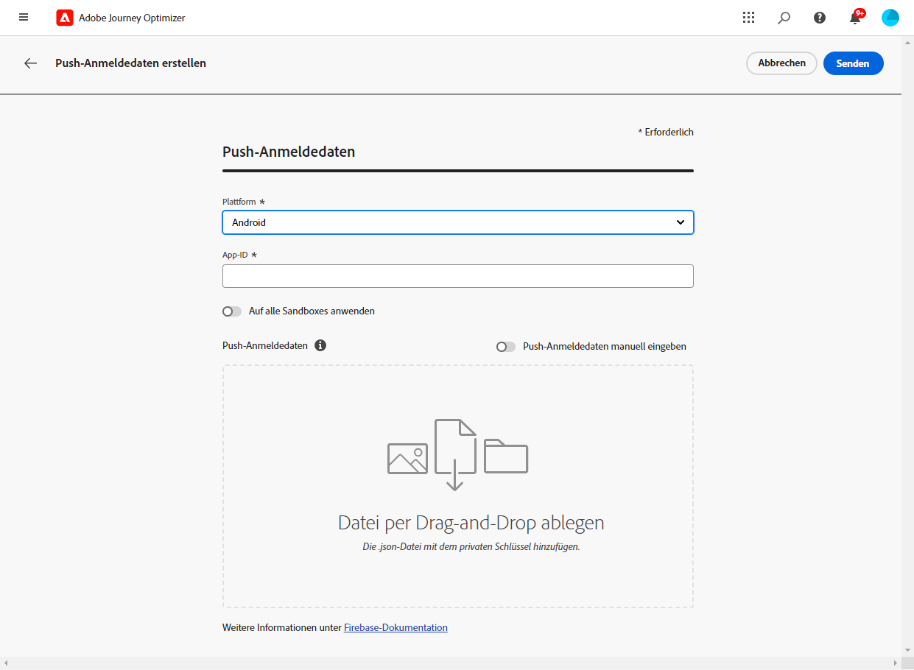
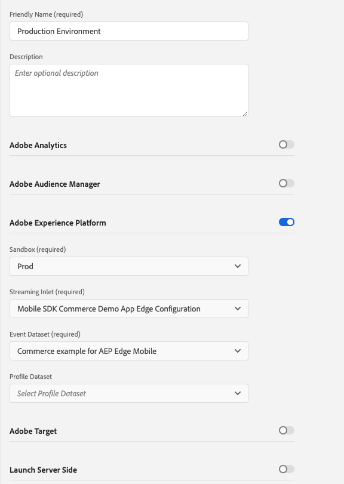
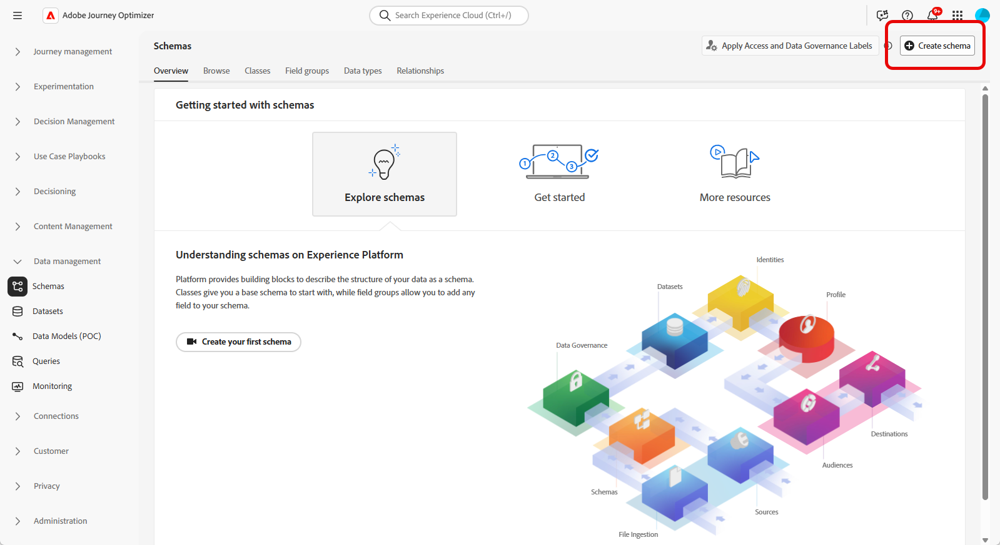
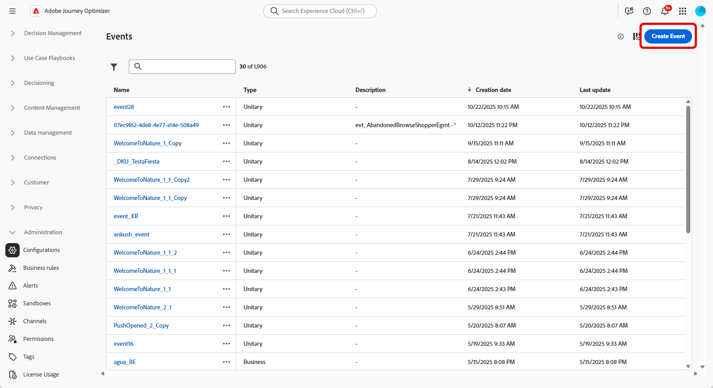
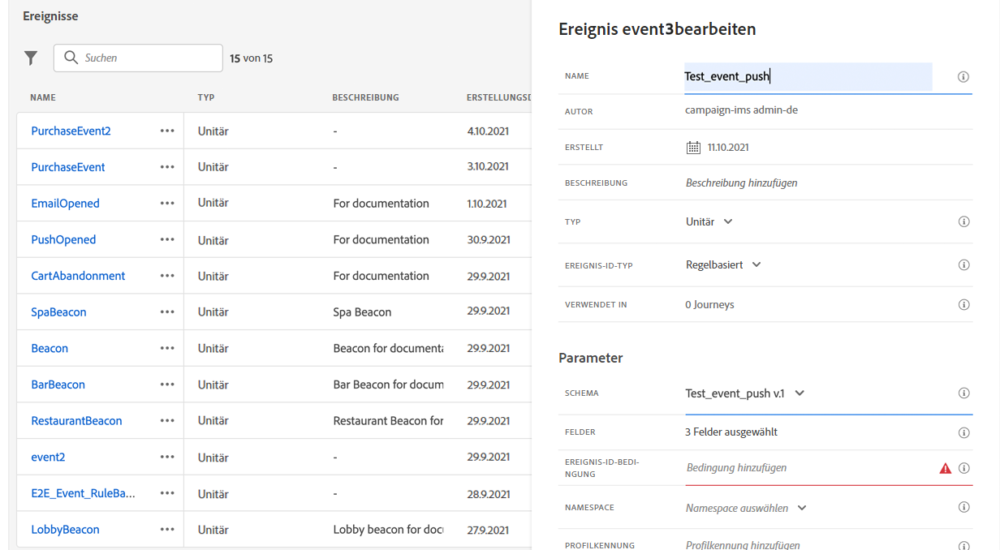

# Konfigurieren des Kanals für Push-Benachrichtigungen {#push-notification-configuration}

[!DNL Journey Optimizer] ermöglicht es Ihnen, Journeys zu erstellen und Nachrichten an eine ausgewählte Zielgruppe zu senden. Bevor Sie mit dem Versand von Push-Benachrichtigungen über [!DNL Journey Optimizer] beginnen, müssen Sie sicherstellen, dass in der Mobile App und für Tags in Adobe Experience Platform Konfigurationen und Integrationen vorhanden sind. Informationen zum Datenfluss von Push-Benachrichtigungen in [!DNL Adobe Journey Optimizer] finden Sie auf [dieser Seite](push-gs.md).

>[!AVAILABILITY]
>
>Der neue **Schnellstart-Workflow für Mobile-Onboarding** ist jetzt verfügbar. Verwenden Sie diese neue Produktfunktion, um das Mobile SDK schnell so zu konfigurieren, dass es mit der Erfassung und Validierung von Mobile-Ereignisdaten und dem Senden von Mobile-Push-Benachrichtigungen beginnt. Auf diese Funktion kann über die Startseite der Datenerfassung als öffentliche Beta-Version zugegriffen werden. [Weitere Informationen](mobile-onboarding-wf.md)
>


## Bevor Sie beginnen {#before-starting}

<!--
### Check provisioning

Your Adobe Experience Platform account must be provisioned to contain following schemas and datasets for push notification data flow to function correctly:

| Schema <br>Dataset                                                                       | Group of fields                                                                                                                                                                         | Operation                                                |
| -------------------------------------------------------------------------------------- | --------------------------------------------------------------------------------------------------------------------------------------------------------------------------------------- | -------------------------------------------------------- |
| CJM Push Profile Schema <br>CJM Push Profile Dataset                                     | Push Notification Details<br>Adobe CJM ExperienceEvent - Message Profile Details<br>Adobe CJM ExperienceEvent - Message Execution Details<br>Application Details<br>Environment Details | Register Push Token                                      |
| CJM Push Tracking Experience Event Schema<br>CJM Push Tracking Experience Event Dataset | Push Notification Tracking                                                                                                                                                              | Track interactions and provide data for the reporting UI |
-->

### Berechtigungen einrichten {#setup-permissions}

Bevor Sie eine Mobile App erstellen, müssen Sie zunächst sicherstellen, dass Sie für Tags in Adobe Experience Platform die richtigen Benutzerberechtigungen haben oder diese zuweisen. Weitere Informationen finden Sie in der [Dokumentation zu Tags](https://experienceleague.adobe.com/docs/experience-platform/tags/admin/user-permissions.html?lang=de){target="_blank"}.

>[!CAUTION]
>
>Die Konfiguration für Push-Benachrichtigungen muss von einem erfahrenen Benutzer durchgeführt werden. Abhängig von Ihrem Implementierungsmodell und den an dieser Implementierung beteiligten Rollen müssen Sie möglicherweise den gesamten Berechtigungssatz einem einzelnen Produktprofil zuweisen oder Berechtigungen zwischen dem App-Entwickler und dem **Adobe Journey Optimizer**-Administrator aufteilen. Weitere Informationen zu Berechtigungen für **Tags** finden Sie in [dieser Dokumentation](https://experienceleague.adobe.com/docs/experience-platform/tags/admin/user-permissions.html?lang=de){target="_blank"}.

<!--ou need to your have access to perform following roles :

* Manage Datastreams
* Manage Client-side Properties
* Manage App Configurations
-->

Gehen Sie wie folgt vor, um die Rechte für **Eigenschaft** und **Unternehmen** zuzuweisen:

1. Greifen Sie auf **[!DNL Admin Console]** zu.

1. Wählen Sie auf der Registerkarte **[!UICONTROL Produkte]** die Karte **[!UICONTROL Datenerfassung in Adobe Experience Platform]** aus.

   

1. Wählen Sie ein vorhandenes **[!UICONTROL Produktprofil]** aus oder erstellen Sie mit der Schaltfläche **[!UICONTROL Neues Profil]** ein neues. Wie Sie ein **[!UICONTROL neues Profil]** erstellen, erfahren Sie in der [Dokumentation zur Admin Console](https://experienceleague.adobe.com/docs/experience-platform/access-control/ui/create-profile.html?lang=de#ui){target="_blank"}.

1. Wählen Sie auf der Registerkarte **[!UICONTROL Berechtigungen]** die Option **[!UICONTROL Eigenschaftenrechte]**.

   

1. Klicken Sie auf **[!UICONTROL Alle hinzufügen]**. Dadurch werden Ihrem Produktprofil die folgenden Rechte hinzugefügt:
   * **[!UICONTROL Genehmigen]**
   * **[!UICONTROL Entwickeln]**
   * **[!UICONTROL Umgebungen verwalten]**
   * **[!UICONTROL Erweiterungen verwalten]**
   * **[!UICONTROL Veröffentlichen]**

   Diese Berechtigungen sind erforderlich, um die Adobe Journey Optimizer-Erweiterung zu installieren und zu veröffentlichen und die App-Eigenschaft im Adobe Experience Platform Mobile SDK zu veröffentlichen.

1. Wählen Sie dann im Menü links **[!UICONTROL Unternehmensrechte]**.

   

1. Fügen Sie die folgenden Rechte hinzu:

   * **[!UICONTROL Mobile-App-Konfigurationen verwalten]**
   * **[!UICONTROL Eigenschaften verwalten]**

   Diese Berechtigungen sind für den Entwickler der mobilen App erforderlich, um Push-Anmeldeinformationen für die **Datenerfassung in Adobe Experience Platform** einzurichten und Oberflächen für Push-Benachrichtigungskanäle (d. h. Nachrichtenvoreinstellungen) in **Adobe Journey Optimizer** zu definieren.

   

1. Klicken Sie auf **[!UICONTROL Speichern]**.

Gehen Sie wie folgt vor, um Benutzern dieses **[!UICONTROL Produktprofil]** zuzuweisen:

1. Greifen Sie auf **[!DNL Admin Console]** zu.

1. Wählen Sie auf der Registerkarte **[!UICONTROL Produkte]** die Karte **[!UICONTROL Datenerfassung in Adobe Experience Platform]** aus.

1. Wählen Sie Ihr zuvor konfiguriertes **[!UICONTROL Produktprofil]** aus.

1. Klicken Sie auf der Registerkarte **[!UICONTROL Benutzer]** auf **[!UICONTROL Benutzer hinzufügen]**.

   

1. Geben Sie den Namen oder die E-Mail-Adresse Ihres Benutzers ein und wählen Sie den Benutzer aus. Klicken Sie dann auf **[!UICONTROL Speichern]**.

   >[!NOTE]
   >
   >Wenn der Benutzer vorher noch nicht in der Admin Console erstellt wurde, lesen Sie die [Dokumentation zum Hinzufügen von Benutzern](https://helpx.adobe.com/de/enterprise/admin-guide.html/enterprise/using/manage-users-individually.ug.html#add-users).

   

### App konfigurieren {#configure-app}

Die technische Einrichtung erfordert eine enge Zusammenarbeit zwischen dem App-Entwickler und dem Business-Administrator. Bevor Sie mit dem Versand von Push-Benachrichtigungen über [!DNL Journey Optimizer] beginnen, müssen Sie die Einstellungen in [!DNL Adobe Experience Platform Data Collection] definieren und Ihre Mobile App mit Adobe Experience Platform Mobile SDKs integrieren.

Folgen Sie den Implementierungsschritten, die in den folgenden Links beschrieben werden:

* Für **Apple iOS**: Erfahren Sie in der [Apple-Dokumentation](https://developer.apple.com/documentation/usernotifications/registering_your_app_with_apns){target="_blank"}, wie Sie Ihre App mit APNs registrieren
* Für **Google Android**: In der [Google-Dokumentation](https://firebase.google.com/docs/cloud-messaging/android/client)erfahren Sie, wie Sie eine Firebase Cloud Messaging-Client-App unter Android einrichten{target="_blank"}

### Integrieren Ihrer Mobile App mit dem Adobe Experience Platform SDK {#integrate-mobile-app}

Das Adobe Experience Platform Mobile-SDK stellt über Android- und iOS-kompatible SDKs Client-seitige Integrations-APIs für Ihre Mobile Apps bereit. Folgen Sie der [Dokumentation zum Adobe Experience Platform Mobile SDK](https://developer.adobe.com/client-sdks/documentation/getting-started/){target="_blank"}, um die Einrichtung in Ihrer App mit Adobe Experience Platform Mobile SDKs durchzuführen.

Am Ende dieses Vorgangs sollten Sie auch eine mobile Property in [!DNL Adobe Experience Platform Data Collection] erstellt und konfiguriert haben. Normalerweise wird für jede Mobile App, die verwaltet werden soll, eine Mobile Property erstellt. In der [Dokumentation zum Adobe Experience Platform Mobile SDK](https://developer.adobe.com/client-sdks/documentation/getting-started/create-a-mobile-property/){target="_blank"} erfahren Sie, wie Sie eine Mobile-Eigenschaft erstellen und konfigurieren.


## Schritt 1: Fügen Sie die Push-Anmeldeinformationen Ihrer Mobile App in Adobe Experience Platform Data Collection hinzu. {#push-credentials-launch}

Nachdem Sie die richtigen Benutzerberechtigungen erteilt haben, müssen Sie jetzt Ihre Push-Anmeldedaten für Mobile Apps in [!DNL Adobe Experience Platform Data Collection] hinzufügen.

Die Registrierung der Push-Anmeldedaten für Mobile Apps ist erforderlich, um Adobe zu erlauben, Push-Benachrichtigungen in Ihrem Namen zu senden. Gehen Sie wie folgt vor:

1. Wählen Sie in [!DNL Adobe Experience Platform Data Collection] im linken Panel die Registerkarte **[!UICONTROL App-Oberflächen]**.

1. Klicken Sie auf **[!UICONTROL App-Oberfläche erstellen]**, um eine neue Konfiguration zu erstellen.

   

1. Geben Sie einen **[!UICONTROL Namen]** für die Konfiguration ein.

1. Wählen Sie unter **[!UICONTROL Konfiguration von Mobile Apps]** das Betriebssystem aus:

   * **Für iOS**

     

      1. Geben Sie die **Bundle ID** der Mobile App im Feld **[!UICONTROL App-ID (iOS Bundle ID)]** ein. Die Bundle ID der App finden Sie auf der Registerkarte **Allgemein** des primären Ziels in **XCode**.

      1. Aktivieren Sie die Schaltfläche **[!UICONTROL Push-Anmeldeinformationen]**, um Ihre Anmeldeinformationen hinzuzufügen.

      1. Ziehen Sie die p8-Datei mit dem Apple-Authentifizierungsschlüssel für Push-Benachrichtigungen per Drag-and-Drop in den Arbeitsbereich. Dieser Schlüssel kann von der Seite **Zertifikate**, **Kennungen** und **Profile** abgerufen werden.

      1. Geben Sie die **Key ID** an. Dies ist eine 10-stellige Zeichenfolge, die bei der Erstellung des p8-Authentifizierungsschlüssels zugewiesen wurde. Sie finden sie auf der Registerkarte **Schlüssel** auf der Seite **Zertifikate**, **Kennungen** und **Profile**.

      1. Geben Sie die **Team ID** an. Dies ist ein Zeichenfolgenwert, der auf der Registerkarte „Abonnement“ zu finden ist.

   * **Für Android**

     

      1. Geben Sie die **[!UICONTROL App-ID (Android-Package-Name)]** an: Normalerweise ist der Package-Name die App-ID in Ihrer `build.gradle`-Datei.

      1. Aktivieren sie die Schaltfläche **[!UICONTROL Push-Anmeldeinformationen]**, um Ihre Anmeldeinformationen hinzuzufügen.

      1. Legen Sie die FCM-Push-Anmeldeinformationen per Drag-and-Drop ab. Weitere Informationen zum Abrufen der Push-Anmeldeinformationen finden Sie in der [Google-Dokumentation](https://firebase.google.com/docs/admin/setup#initialize-sdk){target="_blank"}.


1. Klicken Sie auf **[!UICONTROL Speichern]**, um Ihre Mobile-App-Konfiguration zu erstellen.

<!--
## Step 2: Set up a mobile property in Adobe Experience Platform Launch {#launch-property}

Setting up a mobile property allows the mobile app developer or marketer to configure the mobile SDKs attributes such as Session Timeouts, the [!DNL Adobe Experience Platform] sandbox to be targeted and the **[!UICONTROL Adobe Experience Platform Datasets]** to be used for mobile SDK to send data to.

For further details and procedures on how to set up a **[!UICONTROL Platform Launch property]**, refer to the steps detailed in [Adobe Experience Platform Mobile SDK documentation](https://aep-sdks.gitbook.io/docs/getting-started/create-a-mobile-property#create-a-mobile-property).


To get the SDKs needed for push notification to work you will need the following SDK extensions, for both Android and iOS:

* **[!UICONTROL Mobile Core]** (installed automatically)
* **[!UICONTROL Profile]** (installed automatically)
* **[!UICONTROL Adobe Experience Platform Edge]**
* **[!UICONTROL Adobe Experience Platform Assurance]**, optional but recommended to debug the mobile implementation.

Learn more about [!DNL Adobe Experience Platform Launch] extensions in [Adobe Experience Platform Launch documentation](https://experienceleague.adobe.com/docs/launch-learn/implementing-in-mobile-android-apps-with-launch/configure-launch/launch-add-extensions.html).
-->

## Schritt 2: Adobe Journey Optimizer-Erweiterung in Ihrer Mobile-Eigenschaft konfigurieren {#configure-journey-optimizer-extension}

Die **Adobe Journey Optimizer-Erweiterung** für Adobe Experience Platform Mobile SDKs unterstützt Push-Benachrichtigungen für Ihre Mobile Apps und hilft Ihnen bei der Erfassung von Benutzer-Push-Token und der Verwaltung der Interaktionsmessung mit Adobe Experience Platform-Services.

Wie Sie die Journey Optimizer-Erweiterung einrichten, erfahren Sie in der [Dokumentation zum Adobe Experience Platform Mobile SDK](https://developer.adobe.com/client-sdks/documentation/adobe-journey-optimizer/){target="_blank"}.


<!-- 
**[!UICONTROL Edge configuration]** is used by **[!UICONTROL Edge]** extension to send custom data from mobile device to [!DNL Adobe Experience Platform]. 
To configure [!DNL Adobe Experience Platform], you must provide the **[!UICONTROL Sandbox]** name and **[!UICONTROL Event Dataset]**.

1. From [!DNL Adobe Experience Platform Launch], select the **[!UICONTROL Edge Configurations]** tab and click **[!UICONTROL Edge Configurations]**.
    
1. Select **[!UICONTROL New Edge Configuration]** to add a new **[!UICONTROL Edge Configuration]**.
1. Enter a **[!UICONTROL Name]** and click **[!UICONTROL Save]**

1. Click the **[!UICONTROL Adobe Experience Platform]** toggle to enable it.

1. Fill in the **[!UICONTROL Sandbox]**, **[!UICONTROL Event dataset]** and **[!UICONTROL Profile Dataset]** fields. Then, click **[!UICONTROL Save]**.
    
    


1. From [!DNL Adobe Experience Platform Launch], ensure that **[!UICONTROL Client Side]** is selected in the drop-down menu.

1. select the **[!UICONTROL Properties]** tab and click **[!UICONTROL New Property]**.

    

1. Enter a **[!UICONTROL Name]** for your new property.

1. Select **[!UICONTROL Mobile]** as **[!UICONTROL Platform]**.

    

1. Click **[!UICONTROL Save]** to create your new property.

To configure **[!UICONTROL Adobe Experience Platform Edge Extension]** to send custom data from mobile devices to [!DNL Adobe Experience Platform].

1. Select your previously created property and select the **[!UICONTROL Extensions]** tab to view the extensions for this property.

    

1. Click **[!UICONTROL Configure]** under the **[!UICONTROL Adobe Experience Platform Edge]** Network' extension.

1. From the **[!UICONTROL Edge Configuration]** drop-down list, select the **[!UICONTROL Edge Configuration]** created in the previous steps. For more information on **[!UICONTROL Edge Configuration]**, refer to this [section](#edge-configuration).

1. Click **[!UICONTROL Save]**.

To configure **[!UICONTROL Adobe Experience Platform Messaging]** extension to send push profile and push interactions to the correct datasets, follow the same steps as above. Use **[!UICONTROL Sandbox]**, **[!UICONTROL Event dataset]** and **[!UICONTROL Profile Dataset]** created in the [Adobe Experience Platform setup](#edge-configuration).
-->

<!--
## Step 4: Publish the Property {#publish-property}

You now need to publish the property to integrate your configuration and to use it in the mobile app. 

To publish your property, refer to the steps detailed in [Adobe Experience Platform Mobile SDK documentation](https://aep-sdks.gitbook.io/docs/getting-started/create-a-mobile-property#publish-the-configuration)

## Step 5: Configure the ProfileDataSource {#configure-profiledatasource}

To configure the `ProfileDataSource`, use the `ProfileDCInletURL` from [!DNL Adobe Experience Platform] setup and add the following in the mobile app:

```
    MobileCore.updateConfiguration(
    mutableMapOf("messaging.dccs" to <ProfileDCSInletURL>)
```

-->

## Schritt 3: Testen Sie Ihre Mobile App mit einem Ereignis {#mobile-app-test}

Nachdem Sie Ihre Mobile App sowohl in Adobe Experience Platform als auch in [!DNL Adobe Experience Platform Data Collection] konfiguriert haben, können Sie sie nun testen, bevor Sie Push-Benachrichtigungen an Ihre Profile senden. In diesem Anwendungsbeispiel erstellen wir eine Journey, in der unsere Mobile App als Ziel ausgewählt und ein Ereignis festgelegt wird, das die Push-Benachrichtigung auslöst.

<!--
You can use a test mobile app for this use case. For more on this, refer to this [page](https://wiki.corp.adobe.com/pages/viewpage.action?spaceKey=CJM&title=Details+of+setting+the+mobile+test+app) (internal use only).
-->

Damit diese Journey funktioniert, müssen Sie ein XDM-Schema erstellen. Weitere Informationen finden Sie in der [Dokumentation zu XDM](https://experienceleague.adobe.com/docs/experience-platform/xdm/schema/composition.html?lang=de#schemas-and-data-ingestion){target="_blank"}.

1. Klicken Sie im Menüabschnitt „DATEN-MANAGEMENT“ auf **[!UICONTROL Schemata]**.
   
1. Klicken Sie auf **[!UICONTROL Schema erstellen]**, wählen Sie oben rechts die Option **[!UICONTROL Erlebnisereignis]** und klicken Sie auf **Weiter**.
   
1. Geben Sie einen Namen und eine Beschreibung für Ihr Schema ein und klicken Sie auf **Beenden**.
   
1. Klicken Sie im Abschnitt **Feldergruppen** links auf **Hinzufügen** und dann auf **[!UICONTROL Neue Feldergruppe erstellen]**.

1. Geben Sie einen **[!UICONTROL Anzeigenamen]** und eine **[!UICONTROL Beschreibung]** ein. Klicken Sie abschließend auf **[!UICONTROL Feldergruppen hinzufügen]**. Weitere Informationen zum Erstellen von Feldergruppen finden Sie in der [XDM-Systemdokumentation](https://experienceleague.adobe.com/docs/experience-platform/xdm/tutorials/create-schema-ui.html?lang=de){target="_blank"}.


   

1. Wählen Sie auf der linken Seite das Schema aus. Aktivieren Sie im rechten Bereich dieses Schema für **[!UICONTROL Profil]**.

   


1. Wählen Sie auf der linken Seite die Feldergruppe aus und klicken Sie dann auf das Symbol + , um ein neues Feld zu erstellen. Geben Sie in die **[!UICONTROL Feldergruppen-Eigenschaften]** auf der rechten Seite einen **[!UICONTROL Feldnamen]** und einen **[!UICONTROL Anzeigenamen]** ein und wählen Sie **[!UICONTROL Zeichenfolge]** als **[!UICONTROL Typ]** aus.

   

1. Markieren Sie **[!UICONTROL Erforderlich]** und klicken Sie auf **[!UICONTROL Anwenden]**.

1. Klicken Sie auf **[!UICONTROL Speichern]**. Ihr Schema wurde erstellt und kann nun in einem Ereignis verwendet werden.

Anschließend müssen Sie ein Ereignis einrichten.

1. Wählen Sie im linken Menü der Startseite unter ADMINISTRATION **[!UICONTROL Konfigurationen]** aus. Klicken Sie auf **[!UICONTROL Verwalten]** im Abschnitt **[!UICONTROL Ereignisse]**, um Ihr neues Ereignis zu erstellen.

1. Klicken Sie auf **[!UICONTROL Ereignis erstellen]**. Der Bereich für die Ereigniskonfiguration wird auf der rechten Seite des Bildschirms geöffnet.

   

1. Geben Sie den Namen Ihres Ereignisses ein. Sie können auch eine Beschreibung hinzufügen.

1. Wählen Sie im Feld **[!UICONTROL Ereignis-ID-Typ]** die Option **[!UICONTROL Regelbasiert]** aus.

1. Wählen Sie im Abschnitt **[!UICONTROL Parameter]** Ihr zuvor erstelltes Schema aus.

   

1. Überprüfen Sie in der Feldliste, ob das in der Schemafeldergruppe erstellte Feld ausgewählt ist.

   

1. Klicken Sie im Feld **[!UICONTROL Ereignis-ID-Bedingung]** auf **[!UICONTROL Bearbeiten]**. Ziehen Sie das zuvor hinzugefügte Feld per Drag-and-Drop hinüber, um zu definieren, welche Bedingung vom System zur Identifikation der Ereignisse verwendet wird, die Ihre Journey auslösen sollen.

   

1. Geben Sie die Syntax ein, die Sie zum Auslösen Ihrer Push-Benachrichtigung in Ihrer Test-App benötigen, in diesem Beispiel **Bestellbestätigung**.

   

1. Wählen Sie **[!UICONTROL ECID]** als **[!UICONTROL Namespace]** aus.

1. Klicken Sie auf **[!UICONTROL OK]** und danach auf **[!UICONTROL Speichern]**.

Ihr Ereignis wurde erstellt und kann jetzt in einer Journey verwendet werden.

1. Klicken Sie im linken Menü auf **[!UICONTROL Journeys]**.

1. Klicken Sie auf **[!UICONTROL Journey Erstellen]**, um eine neue Journey zu erstellen.

1. Bearbeiten Sie im Konfigurationsbereich auf der rechten Seite die Eigenschaften der Journey. Weiterführende Informationen finden Sie in diesem [Abschnitt](../building-journeys/journey-gs.md#change-properties).

1. Ziehen Sie zunächst das in den vorherigen Schritten erstellte Ereignis per Drag-and-Drop aus der Dropdown-Liste **[!UICONTROL Ereignisse]**.

   

1. Ziehen Sie aus der Dropdown-Liste **[!UICONTROL Aktionen]** die Aktivität **[!UICONTROL Push]** per Drag-and-Drop auf Ihre Journey.

1. Konfigurieren Sie die Push-Benachrichtigung. Weiterführende Informationen zum Erstellen von Push-Benachrichtigungen finden Sie auf dieser [Seite](create-push.md).

1. Klicken Sie auf den Umschalter **[!UICONTROL Test]**, um mit dem Testen Ihrer Push-Benachrichtigungen zu beginnen, und danach auf **[!UICONTROL Ereignis auslösen]**.

   

1. Geben Sie im Feld **[!UICONTROL Schlüssel]** Ihre ECID und im zweiten Feld **Bestellbestätigung** ein.

   

1. Klicken Sie auf **[!UICONTROL Senden]**.

Ihr Ereignis wird ausgelöst und Sie erhalten in Ihrer Mobile App eine Push-Benachrichtigung.

## Schritt 4: Erstellen Sie eine Kanaloberfläche für Push-Benachrichtigungen{#message-preset}

Nachdem Ihre Mobile App in [!DNL Adobe Experience Platform Data Collection] eingerichtet wurde, müssen Sie eine Oberfläche erstellen, damit Sie Push-Benachrichtigungen über **[!DNL Journey Optimizer]** senden können.

In [diesem Abschnitt](../configuration/channel-surfaces.md) erfahren Sie, wie Sie eine Kanaloberfläche erstellen und konfigurieren.

Sie können jetzt mit Journey Optimizer Push-Benachrichtigungen senden.

* Auf [dieser Seite](create-push.md) erfahren Sie, wie Sie eine Push-Nachricht erstellen.
* In [diesem Abschnitt](../building-journeys/journeys-message.md) erfahren Sie, wie Sie eine Nachricht zu einer Journey hinzufügen.
