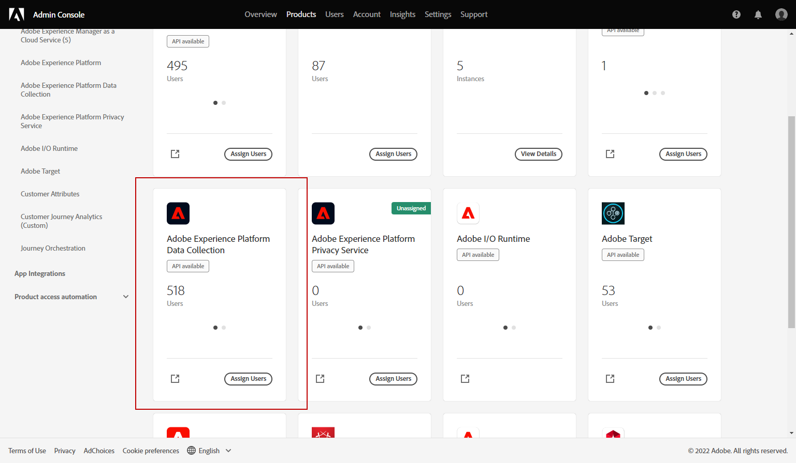
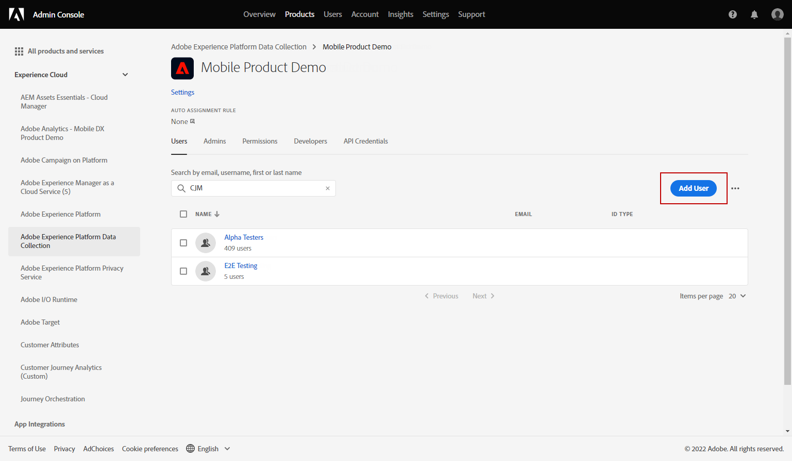
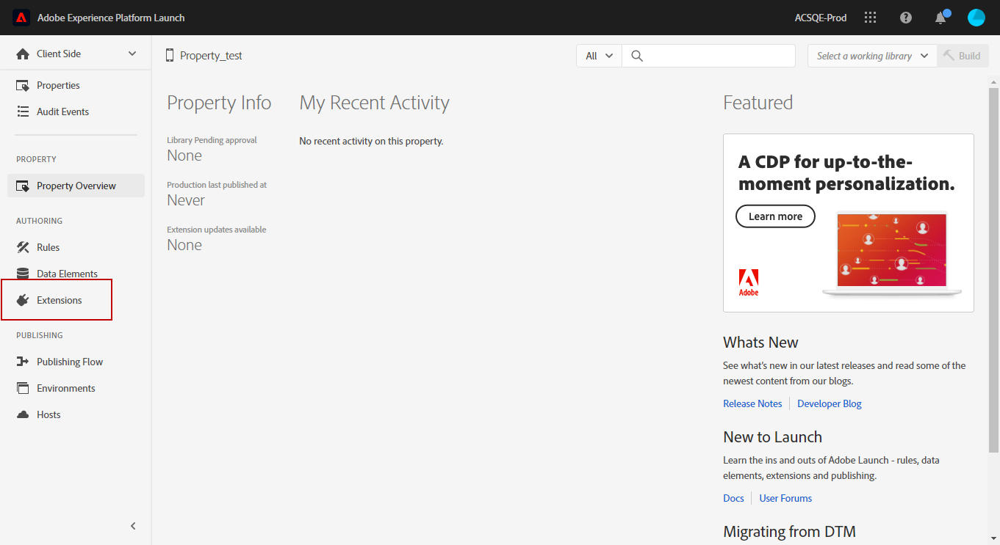

# Push-Benachrichtigungskanal konfigurieren {#push-notification-configuration}

[!DNL Journey Optimizer] ermöglicht Ihnen das Erstellen Ihrer Journeys und das Senden von Nachrichten an eine bestimmte Zielgruppe. Bevor Sie mit dem Versand von Push-Benachrichtigungen beginnen [!DNL Journey Optimizer]müssen Sie sicherstellen, dass Konfigurationen und Integrationen in der App und für Tags in Adobe Experience Platform vorhanden sind. Informationen zum Datenfluss von Push-Benachrichtigungen unter [!DNL Adobe Journey Optimizer] siehe [diese Seite](push-gs.md).

## Vorbereitung {#before-starting}

<!--
### Check provisioning

Your Adobe Experience Platform account must be provisioned to contain following schemas and datasets for push notification data flow to function correctly:

| Schema <br>Dataset                                                                       | Group of fields                                                                                                                                                                         | Operation                                                |
| -------------------------------------------------------------------------------------- | --------------------------------------------------------------------------------------------------------------------------------------------------------------------------------------- | -------------------------------------------------------- |
| CJM Push Profile Schema <br>CJM Push Profile Dataset                                     | Push Notification Details<br>Adobe CJM ExperienceEvent - Message Profile Details<br>Adobe CJM ExperienceEvent - Message Execution Details<br>Application Details<br>Environment Details | Register Push Token                                      |
| CJM Push Tracking Experience Event Schema<br>CJM Push Tracking Experience Event Dataset | Push Notification Tracking                                                                                                                                                              | Track interactions and provide data for the reporting UI |
-->

### Berechtigungen einrichten {#setup-permissions}

Bevor Sie eine Mobile App erstellen, müssen Sie zunächst sicherstellen, dass Sie in Adobe Experience Platform über die richtigen Benutzerberechtigungen für Tags verfügen oder diese zuweisen. Weitere Informationen finden Sie unter [Dokumentation zu Tags](https://experienceleague.adobe.com/docs/experience-platform/tags/admin/user-permissions.html){target=&quot;_blank&quot;}.

>[!CAUTION]
>
>Die Push-Konfiguration muss von einem erfahrenen Benutzer durchgeführt werden. Abhängig von Ihrem Implementierungsmodell und den an dieser Implementierung beteiligten Rollen müssen Sie möglicherweise den gesamten Berechtigungssatz einem einzelnen Produktprofil zuweisen oder Berechtigungen zwischen dem App-Entwickler und dem **Adobe Journey Optimizer** Administrator. Weitere Informationen **Tags** Berechtigungen in [diese Dokumentation](https://experienceleague.adobe.com/docs/experience-platform/tags/admin/user-permissions.html){target=&quot;_blank&quot;}.

<!--ou need to your have access to perform following roles :

* Manage Datastreams
* Manage Client-side Properties
* Manage App Configurations
-->

Zuweisen **Eigenschaft** und **Firma** -Berechtigungen verwenden, führen Sie die folgenden Schritte aus:

1. Zugriff auf **[!DNL Admin Console]**.

1. Aus dem **[!UICONTROL Products]** auswählen, wählen Sie die **[!UICONTROL Adobe Experience Platform Data Collection]** Karte.

   

1. Vorhandene wählen **[!UICONTROL Product Profile]** oder erstellen Sie eine neue mit der **[!UICONTROL New profile]** Schaltfläche. Erfahren Sie, wie Sie eine neue **[!UICONTROL New profile]** im [Dokumentation zur Admin Console](https://experienceleague.adobe.com/docs/experience-platform/access-control/ui/create-profile.html#ui){target=&quot;_blank&quot;}.

1. Aus dem **[!UICONTROL Permissions]** Registerkarte, wählen Sie **[!UICONTROL Property rights]**.

   

1. Klicken **[!UICONTROL Add all]**. Dadurch wird Ihrem Produktprofil die folgende Berechtigung hinzugefügt:
   * **[!UICONTROL Approve]**
   * **[!UICONTROL Develop]**
   * **[!UICONTROL Manage Environments]**
   * **[!UICONTROL Manage Extensions]**
   * **[!UICONTROL Publish]**

   Diese Berechtigungen sind erforderlich, um die Adobe Journey Optimizer-Erweiterung zu installieren und zu veröffentlichen und die App-Eigenschaft im Adobe Experience Platform Mobile SDK zu veröffentlichen.

1. Wählen Sie anschließend **[!UICONTROL Company rights]** im Menü links.

   

1. Fügen Sie die folgenden Berechtigungen hinzu:

   * **[!UICONTROL Manage App Configurations]**
   * **[!UICONTROL Manage Properties]**

   Diese Berechtigungen sind erforderlich, damit der Entwickler der mobilen App Push-Anmeldeinformationen in **Adobe Experience Platform-Datenerfassung** und definieren die Oberflächen der Push-Benachrichtigungskanäle (d. h. Nachrichtenvorgaben) in **Adobe Journey Optimizer**.

   

1. Klicken **[!UICONTROL Save]**.

Zuweisen **[!UICONTROL Product profile]** für Benutzer die folgenden Schritte ausführen:

1. Zugriff auf **[!DNL Admin Console]**.

1. Aus dem **[!UICONTROL Products]** auswählen, wählen Sie die **[!UICONTROL Adobe Experience Platform Data Collection]** Karte.

1. Wählen Sie die zuvor konfigurierte **[!UICONTROL Product profile]**.

1. Aus dem **[!UICONTROL Users]** Registerkarte, klicken Sie auf **[!UICONTROL Add user]**.

   

1. Geben Sie den Namen oder die E-Mail-Adresse Ihres Benutzers ein und wählen Sie den Benutzer aus. Klicken Sie anschließend auf **[!UICONTROL Save]**.

   >[!NOTE]
   >
   >Wenn der Benutzer zuvor nicht in der Admin Console erstellt wurde, lesen Sie den Abschnitt [Dokumentation zu Benutzern hinzufügen](https://helpx.adobe.com/enterprise/admin-guide.html/enterprise/using/manage-users-individually.ug.html#add-users).

   

### App konfigurieren {#configure-app}

Die technische Einrichtung umfasst eine enge Zusammenarbeit zwischen dem App-Entwickler und dem Business-Administrator. Bevor Sie mit dem Versand von Push-Benachrichtigungen beginnen [!DNL Journey Optimizer], müssen Sie Einstellungen in [!DNL Adobe Experience Platform Data Collection] und integrieren Sie Ihre mobile App in Adobe Experience Platform Mobile SDKs.

Folgen Sie den Implementierungsschritten, die in den folgenden Links beschrieben werden:

* Für **Apple iOS**: Erfahren Sie, wie Sie Ihre App mit APNs in [Apple-Dokumentation](https://developer.apple.com/documentation/usernotifications/registering_your_app_with_apns){target=&quot;_blank&quot;}
* Für **Google Android**: Erfahren Sie, wie Sie eine Firebase Cloud Messaging-Client-App unter Android einrichten in [Google-Dokumentation](https://firebase.google.com/docs/cloud-messaging/android/client){target=&quot;_blank&quot;}

### Integrieren Ihrer mobilen App mit dem Adobe Experience Platform SDK {#integrate-mobile-app}

Das Adobe Experience Platform Mobile SDK stellt clientseitige Integrations-APIs für Ihre Mobiltelefone über Android- und iOS-kompatible SDKs bereit. Folgen [Dokumentation zum Adobe Experience Platform Mobile SDK](https://aep-sdks.gitbook.io/docs/getting-started/overview){target=&quot;_blank&quot;}, um die Einrichtung mit Adobe Experience Platform Mobile SDKs in Ihrer App zu erhalten.

Am Ende hätten Sie auch eine Eigenschaft für Mobilgeräte in [!DNL Adobe Experience Platform Data Collection]. Normalerweise erstellen Sie für jede Mobile App, die Sie verwalten möchten, eine mobile Eigenschaft. Erfahren Sie, wie Sie eine mobile Eigenschaft in erstellen und konfigurieren [Dokumentation zum Adobe Experience Platform Mobile SDK](https://aep-sdks.gitbook.io/docs/getting-started/create-a-mobile-property){target=&quot;_blank&quot;}.


## Schritt 1: App-Push-Anmeldedaten zur Datenerfassung in Adobe Experience Platform hinzufügen {#push-credentials-launch}

Nachdem Sie die richtigen Benutzerberechtigungen erteilt haben, müssen Sie jetzt Ihre Push-Anmeldeinformationen für die Mobile App in [!DNL Adobe Experience Platform Data Collection].

Die Registrierung der Push-Anmeldedaten für mobile Apps ist erforderlich, um Adobe zu autorisieren, Push-Benachrichtigungen in Ihrem Namen zu senden. Gehen Sie wie folgt vor:

1. Von [!DNL Adobe Experience Platform Data Collection], wählen Sie die **[!UICONTROL App Surfaces]** im linken Bereich.

1. Klicken **[!UICONTROL Create App Surface]** , um eine neue Konfiguration zu erstellen.

   

1. Geben Sie einen **[!UICONTROL Name]** für die Konfiguration.

1. Von **[!UICONTROL Mobile Application Configuration]** wählen Sie das Betriebssystem aus:

   * **Für iOS**

      

      1. Mobile App eingeben **Bundle-ID** im **[!UICONTROL App ID (iOS Bundle ID)]** -Feld. Die App-Paket-ID finden Sie im **Allgemein** Registerkarte der primären Zielgruppe in **XCode**.

      1. Schalten Sie die **[!UICONTROL Push Credentials]** -Schaltfläche, um Ihre Anmeldedaten hinzuzufügen.

      1. Ziehen Sie Ihre .p8-Datei mit dem Authentifizierungsschlüssel für Apple Push-Benachrichtigungen in den Arbeitsbereich. Dieser Schlüssel kann über die **Zertifikate**, **Kennungen** und **Profile** Seite.

      1. Stellen Sie die **Schlüssel-ID**. Dies ist eine 10-stellige Zeichenfolge, die bei der Erstellung des p8-Authentifizierungsschlüssels zugewiesen wurde. Sie finden sie unter **Schlüssel** Registerkarte in **Zertifikate**, **Kennungen** und **Profile** Seite.

      1. Stellen Sie die **Team-ID**. Dies ist ein string -Wert, der auf der Registerkarte Mitgliedschaft zu finden ist.
   * **Für Android**

      

      1. Stellen Sie die **[!UICONTROL App ID (Android package name)]**: gewöhnlich ist der Paketname die App-ID in Ihrer `build.gradle` -Datei.

      1. Schalten Sie die **[!UICONTROL Push Credentials]** -Schaltfläche, um Ihre Anmeldedaten hinzuzufügen.

      1. Ziehen Sie die FCM-Push-Anmeldeinformationen per Drag-and-Drop in den Arbeitsbereich. Weitere Informationen zum Abrufen der Push-Anmeldeinformationen finden Sie unter [Google-Dokumentation](https://firebase.google.com/docs/admin/setup#initialize-sdk){target=&quot;_blank&quot;}.


1. Klicken **[!UICONTROL Save]** , um Ihre App-Konfiguration zu erstellen.

<!--
## Step 2: Set up a mobile property in Adobe Experience Platform Launch {#launch-property}

Setting up a mobile property allows the mobile app developer or marketer to configure the mobile SDKs attributes such as Session Timeouts, the [!DNL Adobe Experience Platform] sandbox to be targeted and the **[!UICONTROL Adobe Experience Platform Datasets]** to be used for mobile SDK to send data to.

For further details and procedures on how to set up a **[!UICONTROL Platform Launch property]**, refer to the steps detailed in [Adobe Experience Platform Mobile SDK documentation](https://aep-sdks.gitbook.io/docs/getting-started/create-a-mobile-property#create-a-mobile-property).


To get the SDKs needed for push notification to work you will need the following SDK extensions, for both Android and iOS:

* **[!UICONTROL Mobile Core]** (installed automatically)
* **[!UICONTROL Profile]** (installed automatically)
* **[!UICONTROL Adobe Experience Platform Edge]**
* **[!UICONTROL Adobe Experience Platform Assurance]**, optional but recommended to debug the mobile implementation.

Learn more about [!DNL Adobe Experience Platform Launch] extensions in [Adobe Experience Platform Launch documentation](https://experienceleague.adobe.com/docs/launch-learn/implementing-in-mobile-android-apps-with-launch/configure-launch/launch-add-extensions.html).
-->

## Schritt 2: Konfigurieren der Adobe Journey Optimizer-Erweiterung in Ihrer mobilen Eigenschaft {#configure-journey-optimizer-extension}

Die **Adobe Journey Optimizer-Erweiterung** für Adobe Experience Platform Mobile SDKs ermöglicht Push-Benachrichtigungen für Ihre mobilen Apps und unterstützt Sie bei der Erfassung von Benutzer-Push-Token und der Verwaltung der Interaktionsmessung mit Adobe Experience Platform-Diensten.

Erfahren Sie, wie Sie die Journey Optimizer-Erweiterung in [Dokumentation zum Adobe Experience Platform Mobile SDK](https://aep-sdks.gitbook.io/docs/using-mobile-extensions/adobe-journey-optimizer){target=&quot;_blank&quot;}.


<!-- 
**[!UICONTROL Edge configuration]** is used by **[!UICONTROL Edge]** extension to send custom data from mobile device to [!DNL Adobe Experience Platform]. 
To configure [!DNL Adobe Experience Platform], you must provide the **[!UICONTROL Sandbox]** name and **[!UICONTROL Event Dataset]**.

For further details and procedures on how to create **[!UICONTROL Edge configuration]**, refer to the steps detailed in [Adobe Experience Platform Mobile SDK documentation](https://aep-sdks.gitbook.io/docs/getting-started/configure-datastreams).

1. From [!DNL Adobe Experience Platform Launch], select the **[!UICONTROL Edge Configurations]** tab and click **[!UICONTROL Edge Configurations]**.
    
1. Select **[!UICONTROL New Edge Configuration]** to add a new **[!UICONTROL Edge Configuration]**.
1. Enter a **[!UICONTROL Name]** and click **[!UICONTROL Save]**

1. Click the **[!UICONTROL Adobe Experience Platform]** toggle to enable it.

1. Fill in the **[!UICONTROL Sandbox]**, **[!UICONTROL Event dataset]** and **[!UICONTROL Profile Dataset]** fields. Then, click **[!UICONTROL Save]**.
    
    


1. From [!DNL Adobe Experience Platform Launch], ensure that **[!UICONTROL Client Side]** is selected in the drop-down menu.

1. select the **[!UICONTROL Properties]** tab and click **[!UICONTROL New Property]**.

    

1. Enter a **[!UICONTROL Name]** for your new property.

1. Select **[!UICONTROL Mobile]** as **[!UICONTROL Platform]**.

    

1. Click **[!UICONTROL Save]** to create your new property.

To configure **[!UICONTROL Adobe Experience Platform Edge Extension]** to send custom data from mobile devices to [!DNL Adobe Experience Platform].

1. Select your previously created property and select the **[!UICONTROL Extensions]** tab to view the extensions for this property.

    

1. Click **[!UICONTROL Configure]** under the **[!UICONTROL Adobe Experience Platform Edge]** Network' extension.

1. From the **[!UICONTROL Edge Configuration]** drop-down list, select the **[!UICONTROL Edge Configuration]** created in the previous steps. For more information on **[!UICONTROL Edge Configuration]**, refer to this [section](#edge-configuration).

1. Click **[!UICONTROL Save]**.

To configure **[!UICONTROL Adobe Experience Platform Messaging]** extension to send push profile and push interactions to the correct datasets, follow the same steps as above. Use **[!UICONTROL Sandbox]**, **[!UICONTROL Event dataset]** and **[!UICONTROL Profile Dataset]** created in the [Adobe Experience Platform setup](#edge-configuration).
-->

<!--
## Step 4: Publish the Property {#publish-property}

You now need to publish the property to integrate your configuration and to use it in the mobile app. 

To publish your property, refer to the steps detailed in [Adobe Experience Platform Mobile SDK documentation](https://aep-sdks.gitbook.io/docs/getting-started/create-a-mobile-property#publish-the-configuration)

## Step 5: Configure the ProfileDataSource {#configure-profiledatasource}

To configure the `ProfileDataSource`, use the `ProfileDCInletURL` from [!DNL Adobe Experience Platform] setup and add the following in the mobile app:

```
    MobileCore.updateConfiguration(
    mutableMapOf("messaging.dccs" to <ProfileDCSInletURL>)
```

-->

## Schritt 3: Testen Ihrer mobilen App mit einem Ereignis {#mobile-app-test}

Nach der Konfiguration Ihrer Mobile App sowohl in Adobe Experience Platform als auch in [!DNL Adobe Experience Platform Data Collection], können Sie sie nun testen, bevor Sie Push-Benachrichtigungen an Ihre Profile senden. In diesem Anwendungsfall erstellen wir eine Journey, um unsere mobile App als Ziel festzulegen, und legen ein Ereignis fest, das die Push-Benachrichtigung auslöst.

<!--
You can use a test mobile app for this use case. For more on this, refer to this [page](https://wiki.corp.adobe.com/pages/viewpage.action?spaceKey=CJM&title=Details+of+setting+the+mobile+test+app) (internal use only).
-->

Damit diese Journey funktioniert, müssen Sie ein XDM-Schema erstellen. Weitere Informationen finden Sie unter [XDM-Dokumentation](https://experienceleague.adobe.com/docs/experience-platform/xdm/schema/composition.html#schemas-and-data-ingestion){target=&quot;_blank&quot;}.

1. Navigieren Sie im linken Menü zu **[!UICONTROL Schemas]**.

1. Klicken **[!UICONTROL Create schema]** und wählen Sie **[!UICONTROL XDM ExperienceEvent]**.

   

1. Auswählen **[!UICONTROL Create a new field group]**.

1. Geben Sie einen **[!UICONTROL Display Name]** und **[!UICONTROL Description]**. Klicken **[!UICONTROL Add field groups]** wann geschehen. Weitere Informationen zum Erstellen von Feldergruppen finden Sie unter [XDM-Systemdokumentation](https://experienceleague.adobe.com/docs/experience-platform/xdm/tutorials/create-schema-ui.html){target=&quot;_blank&quot;}.


   

1. Wählen Sie auf der linken Seite das Schema aus. Geben Sie im rechten Bereich den Namen Ihres Schemas und Ihrer Beschreibung ein. Aktivieren Sie dieses Schema für **[!UICONTROL Profile]**.

   


1. Wählen Sie auf der linken Seite die Feldergruppe aus und klicken Sie dann auf das Symbol + , um ein neues Feld zu erstellen. Im **[!UICONTROL Field groups properties]** Geben Sie rechts in ein **[!UICONTROL Field name]**, **[!UICONTROL Display name]** und wählen Sie **[!UICONTROL String]** as **[!UICONTROL Type]**.

   

1. Überprüfen **[!UICONTROL Required]** und klicken Sie auf **[!UICONTROL Apply]**.

1. Klicken **[!UICONTROL Save]**. Ihr Schema wurde erstellt und kann in einem Ereignis verwendet werden.

Anschließend müssen Sie ein Ereignis einrichten.

1. Wählen Sie im linken Menü der Startseite unter ADMINISTRATION die Option **[!UICONTROL Configurations]**. Klicken **[!UICONTROL Manage]** im **[!UICONTROL Events]** -Abschnitt, um Ihr neues Ereignis zu erstellen.

1. Klicken **[!UICONTROL Create Event]**, wird der Ereigniskonfigurationsbereich auf der rechten Seite des Bildschirms geöffnet.

   

1. Geben Sie den Namen Ihres Ereignisses ein. Sie können auch eine Beschreibung hinzufügen.

1. Im **[!UICONTROL Event ID type]** Feld, wählen Sie **[!UICONTROL Rule Based]**.

1. Im **[!UICONTROL Parameters]** wählen Sie das zuvor erstellte Schema aus.

   

1. Überprüfen Sie in der Feldliste, ob das in der Schemafeldgruppe erstellte Feld ausgewählt ist.

   

1. Klicken **[!UICONTROL Edit]** im **[!UICONTROL Event ID condition]** -Feld. Ziehen Sie das zuvor hinzugefügte Feld per Drag-and-Drop in den Arbeitsbereich, um die Bedingung zu definieren, die vom System verwendet wird, um die Ereignisse zu identifizieren, die Ihre Journey auslösen.

   

1. Geben Sie in diesem Beispiel die Syntax ein, die Sie zum Auslösen Ihrer Push-Benachrichtigung in Ihrer Test-App benötigen **Bestellbestätigung**.

   

1. Auswählen **[!UICONTROL ECID]** als **[!UICONTROL Namespace]**.

1. Klicken **[!UICONTROL Ok]** then **[!UICONTROL Save]**.

Ihr Ereignis wurde erstellt und kann jetzt in einer Journey verwendet werden.

1. Klicken Sie im linken Menü auf **[!UICONTROL Journeys]**.

1. Klicken **[!UICONTROL Create Journey]** , um eine neue Journey zu erstellen.

1. Bearbeiten Sie die Eigenschaften der Journey im Konfigurationsbereich, der auf der rechten Seite angezeigt wird. Weitere Informationen finden Sie hier . [Abschnitt](../building-journeys/journey-gs.md#change-properties).

1. Ziehen Sie zunächst das in den vorherigen Schritten erstellte Ereignis aus dem **[!UICONTROL Events]** Dropdown-Liste.

   

1. Aus dem **[!UICONTROL Actions]** Dropdown-Liste, per Drag-and-Drop **[!UICONTROL Push]** Aktivität auf Ihre Journey.

1. Konfigurieren Sie die Push-Benachrichtigung. Weiterführende Informationen zur Erstellung von Push-Benachrichtigungen finden Sie in diesem Abschnitt [page](create-push.md).

1. Klicken Sie auf **[!UICONTROL Test]** Umschalten zwischen Testen der Push-Benachrichtigungen und Klicken **[!UICONTROL Trigger an event]**.

   

1. Geben Sie Ihre ECID in das Feld **[!UICONTROL Key]** Feld und geben Sie in **Bestellbestätigung** im zweiten Feld.

   

1. Klicken **[!UICONTROL Send]**.

Ihr Ereignis wird ausgelöst und Sie erhalten Ihre Push-Benachrichtigung an Ihre Mobile App.

## Schritt 4: Erstellen einer Kanaloberfläche für Push-Benachrichtigungen{#message-preset}

Nachdem Ihre App in eingerichtet wurde [!DNL Adobe Experience Platform Data Collection], müssen Sie eine Oberfläche erstellen, über die Sie Push-Benachrichtigungen von **[!DNL Journey Optimizer]**.

Erfahren Sie, wie Sie eine Kanaloberfläche in erstellen und konfigurieren [diesem Abschnitt](../configuration/channel-surfaces.md).

Sie können jetzt Push-Benachrichtigungen mit Journey Optimizer senden.

* Erfahren Sie, wie Sie eine Push-Nachricht erstellen in [diese Seite](create-push.md).
* Erfahren Sie, wie Sie einer Journey eine Nachricht hinzufügen in [diesem Abschnitt](../building-journeys/journeys-message.md).
