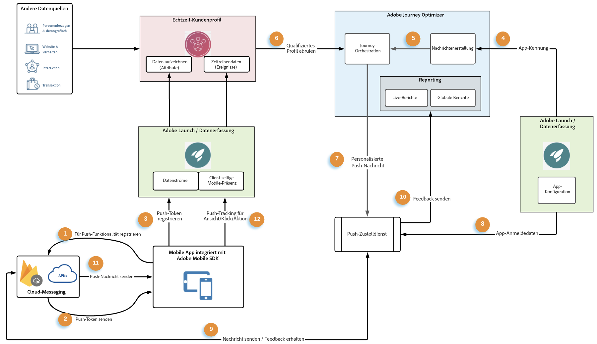
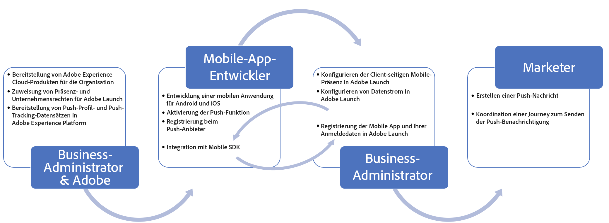

# Datenfluss und Komponenten von Push-Benachrichtigungen {#get-started-push}

Diese Seite hilft Ihnen, wichtige Services und Workflows einzurichten und zu verstehen, die mit Push-Benachrichtigungen in [!DNL Journey Optimizer] verbunden sind.

>[!AVAILABILITY]
>
>Der neue **Schnellstart-Workflow für Mobile-Onboarding** ist jetzt verfügbar. Verwenden Sie diese neue Produktfunktion, um das Mobile SDK schnell so zu konfigurieren, dass es mit der Erfassung und Validierung von Mobile-Ereignisdaten und dem Senden von Mobile-Push-Benachrichtigungen beginnt. Auf diese Funktion kann über die Startseite der Datenerfassung als öffentliche Beta-Version zugegriffen werden. [Weitere Informationen](mobile-onboarding-wf.md)
>

Auf [dieser Seite](create-push.md) erfahren Sie, wie Sie Push-Benachrichtigungen erstellen.

Die Schritte zum Konfigurieren des Push-Benachrichtigungs-Kanals in [!DNL Adobe Journey Optimizer] werden auf [dieser Seite](push-configuration.md) beschrieben.

Aus der Sicht eines End-to-End-Service zeigt die folgende Abbildung die beteiligten Systeme und Services mit den zugehörigen Datenflüssen und verdeutlicht, wie Push-Benachrichtigungen bereitgestellt werden.

1. Registrierung Ihrer gebrandeten Mobile App (Android oder iOS) mit den Apple-APNs und Google FCM-Push-Messaging-Services
1. Messaging-Services generieren ein Push-Token, also eine Kennung, die von [!DNL Adobe Journey Optimizer] verwendet wird, um das jeweilige Gerät mit einer Push-Benachrichtigung anzusprechen.
1. Das zuvor generierte Push-Token wird an Adobe Experience Platform übergeben und mit dem Echtzeit-Kundenprofil synchronisiert. Dies erfolgt vorkonfiguriert mit einem einfach zu integrierenden Client-SDK.
1. Push-Benachrichtigungen werden in [!DNL Adobe Journey Optimizer] verfasst und entsprechend einer Kanaloberfläche (d. h. Nachrichtenvoreinstellung) erstellt.
1. Push-Benachrichtigungen können über die Orchestrierungs-Arbeitsfläche in Journeys aufgenommen werden.
1. Nach der Veröffentlichung der Journey werden Kundenprofile, die auf Journey-Bedingungen basieren, für den Empfang von Push-Benachrichtigungen qualifiziert. In diesem Schritt werden Push-Messaging-Payloads personalisiert.
1. Personalisierte Push-Payloads werden an einen internen Push-Messaging-Versand-Service weitergeleitet.
1. Dieser interne Service überprüft dann die Anmeldeinformationen der Mobile App, die mit der Nachricht verknüpft ist, und
1. sendet die Nachricht zum endgültigen Versand an die Messaging-Services von Apple und Google.
1. Feedback von Messaging-Services wird zum Reporting in Live-Berichten und globalen Berichten zur Journey aufgeführt. Fehler und Erfolge werden dort protokolliert.
1. Push-Benachrichtigungen werden an Endbenutzergeräte gesendet.
1. Push-Benachrichtigungs-Interaktionen für Endbenutzer werden über die SDK-Integration als Erlebnisereignisse vom Endbenutzer-Client gesendet.

## Rollen von wichtigen Services in Push-Benachrichtigungen {#roles-of-key-services}

* **Push-Benachrichtigungs-Service-Anbieter** sind die Kernkomponenten-Webservices, die Benachrichtigungen von Remote-Servern an Mobile Apps senden.

  [!DNL Adobe Journey Optimizer] unterstützt sowohl Android- als auch iOS-Plattformen und integriert daher mit Folgendem:
   * [Firebase Cloud Messaging (FCM)](https://firebase.google.com/docs/cloud-messaging) – zum Senden von Benachrichtigungen an eine Android-Mobile-App
   * [Apple Push Notification Service (APNs)](https://developer.apple.com/library/archive/documentation/NetworkingInternet/Conceptual/RemoteNotificationsPG/APNSOverview.html) – zum Senden von Benachrichtigungen an eine iOS-Mobile-App

* **Adobe Experience Platform Mobile-SDK**, das Client-seitige Integrations-APIs für Ihre Mobile Apps über Android- und iOS-kompatible SDKs bereitstellt. Das SDK bietet eine [!DNL Adobe Journey Optimizer]-Erweiterung, die eine Vielzahl von APIs speziell für Push-Messaging verfügbar macht. Damit wird ein Datenfluss ermöglicht, um z. B. das Push-Token zu registrieren oder Push-Tracking-Ereignisse oder andere benutzerspezifische Erlebnisereignisse an Adobe Experience Platform zu senden. Das SDK bietet außerdem eine Vielzahl anderer Erweiterungen, die andere Funktionen von Adobe Experience Cloud und Drittanbietern ermöglichen.

  Die SDK-Integration erfordert auch die Einrichtung von Adobe Experience Platform [Datenerfassungs](https://experienceleague.adobe.com/docs/experience-platform/tags/home.html?lang=de)-Services, z. B.:{target="_blank"}

   * Erstellen eines Datenstroms zum Konfigurieren der Profil- und Erlebnisereignis-Datensätze, anhand derer die Daten in Adobe Experience Platform fließen
   * Erstellen der Client-seitigen Mobile-Eigenschaft und Hinzufügen von Erweiterungen Das SDK ist eng mit diesen Erweiterungen integriert, um eine nahtlose Datenerfassung zu ermöglichen.
   * Registrieren der Mobile-App-Bundle-ID und Mobile-App-Anmeldeinformationen

* **Das Echtzeit-Kundenprofil von Adobe Experience Platform** bietet eine ganzheitliche Sicht auf jeden einzelnen Kunden, indem es Daten aus verschiedenen Kanälen, einschließlich Internet, Mobile, CRM und Drittanbietern, kombiniert. Mit dem Profil können Sie Ihre Kundendaten in einer zentralen Ansicht zusammenführen, die eine aussagekräftige Darstellung jeder Kundeninteraktion mit Zeitstempel bietet. Das Push-Token für einen bestimmten Mobile-App-Benutzer wird im Profil des Benutzers als Eintragsdaten gespeichert, während die Interaktionen, die der Benutzer mit Push-Benachrichtigungen ausführt, als Zeitreihenereignisdaten verfolgt werden. [Weitere Infos zum Echtzeit-Kundenprofil von Adobe Experience Platform](https://experienceleague.adobe.com/docs/experience-platform/profile/home.html?lang=de){target="_blank"}.

* **[!DNL Adobe Journey Optimizer]**: Sobald Ihre Mobile-App-Integrationen mit den oben genannten Komponenten eingerichtet und Ihre Kundenprofile in Adobe Experience Platform vorhanden sind, können Sie zur Benutzerinteraktion Push-Benachrichtigungen in [!DNL Adobe Journey Optimizer] erstellen und koordinieren.

## Technische Einrichtung und praktische Workflows für Push-Benachrichtigungen {#push-technical-setup}

Die folgende Abbildung zeigt die verschiedenen Schritte zur Konfiguration der Komponenten, die das Grundgerüst des Push-Datenflusses bilden, von Anfang bis Ende. Die Aktionselemente wurden basierend auf der Rolle, die die Konfiguration durchführt, und der zu konfigurierenden Komponente in Kategorien eingeteilt.

**Verwandte Themen**

* [Konfigurieren des Push-Kanals](push-configuration.md)
* [Bericht zu Push-Benachrichtigungen](../reports/journey-global-report.md#push-global)
* [Erstellen einer Push-Benachrichtigung](create-push.md)
* [Hinzufügen einer Nachricht zu einer Journey](../building-journeys/journeys-message.md)
* [Hinzufügen einer Nachricht in einer Kampagne](../campaigns/create-campaign.md)