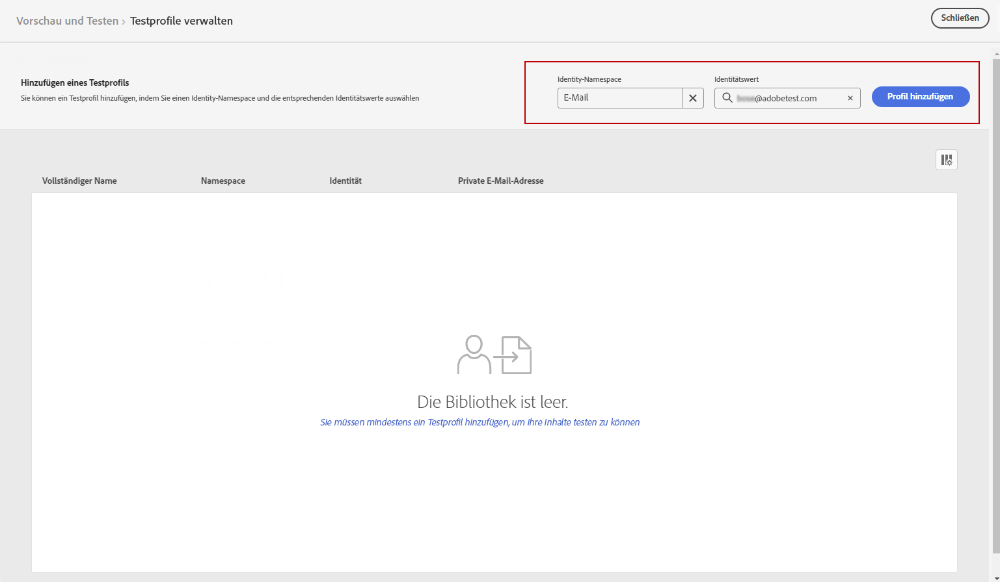
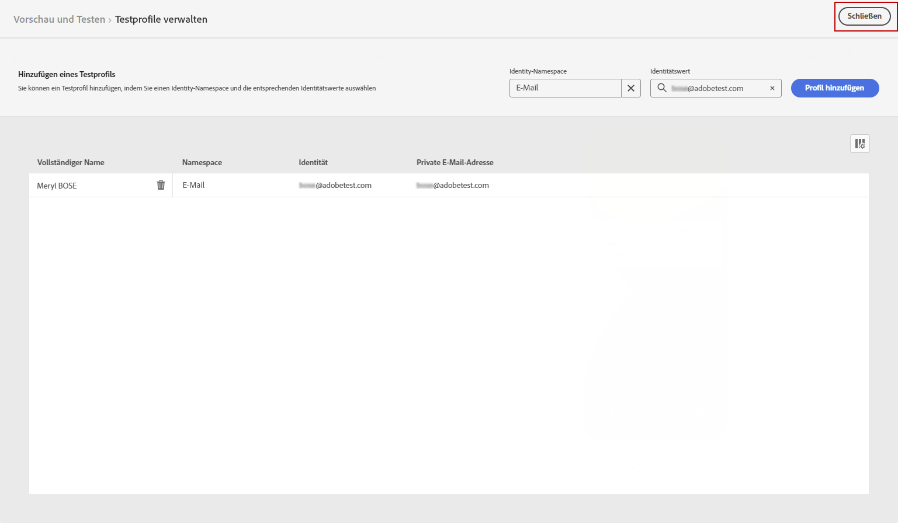
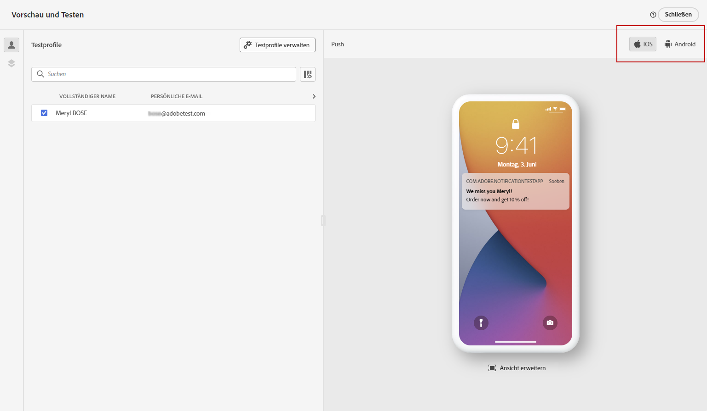
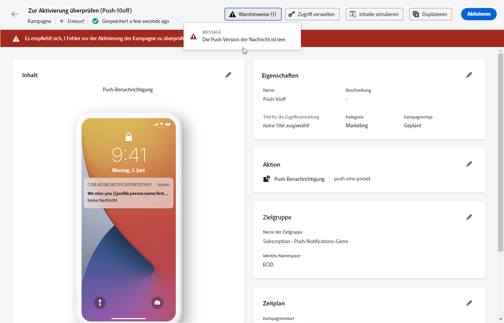

# Senden der Push-Benachrichtigung {#send-push}

## Push-Benachrichtigung in der Vorschau anzeigen {#preview-push}

Sobald der Inhalt der Nachricht erstellt wurde, können Sie mithilfe von Testprofilen eine Vorschau erstellen und einen Testversand durchführen. Wenn Sie personalisierte Inhalte eingefügt haben, können Sie überprüfen, wie diese Inhalte in der Nachricht angezeigt werden, indem Sie Testprofildaten verwenden.

1. Klicken **[!UICONTROL Inhalt simulieren]**.

1. Klicken **[!UICONTROL Verwalten von Testprofilen]** , um ein Testprofil hinzuzufügen.

1. Suchen Sie Ihr Testprofil mit **[!UICONTROL Identitäts-Namespace]** und **[!UICONTROL Identitätswert]** -Felder. Klicken Sie anschließend auf **[!UICONTROL Profil hinzufügen]**.

   

1. Wenden Sie dieselben Schritte wie oben beschrieben an, um ein Testprofil auszuwählen, und

   

1. Für die Push-Vorschau werden die Daten von Testprofilen im Nachrichteninhalt verwendet.

   Wählen Sie den Gerätetyp aus, um Inhalte in der Vorschau anzuzeigen: **[!UICONTROL iOS]** oder **[!UICONTROL Android]**.

   

## Push-Benachrichtigung validieren {#push-validate}

>[!NOTE]
>
> Zur besseren Zustellbarkeit sollte stets die Telefonnummern in den vom Provider unterstützten Formaten verwendet werden. Beispielsweise unterstützen Twilio und Sinch nur Telefonnummern im E.164-Format.

Sie müssen auch Warnhinweise im oberen Bereich des Editors überprüfen.  Einige davon sind einfache Warnhinweise, andere können die Verwendung der Nachricht verhindern. Es können zwei Arten von Warnhinweisen auftreten:

* **Warnhinweise** geben Hinweise auf Empfehlungen und zeigen Best Practices.

* **Fehler** verhindern, dass Sie die Journey testen oder aktivieren, solange sie nicht aufgelöst sind, z. B.:

   * **[!UICONTROL Die Push-Version der Nachricht ist leer]**: Dieser Fehler wird angezeigt, wenn der Text oder Titel der Push-Benachrichtigung fehlt. In [diesem Abschnitt](create-push.md) erfahren Sie, wie Sie den Inhalt einer Push-Benachrichtigung definieren.

   * **[!UICONTROL Oberfläche existiert nicht]**: Sie können Ihre Nachricht nicht verwenden, wenn die ausgewählte Oberfläche nach der Nachrichtenerstellung gelöscht wird. Wenn dieser Fehler auftritt, wählen Sie in den **[!UICONTROL Eigenschaften]** der Nachricht eine andere Oberfläche aus. Weitere Informationen zu Kanaloberflächen finden Sie in [diesem Abschnitt](../configuration/channel-surfaces.md).

   * **[!UICONTROL Die Payload für Push-Benachrichtigungen an iOS-/Android überschreitet die Beschränkung von 4 KB]**: Die Größe der Push-Benachrichtigung darf 4 KB nicht überschreiten. Um diese Grenze zu beachten, versuchen Sie, die Verwendung von Bildern oder Emojis zu reduzieren. In [diesem Abschnitt](../push/create-push.md) erfahren Sie, wie Sie Ihre Push-Benachrichtigungsinhalte verwalten.

Wenn Ihre Push-Benachrichtigung fertig ist, schließen Sie die Konfiguration Ihrer [Journey](../building-journeys/journey-gs.md) oder [Kampagne](../campaigns/create-campaign.md) , um es zu versenden.
