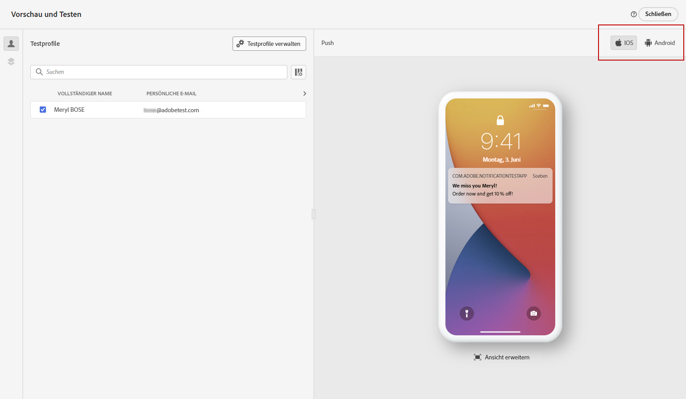
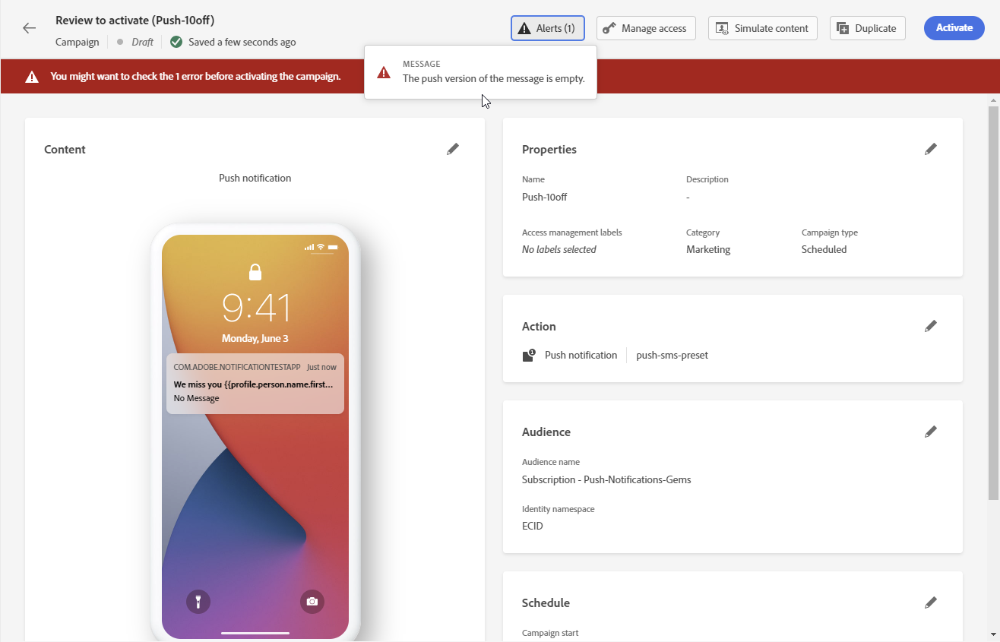

# Überprüfen und Senden Ihrer Push-Benachrichtigung {#send-push}

>[!BEGINSHADEBOX]

**Auf dieser Seite** Erfahren Sie, wie Sie Ihre Push-Benachrichtigung in Adobe Journey Optimizer in der Vorschau anzeigen, validieren und senden.

>[!ENDSHADEBOX]

## Vorschau der Push-Benachrichtigung {#preview-push}

Sobald der Nachrichteninhalt definiert wurde, können Sie den Inhalt mit einer der beiden Simulationsmethoden in der Vorschau anzeigen:

* Klicken Sie **[!UICONTROL Inhalt simulieren]**, um Inhaltsvarianten mit Beispieleingabedaten oder automatischer KI-Generierung zu testen. [Informationen zum Simulieren von Inhaltsvarianten](../test-approve/simulate-sample-input.md)
* Klicken Sie auf **[!UICONTROL Inhalt simulieren]** und wählen Sie dann **[!UICONTROL Inhalt simulieren (AEP-Profile)]** aus der Dropdown-Liste aus, um eine Vorschau mit Testprofilen anzuzeigen. Sie können dann den Gerätetyp auswählen, um Inhalte in der Vorschau anzuzeigen: **[!UICONTROL iOS]**, **[!UICONTROL Android]** oder **[!UICONTROL Web]**.

Detaillierte Informationen zur Vorschau und zum Test des Inhalts finden Sie im Abschnitt [Content-Management](../content-management/preview-test.md).

## Validieren der Push-Benachrichtigung {#push-validate}

Sie müssen die Warnmeldungen im oberen Bereich des Editors überprüfen. Einige davon sind einfache Warnungen, aber andere können Sie daran hindern, die Nachricht zu senden. Es gibt zwei Arten von Warnungen: Warnungen und Fehler.

* **Warnhinweise** geben Hinweise auf Empfehlungen und zeigen Best Practices.

* **Fehler** verhindern, dass Sie die Journey testen oder aktivieren, solange nicht alle Fehler behoben sind.

   * **[!UICONTROL Die Push-Version der Nachricht ist leer]**: Dieser Fehler wird angezeigt, wenn der Text oder Titel der Push-Benachrichtigung fehlt. In [diesem Abschnitt](create-push.md) erfahren Sie, wie Sie den Inhalt einer Push-Benachrichtigung definieren.

   * **[!UICONTROL Konfiguration ist nicht vorhanden]**: Sie können Ihre Nachricht nicht veröffentlichen, wenn die gewählte Konfiguration nach der Erstellung der Nachricht gelöscht wurde. Wenn dieser Fehler auftritt, wählen Sie in den **[!UICONTROL Eigenschaften]** der Nachricht eine andere Konfiguration aus. Weitere Informationen zu Kanalkonfigurationen finden Sie in [diesem Abschnitt](../configuration/channel-surfaces.md).

   * **[!UICONTROL Die Payload für Push-Benachrichtigungen an iOS-/Android überschreitet die Beschränkung von 4 KB]**: Die Größe der Push-Benachrichtigung darf 4 KB nicht überschreiten. Um diese Grenze zu beachten, versuchen Sie, die Verwendung von Bildern oder Emojis zu reduzieren. In [diesem Abschnitt](../push/create-push.md) erfahren Sie, wie Sie Ihre Push-Benachrichtigungsinhalte verwalten.

  

>[!NOTE]
>
> Zur besseren Zustellbarkeit sollte stets die Telefonnummern in den vom Provider unterstützten Formaten verwendet werden. Beispielsweise unterstützen Twilio und Sinch nur Telefonnummern im E.164-Format.

## Senden der Push-Benachrichtigung{#push-send}

>[!IMPORTANT]
>
> Wenn Ihre Kampagne einer Genehmigungsrichtlinie unterliegt, müssen Sie eine Genehmigung anfordern, um Ihre Push-Benachrichtigung senden zu können. [Weitere Informationen](../test-approve/gs-approval.md)

Wenn Ihre Push-Benachrichtigung fertig ist, vervollständigen Sie die Konfiguration Ihrer [Journey](../building-journeys/journey-gs.md) oder [Kampagne](../campaigns/create-campaign.md), um sie zu versenden.

**Verwandte Themen**

* [Konfigurieren des Push-Kanals für Mobilgeräte](push-configuration.md)
* [Push-Kanal für Web konfigurieren](push-configuration-web.md)
* [Bericht zu Push-Benachrichtigungen](../reports/journey-global-report-cja-push.md)
* [Erstellen einer Push-Benachrichtigung](create-push.md)
* [Hinzufügen einer Nachricht zu einer Journey](../building-journeys/journey-action.md)
* [Hinzufügen einer Nachricht in einer Kampagne](../campaigns/create-campaign.md)

