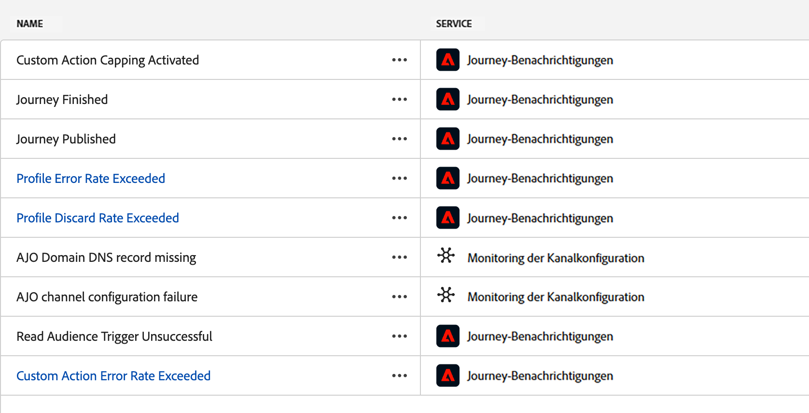
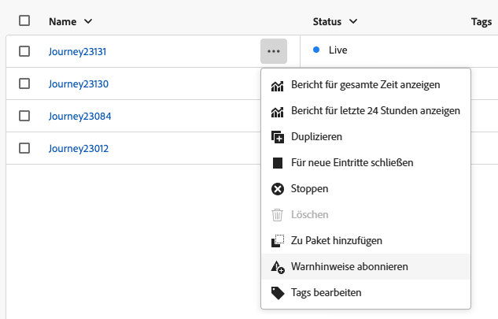
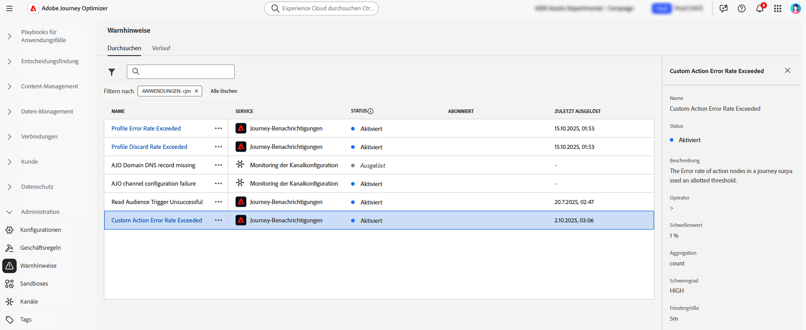
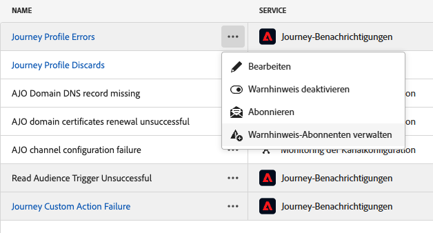
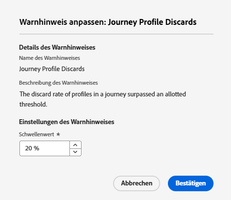
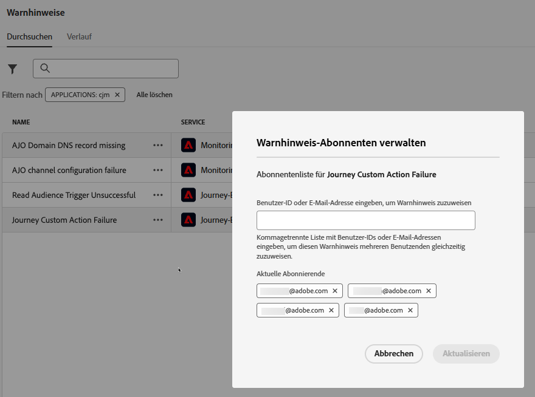

# Abrufen und Abonnieren von Systemwarnhinweisen {#alerts}

Verwenden Sie beim Erstellen Ihrer Journeys und Kampagnen die Schaltfläche **Warnhinweise**, um Fehler vor der Ausführung oder Veröffentlichung zu überprüfen und zu beheben.

* Weitere Informationen zum Beheben von Fehlern in Journeys finden Sie auf [dieser Seite](../building-journeys/troubleshooting.md)

* Erfahren Sie, wie Sie Ihre Kampagnen überprüfen und aktivieren können: [Aktionskampagnen](../campaigns/review-activate-campaign.md) | [Durch API ausgelöste Kampagnen](../campaigns/review-activate-api-triggered-campaign.md) | [Orchestrierte Kampagnen](../orchestrated/start-monitor-campaigns.md)

Zusätzlich können bei Erreichen eines bestimmten Bedingungssatzes Warnmeldungen an alle Benutzenden in Ihrer Organisation gesendet werden, die sich dafür angemeldet haben. Diese Warnhinweise sind im entsprechenden Menü **[!UICONTROL Warnhinweise]** verfügbar. Adobe Experience Platform bietet mehrere vordefinierte Warnhinweisregeln, die Sie für Ihr Unternehmen aktivieren können. Darüber hinaus können Sie für [!DNL Adobe Journey Optimizer] spezifische Systemwarnhinweise abonnieren, wie auf dieser Seite beschrieben.

>[!NOTE]
>
>Weitere Informationen zu Warnhinweisen in Adobe Experience Platform finden Sie in der [Dokumentation zu Adobe Experience Platform](https://experienceleague.adobe.com/docs/experience-platform/observability/alerts/overview.html?lang=de){target="_blank"}.

Klicken Sie im linken Menü unter **[!UICONTROL Administration]** auf **[!UICONTROL Warnhinweise]**. Auf der Registerkarte **Durchsuchen** sind mehrere vorkonfigurierte Warnhinweise für Journey Optimizer verfügbar.

{width=50%}

* Spezifische Warnhinweise für Journeys:

   * Warnhinweis [Auslösen von „Zielgruppe lesen“ fehlgeschlagen](#alert-read-audiences)
   * Warnhinweis [Fehlerrate bei benutzerdefinierter Aktion überschritten](#alert-custom-action-error-rate) (ersetzt den vorherigen Warnhinweis „Fehlschlagen einer benutzerdefinierten Journey-Aktion“)
   * Warnhinweis [Rate beim Verwerfen des Profils überschritten](#alert-discard-rate)
   * Warnhinweis [Fehlerrate bei Profil überschritten](#alert-profile-error-rate)
   * Warnhinweis [Journey veröffentlicht](#alert-journey-published)
   * Warnhinweis [Journey abgeschlossen](#alert-journey-finished)
   * Warnhinweis [Begrenzung benutzerdefinierter Aktionen ausgelöst](#alert-custom-action-capping)

* Warnhinweise speziell für die Kanalkonfiguration:

   * Warnhinweis [&#128279;](#alert-dns-record-missing)DNS-Eintrag für AJO-Domain fehlt
   * Warnhinweis [&#128279;](#alert-channel-config-failure)Fehler bei der AJO-Kanalkonfiguration
     <!--* the [AJO domain certificates renewal unsuccessful](#alert-certificates-renewal) alert-->

## Abonnieren von Warnhinweisen {#subscribe-alerts}

Wenn ein unerwartetes Verhalten auftritt und/oder bestimmte Bedingungen in Ihren Vorgängen erfüllt sind (z. B. ein potenzielles Problem, wenn das System einen Schwellenwert überschreitet), werden Warnhinweise an alle Benutzenden in Ihrer Organisation gesendet, die diese abonniert haben.

Sie können jeden Warnhinweis einzeln über die Benutzeroberfläche abonnieren, entweder global über das Menü **[!UICONTROL Warnhinweise]** (siehe [Globales Abonnement](#global-subscription)) oder einzeln für eine bestimmte Journey (siehe [Einzelabonnement](#unitary-subscription)).

Je nach den Benutzereinstellungen werden Warnhinweise per E-Mail gesendet und/oder erscheinen direkt im Journey Optimizer-Benachrichtigungszentrum oben rechts in der Benutzeroberfläche. Wählen Sie in den **[!UICONTROL Voreinstellungen]** von [!DNL Adobe Experience Cloud] aus, wie Sie diese Warnhinweise erhalten möchten. [Weitere Informationen](../start/user-interface.md#in-product-uc)

Wenn ein Warnhinweis aufgelöst wurde, erhalten die Abonnentinnen und Abonnenten die Benachrichtigung „Aufgelöst“. Warnhinweise werden nach 1 Stunde aufgelöst, um wechselnde Werte zu vermeiden.

### Globales Abonnement {#global-subscription}

Gehen Sie wie folgt vor, um einen Warnhinweis für alle Journeys und Kampagnen zu abonnieren oder abzubestellen:

1. Navigieren Sie im linken Menü zum Dashboard **[!UICONTROL Warnhinweise]** und wählen Sie die Option **[!UICONTROL Abonnieren]** für den Warnhinweis, den Sie abonnieren möchten.

   {width=80%}

   >[!NOTE]
   >
   >Das Abonnement gilt nur für eine bestimmte Sandbox. Sie müssen also Warnhinweise für jede Sandbox einzeln abonnieren.

1. Auf dieselbe Weise können Sie sich auch wieder **[!UICONTROL abmelden]**.

Sie können Warnhinweise auch über [E/A-Ereignisbenachrichtigungen](https://experienceleague.adobe.com/docs/experience-platform/observability/alerts/subscribe.html?lang=de){target="_blank"} abonnieren. Warnhinweisregeln sind in verschiedene Abonnementpakete unterteilt. Abonnements für Ereignisse, die den jeweiligen Journey Optimizer-Warnhinweisen entsprechen, werden [nachfolgend](#journey-alerts) beschrieben.

### Einzelabonnement {#unitary-subscription}

Gehen Sie wie folgt vor, um einen Warnhinweis für eine bestimmte Journey zu abonnieren oder abzubestellen:

1. Navigieren Sie zum Journey-Inventar und wählen Sie die Option **[!UICONTROL Warnhinweise abonnieren]** für eine bestimmte Journey aus.

   {width=75%}

1. Wählen Sie die Warnhinweise aus. Die folgenden Warnhinweise sind verfügbar: [Rate beim Verwerfen des Profils überschritten](#alert-discard-rate), [Fehlerrate bei benutzerdefinierter Aktion überschritten](#alert-custom-action-error-rate), [Fehlerrate bei Profil überschritten](#alert-profile-error-rate), [Journey veröffentlicht](#alert-journey-published), [Journey abgeschlossen](#alert-journey-finished) und [Begrenzung benutzerdefinierter Aktionen ausgelöst](#alert-custom-action-capping).

1. Um einen Warnhinweis abzubestellen, heben Sie die Auswahl im selben Bildschirm auf.

1. Klicken Sie zur Bestätigung auf **[!UICONTROL Speichern]**.

<!--To enable email alerting, refer to [Adobe Experience Platform documentation](https://experienceleague.adobe.com/docs/experience-platform/observability/alerts/ui.html?lang=de#enable-email-alerts){target="_blank"}.-->

## Journey-Warnhinweise {#journey-alerts}

Alle in der Benutzeroberfläche verfügbaren Journey-Benachrichtigungen sind unten aufgeführt.

>[!CAUTION]
>
>Adobe Journey Optimizer-spezifische Warnhinweise gelten nur für **Live**-Journeys. Warnhinweise werden für Journeys im Testmodus nicht ausgelöst.

### Zielgruppe-lesen-Auslöser konnte nicht gelesen werden {#alert-read-audiences}

Dieser Warnhinweis erscheint, wenn eine Aktivität **Zielgruppe lesen** 10 Minuten nach der festgelegten Ausführungszeit kein Profil bearbeitet hat. Dieser Fehler kann durch technische Probleme oder eine leere Zielgruppe verursacht werden. Wenn dieser Fehler auf technische Probleme zurückzuführen ist, sind je nach Problemtyp dennoch weitere Versuche möglich (wenn z. B. die Erstellung eines Exportauftrags fehlgeschlagen ist, erfolgt alle 10 Minuten, aber höchstens eine Stunde lang, ein erneuter Versuch).

Warnhinweise zu **Zielgruppe lesen** gelten nur für wiederkehrende Journey. Aktivitäten vom Typ **Zielgruppe lesen** in Live-Journeys, für deren Ausführung **Einmal** oder **So bald wie möglich** festgelegt wurde, werden ignoriert.

Warnhinweise zu **Zielgruppe lesen** werden entweder aufgelöst, wenn ein Profil den Knoten **Zielgruppe lesen** erreicht, oder nach einer Stunde.

Der Name des I/O-Ereignis-Abonnements, das dem Warnhinweis **Auslösen von „Zielgruppe lesen“ fehlgeschlagen** entspricht, ist **Verzögerungen und Fehler bei Journeys des Typs „Zielgruppe lesen“**.

Überprüfen Sie zur Fehlerbehebung von Warnhinweisen bei **Zielgruppe lesen** die Anzahl Ihrer Zielgruppen auf der Experience Platform-Oberfläche.

### Rate beim Verwerfen des Profils überschritten {#alert-discard-rate}

Dieser Warnhinweis warnt Sie, wenn das Verhältnis zwischen verworfenen Profilen und eingetretenen Profilen in den letzten 5 Minuten den Schwellenwert überschritten hat. Der Standardschwellenwert ist auf 20 % festgelegt, Sie können jedoch [einen benutzerdefinierten Schwellenwert definieren](#custom-threshold).

Klicken Sie auf den Namen des Warnhinweises, um dessen Details und Konfiguration zu prüfen.

Es kann mehrere Gründe dafür geben, wieso ein Profil verworfen wird. Die Methode der Fehlerbehebung hängt vom Grund ab. Einige häufige Gründe sind unten aufgeführt:

* Ein Profil wird bei Eintritt verworfen, da es bereits auf dieser unitären Journey live ist. Um dies zu beheben, stellen Sie sicher, dass das Profil genügend Zeit zum Aussteigen aus der Journey hat, bevor das nächste Ereignis für dieses Profil beginnt.
* Die Identität ist nicht für das Profil festgelegt oder der in der Journey des Typs „Zielgruppe lesen“ verwendete Namespace wird in diesem Profil nicht genutzt. Um dies zu beheben, stellen Sie sicher, dass der Namespace in der Journey mit dem von den Profilen verwendeten Identity-Namespace übereinstimmt.
* Die Ereignisdurchsatzrate wurde überschritten. Um dies zu beheben, stellen Sie sicher, dass die in das System eingehenden Ereignisse diese Grenzwerte nicht überschreiten.

### Fehlerrate bei benutzerdefinierter Aktion überschritten {#alert-custom-action-error-rate}

Dieser Warnhinweis warnt Sie, wenn das Verhältnis von Fehlern bei benutzerdefinierten Aktionen zu erfolgreichen HTTP-Aufrufen in den letzten 5 Minuten den Schwellenwert überschritten hat. Der Standardschwellenwert ist auf 20 % festgelegt, Sie können jedoch [einen benutzerdefinierten Schwellenwert definieren](#custom-threshold).

>[!NOTE]
>
>Dieser Warnhinweis ersetzt den vorherigen Warnhinweis für **Fehlschlagen einer benutzerdefinierten Journey-Aktion**.

Klicken Sie auf den Namen des Warnhinweises, um dessen Details und Konfiguration zu prüfen.

Fehler bei benutzerdefinierten Aktionen können aus verschiedenen Gründen auftreten. Es gibt folgende Möglichkeiten zur Behebung dieser Fehler:

* Prüfen Sie Ihre benutzerdefinierte Aktion mithilfe des [Testmodus](../building-journeys/testing-the-journey.md) in einer anderen Journey.
* Prüfen Sie Ihren [Journey-Bericht](../reports/journey-live-report.md), um die Fehlerursachen für die Aktion zu erfahren.
* Prüfen Sie Ihre Journey-stepEvents, um weitere Informationen zu „failureReason“ zu erhalten.
* Prüfen Sie, ob Ihre benutzerdefinierte Aktion korrekt konfiguriert ist, und stellen Sie sicher, dass die Authentifizierung weiterhin gültig ist. Führen Sie beispielsweise eine manuelle Prüfung mit Postman durch.
* Prüfen Sie, ob der Endpunkt erreichbar ist und die benutzerdefinierte Aktion ihn über die Konnektivitätsprüfung für benutzerdefinierte Aktionen erreichen kann.
* Überprüfen Sie die Anmeldeinformationen, die Internet-Verbindung usw.

### Fehlerrate bei Profil überschritten {#alert-profile-error-rate}

Dieser Warnhinweis warnt Sie, wenn das Verhältnis zwischen fehlerhaften Profilen und eingetretenen Profilen in den letzten 5 Minuten den Schwellenwert überschritten hat. Der Standardschwellenwert ist auf 20 % festgelegt, Sie können jedoch [einen benutzerdefinierten Schwellenwert definieren](#custom-threshold).

Klicken Sie auf den Namen des Warnhinweises, um dessen Details und Konfiguration zu prüfen.

Um Profilfehler zu beheben, können Sie die Daten in Schrittereignissen abfragen und so erfahren, wo und warum das Profil während der Journey fehlgeschlagen ist.

### Journey veröffentlicht {#alert-journey-published}

>[!AVAILABILITY]
>
>Dieser Warnhinweis ist derzeit mit eingeschränkter Funktionalität verfügbar. Sie können diesen Warnhinweis zwar abonnieren, aber die Benachrichtigungen sind noch nicht voll funktionsfähig.

Dieser Warnhinweis informiert Sie, wenn eine Journey von jemandem auf der Journey-Arbeitsfläche veröffentlicht wurde.

Dies ist ein informativer Warnhinweis, mit dem Sie Journey-Lebenszyklusereignisse in Ihrem Unternehmen verfolgen können. Es gibt keine Auflösungskriterien, da es sich um eine einmalige Benachrichtigung handelt.

### Journey abgeschlossen {#alert-journey-finished}

>[!AVAILABILITY]
>
>Dieser Warnhinweis ist derzeit mit eingeschränkter Funktionalität verfügbar. Sie können diesen Warnhinweis zwar abonnieren, aber die Benachrichtigungen sind noch nicht voll funktionsfähig.

Dieser Warnhinweis informiert Sie, wenn eine Journey abgeschlossen wurde. Die Definition von „abgeschlossen“ hängt vom Journey-Typ ab:

| Journey-Typ | Wiederkehrend? | Hat ein Enddatum? | Definition von „abgeschlossen“ |
|--------------|------------|---------------|--------------------------|
| Zielgruppe lesen | Nein | k. A. | 91 Tage nach Beginn der Ausführung |
| Zielgruppe lesen | Ja | Nein | 91 Tage nach Beginn der Ausführung |
| Zielgruppe lesen | Ja | Ja | Wenn das Enddatum erreicht ist |
| Durch Ereignis ausgelöste Journey | k. A. | Ja | Wenn das Enddatum erreicht ist |
| Durch Ereignis ausgelöste Journey | k. A. | Nein | Beim Schließen in der Benutzeroberfläche oder über die API |

Dies ist ein informativer Warnhinweis, mit dem Sie den Abschluss der Journey verfolgen können. Es gibt keine Auflösungskriterien, da es sich um eine einmalige Benachrichtigung handelt.

### Begrenzung benutzerdefinierter Aktionen ausgelöst {#alert-custom-action-capping}

>[!AVAILABILITY]
>
>Dieser Warnhinweis ist derzeit mit eingeschränkter Funktionalität verfügbar. Sie können diesen Warnhinweis zwar abonnieren, aber die Benachrichtigungen sind noch nicht voll funktionsfähig.

Dieser Warnhinweis warnt Sie, wenn bei einer benutzerdefinierten Aktion eine Begrenzung ausgelöst wurde. Mit einer Begrenzung wird die Anzahl der an einen externen Endpunkt gesendeten Aufrufe begrenzt, um zu verhindern, dass der Endpunkt überlastet wird.

Klicken Sie auf den Namen des Warnhinweises, um dessen Details und Konfiguration zu prüfen.

Wenn eine Begrenzung ausgelöst wird, bedeutet dies, dass die maximale Anzahl von API-Aufrufen innerhalb des definierten Zeitraums erreicht wurde und weitere Aufrufe gedrosselt oder in die Warteschlange gestellt werden. Weitere Informationen zur Begrenzung von benutzerdefinierten Aktionen finden Sie auf [dieser Seite](../action/about-custom-action-configuration.md#custom-action-enhancements-best-practices).

Dieser Warnhinweis wird aufgelöst, wenn die Begrenzung nicht mehr aktiv ist oder wenn während des Auswertungszeitraums keine Profile die benutzerdefinierte Aktion erreichen.

Beheben von Begrenzungsproblemen:

* Überprüfen Sie die Begrenzungskonfiguration für Ihre benutzerdefinierte Aktion, um sicherzustellen, dass die Beschränkungen für Ihren Anwendungsfall geeignet sind.
* Überprüfen Sie, ob die Anzahl der API-Aufrufe höher ist als erwartet, und passen Sie Ihr Journey-Design oder Ihre Begrenzungseinstellungen an.
* Überwachen Sie den externen Endpunkt, um sicherzustellen, dass er die erwartete Last verarbeiten kann.

## Konfigurationswarnhinweise {#configuration-alerts}

In der Benutzeroberfläche verfügbare Warnhinweise zum Monitoring der Kanalkonfiguration sind unten aufgeführt.

### DNS-Eintrag für AJO-Domain fehlt {#alert-dns-record-missing}

Dieser Warnhinweis benachrichtigt Sie, wenn kritische DNS-Einträge (NS oder CNAME), die für eine ordnungsgemäße Zustellbarkeitskonfiguration erforderlich sind, fehlen oder falsch konfiguriert sind. Ohne diese Einträge kann die E-Mail-Zustellbarkeit beeinträchtigt sein.

>[!NOTE]
>
>* NS-Einträge sind für die vollständige Subdomain-Delegierung an Adobe unerlässlich. [Weitere Informationen](../configuration/about-subdomain-delegation.md#full-subdomain-delegation)
>
>* CNAME-Einträge unterstützen die Einrichtung von CNAME-Subdomains. [Weitere Informationen](../configuration/about-subdomain-delegation.md#cname-subdomain-setup)

Der Warnhinweis **DNS-Eintrag für AJO-Domain fehlt** wird ausgelöst, wenn das System erkennt, dass die erforderlichen NS- oder CNAME-Einträge fehlen oder nicht den Konfigurationsstandards entsprechen.

1. Klicken Sie auf den Warnhinweis, um zur betroffenen [Subdomain](../configuration/delegate-subdomain.md) in der [!DNL Journey Optimizer]-Benutzeroberfläche weitergeleitet zu werden.

   <!--For guidance on editing delegated subdomains, see [this section](../configuration/delegate-subdomain.md).-->

1. Stellen Sie die DNS-Konfiguration wieder her, indem Sie die Einträge korrekt festlegen und die Delegierung der [Subdomain erneut übermitteln](../configuration/delegate-subdomain.md#submit-subdomain).

   >[!NOTE]
   >
   >Stellen Sie sicher, dass alle Einträge ordnungsgemäß in Ihrer Domain-Hosting-Lösung erstellt wurden, bevor Sie fortfahren.

1. Wenn Sie sich nicht sicher sind, welche Werte richtig sind, können Sie in [!DNL Journey Optimizer] eine neue Subdomain mit demselben Namen wie die betroffene Subdomain erstellen. [Informationen dazu, wie Sie eine neue Subdomain einrichten](../configuration/delegate-subdomain.md#set-up-subdomain)

Wenn das Problem trotz der Änderungen weiterhin besteht, wird derselbe Warnhinweis am nächsten Tag erneut ausgelöst.

<!--The I/O event subscription name corresponding to this alert is xx. > Do we need to mention this?-->

### Fehler bei der AJO-Kanalkonfiguration {#alert-channel-config-failure}

>[!IMPORTANT]
>
>Dieser Warnhinweis gilt nur für **E-Mail**-Kanalkonfigurationen, die den Delegierungstyp [benutzerdefinierte Subdomain](../configuration/delegate-custom-subdomain.md) verwenden. <!--Other channel types (such as SMS, push, or in-app) are not covered by this alert.-->

Dieser Warnhinweis wird ausgelöst, wenn das System-Audit Konfigurationsprobleme beim E-Mail-Kanal erkennt. Zu den Problemen können falsch konfigurierte Kanaleinstellungen, eine ungültige DNS-Konfiguration, ein Problem mit der Unterdrückungsliste, IP-Inkonsistenzen oder andere Fehler gehören, die sich auf den E-Mail-Versand auswirken.

Wenn Sie einen solchen Warnhinweis erhalten, sind die Lösungsschritte unten aufgeführt:

1. Klicken Sie auf den Warnhinweis, um zur betroffenen [E-Mail-Kanalkonfiguration](../email/get-started-email-config.md) in der [!DNL Journey Optimizer]-Benutzeroberfläche weitergeleitet zu werden.

   Anleitungen zum Bearbeiten von Kanalkonfigurationen finden Sie [diesem Abschnitt](../configuration/channel-surfaces.md#edit-channel-surface).

1. Prüfen Sie die Konfigurationsdetails und Fehlermeldungen. Häufige Fehlerursachen sind:

   * SPF-Validierung fehlgeschlagen
   * DKIM-Validierung fehlgeschlagen
   * MX-Eintragsvalidierung fehlgeschlagen
   * Ungültige DNS-Einträge

   >[!NOTE]
   >
   >Die möglichen Ursachen für Konfigurationsfehler sind in [diesem Abschnitt](../configuration/channel-surfaces.md) aufgelistet.

1. Beheben Sie das Problem:

   * Aktualisieren Sie die Kanalkonfiguration nach Bedarf.
   * Möglicherweise müssen Sie bestimmte DNS-Probleme beheben, die in dem Warnhinweis erwähnt werden.

   >[!NOTE]
   >
   >Da eine einzelne Domain mit mehreren Kanalkonfigurationen verknüpft sein kann, können verwandte Probleme in verschiedenen Konfigurationen automatisch behoben werden, wenn DNS-Probleme für eine Kanalkonfiguration behoben werden.

Wenn das Problem trotz der Änderung weiterhin besteht, wird derselbe Warnhinweis am nächsten Tag erneut ausgelöst.

Beachten Sie beim Beheben von E-Mail-Konfigurationsproblemen die unten aufgeführten Best Practices:

* Handeln Sie sofort – Beheben Sie Konfigurationsfehler, sobald sie erkannt werden, um Unterbrechungen beim E-Mail-Versand zu vermeiden.
* Prüfen Sie alle Konfigurationen – Wenn der Warnhinweis mehrere betroffene E-Mail-Konfigurationen anzeigt, überprüfen und beheben Sie jede einzelne davon.

<!--### AJO domain certificates renewal unsuccessful {#alert-certificates-renewal}

This alert warns you if a domain certificate (CDN, tracking URL) renewal failed for a specific Journey Optimizer subdomain.-->

## Verwalten von Warnhinweisen {#manage-alerts}

### Bearbeiten eines Warnhinweises

Sie können die Details eines Warnhinweises prüfen, indem Sie auf dessen Zeile klicken. Im linken Panel werden der Name, der Status und die Benachrichtigungskanäle angezeigt.
Verwenden Sie die Schaltfläche **[!UICONTROL Weitere Aktionen]** zum Bearbeiten von Journey-Warnhinweisen. Anschließend können Sie einen [benutzerdefinierten Schwellenwert](#custom-threshold) für diese Warnhinweise definieren.

{width=60%}

### Definieren eines benutzerdefinierten Schwellenwerts {#custom-threshold}

Sie können Schwellenwerte für die [Journey-Warnhinweise](#journey-alerts) festlegen. Der Schwellenwert für die obigen Warnhinweise liegt standardmäßig bei 20 %.

Ändern des Schwellenwerts:

1. Navigieren Sie zum Bildschirm **Warnhinweise**.
1. Klicken Sie auf die Schaltfläche **[!UICONTROL Weitere Aktionen]** des zu aktualisierenden Warnhinweises.
1. Geben Sie den neuen Schwellenwert ein und bestätigen Sie. Der neue Schwellenwert gilt für **alle** Journeys.

{width=60%}

>[!CAUTION]
>
>Die Schwellenwerte gelten für alle Journeys und können nicht einzeln pro Journey geändert werden.

### Deaktivieren eines Warnhinweises

Standardmäßig sind alle Warnhinweise aktiviert. Um einen Warnhinweis zu deaktivieren, wählen Sie die Option **[!UICONTROL Warnhinweis deaktivieren]**: Alle Abonnierenden dieses Warnhinweises erhalten die entsprechenden Benachrichtigungen dann nicht mehr.

### Status von Warnhinweisen

Die möglichen Status von Warnhinweisen sind unten aufgeführt:

* **[!UICONTROL Aktiviert]** – Der Warnhinweis ist aktiviert, und es wird derzeit auf die Auslösebedingung überwacht.
* **[!UICONTROL Deaktiviert]** – Der Warnhinweis ist deaktiviert, und es wird derzeit nicht auf die Auslösebedingung überwacht. Sie erhalten keine Benachrichtigungen für diesen Warnhinweis.
* **[!UICONTROL Ausgelöst]** – Die Auslösebedingung für den Warnhinweis ist derzeit erfüllt.

### Anzeigen und Aktualisieren von Abonnierenden {#manage-subscribers}

Wählen Sie **[!UICONTROL Warnhinweis-Abonnierende verwalten]** aus, um die Liste der Benutzenden anzuzeigen, die den Warnhinweis abonniert haben. 

{width=80%}

Um weitere Abonnierende hinzuzufügen, geben Sie ihre E-Mail-Adressen durch Kommata getrennt ein und wählen Sie **[!UICONTROL Aktualisieren]** aus.

Um Abonnierende zu entfernen, löschen Sie ihre E-Mail-Adressen aus den aktuellen Abonnierenden und wählen Sie **[!UICONTROL Aktualisieren]** aus.

## Weitere Ressourcen {#additional-resources-alerts}

* Weitere Informationen zum Beheben von Fehlern in Journeys finden Sie auf [dieser Seite](../building-journeys/troubleshooting.md).
* Weitere Informationen zum Überprüfen von Kampagnen finden Sie auf [dieser Seite](../campaigns/review-activate-campaign.md).
