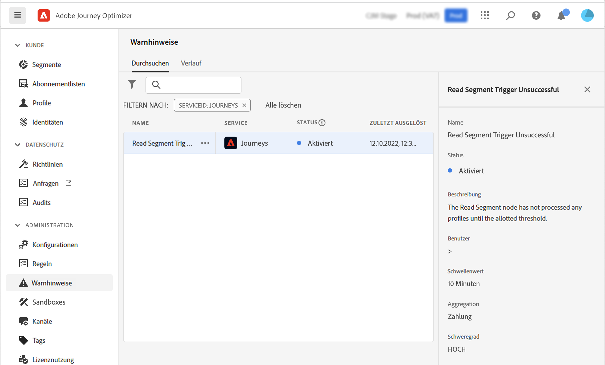
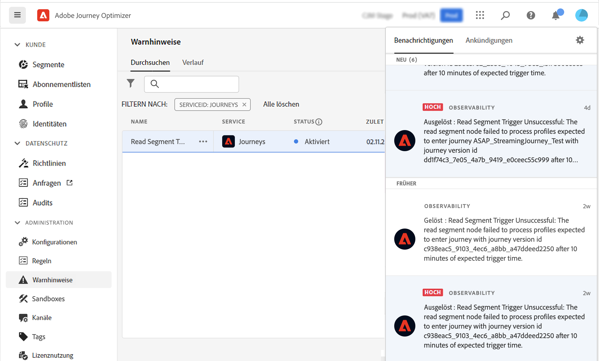

# Erste Schritte mit Warnhinweisen {#alerts}

Journey Optimizer nutzt die Warnfunktionen von Adobe Experience Platform. Damit können Sie über die Benutzeroberfläche auf Systemwarnhinweise zugreifen. Sie können die verfügbaren Warnhinweise einsehen und abonnieren.

Wenn bestimmte Bedingungen in Ihren Arbeitsablauf erfüllt sind (z. B. ein potenzielles Problem, wenn das System einen Schwellenwert überschreitet), werden allen Benutzern in Ihrer Organisation, die sich dafür angemeldet haben, Warnhinweise zugesendet. Diese Nachrichten können sich über einen vordefinierten Zeitraum wiederholen, bis der Warnhinweis behoben wurde.

Weitere Informationen zu Warnhinweisen in Adobe Experience Platform finden Sie in der [Dokumentation](https://experienceleague.adobe.com/docs/experience-platform/observability/alerts/overview.html?lang=de).
Informationen zum Abonnieren und Konfigurieren von Warnhinweisen finden Sie auf dieser [Seite](https://experienceleague.adobe.com/docs/experience-platform/observability/alerts/ui.html?lang=de).

>[!AVAILABILITY]
>
>Einige Design-Änderungen werden für den Warnhinweis „Auslöser für Segmentlesen erfolglos“ derzeit eingepflegt. Daher wird dieser Warnhinweis vorerst angehalten und wurde vorübergehend aus der Benutzeroberfläche entfernt. Sobald diese Änderungen veröffentlicht werden, wird der Warnhinweis erneut angezeigt und kann abonniert werden.

Klicken Sie im linken Menü unter **Administration** auf **Warnhinweise**.

<!--A pre-configured alert for Journey Optimizer is available. This alert will warn you if a read segment node has not processed any profile during the defined time frame.

-->

Tritt ein unerwartetes Verhalten auf, wird eine Warnmeldung per E-Mail an Warnhinweis-Abonnierende gesendet, in der rechten oberen Ecke der Benutzeroberfläche.

<!---->

Wenn [Warnhinweisregeln in der Adobe Experience Platform-Benutzeroberfläche angezeigt werden](https://experienceleague.adobe.com/docs/experience-platform/observability/alerts/ui.html?lang=de), kann jede Regel einzeln abonniert werden. Beim Abonnieren von Warnhinweisen über [I/O-Ereignisbenachrichtigungen](https://experienceleague.adobe.com/docs/experience-platform/observability/alerts/subscribe.html?lang=de) sind Warnhinweisregeln jedoch in verschiedene Abonnementpakete unterteilt.

<!--The I/O event subscription name corresponding to the Read segment alert is: "Journey read segment Delays, Failures and Errors".

>[!WARNING]
>
>These alerts apply only to live journeys. Alerts will not be triggered for journeys in test mode.-->
