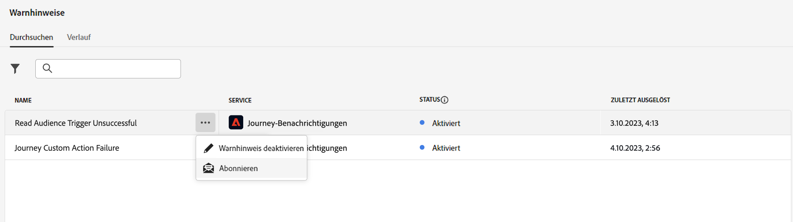

# Erste Schritte mit Warnhinweisen {#alerts}

## Warnfunktionen {#alerting-capabilities}

Sie können über die Benutzeroberfläche auf Systemwarnungen zugreifen oder eine E-Mail erhalten, wenn ein Fehler auftritt. Aus dem **Warnhinweise** können Sie die verfügbaren Warnungen anzeigen und abonnieren. Wenn bestimmte Bedingungen in Ihren Vorgängen erreicht werden (z. B. ein potenzielles Problem, wenn das System einen Schwellenwert überschreitet), werden Warnhinweise an alle Benutzer in Ihrer Organisation gesendet, die sich für sie angemeldet haben.

<!--These messages can repeat over a pre-defined time interval until the alert has been resolved.-->

Weitere Informationen zu Warnhinweisen in Adobe Experience Platform in [Adobe Experience Platform-Dokumentation](https://experienceleague.adobe.com/docs/experience-platform/observability/alerts/overview.html?lang=de){target="_blank"}.

Klicken Sie im linken Menü unter **Administration** auf **Warnhinweise**. Es stehen zwei vorkonfigurierte Warnhinweise für Journey Optimizer zur Verfügung: die [Journey Benutzerdefinierter Aktionsfehler](#alert-custom-actions) und [Trigger lesen fehlgeschlagen](#alert-read-audiences) Warnhinweis. Diese Warnungen werden nachfolgend beschrieben.

Sie können jeden Warnhinweis einzeln über die Benutzeroberfläche abonnieren, indem Sie die **Abonnieren** Option aus der **Warnhinweise** Dashboard. Verwenden Sie dieselbe Methode, um sich abzumelden.

Sie können Warnhinweise auch über [E/A-Ereignisbenachrichtigungen](https://experienceleague.adobe.com/docs/experience-platform/observability/alerts/subscribe.html?lang=de){target="_blank"}Warnhinweisregeln sind jedoch in verschiedene Abonnementpakete unterteilt.

Wenn ein unerwartetes Verhalten auftritt, wird eine Warnmeldung an die Abonnenten gesendet. Basierend auf den Benutzereinstellungen werden Warnhinweise per E-Mail oder direkt im Journey Optimizer-Benachrichtigungszentrum in der oberen rechten Ecke der Benutzeroberfläche gesendet.

Wenn ein Warnhinweis aufgelöst wird, erhalten Abonnenten die Benachrichtigung &quot;Gelöscht&quot;.

>[!WARNING]
>
>Adobe Journey Optimizer-spezifische Warnhinweise gelten nur für **live** Journey. Warnhinweise werden für Journey im Testmodus nicht ausgelöst.

## Journey Benutzerdefinierter Aktionsfehler {#alert-custom-actions}

Dieser Warnhinweis warnt Sie, wenn eine benutzerdefinierte Aktion fehlschlägt. Wir gehen davon aus, dass die Aktion fehlgeschlagen ist, wenn in den letzten 5 Minuten bei einer bestimmten benutzerdefinierten Aktion mehr als 1 % Fehler aufgetreten sind. Dies wird alle 30 Sekunden ausgewertet.

Warnhinweise zu benutzerdefinierten Aktionen werden aufgelöst, wenn in den letzten 5 Minuten:

* bei dieser benutzerdefinierten Aktion kein Fehler aufgetreten ist (oder Fehler unterhalb des Schwellenwerts von 1 %),

* Oder kein Profil hat diese benutzerdefinierte Aktion erreicht.

Der E/A-Ereignis-Abonnementname, der dem Warnhinweis für benutzerdefinierte Aktionen entspricht, lautet **Journey Benutzerdefinierter Aktionsfehler**.

## Trigger lesen fehlgeschlagen {#alert-read-audiences}

Dieser Warnhinweis warnt Sie, wenn ein **Audience lesen** -Aktivität hat kein Profil 10 Minuten nach der geplanten Ausführungszeit verarbeitet. Dieser Fehler kann durch technische Probleme verursacht werden oder weil die Zielgruppe leer ist.

Warnhinweise auf **Audience lesen** -Aktivitäten gelten nur für wiederkehrende Journey. **Audience lesen** Aktivitäten in Live-Journey mit einem Zeitplan für die Ausführung **Einmal** oder **So bald wie möglich** werden ignoriert.

Warnhinweise auf **Audience lesen** werden aufgelöst, wenn ein Profil **Audience lesen** Knoten.

Der Anmeldename für das E/A-Ereignis, der dem **Trigger lesen fehlgeschlagen** Warnhinweis **Journey Lesen von Segmentverzögerungen, Fehlern und Fehlern**.
