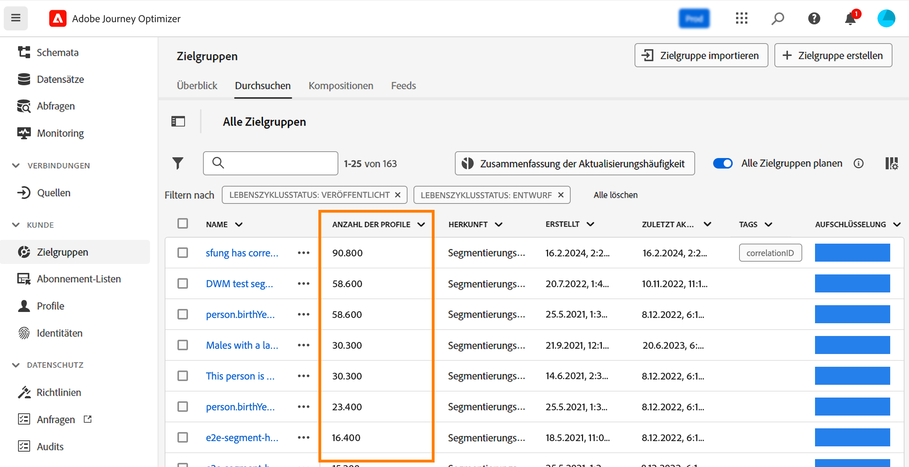
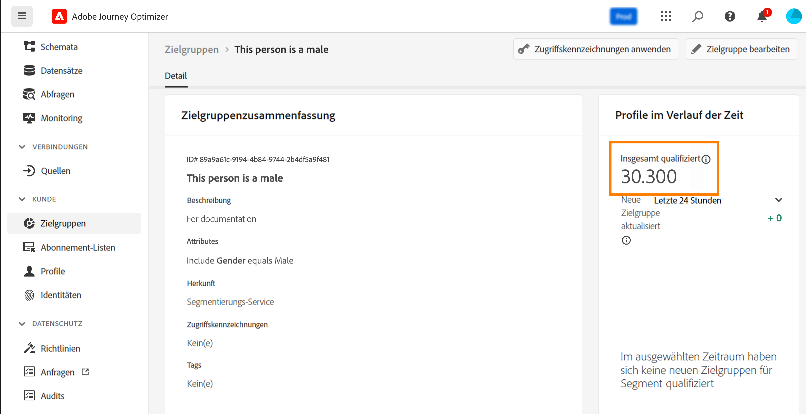
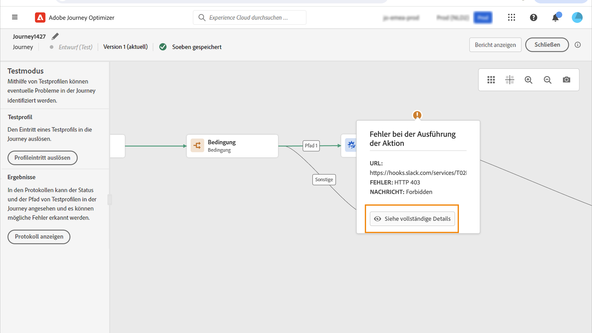

# Erste Schritte mit Warnhinweisen {#alerts}

Verwenden Sie beim Erstellen Ihrer Journeys und Kampagnen die Schaltfläche **Warnhinweise**, um vor der Ausführung oder Veröffentlichung der Journeys und Kampagnen Fehler zu überprüfen und zu beheben. Auf dieser Seite erfahren Sie, wie Sie Fehler bei Ihren Journey [ beheben ](../building-journeys/troubleshooting.md). Auf (dieser Seite) erfahren Sie[ wie Sie Ihre Kampagnen ](../campaigns/review-activate-campaign.md).

Sie können auch Adobe Journey Optimizer-Systemwarnhinweise abonnieren, wie auf dieser Seite beschrieben.

## Abrufen und Abonnieren von Warnhinweisen {#alerting-capabilities}

Wenn ein Fehler auftritt, können Sie im Journey Optimizer-Benachrichtigungszentrum (In-App-Warnungen) Systemwarnungen und/oder eine E-Mail erhalten.

Über das Menü **Warnhinweise** können Sie die verfügbaren Warnhinweise aufrufen und abonnieren. Wenn bei Ihren Vorgängen ein bestimmter Bedingungssatz erfüllt wird (wie beispielsweise ein mögliches Problem bei Überschreitung des Schwellenwerts), werden Warnmeldungen an alle Benutzerinnen und Benutzer in Ihrem Unternehmen gesendet, die diese abonniert haben.

<!--These messages can repeat over a pre-defined time interval until the alert has been resolved.-->

Weitere Informationen zu Warnhinweisen in Adobe Experience Platform finden Sie in der [Adobe Experience Platform-Dokumentation](https://experienceleague.adobe.com/docs/experience-platform/observability/alerts/overview.html?lang=de){target="_blank"}.

Klicken Sie im linken Menü unter **Administration** auf **Warnhinweise**. Es stehen zwei vorkonfigurierte Warnhinweise für Journey Optimizer zur Verfügung: [Benutzerdefinierte Journey-Aktion fehlgeschlagen](#alert-custom-actions) und [Zielgruppenauslöser konnte nicht gelesen werden](#alert-read-audiences). Diese Warnhinweise werden nachfolgend beschrieben.

Sie können jeden Warnhinweis einzeln über die Benutzeroberfläche abonnieren, indem Sie die Option **Abonnieren** im Dashboard **Warnhinweise** auswählen. Auf dieselbe Weise können Sie sich auch wieder abmelden.

Sie können Warnhinweise auch über [E/A-Ereignisbenachrichtigungen](https://experienceleague.adobe.com/docs/experience-platform/observability/alerts/subscribe.html?lang=de){target="_blank"} abonnieren. Warnregeln sind in verschiedene Abonnementpakete unterteilt. Abonnements für Ereignisse, die den jeweiligen Journey Optimizer-Warnhinweisen entsprechen, werden nachfolgend beschrieben.

Wenn ein unerwartetes Verhalten auftritt, wird eine Warnmeldung an die Abonnentinnen und Abonnenten gesendet. Je nach den Benutzereinstellungen werden Warnhinweise per E-Mail und/oder direkt im Journey Optimizer-Benachrichtigungszentrum oben rechts in der Benutzeroberfläche gesendet. Standardmäßig sind nur In-App-Warnhinweise aktiviert. Informationen zur Aktivierung von E-Mail-Benachrichtigungen finden Sie in der [Adobe Experience Platform-Dokumentation](https://experienceleague.adobe.com/docs/experience-platform/observability/alerts/ui.html?lang=de#enable-email-alerts){target="_blank"}.

Wenn ein Warnhinweis aufgelöst wurde, erhalten die Abonnentinnen und Abonnenten die Benachrichtigung „Aufgelöst“.

>[!CAUTION]
>
>Adobe Journey Optimizer-spezifische Warnhinweise gelten nur für **Live**-Journeys. Warnhinweise werden für Journeys im Testmodus nicht ausgelöst.

## Benutzerdefinierte Journey-Aktion fehlgeschlagen {#alert-custom-actions}

Dieser Warnhinweis warnt Sie, wenn eine benutzerdefinierte Aktion fehlschlägt. Wir gehen davon aus, dass die Aktion fehlgeschlagen ist, wenn in den letzten 5 Minuten bei einer bestimmten benutzerdefinierten Aktion mehr als 1 % Fehler aufgetreten sind. Dies wird alle 30 Sekunden ausgewertet.

Warnhinweise zu benutzerdefinierten Aktionen werden aufgelöst, wenn in den letzten 5 Minuten:

* bei dieser benutzerdefinierten Aktion keine Fehler (oder nur Fehler unter dem Schwellenwert von 1 %) aufgetreten sind.

* oder kein Profil diese benutzerdefinierte Aktion erreicht hat.

Der Name des E/A-Ereignissabonnements, der dem Warnhinweis für benutzerdefinierte Aktionen entspricht, lautet: **Benutzerdefinierte Journey-Aktion fehlgeschlagen**.

## Zielgruppe-lesen-Auslöser konnte nicht gelesen werden {#alert-read-audiences}

Dieser Warnhinweis erscheint, wenn eine Aktivität **Zielgruppe lesen** 10 Minuten nach der festgelegten Ausführungszeit kein Profil bearbeitet hat. Dieser Fehler kann durch technische Probleme oder eine leere Zielgruppe verursacht werden. Wenn dieser Fehler auf technische Probleme zurückzuführen ist, sind je nach Problemtyp dennoch weitere Versuche möglich (wenn z. B. die Erstellung eines Exportauftrags fehlgeschlagen ist, erfolgt alle 10 Minuten, aber höchstens eine Stunde lang, ein erneuter Versuch).

Warnhinweise zu **Zielgruppe lesen** gelten nur für wiederkehrende Journey. Aktivitäten vom Typ **Zielgruppe lesen** in Live-Journeys, für deren Ausführung **Einmal** oder **So bald wie möglich** festgelegt wurde, werden ignoriert.

Warnhinweise zu **Zielgruppe lesen** werden aufgelöst, wenn ein Profil den Knoten **Zielgruppe lesen** erreicht.

Der Name des E/A-Ereignisabonnements, das dem **Alert Read Audience Trigger Unsuccessful** entspricht, ist **Journey read audience Delays, Failures and Errors**.

## Fehlerbehebung {#alert-troubleshooting}

Überprüfen Sie zur Fehlerbehebung von Warnhinweisen bei **Zielgruppe lesen** die Anzahl Ihrer Zielgruppen auf der Experience Platform-Oberfläche.

Fehlerbehebung von Warnhinweisen bei **benutzerdefinierten Aktionen**:

* Prüfen Sie Ihre benutzerdefinierte Aktion mithilfe des Testmodus in einer anderen Journey:

  

* Prüfen Sie Ihren Journey-Bericht, um die Fehlerursachen für die Aktion zu sehen.

  

* Prüfen Sie Ihre Journey-stepEvents, um weitere Informationen zu „failureReason“ zu erhalten.

* Prüfen Sie die Konfiguration Ihrer benutzerdefinierten Aktion und überprüfen Sie, ob die Authentifizierung weiterhin korrekt ist. Führen Sie beispielsweise eine manuelle Prüfung mit Postman durch.
