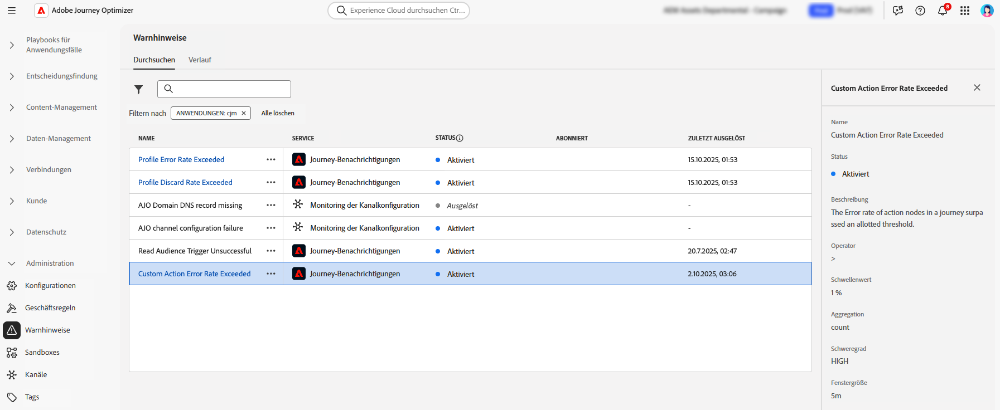
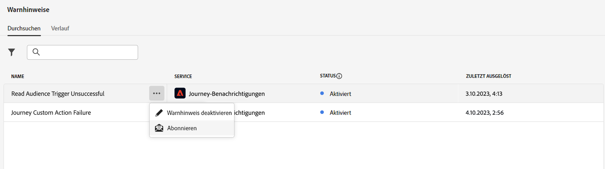
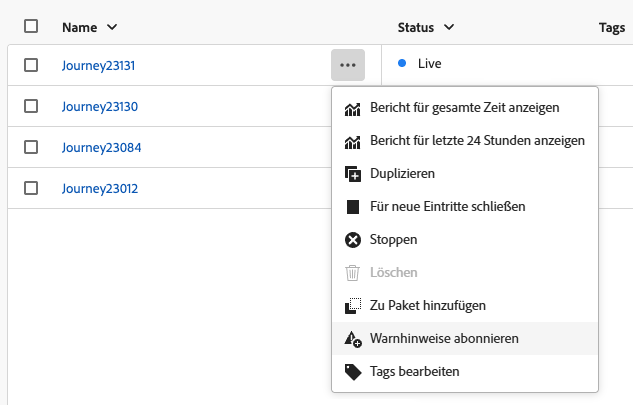
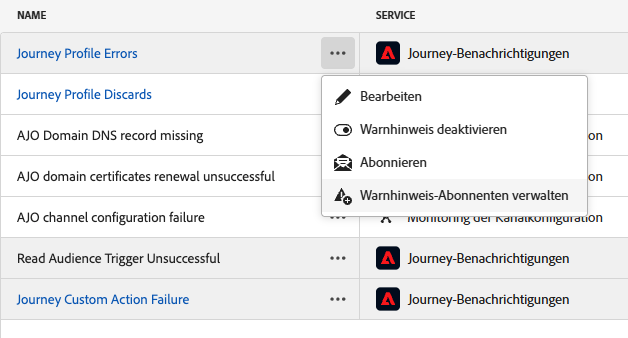
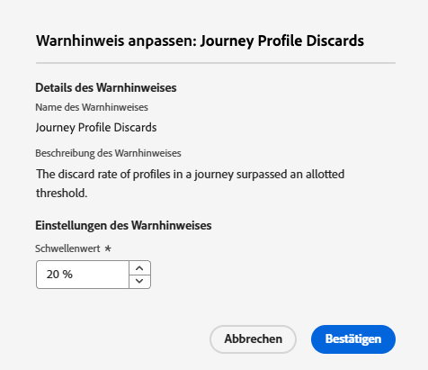
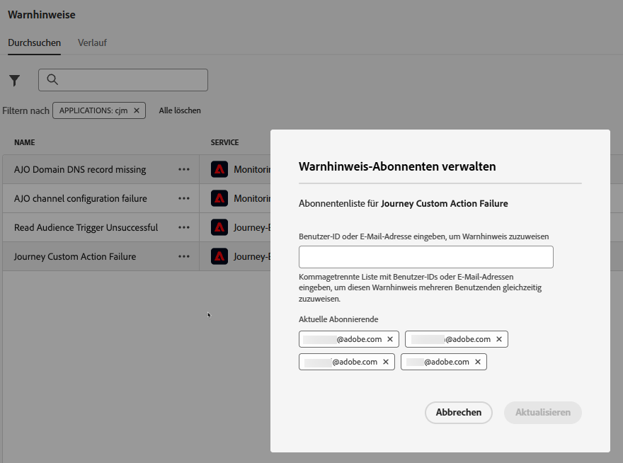

# Abrufen und Abonnieren von Systemwarnhinweisen {#alerts}

## Überblick

Warnhinweise sind automatische Benachrichtigungen, mit denen Sie Probleme in Adobe Journey Optimizer überwachen und beheben können. Sie bieten Echtzeit-Erkennung potenzieller Probleme in Ihren Journey-, Kampagnen- und Kanalkonfigurationen, sodass Sie Korrekturmaßnahmen ergreifen können, bevor Kundenerlebnisse beeinträchtigt werden.

Adobe Journey Optimizer bietet zwei Arten von Warnhinweisen:

* **Validierungswarnungen auf der Arbeitsfläche**: Verwenden Sie beim Erstellen von Journey und Kampagnen die Schaltfläche **Warnhinweise** auf der Arbeitsfläche, um Konfigurationsfehler vor der Veröffentlichung zu identifizieren und zu beheben. Erfahren Sie, wie [Fehler bei Ihren Journey](../building-journeys/troubleshooting.md) beheben und Ihre Kampagnen überprüfen können: [Aktionskampagnen](../campaigns/review-activate-campaign.md) | [API-ausgelöste Kampagnen](../campaigns/review-activate-api-triggered-campaign.md) | [Orchestrierte Kampagnen](../orchestrated/start-monitor-campaigns.md).

* **Systemüberwachungswarnungen** (auf dieser Seite beschrieben): Empfangen Sie proaktive Benachrichtigungen, wenn Betriebsschwellenwerte überschritten werden oder Probleme in Live-Journey- und Kanalkonfigurationen erkannt werden und wenn wichtige Kampagnenlebenszyklusereignisse auftreten (Aktivierung, Bereitstellung, Stopp und damit verbundene Fehler). Systemwarnungen überwachen Metriken wie Fehlerquoten, Profilverwerfen und E-Mail-Zustellbarkeitsprobleme zusätzlich zu diesen Kampagnenereignissen.

**Die wichtigsten Vorteile von Systemwarnungen:**

* Proaktive Problemerkennung vor der Beeinträchtigung des Kunden
* Automatisierte Überwachung von Journey-Leistung und -Zustand
* Frühwarnung bei Problemen mit der E-Mail-Zustellbarkeit
* Weniger Zeit für die Identifizierung und Lösung betrieblicher Probleme

Systemwarnhinweise sind im Menü **[!UICONTROL Warnhinweise]** unter **[!UICONTROL Administration]** verfügbar. Adobe Experience Platform bietet mehrere vordefinierte Warnhinweisregeln, die Sie aktivieren können, einschließlich [!DNL Adobe Journey Optimizer] Warnhinweise für Journey- und Kanalkonfigurationen.

## Voraussetzungen

Vor der Arbeit mit Warnhinweisen:

* **Berechtigungen**: Sie benötigen spezifische Berechtigungen zum Anzeigen und Verwalten von Warnhinweisen. Siehe [Erforderliche Berechtigungen in Adobe Experience Platform](https://experienceleague.adobe.com/docs/experience-platform/observability/alerts/overview.html#permissions){target="_blank"}.

* **Sandbox-**: Warnhinweis-Abonnements sind Sandbox-spezifisch. Wenn Sie Warnhinweise abonnieren, gelten diese nur für die aktuelle Sandbox. Wenn eine Sandbox zurückgesetzt wird, werden auch alle Warnhinweis-Abonnements zurückgesetzt.

* **Benachrichtigungseinstellungen**: Konfigurieren Sie, wie Sie Warnhinweise (E-Mail und/oder In-App) in Ihren [Adobe Experience Cloud-Einstellungen erhalten](../start/user-interface.md#in-product-uc).

## Verfügbare Warnhinweise {#available-alerts}

Journey Optimizer bietet vorkonfigurierte Warnhinweisregeln, die bestimmte Aspekte Ihrer Journey-, Kampagnen- und Kanalkonfigurationen überwachen. Sie müssen diese Warnhinweise nicht erstellen. Sie sind standardmäßig verfügbar und können über ein Abonnement aktiviert werden.

**So greifen Sie auf die Warnmeldungsliste zu:**

Navigieren Sie **[!UICONTROL linken Menü]** Administration > **[!UICONTROL Warnhinweise]**. Auf **Registerkarte** Durchsuchen“ werden alle vorkonfigurierten Warnhinweise angezeigt, die für Journey Optimizer verfügbar sind.

{width=60%}

Auf den folgenden Registerkarten können Sie Warnungen zur Journey-, Kampagnen- und Kanalkonfiguration überprüfen. Wählen Sie einen Warnhinweisnamen auf einer Registerkarte aus, um die vollständige Beschreibung zu erweitern.

>[!BEGINTABS]

>[!TAB Journey-Warnhinweise]

Auf dieser Registerkarte werden alle in der Benutzeroberfläche verfügbaren Journey-Benachrichtigungen aufgelistet. Wählen Sie einen Warnhinweisnamen aus, um die vollständige Beschreibung und Anleitung zu erweitern.

>[!CAUTION]
>
>Adobe Journey Optimizer-spezifische Warnhinweise gelten nur für **Live**-Journeys. Warnhinweise werden für Journeys im Testmodus nicht ausgelöst.

+++ Lesen des Zielgruppen-Triggers fehlgeschlagen

Dieser Warnhinweis erscheint, wenn eine Aktivität **Zielgruppe lesen** 10 Minuten nach der festgelegten Ausführungszeit kein Profil bearbeitet hat. Dieser Fehler kann durch technische Probleme oder eine leere Zielgruppe verursacht werden. Wenn dieser Fehler auf technische Probleme zurückzuführen ist, sind je nach Problemtyp dennoch weitere Versuche möglich (wenn z. B. die Erstellung eines Exportauftrags fehlgeschlagen ist, erfolgt alle 10 Minuten, aber höchstens eine Stunde lang, ein erneuter Versuch).

Warnhinweise zu **Zielgruppe lesen** gelten nur für wiederkehrende Journey. Aktivitäten vom Typ **Zielgruppe lesen** in Live-Journeys, für deren Ausführung **Einmal** oder **So bald wie möglich** festgelegt wurde, werden ignoriert.

Warnhinweise zu **Zielgruppe lesen** werden entweder aufgelöst, wenn ein Profil den Knoten **Zielgruppe lesen** erreicht, oder nach einer Stunde.

Der Name des I/O-Ereignis-Abonnements, das dem Warnhinweis **Auslösen von „Zielgruppe lesen“ fehlgeschlagen** entspricht, ist **Verzögerungen und Fehler bei Journeys des Typs „Zielgruppe lesen“**.

Überprüfen Sie zur Fehlerbehebung von Warnhinweisen bei **Zielgruppe lesen** die Anzahl Ihrer Zielgruppen auf der Experience Platform-Oberfläche.

➡️ [Zielgruppe lesen](../building-journeys/read-audience.md)

➡️ [Zielgruppen definieren und verwenden](../audience/about-audiences.md)

+++

+++ Verwerfungsrate des Profils überschritten

Dieser Warnhinweis warnt Sie, wenn das Verhältnis zwischen verworfenen Profilen und eingetretenen Profilen in den letzten 5 Minuten den Schwellenwert überschritten hat. Der standardmäßige Schwellenwert ist auf 20 % festgelegt, Sie können jedoch einen benutzerdefinierten Schwellenwert definieren.

Klicken Sie auf den Namen des Warnhinweises, um dessen Details und Konfiguration zu prüfen.

Es kann mehrere Gründe dafür geben, wieso ein Profil verworfen wird. Die Methode der Fehlerbehebung hängt vom Grund ab. Einige häufige Gründe sind unten aufgeführt:

* Ein Profil wird bei Eintritt verworfen, da es bereits auf dieser unitären Journey live ist. Um dies zu beheben, stellen Sie sicher, dass das Profil genügend Zeit zum Aussteigen aus der Journey hat, bevor das nächste Ereignis für dieses Profil beginnt.
* Die Identität ist nicht für das Profil festgelegt oder der in der Journey des Typs „Zielgruppe lesen“ verwendete Namespace wird in diesem Profil nicht genutzt. Um dies zu beheben, stellen Sie sicher, dass der Namespace in der Journey mit dem von den Profilen verwendeten Identity-Namespace übereinstimmt.
* Die Ereignisdurchsatzrate wurde überschritten. Um dies zu beheben, stellen Sie sicher, dass die in das System eingehenden Ereignisse diese Grenzwerte nicht überschreiten.

➡️ [Fehlerbehebung bei Journey-Problemen](../building-journeys/troubleshooting.md)

➡️ [Definieren eines benutzerdefinierten Warnschwellenwerts](#custom-threshold)

+++

+++ Fehlerrate für benutzerdefinierte Aktion überschritten

Dieser Warnhinweis warnt Sie, wenn das Verhältnis von Fehlern bei benutzerdefinierten Aktionen zu erfolgreichen HTTP-Aufrufen in den letzten 5 Minuten den Schwellenwert überschritten hat. Der standardmäßige Schwellenwert ist auf 20 % festgelegt, Sie können jedoch einen benutzerdefinierten Schwellenwert definieren.

>[!NOTE]
>
>Dieser Warnhinweis ersetzt den vorherigen Warnhinweis für **Fehlschlagen einer benutzerdefinierten Journey-Aktion**.

Klicken Sie auf den Namen des Warnhinweises, um dessen Details und Konfiguration zu prüfen.

Fehler bei benutzerdefinierten Aktionen können aus verschiedenen Gründen auftreten. Es gibt folgende Möglichkeiten zur Behebung dieser Fehler:

* Überprüfen Sie Ihre benutzerdefinierte Aktion mithilfe des Testmodus auf einer anderen Journey.
* Überprüfen Sie Ihren Journey-Bericht, um Fehlerursachen bei Aktionen anzuzeigen.
* Prüfen Sie Ihre Journey-stepEvents, um weitere Informationen zu „failureReason“ zu erhalten.
* Prüfen Sie, ob Ihre benutzerdefinierte Aktion korrekt konfiguriert ist, und stellen Sie sicher, dass die Authentifizierung weiterhin gültig ist. Führen Sie beispielsweise eine manuelle Prüfung mit Postman durch.
* Prüfen Sie, ob der Endpunkt erreichbar ist und die benutzerdefinierte Aktion ihn über die Konnektivitätsprüfung für benutzerdefinierte Aktionen erreichen kann.
* Überprüfen Sie die Anmeldeinformationen, die Internet-Verbindung usw.

➡️ [Validieren im Testmodus](../building-journeys/testing-the-journey.md)

➡️ [Überprüfen Sie den Live-Bericht zum Journey](../reports/journey-live-report.md)

➡️ [Konfigurieren benutzerdefinierter Aktionen](../action/about-custom-action-configuration.md)

➡️ [Definieren eines benutzerdefinierten Warnschwellenwerts](#custom-threshold)

+++

+++ Profil-Fehlerrate überschritten

Dieser Warnhinweis warnt Sie, wenn das Verhältnis zwischen fehlerhaften Profilen und eingetretenen Profilen in den letzten 5 Minuten den Schwellenwert überschritten hat. Der standardmäßige Schwellenwert ist auf 20 % festgelegt, Sie können jedoch einen benutzerdefinierten Schwellenwert definieren.

Klicken Sie auf den Namen des Warnhinweises, um dessen Details und Konfiguration zu prüfen.

Um Profilfehler zu beheben, können Sie die Daten in Schrittereignissen abfragen und so erfahren, wo und warum das Profil während der Journey fehlgeschlagen ist.

➡️ [Arbeiten mit Journey-Schrittereignissen](../reports/journey-step-events-overview.md)

➡️ [Überprüfen Sie den Live-Bericht zum Journey](../reports/journey-live-report.md)

➡️ [Definieren eines benutzerdefinierten Warnschwellenwerts](#custom-threshold)

+++

+++ Journey veröffentlicht

Dieser Warnhinweis informiert Sie, wenn eine Journey von jemandem auf der Journey-Arbeitsfläche veröffentlicht wurde.

Dies ist ein informativer Warnhinweis, mit dem Sie Journey-Lebenszyklusereignisse in Ihrem Unternehmen verfolgen können. Es gibt keine Auflösungskriterien, da es sich um eine einmalige Benachrichtigung handelt.

➡️ [Veröffentlichen Sie eine Journey](../building-journeys/publish-journey.md)

➡️ [Validieren im Testmodus](../building-journeys/testing-the-journey.md)

+++

+++ Journey abgeschlossen

Dieser Warnhinweis informiert Sie, wenn eine Journey abgeschlossen wurde. Die Definition von „beendet“ variiert je nach Journey-Typ.

Dies ist ein informativer Warnhinweis, mit dem Sie den Abschluss der Journey verfolgen können. Es gibt keine Auflösungskriterien, da es sich um eine einmalige Benachrichtigung handelt.

➡️ [Erfahren Sie, wann eine Journey fertig ist](../building-journeys/end-journey.md#journey-finished-definition)

+++

+++ Benutzerdefinierte Aktionsbegrenzung ausgelöst

Dieser Warnhinweis warnt Sie, wenn bei einer benutzerdefinierten Aktion eine Begrenzung ausgelöst wurde. Mit einer Begrenzung wird die Anzahl der an einen externen Endpunkt gesendeten Aufrufe begrenzt, um zu verhindern, dass der Endpunkt überlastet wird.

Klicken Sie auf den Namen des Warnhinweises, um dessen Details und Konfiguration zu prüfen.

Wenn eine Begrenzung ausgelöst wird, bedeutet dies, dass die maximale Anzahl von API-Aufrufen innerhalb des definierten Zeitraums erreicht wurde und weitere Aufrufe gedrosselt oder in die Warteschlange gestellt werden.

Dieser Warnhinweis wird aufgelöst, wenn die Begrenzung nicht mehr aktiv ist oder wenn während des Auswertungszeitraums keine Profile die benutzerdefinierte Aktion erreichen.

Beheben von Begrenzungsproblemen:

* Überprüfen Sie die Begrenzungskonfiguration für Ihre benutzerdefinierte Aktion, um sicherzustellen, dass die Beschränkungen für Ihren Anwendungsfall geeignet sind.
* Überprüfen Sie, ob die Anzahl der API-Aufrufe höher ist als erwartet, und passen Sie Ihr Journey-Design oder Ihre Begrenzungseinstellungen an.
* Überwachen Sie den externen Endpunkt, um sicherzustellen, dass er die erwartete Last verarbeiten kann.

➡️ [Konfigurieren der Begrenzung benutzerdefinierter Aktionen](../action/about-custom-action-configuration.md#custom-action-enhancements-best-practices)

+++

>[!TAB Campaign-Warnhinweise]

**Systemwarnungen benachrichtigen Sie, wenn wichtige Lebenszyklus- oder Bereitstellungsereignisse in (**- und **-ausgelösten** Kampagnen auftreten. Wählen Sie den Namen eines Warnhinweises unten aus, um seine Beschreibung zu erweitern.

+++ Kampagne aktiviert

Benachrichtigt Sie, wenn eine Kampagne erfolgreich **aktiviert** (Veröffentlichung/Aktivierung abgeschlossen) wurde.

➡️ [Überprüfen und Aktivieren einer Aktionskampagne](../campaigns/review-activate-campaign.md)

➡️ [Überprüfen und Aktivieren einer API-ausgelösten Kampagne](../campaigns/review-activate-api-triggered-campaign.md)

+++

+++ Kampagnenaktivierung fehlgeschlagen

Benachrichtigt Sie, wenn **Aktivierung** einer Kampagne **fehlschlägt**. Verwenden Sie diesen Warnhinweis, um Konfigurations- oder technische Probleme frühzeitig zu erkennen und die Kampagne erneut zu versuchen oder zu beheben, bevor Kunden betroffen sind.

➡️ [Überprüfen und Aktivieren einer Aktionskampagne](../campaigns/review-activate-campaign.md)

➡️ [Überprüfen und Aktivieren einer API-ausgelösten Kampagne](../campaigns/review-activate-api-triggered-campaign.md)

➡️ [Voraussetzungen und Kampagneneinrichtung überprüfen](../campaigns/get-started-with-campaigns.md)

+++

+++ Kampagne gestoppt

Benachrichtigt Sie, wenn eine Kampagne erfolgreich **gestoppt** wurde (z. B. nach einem manuellen Stopp oder wenn die Ausführung gemäß Ihrem Workflow abgeschlossen wird).

➡️ [Verstehen des Kampagnenstatus](../campaigns/manage-campaigns.md#statuses)

➡️ [Stoppen einer Aktionskampagne](../campaigns/manage-campaigns.md#stop)

+++

+++ Stoppen der Kampagne fehlgeschlagen

Benachrichtigt Sie, wenn ein **Stopp**-Vorgang **fehlschlägt**. Den Kampagnenstatus und alle in der Benutzeroberfläche angezeigten Fehler untersuchen und dann erneut versuchen.

➡️ [Verstehen des Kampagnenstatus](../campaigns/manage-campaigns.md#statuses)

➡️ [Interpretieren von Fehlerindikatoren](../campaigns/manage-campaigns.md#error-indicators)

➡️ [Stoppen einer Aktionskampagne](../campaigns/manage-campaigns.md#stop)

+++

+++ Kampagnenbereitstellung gestartet

Benachrichtigt Sie, wenn **Nachrichtenversand** für eine Kampagne **gestartet** wurde (Ausführung in die Versandphase eingetreten).

➡️ [Überprüfen des Kampagnenberichts (CJA)](../reports/campaign-global-report-cja.md)

➡️ [Kampagnen verwalten](../campaigns/manage-campaigns.md)

+++

+++ Kampagnenbereitstellung abgeschlossen

Benachrichtigt Sie, wenn **Nachrichtenversand** für eine Kampagne erfolgreich **abgeschlossen**.

➡️ [Überprüfen des Kampagnenberichts (CJA)](../reports/campaign-global-report-cja.md)

➡️ [Kampagnen verwalten](../campaigns/manage-campaigns.md)

+++

+++ Kampagnenbereitstellung fehlgeschlagen

Benachrichtigt Sie, wenn **Nachrichtenversand** für eine Kampagne **fehlschlägt**. Überprüfen Sie Kampagnenberichte, Ausführungsprotokolle und Kanalkonfiguration zur Fehlerbehebung.

➡️ [Überprüfen des Kampagnenberichts (CJA)](../reports/campaign-global-report-cja.md)

➡️ [Interpretieren von Fehlerindikatoren](../campaigns/manage-campaigns.md#error-indicators)

➡️ [Konfigurieren des Kanalversands](../configuration/channel-surfaces.md)

+++

>[!TAB Warnhinweise zur Kanalkonfiguration]

Warnhinweise zur Überwachung der Kanalkonfiguration, die in der Benutzeroberfläche verfügbar sind, werden auf dieser Registerkarte aufgeführt. Wählen Sie einen Warnhinweisnamen aus, um die Schritte zur Behebung und Hinweise zu erweitern.

+++ DNS-Eintrag für AJO-Domain fehlt

Dieser Warnhinweis benachrichtigt Sie, wenn kritische DNS-Einträge (NS oder CNAME), die für eine ordnungsgemäße Zustellbarkeitskonfiguration erforderlich sind, fehlen oder falsch konfiguriert sind. Ohne diese Einträge kann die E-Mail-Zustellbarkeit beeinträchtigt sein.

>[!NOTE]
>
>* NS-Einträge sind für die vollständige Subdomain-Delegierung an Adobe unerlässlich. [Weitere Informationen](../configuration/about-subdomain-delegation.md#full-subdomain-delegation)
>
>* CNAME-Einträge unterstützen die Einrichtung von CNAME-Subdomains. [Weitere Informationen](../configuration/about-subdomain-delegation.md#cname-subdomain-setup)

Der Warnhinweis **DNS-Eintrag für AJO-Domain fehlt** wird ausgelöst, wenn das System erkennt, dass die erforderlichen NS- oder CNAME-Einträge fehlen oder nicht den Konfigurationsstandards entsprechen.

1. Klicken Sie auf den Warnhinweis, um zur betroffenen [Subdomain](../configuration/delegate-subdomain.md) in der [!DNL Journey Optimizer]-Benutzeroberfläche weitergeleitet zu werden.

   <!--For guidance on editing delegated subdomains, see [this section](../configuration/delegate-subdomain.md).-->

1. Stellen Sie die DNS-Konfiguration wieder her, indem Sie die Einträge korrekt festlegen und die Delegierung der [Subdomain erneut übermitteln](../configuration/delegate-subdomain.md#submit-subdomain).

   >[!NOTE]
   >
   >Stellen Sie sicher, dass alle Einträge ordnungsgemäß in Ihrer Domain-Hosting-Lösung erstellt wurden, bevor Sie fortfahren.

1. Wenn Sie sich nicht sicher sind, welche Werte richtig sind, können Sie in [!DNL Journey Optimizer] eine neue Subdomain mit demselben Namen wie die betroffene Subdomain erstellen. [Informationen dazu, wie Sie eine neue Subdomain einrichten](../configuration/delegate-subdomain.md#set-up-subdomain)

Wenn das Problem trotz der Änderungen weiterhin besteht, wird derselbe Warnhinweis am nächsten Tag erneut ausgelöst.

<!--The I/O event subscription name corresponding to this alert is xx. > Do we need to mention this?-->

+++

+++ Fehler bei der AJO-Kanalkonfiguration

>[!IMPORTANT]
>
>Dieser Warnhinweis gilt nur für **E-Mail**-Kanalkonfigurationen, die den Delegierungstyp [benutzerdefinierte Subdomain](../configuration/delegate-custom-subdomain.md) verwenden. <!--Other channel types (such as SMS, push, or in-app) are not covered by this alert.-->

Dieser Warnhinweis wird ausgelöst, wenn das System-Audit Konfigurationsprobleme beim E-Mail-Kanal erkennt. Zu den Problemen können falsch konfigurierte Kanaleinstellungen, eine ungültige DNS-Konfiguration, ein Problem mit der Unterdrückungsliste, IP-Inkonsistenzen oder andere Fehler gehören, die sich auf den E-Mail-Versand auswirken.

Wenn Sie einen solchen Warnhinweis erhalten, sind die Auflösungsschritte unten aufgeführt.

1. Klicken Sie auf den Warnhinweis, um zur betroffenen [E-Mail-Kanalkonfiguration](../email/get-started-email-config.md) in der [!DNL Journey Optimizer]-Benutzeroberfläche weitergeleitet zu werden.

   Anleitungen zum Bearbeiten von Kanalkonfigurationen finden Sie [diesem Abschnitt](../configuration/channel-surfaces.md#edit-channel-surface).

1. Prüfen Sie die Konfigurationsdetails und Fehlermeldungen. Häufige Fehlerursachen sind:

   * SPF-Validierung fehlgeschlagen
   * DKIM-Validierung fehlgeschlagen
   * MX-Eintragsvalidierung fehlgeschlagen
   * Ungültige DNS-Einträge

   >[!NOTE]
   >
   >Die möglichen Ursachen für Konfigurationsfehler sind in [diesem Abschnitt](../configuration/channel-surfaces.md) aufgelistet.

1. Beheben Sie das Problem:

   * Aktualisieren Sie die Kanalkonfiguration nach Bedarf.
   * Möglicherweise müssen Sie bestimmte DNS-Probleme beheben, die in dem Warnhinweis erwähnt werden.

   >[!NOTE]
   >
   >Da eine einzelne Domain mit mehreren Kanalkonfigurationen verknüpft sein kann, können verwandte Probleme in verschiedenen Konfigurationen automatisch behoben werden, wenn DNS-Probleme für eine Kanalkonfiguration behoben werden.

Wenn das Problem trotz der Änderung weiterhin besteht, wird derselbe Warnhinweis am nächsten Tag erneut ausgelöst.

Beachten Sie beim Beheben von E-Mail-Konfigurationsproblemen die unten aufgeführten Best Practices:

* Handeln Sie sofort – Beheben Sie Konfigurationsfehler, sobald sie erkannt werden, um Unterbrechungen beim E-Mail-Versand zu vermeiden.
* Prüfen Sie alle Konfigurationen – Wenn der Warnhinweis mehrere betroffene E-Mail-Konfigurationen anzeigt, überprüfen und beheben Sie jede einzelne davon.

+++

+++ Verlängerung von AJO-Domänenzertifikaten fehlgeschlagen

>[!IMPORTANT]
>
>Dieser Warnhinweis gilt nur für Kanalkonfigurationen mit dem Delegationstyp [benutzerdefinierte Subdomain](../configuration/delegate-custom-subdomain.md).

Dieser Warnhinweis benachrichtigt Sie, wenn ein Zertifikat für eine Ressourcen- oder Tracking-Domain in einer benutzerdefinierten Subdomain-Delegierung innerhalb von 30 Tagen abläuft oder bereits abgelaufen ist. Ohne gültige Zertifikate kann die E-Mail-Zustellbarkeit und das Linktracking unterbrochen sein.

>[!NOTE]
>
>Die Prüfung wird **wöchentlich** ausgeführt.

Wenn dieser Warnhinweis ausgelöst wird, führen Sie die folgenden Schritte aus, um das Problem zu untersuchen und zu beheben.

1. Klicken Sie auf den Warnhinweis, um die betroffene [Subdomain](../configuration/delegate-subdomain.md) in [!DNL Journey Optimizer] zu öffnen.

1. Überprüfen Sie die Details, um festzustellen, ob eine Zertifikatsverlängerung erforderlich ist.

   * Wenn das Ablaufdatum in der Zukunft liegt, planen Sie die Behebung - der Warnhinweis kann bis zu 30 Tage lang gewarnt werden.
   * Wenn das Zertifikat bereits abgelaufen ist, ergreifen Sie unverzüglich Maßnahmen.
   * Wenn das Problem nicht behoben ist, wird derselbe Warnhinweis in der folgenden Woche erneut ausgelöst.

1. Stellen Sie in Ihrer DNS-Hosting-Lösung sicher, dass alle für die Subdomain-Delegierung erforderlichen Einträge weiterhin den in [!DNL Journey Optimizer] angezeigten Werten entsprechen, einschließlich der für die SSL-Validierung verwendeten Einträge.

+++

>[!ENDTABS]

>[!NOTE]
>
>Warnhinweise von anderen Adobe Experience Platform-Services (Datenaufnahme, Identitätsauflösung, Segmentierung usw.) finden Sie in der [Standarddokumentation zu Warnhinweisregeln](https://experienceleague.adobe.com/docs/experience-platform/observability/alerts/rules.html){target="_blank"}.

## Abonnieren von Warnhinweisen {#subscribe-alerts}

Warnhinweis-Abonnements bestimmen, welche Benutzer Benachrichtigungen erhalten, wenn bestimmte Bedingungen erfüllt sind (z. B. Schwellenwerte für Fehlerquoten oder erkannte Konfigurationsprobleme). Nur abonnierte Benutzer erhalten Warnhinweise für die ausgewählten Warnhinweise.

### Funktionsweise von Warnhinweisen

**Warnhinweis-Lebenszyklus:**

1. **Auslösen**: Der Warnhinweis wird Trigger, wenn seine spezifische Bedingung erfüllt ist (z. B. die Fehlerrate überschreitet 20 %).
2. **Benachrichtigung**: Alle abonnierten Benutzer erhalten Benachrichtigungen über ihre konfigurierten Kanäle
3. **Überwachung**: Der Warnhinweis überwacht den Zustand weiterhin in regelmäßigen Abständen
4. **Lösung**: Nach Behebung der Bedingung erhalten Abonnentinnen und Abonnenten eine Benachrichtigung mit dem Hinweis „Aufgelöst“

**Benachrichtigungsversand:**

* **Versandkanäle**: Warnhinweise werden per E-Mail und/oder In-App-Benachrichtigungen im Journey Optimizer-Benachrichtigungszentrum gesendet (Glockensymbol oben rechts). Konfigurieren Sie Ihre bevorzugten Versandkanäle in Ihren [Adobe Experience Cloud-Voreinstellungen](../start/user-interface.md#in-product-uc).

* **Warnhinweistypen**: Journey Optimizer bietet sowohl einmalige Warnhinweise (Informationsereignisse wie &quot;Journey veröffentlicht„) als auch sich wiederholende Warnhinweise (Überwachungsschwellen). Die Auswertung und Benachrichtigung bei sich wiederholenden Warnhinweisen wird fortgesetzt, bis die Bedingung behoben ist.

* **Automatische Auflösung**: Um zu verhindern, dass die Benachrichtigungsermüdung zu schwankenden Werten führt, werden Warnhinweise nach einer Stunde automatisch aufgelöst, selbst wenn die Bedingung weiterhin besteht. Dadurch werden kontinuierliche Benachrichtigungen verhindert, wenn Metriken über Schwellenwerte bewegen.

**Alternative Anmeldemethode:**

Bei erweiterten Integrationen können Sie über I/O Events abonnieren, um Warnhinweise an externe Systeme zu senden. Weitere Informationen sind in der [Dokumentation zu Adobe Experience Platform](https://experienceleague.adobe.com/docs/experience-platform/observability/alerts/subscribe.html?lang=de){target="_blank"} verfügbar.

### Abonnementmethoden

Warnhinweise können auf verschiedene Arten abonniert werden:

* **[Globales (Sandbox) Abonnement](#subscribe-alerts)**: Empfangen Sie Benachrichtigungen für alle übereinstimmenden Journey oder Kampagnen in der **aktuellen Sandbox**. Verwenden Sie dies, wenn Sie eine breite Abdeckung wünschen.
* **[Journey-spezifisches Abonnement](#subscribe-alerts)**: Beschränken Sie die Benachrichtigungen für unterstützte Journey-Warnhinweise auf jeweils **Journey** aus dem Journey-Inventar.
* **Kampagnenspezifisches Abonnement**: Warnhinweise zum Kampagnenlebenszyklus können derzeit nur auf Sandbox-Ebene abonniert werden.

>[!BEGINTABS]

>[!TAB Globales Abonnement]

Globale Abonnements ermöglichen den Empfang von Warnhinweisen für alle Journey und Kampagnen in der aktuellen Sandbox.

**So abonnieren Sie einen Warnhinweis:**

1. Navigieren Sie **[!UICONTROL linken Menü]** Administration > **[!UICONTROL Warnhinweise]**.

1. Suchen Sie auf **[!UICONTROL Registerkarte]** Durchsuchen“ den Warnhinweis, den Sie überwachen möchten.

1. Klicken Sie **[!UICONTROL den gewünschten]** auf „Abonnieren“.

   {width=80%}

**Abo kündigen:**

Klicken Sie **[!UICONTROL Abo beenden]** neben dem Warnhinweis.

>[!IMPORTANT]
>
>Warnhinweis-Abonnements sind sandbox-spezifisch. Sie müssen Warnhinweise separat in jeder Sandbox abonnieren, in der Sie Benachrichtigungen erhalten möchten.

**Alternative Anmeldemethode:**

Sie können auch über [E/A-Ereignisbenachrichtigungen](https://experienceleague.adobe.com/docs/experience-platform/observability/alerts/subscribe.html?lang=de){target="_blank"} abonnieren, was die Integration in externe Systeme ermöglicht. Journey-Warnhinweis-E/A-Abonnementnamen sind auf der Registerkarte [Journey-Warnhinweise](#available-alerts) unter **Verfügbare Warnhinweise** aufgeführt. Warnhinweise zum Kampagnenlebenszyklus folgen demselben Platform-Abonnementmodell. Informationen zur programmgesteuerten Integration finden Sie in dieser Dokumentation.

>[!TAB Journey-spezifisches Abonnement]

Journey-spezifische Abonnements ermöglichen es Ihnen, einzelne Journey mit hoher Priorität zu überwachen, ohne Warnhinweise für alle Journey in Ihrem Unternehmen zu erhalten.

**So abonnieren Sie Warnhinweise für eine bestimmte Journey:**

1. Gehen Sie zum Journey-Inventar.

1. Klicken Sie auf das **⋯**-Menü (weitere Aktionen) für die Journey, die Sie überwachen möchten.

1. Wählen Sie **[!UICONTROL Warnhinweise abonnieren]** aus.

   {width=75%}

1. Wählen Sie aus den verfügbaren Optionen den/die Warnhinweis(e) aus, den/die Sie aktivieren möchten:
   * [Rate beim Verwerfen des Profils überschritten](#available-alerts)
   * [Fehlerrate bei benutzerdefinierter Aktion überschritten](#available-alerts)
   * [Fehlerrate bei Profil überschritten](#available-alerts)
   * [Journey veröffentlicht](#available-alerts)
   * [Journey abgeschlossen](#available-alerts)
   * [Begrenzung benutzerdefinierter Aktionen ausgelöst](#available-alerts)

1. Klicken Sie **[!UICONTROL Speichern]**, um Ihre Abonnements zu bestätigen.

**Abo kündigen:**

Öffnen Sie dasselbe Dialogfeld, heben Sie die Auswahl der Warnhinweise auf und klicken Sie auf **[!UICONTROL Speichern]**.

>[!NOTE]
>
>Der Warnhinweis [Zielgruppen-Trigger nicht erfolgreich](#available-alerts) ist nur über ein globales Abonnement verfügbar, nicht pro Journey-Abonnement.

>[!ENDTABS]

<!--
Campaign-specific subscriptions apply to the [campaign lifecycle alerts](#available-alerts). They let you monitor individual high-priority campaigns without receiving the same alert for every campaign in the sandbox.

**To subscribe to campaign lifecycle alerts for a specific campaign:**

1. Go to the **[!UICONTROL Campaigns]** inventory and open the tab for your campaign type (**[!UICONTROL Action]** or **[!UICONTROL API triggered]**).

1. Click the **⋯** (more actions) menu for the campaign you want to monitor.

1. Select **[!UICONTROL Subscribe to alerts]**.

1. Select the campaign lifecycle alert(s) you want from the available options (see [Campaign alerts](#available-alerts)).

1. Click **[!UICONTROL Save]** to confirm your subscriptions.

**To unsubscribe:**

Open the same dialog, deselect the alert(s), and click **[!UICONTROL Save]**.

You can combine **sandbox-level** subscription (from the Alerts **[!UICONTROL Browse]** tab) with **campaign-specific** subscriptions. Use sandbox-level coverage for everything in the sandbox, and add per-campaign subscriptions only for campaigns you want to track separately.
-->

<!--To enable email alerting, refer to [Adobe Experience Platform documentation](https://experienceleague.adobe.com/docs/experience-platform/observability/alerts/ui.html#enable-email-alerts){target="_blank"}.-->

## Verwalten von Warnhinweisen {#manage-alerts}

### Bearbeiten eines Warnhinweises

Sie können die Details eines Warnhinweises überprüfen, indem Sie auf dessen Zeile klicken. Der Name, der Status und die Benachrichtigungskanäle werden im linken Bereich angezeigt.
Zum Journey von Warnhinweisen verwenden Sie die Schaltfläche **[!UICONTROL Weitere Aktionen]**, um sie zu bearbeiten. Anschließend können Sie einen [benutzerdefinierten Schwellenwert](#custom-threshold) für diese Warnhinweise definieren.

{width=60%}

### Definieren eines benutzerdefinierten Schwellenwerts {#custom-threshold}

Sie können Schwellenwerte für die [Journey-Warnhinweise](#available-alerts) festlegen. Der Schwellenwert für die obigen Warnhinweise liegt standardmäßig bei 20 %.

Ändern des Schwellenwerts:

1. Navigieren Sie zum Bildschirm **Warnhinweise**.
1. Klicken Sie auf die Schaltfläche **[!UICONTROL Weitere Aktionen]** des zu aktualisierenden Warnhinweises.
1. Geben Sie den neuen Schwellenwert ein und bestätigen Sie. Der neue Schwellenwert gilt für **alle** Journeys.

{width=60%}

>[!CAUTION]
>
>Die Schwellenwerte gelten für alle Journeys und können nicht einzeln pro Journey geändert werden.

### Deaktivieren eines Warnhinweises

Standardmäßig sind alle Warnhinweise aktiviert. Um einen Warnhinweis zu deaktivieren, wählen Sie die Option **[!UICONTROL Warnhinweis deaktivieren]**: Alle Abonnierenden dieses Warnhinweises erhalten die entsprechenden Benachrichtigungen dann nicht mehr.

### Status von Warnhinweisen

Die möglichen Status von Warnhinweisen sind unten aufgeführt:

* **[!UICONTROL Aktiviert]** – Der Warnhinweis ist aktiviert, und es wird derzeit auf die Auslösebedingung überwacht.
* **[!UICONTROL Deaktiviert]** – Der Warnhinweis ist deaktiviert, und es wird derzeit nicht auf die Auslösebedingung überwacht. Sie erhalten keine Benachrichtigungen für diesen Warnhinweis.
* **[!UICONTROL Ausgelöst]** – Die Auslösebedingung für den Warnhinweis ist derzeit erfüllt.

### Anzeigen und Aktualisieren von Abonnierenden {#manage-subscribers}

Wählen Sie **[!UICONTROL Warnhinweis-Abonnierende verwalten]** aus, um die Liste der Benutzenden anzuzeigen, die den Warnhinweis abonniert haben.

{width=80%}

Um weitere Abonnierende hinzuzufügen, geben Sie ihre E-Mail-Adressen durch Kommata getrennt ein und wählen Sie **[!UICONTROL Aktualisieren]** aus.

Um Abonnierende zu entfernen, löschen Sie ihre E-Mail-Adressen aus den aktuellen Abonnierenden und wählen Sie **[!UICONTROL Aktualisieren]** aus.

## Verwandte Themen {#additional-resources-alerts}

**Journey- und Kampagnenverwaltung:**

* [Fehlerbehebung bei Journey](../building-journeys/troubleshooting.md) - Identifizieren und Beheben häufiger Journey-Probleme und -Fehler
* [Journey testen und veröffentlichen](../building-journeys/publish-journey.md) - Validieren der Journey-Konfiguration vor der Veröffentlichung
* [Überprüfen und Aktivieren von Aktionskampagnen](../campaigns/review-activate-campaign.md) - Validierung vor der Veröffentlichung für geplante und einmalige Kampagnen
* [Überprüfen und Aktivieren von API-ausgelösten Kampagnen](../campaigns/review-activate-api-triggered-campaign.md) - Validierung für API-ausgelöste Kampagnen
* [Überwachen orchestrierter Kampagnen](../orchestrated/start-monitor-campaigns.md) - Verfolgen und Verwalten der orchestrierten Kampagnenausführung

**Warnhinweis-Framework:**

* [Übersicht über Adobe Experience Platform-Warnhinweise](https://experienceleague.adobe.com/docs/experience-platform/observability/alerts/overview.html?lang=de){target="_blank"} - Grundlagen zum Warnhinweis-Framework
* [Verwalten von Warnhinweisen in der ](https://experienceleague.adobe.com/docs/experience-platform/observability/alerts/ui.html?lang=de){target="_blank"}: Anzeigen, Abonnieren und Verwalten von Warnhinweisen
* [Warnhinweise über I/O-Ereignisse abonnieren](https://experienceleague.adobe.com/docs/experience-platform/observability/alerts/subscribe.html?lang=de){target="_blank"} - Erweiterte Integrationsoptionen
* [Standardwarnungsregeln](https://experienceleague.adobe.com/docs/experience-platform/observability/alerts/rules.html){target="_blank"} - Vollständige Liste der verfügbaren Platform-Warnungen
