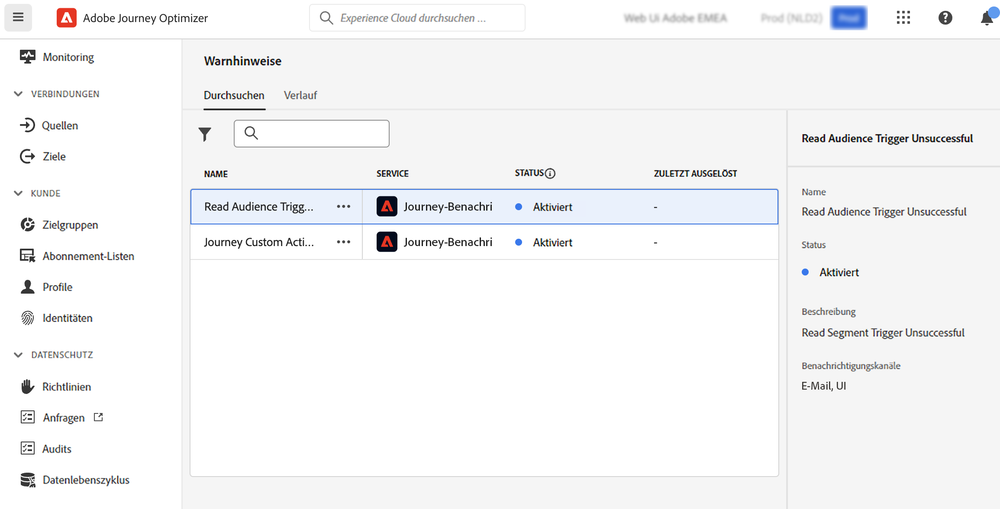

# Erste Schritte mit Warnhinweisen {#alerts}

Journey Optimizer nutzt die Warnfunktionen von Adobe Experience Platform. Damit können Sie über die Benutzeroberfläche auf Systemwarnhinweise zugreifen. Sie können die verfügbaren Warnhinweise einsehen und abonnieren.

Wenn bestimmte Bedingungen in Ihren Arbeitsablauf erfüllt sind (z. B. ein potenzielles Problem, wenn das System einen Schwellenwert überschreitet), werden allen Benutzern in Ihrer Organisation, die sich dafür angemeldet haben, Warnhinweise zugesendet.

<!--These messages can repeat over a pre-defined time interval until the alert has been resolved.-->

Weitere Informationen zu Warnhinweisen in Adobe Experience Platform finden Sie in der [Dokumentation](https://experienceleague.adobe.com/docs/experience-platform/observability/alerts/overview.html?lang=de).

Informationen zum Abonnieren und Konfigurieren von Warnhinweisen finden Sie auf dieser [Seite](https://experienceleague.adobe.com/docs/experience-platform/observability/alerts/ui.html?lang=de).

>[!AVAILABILITY]
>
>Einige Designänderungen werden für die Warnung &quot;Audience Trigger nicht erfolgreich lesen&quot;durchgeführt. Daher wird diese Warnung vorerst angehalten und vorübergehend aus der Benutzeroberfläche entfernt. Sobald diese Änderungen veröffentlicht werden, wird der Warnhinweis erneut angezeigt und kann abonniert werden.

Klicken Sie im linken Menü unter **Administration** auf **Warnhinweise**. Für Journey Optimizer ist ein vorkonfigurierter Warnhinweis verfügbar. Dieser Warnhinweis warnt Sie, wenn eine benutzerdefinierte Aktion fehlschlägt. Wir gehen davon aus, dass es einen Fehler gibt, bei dem in den letzten 5 Minuten mehr als 1 % der Fehler bei einer bestimmten benutzerdefinierten Aktion aufgetreten sind. Dies wird alle 30 Sekunden ausgewertet.

<!--A pre-configured alert for Journey Optimizer is available. This alert will warn you if a read segment node has not processed any profile during the defined time frame.

-->

Tritt ein unerwartetes Verhalten auf, wird den Abonnenten des Warnhinweises per E-Mail oder direkt in Journey Optimizer in der oberen rechten Ecke der Benutzeroberfläche eine Benachrichtigung gesendet, die auf den Benutzereinstellungen basiert.

Wenn ein Warnhinweis aufgelöst wurde, erhalten Sie eine Benachrichtigung &quot;Aufgelöst&quot;. Für die Warnung zur benutzerdefinierten Aktion kann dies aus zwei Gründen passieren:
* In den letzten 5 Minuten ist kein Fehler bei dieser benutzerdefinierten Aktion aufgetreten (oder Fehler unter dem Schwellenwert von 1 %).
* Kein Profil hat diese benutzerdefinierte Aktion erreicht.

Wenn [Warnhinweisregeln in der Adobe Experience Platform-Benutzeroberfläche angezeigt werden](https://experienceleague.adobe.com/docs/experience-platform/observability/alerts/ui.html?lang=de), kann jede Regel einzeln abonniert werden. Beim Abonnieren von Warnhinweisen über [E/A-Ereignisbenachrichtigungen](https://experienceleague.adobe.com/docs/experience-platform/observability/alerts/subscribe.html?lang=de) sind Warnhinweisregeln jedoch in verschiedene Abonnementpakete unterteilt. Der E/A-Ereignis-Abonnementname, der dem Warnhinweis für benutzerdefinierte Aktionen entspricht, lautet: &quot;Journey Custom Action Failure&quot;.

<!--The I/O event subscription name corresponding to the Read segment alert is: "Journey read segment Delays, Failures and Errors".-->

>[!WARNING]
>
>Diese Warnhinweise gelten nur für Live-Journeys. Warnhinweise werden für Journeys im Testmodus nicht ausgelöst.

