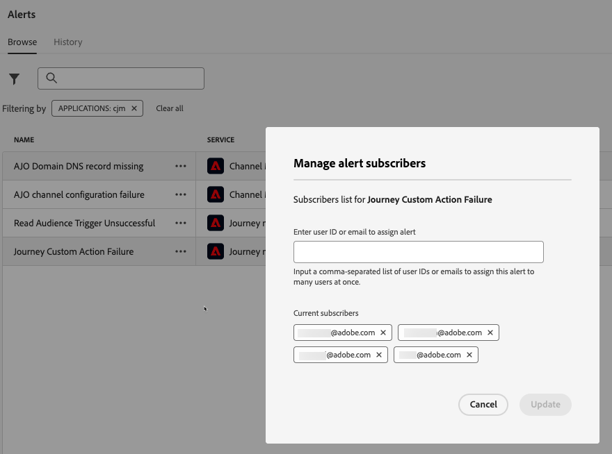

# Abrufen und Abonnieren von Systemwarnhinweisen {#alerts}

Verwenden Sie beim Erstellen Ihrer Journeys und Kampagnen die Schaltfläche **Warnhinweise**, um Fehler vor der Ausführung oder Veröffentlichung zu überprüfen und zu beheben.

* Auf dieser Seite erfahren Sie, wie Sie Probleme mit Ihren Journey [&#x200B; beheben](../building-journeys/troubleshooting.md)

* Auf dieser Seite erfahren Sie, wie Sie Ihre Kampagnen [&#x200B; können](../campaigns/review-activate-campaign.md)

Zusätzlich können bei Erreichen eines bestimmten Bedingungssatzes Warnmeldungen an alle Benutzer in Ihrer Organisation gesendet werden, die sich dafür angemeldet haben. Diese Warnhinweise sind im entsprechenden Menü **[!UICONTROL Warnhinweise]** verfügbar. Adobe Experience Platform bietet mehrere vordefinierte Warnhinweisregeln, die Sie für Ihr Unternehmen aktivieren können. Darüber hinaus können Sie [!DNL Adobe Journey Optimizer] Systemwarnungen abonnieren, wie auf dieser Seite beschrieben.

>[!NOTE]
>
>Weitere Informationen zu Warnhinweisen in Adobe Experience Platform finden Sie in der [Dokumentation zu Adobe Experience Platform](https://experienceleague.adobe.com/docs/experience-platform/observability/alerts/overview.html?lang=de){target="_blank"}.

Klicken Sie im linken Menü unter **[!UICONTROL Administration]** auf **[!UICONTROL Warnhinweise]**. Mehrere vorkonfigurierte Warnhinweise für Journey Optimizer sind auf der Registerkarte **Durchsuchen** verfügbar.

* Spezifische Warnhinweise für Journeys:

   * Warnhinweis beim [Fehlschlagen einer benutzerdefinierten Journey-Aktion](#alert-custom-actions)
   * Warnhinweis [Auslösen von „Zielgruppe lesen“ fehlgeschlagen](#alert-read-audiences)
   * Warnung [Profil-Verwerfungsrate überschritten](#alert-discard-rate)
   * Warnung [Benutzerdefinierte Aktion - Fehlerrate überschritten](#alert-custom-action-error-rate)
   * Warnung [Profilfehlerrate überschritten](#alert-profile-error-rate)

* Warnhinweise speziell für die Kanalkonfiguration:

   * Warnhinweis [&#128279;](#alert-dns-record-missing)DNS-Eintrag für AJO-Domain fehlt
   * Warnhinweis [&#128279;](#alert-channel-config-failure)Fehler bei der AJO-Kanalkonfiguration
     <!--* the [AJO domain certificates renewal unsuccessful](#alert-certificates-renewal) alert-->

## Abonnieren von Warnhinweisen {#subscribe-alerts}

Wenn ein unerwartetes Verhalten auftritt und/oder bestimmte Bedingungen in Ihren Vorgängen erfüllt sind (z. B. ein potenzielles Problem, wenn das System einen Schwellenwert überschreitet), werden Warnhinweise an alle Benutzenden in Ihrer Organisation gesendet, die diese abonniert haben.

Sie können jeden Warnhinweis einzeln über die Benutzeroberfläche abonnieren, entweder global über das Menü **[!UICONTROL Warnhinweise]** (siehe [Globales Abonnement](#global-subscription)) oder einzeln für eine bestimmte Journey (siehe [Einzelabonnement](#unitary-subscription)).

Je nach den Benutzereinstellungen werden Warnhinweise per E-Mail gesendet und/oder erscheinen direkt im Journey Optimizer-Benachrichtigungszentrum oben rechts in der Benutzeroberfläche. Wählen Sie in den **[!UICONTROL Voreinstellungen]** von [!DNL Adobe Experience Cloud] aus, wie Sie diese Warnhinweise erhalten möchten. [Weitere Informationen](../start/user-interface.md#in-product-alerts)

Wenn ein Warnhinweis aufgelöst wurde, erhalten die Abonnentinnen und Abonnenten die Benachrichtigung „Aufgelöst“.

### Globales Abonnement {#global-subscription}

Gehen Sie wie folgt vor, um einen Warnhinweis für alle Journeys und Kampagnen zu abonnieren oder abzubestellen:

1. Navigieren Sie im linken Menü zum Dashboard **[!UICONTROL Warnhinweise]** und wählen Sie die Option **[!UICONTROL Abonnieren]** für den Warnhinweis, den Sie abonnieren möchten.

   {width=80%}

   >[!NOTE]
   >
   >Das Abonnement gilt nur für eine bestimmte Sandbox. Sie müssen also Warnhinweise für jede Sandbox einzeln abonnieren.

1. Auf dieselbe Weise können Sie sich auch wieder **[!UICONTROL abmelden]**.

Sie können Warnhinweise auch über [E/A-Ereignisbenachrichtigungen](https://experienceleague.adobe.com/docs/experience-platform/observability/alerts/subscribe.html?lang=de){target="_blank"} abonnieren. Warnhinweisregeln sind in verschiedene Abonnementpakete unterteilt. Abonnements für Ereignisse, die den jeweiligen Journey Optimizer-Warnhinweisen entsprechen, werden [nachfolgend](#journey-alerts) beschrieben.

### Einzelzeichnung {#unitary-subscription}

Gehen Sie wie folgt vor, um einen Warnhinweis für eine bestimmte Journey zu abonnieren oder abzubestellen:

1. Navigieren Sie zum Journey-Inventar und wählen Sie die Option **[!UICONTROL Warnhinweise abonnieren]** für eine bestimmte Journey aus.

   {width=75%}

1. Wählen Sie die Warnhinweise aus. Die folgenden Warnhinweise sind verfügbar: [Profil-Verwerfungsrate überschritten](#alert-discard-rate), [Fehlerrate für benutzerdefinierte Aktion überschritten](#alert-custom-action-error-rate) und [Profilfehlerrate überschritten](#alert-profile-error-rate).

1. Um das Abonnement eines Warnhinweises zu kündigen, heben Sie im selben Bildschirm die Auswahl auf.

1. Klicken Sie zur Bestätigung auf **[!UICONTROL Speichern]**.

<!--To enable email alerting, refer to [Adobe Experience Platform documentation](https://experienceleague.adobe.com/docs/experience-platform/observability/alerts/ui.html#enable-email-alerts){target="_blank"}.-->

## Journey-Warnhinweise {#journey-alerts}

Alle in der Benutzeroberfläche verfügbaren Journey-Benachrichtigungen sind unten aufgeführt.

>[!CAUTION]
>
>Adobe Journey Optimizer-spezifische Warnhinweise gelten nur für **Live**-Journeys. Warnhinweise werden für Journeys im Testmodus nicht ausgelöst.

### Zielgruppe-lesen-Auslöser konnte nicht gelesen werden {#alert-read-audiences}

Dieser Warnhinweis erscheint, wenn eine Aktivität **Zielgruppe lesen** 10 Minuten nach der festgelegten Ausführungszeit kein Profil bearbeitet hat. Dieser Fehler kann durch technische Probleme oder eine leere Zielgruppe verursacht werden. Wenn dieser Fehler auf technische Probleme zurückzuführen ist, sind je nach Problemtyp dennoch weitere Versuche möglich (wenn z. B. die Erstellung eines Exportauftrags fehlgeschlagen ist, erfolgt alle 10 Minuten, aber höchstens eine Stunde lang, ein erneuter Versuch).

Warnhinweise zu **Zielgruppe lesen** gelten nur für wiederkehrende Journey. Aktivitäten vom Typ **Zielgruppe lesen** in Live-Journeys, für deren Ausführung **Einmal** oder **So bald wie möglich** festgelegt wurde, werden ignoriert.

Warnhinweise zu **Zielgruppe lesen** werden aufgelöst, wenn ein Profil den Knoten **Zielgruppe lesen** erreicht.

Der Name des E/A-Ereignisabonnements, das dem **Alert Read Audience Trigger Unsuccessful** entspricht, ist **Journey read audience Delays, Failures and Errors**.

Überprüfen Sie zur Fehlerbehebung von Warnhinweisen bei **Zielgruppe lesen** die Anzahl Ihrer Zielgruppen auf der Experience Platform-Oberfläche.

### Benutzerdefinierte Journey-Aktion fehlgeschlagen {#alert-custom-actions}

Dieser Warnhinweis warnt Sie, wenn eine benutzerdefinierte Aktion fehlschlägt. Wir gehen davon aus, dass die Aktion fehlgeschlagen ist, wenn in den letzten 5 Minuten bei einer bestimmten benutzerdefinierten Aktion mehr als 1 % Fehler aufgetreten sind. Dies wird alle 30 Sekunden ausgewertet.

Klicken Sie auf den Namen des Warnhinweises, um dessen Details und Konfiguration zu überprüfen.

<!--
-->

Warnhinweise zu benutzerdefinierten Aktionen werden aufgelöst, wenn in den letzten 5 Minuten:

* bei dieser benutzerdefinierten Aktion keine Fehler (oder nur Fehler unter dem Schwellenwert von 1 %) aufgetreten sind.

* oder kein Profil diese benutzerdefinierte Aktion erreicht hat.

Der Name des E/A-Ereignissabonnements, der dem Warnhinweis für benutzerdefinierte Aktionen entspricht, lautet: **Benutzerdefinierte Journey-Aktion fehlgeschlagen**.

Fehlerbehebung von Warnhinweisen bei **benutzerdefinierten Aktionen**:

* Überprüfen Sie Ihre benutzerdefinierte Aktion mit [Testmodus](../building-journeys/testing-the-journey.md) auf einer anderen Journey.

* Überprüfen Sie Ihren [Journey-Bericht](../reports/journey-live-report.md) um Fehlerursachen bei Aktionen anzuzeigen.

* Prüfen Sie Ihre Journey-stepEvents, um weitere Informationen zu „failureReason“ zu erhalten.

* Überprüfen Sie die Konfiguration Ihrer benutzerdefinierten Aktion und stellen Sie sicher, dass die Authentifizierung weiterhin gültig ist. Führen Sie beispielsweise eine manuelle Prüfung mit Postman durch.

### Rate beim Verwerfen des Profils überschritten {#alert-discard-rate}

Dieser Warnhinweis warnt Sie, wenn das Verhältnis zwischen Profilverwerfen und eingegebenen Profilen in den letzten 5 Minuten den Schwellenwert überschritten hat. Der Standardschwellenwert ist auf 20 % festgelegt, Sie können jedoch [einen benutzerdefinierten Schwellenwert definieren](#custom-threshold).

Klicken Sie auf den Namen des Warnhinweises, um dessen Details und Konfiguration zu überprüfen.

Es gibt mehrere Gründe, warum ein Profil verworfen werden könnte, was Informationen über die Methode zur Fehlerbehebung liefert. Einige häufige Gründe sind unten aufgeführt:

* Profil wird bei Eintrag verworfen, da es bereits auf dieser unitären Journey live ist. Um dies zu beheben, stellen Sie sicher, dass das Profil genügend Zeit hat, um die Journey zu verlassen, bevor das nächste Ereignis für dieses Profil eintrifft.
* Die Identität ist nicht für das Profil festgelegt oder der Namespace, der von der Journey zum Lesen von Zielgruppen verwendet wird, wird in diesem Profil nicht verwendet. Um dies zu beheben, stellen Sie sicher, dass der Namespace auf der Journey mit dem von den Profilen verwendeten Identity-Namespace übereinstimmt.
* Ereignisdurchsatzrate wurde überschritten. Um dies zu beheben, stellen Sie sicher, dass Ereignisse, die in das System eingehen, diese Grenzwerte nicht überschreiten.

### Fehlerrate bei benutzerdefinierter Aktion überschritten {#alert-custom-action-error-rate}

Dieser Warnhinweis warnt Sie, wenn das Verhältnis der Fehler bei benutzerdefinierten Aktionen zu erfolgreichen HTTP-Aufrufen in den letzten 5 Minuten den Schwellenwert überschritten hat. Der Standardschwellenwert ist auf 20 % festgelegt, Sie können jedoch [einen benutzerdefinierten Schwellenwert definieren](#custom-threshold).

Fehler bei benutzerdefinierten Aktionen können aus verschiedenen Gründen auftreten. Zur Behebung dieser Fehler haben Sie folgende Möglichkeiten:

* Überprüfen, ob die benutzerdefinierte Aktion korrekt konfiguriert ist
* Überprüfen Sie, ob der Endpunkt erreichbar ist und die benutzerdefinierte Aktion ihn über die Konnektivitätsprüfung für benutzerdefinierte Aktionen erreichen kann.
* Überprüfen Sie die Authentifizierungsdaten, die Internetverbindung usw.

### Fehlerrate bei Profil überschritten {#alert-profile-error-rate}

Dieser Warnhinweis warnt Sie, wenn das Verhältnis der Fehler bei benutzerdefinierten Aktionen zu erfolgreichen HTTP-Aufrufen in den letzten 5 Minuten den Schwellenwert überschritten hat. Der Standardschwellenwert ist auf 20 % festgelegt, Sie können jedoch [einen benutzerdefinierten Schwellenwert definieren](#custom-threshold).

Klicken Sie auf den Namen des Warnhinweises, um dessen Details und Konfiguration zu überprüfen.

Um Profilfehler zu beheben, können Sie die Daten in Schrittereignissen abfragen, um zu verstehen, wo und warum das Profil auf der Journey fehlgeschlagen ist.

## Konfigurationswarnhinweise {#configuration-alerts}

Warnhinweise zur Überwachung der Kanalkonfiguration, die in der Benutzeroberfläche verfügbar sind, sind unten aufgeführt.

### DNS-Eintrag für AJO-Domain fehlt {#alert-dns-record-missing}

Dieser Warnhinweis benachrichtigt Sie, wenn kritische DNS-Einträge (NS oder CNAME), die für eine ordnungsgemäße Zustellbarkeitskonfiguration erforderlich sind, fehlen oder falsch konfiguriert sind. Ohne diese Einträge kann die E-Mail-Zustellbarkeit beeinträchtigt sein.

>[!NOTE]
>
>* NS-Einträge sind für die vollständige Subdomain-Delegierung an Adobe unerlässlich. [Weitere Informationen](../configuration/about-subdomain-delegation.md#full-subdomain-delegation)
>
>* CNAME-Einträge unterstützen die Einrichtung von CNAME-Subdomains. [Weitere Informationen](../configuration/about-subdomain-delegation.md#cname-subdomain-setup)

Der Warnhinweis **DNS-Eintrag für AJO-Domain fehlt** wird ausgelöst, wenn das System erkennt, dass die erforderlichen NS- oder CNAME-Einträge fehlen oder nicht den Konfigurationsstandards entsprechen.

1. Klicken Sie auf den Warnhinweis, um zur betroffenen [Subdomain](../configuration/delegate-subdomain.md) in der [!DNL Journey Optimizer]-Benutzeroberfläche weitergeleitet zu werden.

   <!--For guidance on editing delegated subdomains, see [this section](../configuration/delegate-subdomain.md).-->

1. Stellen Sie die DNS-Konfiguration wieder her, indem Sie die Einträge korrekt festlegen und die Delegierung der [Subdomain erneut übermitteln](../configuration/delegate-subdomain.md#submit-subdomain).

   >[!NOTE]
   >
   >Stellen Sie sicher, dass alle Einträge ordnungsgemäß in Ihrer Domain-Hosting-Lösung erstellt wurden, bevor Sie fortfahren.

1. Wenn Sie sich nicht sicher sind, welche Werte richtig sind, können Sie in [!DNL Journey Optimizer] eine neue Subdomain mit demselben Namen wie die betroffene Subdomain erstellen. [Informationen dazu, wie Sie eine neue Subdomain einrichten](../configuration/delegate-subdomain.md#set-up-subdomain)

Wenn das Problem trotz der Änderungen weiterhin besteht, wird derselbe Warnhinweis am nächsten Tag erneut ausgelöst.

<!--The I/O event subscription name corresponding to this alert is xx. > Do we need to mention this?-->

### Fehler bei der AJO-Kanalkonfiguration {#alert-channel-config-failure}

>[!IMPORTANT]
>
>Dieser Warnhinweis gilt nur für **E-Mail**-Kanalkonfigurationen, die den Delegierungstyp [benutzerdefinierte Subdomain](../configuration/delegate-custom-subdomain.md) verwenden. <!--Other channel types (such as SMS, push, or in-app) are not covered by this alert.-->

Dieser Warnhinweis wird ausgelöst, wenn das System-Audit Konfigurationsprobleme beim E-Mail-Kanal erkennt. Zu den Problemen können falsch konfigurierte Kanaleinstellungen, eine ungültige DNS-Konfiguration, ein Problem mit der Unterdrückungsliste, IP-Inkonsistenzen oder andere Fehler gehören, die sich auf den E-Mail-Versand auswirken.

Wenn Sie einen solchen Warnhinweis erhalten, sind die Lösungsschritte unten aufgeführt:

1. Klicken Sie auf den Warnhinweis, um zur betroffenen [E-Mail-Kanalkonfiguration](../email/get-started-email-config.md) in der [!DNL Journey Optimizer]-Benutzeroberfläche weitergeleitet zu werden.

   Anleitungen zum Bearbeiten von Kanalkonfigurationen finden Sie [diesem Abschnitt](../configuration/channel-surfaces.md#edit-channel-surface).

1. Prüfen Sie die Konfigurationsdetails und Fehlermeldungen. Häufige Fehlerursachen sind:

   * SPF-Validierung fehlgeschlagen
   * DKIM-Validierung fehlgeschlagen
   * MX-Eintragsvalidierung fehlgeschlagen
   * Ungültige DNS-Einträge

   >[!NOTE]
   >
   >Die möglichen Ursachen für Konfigurationsfehler sind in [diesem Abschnitt](../configuration/channel-surfaces.md) aufgelistet.

1. Beheben Sie das Problem:

   * Aktualisieren Sie die Kanalkonfiguration nach Bedarf.
   * Möglicherweise müssen Sie bestimmte DNS-Probleme beheben, die in dem Warnhinweis erwähnt werden.

   >[!NOTE]
   >
   >Da eine einzelne Domain mit mehreren Kanalkonfigurationen verknüpft sein kann, können verwandte Probleme in verschiedenen Konfigurationen automatisch behoben werden, wenn DNS-Probleme für eine Kanalkonfiguration behoben werden.

Wenn das Problem trotz der Änderung weiterhin besteht, wird derselbe Warnhinweis am nächsten Tag erneut ausgelöst.

Beachten Sie beim Beheben von E-Mail-Konfigurationsproblemen die unten aufgeführten Best Practices:

* Handeln Sie sofort – Beheben Sie Konfigurationsfehler, sobald sie erkannt werden, um Unterbrechungen beim E-Mail-Versand zu vermeiden.
* Prüfen Sie alle Konfigurationen – Wenn der Warnhinweis mehrere betroffene E-Mail-Konfigurationen anzeigt, überprüfen und beheben Sie jede einzelne davon.

<!--### AJO domain certificates renewal unsuccessful {#alert-certificates-renewal}

This alert warns you if a domain certificate (CDN, tracking URL) renewal failed for a specific Journey Optimizer subdomain.-->

## Verwalten von Warnhinweisen {#manage-alerts}

### Bearbeiten eines Warnhinweises

Sie können die Details eines Warnhinweises prüfen, indem Sie auf dessen Zeile klicken. Der Name, der Status und die Benachrichtigungskanäle werden im linken Bereich angezeigt.
Zum Journey von Warnhinweisen verwenden Sie die Schaltfläche **[!UICONTROL Weitere Aktionen]**, um sie zu bearbeiten. Anschließend können Sie einen [benutzerdefinierten Schwellenwert](#custom-threshold) für diese Warnhinweise definieren.

{width=60%}

#### Definieren eines benutzerdefinierten Schwellenwerts {#custom-threshold}

Sie können Schwellenwerte für die [Journey-Warnungen festlegen](#journey-alerts). Die Warnschwelle für diese Werte beträgt standardmäßig 20 %.

So ändern Sie den Schwellenwert:

1. Navigieren Sie zum Bildschirm **Warnhinweise** .
1. Klicken Sie auf die **[!UICONTROL Mehr Aktionen]** der zu aktualisierenden Warnmeldung
1. Geben Sie den neuen Schwellenwert ein und bestätigen Sie. Der neue Schwellenwert gilt für **alle** Journey

{width=60%}

>[!CAUTION]
>
>Die Schwellenwerte gelten für alle Journey und können nicht einzeln pro Journey geändert werden.

### Deaktivieren eines Warnhinweises

Standardmäßig sind alle Warnhinweise aktiviert. Um einen Warnhinweis zu deaktivieren, wählen Sie die Option **[!UICONTROL Warnhinweis deaktivieren]**: Alle Abonnierenden dieses Warnhinweises erhalten die entsprechenden Benachrichtigungen dann nicht mehr.

### Status von Warnhinweisen

Die möglichen Status von Warnhinweisen sind unten aufgeführt:

* **[!UICONTROL Aktiviert]** – Der Warnhinweis ist aktiviert, und es wird derzeit auf die Auslösebedingung überwacht.
* **[!UICONTROL Deaktiviert]** – Der Warnhinweis ist deaktiviert, und es wird derzeit nicht auf die Auslösebedingung überwacht. Sie erhalten keine Benachrichtigungen für diesen Warnhinweis.
* **[!UICONTROL Ausgelöst]** – Die Auslösebedingung für den Warnhinweis ist derzeit erfüllt.

### Anzeigen und Aktualisieren von Abonnierenden {#manage-subscribers}

Wählen Sie **[!UICONTROL Warnhinweis-Abonnierende verwalten]** aus, um die Liste der Benutzenden anzuzeigen, die den Warnhinweis abonniert haben. 

{width=80%}

Um weitere Abonnierende hinzuzufügen, geben Sie ihre E-Mail-Adressen durch Kommata getrennt ein und wählen Sie **[!UICONTROL Aktualisieren]** aus.

Um Abonnierende zu entfernen, löschen Sie ihre E-Mail-Adressen aus den aktuellen Abonnierenden und wählen Sie **[!UICONTROL Aktualisieren]** aus.

## Weitere Ressourcen {#additional-resources-alerts}

* Weitere Informationen zum Beheben von Fehlern in Journeys finden Sie auf [dieser Seite](../building-journeys/troubleshooting.md).
* Weitere Informationen zum Überprüfen von Kampagnen finden Sie auf [dieser Seite](../campaigns/review-activate-campaign.md).