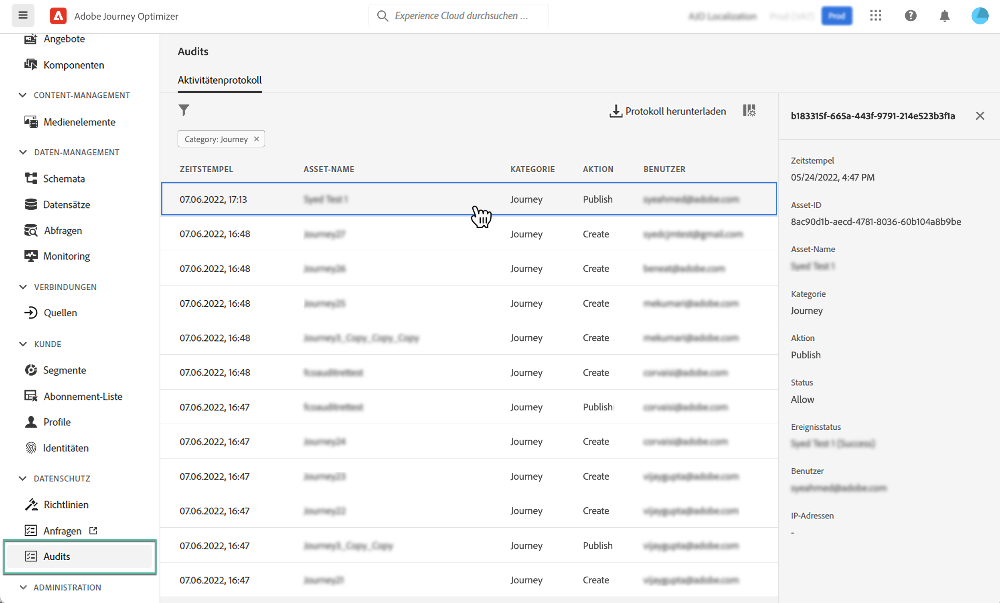

# Audit-Aktionen für Journey Optimizer-Ressourcen {#track-changes}

## Über Prüfprotokolle {#audit-logs}

Mit Journey Optimizer können Sie Aktionen identifizieren, die von Benutzern im System auf verschiedenen Diensten und Funktionen wie Journey, Nachrichten, Landingpages usw. ausgeführt werden.

Auf diese Weise können Sie die Sichtbarkeit der im System durchgeführten Aktivitäten erhöhen, Probleme beheben und Ihr Unternehmen bei der Einhaltung von Vorschriften und Richtlinien zur Unternehmensdatenverwaltung unterstützen.

Jede Aktion wird mit Metadaten in &quot;Prüfprotokollen&quot;aufgezeichnet, auf die in Adobe Experience Platform zugegriffen werden kann. Weiterführende Informationen zu Prüfprotokollen, einschließlich ihrer Anzeige und Verwaltung in der Benutzeroberfläche oder API, finden Sie im Abschnitt [Dokumentation zu Adobe Experience Platform](https://experienceleague.adobe.com/docs/experience-platform/landing/governance-privacy-security/audit-logs/overview.html).

## Von Prüfprotokollen erfasste Ereignistypen {#events}

In der folgenden Tabelle sind die Aktionen aufgeführt, für die Journey Optimizer-Ressourcen in Auditprotokollen aufgezeichnet werden.

>[!NOTE]
>
>Die vollständige Liste der in den Auditprotokollen erfassten Aktionen finden Sie unter [Dokumentation zu Adobe Experience Platform](https://experienceleague.adobe.com/docs/experience-platform/landing/governance-privacy-security/audit-logs/overview.html#category).

| Ressource | Aktion |
|-----------|------------------|
| Allgemeine Einstellungen für den AJO-Kanal | Erstellen/Löschen/Aktualisieren |
| AJO-IP-Pool | Erstellen/Löschen/Aktualisieren |
| AJO-Landingpage | Erstellen/Löschen/Aktualisieren/Veröffentlichen/Veröffentlichung rückgängig machen |
| AJO-Landingpage-HTML-Vorlage | Erstellen/Löschen/Aktualisieren |
| Vorgabe für AJO-Landingpage | Erstellen/Löschen/Aktualisieren |
| AJO-Landingpage-Subdomain | Erstellen/Löschen/Aktualisieren |
| AJO-Nachricht | Erstellen/Löschen/Aktualisieren/Veröffentlichen |
| AJO-Nachrichtenvorgabe | Erstellen/Löschen/Aktualisieren |
| AJO PTR-Datensatz | Erstellen/Löschen/Aktualisieren |
| AJO-Vorlage für gespeicherte Ausdrücke | Erstellen/Löschen/Aktualisieren |
| Anmeldeinformationen der AJO-SMS-API | Erstellen/Löschen/Aktualisieren |
| AJO-Subdomain | Erstellen/Löschen/Aktualisieren |
| AJO-Unterdrückungsliste | CSV erstellen/löschen/herunterladen |
| Feldergruppe | Erstellen/Löschen/Aktualisieren |
| Journey | Erstellen/Löschen/Aktualisieren/Beenden/Veröffentlichen |
| Benutzerdefinierte Aktion Journey | Erstellen/Löschen/Aktualisieren |
| Journey datasource | Erstellen/Löschen/Aktualisieren |
| Journey-Ereignis | Erstellen/Löschen/Aktualisieren |
| Regel für Nachrichtenfrequenz | Erstellen/Löschen/Aktualisieren |
| Rangstrategie | Erstellen/Löschen/Aktualisieren |
