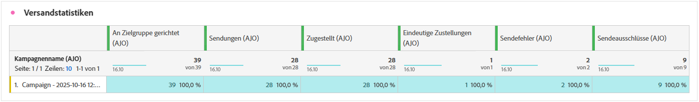
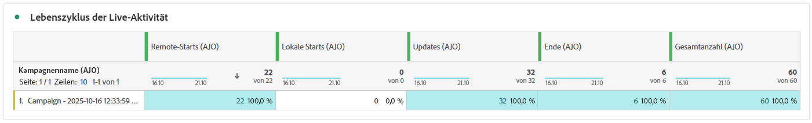
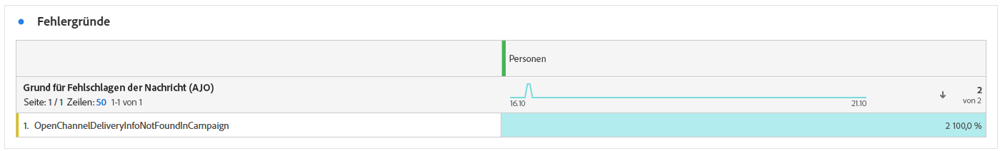
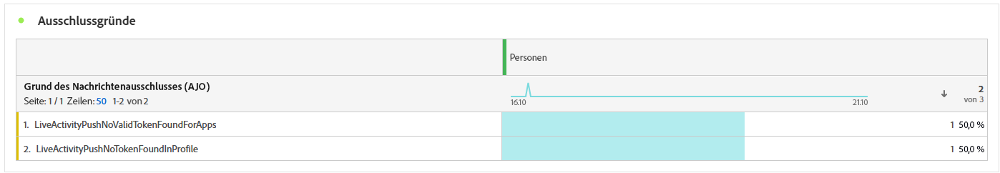

# Live-Kampagnenbericht {#campaign-global-report-cja-activity}

>[!BEGINSHADEBOX]

Sie können auf Ihren Bericht zu Kampagnen mit Live-Aktivitäten zugreifen, indem Sie in Ihrer Kampagne auf die Schaltfläche **[!UICONTROL Berichte]** klicken und dann **[!UICONTROL Bericht für gesamte Zeit anzeigen]** auswählen. [Weitere Informationen](report-gs-cja.md)

>[!ENDSHADEBOX]

## Versandstatistiken {#sending-statistics-mobile}

Die Tabelle **[!UICONTROL Versandstatistiken]** bietet einen detaillierten Überblick über Schlüsselmetriken im Zusammenhang mit Ihren Kampagnen mit Live-Aktivitäten. Es werden wichtige Informationen wie die Größe der Zielgruppe und die Anzahl der erfolgreich zugestellten Push-Benachrichtigungen angezeigt. So können Sie die Reichweite und Leistung Ihrer Live-Push-Benachrichtigungen insgesamt einschätzen.

+++ Weitere Informationen zu den Metriken „Versandstatistiken“

* **[!UICONTROL Zielgruppe]**: Anzahl der Profile, die sich für die Zielgruppe qualifiziert haben, bevor Ausschlüsse, Unterdrückungen oder Einverständnisentnahmen angewendet wurden.

* **[!UICONTROL Sendungen]**: Gesamtzahl der Push-Benachrichtigungen, bei denen versucht wurde, sie an Zielgruppenprofile zu senden.

* **[!UICONTROL Zugestellt]**: Anzahl der erfolgreich an Geräte gesendeten Push-Benachrichtigungen im Verhältnis zur Gesamtzahl der Sendeversuche.

* **[!UICONTROL Sendefehler]**: Gesamtzahl der Push-Benachrichtigungen, die aufgrund von Fehlern (z. B. ungültige Token oder Verbindungsprobleme) nicht gesendet werden konnten.

* **[!UICONTROL Sendeausschlüsse]**: Anzahl der Profile, die von Adobe Journey Optimizer vom Versand ausgeschlossen wurden (z. B. wegen Opt-out-Status oder Eignungsregeln).

+++

## Lebenszyklus der Live-Aktivität {#lifecycle}

Die Tabelle **[!UICONTROL Lebenszyklus der Live-Aktivität]** bietet einen umfassenden Überblick über den Fortschritt Ihrer Live-Aktivitäten im zeitlichen Verlauf. Sie liefert Einblicke in wichtige Ereignisse (z. B. wann Aktivitäten gestartet, aktualisiert oder beendet werden), sodass Sie die Benutzerinteraktion und den gesamten Lebenszyklus Ihrer Kampagnen mit Live-Aktivitäten besser verstehen können.

+++ Weitere Informationen zu Lebenszyklusmetriken zu Live-Aktivitäten

* **[!UICONTROL Remote-Starts]**: Anzahl der Live-Aktivitäten, die remote initiiert wurden (normalerweise vom Server oder Backend-System).

* **[!UICONTROL Lokale Starts]**: Anzahl der Live-Aktivitäten, die lokal auf dem Gerät einer Benutzerin bzw. eines Benutzers gestartet wurden und häufig auf Benutzerinteraktionen oder Client-seitige Trigger zurückzuführen sind.

**[!UICONTROL Aktualisierungen]**: Gesamtzahl der an Geräte gesendeten Aktualisierungen von Live-Aktivitäten. Zu Aktualisierungen gehören Statusänderungen, neue Inhalte oder Fortschrittsbenachrichtigungen.

**[!UICONTROL Enden]**: Anzahl der Live-Aktivitäten, die entweder automatisch nach Abschluss oder manuell über einen definierten Trigger oder einen Timeout beendet wurden.

**[!UICONTROL Gesamtanzahl]**: Gesamtzahl aller Lebenszyklusereignisse bei Live-Aktivitäten, einschließlich Starts, Aktualisierungen und Enden, die eine vollständige Messung des Live-Aktivitätsvolumens liefern.

+++

## Fehlergründe {#error-reasons}

Anhand der Tabelle **[!UICONTROL Fehlergründe]** können Sie die spezifischen Fehler identifizieren, die während des Sendevorgangs Ihrer Live-Aktivitäten aufgetreten sind. Dies ermöglicht eine gründliche Analyse aller aufgetretenen Probleme.

## Gründe für Ausschluss {#excluded-reasons}

Die Tabelle **[!UICONTROL Gründe für Ausschluss]** zeigt visuell die verschiedenen Faktoren auf, die zum Ausschluss von Benutzerprofilen aus der Zielgruppe geführt haben, sodass diese keine Live-Aktivitäten von Ihnen erhalten konnten.
