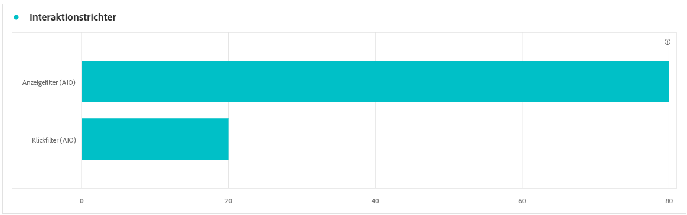
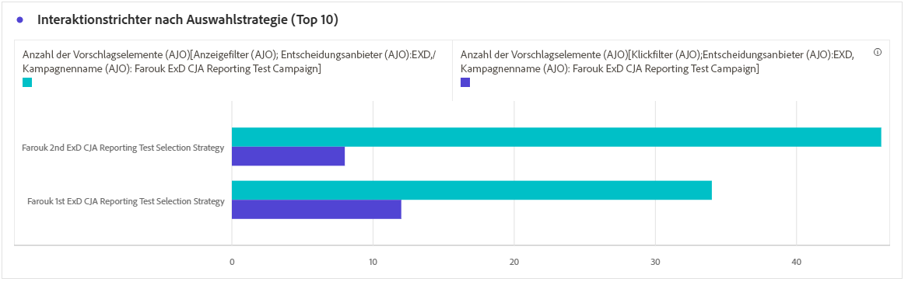

# Codebasierter Kampagnenbericht {#campaign-global-report-cja-code}

## Anzeigen und Klicken {#impressions-code}

Die Diagramme **[!UICONTROL Anzeigen und Klicken]** bieten eine detaillierte Analyse der Interaktion Ihrer Profile mit Ihren Code-basierten Erlebnissen und liefern wertvolle Einblicke in die Interaktion von Profilen mit Ihren Inhalten.

+++ Weitere Informationen zu den Metriken für „Impressionen und Klicks“

* **[!UICONTROL Einzelklicks]**: Die Anzahl der Profile, die auf einen Inhalt in Ihren Erlebnissen geklickt haben.

* **[!UICONTROL Klicks]**: Anzahl der Klicks auf einen Inhalt in Ihren Erlebnissen.

* **[!UICONTROL Anzeigen]**: Anzahl der Öffnungen des Erlebnisses.

* **[!UICONTROL Einzelanzeigen]**: Anzahl der Öffnungen des Erlebnisses, wobei mehrfache Interaktionen eines Profils nicht gezählt werden.

+++

## Tracking-Daten {#track-data-code}

Die Tabelle **[!UICONTROL Tracking-Daten]** bietet einen detaillierten Überblick über die Profilaktivitäten, die mit Ihren Code-basierten Erlebnissen verbunden sind, und liefert wichtige Erkenntnisse über die Interaktion und die Wirksamkeit der Erlebnisse.

+++ Weitere Informationen zu Metriken für Tracking-Daten

* **[!UICONTROL Personen]**: Anzahl der Benutzerprofile, die als Zielprofile für Ihre Erlebnisse infrage kommen.

* **[!UICONTROL Klickrate (CTR)]**: Prozentsatz der Benutzenden, die mit Ihren Erlebnissen interagiert haben.

* **[!UICONTROL Klicks]**: Anzahl der Klicks auf einen Inhalt in Ihren Erlebnissen.

* **[!UICONTROL Einzelklicks]**: Die Anzahl der Profile, die auf einen Inhalt in Ihren Erlebnissen geklickt haben.

* **[!UICONTROL Anzeigen]**: Anzahl der Öffnungen Ihres Erlebnisses.

* **[!UICONTROL Einzelanzeigen]**: Anzahl der Öffnungen Ihres Erlebnisses, wobei mehrfache Interaktionen eines Profils nicht gezählt werden.

+++

## Labels getrackter Links {#track-link-code}

Die Tabelle **[!UICONTROL Labels getrackter Links]** bietet einen umfassenden Überblick über die Linklabels innerhalb Ihrer Code-basierten Erlebnisse und hebt diejenigen hervor, die den höchsten Besucher-Traffic erzeugen. Mit dieser Funktion können Sie die beliebtesten Links identifizieren und priorisieren.

+++ Weitere Informationen zu den Metriken der Bezeichnungen für verfolgte Links

* **[!UICONTROL Einzelklicks]**: Die Anzahl der Profile, die auf einen Inhalt in Ihren Code-basierten Erlebnissen geklickt haben.

* **[!UICONTROL Klicks]**: Anzahl der Klicks auf einen Inhalt in Ihren Code-basierten Erlebnissen.

* **[!UICONTROL Anzeigen]**: Anzahl der Öffnungen des Erlebnisses.

* **[!UICONTROL Einzelanzeigen]**: Anzahl der Öffnungen des Erlebnisses, wobei mehrfache Interaktionen eines Profils nicht gezählt werden.

+++

## KPIs für Entscheidungen {#decisioning-kpis}

Die **Entscheidungs-KPIs** bieten wichtige Einblicke in die Interaktion Ihrer Besucher mit Ihren Erlebnissen, einschließlich Metriken wie:

* **[!UICONTROL Elemente insgesamt]**: Gesamtzahl der einzelnen Elemente, die innerhalb eines bestimmten Zeitraums Teil eines personalisierten Erlebnisses oder Entscheidungsprozesses waren.

* **[!UICONTROL Gesamtanzahl der Anzeigen]**:

* **[!UICONTROL Klicks insgesamt]**: Gesamtzahl der Klicks auf Elemente, Links, Produkte oder andere interaktive Elemente in einem bestimmten Zeitraum durch Benutzer.

* **[!UICONTROL Fallback-Rate]**: Prozentsatz der Instanzen, bei denen keine Auswahlstrategien qualifiziert wurden, was zur Anzeige einer generischen oder weniger spezifischen Option führte.

## Interaktionstrichter {#engagement-funnel}

Die Tabelle **[!UICONTROL Interaktionstrichter]** überwacht die Leistung personalisierter Erlebnisse, indem sie bewertet, wie effektiv jede Phase des Trichters Benutzerinteraktionen fördert.

* **[!UICONTROL Anzeigen]**: Gesamtzahl der Anzeige oder Präsentation personalisierter Erlebnisse für Benutzer über verschiedene Touchpoints.

* **[!UICONTROL Klicks]**: Gesamtzahl der Klicks auf personalisierte Erlebnisse durch Benutzer, die ihnen angezeigt wurden.

## Top-Entscheidungselemente nach Clickthrough-Rate {#top-decision}

Die Tabelle **[!UICONTROL Top-Entscheidungselemente nach CTR]** zeigt die Leistung einzelner Elemente basierend auf ihrer Clickthrough-Rate an. Diese Metrik hilft zu beurteilen, welche Elemente am effektivsten sind, um Benutzer zu erreichen und Interaktionen zu fördern.

* **[!UICONTROL Clickthrough-Rate (CTR)]**: Prozentualer Anteil der Benutzer, die auf einen Link, eine Anzeige oder eine Empfehlung klicken, in Bezug auf die Anzahl der angezeigten Links.

## Interaktionstrichter nach Auswahlstrategie {#engagement-funnel-selection}

Mithilfe der Tabelle **[!UICONTROL Interaktionsrichter nach Auswahlstrategie]** können Sie überwachen und analysieren, wie effektiv verschiedene Auswahlstrategien Benutzer mit personalisierten Erlebnissen ansprechen.

* **[!UICONTROL Anzeigen]**: Gesamtzahl der Anzeige oder Präsentation personalisierter Erlebnisse für Benutzer über verschiedene Touchpoints.

* **[!UICONTROL Klicks]**: Gesamtzahl der Klicks auf personalisierte Erlebnisse durch Benutzer, die ihnen angezeigt wurden.

## Performance von Entscheidungselementen {#decision-items-performance}

Die Tabelle **[!UICONTROL Leistung bei Entscheidungselementen]** gibt Aufschluss darüber, wie gut die einzelnen Elemente funktionieren, um Benutzer anzusprechen und die gewünschten Aktionen zu fördern, z. B. Käufe, Klicks oder andere Antworten.

* **[!UICONTROL Anzeigen]**: Gesamtzahl der Anzeige oder Präsentation personalisierter Erlebnisse für Benutzer über verschiedene Touchpoints.

* **[!UICONTROL Klicks]**: Gesamtzahl der Klicks auf personalisierte Erlebnisse durch Benutzer, die ihnen angezeigt wurden.

## Rangfolgestrategie {#ranking-strategy}

>[!NOTE]
>
>Die Tabelle **[!UICONTROL Rangstrategie]** wird nur verfügbar, wenn ein KI-Modell in die Kampagne integriert ist. [Weitere Informationen](../experience-decisioning/ranking.md)

Die Tabelle **[!UICONTROL Ranking Strategy]** bietet Einblicke in die Leistung von KI-gestützten Rangmodellen innerhalb personalisierter Erlebnisse, die zwei Traffic-Typen vergleichen:

* **Modell gesteuert**: Benutzer erhalten Inhalte, die nach dem KI-Modell sortiert sind und für Relevanz und Interaktion optimiert sind.

* **Holdout**: Benutzer sehen eine generische Version des Inhalts, die als Kontrollgruppe dient, um die Effektivität des KI-Modells zu messen.

Zu den angezeigten Schlüsselmetriken gehören:

* **[!UICONTROL Anzeigen]**: Gesamtzahl der Anzeige oder Präsentation personalisierter Erlebnisse für Benutzer über verschiedene Touchpoints.

* **[!UICONTROL Klicks]**: Gesamtzahl der Klicks auf personalisierte Erlebnisse durch Benutzer, die ihnen angezeigt wurden.

* **[!UICONTROL Konversionsrate]**: Prozentsatz der Anzeigen, die zu Benutzeraktionen führten (z. B. Klicks), was angibt, wie erfolgreich das Modell bei der Interaktion mit Benutzern war.

## Konversionsrate für Holdout- und modellgesteuerten Traffic {#conversion-rate}

>[!NOTE]
>
>Das Diagramm **[!UICONTROL Konversionsrate für Holdout- und modellgesteuerten Traffic]** wird nur verfügbar, wenn ein AI-Modell in die Kampagne integriert ist. [Weitere Informationen](../experience-decisioning/ranking.md)

Das Diagramm **[!UICONTROL Konversionsrate für Holdout- und modellgesteuerten Traffic]** gibt die Konversionsrate für zwei Traffic-Typen im Zeitverlauf an:

* **Modell gesteuert**: Benutzer erhalten Inhalte, die nach dem KI-Modell sortiert sind und für Relevanz und Interaktion optimiert sind.

* **Holdout**: Benutzer sehen eine generische Version des Inhalts, die als Kontrollgruppe dient, um die Effektivität des KI-Modells zu messen.
