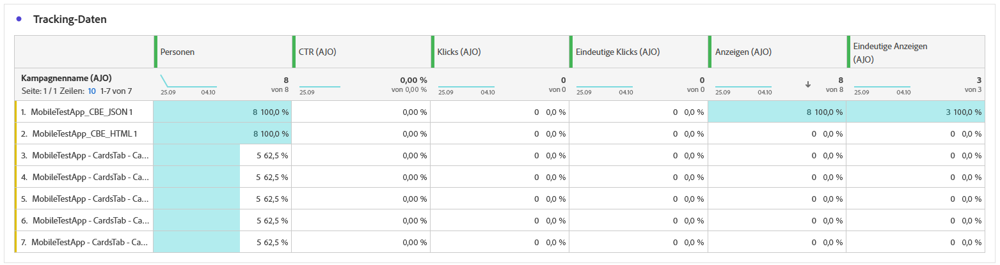

# Code-basierter Kampagnenbericht {#campaign-global-report-cja-code}

>[!BEGINSHADEBOX]

Sie können auf Ihren Code-basierten Kampagnenbericht zugreifen, indem Sie in Ihrer Kampagne auf die Schaltfläche **[!UICONTROL Berichte]** klicken und dann **[!UICONTROL Bericht für gesamte Zeit anzeigen]** auswählen. [Weitere Informationen](report-gs-cja.md)

>[!ENDSHADEBOX]

>[!NOTE]
>
>Code-basierte Erlebnisse fungieren als eingehende Interaktionen, bei denen sich Benutzer per Zugriff auf Ihre Site oder Ihr Programm anmelden. Daher **die Metriken** Targeting **oder Audience**, mit denen für den ausgehenden Nachrichtenversand ausgewählte Profile verfolgt werden, für Code-basierte Kampagnen nicht inkrementiert.

## Anzeigen und Klicken {#impressions-code}

Die Diagramme **[!UICONTROL Anzeigen und Klicken]** bieten eine detaillierte Analyse der Interaktion Ihrer Profile mit Ihren Code-basierten Erlebnissen und liefern wertvolle Einblicke in die Interaktion von Profilen mit Ihren Inhalten.

+++ Weitere Informationen zu den Metriken „Impression und Klicks“

* **[!UICONTROL Einzelklicks]**: Die Anzahl der Profile, die auf einen Inhalt in Ihren Erlebnissen geklickt haben.

* **[!UICONTROL Klicks]**: Anzahl der Klicks auf einen Inhalt in Ihren Erlebnissen.

* **[!UICONTROL Anzeigen]**: Anzahl der Öffnungen des Erlebnisses.

* **[!UICONTROL Einzelanzeigen]**: Anzahl der Öffnungen des Erlebnisses, wobei mehrfache Interaktionen eines Profils nicht gezählt werden.

+++

## Tracking-Daten {#track-data-code}

Die Tabelle **[!UICONTROL Tracking-Daten]** bietet einen detaillierten Überblick über die Profilaktivitäten, die mit Ihren Code-basierten Erlebnissen verbunden sind, und liefert wichtige Erkenntnisse über die Interaktion und die Wirksamkeit der Erlebnisse.

+++ Weitere Informationen zu den Metriken „Tracking-Daten“

* **[!UICONTROL Personen]**: Anzahl der Benutzerprofile, die als Zielprofile für Ihre Erlebnisse infrage kommen.

* **[!UICONTROL Klickrate (CTR)]**: Prozentsatz der Benutzenden, die mit Ihren Erlebnissen interagiert haben.

* **[!UICONTROL Klicks]**: Anzahl der Klicks auf einen Inhalt in Ihren Erlebnissen.

* **[!UICONTROL Einzelklicks]**: Die Anzahl der Profile, die auf einen Inhalt in Ihren Erlebnissen geklickt haben.

* **[!UICONTROL Anzeigen]**: Anzahl der Öffnungen Ihres Erlebnisses.

* **[!UICONTROL Einzelanzeigen]**: Anzahl der Öffnungen Ihres Erlebnisses, wobei mehrfache Interaktionen eines Profils nicht gezählt werden.

+++

## Labels getrackter Links {#track-link-code}

Die Tabelle **[!UICONTROL Labels getrackter Links]** bietet einen umfassenden Überblick über die Linklabels innerhalb Ihrer Code-basierten Erlebnisse und hebt diejenigen hervor, die den höchsten Besucher-Traffic erzeugen. Mit dieser Funktion können Sie die beliebtesten Links identifizieren und priorisieren.

+++ Weitere Informationen zu den Metriken „Labels für verfolgten Link“

* **[!UICONTROL Einzelklicks]**: Die Anzahl der Profile, die auf einen Inhalt in Ihren Code-basierten Erlebnissen geklickt haben.

* **[!UICONTROL Klicks]**: Anzahl der Klicks auf einen Inhalt in Ihren Code-basierten Erlebnissen.

* **[!UICONTROL Anzeigen]**: Anzahl der Öffnungen des Erlebnisses.

* **[!UICONTROL Einzelanzeigen]**: Anzahl der Öffnungen des Erlebnisses, wobei mehrfache Interaktionen eines Profils nicht gezählt werden.

+++

## Reporting zur Entscheidungsfindung {#decisioning-reporting}

### Entscheidungsfindungs-KPIs {#decisioning-kpis}

Die **Entscheidungsfindungs-KPIs** bieten wichtige Einblicke in die Interaktion von Besuchenden mit Ihren Erlebnissen, einschließlich folgender Metriken:

* **[!UICONTROL Elemente insgesamt]**: Gesamtzahl der einzelnen Elemente, die innerhalb eines bestimmten Zeitraums Teil eines personalisierten Erlebnisses oder Entscheidungsprozesses waren.

* **[!UICONTROL Anzeigen insgesamt]**:

* **[!UICONTROL Klicks insgesamt]**: Häufigkeit, mit der  Benutzende Klicks in einem bestimmten Zeitraum auf Elemente, Links, Produkte oder andere interaktive Elemente ausgeführt haben.

* **[!UICONTROL Fallback-Rate]**: Prozentsatz der Instanzen, bei denen keine Auswahlstrategien infrage kamen, was zur Anzeige einer generischen oder weniger spezifischen Option führte.

### Interaktionstrichter {#engagement-funnel}

Die Tabelle **[!UICONTROL Interaktionstrichter]** überwacht die Leistung personalisierter Erlebnisse, indem sie bewertet, wie effektiv jede Phase des Trichters Benutzerinteraktionen fördert.

* **[!UICONTROL Anzeigen]**: Häufigkeit, mit der personalisierter Erlebnisse für Benutzende über verschiedene Touchpoints angezeigt oder präsentiert wurden.

* **[!UICONTROL Klicks]**: Häufigkeit, mit der Benutzende Klicks auf personalisierte Erlebnisse ausgeführt haben, die ihnen angezeigt wurden.

### Wichtigste Entscheidungselemente nach Clickthrough-Rate {#top-decision}

Die Tabelle **[!UICONTROL Wichtigste Entscheidungselemente nach CTR]** zeigt die Leistung einzelner Elemente basierend auf ihrer Clickthrough-Rate an. Diese Metrik hilft bei der Beurteilung, welche Elemente am effektivsten sind, um Benutzende zu erreichen und Interaktionen zu fördern.

* **[!UICONTROL Clickthrough-Rate (CTR)]**: Prozentualer Anteil der Benutzenden, die auf einen Link, eine Werbeanzeige oder eine Empfehlung klicken, verglichen mit der Häufigkeit, mit der Links, Werbeanzeigen oder der Empfehlungen angezeigt wurden.

### Interaktionstrichter nach Auswahlstrategie {#engagement-funnel-selection}

Mithilfe der Tabelle **[!UICONTROL Interaktionsrichter nach Auswahlstrategie]** können Sie die Effektivität überwachen und analysieren, mit der verschiedene Auswahlstrategien Benutzende mit personalisierten Erlebnissen ansprechen.

* **[!UICONTROL Anzeigen]**: Häufigkeit, mit der personalisierter Erlebnisse für Benutzende über verschiedene Touchpoints angezeigt oder präsentiert wurden.

* **[!UICONTROL Klicks]**: Häufigkeit, mit der Benutzende Klicks auf personalisierte Erlebnisse ausgeführt haben, die ihnen angezeigt wurden.

### Leistung der Entscheidungselemente {#decision-items-performance}

In der Tabelle **[!UICONTROL Leistung bei Entscheidungselementen]** wird ausgewertet, wie gut die einzelnen Elemente Benutzende ansprechen und die gewünschten Aktionen fördern, z. B. Käufe, Klicks oder andere Reaktionen.

* **[!UICONTROL Anzeigen]**: Häufigkeit, mit der personalisierter Erlebnisse für Benutzende über verschiedene Touchpoints angezeigt oder präsentiert wurden.

* **[!UICONTROL Klicks]**: Häufigkeit, mit der Benutzende Klicks auf personalisierte Erlebnisse ausgeführt haben, die ihnen angezeigt wurden.

### Rangfolgestrategie {#ranking-strategy}

>[!NOTE]
>
>Die Tabelle **[!UICONTROL Ranking-Strategie]** wird nur verfügbar, wenn ein [KI-Modell](../experience-decisioning/ranking/ai-models.md) in die Kampagne integriert ist. <!--[Learn more](../experience-decisioning/ranking/ranking-formulas.md)-->

Die Tabelle **[!UICONTROL Rangfolgestrategie]** bietet Einblicke in die Leistung von KI-gestützten Rangfolgemodellen innerhalb personalisierter Erlebnisse, wobei zwei Traffic-Typen miteinander verglichen werden:

* **Modellgesteuert**: Benutzende erhalten für die Relevanz und Interaktion optimierte Inhalte, die vom KI-Modell nach Rang geordnet wurden.

* **Holdout**: Benutzende erhalten Inhalte, die während der Erkundungsphase des Modells nach dem Zufallsprinzip bereitgestellt werden.

Zu den angezeigten Schlüsselmetriken gehören:

* **[!UICONTROL Anzeigen]**: Häufigkeit, mit der personalisierter Erlebnisse für Benutzende über verschiedene Touchpoints angezeigt oder präsentiert wurden.

* **[!UICONTROL Klicks]**: Häufigkeit, mit der Benutzende Klicks auf personalisierte Erlebnisse ausgeführt haben, die ihnen angezeigt wurden.

* **[!UICONTROL Konversionsrate]**: Prozentsatz der Anzeigen, die zu Benutzeraktionen führten (z. B. Klicks). Er gibt an, wie erfolgreich das Modell bezüglich der Ansprache von Benutzenden war.

>[!NOTE]
>
>Derzeit ist der Bericht [Steigerungsmessung](../experience-decisioning/ranking/auto-optimization-model.md#lift) nur für das KI-Modell [Personalisierte Optimierung](../experience-decisioning/ranking/personalized-optimization-model.md) verfügbar. Wenn Sie Berichte zur Steigerungsmessung benötigen, verwenden Sie also stattdessen das Optimierungsmodell „Personalisiert“.

### Konversionsrate für Holdout- und modellgesteuerten Traffic {#conversion-rate}

>[!NOTE]
>
>Das Diagramm **[!UICONTROL Konversionsrate für Holdout- und modellgesteuerten Traffic]** wird nur verfügbar, wenn ein [KI-Modell](../experience-decisioning/ranking/ai-models.md) in die Kampagne integriert ist. <!--[Learn more](../experience-decisioning/ranking/ranking-formulas.md)-->

Das Diagramm **[!UICONTROL Konversionsrate für Holdout- und modellgesteuerten Traffic]** zeigt die Konversionsrate für zwei Traffic-Typen im Zeitverlauf an:

* **Modellgesteuert**: Benutzende erhalten für die Relevanz und Interaktion optimierte Inhalte, die vom KI-Modell nach Rang geordnet wurden.

* **Holdout**: Benutzende erhalten Inhalte, die während der Erkundungsphase des Modells nach dem Zufallsprinzip bereitgestellt werden.

>[!CAUTION]
>
>Wenn Sie ein KI-Modell verwenden, das in eine [Rangfolgenformel](../experience-decisioning/ranking/ranking-formulas.md) integriert ist, werden Daten nicht im Bericht zur Konversionsrate angezeigt.
