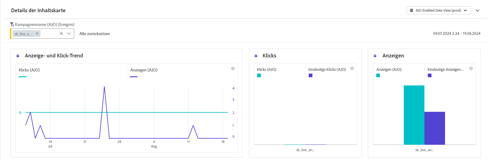
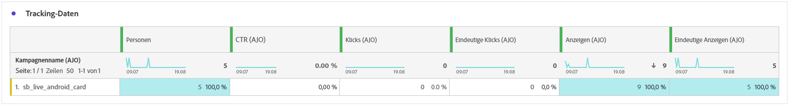

# Inhaltskarten-Kampagnenbericht {#campaign-global-report-cja-content}

>[!BEGINSHADEBOX]

**Auf dieser Seite** Erfahren Sie, wie Sie den Kampagnenbericht für Inhaltskarten in Adobe Journey Optimizer lesen, um die Anzeige- und Klicktrends, Tracking-Daten und Tracking-Kennzeichnungen für Ihre Inhaltskarten zu analysieren.

>[!ENDSHADEBOX]

>[!BEGINSHADEBOX]

Sie können auf Ihren Kampagnenbericht für Inhaltskarten zugreifen, indem Sie in Ihrer Kampagne auf die Schaltfläche **[!UICONTROL Berichte]** klicken und dann **[!UICONTROL Bericht für gesamte Zeit anzeigen]** auswählen. [Weitere Informationen](report-gs-cja.md)

>[!ENDSHADEBOX]

## Anzeige- und Klick-Trend {#display-click}

Die Diagramme **[!UICONTROL Anzeige- und Klick-Trend]** helfen Ihnen, sowohl die Gesamtreichweite der Nachricht als auch die Anzahl der eindeutigen Profile zu verstehen, die mit der Nachricht interagieren.

+++ Weitere Informationen zu den Metriken „Anzeige- und Klick-Trend“

* **[!UICONTROL Klicks]**: Anzahl der Klicks auf einen Inhalt in der Inhaltskarte.

* **[!UICONTROL Anzeigen]**: Anzahl der Öffnungen der Nachricht.

* **[!UICONTROL Einzelanzeigen]**: Anzahl der Öffnungen der Nachricht, wobei mehrfache Interaktionen eines Profils nicht gezählt werden.

+++

## Tracking-Daten {#tracking-data}

Die Tabelle **[!UICONTROL Tracking-Daten]** bietet einen detaillierten Überblick über die Profilaktivität im Zusammenhang mit Ihren Inhaltskarten und liefert wichtige Erkenntnisse über die Interaktion und die Effektivität von Inhaltskarten.

+++ Weitere Informationen zu den Metriken „Tracking-Daten“

* **[!UICONTROL Personen]**: Anzahl der Benutzerprofile, die sich als Zielgruppenprofile für Ihre Inhaltskarten eignen.

* **[!UICONTROL Klickrate (CTR)]**: Prozentsatz der Benutzenden, die mit der Inhaltskarte interagiert haben.

* **[!UICONTROL Klicks]**: Anzahl der Klicks auf einen Inhalt in Ihrer Inhaltskarte.

* **[!UICONTROL Einzelklicks]**: Die Anzahl der Profile, die auf einen Inhalt in Ihrer Inhaltskarte geklickt haben.

* **[!UICONTROL Anzeigen]**: Anzahl der Öffnungen der Nachricht.

* **[!UICONTROL Einzelanzeigen]**: Anzahl der Öffnungen der Nachricht, wobei mehrfache Interaktionen eines Profils nicht gezählt werden.

+++

## Getrackte Labels {#tracked-labels}

Die Tabelle **[!UICONTROL Getrackte Labels]** bietet einen umfassenden Überblick über die Linklabels in Ihren Inhaltskarten und hebt diejenigen hervor, die den höchsten Besucher-Traffic generieren. Mit dieser Funktion können Sie die beliebtesten Links identifizieren und priorisieren.

+++ Weitere Informationen zu den Metriken „Nachverfolgte Labels“

* **[!UICONTROL Einzelklicks]**: Anzahl der Profile, die auf einen Inhalt in Ihren Inhaltskarten geklickt haben.

* **[!UICONTROL Klicks]**: Anzahl der Klicks auf einen Inhalt in Ihrer Inhaltskarte.

* **[!UICONTROL Anzeigen]**: Anzahl der Öffnungen der Nachricht.

* **[!UICONTROL Einzelanzeigen]**: Anzahl der Öffnungen der Nachricht, wobei mehrfache Interaktionen eines Profils nicht gezählt werden.

+++
