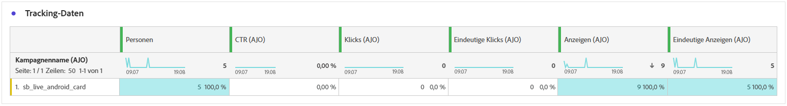

# Kampagnenbericht zur Inhaltskarte {#campaign-global-report-cja-content}

## Anzeige- und Klicktrend {#display-click}

Die Diagramme **[!UICONTROL Anzeige- und Klicktrend]** helfen Ihnen dabei, sowohl die GesamtReichweite der Nachricht als auch die Anzahl der eindeutigen Profile zu verstehen, die damit interagieren.

+++ Weitere Informationen zu Anzeige- und Klickmetriken

* **[!UICONTROL Klicks]**: Gibt an, wie oft auf einen Inhalt auf der Karte Inhalt geklickt wurde.

* **[!UICONTROL Anzeigen]**: Anzahl der Öffnungen der Nachricht.

* **[!UICONTROL Einzelanzeigen]**: Anzahl der Öffnungen der Nachricht, wobei mehrfache Interaktionen eines Profils nicht gezählt werden.

+++

## Tracking-Daten {#tracking-data}

Die Tabelle **[!UICONTROL Tracking-Daten]** bietet eine detaillierte Momentaufnahme der Profilaktivität, die mit Ihren Inhaltskarten verknüpft ist, und bietet wichtige Einblicke in die Interaktion und die Effektivität der Inhaltskarte.

+++ Weitere Informationen zu Metriken für Tracking-Daten

* **[!UICONTROL Personen]**: Anzahl der Benutzerprofile, die als Zielprofile für Ihre Inhaltskarten gelten.

* **[!UICONTROL Durchklickrate (CTR)]**: Prozentsatz der Benutzer, die mit der Inhaltskarte interagiert haben.

* **[!UICONTROL Klicks]**: Gibt an, wie oft auf einen Inhalt auf Ihrer Inhaltskarte geklickt wurde.

* **[!UICONTROL Einzelklicks]**: Anzahl der Profile, die auf einen Inhalt auf Ihrer Inhaltskarte geklickt haben.

* **[!UICONTROL Anzeigen]**: Anzahl der Öffnungen der Nachricht.

* **[!UICONTROL Einzelanzeigen]**: Anzahl der Öffnungen der Nachricht, wobei mehrfache Interaktionen eines Profils nicht gezählt werden.

+++

## Getrackte Bezeichnungen {#tracked-labels}

Die Tabelle **[!UICONTROL Getrackte Bezeichnungen]** bietet einen umfassenden Überblick über die Link-Bezeichnungen in Ihren Inhaltskarten und hebt diejenigen hervor, die den höchsten Besucher-Traffic generieren. Mit dieser Funktion können Sie die beliebtesten Links identifizieren und priorisieren.

+++ Weitere Informationen zu den Metriken für verfolgte Bezeichnungen

* **[!UICONTROL Einzelklicks]**: Anzahl der Profile, die auf einen Inhalt in Ihren Inhaltskarten geklickt haben.

* **[!UICONTROL Klicks]**: Gibt an, wie oft auf einen Inhalt in Ihren Inhaltskarten geklickt wurde.

* **[!UICONTROL Anzeigen]**: Anzahl der Öffnungen der Nachricht.

* **[!UICONTROL Einzelanzeigen]**: Anzahl der Öffnungen der Nachricht, wobei mehrfache Interaktionen eines Profils nicht gezählt werden.

+++
