# E-Mail-Kampagnenbericht {#campaign-global-report-cja-email}

>[!INFO]
>
>Da Apple neue Datenschutzfunktionen für seine native Mail-App eingeführt hat, einschließlich Mail Privacy Protection, können Absendende keine Tracking-Pixel mehr verwenden, um Daten von Profilen zu erfassen, die Mail Privacy Protection von Apple aktiviert haben. Daher kann die Fähigkeit von Adobe Journey Optimizer, E-Mail-Öffnungen mithilfe von Tracking-Pixeln zu verfolgen, beeinträchtigt werden. 
> [Erfahren Sie mehr](https://experienceleaguecommunities.adobe.com/t5/adobe-campaign-classic-blogs/the-impact-of-apple-ios-privacy-changes-on-email-marketing-and/ba-p/699780?profile.language=de) über die Auswirkungen der Datenschutzänderungen unter Apple iOS auf das E-Mail-Marketing.
> 
> Wir empfehlen, sich auf Klicks und Konversionsmetriken und nicht auf Öffnungsraten zu konzentrieren, um genauere Erkenntnisse zu erhalten.

>[!BEGINSHADEBOX]

Sie können auf Ihren E-Mail-Kampagnenbericht zugreifen, indem Sie in Ihrer Kampagne auf die Schaltfläche **[!UICONTROL Berichte]** klicken und dann **[!UICONTROL Bericht für gesamte Zeit anzeigen]** auswählen. [Weitere Informationen](report-gs-cja.md)

>[!ENDSHADEBOX]

## E-Mail-KPIs

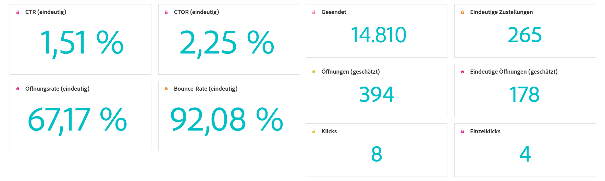

Die **[!UICONTROL E-Mail]**-Key Performance Indicators (KPIs) bieten ein fokussiertes Dashboard mit eindeutigen und aggregierten Metriken, die die Leistung und Interaktionsniveaus Ihrer E-Mail-Kampagnen widerspiegeln.

+++ Weitere Informationen zu den Metriken für E-Mail-KPIs

* **[!UICONTROL Eindeutige Klickrate]**: Prozentsatz der eindeutigen Profile, die auf mindestens einen Link in der E-Mail geklickt haben, im Verhältnis zur Anzahl der eindeutigen zugestellten E-Mails.

* **[!UICONTROL Klick-Öffnungsrate (CTOR)]**: Prozentsatz der Profile, die mit der Nachricht interagiert haben.

* **[!UICONTROL Rate der Einzelöffnungen]**: Prozentsatz der eindeutigen Profile, die die E-Mail mindestens einmal geöffnet haben, im Verhältnis zur Anzahl der eindeutigen zugestellten E-Mails.

* **[!UICONTROL Eindeutige Bounce-Rate]**: Prozentsatz der eindeutigen Profile, deren E-Mail mindestens einmal nicht erfolgreich zugestellt wurde, im Verhältnis zur Gesamtzahl der eindeutigen Sendungen.

* **[!UICONTROL Zugestellt]**: Anzahl der erfolgreich gesendeten E-Mails im Verhältnis zur Gesamtzahl der gesendeten Nachrichten.

* **[!UICONTROL Eindeutige Zustellungen]**: Anzahl der eindeutigen Profile, die mindestens eine Nachricht erfolgreich erhalten haben.

* **[!UICONTROL Geschätzte Öffnungen]**: Geschätzte Gesamtzahl der E-Mail-Öffnungen, die sowohl direkte Öffnungen durch Profile als auch automatisierte Öffnungen durch Mail-Server berücksichtigt. Diese Metrik wird um Öffnungen angepasst, die von E-Mail-Servern für Datenschutz- oder Sicherheitsprüfungen ausgelöst werden. Hierzu wird eine Öffnungsrate angewendet, die anhand von Empfangenden berechnet wird, die die E-Mail manuell geöffnet haben, sowie anhand von Empfangenden, deren E-Mails nur von E-Mail-Servern geöffnet wurden.

* **[!UICONTROL Geschätzte Einzelöffnungen]**: Geschätzte Anzahl der eindeutigen E-Mail-Empfangenden, die die E-Mail wahrscheinlich geöffnet haben. Diese Metrik zielt darauf ab, eine genauere Anzahl der individuellen Interaktionen bereitzustellen, die von E-Mail-Servern zur Datenschutz- oder Sicherheitsprüfung ausgelöst werden. Hierzu wird eine eindeutige Öffnungsrate angewendet, die anhand eindeutiger Profile berechnet wird, welche die E-Mail manuell geöffnet haben, sowie denjenigen, deren E-Mails nur von E-Mail-Servern geöffnet wurden.

* **[!UICONTROL Klicks]**: Gesamtzahl der Klicks auf Links in der Nachricht, einschließlich mehrerer Klicks durch dasselbe Profil.

* **[!UICONTROL Einzelklicks]**: Anzahl der eindeutigen Profile, die auf einen Inhalt in Ihrer Nachricht geklickt haben.

+++

## Einzelklicktrichter

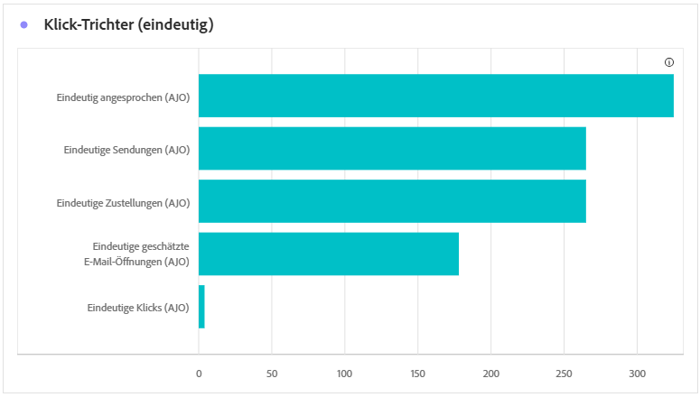

Der Graph **[!UICONTROL Klicktrichter]** bietet eine detaillierte Analyse der Interaktion von Profilen mit Ihren E-Mail-Inhalten und bietet wertvolle Erkenntnisse zu jeder Phase der Interaktion, vom Versand bis hin zu Klicks, sodass Sie verstehen können, wie effektiv Ihre Nachrichten die Benutzerinteraktion fördern.

+++ Weitere Informationen zu den Metriken für Klicktrichter

* **[!UICONTROL Eindeutige Zielgruppe]**: Anzahl der eindeutigen Profile, die sich für die Zielgruppe qualifiziert haben, bevor Ausschlüsse, Unterdrückungen oder Einverständnisentnahmen angewendet wurden.

* **[!UICONTROL Eindeutige Sendungen]**: Anzahl der eindeutigen Profile, für die mindestens eine E-Mail gesendet werden sollte.

* **[!UICONTROL Eindeutige Zustellungen]**: Anzahl der eindeutigen Profile, die mindestens eine Nachricht erfolgreich erhalten haben.

* **[!UICONTROL Geschätzte Einzelöffnungen]**: Geschätzte Anzahl der eindeutigen E-Mail-Empfangenden, die die E-Mail wahrscheinlich geöffnet haben. Diese Metrik zielt darauf ab, eine genauere Anzahl der individuellen Interaktionen bereitzustellen, die von E-Mail-Servern zur Datenschutz- oder Sicherheitsprüfung ausgelöst werden. Hierzu wird eine eindeutige Öffnungsrate angewendet, die anhand eindeutiger Profile berechnet wird, welche die E-Mail manuell geöffnet haben, sowie denjenigen, deren E-Mails nur von E-Mail-Servern geöffnet wurden.

* **[!UICONTROL Einzelklicks]**: Anzahl der eindeutigen Profile, die auf einen Inhalt in Ihrer Nachricht geklickt haben.

+++

## Eindeutiger Versandstatus

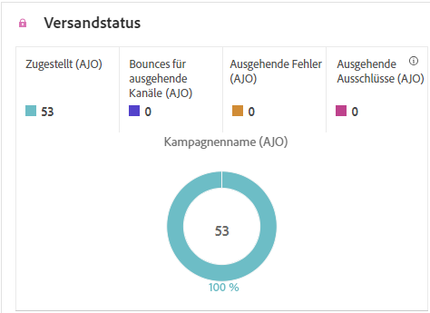

Der Graph **[!UICONTROL Versandstatus]** bietet einen umfassenden Überblick über Daten zu gesendeten E-Mails in Ihrer Kampagne und liefert Einblicke in Schlüsselmetriken wie zugestellte Nachrichten und Bounces. Dies ermöglicht eine detaillierte Analyse des E-Mail-Sendevorgangs und liefert wertvolle Informationen über die Effizienz und Performance Ihrer Kampagnen.

+++ Weitere Informationen zu den Metriken „Versandstatus“

* **[!UICONTROL Eindeutige Sendefehler]**: Anzahl der eindeutigen Profile, bei denen während des ausgehenden Prozesses mindestens ein Sendefehler aufgetreten ist.

* **[!UICONTROL Eindeutige Zustellungen]**: Anzahl der eindeutigen Profile, die mindestens eine Nachricht erfolgreich erhalten haben.

* **[!UICONTROL Eindeutige Sendeausschlüsse]**: Anzahl der eindeutigen Profile, die aufgrund vordefinierter Regeln oder Zielgruppenkriterien vom Empfang von Nachrichten ausgeschlossen sind.

* **[!UICONTROL Eindeutige Bounces]**: Anzahl der eindeutigen Profile, bei denen mindestens eine Nachricht während des Sendevorgangs nicht erfolgreich zugestellt wurde.

+++

## Versand- vs. Klick-Trend {#delivered-click}

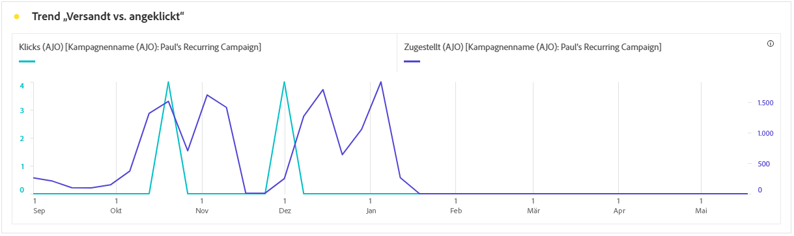

Der Graph **[!UICONTROL Versand- vs. Klick-Trend]** zeigt eine detaillierte Analyse der Interaktion Ihrer Profile mit Ihren E-Mails und bietet wertvolle Erkenntnisse zur Interaktion verschiedener Profile mit Ihrem Inhalt. Das Diagramm verwendet zwei Achsen zur Anzeige der zugestellten E-Mails und Klicks nebeneinander, sodass im Vergleich zur Anzahl der gesendeten E-Mails ungewöhnliche Muster oder Veränderungen bei der Interaktion leichter erkannt werden können.

+++ Weitere Informationen zu den Metriken „Trend ‚Versandt vs. angeklickt‘“

* **[!UICONTROL Zugestellt]**: Anzahl der erfolgreich gesendeten E-Mails im Verhältnis zur Gesamtzahl der gesendeten E-Mails.

* **[!UICONTROL Klicks]**: Anzahl der Klicks auf einen Inhalt in Ihren E-Mails.

+++

## Eindeutige Versandstatistiken {#unique-sending-statistics-email}

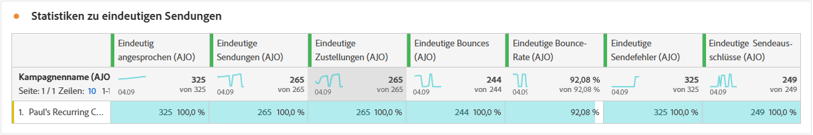

Die Tabelle **[!UICONTROL Eindeutige Versandstatistiken]** bietet einen detaillierten Überblick über eindeutige E-Mail-Leistungsmetriken in Ihren Kampagnen. Der Fokus liegt auf einzelnen Profilen. Hierzu zählen Profile, die eindeutig angesprochen werden, an die zugestellt wird, an die nicht erfolgreich zugestellt wurde oder die ausgeschlossen werden. Sie bieten tiefere Erkenntnisse zu der Art und Weise, wie Ihre E-Mails Ihre Zielgruppe erreichen und ansprechen.

+++ Weitere Informationen zu den Metriken für eindeutige Versandstatistiken

* **[!UICONTROL Eindeutige Zielgruppe]**: Anzahl der eindeutigen Profile, die sich für die Zielgruppe qualifiziert haben, bevor Ausschlüsse, Unterdrückungen oder Einverständnisentnahmen angewendet wurden.

* **[!UICONTROL Eindeutige Sendungen]**: Anzahl der eindeutigen Profile, für die mindestens eine E-Mail gesendet werden sollte.

* **[!UICONTROL Eindeutige Zustellungen]**: Anzahl der eindeutigen Profile, die mindestens eine E-Mail erfolgreich erhalten haben.

* **[!UICONTROL Eindeutige Bounces]**: Anzahl der eindeutigen Profile, an die mindestens eine E-Mail nicht erfolgreich zugestellt wurde.

* **[!UICONTROL Eindeutige Bounce-Rate]**: Prozentsatz der eindeutigen Profile, deren E-Mail mindestens einmal nicht erfolgreich zugestellt wurde, im Verhältnis zur Gesamtzahl der eindeutigen Sendungen.

* **[!UICONTROL Eindeutige Sendefehler]**: Anzahl der eindeutigen Profile, bei denen während des ausgehenden Prozesses mindestens ein Sendefehler aufgetreten ist.

* **[!UICONTROL Eindeutige Sendeausschlüsse]**: Anzahl der eindeutigen Profile, die aufgrund von Eignungsregeln, Zielgruppensegmentierung oder Profilstatus vom Nachrichtenempfang ausgeschlossen sind.

+++

## Eindeutige Tracking-Statistiken {#unique-tracking-statistics-email}

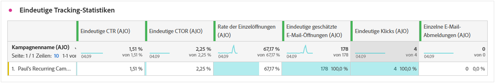

Die Tabelle **[!UICONTROL Eindeutige Tracking-Statistiken]** bietet eine fokussierte Ansicht der Interaktion auf Profilebene mit den E-Mails in Ihrer Kampagne. Sie hebt eindeutige Metriken hervor, die wertvolle Erkenntnisse zur Interaktion einzelner Profile mit Ihren E-Mail-Inhalten in wichtigen Interaktionsstadien bieten.

+++ Weitere Informationen zu den Metriken „Tracking-Statistiken“

* **[!UICONTROL Eindeutige Klickrate (CTR)]**: Prozentsatz der eindeutigen Profile, die auf mindestens einen Link in der E-Mail geklickt haben, im Verhältnis zur Anzahl der eindeutigen zugestellten E-Mails.

* **[!UICONTROL Eindeutige Klick-Öffnungsrate (CTOR)]**: Prozentsatz der eindeutigen Profile, die nach Öffnen der E-Mail auf einen Link geklickt haben, basierend auf den eindeutigen Öffnungen.

* **[!UICONTROL Rate der Einzelöffnungen]**: Prozentsatz der eindeutigen Profile, die die E-Mail mindestens einmal geöffnet haben, im Verhältnis zur Anzahl der eindeutigen zugestellten E-Mails.

* **[!UICONTROL Einzelklicks]**: Die Anzahl der eindeutigen Profile, die auf mindestens einen Teil des Inhalts in der E-Mail geklickt haben.

* **[!UICONTROL Geschätzte Einzelöffnungen von E-Mails]**: Geschätzte Anzahl der eindeutigen E-Mail-Empfangenden, die die E-Mail wahrscheinlich geöffnet haben. Diese Metrik zielt darauf ab, eine genauere Anzahl der individuellen Interaktionen bereitzustellen, die von E-Mail-Servern zur Datenschutz- oder Sicherheitsprüfung ausgelöst werden. Hierzu wird eine eindeutige Öffnungsrate angewendet, die anhand eindeutiger Profile berechnet wird, welche die E-Mail manuell geöffnet haben, sowie denjenigen, deren E-Mails nur von E-Mail-Servern geöffnet wurden.

* **[!UICONTROL Eindeutige E-Mail-Abmeldungen]**: Anzahl der eindeutigen Profile, die auf den Link zum Abmelden in Ihren E-Mails oder auf der zugehörigen Landingpage geklickt haben.

+++

## Versandstatistiken {#sending-statistics-email}

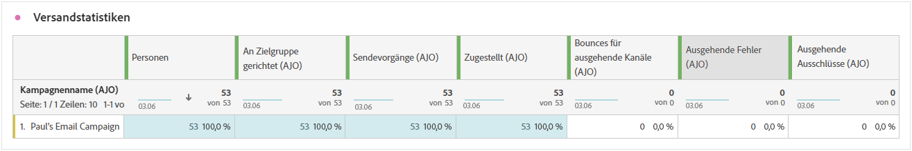

Die Tabelle **[!UICONTROL Versandstatistiken]** bietet eine umfassende Zusammenfassung wichtiger Daten zu E-Mails in Ihren Kampagnen. Sie enthält Schlüsselmetriken wie die Interaktionen mit Ihren E-Mails und die Anzahl der erfolgreich zugestellten E-Mails. Außerdem bietet sie wertvolle Erkenntnisse zur Effektivität und Reichweite Ihrer E-Mails und Kampagnen.

+++ Weitere Informationen zu den Metriken „Versandstatistiken“

* **[!UICONTROL Zielgruppe]**: Anzahl der Profile, die sich für die Zielgruppe qualifiziert haben, bevor Ausschlüsse, Unterdrückungen oder Einverständnisentnahmen angewendet wurden. In Journey mit aktiviertem erneuten Eintritt kann ein Profil mehrmals angesprochen werden.

* **[!UICONTROL Sendevorgänge]**: Gesamtzahl der Sendevorgänge für Ihre E-Mail.

* **[!UICONTROL Zugestellt]**: Gesamtznzahl der erfolgreich gesendeten E-Mails im Verhältnis zur Gesamtzahl der gesendeten Nachrichten.

* **[!UICONTROL Bounces]**: Gesamtzahl der kumulierten Fehler beim Sendevorgang und der automatischen Rücksendungen im Verhältnis zur Gesamtzahl der gesendeten Nachrichten.

* **[!UICONTROL Bounce-Rate]**: Prozentsatz der E-Mails, die nicht erfolgreich zugestellt wurden, im Verhältnis zur Gesamtzahl der gesendeten E-Mails.

* **[!UICONTROL Sendefehler]**: Gesamtzahl der während des Sendevorgangs aufgetretenen Fehler, die das Senden an Profile verhindert haben.

* **[!UICONTROL Sendeausschlüsse]**: Gesamtzahl der Profile, die durch Adobe Journey Optimizer ausgeschlossen wurden.

+++

## Tracking-Statistiken {#tracking-statistics-email}

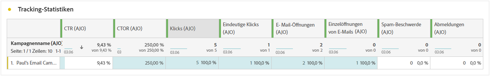

Die Tabelle **[!UICONTROL E-Mail – Tracking-Statistiken]** bietet einen detaillierten Überblick über die Profilaktivität in Bezug auf E-Mails, die in Ihrer Kampagne enthalten sind. Dazu gehören Metriken zu Öffnungen, Klicks und andere relevante Interaktionsindikatoren, die einen umfassenden Überblick darüber bieten, wie Profile mit Ihrem E-Mail-Inhalt interagieren.

+++ Weitere Informationen zu den Metriken „Tracking-Statistiken“

* **[!UICONTROL Klickrate]**: Prozentsatz der Benutzenden, die mit der E-Mail interagiert haben.

* **[!UICONTROL Durchklick-Öffnungsrate]**: Anzahl der Öffnungen der E-Mail.

* **[!UICONTROL Geschätzte E-Mail-Öffnungen]**: Geschätzte Gesamtzahl der E-Mail-Öffnungen, die sowohl direkte Öffnungen durch Profile als auch automatisierte Öffnungen durch Mail-Server berücksichtigt. Diese Metrik wird um Öffnungen angepasst, die von E-Mail-Servern für Datenschutz- oder Sicherheitsprüfungen ausgelöst werden. Hierzu wird eine Öffnungsrate angewendet, die anhand von Empfangenden berechnet wird, die die E-Mail manuell geöffnet haben, sowie anhand von Empfangenden, deren E-Mails nur von E-Mail-Servern geöffnet wurden.

* **[!UICONTROL Klicks]**: Anzahl der Klicks auf einen Inhalt in Ihren E-Mails.

* **[!UICONTROL Beschwerden wegen Spam]**: Gibt an, wie oft eine Nachricht als Spam oder Junk gekennzeichnet wurde.

* **[!UICONTROL Abmeldungen]**: Anzahl der Klicks auf den Abmelde-Link oder auf die zugehörige Landingpage.

+++

## E-Mail-Domains {#email-domains}

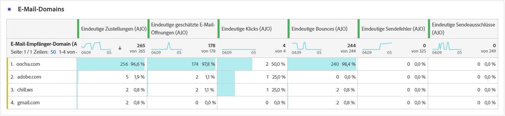

Die Tabelle **[!UICONTROL E-Mail-Domains]** bietet eine detaillierte Aufschlüsselung der E-Mails nach Domain, die umfassende Einblicke in die Performance-Metriken Ihrer E-Mail-Kampagnen bietet. Mit dieser umfassenden Analyse können Sie das Verhalten verschiedener Domains als Reaktion auf Ihre E-Mail-Inhalte nachvollziehen.

+++ Weitere Informationen zu den Metriken „E-Mail-Domains“

* **[!UICONTROL Eindeutige Zustellungen]**: Anzahl der eindeutigen Profile, die mindestens eine E-Mail erfolgreich erhalten haben.

* **[!UICONTROL Geschätzte E-Mail-Öffnungen]**: Geschätzte Gesamtzahl der E-Mail-Öffnungen, die sowohl direkte Öffnungen durch Profile als auch automatisierte Öffnungen durch Mail-Server berücksichtigt. Diese Metrik wird um Öffnungen angepasst, die von E-Mail-Servern für Datenschutz- oder Sicherheitsprüfungen ausgelöst werden. Hierzu wird eine Öffnungsrate angewendet, die anhand von Empfangenden berechnet wird, die die E-Mail manuell geöffnet haben, sowie anhand von Empfangenden, deren E-Mails nur von E-Mail-Servern geöffnet wurden.

* **[!UICONTROL Einzelklicks]**: Anzahl der eindeutigen Profile, die auf mindestens einen Teil des Inhalts in der E-Mail geklickt haben.

* **[!UICONTROL Eindeutige Bounces]**: Anzahl der eindeutigen Profile, an die mindestens eine E-Mail nicht erfolgreich zugestellt wurde.

* **[!UICONTROL Eindeutige Sendefehler]**: Anzahl der eindeutigen Profile, bei denen während des ausgehenden Prozesses mindestens ein Sendefehler aufgetreten ist.

* **[!UICONTROL Eindeutige Sendeausschlüsse]**: Anzahl der eindeutigen Profile, die aufgrund von Eignungsregeln, Zielgruppensegmentierung oder Profilstatus vom Nachrichtenempfang ausgeschlossen sind.

+++

## Labels getrackter Links {#track-link-label}

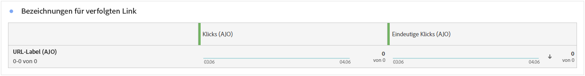

Die Tabelle **[!UICONTROL Bezeichnungen für verfolgten Link]** bietet einen umfassenden Überblick über die Link-Labels in Ihren E-Mails, in denen diejenigen hervorgehoben werden, die den meisten Besucher-Traffic generieren. Mit dieser Funktion können Sie die beliebtesten Links identifizieren und priorisieren.

+++ Weitere Informationen zu den Metriken „Labels für verfolgten Link“

* **[!UICONTROL Einzelklicks]**: Die Anzahl der Profile, die auf einen Inhalt in einer E-Mail geklickt haben.

* **[!UICONTROL Klicks]**: Anzahl der Klicks auf einen Inhalt in Ihren E-Mails.

+++

## Nachverfolgte Link-URLs {#track-link-url}

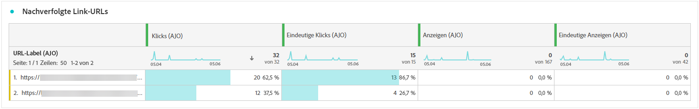

Die Tabelle **[!UICONTROL Nachverfolgte Link-URLs]** bietet einen umfassenden Überblick über die URLs in Ihrer E-Mail, die den meisten Besucher-Traffic anziehen. Auf diese Weise können Sie die beliebtesten Links identifizieren und priorisieren und Ihr Verständnis der Profilinteraktion mit bestimmten Inhalten in Ihren E-Mails verbessern.

+++ Weitere Informationen zu den Metriken „Nachverfolgte Link-URLs“

* **[!UICONTROL Einzelklicks]**: Die Anzahl der Profile, die auf einen Inhalt in einer E-Mail geklickt haben.

* **[!UICONTROL Klicks]**: Anzahl der Klicks auf einen Inhalt in Ihren E-Mails.

+++

## E-Mail-Betreff {#email-subjects}

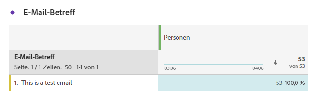

Die Tabelle **[!UICONTROL E-Mail-Betreff]** bietet einen umfassenden Überblick über die E-Mail-Betreffzeilen, die den höchsten Besucher-Traffic angezogen haben. Diese Ressource bietet wertvolle Erkenntnisse zur Interaktionsdynamik von Zielgruppen.

+++ Weitere Informationen zu den Metriken „E-Mail-Betreff“

* **[!UICONTROL Rate der Einzelöffnungen]**: Prozentsatz der eindeutigen Profile, die die E-Mail mindestens einmal geöffnet haben, im Verhältnis zur Anzahl der eindeutigen zugestellten E-Mails.

* **[!UICONTROL Geschätzte Einzelöffnungen von E-Mails]**: Geschätzte Anzahl der eindeutigen E-Mail-Empfangenden, die die E-Mail wahrscheinlich geöffnet haben. Diese Metrik zielt darauf ab, eine genauere Anzahl der individuellen Interaktionen bereitzustellen, die von E-Mail-Servern zur Datenschutz- oder Sicherheitsprüfung ausgelöst werden. Hierzu wird eine eindeutige Öffnungsrate angewendet, die anhand eindeutiger Profile berechnet wird, welche die E-Mail manuell geöffnet haben, sowie denjenigen, deren E-Mails nur von E-Mail-Servern geöffnet wurden.

* **[!UICONTROL Öffnungsrate]**: Prozentsatz der E-Mail-Öffnungen im Verhältnis zur Gesamtzahl der zugestellten E-Mails, einschließlich mehrerer Öffnungen durch dasselbe Profil.

* **[!UICONTROL Geschätzte E-Mail-Öffnungen]**: Geschätzte Gesamtzahl der E-Mail-Öffnungen, die sowohl direkte Öffnungen durch Profile als auch automatisierte Öffnungen durch Mail-Server berücksichtigt. Diese Metrik wird um Öffnungen angepasst, die von E-Mail-Servern für Datenschutz- oder Sicherheitsprüfungen ausgelöst werden. Hierzu wird eine Öffnungsrate angewendet, die anhand von Empfangenden berechnet wird, die die E-Mail manuell geöffnet haben, sowie anhand von Empfangenden, deren E-Mails nur von E-Mail-Servern geöffnet wurden.

+++

## Gründe für Ausschluss {#excluded-reasons}

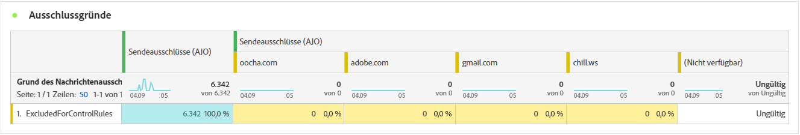

Die Tabelle **[!UICONTROL Gründe für Ausschluss]** bietet einen umfassenden Überblick über die verschiedenen Faktoren, die zum Ausschluss von Benutzerprofilen aus der Zielgruppe geführt haben, sodass die Nachricht nicht empfangen wurde.

Auf [dieser Seite](exclusion-list.md) finden Sie die umfassende Liste der Ausschlussgründe.

## Bounce-Gründe {#bounce-reasons-email}

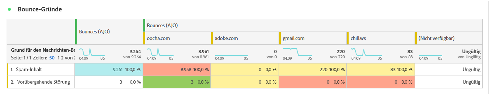

Die Tabelle **[!UICONTROL Bounce-Gründe]** kompiliert die verfügbaren Daten zu nicht zugestellten Nachrichten und bietet detaillierte Einblicke in die spezifischen Ursachen von nicht zugestellten E-Mails.

Weitere Informationen zu Bounces finden Sie auf der Seite [&#x200B; Unterdrückungslisten](../reports/suppression-list.md).

## Fehlergründe {#error-reasons-email}

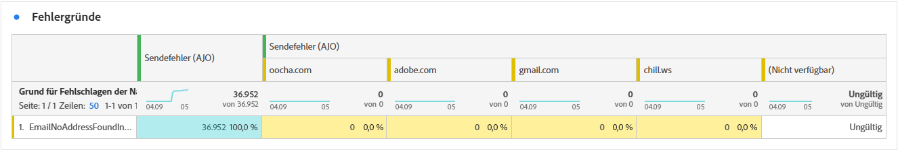

Die Tabelle **[!UICONTROL Fehlergründe]** bieten einen detaillierten Überblick über die Fehler, die während des Sendevorgangs aufgetreten sind, mit wichtigen Informationen über Art und Auftreten von Fehlern.
