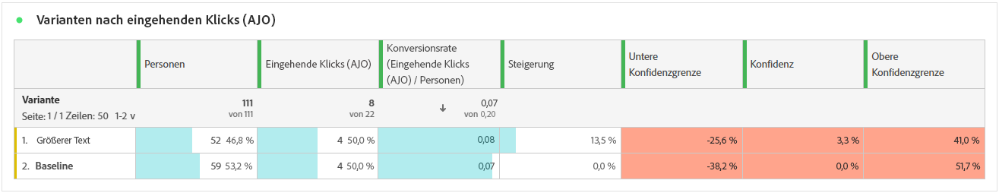
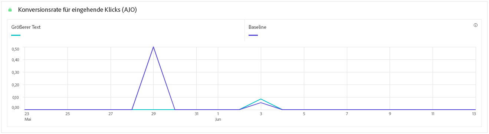

# Experimente – Kampagnenbericht {#campaign-global-report-cja-experimentation}

>[!CONTEXTUALHELP]
>id="ajo_campaigns_content_experiment_click"
>title="Erfolgsmetrik"
>abstract="Der Gesamtwert der Erfolgsmetrik, die zuvor beim Erstellen der Experimente ausgewählt wurde, dividiert durch die Anzahl der Profile."

## Experimentieren {#experimentation}

Die Registerkarte **[!UICONTROL Experimentieren]** bietet wichtige Einblicke in die Performance der einzelnen Varianten und ermittelt die erfolgreichste Variante.

Beachten Sie, dass es ein wenig dauern kann, um die beste Leistung zu ermitteln.  Wenn Ihr Experiment nicht erfolgreich ist, wird es auf **Nicht stichhaltig** gesetzt.

### Experiment-KPIs {#experimentation-kpis}

Die KPIs (Key Performance Indicators) zum **[!UICONTROL Experimentieren]** dienen als allumfassendes Dashboard und liefern eine Analyse der wesentlichen Metriken, die mit Ihren Experimenten verknüpft sind.

+++ Weitere Informationen zu den Metriken für Experiment-KPIs

* **[!UICONTROL Steigerung]**: Messung der prozentualen Verbesserung der Konversionsrate einer bestimmten Abwandlung im Vergleich zur Baseline.

* **[!UICONTROL Konfidenz]**: Belege dafür, dass eine bestimmte Abwandlung mit der Baseline-Abwandlung identisch ist. [Weitere Informationen](../content-management/experiment-calculations.md#adobes-statistical-methodology-any-time-valid-confidence-sequences)

+++

### Variante nach Erfolgsmetrik {#variant-inbound}

Die Tabelle **Variante nach Erfolgsmetriken** zeigt, wie einzelne Varianten bezüglich der Erfolgsmetrik abschneiden, die beim Einrichten des Experiments ausgewählt wurde.
Einen tiefen Einblick in diese Ergebnisse und ihre Interpretation finden Sie auf [dieser Seite](../content-management/get-started-experiment.md#interpret-results).

+++ Weitere Informationen zu Varianten nach Erfolgsmetrik

* **[!UICONTROL Personen]**: Anzahl der Benutzerprofile, die sich als Zielgruppenprofile für Ihre Nachrichten eignen.

* **[!UICONTROL Eingehende Klicks]**: Gesamtwert der Erfolgsmetrik, die zuvor beim Erstellen der Experimente ausgewählt wurde.

* **[!UICONTROL Konversionsrate]**: Der Gesamtwert der Erfolgsmetrik, die zuvor beim Erstellen der Experimente ausgewählt wurde, dividiert durch die Anzahl der Profile.

* **[!UICONTROL Steigerung]**: Messung der prozentualen Verbesserung der Konversionsrate einer bestimmten Abwandlung im Vergleich zur Baseline.

* **[!UICONTROL Konfidenzuntergrenze]**: Niedrigster geschätzter Wert der Konversionsratendifferenz zwischen der Abwandlung und der Baseline innerhalb des gewählten Konfidenzintervalls.

* **[!UICONTROL Konfidenz]**: Belege dafür, dass eine bestimmte Abwandlung mit der Baseline-Abwandlung identisch ist. [Weitere Informationen](../content-management/experiment-calculations.md#adobes-statistical-methodology-any-time-valid-confidence-sequences)

* **[!UICONTROL Konfidenzobergrenze]**: Höchster geschätzter Wert der Konversionsratendifferenz zwischen der Abwandlung und der Baseline innerhalb des gewählten Konfidenzintervalls.

+++

### Konversionsrate für Erfolgsmetrik {#conversion-rate}

Das Diagramm **[!UICONTROL Konfidenzintervall]** zeigt den Bereich der möglichen Verbesserung an, indem die Baseline mit der Abwandlung mit der besten Performance bezüglich der ausgewählten Erfolgsmetrik verglichen wird. [Weitere Informationen](../content-management/experiment-calculations.md#adobes-statistical-methodology-any-time-valid-confidence-sequences).