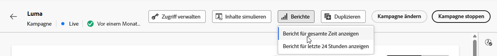
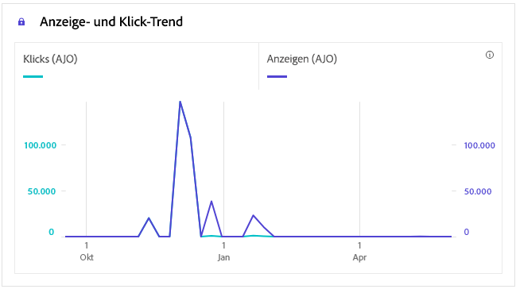

# Kampagnenbericht zu In-App-Daten {#campaign-global-report-cja-inapp}

>[!IMPORTANT]
>
>Damit Sie Berichte zu In-App-Kampagnen und -Journeys erstellen können, müssen Sie die Reporting-Voraussetzungen auf [dieser Seite](../in-app/inapp-configuration.md#experiment-prerequisites) erfüllen.

>[!BEGINSHADEBOX]

Sie können auf Ihren In-App-Kampagnenbericht zugreifen, indem Sie in Ihrer Kampagne auf die Schaltfläche **[!UICONTROL Berichte]** klicken und dann **[!UICONTROL Bericht für gesamte Zeit anzeigen]** auswählen. [Weitere Informationen](report-gs-cja.md)

>[!ENDSHADEBOX]

## Anzeige- und Klick-Trend {#impression-click-trend}

Der Graph **[!UICONTROL Impression- und Klick-Trend]** zeigt eine detaillierte Analyse der Interaktion Ihrer Profile mit Ihren In-App-Nachrichten und bietet wertvolle Erkenntnisse zur Interaktion von Profilen mit Ihren Inhalten.

+++ Weitere Informationen zu den Metriken „Impression- und Klick-Trend“

* **[!UICONTROL Klicks]**: Gibt an, wie oft die Benutzenden mit den In-App-Nachrichten interagiert haben.

* **[!UICONTROL Anzeigen]**: Gibt an, wie oft die In-App-Nachricht den Benutzenden angezeigt wurde.

+++

## Klicks {#clicks-inapp}

Der Graph **[!UICONTROL Klicks]** zeigt Metriken für In-App-Klicks an, die sowohl die Gesamtanzahl der Klicks auf einen Inhalt als auch die Anzahl der einzelnen Profile darstellen, die auf den Inhalt geklickt haben.

+++ Weitere Informationen zu den Metriken „Klicks“

* **[!UICONTROL Einzelklicks]**: Die Anzahl der Profile, die auf einen Inhalt in Ihren In-App-Nachrichten geklickt haben.

* **[!UICONTROL Klicks]**: Gibt an, wie oft die Benutzenden mit den In-App-Nachrichten interagiert haben.

+++

## Anzeige {#display-inapp}

Anhand des Graphs **[!UICONTROL Anzeigen]** können Sie sowohl die Gesamtreichweite der Nachricht als auch die Anzahl der einzelnen Profile nachvollziehen, die mit der Nachricht interagieren.

+++ Weitere Informationen zu den Metriken „Anzeigen“

* **[!UICONTROL Anzeigen]**: Gibt an, wie oft die In-App-Nachricht den Benutzenden angezeigt wurde.

* **[!UICONTROL Einzelanzeigen]**: Anzahl der Öffnungen der Nachricht, wobei mehrfache Interaktionen eines Profils nicht gezählt werden.

+++

## Tracking-Daten {#tracking-data-inapp}

Die Tabelle **[!UICONTROL Tracking-Daten]** bietet einen detaillierten Überblick über die Profilaktivität im Zusammenhang mit Ihren In-App-Nachrichten und liefert wichtige Erkenntnisse über die Interaktion und die Effektivität von In-App-Nachrichten.

+++ Weitere Informationen zu den Metriken „Tracking-Daten“

* **[!UICONTROL Personen]**: Anzahl der Benutzerprofile, die sich als Zielgruppenprofile für Ihre In-App-Nachrichten eignen.

* **[!UICONTROL Durchklickrate]**: Prozentsatz der Benutzenden, die mit den In-App-Nachrichten interagiert haben.

* **[!UICONTROL Durchklick-Öffnungsrate]**: Anzahl der Öffnungen der In-App-Nachrichten.

* **[!UICONTROL Klicks]**: Gibt an, wie oft die Benutzenden mit den In-App-Nachrichten interagiert haben.

* **[!UICONTROL Einzelklicks]**: Die Anzahl der Profile, die auf einen Inhalt in Ihren In-App-Nachrichten geklickt haben.

* **[!UICONTROL Anzeigen]**: Gibt an, wie oft die In-App-Nachricht den Benutzenden angezeigt wurde.

* **[!UICONTROL Einzelanzeigen]**: Anzahl der Öffnungen der Nachricht, wobei mehrfache Interaktionen eines Profils nicht gezählt werden.

* **[!UICONTROL Sendevorgänge]**: Gibt an, wie oft die App die In-App-Kampagne angefordert hat. Mehrere Anfragen pro Benutzersitzung (z. B. beim Start oder beim Neuladen) können dazu führen, dass dieser Wert die Anzahl der eindeutigen Benutzenden überschreitet, wenn die Kampagnendaten nicht zwischengespeichert werden.

* **[!UICONTROL Eingehend ausgelöst]**: Gibt an, wie oft die App die In-App-Nachricht anzeigen sollte. Diese Zahl kann niedriger sein als die Gesamtzahl der Sendevorgänge, wenn Regeln der App verhindert haben, dass die Nachricht angezeigt wird.

* **[!UICONTROL Eingehende Abweisungen]**: Anzahl, wie oft Benutzende die In-App-Nachricht verworfen haben, ohne damit zu interagieren.

+++

## Labels getrackter Links {#track-link-label-inapp}

Die Tabelle **[!UICONTROL Bezeichnungen für verfolgten Link]** bietet einen umfassenden Überblick über die Link-Labels in Ihren In-App-Nachrichten und zeigt diejenigen an, die den höchsten Besucher-Traffic generieren. Mit dieser Funktion können Sie die beliebtesten Links identifizieren und priorisieren.

+++ Weitere Informationen zu den Metriken „Labels für verfolgten Link“

* **[!UICONTROL Einzelklicks]**: Die Anzahl der Profile, die auf einen Inhalt in Ihren In-App-Nachrichten geklickt haben.

* **[!UICONTROL Klicks]**: Gibt an, wie oft die Benutzenden mit den In-App-Nachrichten interagiert haben.

* **[!UICONTROL Anzeigen]**: Gibt an, wie oft die In-App-Nachricht den Benutzenden angezeigt wurde.

* **[!UICONTROL Einzelanzeigen]**: Anzahl der Öffnungen der Nachricht, wobei mehrfache Interaktionen eines Profils nicht gezählt werden.

+++

## Nachverfolgte Link-URLs {#track-link-url-inapp}

Die Tabelle **[!UICONTROL Getrackte Link-URLs]** bietet einen umfassenden Überblick über die URLs in Ihren In-App-Nachrichten, die den höchsten Besucher-Traffic anziehen. Auf diese Weise können Sie die beliebtesten Links identifizieren und priorisieren und Ihr Verständnis der Profilinteraktion mit bestimmten Inhalten in Ihren In-App-Nachrichten verbessern.

+++ Weitere Informationen zu den Metriken „Nachverfolgte Link-URLs“

* **[!UICONTROL Einzelklicks]**: Die Anzahl der Profile, die auf einen Inhalt in Ihren In-App-Nachrichten geklickt haben.

* **[!UICONTROL Klicks]**: Gibt an, wie oft die Benutzenden mit den In-App-Nachrichten interagiert haben.

+++
