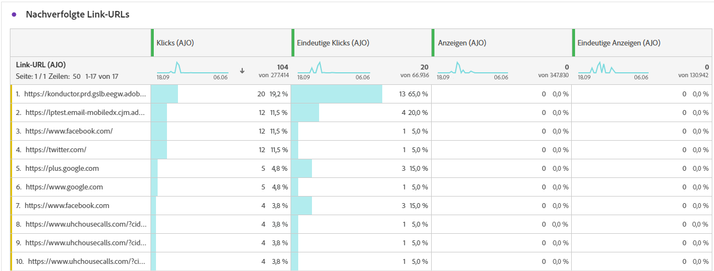

# In-App-Kampagnenbericht {#campaign-global-report-cja-inapp}

## Impression- und Klick-Trend {#impression-click-trend}

Der Graph **[!UICONTROL Impression- und Klick-Trend]** zeigt eine detaillierte Analyse der Interaktion Ihrer Profile mit Ihren In-App-Nachrichten und bietet wertvolle Erkenntnisse zur Interaktion von Profilen mit Ihren Inhalten.

+++ Weitere Informationen zu den Metriken für „Impression- und Klick-Trend“

* **[!UICONTROL Klicks]**: Anzahl der Klicks auf einen Inhalt in Ihren In-App-Nachrichten.

* **[!UICONTROL Anzeigen]**: Anzahl der Öffnungen der Nachricht.

+++

## Klicks {#clicks-inapp}

Der Graph **[!UICONTROL Klicks]** zeigt Metriken für In-App-Klicks an, die sowohl die Gesamtanzahl der Klicks auf einen Inhalt als auch die Anzahl der einzelnen Profile darstellen, die auf den Inhalt geklickt haben.

+++ Weitere Informationen zu Metriken für Klicks

* **[!UICONTROL Einzelklicks]**: Die Anzahl der Profile, die auf einen Inhalt in Ihren In-App-Nachrichten geklickt haben.

* **[!UICONTROL Klicks]**: Anzahl der Klicks auf einen Inhalt in Ihren In-App-Nachrichten.

+++

## Anzeige {#display-inapp}

Anhand des Graphs **[!UICONTROL Anzeigen]** können Sie sowohl die Gesamtreichweite der Nachricht als auch die Anzahl der einzelnen Profile nachvollziehen, die mit der Nachricht interagieren.

+++ Weitere Informationen zu Anzeigemetriken

* **[!UICONTROL Anzeigen]**: Anzahl der Öffnungen der Nachricht.

* **[!UICONTROL Einzelanzeigen]**: Anzahl der Öffnungen der Nachricht, wobei mehrfache Interaktionen eines Profils nicht gezählt werden.

+++

## Tracking-Daten {#tracking-data-inapp}

Die Tabelle **[!UICONTROL Tracking-Daten]** bietet einen detaillierten Überblick über die Profilaktivität im Zusammenhang mit Ihren In-App-Nachrichten und liefert wichtige Erkenntnisse über die Interaktion und die Effektivität von In-App-Nachrichten.

+++ Weitere Informationen zu Metriken für Tracking-Daten

* **[!UICONTROL Personen]**: Anzahl der Benutzerprofile, die sich als Zielgruppenprofile für Ihre In-App-Nachrichten eignen.

* **[!UICONTROL Durchklickrate]**: Prozentsatz der Benutzenden, die mit den In-App-Nachrichten interagiert haben.

* **[!UICONTROL Durchklick-Öffnungsrate]**: Anzahl der Öffnungen der In-App-Nachrichten.

* **[!UICONTROL Klicks]**: Anzahl der Klicks auf einen Inhalt in Ihren In-App-Nachrichten.

* **[!UICONTROL Einzelklicks]**: Die Anzahl der Profile, die auf einen Inhalt in Ihren In-App-Nachrichten geklickt haben.

* **[!UICONTROL Anzeigen]**: Anzahl der Öffnungen der Nachricht.

* **[!UICONTROL Einzelanzeigen]**: Anzahl der Öffnungen der Nachricht, wobei mehrfache Interaktionen eines Profils nicht gezählt werden.

* **[!UICONTROL Sendevorgänge]**: Gesamtzahl der Sendevorgänge für Ihre In-App-Nachrichten.

<!--
* **[!UICONTROL Inbound triggered]**: 

* **[!UICONTROL Inbound dismisses]**: 
-->
+++

## Bezeichnungen für verfolgten Link {#track-link-label-inapp}

Die Tabelle **[!UICONTROL Bezeichnungen für verfolgten Link]** bietet einen umfassenden Überblick über die Link-Labels in Ihren In-App-Nachrichten und zeigt diejenigen an, die den höchsten Besucher-Traffic generieren. Mit dieser Funktion können Sie die beliebtesten Links identifizieren und priorisieren.

+++ Weitere Informationen zu den Metriken der Bezeichnungen für verfolgte Links

* **[!UICONTROL Einzelklicks]**: Die Anzahl der Profile, die auf einen Inhalt in Ihren In-App-Nachrichten geklickt haben.

* **[!UICONTROL Klicks]**: Anzahl der Klicks auf einen Inhalt in Ihren In-App-Nachrichten.

* **[!UICONTROL Anzeigen]**: Anzahl der Öffnungen der Nachricht.

* **[!UICONTROL Einzelanzeigen]**: Anzahl der Öffnungen der Nachricht, wobei mehrfache Interaktionen eines Profils nicht gezählt werden.

+++

## Nachverfolgte Link-URLs {#track-link-url-inapp}

Die Tabelle **[!UICONTROL Getrackte Link-URLs]** bietet einen umfassenden Überblick über die URLs in Ihren In-App-Nachrichten, die den höchsten Besucher-Traffic anziehen. Auf diese Weise können Sie die beliebtesten Links identifizieren und priorisieren und Ihr Verständnis der Profilinteraktion mit bestimmten Inhalten in Ihren In-App-Nachrichten verbessern.

+++ Weitere Informationen zu den Metriken der nachverfolgten Link-URLs

* **[!UICONTROL Einzelklicks]**: Die Anzahl der Profile, die auf einen Inhalt in Ihren In-App-Nachrichten geklickt haben.

* **[!UICONTROL Klicks]**: Anzahl der Klicks auf einen Inhalt in Ihren In-App-Nachrichten.

+++
