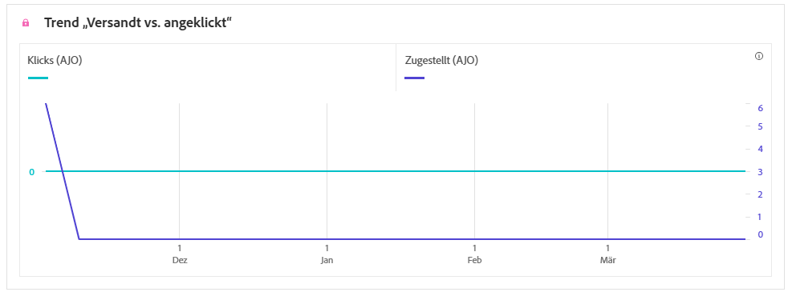
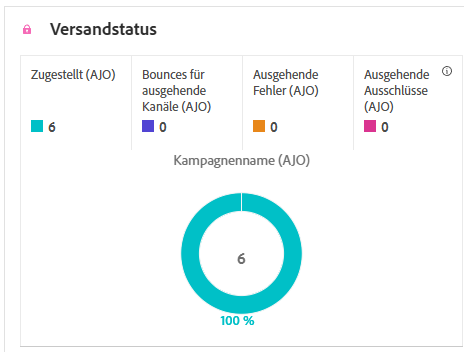

# Kampagnenbericht zu SMS-Daten {#campaign-global-report-cja-sms}

>[!BEGINSHADEBOX]

Sie können auf Ihren SMS-Kampagnenbericht zugreifen, indem Sie in Ihrer Kampagne auf **[!UICONTROL Berichte]** klicken und dann **[!UICONTROL Alle Zeitberichte anzeigen]** auswählen. [Weitere Informationen](report-gs-cja.md)

>[!ENDSHADEBOX]

## Versand- vs. Klick-Trend {#delivered-click-sms}

Der Graph **[!UICONTROL Versand- vs. Klick-Trend]** zeigt eine detaillierte Analyse der Interaktion Ihrer Profile mit Ihren E-Mails und bietet wertvolle Erkenntnisse zur Interaktion verschiedener Profile mit Ihrem Inhalt.

+++ Erfahren Sie mehr über Metriken der Zustellungs- und Klicktrends

* **[!UICONTROL Zugestellt]**: Anzahl der erfolgreich gesendeten SMS-Nachrichten im Verhältnis zur Gesamtzahl der SMS-Nachrichten.

* **[!UICONTROL Klicks]**: Anzahl der Klicks auf einen Inhalt in Ihren SMS-Nachrichten.

+++

## Versandstatus {#delivery-status-sms}

Die Tabelle **[!UICONTROL Versandstatus]** bietet eine detaillierte Übersicht über die Profilaktivitäten im Zusammenhang mit Ihren SMS-Kampagnen. Dazu gehören Metriken zu gesendeten SMS-Nachrichten, Klicks und andere relevante Interaktionsindikatoren, die einen umfassenden Überblick darüber bieten, wie Profile mit Ihrem SMS-Inhalt interagieren.

+++ Weitere Informationen zu Versandstatusmetriken

* **[!UICONTROL Zugestellt]**: Anzahl der erfolgreich gesendeten SMS-Nachrichten im Verhältnis zur Gesamtzahl der SMS-Nachrichten.

* **[!UICONTROL Bounces für ausgehende Kanäle]**: Gesamtzahl der während des Sendevorgangs kumulierten Fehler und der automatischen Rücksendungen im Verhältnis zur Gesamtzahl der gesendeten SMS-Nachrichten.

* **[!UICONTROL Ausgehende Fehler]**: Gesamtzahl der aufgetretenen Fehler, die das Senden an Profile verhindert haben.

* **[!UICONTROL Ausgehende Ausschlüsse]**: Anzahl der Profile, die durch Adobe Journey Optimizer ausgeschlossen wurden.

+++

## Labels getrackter Links {#track-link-label-sms}

Die Tabelle **[!UICONTROL Bezeichnungen für verfolgten Link]** bietet einen umfassenden Überblick über die Link-Labels in Ihren SMS-Nachrichten, in denen diejenigen hervorgehoben werden, die den meisten Besucher-Traffic generieren. Mit dieser Funktion können Sie die beliebtesten Links identifizieren und priorisieren.

+++ Erfahren Sie mehr über Metriken für getrackte Link-Kennzeichnungen

* **[!UICONTROL Einzelklicks]**: Die Anzahl der Profile, die auf einen Inhalt in Ihrer SMS-Nachricht geklickt haben.

* **[!UICONTROL Klicks]**: Anzahl der Klicks auf einen Inhalt in Ihren SMS-Nachrichten.

+++

## Nachverfolgte Link-URLs {#track-link-url-sms}

Die Tabelle **[!UICONTROL Nachverfolgte Link-URLs]** bietet einen umfassenden Überblick über die URLs in Ihren SMS-Nachrichten, die den höchsten Besucher-Traffic anziehen. Auf diese Weise können Sie die beliebtesten Links identifizieren und priorisieren und Ihr Verständnis der Profilinteraktion mit bestimmten Inhalten in Ihren SMS-Nachrichten verbessern.

+++ Weitere Informationen zur Metrik „Getrackte Link-URLs“

* **[!UICONTROL Einzelklicks]**: Die Anzahl der Profile, die auf einen Inhalt in Ihrer SMS-Nachricht geklickt haben.

* **[!UICONTROL Klicks]**: Anzahl der Klicks auf einen Inhalt in Ihren SMS-Nachrichten.

* **[!UICONTROL Anzeigen]**: Anzahl der Öffnungen der Nachricht.

* **[!UICONTROL Einzelanzeigen]**: Anzahl der Öffnungen der Nachricht, wobei mehrfache Interaktionen eines Profils nicht gezählt werden.

+++

## Eingehende SMS-Nachricht {#sms-inbound}

Die Tabelle **[!UICONTROL Eingehende SMS-Nachricht]** bietet einen umfassenden Überblick über die SMS-Nachrichten, die den meisten Besucher-Traffic angezogen haben. Diese Ressource bietet wertvolle Erkenntnisse zur Interaktionsdynamik von Zielgruppen.

+++ Weitere Informationen zu Metriken eingehender SMS-Nachrichten

* **[!UICONTROL Personen]**: Anzahl der Benutzerprofile, die sich als Zielgruppenprofile für Ihre SMS-Nachrichten eignen.

+++

## SMS-Nachrichtentyp {#sms-message-type}

Die Tabelle **[!UICONTROL SMS-Nachrichtentyp]** bietet einen umfassenden Überblick darüber, welcher SMS-Nachrichtentyp den höchsten Besucher-Traffic angezogen hat. Diese Ressource bietet wertvolle Erkenntnisse zur Interaktionsdynamik von Zielgruppen.

+++ Weitere Informationen zu Metriken vom Typ SMS-Nachricht

* **[!UICONTROL Personen]**: Anzahl der Benutzerprofile, die sich als Zielgruppenprofile für Ihre SMS-Nachrichten eignen.

+++

## SMS-Anbieter {#sms-providers}

Die Tabelle **[!UICONTROL SMS-Anbieter]** bietet einen umfassenden Überblick über die SMS-Anbieter, die den höchsten Besucher-Traffic erzielt haben. Diese Ressource bietet wertvolle Erkenntnisse zur Interaktionsdynamik von Zielgruppen.

+++ Weitere Informationen zu Metriken von SMS-Anbietern

* **[!UICONTROL Personen]**: Anzahl der Benutzerprofile, die sich als Zielgruppenprofile für Ihre SMS-Nachrichten eignen.

+++

## Bounce-Gründe {#bounce-reasons-sms}

Die Tabelle **[!UICONTROL Bounce-Gründe]** bietet einen umfassenden Überblick über Daten zu nicht zugestellten SMS-Nachrichten und liefert wertvolle Erkenntnisse zu den spezifischen Ursachen von nicht zugestellten SMS-Nachrichten.

## Fehlergründe {#error-reasons-sms}

Anhand der Tabelle **[!UICONTROL Fehlergründe]** können Sie die spezifischen Fehler identifizieren, die während des Sendevorgangs Ihrer SMS-Nachrichten aufgetreten sind. Dies ermöglicht eine gründliche Analyse aller aufgetretenen Probleme.

## Gründe für Ausschluss {#excluded-reasons-sms}

Die Tabelle **[!UICONTROL Gründe für Ausschluss]** zeigt visuell die verschiedenen Faktoren auf, die zum Ausschluss von Benutzerprofilen aus der Zielgruppe geführt haben, sodass diese keine SMS-Nachrichten von Ihnen erhalten konnten.

Auf [dieser Seite](exclusion-list.md) finden Sie eine umfassende Liste der Ausschlussgründe.
