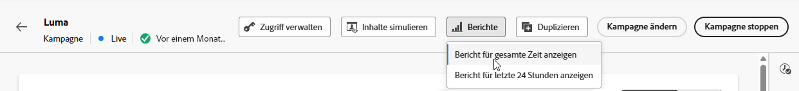
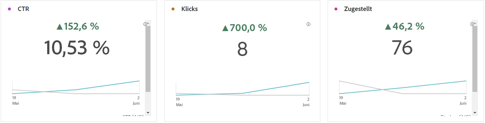
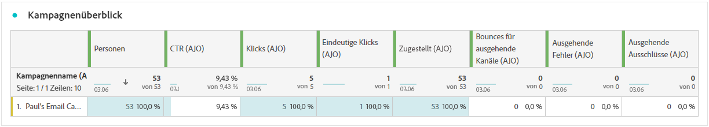
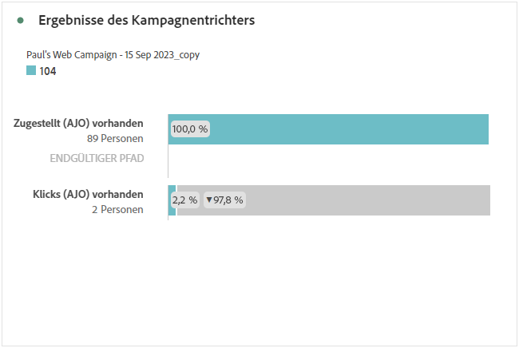
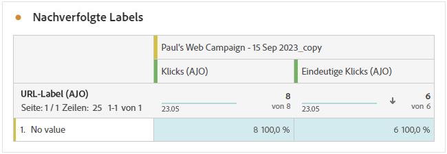
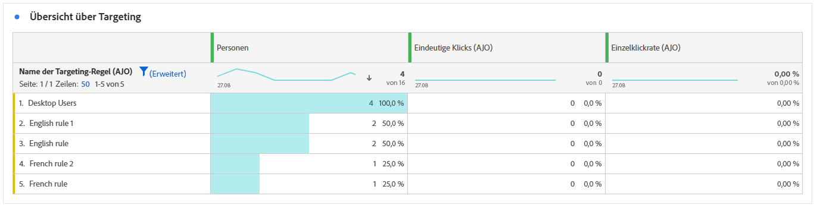

# Kampagnenbericht {#campaign-global-report-cja}

>[!BEGINSHADEBOX]

Sie können auf Ihren Kampagnenbericht zugreifen, indem Sie in Ihrer Kampagne auf die Schaltfläche **[!UICONTROL Berichte]** klicken und dann **[!UICONTROL Bericht für gesamte Zeit anzeigen]** auswählen. [Weitere Informationen](report-gs-cja.md)

>[!ENDSHADEBOX]

## Kampagnen-KPIs {#campaign-kpis}

Die KPIs (Key Performance Indicators) zur **[!UICONTROL Kampagne]** dienen als allumfassendes Dashboard und liefern eine Analyse der wesentlichen Metriken, die mit Ihrer Kampagne verknüpft sind. Dies umfasst Details wie die Anzahl der Klicks oder die Anzahl der zugestellten Nachrichten und bietet einen umfassenden Einblick in die Effektivität und den Grad der Interaktion Ihrer Kampagne.

Die KPIs variieren je nach den Kanälen, die in Ihrer Kampagne verwendeten werden.

+++ Weitere Informationen zu den Metriken „Kampagnen-KPIs“

* **[!UICONTROL Klickrate]**: Prozentsatz der Benutzenden, die mit der Nachricht interagiert haben.

* **[!UICONTROL Klicks]**: Anzahl der Klicks auf einen Inhalt in Ihrer Nachricht.

* **[!UICONTROL Zugestellt]**: Anzahl der erfolgreich gesendeten E-Mails im Verhältnis zur Gesamtzahl der gesendeten Nachrichten.

* **[!UICONTROL Anzeigen]**: Anzahl der Öffnungen der Nachricht.

+++

>[!AVAILABILITY]
>Orchestrierte Kampagnen unterstützen nur die Kanäle SMS, E-Mail und Push. Andere Kanäle (In-App, Web, Direkt-Mail usw.) sind in orchestrierten Kampagnen nicht verfügbar und werden auch nicht in Berichten angezeigt.

### Kampagnen-Überblick {#delivery-global}

Die Tabelle **[!UICONTROL Kampagnen-Überblick]** dient als umfassendes Dashboard, das eine detaillierte Aufschlüsselung der Schlüsselmetriken für Ihre Kampagne bietet. Dazu gehören wichtige Informationen wie die Anzahl der Profile und die durchgeführten Aktionen, was einen umfassenden Einblick in die Leistung und das Engagement Ihrer Kampagne ermöglicht.

Beachten Sie, dass die Metriken je nach den Kanälen variieren, die in Ihrer Kampagne verwendet werden.

+++ Weitere Informationen zu den Metriken „Kampagnenüberblick“

* **[!UICONTROL Personen]**: Anzahl der Benutzerprofile, die sich als Zielgruppenprofile für Ihre Nachrichten eignen.

* **[!UICONTROL Klickrate]**: Prozentsatz der Benutzenden, die mit der Nachricht interagiert haben.

* **[!UICONTROL Klicks]**: Anzahl der Klicks auf einen Inhalt in Ihrer Nachricht.

* **[!UICONTROL Einzelklicks]**: Anzahl der Profile, die auf einen Inhalt in Ihrer Nachricht geklickt haben.

* **[!UICONTROL Zugestellt]**: Anzahl der erfolgreich gesendeten E-Mails im Verhältnis zur Gesamtzahl der gesendeten Nachrichten.

* **[!UICONTROL Bounces für ausgehende Kanäle]**: Gesamtzahl der während des Sendevorgangs kumulierten Fehler und der automatischen Rücksendungen im Verhältnis zur Gesamtzahl der gesendeten Nachrichten.

* **[!UICONTROL Ausgehende Fehler]**: Gesamtzahl der während des Sendevorgangs aufgetretenen Fehler, die das Senden an Profile verhindert haben.

* **[!UICONTROL Ausgehende Ausschlüsse]**: Anzahl der Profile, die durch Adobe Journey Optimizer ausgeschlossen wurden. [Erfahren Sie mehr darüber, wie Ausschlüsse gezählt werden](exclusion-list.md#exclusion-list).

* **[!UICONTROL Anzeigen]**: Anzahl der Öffnungen der Nachricht.

* **[!UICONTROL Einzelanzeigen]**: Anzahl der Öffnungen der Nachricht, wobei mehrfache Interaktionen eines Profils nicht gezählt werden.

+++

### Ergebnisse des Kampagnentrichters {#campaign-funnel}

Der Graph **[!UICONTROL Ergebnisse des Kampagnentrichters]** zeigt eine detaillierte Analyse der Interaktion Ihrer Profile mit Ihren Nachrichten und bietet wertvolle Erkenntnisse zur Interaktion verschiedener Profile mit Ihrem Inhalt.

+++ Weitere Informationen zu den Metriken „Ergebnisse des Kampagnentrichters“

* **[!UICONTROL Zugestellt]**: Anzahl der erfolgreich gesendeten E-Mails im Verhältnis zur Gesamtzahl der gesendeten Nachrichten.

* **[!UICONTROL Klicks]**: Anzahl der Klicks auf einen Inhalt in Ihrer Nachricht.
+++

### Labels für verfolgten Link {#campaign-track}

Die Tabelle **[!UICONTROL Labels für verfolgten Link]** bietet wichtige Erkenntnisse über die Interaktion Ihrer Besucherinnen und Besucher mit den in Ihren Nachrichten enthaltenen URLs und liefert wertvolle Informationen darüber, welche Links die meisten Interaktionen hervorrufen.

+++ Weitere Informationen zu den Metriken „Labels für verfolgten Link“

* **[!UICONTROL Einzelklicks]**: Anzahl der Profile, die auf einen Inhalt in Ihrer Nachricht geklickt haben.

* **[!UICONTROL Klicks]**: Anzahl der Klicks auf einen Inhalt in Ihrer Nachricht.

+++

## Targeting-Überblick {#targeting}

Wenn Sie **[!UICONTROL Targeting-Regeln]** für Ihre Inhalte einrichten, bietet die Tabelle **[!UICONTROL Targeting-Überblick]** eine detaillierte Ansicht der wichtigsten Interaktionsmetriken und zeigt, wie die Zielgruppenprofile für die einzelnen Regeln mit Ihren Inhalten interagiert haben.

➡️ [Weitere Informationen zu Targeting-Regeln](../campaigns/optimization-targeting.md)

+++ Weitere Informationen zu den Metriken „Targeting-Überblick“

* **[!UICONTROL Personen]**: Anzahl der Benutzerprofile, die sich als Zielgruppenprofile für Ihre Ereignisse eignen.

* **[!UICONTROL Einzelklicks]**: Die Anzahl der Profile, die auf einen Inhalt in einer E-Mail geklickt haben.

* **[!UICONTROL Einzelklickrate]**: Prozentsatz der Zielgruppenprofile, die mindestens einmal geklickt haben.

+++
