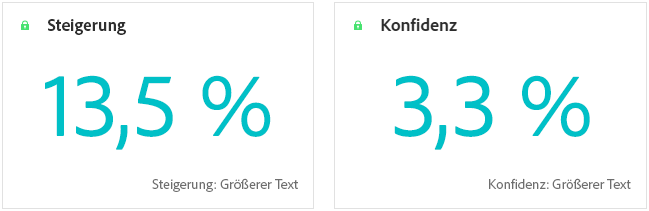
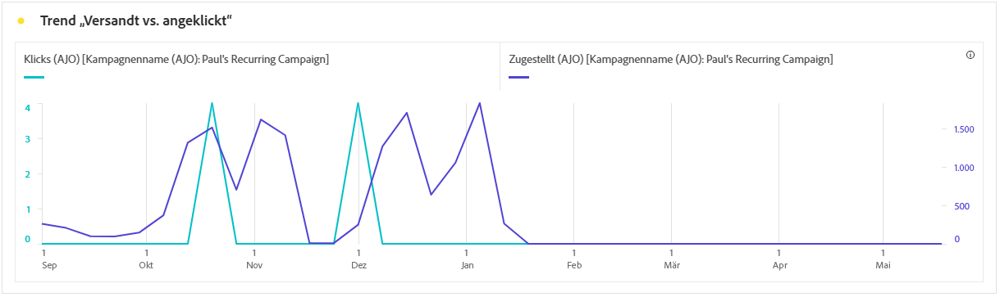
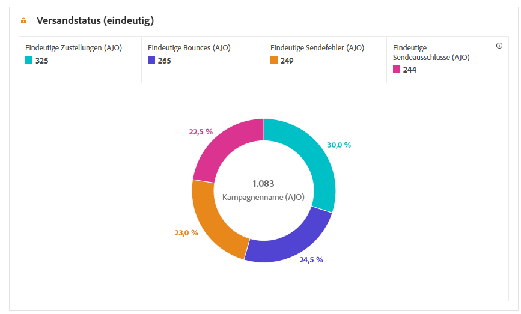
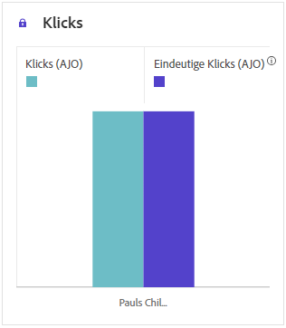
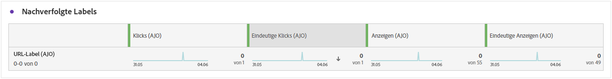

# Kampagnenbericht {#campaign-global-report-cja}

Der **Kampagnenbericht** fungiert als umfassendes Dashboard, das eine detaillierte Analyse der Schlüsselmetriken enthält, die mit Ihrer Kampagne verbunden sind. Er enthält Daten wie Klickzahlen, zugestellte Nachrichten, Profilnummern und durchgeführte Aktionen. Durch einen vollständigen Überblick über die Effektivität und die Interaktionsgrade Ihrer Kampagne gewährleistet der Bericht einen umfassenden Einblick in die Gesamtleistung Ihrer Kampagne.

Über die Schaltfläche **[!UICONTROL Berichte]** können Sie direkt in Ihrer Campaign-Instanz auf Berichte in Campaign zugreifen.

Die Seite **Kampagnenbericht** wird je nach ausgewähltem Kanal mit den folgenden Registerkarten angezeigt:

* [Kampagne](#campaign-global)
* [Experimentieren](#experimentation)
* [E-Mail](#email-global)
* [SMS](#sms)
* [Push-Benachrichtigung](#push-notification)
* [Direkt-Mail](#direct-mail)
* [Web](#web)

Weitere Informationen zum Customer Journey Analytics-Workspace und zum Filtern und Analysieren von Daten finden Sie auf [dieser Seite](https://experienceleague.adobe.com/de/docs/analytics-platform/using/cja-workspace/home).

## Kampagne {#campaign-global}

### Kampagnen-KPIs {#campaign-kpis}

Die KPIs (Key Performance Indicators) zur **[!UICONTROL Kampagne]** dienen als allumfassendes Dashboard und liefern eine Analyse der wesentlichen Metriken, die mit Ihrer Kampagne verknüpft sind. Dies umfasst Details wie die Anzahl der Klicks oder die Anzahl der zugestellten Nachrichten und bietet einen umfassenden Einblick in die Effektivität und den Grad der Interaktion Ihrer Kampagne.

Die KPIs variieren je nach den Kanälen, die in Ihrer Kampagne verwendeten werden.

+++ Weitere Informationen zu den Metriken für Kampagnen-KPIs

* **[!UICONTROL Klickrate]**: Prozentsatz der Benutzenden, die mit der Nachricht interagiert haben.

* **[!UICONTROL Klicks]**: Anzahl der Klicks auf einen Inhalt in Ihrer Nachricht.

* **[!UICONTROL Zugestellt]**: Anzahl der erfolgreich gesendeten E-Mails im Verhältnis zur Gesamtzahl der gesendeten Nachrichten.

* **[!UICONTROL Anzeigen]**: Anzahl der Öffnungen der Nachricht.

+++

### Kampagnen-Überblick {#delivery-global}

Die Tabelle **[!UICONTROL Kampagnen-Überblick]** dient als umfassendes Dashboard, das eine detaillierte Aufschlüsselung der Schlüsselmetriken für Ihre Kampagne bietet. Dazu gehören wichtige Informationen wie die Anzahl der Profile und die durchgeführten Aktionen, was einen umfassenden Einblick in die Leistung und das Engagement Ihrer Kampagne ermöglicht.

Beachten Sie, dass die Metriken je nach den Kanälen variieren, die in Ihrer Kampagne verwendet werden.

+++ Weitere Informationen zu den Kampagnenüberblicksmetriken

* **[!UICONTROL Personen]**: Anzahl der Benutzerprofile, die sich als Zielgruppenprofile für Ihre Nachrichten eignen.

* **[!UICONTROL Klickrate]**: Prozentsatz der Benutzenden, die mit der Nachricht interagiert haben.

* **[!UICONTROL Klicks]**: Anzahl der Klicks auf einen Inhalt in Ihrer Nachricht.

* **[!UICONTROL Einzelklicks]**: Anzahl der Profile, die auf einen Inhalt in Ihrer Nachricht geklickt haben.

* **[!UICONTROL Zugestellt]**: Anzahl der erfolgreich gesendeten E-Mails im Verhältnis zur Gesamtzahl der gesendeten Nachrichten.

* **[!UICONTROL Bounces für ausgehende Kanäle]**: Gesamtzahl der während des Sendevorgangs kumulierten Fehler und der automatischen Rücksendungen im Verhältnis zur Gesamtzahl der gesendeten Nachrichten.

* **[!UICONTROL Ausgehende Fehler]**: Gesamtzahl der während des Sendevorgangs aufgetretenen Fehler, die das Senden an Profile verhindert haben.

* **[!UICONTROL Ausgehende Ausschlüsse]**: Anzahl der Profile, die durch Adobe Journey Optimizer ausgeschlossen wurden.

* **[!UICONTROL Anzeigen]**: Anzahl der Öffnungen der Nachricht.

* **[!UICONTROL Einzelanzeigen]**: Anzahl der Öffnungen der Nachricht, wobei mehrfache Interaktionen eines Profils nicht gezählt werden.

+++

### Ergebnisse des Kampagnentrichters {#campaign-funnel}

Der Graph **[!UICONTROL Ergebnisse des Kampagnentrichters]** zeigt eine detaillierte Analyse der Interaktion Ihrer Profile mit Ihren Nachrichten und bietet wertvolle Erkenntnisse zur Interaktion verschiedener Profile mit Ihrem Inhalt.

+++ Weitere Informationen zu den Metriken für die Ergebnisse des Kampagnentrichters

* **[!UICONTROL Zugestellt]**: Anzahl der erfolgreich gesendeten E-Mails im Verhältnis zur Gesamtzahl der gesendeten Nachrichten.

* **[!UICONTROL Klicks]**: Anzahl der Klicks auf einen Inhalt in Ihrer Nachricht.
+++

### Bezeichnungen für verfolgten Link {#campaign-track}

Die Tabelle **[!UICONTROL Bezeichnungen für verfolgten Link]** bietet wichtige Erkenntnisse über die Interaktion Ihrer Besucherinnen und Besucher mit den in Ihren Nachrichten enthaltenen URLs und liefert wertvolle Informationen darüber, welche Links die meisten Interaktionen hervorrufen.

+++ Weitere Informationen zu den Metriken für Bezeichnungen für verfolgten Link

* **[!UICONTROL Einzelklicks]**: Anzahl der Profile, die auf einen Inhalt in Ihrer Nachricht geklickt haben.

* **[!UICONTROL Klicks]**: Anzahl der Klicks auf einen Inhalt in Ihrer Nachricht.

+++

## Experimentieren {#experimentation}

Die Registerkarte **[!UICONTROL Experimentieren]** bietet wichtige Einblicke in die Performance der einzelnen Varianten und ermittelt die erfolgreichste Variante.

Beachten Sie, dass es ein wenig dauern kann, um die beste Leistung zu ermitteln.  Wenn Ihr Experiment nicht erfolgreich ist, wird es auf **Nicht stichhaltig** gesetzt.

### Experiment-KPIs {#experimentation-kpis}

Die KPIs (Key Performance Indicators) zum **[!UICONTROL Experimentieren]** dienen als allumfassendes Dashboard und liefern eine Analyse der wesentlichen Metriken, die mit Ihren Experimenten verknüpft sind.

+++ Weitere Informationen zu den Metriken für Experimentierungs-KPIs

* **[!UICONTROL Steigerung]**: Messung der prozentualen Verbesserung der Konversionsrate einer bestimmten Abwandlung im Vergleich zur Baseline.

* **[!UICONTROL Konfidenz]**: Belege dafür, dass eine bestimmte Abwandlung mit der Baseline-Abwandlung identisch ist. [Weitere Informationen](../content-management/experiment-calculations.md#understand-confidence)

+++

### Variante nach eingehenden Klicks {#variant-inbound}

Das Widget **[!UICONTROL Variante nach eingehenden Klicks]** liefert Details zur Performance der einzelnen Varianten.
Einen tiefen Einblick in diese Ergebnisse und ihre Interpretation finden Sie auf [dieser Seite](../content-management/get-started-experiment.md#interpret-results).

+++ Weitere Informationen zu den Metriken, die die Variante nach eingehenden Klicks betreffen

* **[!UICONTROL Personen]**: Anzahl der Benutzerprofile, die sich als Zielgruppenprofile für Ihre Nachrichten eignen.

* **[!UICONTROL Eingehende Klicks]**: Gesamtanzahl der Klicks in allen ausgehenden Kanälen.

* **[!UICONTROL Konversionsrate]**: Der Gesamtwert der Erfolgsmetrik, die zuvor beim Erstellen der Experimente ausgewählt wurde, dividiert durch die Anzahl der Profile.

* **[!UICONTROL Steigerung]**: Messung der prozentualen Verbesserung der Konversionsrate einer bestimmten Abwandlung im Vergleich zur Baseline.

* **[!UICONTROL Konfidenz]**: Belege dafür, dass eine bestimmte Abwandlung mit der Baseline-Abwandlung identisch ist. [Weitere Informationen](../content-management/experiment-calculations.md#understand-confidence)

<!--
* **[!UICONTROL Confidence Upper bound]**:

* **[!UICONTROL Confidence Lower bound]**:
-->
+++

### Konversionsrate der eingehenden Klicks {#conversion-rate}

Der Graph **[!UICONTROL Konfidenzintervall]** misst die Unsicherheit im Zusammenhang mit Verbesserungen. Er beschreibt den prozentualen Performance-Unterschied zwischen der Baseline und der Abwandlung mit der besten Performance. [Weitere Informationen](../content-management/experiment-calculations.md#confidence-intervals).

## E-Mail {#email-global}

### Versand- vs. Klick-Trend {#delivered-click}

Der Graph **[!UICONTROL Versand- vs. Klick-Trend]** zeigt eine detaillierte Analyse der Interaktion Ihrer Profile mit Ihren E-Mails und bietet wertvolle Erkenntnisse zur Interaktion verschiedener Profile mit Ihrem Inhalt.

+++ Weitere Informationen zu den Metriken, die den Versand- vs. Klick-Trend betreffen

* **[!UICONTROL Zugestellt]**: Anzahl der erfolgreich gesendeten E-Mails im Verhältnis zur Gesamtzahl der gesendeten E-Mails.

* **[!UICONTROL Klicks]**: Anzahl der Klicks auf einen Inhalt in Ihren E-Mails.

+++

### Versandstatus {#delivery-status}

Der Graph **[!UICONTROL Versandstatus]** bietet einen umfassenden Überblick über Daten zu gesendeten E-Mails in Ihrer Kampagne und liefert Einblicke in Schlüsselmetriken wie zugestellte Nachrichten und Bounces. Dies ermöglicht eine detaillierte Analyse des E-Mail-Sendevorgangs und liefert wertvolle Informationen über die Effizienz und Performance Ihrer Kampagnen.

+++ Weitere Informationen zu den Versandstatus-Metriken

* **[!UICONTROL Zugestellt]**: Anzahl der erfolgreich gesendeten E-Mails im Verhältnis zur Gesamtzahl der gesendeten E-Mails.

* **[!UICONTROL Bounces für ausgehende Kanäle]**: Gesamtzahl der während des Sendevorgangs kumulierten Fehler und der automatischen Rücksendungen im Verhältnis zur Gesamtzahl der gesendeten Nachrichten.

* **[!UICONTROL Ausgehende Fehler]**: Gesamtanzahl der während eines Sendevorgangs aufgetretenen Fehler, die das Senden an Profile verhindert haben.

* **[!UICONTROL Ausgehende Ausschlüsse]**: Anzahl der Profile, die durch Adobe Journey Optimizer ausgeschlossen wurden.

+++

### Versandstatistiken {#sending-statistics-email}

Die Tabelle **[!UICONTROL Versandstatistiken]** bietet eine umfassende Zusammenfassung wichtiger Daten zu E-Mails in Ihren Kampagnen. Sie enthält Schlüsselmetriken wie die Interaktionen mit Ihren E-Mails und die Anzahl der erfolgreich zugestellten E-Mails. Außerdem bietet sie wertvolle Erkenntnisse zur Effektivität und Reichweite Ihrer E-Mails und Kampagnen.

+++ Weitere Informationen zu Metriken für Versandstatistiken

* **[!UICONTROL Personen]**: Anzahl der Benutzerprofile, die sich als Zielgruppenprofile für Ihre Nachrichten eignen.

* **[!UICONTROL Zielgruppe]**: Gesamtzahl der während des Sendevorgangs verarbeiteten E-Mails.

* **[!UICONTROL Sendevorgänge]**: Gesamtzahl der Sendevorgänge für Ihre E-Mail.

* **[!UICONTROL Zugestellt]**: Anzahl der erfolgreich gesendeten E-Mails im Verhältnis zur Gesamtzahl der gesendeten Nachrichten.

* **[!UICONTROL Bounces für ausgehende Kanäle]**: Gesamtzahl der während des Sendevorgangs kumulierten Fehler und der automatischen Rücksendungen im Verhältnis zur Gesamtzahl der gesendeten Nachrichten.

* **[!UICONTROL Ausgehende Fehler]**: Gesamtzahl der während des Sendevorgangs aufgetretenen Fehler, die das Senden an Profile verhindert haben.

* **[!UICONTROL Ausgehende Ausschlüsse]**: Anzahl der Profile, die durch Adobe Journey Optimizer ausgeschlossen wurden.

+++

### Tracking-Statistiken {#tracking-statistics-email}

Die Tabelle **[!UICONTROL E-Mail – Tracking-Statistiken]** bietet einen detaillierten Überblick über die Profilaktivität in Bezug auf E-Mails, die in Ihrer Kampagne enthalten sind. Dazu gehören Metriken zu Öffnungen, Klicks und andere relevante Interaktionsindikatoren, die einen umfassenden Überblick darüber bieten, wie Profile mit Ihrem E-Mail-Inhalt interagieren.

+++ Weitere Informationen zu Metriken für „Tracking-Statistiken“

* **[!UICONTROL Klickrate]**: Prozentsatz der Benutzenden, die mit der E-Mail interagiert haben.

* **[!UICONTROL Durchklick-Öffnungsrate]**: Anzahl der Öffnungen der E-Mail.

* **[!UICONTROL Klicks]**: Anzahl der Klicks auf einen Inhalt in Ihren E-Mails.

* **[!UICONTROL Einzelklicks]**: Die Anzahl der Profile, die auf einen Inhalt in einer E-Mail geklickt haben.

* **[!UICONTROL E-Mail-Öffnungen]**: Anzahl der Öffnungen Ihrer E-Mails in einer Kampagne.

* **[!UICONTROL Einzelne E-Mail-Öffnungen]**: Prozentsatz der geöffneten E-Mails.

* **[!UICONTROL Beschwerden wegen Spam]**: Gibt an, wie oft eine Nachricht als Spam oder Junk gekennzeichnet wurde.

* **[!UICONTROL Abmeldungen]**: Anzahl der Klicks auf den Abmelde-Link.

+++

### E-Mail-Domains {#email-domains}

Die Tabelle **[!UICONTROL E-Mail-Domains]** bietet eine detaillierte Aufschlüsselung der E-Mails nach Domain, die umfassende Einblicke in die Performance-Metriken Ihrer E-Mail-Kampagnen bietet. Mit dieser umfassenden Analyse können Sie das Verhalten verschiedener Domains als Reaktion auf Ihre E-Mail-Inhalte nachvollziehen.

+++ Weitere Informationen zu Metriken für E-Mail-Domains

* **[!UICONTROL Sendevorgänge]**: Gesamtzahl der Sendevorgänge für Ihre E-Mail.

* **[!UICONTROL Zugestellt]**: Anzahl der erfolgreich gesendeten E-Mails im Verhältnis zur Gesamtzahl der gesendeten E-Mails.

* **[!UICONTROL E-Mail-Öffnungen]**: Anzahl der Öffnungen Ihrer E-Mails in einer Kampagne.

* **[!UICONTROL Klicks]**: Anzahl der Klicks auf einen Inhalt in Ihren E-Mails.

* **[!UICONTROL Bounces für ausgehende Kanäle]**: Gesamtzahl der während des Sendevorgangs kumulierten Fehler und der automatischen Rücksendungen im Verhältnis zur Gesamtzahl der gesendeten E-Mails.

* **[!UICONTROL Ausgehende Fehler]**: Gesamtanzahl der während eines Sendevorgangs aufgetretenen Fehler, die das Senden an Profile verhindert haben.
+++

### Bezeichnungen für verfolgten Link {#track-link-label}

Die Tabelle **[!UICONTROL Bezeichnungen für verfolgten Link]** bietet einen umfassenden Überblick über die Link-Labels in Ihren E-Mails, in denen diejenigen hervorgehoben werden, die den meisten Besucher-Traffic generieren. Mit dieser Funktion können Sie die beliebtesten Links identifizieren und priorisieren.

+++ Weitere Informationen zu den Metriken der Bezeichnungen für verfolgte Links

* **[!UICONTROL Einzelklicks]**: Die Anzahl der Profile, die auf einen Inhalt in einer E-Mail geklickt haben.

* **[!UICONTROL Klicks]**: Anzahl der Klicks auf einen Inhalt in Ihren E-Mails.

+++

### Nachverfolgte Link-URLs {#track-link-url}

Die Tabelle **[!UICONTROL Nachverfolgte Link-URLs]** bietet einen umfassenden Überblick über die URLs in Ihrer E-Mail, die den meisten Besucher-Traffic anziehen. Auf diese Weise können Sie die beliebtesten Links identifizieren und priorisieren und Ihr Verständnis der Profilinteraktion mit bestimmten Inhalten in Ihren E-Mails verbessern.

+++ Weitere Informationen zu den Metriken der nachverfolgten Link-URLs

* **[!UICONTROL Einzelklicks]**: Die Anzahl der Profile, die auf einen Inhalt in einer E-Mail geklickt haben.

* **[!UICONTROL Klicks]**: Anzahl der Klicks auf einen Inhalt in Ihren E-Mails.

* **[!UICONTROL Anzeigen]**: Anzahl der Öffnungen der E-Mail.

* **[!UICONTROL Einzelanzeigen]**: Anzahl der Öffnungen der E-Mail, wobei mehrfache Interaktionen eines Profils nicht gezählt werden.

+++

### E-Mail-Betreff {#email-subjects}

Die Tabelle **[!UICONTROL E-Mail-Betreff]** bietet einen umfassenden Überblick über die E-Mail-Betreffzeilen, die den höchsten Besucher-Traffic angezogen haben. Diese Ressource bietet wertvolle Erkenntnisse zur Interaktionsdynamik von Zielgruppen.

+++ Weitere Informationen zu Metriken für den E-Mail-Betreff

* **[!UICONTROL Personen]**: Anzahl der Benutzerprofile, die sich als Zielgruppenprofile für Ihre E-Mails eignen.

+++

### Gründe für Ausschluss {#excluded-reasons}

Die Tabelle **[!UICONTROL Gründe für Ausschluss]** bietet einen umfassenden Überblick über die verschiedenen Faktoren, die zum Ausschluss von Benutzerprofilen aus der Zielgruppe geführt haben, sodass die Nachricht nicht empfangen wurde.

Auf [dieser Seite](exclusion-list.md) finden Sie die umfassende Liste der Ausschlussgründe.

### Bounce-Gründe {#bounce-reasons-email}

Die Tabelle **[!UICONTROL Bounce-Gründe]** kompiliert die verfügbaren Daten zu nicht zugestellten Nachrichten und bietet detaillierte Einblicke in die spezifischen Ursachen von nicht zugestellten E-Mails.

Weitere Informationen zu Bounces finden Sie auf der Seite [ Unterdrückungslisten](../reports/suppression-list.md).

### Fehlergründe {#error-reasons-email}

Die Tabelle **[!UICONTROL Fehlergründe]** bieten einen detaillierten Überblick über die Fehler, die während des Sendevorgangs aufgetreten sind, mit wichtigen Informationen über Art und Auftreten von Fehlern.

## SMS {#sms}

### Versand- vs. Klick-Trend {#delivered-click-sms}

Der Graph **[!UICONTROL Versand- vs. Klick-Trend]** zeigt eine detaillierte Analyse der Interaktion Ihrer Profile mit Ihren E-Mails und bietet wertvolle Erkenntnisse zur Interaktion verschiedener Profile mit Ihrem Inhalt.

+++ Weitere Informationen zu den Metriken, die den Versand- vs. Klick-Trend betreffen

* **[!UICONTROL Zugestellt]**: Anzahl der erfolgreich gesendeten SMS-Nachrichten im Verhältnis zur Gesamtzahl der SMS-Nachrichten.

* **[!UICONTROL Klicks]**: Anzahl der Klicks auf einen Inhalt in Ihren SMS-Nachrichten.

+++

### Versandstatus {#delivery-status-sms}

Die Tabelle **[!UICONTROL Versandstatus]** bietet eine detaillierte Übersicht über die Profilaktivitäten im Zusammenhang mit Ihren SMS-Kampagnen. Dazu gehören Metriken zu gesendeten SMS-Nachrichten, Klicks und andere relevante Interaktionsindikatoren, die einen umfassenden Überblick darüber bieten, wie Profile mit Ihrem SMS-Inhalt interagieren.

+++ Weitere Informationen zu den Versandstatus-Metriken

* **[!UICONTROL Zugestellt]**: Anzahl der erfolgreich gesendeten SMS-Nachrichten im Verhältnis zur Gesamtzahl der SMS-Nachrichten.

* **[!UICONTROL Bounces für ausgehende Kanäle]**: Gesamtzahl der während des Sendevorgangs kumulierten Fehler und der automatischen Rücksendungen im Verhältnis zur Gesamtzahl der gesendeten SMS-Nachrichten.

* **[!UICONTROL Ausgehende Fehler]**: Gesamtzahl der aufgetretenen Fehler, die das Senden an Profile verhindert haben.

* **[!UICONTROL Ausgehende Ausschlüsse]**: Anzahl der Profile, die durch Adobe Journey Optimizer ausgeschlossen wurden.

+++

### Bezeichnungen für verfolgten Link {#track-link-label-sms}

Die Tabelle **[!UICONTROL Bezeichnungen für verfolgten Link]** bietet einen umfassenden Überblick über die Link-Labels in Ihren SMS-Nachrichten, in denen diejenigen hervorgehoben werden, die den meisten Besucher-Traffic generieren. Mit dieser Funktion können Sie die beliebtesten Links identifizieren und priorisieren.

+++ Weitere Informationen zu den Metriken der Bezeichnungen für verfolgte Links

* **[!UICONTROL Einzelklicks]**: Die Anzahl der Profile, die auf einen Inhalt in Ihrer SMS-Nachricht geklickt haben.

* **[!UICONTROL Klicks]**: Anzahl der Klicks auf einen Inhalt in Ihren SMS-Nachrichten.

+++

### Nachverfolgte Link-URLs {#track-link-url-sms}

Die Tabelle **[!UICONTROL Nachverfolgte Link-URLs]** bietet einen umfassenden Überblick über die URLs in Ihren SMS-Nachrichten, die den höchsten Besucher-Traffic anziehen. Auf diese Weise können Sie die beliebtesten Links identifizieren und priorisieren und Ihr Verständnis der Profilinteraktion mit bestimmten Inhalten in Ihren SMS-Nachrichten verbessern.

+++ Weitere Informationen zu den Metriken der nachverfolgten Link-URLs

* **[!UICONTROL Einzelklicks]**: Die Anzahl der Profile, die auf einen Inhalt in Ihrer SMS-Nachricht geklickt haben.

* **[!UICONTROL Klicks]**: Anzahl der Klicks auf einen Inhalt in Ihren SMS-Nachrichten.

* **[!UICONTROL Anzeigen]**: Anzahl der Öffnungen der Nachricht.

* **[!UICONTROL Einzelanzeigen]**: Anzahl der Öffnungen der Nachricht, wobei mehrfache Interaktionen eines Profils nicht gezählt werden.

+++

### Eingehende SMS-Nachricht {#sms-inbound}

Die Tabelle **[!UICONTROL Eingehende SMS-Nachricht]** bietet einen umfassenden Überblick über die SMS-Nachrichten, die den meisten Besucher-Traffic angezogen haben. Diese Ressource bietet wertvolle Erkenntnisse zur Interaktionsdynamik von Zielgruppen.

+++ Weitere Informationen zu Metriken für eingehende SMS-Nachrichten

* **[!UICONTROL Personen]**: Anzahl der Benutzerprofile, die sich als Zielgruppenprofile für Ihre SMS-Nachrichten eignen.

+++

### SMS-Nachrichtentyp {#sms-message-type}

Die Tabelle **[!UICONTROL SMS-Nachrichtentyp]** bietet einen umfassenden Überblick darüber, welcher SMS-Nachrichtentyp den höchsten Besucher-Traffic angezogen hat. Diese Ressource bietet wertvolle Erkenntnisse zur Interaktionsdynamik von Zielgruppen.

+++ Weitere Informationen zu Metriken für den SMS-Nachrichtentyp

* **[!UICONTROL Personen]**: Anzahl der Benutzerprofile, die sich als Zielgruppenprofile für Ihre SMS-Nachrichten eignen.

+++

### SMS-Anbieter {#sms-providers}

Die Tabelle **[!UICONTROL SMS-Anbieter]** bietet einen umfassenden Überblick über die SMS-Anbieter, die den höchsten Besucher-Traffic erzielt haben. Diese Ressource bietet wertvolle Erkenntnisse zur Interaktionsdynamik von Zielgruppen.

+++ Weitere Informationen zu Metriken für SMS-Anbieter

* **[!UICONTROL Personen]**: Anzahl der Benutzerprofile, die sich als Zielgruppenprofile für Ihre SMS-Nachrichten eignen.

+++

### Bounce-Gründe {#bounce-reasons-sms}

Die Tabelle **[!UICONTROL Bounce-Gründe]** bietet einen umfassenden Überblick über Daten zu nicht zugestellten SMS-Nachrichten und liefert wertvolle Erkenntnisse zu den spezifischen Ursachen von nicht zugestellten SMS-Nachrichten.

### Fehlergründe {#error-reasons-sms}

Anhand der Tabelle **[!UICONTROL Fehlergründe]** können Sie die spezifischen Fehler identifizieren, die während des Sendevorgangs Ihrer SMS-Nachrichten aufgetreten sind. Dies ermöglicht eine gründliche Analyse aller aufgetretenen Probleme.

### Gründe für Ausschluss {#excluded-reasons-sms}

Die Tabelle **[!UICONTROL Gründe für Ausschluss]** zeigt visuell die verschiedenen Faktoren auf, die zum Ausschluss von Benutzerprofilen aus der Zielgruppe geführt haben, sodass diese keine SMS-Nachrichten von Ihnen erhalten konnten.

Auf [dieser Seite](exclusion-list.md) finden Sie eine umfassende Liste der Ausschlussgründe.

## Push-Benachrichtigung {#push-notification}

### Versandstatistiken {#sending-statistics-push}

Die Tabelle **[!UICONTROL Versandstatistiken]** bietet eine umfassende Zusammenfassung der wichtigsten Daten zu Ihren Push-Benachrichtigungskampagnen. Sie enthält Schlüsselmetriken wie die Größe der Zielgruppe und die Anzahl der erfolgreich zugestellten Push-Benachrichtigungen und bietet wertvolle Erkenntnisse zur Effektivität und Reichweite Ihrer Push-Benachrichtigung.

+++ Weitere Informationen zu Metriken für Versandstatistiken

* **[!UICONTROL Personen]**: Anzahl der Benutzerprofile, die sich als Zielgruppenprofile für Ihre Push-Benachrichtigungen eignen.

* **[!UICONTROL Zielgruppe]**: Gesamtzahl der während der Analyse verarbeiteten Push-Benachrichtigungen.

* **[!UICONTROL Sendevorgänge]**: Gesamtzahl der Sendevorgänge für die Push-Benachrichtigung.

* **[!UICONTROL Zugestellt]**: Anzahl der erfolgreich gesendeten Push-Benachrichtigungen im Verhältnis zur Gesamtzahl der gesendeten Push-Benachrichtigungen

* **[!UICONTROL Bounces für ausgehende Kanäle]**: Gesamtzahl der während des Sendevorgangs kumulierten Fehler und der automatischen Rücksendungen im Verhältnis zur Gesamtzahl der Push-Benachrichtigungen.

* **[!UICONTROL Ausgehende Fehler]**: Gesamtzahl der aufgetretenen Fehler, die das Senden an Profile verhindert haben.

* **[!UICONTROL Ausgehende Ausschlüsse]**: Anzahl der Profile, die durch Adobe Journey Optimizer ausgeschlossen wurden.

+++

### Tracking-Statistiken {#tracking-statistics-push}

Die Tabelle **[!UICONTROL Tracking-Statistiken]** bietet einen detaillierten Überblick über die Profilaktivität im Zusammenhang mit Ihren Push-Benachrichtigungen und liefert wichtige Erkenntnisse über die Interaktion und die Effektivität von Push-Benachrichtigungen.

+++ Weitere Informationen zu Metriken für „Tracking-Statistiken“

* **[!UICONTROL Durchklickrate]**: Prozentsatz der Benutzenden, die mit den Push-Benachrichtigungen interagiert haben.

* **[!UICONTROL Durchklick-Öffnungsrate]**: Anzahl der Öffnungen der Push-Benachrichtigungen.

* **[!UICONTROL Klicks]**: Gibt an, wie oft ein Inhalt in Ihren Push-Benachrichtigungen angeklickt wurde.

* **[!UICONTROL Einzelklicks]**: Die Anzahl der Profile, die auf einen Inhalt in Ihren Push-Benachrichtigungen geklickt haben.

<!--
* **[!UICONTROL Push custom actions]**: 
-->
+++

### Bezeichnungen für verfolgten Link {#track-link-label-push}

Die Tabelle **[!UICONTROL Bezeichnungen für verfolgten Link]** bietet einen umfassenden Überblick über die Link-Labels in Ihren Push-Benachrichtigungen und zeigt diejenigen an, die den höchsten Besucher-Traffic generieren. Mit dieser Funktion können Sie die beliebtesten Links identifizieren und priorisieren.

+++ Weitere Informationen zu den Metriken der Bezeichnungen für verfolgte Links

* **[!UICONTROL Einzelklicks]**: Die Anzahl der Profile, die auf einen Inhalt in Ihren Push-Benachrichtigungen geklickt haben.

* **[!UICONTROL Klicks]**: Gibt an, wie oft ein Inhalt in Ihren Push-Benachrichtigungen angeklickt wurde.

+++

### Nachverfolgte Link-URLs {#track-link-url-push}

Die Tabelle **[!UICONTROL Nachverfolgte Link-URLs]** bietet einen umfassenden Überblick über die URLs in Ihren Push-Benachrichtigungen, die den höchsten Besucher-Traffic anziehen. Auf diese Weise können Sie die beliebtesten Links identifizieren und priorisieren und Ihr Verständnis der Profilinteraktion mit bestimmten Inhalten in Ihren Push-Benachrichtigungen verbessern.

+++ Weitere Informationen zu den Metriken der nachverfolgten Link-URLs

* **[!UICONTROL Einzelklicks]**: Die Anzahl der Profile, die auf einen Inhalt in Ihren Push-Benachrichtigungen geklickt haben.

* **[!UICONTROL Klicks]**: Gibt an, wie oft ein Inhalt in Ihren Push-Benachrichtigungen angeklickt wurde.

+++

### Bounce-Gründe {#bounce-reasons-push}

Die Tabelle **[!UICONTROL Bounce-Gründe]** bietet einen umfassenden Überblick über Daten zu nicht zugestellten Push-Benachrichtigungen und liefert wertvolle Erkenntnisse zu den spezifischen Ursachen von nicht zugestellten Push-Benachrichtigungen.

### Fehlergründe {#error-reasons-push}

Anhand der Tabelle **[!UICONTROL Fehlergründe]** können Sie die spezifischen Fehler identifizieren, die während des Sendevorgangs Ihrer Push-Benachrichtigungen aufgetreten sind. Dies ermöglicht eine gründliche Analyse aller aufgetretenen Probleme.

### Gründe für Ausschluss {#exclude-reasons-push}

Die Tabelle **[!UICONTROL Gründe für Ausschluss]** zeigt visuell die verschiedenen Faktoren auf, die zum Ausschluss von Benutzerprofilen aus der Zielgruppe geführt haben, sodass diese keine Push-Benachrichtigungen von Ihnen erhalten konnten.

Auf [dieser Seite](exclusion-list.md) finden Sie eine umfassende Liste der Ausschlussgründe.

## In-App {#in-app}

### Impression- und Klick-Trend {#impression-click-trend}

Der Graph **[!UICONTROL Impression- und Klick-Trend]** zeigt eine detaillierte Analyse der Interaktion Ihrer Profile mit Ihren In-App-Nachrichten und bietet wertvolle Erkenntnisse zur Interaktion von Profilen mit Ihren Inhalten.

+++ Weitere Informationen zu den Metriken für „Impression- und Klick-Trend“

* **[!UICONTROL Klicks]**: Anzahl der Klicks auf einen Inhalt in Ihren In-App-Nachrichten.

* **[!UICONTROL Anzeigen]**: Anzahl der Öffnungen der Nachricht.

+++

### Klicks {#clicks-inapp}

Der Graph **[!UICONTROL Klicks]** zeigt Metriken für In-App-Klicks an, die sowohl die Gesamtanzahl der Klicks auf einen Inhalt als auch die Anzahl der einzelnen Profile darstellen, die auf den Inhalt geklickt haben.

+++ Weitere Informationen zu Metriken für Klicks

* **[!UICONTROL Einzelklicks]**: Die Anzahl der Profile, die auf einen Inhalt in Ihren In-App-Nachrichten geklickt haben.

* **[!UICONTROL Klicks]**: Anzahl der Klicks auf einen Inhalt in Ihren In-App-Nachrichten.

+++

### Anzeige {#display-inapp}

Anhand des Graphs **[!UICONTROL Anzeigen]** können Sie sowohl die Gesamtreichweite der Nachricht als auch die Anzahl der einzelnen Profile nachvollziehen, die mit der Nachricht interagieren.

+++ Weitere Informationen zu Anzeigemetriken

* **[!UICONTROL Anzeigen]**: Anzahl der Öffnungen der Nachricht.

* **[!UICONTROL Einzelanzeigen]**: Anzahl der Öffnungen der Nachricht, wobei mehrfache Interaktionen eines Profils nicht gezählt werden.

+++

### Tracking-Daten {#tracking-data-inapp}

Die Tabelle **[!UICONTROL Tracking-Daten]** bietet einen detaillierten Überblick über die Profilaktivität im Zusammenhang mit Ihren In-App-Nachrichten und liefert wichtige Erkenntnisse über die Interaktion und die Effektivität von In-App-Nachrichten.

+++ Weitere Informationen zu Metriken für Tracking-Daten

* **[!UICONTROL Personen]**: Anzahl der Benutzerprofile, die sich als Zielgruppenprofile für Ihre In-App-Nachrichten eignen.

* **[!UICONTROL Durchklickrate]**: Prozentsatz der Benutzenden, die mit den In-App-Nachrichten interagiert haben.

* **[!UICONTROL Durchklick-Öffnungsrate]**: Anzahl der Öffnungen der In-App-Nachrichten.

* **[!UICONTROL Klicks]**: Anzahl der Klicks auf einen Inhalt in Ihren In-App-Nachrichten.

* **[!UICONTROL Einzelklicks]**: Die Anzahl der Profile, die auf einen Inhalt in Ihren In-App-Nachrichten geklickt haben.

* **[!UICONTROL Anzeigen]**: Anzahl der Öffnungen der Nachricht.

* **[!UICONTROL Einzelanzeigen]**: Anzahl der Öffnungen der Nachricht, wobei mehrfache Interaktionen eines Profils nicht gezählt werden.

* **[!UICONTROL Sendevorgänge]**: Gesamtzahl der Sendevorgänge für Ihre In-App-Nachrichten.

<!--
* **[!UICONTROL Inbound triggered]**: 

* **[!UICONTROL Inbound dismisses]**: 
-->
+++

### Bezeichnungen für verfolgten Link {#track-link-label-inapp}

Die Tabelle **[!UICONTROL Bezeichnungen für verfolgten Link]** bietet einen umfassenden Überblick über die Link-Labels in Ihren In-App-Nachrichten und zeigt diejenigen an, die den höchsten Besucher-Traffic generieren. Mit dieser Funktion können Sie die beliebtesten Links identifizieren und priorisieren.

+++ Weitere Informationen zu den Metriken der Bezeichnungen für verfolgte Links

* **[!UICONTROL Einzelklicks]**: Die Anzahl der Profile, die auf einen Inhalt in Ihren In-App-Nachrichten geklickt haben.

* **[!UICONTROL Klicks]**: Anzahl der Klicks auf einen Inhalt in Ihren In-App-Nachrichten.

* **[!UICONTROL Anzeigen]**: Anzahl der Öffnungen der Nachricht.

* **[!UICONTROL Einzelanzeigen]**: Anzahl der Öffnungen der Nachricht, wobei mehrfache Interaktionen eines Profils nicht gezählt werden.

+++

### Nachverfolgte Link-URLs {#track-link-url-inapp}

Die Tabelle **[!UICONTROL Getrackte Link-URLs]** bietet einen umfassenden Überblick über die URLs in Ihren In-App-Nachrichten, die den höchsten Besucher-Traffic anziehen. Auf diese Weise können Sie die beliebtesten Links identifizieren und priorisieren und Ihr Verständnis der Profilinteraktion mit bestimmten Inhalten in Ihren In-App-Nachrichten verbessern.

+++ Weitere Informationen zu den Metriken der nachverfolgten Link-URLs

* **[!UICONTROL Einzelklicks]**: Die Anzahl der Profile, die auf einen Inhalt in Ihren In-App-Nachrichten geklickt haben.

* **[!UICONTROL Klicks]**: Anzahl der Klicks auf einen Inhalt in Ihren In-App-Nachrichten.

+++

## Direkt-Mail {#direct-mail}

### Versandstatistiken {#sending-statistics-directmail}

Die Tabelle **[!UICONTROL Versandstatistiken]** bietet eine umfassende Zusammenfassung der wichtigsten Daten zu Ihren Direkt-Mail-Kampagnen. Sie enthält Schlüsselmetriken wie die Größe der Zielgruppe und die Anzahl der erfolgreich zugestellten Direkt-Mails. Außerdem bietet sie wertvolle Erkenntnisse zur Effektivität und Reichweite Ihrer Direkt-Mail-Nachrichten.

+++ Weitere Informationen zu Metriken für Versandstatistiken

* **[!UICONTROL Personen]**: Anzahl der Benutzerprofile, die sich als Zielgruppenprofile für Ihre Nachrichten eignen.

* **[!UICONTROL Zielgruppe]**: Gesamtzahl der beim Sendevorgang verarbeiteten Direkt-Mail-Nachrichten.

* **[!UICONTROL Sendevorgänge]**: Gesamtzahl der Sendevorgänge für Ihre Direkt-Mail-Nachrichten.

* **[!UICONTROL Zugestellt]**: Anzahl der erfolgreich gesendeten Direkt-Mail-Nachrichten im Verhältnis zur Gesamtzahl der gesendeten Nachrichten.

* **[!UICONTROL Ausgehende Fehler]**: Gesamtzahl der während des Sendevorgangs aufgetretenen Fehler, die das Senden an Profile verhindert haben.

* **[!UICONTROL Ausgehende Ausschlüsse]**: Anzahl der Profile, die durch Adobe Journey Optimizer ausgeschlossen wurden.

+++

### Versandstatus {#delivery-status-directmail}

Der Graph **[!UICONTROL Versandstatus]** bietet einen umfassenden Überblick über Daten zu gesendeten Direkt-Mail-Nachrichten in Ihrer Kampagne und liefert Einblicke in Schlüsselmetriken wie zugestellte Nachrichten und Fehler. Dies ermöglicht eine detaillierte Analyse des Sendevorgangs von Direkt-Mail-Nachrichten und liefert wertvolle Informationen über die Effizienz und Performance Ihrer Kampagnen.

+++ Weitere Informationen zu den Versandstatus-Metriken

* **[!UICONTROL Zugestellt]**: Anzahl der erfolgreich gesendeten Direkt-Mail-Nachrichten im Verhältnis zur Gesamtzahl der gesendeten Direkt-Mail-Nachrichten.

* **[!UICONTROL Ausgehende Fehler]**: Gesamtzahl der während des Sendevorgangs aufgetretenen Fehler, die das Senden Ihrer Direkt-Mail-Nachrichten an Profile verhindert haben.

* **[!UICONTROL Ausgehende Ausschlüsse]**: Anzahl der Profile, die durch Adobe Journey Optimizer ausgeschlossen wurden.

+++

### Fehlergründe {#error-reasons-directmail}

Anhand der Tabelle **[!UICONTROL Fehlergründe]** können Sie die spezifischen Fehler identifizieren, die während des Sendevorgangs Ihrer Direkt-Mail-Nachrichten aufgetreten sind. Dies ermöglicht eine gründliche Analyse aller aufgetretenen Probleme.

### Gründe für Ausschluss {#exclude-reasons-directmail}

Die Tabelle **[!UICONTROL Gründe für Ausschluss]** zeigt visuell die verschiedenen Faktoren auf, die zum Ausschluss von Benutzerprofilen aus der Zielgruppe geführt haben, sodass diese keine Direkt-Mail-Nachrichten von Ihnen erhalten konnten.

Auf [dieser Seite](exclusion-list.md) finden Sie eine umfassende Liste der Ausschlussgründe.

## Web {#web}

### Impression- und Klick-Trend {#impressions-web}

Der Graph **[!UICONTROL Impression- und Klick-Trend]** zeigt eine detaillierte Analyse der Interaktion Ihrer Profile mit Ihren Web-Seiten und bietet wertvolle Erkenntnisse zur Interaktion von Profilen mit Ihren Inhalten.

+++ Weitere Informationen zu den Metriken für „Impression- und Klick-Trend“

* **[!UICONTROL Klicks]**: Anzahl der Klicks auf einen Inhalt auf Ihren Web-Seiten.

* **[!UICONTROL Anzeigen]**: Anzahl der Öffnungen der Nachricht.

+++

### Klicks {#clicks-web}

Der Graph **[!UICONTROL Klicks]** zeigt Metriken für Klicks auf Web-Seiten an, die sowohl die Gesamtanzahl der Klicks auf Inhalte als auch die Anzahl der einzelnen Profile darstellen, die auf den Inhalt geklickt haben.

+++ Weitere Informationen zu Metriken für Klicks

* **[!UICONTROL Einzelklicks]**: Die Anzahl der Profile, die auf einen Inhalt auf Ihren Web-Seiten geklickt haben.

* **[!UICONTROL Klicks]**: Anzahl der Klicks auf einen Inhalt auf Ihren Web-Seiten.

+++

### Anzeigen {#displays-web}

Anhand des Graphs **[!UICONTROL Anzeigen]** können Sie sowohl die Gesamtreichweite der Nachricht als auch die Anzahl der einzelnen Profile nachvollziehen, die mit der Nachricht interagieren.

+++ Weitere Informationen zu Anzeigemetriken

* **[!UICONTROL Anzeigen]**: Anzahl der Öffnungen der Nachricht.

* **[!UICONTROL Einzelanzeigen]**: Anzahl der Öffnungen der Nachricht, wobei mehrfache Interaktionen eines Profils nicht gezählt werden.

+++

### Tracking-Daten {#track-data-web}

Die Tabelle **[!UICONTROL Tracking-Daten]** bietet einen detaillierten Überblick über die Profilaktivität im Zusammenhang mit Ihren Web-Seiten und liefert wichtige Erkenntnisse über die Interaktion und die Effektivität von Web-Seiten.

+++ Weitere Informationen zu Metriken für Tracking-Daten

* **[!UICONTROL Personen]**: Anzahl der Benutzerprofile, die sich als Zielgruppenprofile für Ihre Web-Seiten eignen.

* **[!UICONTROL Klickrate]**: Prozentsatz der Benutzenden, die mit den Web-Seiten interagiert haben.

* **[!UICONTROL Klicks]**: Anzahl der Klicks auf einen Inhalt auf Ihren Web-Seiten.

* **[!UICONTROL Einzelklicks]**: Die Anzahl der Profile, die auf einen Inhalt auf Ihren Web-Seiten geklickt haben.

* **[!UICONTROL Anzeigen]**: Anzahl der Öffnungen der Web-Seite.

* **[!UICONTROL Einzelanzeigen]**: Anzahl der Öffnungen der Web-Seite, wobei mehrfache Interaktionen eines Profils nicht berücksichtigt werden.

+++

### Bezeichnungen für verfolgten Link {#track-link-web}

Die Tabelle **[!UICONTROL Bezeichnungen für verfolgten Link]** bietet einen umfassenden Überblick über die Link-Labels auf Ihren Web-Seiten und zeigt diejenigen an, die den höchsten Besucher-Traffic generieren. Mit dieser Funktion können Sie die beliebtesten Links identifizieren und priorisieren.

+++ Weitere Informationen zu den Metriken der Bezeichnungen für verfolgte Links

* **[!UICONTROL Einzelklicks]**: Die Anzahl der Profile, die auf einen Inhalt auf Ihren Web-Seiten geklickt haben.

* **[!UICONTROL Klicks]**: Anzahl der Klicks auf einen Inhalt auf Ihren Web-Seiten.

* **[!UICONTROL Anzeigen]**: Anzahl der Öffnungen der Nachricht.

* **[!UICONTROL Einzelanzeigen]**: Anzahl der Öffnungen der Nachricht, wobei mehrfache Interaktionen eines Profils nicht gezählt werden.

+++

### Nachverfolgte Link-URLs {#track-url-web}

Die Tabelle **[!UICONTROL Getrackte Link-URLs]** bietet einen umfassenden Überblick über die URLs auf Ihren Web-Seiten, die den höchsten Besucher-Traffic anziehen. Auf diese Weise können Sie die beliebtesten Links identifizieren und priorisieren und Ihr Verständnis der Profilinteraktion mit bestimmten Inhalten auf Ihren Web-Seiten verbessern.

+++ Weitere Informationen zu den Metriken der nachverfolgten Link-URLs

* **[!UICONTROL Einzelklicks]**: Die Anzahl der Profile, die auf einen Inhalt auf Ihren Web-Seiten geklickt haben.

* **[!UICONTROL Klicks]**: Anzahl der Klicks auf einen Inhalt auf Ihren Web-Seiten.

* **[!UICONTROL Anzeigen]**: Anzahl der Öffnungen der Nachricht.

* **[!UICONTROL Einzelanzeigen]**: Anzahl der Öffnungen der Nachricht, wobei mehrfache Interaktionen eines Profils nicht gezählt werden.

+++
