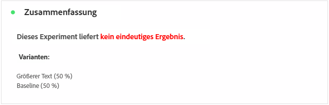
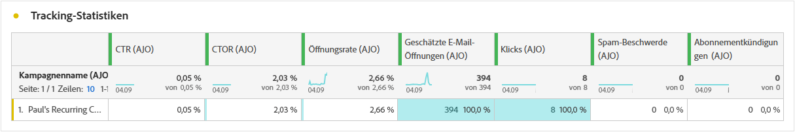
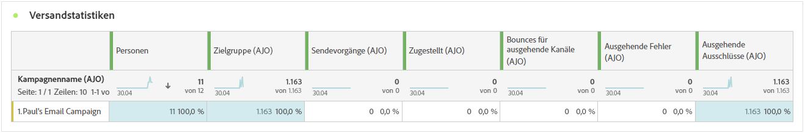
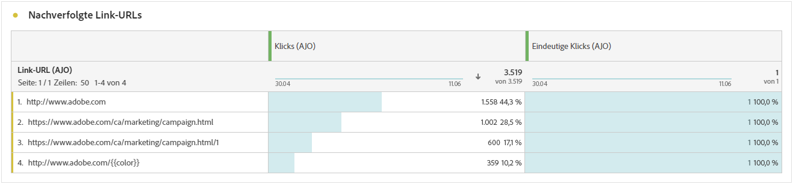
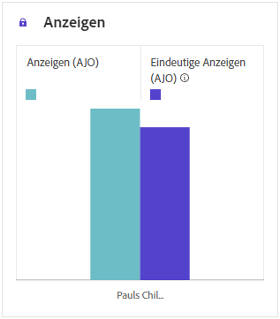

# Kampagnenbericht {#campaign-global-report-cja}

Die **Kampagnenbericht** fungiert als umfassendes Dashboard, das eine detaillierte Analyse der Schlüsselmetriken enthält, die mit Ihrer Kampagne verbunden sind. Er enthält Daten wie Klickzahlen, zugestellte Nachrichten, Profilnummern und durchgeführte Aktionen. Durch einen umfassenden Überblick über die Effektivität und Interaktionsstufen Ihrer Kampagne gewährleistet der Bericht ein umfassendes Verständnis der Gesamtleistung Ihrer Kampagne.

Der Zugriff auf Kampagnenberichte ist direkt über Ihre Kampagne möglich. **[!UICONTROL Berichte]** Schaltfläche.

Die **Kampagnenbericht** -Seite mit den folgenden Tabs angezeigt, je nach ausgewähltem Kanal:

* [Campaign](#campaign-global)
* [Experimentieren](#experimentation)
* [E-Mail](#email-global)
* [SMS](#sms)
* [Push-Benachrichtigung](#push-notification)
* [Briefpost](#direct-mail)
* [Web](#web)

Weitere Informationen zum Customer Journey Analytics Workspace und zum Filtern und Analysieren von Daten finden Sie unter [diese Seite](https://experienceleague.adobe.com/en/docs/analytics-platform/using/cja-workspace/home).

## Campaign {#campaign-global}

### Kampagnen-KPIs {#campaign-kpis}

Die **[!UICONTROL Kampagne]** Key Performance Indicators (KPIs) dienen als allumfassendes Dashboard und liefern eine Analyse der wichtigsten Metriken, die mit Ihrer Kampagne verbunden sind. Dies umfasst Details wie die Anzahl der Klicks und die Anzahl der zugestellten Nachrichten und bietet einen umfassenden Einblick in die Effektivität und den Grad der Interaktion Ihrer Kampagne.

Die KPIs variieren je nach den in Ihrer Kampagne verwendeten Kanälen.

+++ Weitere Informationen zu Kampagnen-KPI-Metriken

* **[!UICONTROL Durchklickrate]**: Prozentsatz der Benutzer, die mit der Nachricht interagiert haben.

* **[!UICONTROL Klicks]**: Anzahl der Klicks auf einen Inhalt in Ihrer Nachricht.

* **[!UICONTROL Zugestellt]**: Anzahl der erfolgreich gesendeten E-Mails im Verhältnis zur Gesamtzahl der gesendeten Nachrichten.

* **[!UICONTROL Anzeigen]**: Gibt an, wie oft die Nachricht geöffnet wurde.

+++

### Kampagnen-Überblick {#delivery-global}

Die **[!UICONTROL Übersicht über Campaign]** -Tabelle dient als umfassendes Dashboard, das eine detaillierte Aufschlüsselung der Schlüsselmetriken für Ihre Kampagne bietet. Dazu gehören wichtige Informationen wie die Anzahl der Profile und die durchgeführten Aktionen, die einen umfassenden Einblick in die Leistung und das Engagement Ihrer Kampagne ermöglichen.

Beachten Sie, dass die Metriken je nach den in Ihrer Kampagne verwendeten Kanälen variieren.

+++ Weitere Informationen zu Übersichtsmetriken für Campaign

* **[!UICONTROL Personen]**: Anzahl der Benutzerprofile, die als Zielprofile für Ihre Nachrichten gelten.

* **[!UICONTROL Durchklickrate]**: Prozentsatz der Benutzer, die mit der Nachricht interagiert haben.

* **[!UICONTROL Klicks]**: Anzahl der Klicks auf einen Inhalt in Ihrer Nachricht.

* **[!UICONTROL Einzelklicks]**: Anzahl der Profile, die auf einen Inhalt in Ihrer Nachricht geklickt haben.

* **[!UICONTROL Zugestellt]**: Anzahl der erfolgreich gesendeten E-Mails im Verhältnis zur Gesamtzahl der gesendeten Nachrichten.

* **[!UICONTROL Bounces für ausgehende Kanäle]**: Gesamtzahl der im Versand- und automatischen Bounce-Verarbeitung kumulierten Fehler in Bezug auf die Gesamtzahl der gesendeten Nachrichten.

* **[!UICONTROL Ausgehende Fehler]**: Gesamtzahl der Fehler, die während des Versandvorgangs aufgetreten sind und die Versendung an Profile verhindert haben.

* **[!UICONTROL Ausgehende Ausschlüsse]**: Anzahl der von Adobe Journey Optimizer ausgeschlossenen Profile.

* **[!UICONTROL Anzeigen]**: Gibt an, wie oft die Nachricht geöffnet wurde.

* **[!UICONTROL Einzelanzeigen]**: Anzahl der Öffnungen der Nachricht, mehrere Interaktionen eines Profils werden nicht berücksichtigt.

+++

### Trichter-Ergebnisse für Kampagnen {#campaign-funnel}

Die **[!UICONTROL Kampagnen-Trichter-Ergebnisse]** Das Diagramm zeigt eine detaillierte Analyse der Interaktion Ihrer Profile mit Ihren Nachrichten und bietet wertvolle Einblicke in die Interaktion verschiedener Profile mit Ihrem Inhalt.

+++ Erfahren Sie mehr über die Metriken der Kampagnentrichter-Ergebnisse

* **[!UICONTROL Zugestellt]**: Anzahl der erfolgreich gesendeten E-Mails im Verhältnis zur Gesamtzahl der gesendeten Nachrichten.

* **[!UICONTROL Klicks]**: Anzahl der Klicks auf einen Inhalt in Ihrer Nachricht.
+++

### Titel des verfolgten Links {#campaign-track}

Die **[!UICONTROL Titel des verfolgten Links]** -Tabelle bietet wichtige Einblicke in die Interaktion Ihrer Besucher mit den in Ihren Nachrichten enthaltenen URLs und bietet wertvolle Informationen darüber, welche Links die meisten Interaktionen hervorrufen.

+++ Weitere Informationen zu den Metriken für die Titel von verfolgten Links

* **[!UICONTROL Einzelklicks]**: Anzahl der Profile, die auf einen Inhalt in Ihrer Nachricht geklickt haben.

* **[!UICONTROL Klicks]**: Anzahl der Klicks auf einen Inhalt in Ihrer Nachricht.

+++

## Experimentieren {#experimentation}

Die Registerkarte **[!UICONTROL Experimentieren]** bietet wichtige Einblicke in die Performance der einzelnen Varianten und ermittelt die erfolgreichste Variante.

Beachten Sie, dass es einige Zeit dauern kann, die beste Leistung zu definieren. Wenn Ihr Experiment nicht erfolgreich ist, wird es auf **Nicht schlüssig**.

### Experiment-KPIs {#experimentation-kpis}

Die **[!UICONTROL Experimentieren]** Key Performance Indicators (KPIs) dienen als allumfassendes Dashboard und liefern eine Analyse der wichtigsten Metriken, die mit Ihrer Experimentierung verknüpft sind.

+++ Erfahren Sie mehr über die KPI-Metriken für Experimente.

* **[!UICONTROL Steigerung]**: Messung der prozentualen Verbesserung der Konversionsrate einer bestimmten Behandlung im Vergleich zum Ausgangswert.

* **[!UICONTROL Konfidenz]**: Belege dafür, dass eine bestimmte Abwandlung mit der Baseline-Abwandlung identisch ist. [Weitere Informationen](../campaigns/experiment-calculations.md#understand-confidence)

+++

### Variante nach eingehenden Klicks {#variant-inbound}

Die **[!UICONTROL Variante nach eingehenden Klicks]** Widget erläutert die Leistung der einzelnen Varianten.
Einen tiefen Einblick in diese Ergebnisse und ihre Interpretation finden Sie auf [dieser Seite](../campaigns/get-started-experiment.md#interpret-results).

+++ Erfahren Sie mehr über die Variante der Metriken nach eingehenden Klicks

* **[!UICONTROL Personen]**: Anzahl der Benutzerprofile, die als Zielprofile für Ihre Nachrichten gelten.

* **[!UICONTROL Eingehende Klicks]**: Gesamtzahl der Klicks über ausgehende Kanäle.

* **[!UICONTROL Konversionsrate]**: Gesamtwert der Erfolgsmetrik, die zuvor beim Erstellen Ihrer Experimente ausgewählt wurde, dividiert durch die Anzahl der Profile.

* **[!UICONTROL Steigerung]**: Messung der prozentualen Verbesserung der Konversionsrate einer bestimmten Behandlung im Vergleich zum Ausgangswert.

* **[!UICONTROL Konfidenz]**: Belege dafür, dass eine bestimmte Abwandlung mit der Baseline-Abwandlung identisch ist. [Weitere Informationen](../campaigns/experiment-calculations.md#understand-confidence)

<!--
* **[!UICONTROL Confidence Upper bound]**:
* **[!UICONTROL Confidence Lower bound]**:
-->
+++

### Konversionsrate der eingehenden Klicks {#conversion-rate}

Der Graph **[!UICONTROL Konfidenzintervall]** misst die Unsicherheit im Zusammenhang mit Verbesserungen. Er beschreibt den prozentualen Performance-Unterschied zwischen der Baseline und der Abwandlung mit der besten Performance. [Weitere Informationen](../campaigns/experiment-calculations.md#confidence-intervals).

## E-Mail {#email-global}

### Zugestellt vs. Klick-Trend {#delivered-click}

Die **[!UICONTROL Zugestellt vs. Klick-Trend]** Das Diagramm zeigt eine detaillierte Analyse der Interaktion Ihrer Profile mit Ihren E-Mails und bietet wertvolle Einblicke in die Interaktion der Profile mit Ihrem Inhalt.

+++ Weitere Informationen zu den Metriken Zugestellt vs. Klick-Trend

* **[!UICONTROL Zugestellt]**: Anzahl der erfolgreich gesendeten E-Mails im Verhältnis zur Gesamtzahl der gesendeten E-Mails.

* **[!UICONTROL Klicks]**: Anzahl der Klicks auf einen Inhalt in Ihren E-Mails.

+++

### Versandstatus {#delivery-status}

Die **[!UICONTROL Versandstatus]** -Diagramm bietet einen umfassenden Überblick über Daten zu gesendeten E-Mails in Ihrer Kampagne und bietet Einblicke in wichtige Metriken wie zugestellt und Bounces. Dies ermöglicht eine detaillierte Analyse des E-Mail-Versandprozesses und liefert wertvolle Informationen über die Effizienz und Leistung Ihrer Kampagnen.

+++ Weitere Informationen zu Versandstatus-Metriken

* **[!UICONTROL Zugestellt]**: Anzahl der erfolgreich gesendeten E-Mails im Verhältnis zur Gesamtzahl der gesendeten E-Mails.

* **[!UICONTROL Bounces für ausgehende Kanäle]**: Gesamtzahl der im Versandprozess kumulierten Fehler und der automatischen Bounce-Verarbeitung in Bezug auf die Gesamtzahl der gesendeten Nachrichten.

* **[!UICONTROL Ausgehende Fehler]**: Gesamtzahl der Fehler, die während des Versandvorgangs aufgetreten sind und die Versendung an Profile verhindert haben.

* **[!UICONTROL Ausgehende Ausschlüsse]**: Anzahl der von Adobe Journey Optimizer ausgeschlossenen Profile.

+++

### Versandstatistiken {#sending-statistics-email}

Die **[!UICONTROL Versandstatistiken]** bietet eine umfassende Zusammenfassung der wichtigsten Daten zu E-Mails in Ihren Kampagnen. Sie enthält wichtige Metriken wie die Interaktionen mit Ihren E-Mails und die Anzahl der erfolgreich zugestellten E-Mails und bietet wertvolle Einblicke in die Effektivität und Reichweite Ihrer E-Mails und Kampagnen.

+++ Weitere Informationen zu Versandstatistiken-Metriken

* **[!UICONTROL Personen]**: Anzahl der Benutzerprofile, die als Zielprofile für Ihre Nachrichten gelten.

* **[!UICONTROL Zielgruppe]**: Gesamtzahl der während des Sendevorgangs verarbeiteten E-Mails.

* **[!UICONTROL Sendungen]**: Gesamtzahl der gesendeten E-Mails.

* **[!UICONTROL Zugestellt]**: Anzahl der erfolgreich gesendeten E-Mails im Verhältnis zur Gesamtzahl der gesendeten Nachrichten.

* **[!UICONTROL Bounces für ausgehende Kanäle]**: Gesamtzahl der während des Versandvorgangs kumulierten Fehler und der automatischen Bounce-Verarbeitung in Bezug auf die Gesamtzahl der gesendeten Nachrichten.

* **[!UICONTROL Ausgehende Fehler]**: Gesamtzahl der Fehler, die während des Versandvorgangs aufgetreten sind und die Versendung an Profile verhindert haben.

* **[!UICONTROL Ausgehende Ausschlüsse]**: Anzahl der von Adobe Journey Optimizer ausgeschlossenen Profile.

+++

### Tracking-Statistiken {#tracking-statistics-email}

Die **[!UICONTROL E-Mail - Trackingstatistiken]** bietet eine detaillierte Übersicht über die Profilaktivität in Bezug auf E-Mails, die in Ihrer Kampagne enthalten sind. Dazu gehören Metriken zu Öffnungen, Klicks und andere relevante Interaktionsindikatoren, die einen umfassenden Überblick darüber bieten, wie Profile mit Ihrem E-Mail-Inhalt interagieren.

+++ Weitere Informationen zu Trackingstatistiken - Metriken

* **[!UICONTROL Durchklickrate (CTR)]**: Prozentsatz der Benutzer, die mit der E-Mail interagiert haben.

* **[!UICONTROL Durchklicken der Öffnungsrate (CTOR)]**: Gibt an, wie oft die E-Mail geöffnet wurde.

* **[!UICONTROL Klicks]**: Anzahl der Klicks auf einen Inhalt in Ihren E-Mails.

* **[!UICONTROL Einzelklicks]**: Die Anzahl der Profile, die auf einen Inhalt in einer E-Mail geklickt haben.

* **[!UICONTROL E-Mail wird geöffnet]**: Gibt an, wie oft Ihre E-Mails in einer Kampagne geöffnet wurden.

* **[!UICONTROL Einzelöffnungen einer E-Mail]**: Prozentsatz der geöffneten E-Mails.

* **[!UICONTROL Beschwerden wegen Spam]**: Gibt an, wie oft eine Nachricht als Spam oder Junk gekennzeichnet wurde.

* **[!UICONTROL Abmeldungen]**: Anzahl der Klicks auf den Abmelde-Link.

+++

### E-Mail-Domains {#email-domains}

Die **[!UICONTROL E-Mail-Domänen]** bietet eine detaillierte Aufschlüsselung der E-Mails nach Domain, die umfassende Einblicke in die Leistungsmetriken Ihrer E-Mail-Kampagnen bietet. Diese umfassende Analyse ermöglicht Ihnen, das Verhalten verschiedener Domänen als Reaktion auf Ihren E-Mail-Inhalt zu verstehen.

+++ Weitere Informationen zu E-Mail-Domainmetriken

* **[!UICONTROL Sendungen]**: Gesamtzahl der gesendeten E-Mails.

* **[!UICONTROL Zugestellt]**: Anzahl der erfolgreich gesendeten E-Mails im Verhältnis zur Gesamtzahl der gesendeten E-Mails.

* **[!UICONTROL E-Mail wird geöffnet]**: Gibt an, wie oft Ihre E-Mails in einer Kampagne geöffnet wurden.

* **[!UICONTROL Klicks]**: Anzahl der Klicks auf einen Inhalt in Ihren E-Mails.

* **[!UICONTROL Bounces für ausgehende Kanäle]**: Gesamtzahl der Fehler, die während des Versandvorgangs kumuliert wurden, und der automatischen Bounce-Verarbeitung in Bezug auf die Gesamtzahl der gesendeten E-Mails.

* **[!UICONTROL Ausgehende Fehler]**: Gesamtzahl der Fehler, die während des Versandvorgangs aufgetreten sind und die Versendung an Profile verhindert haben.
+++

### Labels getrackter Links {#track-link-label}

Die **[!UICONTROL Getrackte Linkbeschriftungen]** bietet einen umfassenden Überblick über die Linkbeschriftungen in Ihren E-Mails, in denen diejenigen hervorgehoben werden, die den höchsten Besuchertraffic generieren. Mit dieser Funktion können Sie die beliebtesten Links identifizieren und priorisieren.

+++ Erfahren Sie mehr über die Metriken zu Getrackten Linkbeschriftungen

* **[!UICONTROL Einzelklicks]**: Die Anzahl der Profile, die auf einen Inhalt in einer E-Mail geklickt haben.

* **[!UICONTROL Klicks]**: Anzahl der Klicks auf einen Inhalt in Ihren E-Mails.

+++

### Getrackte Link-URLs {#track-link-url}

Die **[!UICONTROL Getrackte Link-URLs]** bietet einen umfassenden Überblick über die URLs in Ihrer E-Mail, die den höchsten Besuchertraffic aufweisen. Auf diese Weise können Sie die beliebtesten Links identifizieren und priorisieren und Ihr Verständnis der Profilinteraktion mit bestimmten Inhalten in Ihren E-Mails verbessern.

+++ Weitere Informationen zu den Metriken für getrackte Link-URLs

* **[!UICONTROL Einzelklicks]**: Die Anzahl der Profile, die auf einen Inhalt in einer E-Mail geklickt haben.

* **[!UICONTROL Klicks]**: Anzahl der Klicks auf einen Inhalt in Ihren E-Mails.

* **[!UICONTROL Anzeigen]**: Gibt an, wie oft die E-Mail geöffnet wurde.

* **[!UICONTROL Einzelanzeigen]**: Anzahl der Öffnungen der E-Mail, mehrere Interaktionen eines Profils werden nicht berücksichtigt.

+++

### E-Mail-Betreffe {#email-subjects}

Die **[!UICONTROL E-Mail-Betreff]** -Tabelle bietet einen umfassenden Überblick über E-Mail-Themen, die den höchsten Besucher-Traffic erzielt haben. Diese Ressource bietet wertvolle Einblicke in die Interaktionsdynamik von Zielgruppen.

+++ Weitere Informationen zu Metriken zu E-Mail-Themen

* **[!UICONTROL Personen]**: Anzahl der Benutzerprofile, die als Zielprofile für Ihre E-Mails gelten.

+++

### Ausschlussgründe {#excluded-reasons}

Die **[!UICONTROL Ausgeschlossene Gründe]** -Tabelle zeigt eine umfassende Übersicht der verschiedenen Faktoren, die dazu geführt haben, dass Benutzerprofile aus der Zielgruppe ausgeschlossen wurden, sodass die Nachricht nicht empfangen wurde.

Auf [dieser Seite](exclusion-list.md) finden Sie die umfassende Liste der Ausschlussgründe.

### Bounce-Gründe {#bounce-reasons-email}

Die **[!UICONTROL Bounce-Gründe]** -Tabelle werden die verfügbaren Daten zu Bounce Messages kompiliert und bietet detaillierte Einblicke in die spezifischen Gründe für E-Mail-Bounces.

Weitere Informationen zu Bounces finden Sie auf der Seite [ Unterdrückungslisten](../reports/suppression-list.md).

### Fehlergründe {#error-reasons-email}

Die **[!UICONTROL Fehlerursachen]** bietet Einblick in die spezifischen Fehler, die während des Versandvorgangs aufgetreten sind. Diese Tabelle bietet wertvolle Informationen über Art und Auftreten von Fehlern.

## SMS {#sms}

### Zugestellt vs. Klick-Trend {#delivered-click-sms}

Die **[!UICONTROL Zugestellt vs. Klick-Trend]** Das Diagramm zeigt eine detaillierte Analyse der Interaktion Ihrer Profile mit Ihren E-Mails und bietet wertvolle Einblicke in die Interaktion der Profile mit Ihrem Inhalt.

+++ Weitere Informationen zu den Metriken Zugestellt vs. Klick-Trend

* **[!UICONTROL Zugestellt]**: Anzahl der erfolgreich gesendeten SMS in Bezug auf die Gesamtzahl der SMS-Nachrichten.

* **[!UICONTROL Klicks]**: Anzahl der Klicks auf einen Inhalt in Ihren SMS-Nachrichten.

+++

### Versandstatus {#delivery-status-sms}

Die **[!UICONTROL Versandstatus]** bietet einen detaillierten Überblick über die Profilaktivität im Zusammenhang mit Ihren SMS-Kampagnen. Dazu gehören Metriken zu zugestellten Nachrichten, Klicks und andere relevante Interaktionsindikatoren, die einen umfassenden Überblick darüber bieten, wie Profile mit Ihrem SMS-Inhalt interagieren.

+++ Weitere Informationen zu Versandstatus-Metriken

* **[!UICONTROL Zugestellt]**: Anzahl der erfolgreich gesendeten SMS in Bezug auf die Gesamtzahl der SMS-Nachrichten.

* **[!UICONTROL Bounces für ausgehende Kanäle]**: Gesamtzahl der im Versand- und automatischen Bounce-Prozesse kumulierten Fehler in Bezug auf die Gesamtzahl der gesendeten SMS-Nachrichten.

* **[!UICONTROL Ausgehende Fehler]**: Gesamtzahl der aufgetretenen Fehler, die den Versand an Profile verhinderten.

* **[!UICONTROL Ausgehende Ausschlüsse]**: Anzahl der von Adobe Journey Optimizer ausgeschlossenen Profile.

+++

### Labels getrackter Links {#track-link-label-sms}

Die **[!UICONTROL Getrackte Linkbeschriftungen]** bietet einen umfassenden Überblick über die Linkbeschriftungen in Ihren SMS-Nachrichten, in denen diejenigen hervorgehoben werden, die den höchsten Besuchertraffic erzeugen. Mit dieser Funktion können Sie die beliebtesten Links identifizieren und priorisieren.

+++ Erfahren Sie mehr über die Metriken zu Getrackten Linkbeschriftungen

* **[!UICONTROL Einzelklicks]**: Anzahl der Profile, die auf einen Inhalt in Ihrer SMS geklickt haben.

* **[!UICONTROL Klicks]**: Anzahl der Klicks auf einen Inhalt in Ihren SMS-Nachrichten.

+++

### Getrackte Link-URLs {#track-link-url-sms}

Die **[!UICONTROL Getrackte Link-URLs]** bietet einen umfassenden Überblick über die URLs in Ihren SMS-Nachrichten, die den höchsten Besuchertraffic aufweisen. Auf diese Weise können Sie die beliebtesten Links identifizieren und priorisieren und so Ihr Verständnis der Profilinteraktion mit bestimmten Inhalten in Ihren SMS-Nachrichten verbessern.

+++ Weitere Informationen zu den Metriken für getrackte Link-URLs

* **[!UICONTROL Einzelklicks]**: Anzahl der Profile, die auf einen Inhalt in Ihrer SMS geklickt haben.

* **[!UICONTROL Klicks]**: Anzahl der Klicks auf einen Inhalt in Ihren SMS-Nachrichten.

* **[!UICONTROL Anzeigen]**: Gibt an, wie oft die Nachricht geöffnet wurde.

* **[!UICONTROL Einzelanzeigen]**: Anzahl der Öffnungen der Nachricht, mehrere Interaktionen eines Profils werden nicht berücksichtigt.

+++

### Eingehende SMS-Nachricht {#sms-inbound}

Die **[!UICONTROL SMS-Empfang]** bietet einen umfassenden Überblick darüber, welche SMS-Nachrichten den meisten Besucher-Traffic erfahren haben. Diese Ressource bietet wertvolle Einblicke in die Interaktionsdynamik von Zielgruppen.

+++ Weitere Informationen zu den Metriken von SMS-eingehenden Nachrichten

* **[!UICONTROL Personen]**: Anzahl der Benutzerprofile, die als Zielprofile für Ihre SMS-Nachrichten gelten.

+++

### SMS-Nachrichtentyp {#sms-message-type}

Die **[!UICONTROL SMS-Nachrichtentyp]** bietet einen umfassenden Überblick darüber, welcher SMS-Nachrichtentyp den höchsten Besuchertraffic aufweist. Diese Ressource bietet wertvolle Einblicke in die Interaktionsdynamik von Zielgruppen.

+++ Weitere Informationen zu Metriken zum SMS-Nachrichtentyp

* **[!UICONTROL Personen]**: Anzahl der Benutzerprofile, die als Zielprofile für Ihre SMS-Nachrichten gelten.

+++

### SMS-Anbieter {#sms-providers}

Die **[!UICONTROL SMS-Provider]** -Tabelle bietet einen umfassenden Überblick darüber, welche SMS-Anbieter den höchsten Besuchertraffic erzielt haben. Diese Ressource bietet wertvolle Einblicke in die Interaktionsdynamik von Zielgruppen.

+++ Weitere Informationen zu SMS-Anbietermetriken

* **[!UICONTROL Personen]**: Anzahl der Benutzerprofile, die als Zielprofile für Ihre SMS-Nachrichten gelten.

+++

### Bounce-Gründe {#bounce-reasons-sms}

Die **[!UICONTROL Bounces-Gründe]** bietet einen umfassenden Überblick über Daten zu Bounce-SMS-Nachrichten und liefert wertvolle Einblicke in die spezifischen Ursachen von SMS-Bounces.

### Fehlergründe {#error-reasons-sms}

Die **[!UICONTROL Fehlerursachen]** -Tabelle können Sie die spezifischen Fehler identifizieren, die während des Versandvorgangs Ihrer SMS aufgetreten sind. Dies ermöglicht eine gründliche Analyse aller aufgetretenen Probleme.

### Ausschlussgründe {#excluded-reasons-sms}

Die **[!UICONTROL Ausschlussgründe]** zeigt visuell die verschiedenen Faktoren an, die zum Ausschluss von Benutzerprofilen aus der Zielgruppe geführt haben, sodass diese keine SMS-Nachrichten erhalten können.

Auf [dieser Seite](exclusion-list.md) finden Sie eine umfassende Liste der Ausschlussgründe.

## Push-Benachrichtigung {#push-notification}

### Versandstatistiken {#sending-statistics-push}

Die **[!UICONTROL Versandstatistiken]** bietet eine umfassende Zusammenfassung der wichtigsten Daten zu Ihren Push-Benachrichtigungskampagnen. Sie enthält wichtige Metriken wie die Größe der Zielgruppe und die Anzahl der erfolgreich zugestellten Push-Benachrichtigungen und bietet wertvolle Einblicke in die Effektivität und Reichweite Ihrer Push-Benachrichtigung.

+++ Weitere Informationen zu Versandstatistiken-Metriken

* **[!UICONTROL Personen]**: Anzahl der Benutzerprofile, die als Zielprofile für Ihre Push-Benachrichtigungen gelten.

* **[!UICONTROL Zielgruppe]**: Gesamtzahl der während der Analyse verarbeiteten Push-Benachrichtigungen.

* **[!UICONTROL Sendungen]**: Gesamtzahl der gesendeten Push-Benachrichtigungen.

* **[!UICONTROL Zugestellt]**: Anzahl der erfolgreich gesendeten Push-Benachrichtigungen im Verhältnis zur Gesamtzahl der gesendeten Push-Benachrichtigungen

* **[!UICONTROL Bounces für ausgehende Kanäle]**: Gesamtzahl der während des Versandvorgangs kumulierten Fehler und der automatischen Bounce-Verarbeitung in Bezug auf die Gesamtzahl der Push-Benachrichtigungen.

* **[!UICONTROL Ausgehende Fehler]**: Gesamtzahl der aufgetretenen Fehler, die den Versand an Profile verhinderten.

* **[!UICONTROL Ausgehende Ausschlüsse]**: Anzahl der von Adobe Journey Optimizer ausgeschlossenen Profile.

+++

### Tracking-Statistiken {#tracking-statistics-push}

Die **[!UICONTROL Trackingstatistiken]** bietet eine detaillierte Momentaufnahme der Profilaktivität, die mit Ihren Push-Benachrichtigungen verknüpft ist, und bietet wichtige Einblicke in die Interaktion und die Effektivität von Push-Benachrichtigungen.

+++ Weitere Informationen zu Trackingstatistiken - Metriken

* **[!UICONTROL Durchklickrate (CTR)]**: Prozentsatz der Benutzer, die mit den Push-Benachrichtigungen interagiert haben.

* **[!UICONTROL Durchklicken der Öffnungsrate (CTOR)]**: Gibt an, wie oft die Push-Benachrichtigungen geöffnet wurden.

* **[!UICONTROL Klicks]**: Gibt an, wie oft ein Inhalt in Ihren Push-Benachrichtigungen angeklickt wurde.

* **[!UICONTROL Einzelklicks]**: Anzahl der Profile, die auf einen Inhalt in Ihren Push-Benachrichtigungen geklickt haben.

<!--
* **[!UICONTROL Push custom actions]**: 
-->
+++

### Labels getrackter Links {#track-link-label-push}

Die **[!UICONTROL Getrackte Linkbeschriftungen]** -Tabelle bietet einen umfassenden Überblick über die Linkbeschriftungen in Ihren Push-Benachrichtigungen und zeigt diejenigen an, die den höchsten Besucher-Traffic generieren. Mit dieser Funktion können Sie die beliebtesten Links identifizieren und priorisieren.

+++ Erfahren Sie mehr über die Metriken zu Getrackten Linkbeschriftungen

* **[!UICONTROL Einzelklicks]**: Anzahl der Profile, die auf einen Inhalt in Ihren Push-Benachrichtigungen geklickt haben.

* **[!UICONTROL Klicks]**: Gibt an, wie oft ein Inhalt in Ihren Push-Benachrichtigungen angeklickt wurde.

+++

### Getrackte Link-URLs {#track-link-url-push}

Die **[!UICONTROL Getrackte Link-URLs]** bietet einen umfassenden Überblick über die URLs in Ihren Push-Benachrichtigungen, die den höchsten Besucher-Traffic anziehen. Auf diese Weise können Sie die beliebtesten Links identifizieren und priorisieren und so Ihr Verständnis der Profilinteraktion mit bestimmten Inhalten in Ihren Push-Benachrichtigungen verbessern.

+++ Weitere Informationen zu den Metriken für getrackte Link-URLs

* **[!UICONTROL Einzelklicks]**: Anzahl der Profile, die auf einen Inhalt in Ihren Push-Benachrichtigungen geklickt haben.

* **[!UICONTROL Klicks]**: Gibt an, wie oft ein Inhalt in Ihren Push-Benachrichtigungen angeklickt wurde.

+++

### Bounce-Gründe {#bounce-reasons-push}

Die **[!UICONTROL Bounces-Gründe]** -Tabelle bietet einen umfassenden Überblick über Daten zu Bounce-Push-Benachrichtigungen und liefert wertvolle Einblicke in die spezifischen Ursachen für Bounces bei Push-Benachrichtigungen.

### Fehlergründe {#error-reasons-push}

Die **[!UICONTROL Fehlerursachen]** -Tabelle können Sie die spezifischen Fehler identifizieren, die während des Versandvorgangs Ihrer Push-Benachrichtigungen aufgetreten sind. Dies ermöglicht eine gründliche Analyse aller aufgetretenen Probleme.

### Ausschlussgründe {#exclude-reasons-push}

Die **[!UICONTROL Ausschlussgründe]** zeigt visuell die verschiedenen Faktoren an, die zum Ausschluss von Benutzerprofilen aus der Zielgruppe geführt haben, sodass diese keine Push-Benachrichtigungen erhalten können.

Auf [dieser Seite](exclusion-list.md) finden Sie eine umfassende Liste der Ausschlussgründe.

## In-App {#in-app}

### Impressions- und Klicktrend {#impression-click-trend}

Die **[!UICONTROL Impressions- und Klicktrend]** Das Diagramm zeigt eine detaillierte Analyse der Interaktion Ihrer Profile mit Ihren In-App-Nachrichten und bietet wertvolle Einblicke in die Interaktion von Profilen mit Ihren Inhalten.

+++ Weitere Informationen zu Impressions- und Klicktrendmetriken

* **[!UICONTROL Klicks]**: Gibt an, wie oft in Ihren In-App-Nachrichten auf einen Inhalt geklickt wurde.

* **[!UICONTROL Anzeigen]**: Gibt an, wie oft die Nachricht geöffnet wurde.

+++

### Klicks {#clicks-inapp}

Die **[!UICONTROL Klicks]** Das Diagramm zeigt In-App-Klickmetriken an, die sowohl die Gesamtanzahl der Inhaltsklicks als auch die Anzahl der eindeutigen Profile, die auf den Inhalt geklickt haben, darstellen.

+++ Weitere Informationen zu Klickmetriken

* **[!UICONTROL Einzelklicks]**: Anzahl der Profile, die auf einen Inhalt in Ihren In-App-Nachrichten geklickt haben

* **[!UICONTROL Klicks]**: Gibt an, wie oft in Ihren In-App-Nachrichten auf einen Inhalt geklickt wurde.

+++

### Anzeige {#display-inapp}

Die **[!UICONTROL Anzeigen]** Anhand des Diagramms können Sie sowohl die GesamtReichweite der Nachricht als auch die Anzahl der eindeutigen Profile, die mit der Nachricht interagieren, nachvollziehen.

+++ Weitere Informationen zu Anzeigemetriken

* **[!UICONTROL Anzeigen]**: Gibt an, wie oft die Nachricht geöffnet wurde.

* **[!UICONTROL Einzelanzeigen]**: Anzahl der Öffnungen der Nachricht, mehrere Interaktionen eines Profils werden nicht berücksichtigt.

+++

### Tracking-Daten {#tracking-data-inapp}

Die **[!UICONTROL Tracking-Daten]** -Tabelle bietet eine detaillierte Momentaufnahme der Profilaktivität, die mit Ihren In-App-Nachrichten verknüpft ist, und bietet wichtige Einblicke in die Interaktion und die Effektivität von In-App-Nachrichten.

+++ Weitere Informationen zum Verfolgen von Datenmetriken

* **[!UICONTROL Personen]**: Anzahl der Benutzerprofile, die als Zielprofile für Ihre In-App-Nachrichten gelten.

* **[!UICONTROL Durchklickrate (CTR)]**: Prozentsatz der Benutzer, die mit In-App-Nachrichten interagiert haben.

* **[!UICONTROL Durchklicken der Öffnungsrate (CTOR)]**: Gibt an, wie oft In-App-Nachrichten geöffnet wurden.

* **[!UICONTROL Klicks]**: Gibt an, wie oft in Ihren In-App-Nachrichten auf einen Inhalt geklickt wurde.

* **[!UICONTROL Einzelklicks]**: Anzahl der Profile, die auf einen Inhalt in Ihren In-App-Nachrichten geklickt haben.

* **[!UICONTROL Anzeigen]**: Gibt an, wie oft die Nachricht geöffnet wurde.

* **[!UICONTROL Einzelanzeigen]**: Anzahl der Öffnungen der Nachricht, mehrere Interaktionen eines Profils werden nicht berücksichtigt.

* **[!UICONTROL Sendungen]**: Gesamtzahl der gesendeten In-App-Nachrichten.

<!--
* **[!UICONTROL Inbound triggered]**: 

* **[!UICONTROL Inbound dismisses]**: 
-->
+++

### Labels getrackter Links {#track-link-label-inapp}

Die **[!UICONTROL Getrackte Linkbeschriftungen]** -Tabelle bietet einen umfassenden Überblick über die Linkbeschriftungen in Ihren In-App-Nachrichten und zeigt diejenigen, die den höchsten Besucher-Traffic generieren. Mit dieser Funktion können Sie die beliebtesten Links identifizieren und priorisieren.

+++ Erfahren Sie mehr über die Metriken zu Getrackten Linkbeschriftungen

* **[!UICONTROL Einzelklicks]**: Anzahl der Profile, die auf einen Inhalt in Ihren In-App-Nachrichten geklickt haben.

* **[!UICONTROL Klicks]**: Gibt an, wie oft in Ihren In-App-Nachrichten auf einen Inhalt geklickt wurde.

* **[!UICONTROL Anzeigen]**: Gibt an, wie oft die Nachricht geöffnet wurde.

* **[!UICONTROL Einzelanzeigen]**: Anzahl der Öffnungen der Nachricht, mehrere Interaktionen eines Profils werden nicht berücksichtigt.

+++

### Getrackte Link-URLs {#track-link-url-inapp}

Die **[!UICONTROL Getrackte Link-URLs]** bietet einen umfassenden Überblick über die URLs in Ihren In-App-Nachrichten, die den höchsten Besucher-Traffic anziehen. Auf diese Weise können Sie die beliebtesten Links identifizieren und priorisieren und so Ihr Verständnis der Profilinteraktion mit bestimmten Inhalten in Ihren In-App-Nachrichten verbessern.

+++ Weitere Informationen zu den Metriken für getrackte Link-URLs

* **[!UICONTROL Einzelklicks]**: Anzahl der Profile, die auf einen Inhalt in Ihren In-App-Nachrichten geklickt haben.

* **[!UICONTROL Klicks]**: Gibt an, wie oft in Ihren In-App-Nachrichten auf einen Inhalt geklickt wurde.

+++

## Briefpost {#direct-mail}

### Versandstatistiken {#sending-statistics-directmail}

Die **[!UICONTROL Versandstatistiken]** bietet eine umfassende Zusammenfassung der wichtigsten Daten zu Ihren Briefpost-Kampagnen. Sie enthält wichtige Metriken wie die Größe der Zielgruppe und die Anzahl der erfolgreich zugestellten Briefpost. So erhalten Sie wertvolle Einblicke in die Effektivität und Reichweite Ihrer Briefpost-Nachrichten.

+++ Weitere Informationen zu Versandstatistiken-Metriken

* **[!UICONTROL Personen]**: Anzahl der Benutzerprofile, die als Zielprofile für Ihre Nachrichten gelten.

* **[!UICONTROL Targeting]**: Gesamtzahl der während des Versandvorgangs verarbeiteten Briefpost-Nachrichten.

* **[!UICONTROL Sendungen]**: Gesamtzahl der gesendeten Briefpost-Nachrichten.

* **[!UICONTROL Zugestellt]**: Anzahl der erfolgreich gesendeten Briefpost-Nachrichten in Bezug auf die Gesamtzahl der gesendeten Nachrichten.

* **[!UICONTROL Ausgehende Fehler]**: Gesamtzahl der Fehler, die während des Versandvorgangs aufgetreten sind und die Versendung an Profile verhindert haben.

* **[!UICONTROL Ausgehende Ausschlüsse]**: Anzahl der von Adobe Journey Optimizer ausgeschlossenen Profile.

+++

### Versandstatus {#delivery-status-directmail}

Die **[!UICONTROL Versandstatus]** -Diagramm bietet einen umfassenden Überblick über Daten zu gesendeten Briefpost-Nachrichten in Ihrer Kampagne und bietet Einblicke in wichtige Metriken wie Zugestellt und Fehler. Dies ermöglicht eine detaillierte Analyse des Versandprozesses von Briefpost-Nachrichten und liefert wertvolle Informationen über die Effizienz und Leistung Ihrer Kampagnen.

+++ Weitere Informationen zu Versandstatus-Metriken

* **[!UICONTROL Zugestellt]**: Anzahl der erfolgreich gesendeten Briefpost-Nachrichten in Bezug auf die Gesamtzahl der gesendeten Briefpost-Nachrichten.

* **[!UICONTROL Ausgehende Fehler]**: Gesamtzahl der Fehler, die während eines Versandvorgangs aufgetreten sind und die Senden Ihrer Briefpost-Nachrichten an Profile verhinderten.

* **[!UICONTROL Ungebundene Ausschlüsse]**: Anzahl der von Adobe Journey Optimizer ausgeschlossenen Profile.

+++

### Fehlergründe {#error-reasons-directmail}

Die **[!UICONTROL Fehlerursachen]** -Tabelle können Sie die spezifischen Fehler identifizieren, die während des Versandvorgangs Ihrer Briefpost-Nachrichten aufgetreten sind. Dies ermöglicht eine gründliche Analyse aller aufgetretenen Probleme.

### Ausschlussgründe {#exclude-reasons-directmail}

Die **[!UICONTROL Ausschlussgründe]** zeigt visuell die verschiedenen Faktoren an, die zum Ausschluss von Benutzerprofilen aus der Zielgruppe geführt haben, sodass diese keine Briefpost-Nachrichten erhalten können.

Auf [dieser Seite](exclusion-list.md) finden Sie eine umfassende Liste der Ausschlussgründe.

## Web {#web}

### Impressions- und Klicktrend {#impressions-web}

Die **[!UICONTROL Impressions- und Klicktrend]** Das Diagramm zeigt eine detaillierte Analyse der Interaktion Ihrer Profile mit Ihren Webseiten und bietet wertvolle Einblicke in die Interaktion der Profile mit Ihrem Inhalt.

+++ Weitere Informationen zu Impressions- und Klicktrendmetriken

* **[!UICONTROL Klicks]**: Anzahl der Klicks auf einen Inhalt auf Ihren Webseiten.

* **[!UICONTROL Anzeigen]**: Gibt an, wie oft die Nachricht geöffnet wurde.

+++

### Klicks {#clicks-web}

Die **[!UICONTROL Klicks]** -Diagramm zeigt Metriken zu Webseitenklick an, die sowohl die Gesamtanzahl der Inhaltsklicks als auch die Anzahl der eindeutigen Profile, die auf den Inhalt geklickt haben, darstellen.

+++ Weitere Informationen zu Klickmetriken

* **[!UICONTROL Einzelklicks]**: Anzahl der Profile, die auf einen Inhalt auf Ihren Webseiten geklickt haben.

* **[!UICONTROL Klicks]**: Anzahl der Klicks auf einen Inhalt auf Ihren Webseiten.

+++

### Anzeigen {#displays-web}

Die **[!UICONTROL Anzeigen]** Anhand des Diagramms können Sie sowohl die GesamtReichweite der Nachricht als auch die Anzahl der eindeutigen Profile, die mit der Nachricht interagieren, nachvollziehen.

+++ Weitere Informationen zu Anzeigemetriken

* **[!UICONTROL Anzeigen]**: Gibt an, wie oft die Nachricht geöffnet wurde.

* **[!UICONTROL Einzelanzeigen]**: Anzahl der Öffnungen der Nachricht, mehrere Interaktionen eines Profils werden nicht berücksichtigt.

+++

### Tracking-Daten {#track-data-web}

Die **[!UICONTROL Tracking-Daten]** bietet eine detaillierte Momentaufnahme der Profilaktivität, die mit Ihren Webseiten verknüpft ist, und bietet wichtige Einblicke in die Interaktion und die Effektivität von Webseiten.

+++ Weitere Informationen zum Verfolgen von Datenmetriken

* **[!UICONTROL Personen]**: Anzahl der Benutzerprofile, die als Zielprofile für Ihre Webseiten gelten.

* **[!UICONTROL Durchklickrate (CTR)]**: Prozentsatz der Benutzer, die mit den Webseiten interagiert haben.

* **[!UICONTROL Klicks]**: Anzahl der Klicks auf einen Inhalt auf Ihren Webseiten.

* **[!UICONTROL Einzelklicks]**: Anzahl der Profile, die auf einen Inhalt auf Ihren Webseiten geklickt haben.

* **[!UICONTROL Anzeigen]**: Gibt an, wie oft die Webseite geöffnet wurde.

* **[!UICONTROL Einzelanzeigen]**: Anzahl der Öffnungen der Webseite, mehrere Interaktionen eines Profils werden nicht berücksichtigt.

+++

### Labels getrackter Links {#track-link-web}

Die **[!UICONTROL Getrackte Linkbeschriftungen]** -Tabelle bietet einen umfassenden Überblick über die Linkbeschriftungen auf Ihren Webseiten, in denen diejenigen hervorgehoben werden, die den höchsten Besucher-Traffic generieren. Mit dieser Funktion können Sie die beliebtesten Links identifizieren und priorisieren.

+++ Erfahren Sie mehr über die Metriken zu Getrackten Linkbeschriftungen

* **[!UICONTROL Einzelklicks]**: Anzahl der Profile, die auf einen Inhalt auf Ihren Webseiten geklickt haben.

* **[!UICONTROL Klicks]**: Anzahl der Klicks auf einen Inhalt auf Ihren Webseiten.

* **[!UICONTROL Anzeigen]**: Gibt an, wie oft die Nachricht geöffnet wurde.

* **[!UICONTROL Einzelanzeigen]**: Anzahl der Öffnungen der Nachricht, mehrere Interaktionen eines Profils werden nicht berücksichtigt.

+++

### Getrackte Link-URLs {#track-url-web}

Die **[!UICONTROL Getrackte Link-URLs]** bietet einen umfassenden Überblick über die URLs auf Ihren Webseiten, die den höchsten Besuchertraffic erzielen. Auf diese Weise können Sie die beliebtesten Links identifizieren und priorisieren und so Ihr Verständnis der Profilinteraktion mit bestimmten Inhalten auf Ihren Webseiten erweitern.

+++ Weitere Informationen zu den Metriken für getrackte Link-URLs

* **[!UICONTROL Einzelklicks]**: Anzahl der Profile, die auf einen Inhalt auf Ihren Webseiten geklickt haben.

* **[!UICONTROL Klicks]**: Anzahl der Klicks auf einen Inhalt auf Ihren Webseiten.

* **[!UICONTROL Anzeigen]**: Gibt an, wie oft die Nachricht geöffnet wurde.

* **[!UICONTROL Einzelanzeigen]**: Anzahl der Öffnungen der Nachricht, mehrere Interaktionen eines Profils werden nicht berücksichtigt.

+++

