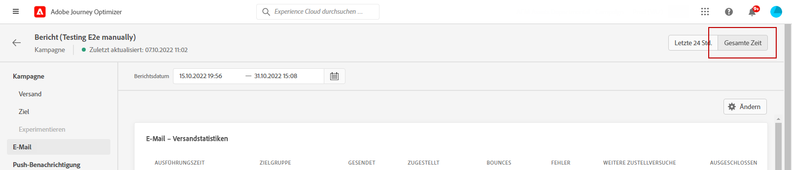
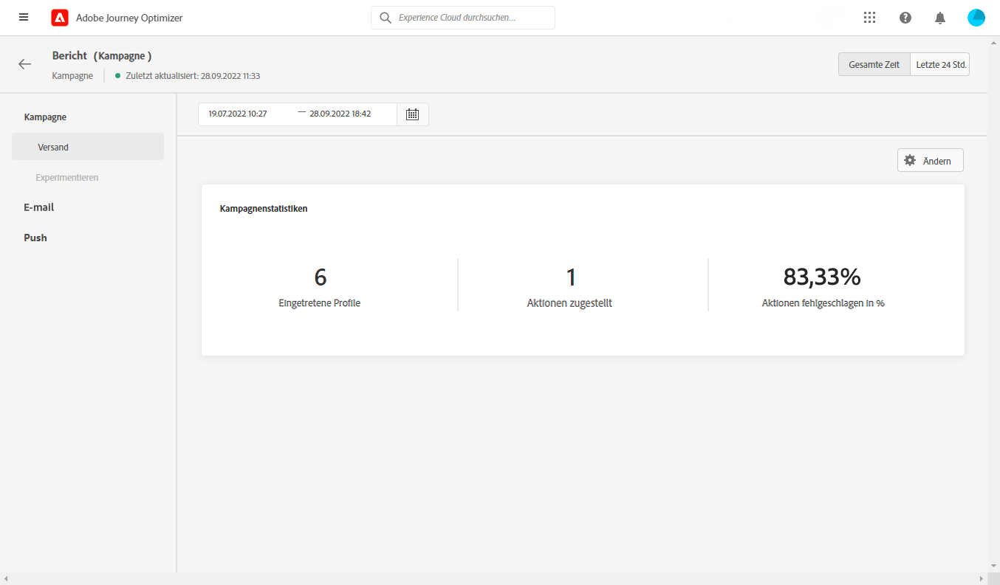
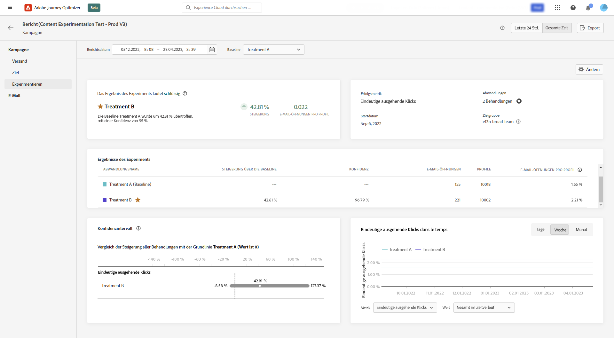
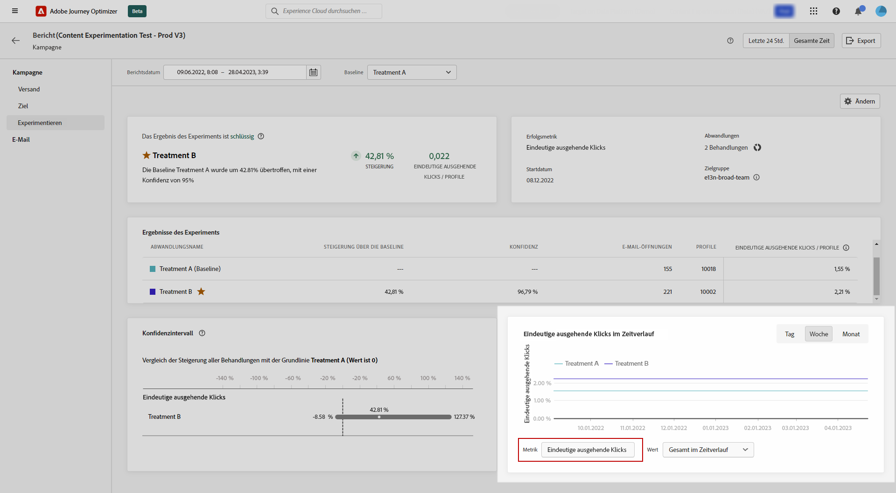
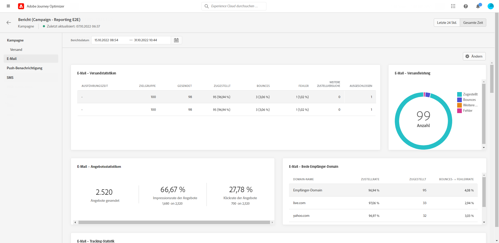
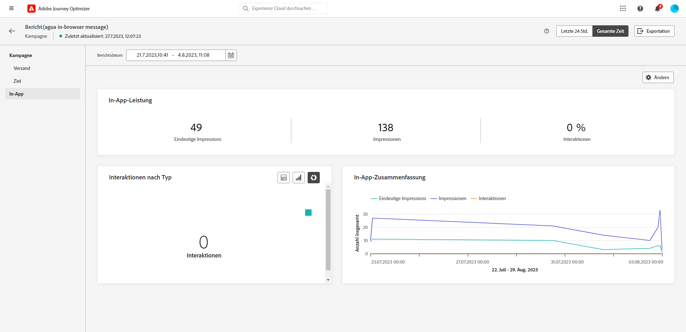
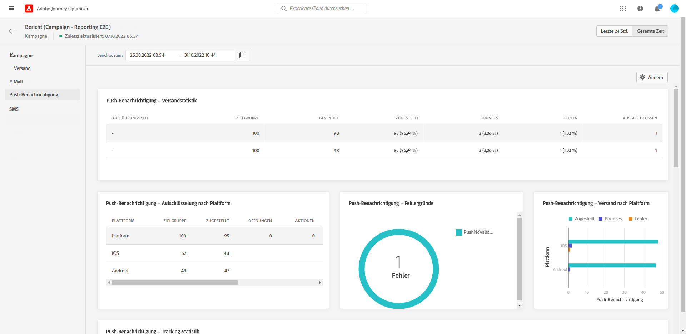
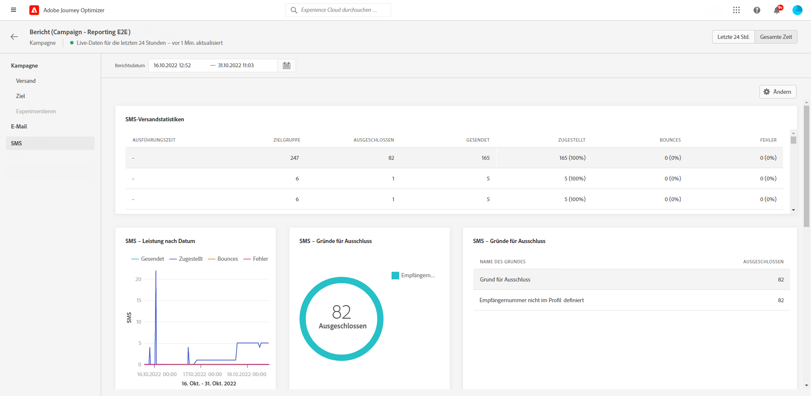
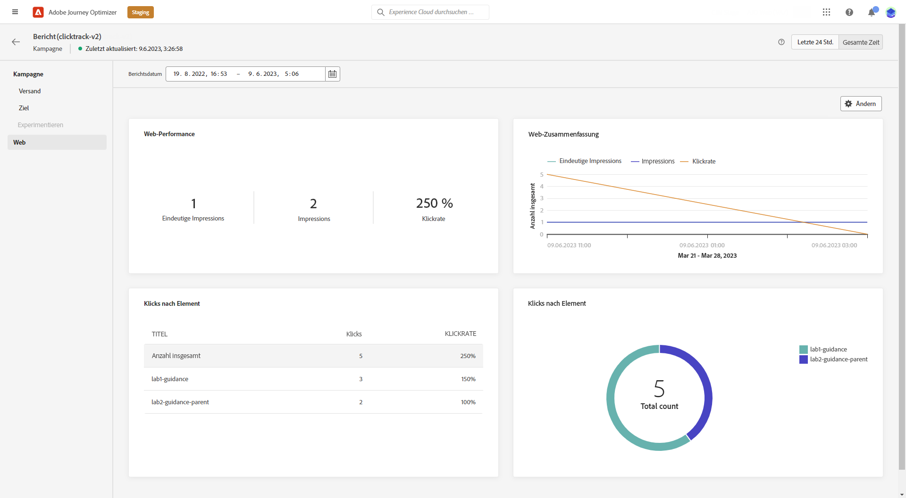
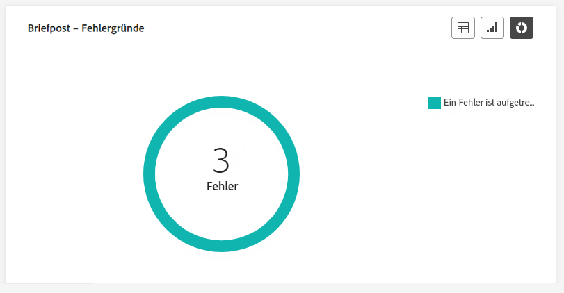

# Globaler Bericht zu Kampagnen {#campaign-global-report}

>[!CONTEXTUALHELP]
>id="ajo_campaign_global_report"
>title="Globaler Bericht zu Kampagnen"
>abstract="Der globale Bericht einer Kampagne ermöglicht die Messung der Wirkung von Kampagnen über einen ausgewählten Zeitraum. Der Bericht ist in verschiedene Widgets unterteilt, die den Erfolg und die Fehler der Kampagne detailliert darstellen. Jedes Reporting-Dashboard kann durch Ändern der Größe oder Entfernen von Widgets verändert werden."

Globale Berichte, auf die über die Registerkarte **Gesamte Zeit** zugegriffen werden kann, zeigen Ereignisse an, die vor mindestens zwei Stunden aufgetreten sind, und decken Ereignisse über einen ausgewählten Zeitraum ab. Im Vergleich dazu konzentrieren sich Live-Berichte auf Ereignisse, die innerhalb der letzten 24 Stunden stattgefunden haben. Der Zeitraum ab dem Auftreten des Ereignisses beträgt mindestens zwei Minuten.

Über die Schaltfläche **[!UICONTROL Bericht anzeigen]** ist der direkte Zugriff in einer Campaign-Instanz auf den globalen Bericht in Campaign möglich.

Die Seite **[!UICONTROL Globaler Bericht]** in Campaign wird mit den folgenden Registerkarten angezeigt:

* [Campaign](#campaign-global)
* [E-Mail](#email-global)
* [In-App](#inapp-global)
* [Push-Benachrichtigung](#push-global)
* [SMS](#sms-global)
* [Web](#web-tab)
* [Briefpost](#direct-mail-global)

Der **[!UICONTROL Globale Bericht]** in Campaign ist in verschiedene Widgets unterteilt, die Erfolge und Fehler bei Ihrer Kampagne detailliert beschreiben. Jedes Widget kann bei Bedarf angepasst und gelöscht werden. Weiterführende Informationen dazu finden Sie in diesem [Abschnitt](../reports/global-report.md#modify-dashboard).

Eine detaillierte Liste aller in Adobe Journey Optimizer verfügbaren Metriken finden Sie auf [dieser Seite](global-report.md#list-of-components-global.md)

## Registerkarte „Kampagne“ {#campaign-global}

### Versand {#delivery-global}

>[!CONTEXTUALHELP]
>id="ajo_campaign_delivery_global"
>title="Kampagnenstatistiken"
>abstract="Das Statistik-Widget von Campaign enthält die wichtigsten Informationen zu Ihrer Kampagne, wie z. B. eingegebene Profile und durchgeführte Aktionen."

Das Widget **[!UICONTROL Kampagnenstatistiken]** enthält die wichtigsten Informationen zu Ihrer Kampagne:

* **[!UICONTROL Eingetretene Profile]**: Anzahl der Profile, die mit der Journey begonnen haben.

* **[!UICONTROL Bereitgestellte Aktionen]**: Gesamtzahl der eindeutigen Fälle, in denen eine Aktion in der Journey ausgeführt wurde.

* **[!UICONTROL Fehlgeschlagene Aktionen in %]**: Gesamtzahl der eindeutigen Fälle, in denen eine Aktion in der Journey fehlgeschlagen ist, verglichen mit der Gesamtzahl der eindeutigen Fälle, in denen eine Aktion erfolgreich ausgeführt wurde.

<!--
### Objectives report {#objectives-global}

The **[!UICONTROL Objectives]** tab allows you to better fine-tune your deliveries' reports by targeting one specific metric.

The **[!UICONTROL Objectives]** listed are linked to **[!UICONTROL Datasets]** that define a connection to a system in order to retrieve additional information. A list of built-in **[!UICONTROL Objectives]** is available but you can add your own by adding new **[!UICONTROL Dataset]**. For the detailed procedure, refer to this [section](../campaigns/reporting-configuration.md).

After selecting the Objectives you want to target on, the two **[!UICONTROL Performance overview]** and **[!UICONTROL Campaign objective]** widgets will provide a detailed summary of your delivery performance. 

With the **[!UICONTROL Campaign objective]** widget, you can also choose to compare your main objective with another metric.
-->

### Experimentationsbericht {#experimentation-global}

>[!CONTEXTUALHELP]
>id="ajo_campaigns_content_experiment_click"
>title="Erfolgsmetrik"
>abstract="Der Gesamtwert der Erfolgsmetrik, die zuvor beim Erstellen der Experimente ausgewählt wurde, dividiert durch die Anzahl der Profile."

Die Registerkarte **[!UICONTROL Experimentieren]** bietet wichtige Einblicke in die Performance der einzelnen Varianten und ermittelt die erfolgreichste Variante.

Beachten Sie, dass es ein wenig dauern kann, um die beste Leistung zu ermitteln. Sie wird durch das Symbol  gekennzeichnet.

+++Erfahren Sie mehr über die verschiedenen Kennzahlen und Widgets, die für den Experimentierbericht verfügbar sind.

Die Widget **[!UICONTROL Experimentergebnis]** liefert Details zur Performance der einzelnen Varianten. Sie können Ihre Baseline ändern, indem Sie eine der Abwandlungen aus der Dropdown-Liste **[!UICONTROL Baseline]** auswählen. Die beste Abwandlung wird mit einem Sternsymbol gekennzeichnet.

Die Tabelle enthält die folgenden Metriken:

* **[!UICONTROL Steigerung über die Baseline]**: Messung der prozentualen Verbesserung der Konversionsrate einer bestimmten Abwandlung im Vergleich zur Baseline.

* **[!UICONTROL Konfidenz]**: Belege dafür, dass eine bestimmte Abwandlung mit der Baseline-Abwandlung identisch ist. [Weitere Informationen](../campaigns/experiment-calculations.md#understand-confidence)

* **[!UICONTROL Ausgehende Einzelklicks]**: Gesamtanzahl der Klicks in allen ausgehenden Kanälen.

* **[!UICONTROL Profile]**: Anzahl der für diese Abwandlung ausgewählten Profile.

* **[!UICONTROL Eindeutige ausgehende Klicks/Profile]**: Gesamtwert der Erfolgskennzahl, die zuvor beim Erstellen der Experimente ausgewählt wurde, dividiert durch die Anzahl der Profile.

Der Graph **[!UICONTROL Konfidenzintervall]** misst die Unsicherheit im Zusammenhang mit Verbesserungen. Er beschreibt den prozentualen Performance-Unterschied zwischen der Baseline und der Abwandlung mit der besten Performance. [Weitere Informationen](../campaigns/experiment-calculations.md#confidence-intervals).

Das letzte Widget stellt Daten mit Bezug zu der **[!UICONTROL Erfolgsmetrik]** bereit, die Sie zuvor für Ihre Behandlungen ausgewählt haben. Sie haben die Möglichkeit, eine andere Zielmetrik aus dem Dropdown-Menü **[!UICONTROL Metrik]** auszuwählen, um alternative Daten zu verfolgen.

>[!CAUTION]
>
>Beachten Sie bei der Arbeit mit experimentierungsgefilterten Metriken, dass beim Ändern der Metrikauswahl in der Dropdown-Liste auf der Vergleichsseite für die Experimentierung der Filterwert nicht beibehalten wird. Wenn Sie beispielsweise von „Klicks“ zu „Einzelklicks“ wechseln, geht der angewendete Filter verloren, was den Vergleich ungenau oder ungültig macht.

+++

Einen tiefen Einblick in diese Ergebnisse und ihre Interpretation finden Sie auf [dieser Seite](../campaigns/get-started-experiment.md#interpret-results).

## Registerkarte „E-Mail“ {#email-global}

>[!CONTEXTUALHELP]
>id="ajo_campaign_global_email_sending_statistics"
>title="E-Mail – Versandstatistiken"
>abstract="Die Tabelle „E-Mail – Versandstatistik“ enthält wichtige Daten zu Ihrem E-Mail-Kanal, z. B. „Angesprochen“ oder „Zugestellt“."

>[!CONTEXTUALHELP]
>id="ajo_campaign_global_email_tracking_statistics"
>title="E-Mail – Tracking-Statistik"
>abstract="Die Tabelle „E-Mail – Tracking-Statistik“ enthält Daten zur Profilaktivität für Ihre E-Mail."

>[!CONTEXTUALHELP]
>id="ajo_campaign_global_email_sending_performance"
>title="E-Mail – Versand-Performance"
>abstract="Der Graph „E-Mail – Versand-Performance“ enthält umfassende Daten zu gesendeten E-Mails und bietet Einblicke in wichtige Metriken wie Sendungen und Bounces, sodass eine detaillierte Analyse des E-Mail-Versandprozesses möglich ist."

>[!CONTEXTUALHELP]
>id="ajo_campaign_global_email_bounce_categories"
>title="E-Mail – Bounce-Kategorien"
>abstract="Die Graphen und die Tabelle „E-Mail – Bounce-Kategorien“ bieten Daten zu temporären und permanenten Fehlern."

>[!CONTEXTUALHELP]
>id="ajo_campaign_global_email_bounce_reasons"
>title="E-Mail – Bounce-Gründe"
>abstract="Die Graphen und die Tabelle „E-Mail – Ausschlussgründe“ enthalten die für Bounce-Nachrichten verfügbare Daten."

>[!CONTEXTUALHELP]
>id="ajo_campaign_global_email_error_reasons"
>title="E-Mail – Fehlerursachen"
>abstract="Anhand der Graphen und der Tabelle „E-Mail – Fehlerursachen“ können Sie die spezifischen Fehler identifizieren, die während des Versandvorgangs aufgetreten sind."

>[!CONTEXTUALHELP]
>id="ajo_campaign_global_email_excluded_reasons"
>title="E-Mail – Ausgeschlossene Gründe"
>abstract="Die Graphen und die Tabelle „Ausgeschlossene Gründe“ veranschaulichen die verschiedenen Faktoren, die dazu führten, dass Benutzerprofile aus der Zielgruppe ausgeschlossen wurden und die Nachricht nicht erhielten."

>[!CONTEXTUALHELP]
>id="ajo_campaign_global_email_top_url"
>title="E-Mail – Beste URL"
>abstract="Der Graph und die Tabelle „E-Mail – Beste URL“ bieten einen umfassenden Überblick über die URLs in Ihrer E-Mail, die den höchsten Besucher-Traffic erhalten, sodass Sie die beliebtesten Links identifizieren können."

>[!CONTEXTUALHELP]
>id="ajo_campaign_global_email_best_recipient"
>title="E-Mail – Beste Empfänger-Domain"
>abstract="Der Graph und die Tabelle „E-Mail – Beste Empfänger-Domain“ enthalten eine detaillierte Aufschlüsselung der Domains, die die Empfängerinnen und Empfänger am häufigsten zum Öffnen der E-Mail verwenden, und bieten wertvolle Einblicke in das Empfängerverhalten."

Im **[!UICONTROL globalen Bericht]** in Campaign finden Sie auf der Registerkarte **[!UICONTROL E-Mail]** die wichtigsten Informationen zu den E-Mail-Sendungen, die in Ihrer Journey gesendet wurden.

+++Erfahren Sie mehr über die verschiedenen Metriken und Widgets, die für den E-Mail-Bericht verfügbar sind.

Im Graphen **[!UICONTROL E-Mail-Sendestatistik]** wird der Erfolg Ihrer E-Mail beschrieben:

* **[!UICONTROL Ausführungszeit]**: Startzeit jeder Ausführung Ihrer wiederkehrenden E-Mail. Um nur eine oder mehrere wiederkehrende E-Mails als Ziel auszuwählen, wählen Sie diese aus der Dropdown-Liste **[!UICONTROL Ausführungszeit]**.

* **[!UICONTROL Zielgruppe]**: Gesamtzahl der beim Versandvorgang verarbeiteten Nachrichten.

* **[!UICONTROL Gesendet]**: Gesamtzahl der Sendevorgänge für Ihre E-Mail.

* **[!UICONTROL Zugestellt]**: Zahl der erfolgreich gesendeten Nachrichten im Vergleich zur Gesamtzahl der gesendeten Nachrichten.

* **[!UICONTROL Zustellbarkeitsrate]**: Prozentsatz der erfolgreich gesendeten Nachrichten.

* **[!UICONTROL Bounces]**: Gesamtzahl der kumulierten Fehler beim Versandvorgang und der automatischen Rücksendungen, bezogen auf die Gesamtzahl der gesendeten Nachrichten.

* **[!UICONTROL Bounce-Rate]**: Prozentsatz der E-Mails, die nicht erfolgreich zugestellt wurden, im Vergleich zur Zahl der gesendeten E-Mails.

* **[!UICONTROL Fehler]**: Gesamtzahl der während des Versandvorgangs aufgetretenen Fehler, die den Versand an Profile verhindert haben.

* **[!UICONTROL Fehlerrate]**: Prozentsatz der Fehler, die während des Versandvorgangs auftraten und die Zustellung verhinderten, im Vergleich zur Zahl der gesendeten E-Mails.

* **[!UICONTROL Weitere Zustellversuche]**: Anzahl der E-Mails in der Warteschlange für weitere Zustellversuche.

* **[!UICONTROL Ausgeschlossen]**: Anzahl der Profile, die durch Adobe Journey Optimizer ausgeschlossen wurden.

Das Widget **[!UICONTROL E-Mail – Tracking-Statistik]** enthält die verfügbaren Daten zur Profilaktivität für Ihre E-Mail:

* **[!UICONTROL Ausführungszeit]**: Startzeit jeder Ausführung Ihrer wiederkehrenden E-Mail. Um nur eine oder mehrere wiederkehrende E-Mails als Ziel auszuwählen, wählen Sie diese aus der Dropdown-Liste **[!UICONTROL Ausführungszeit]**.

* **[!UICONTROL Öffnungen]**: Anzahl der Öffnungen der E-Mail.

* **[!UICONTROL Eindeutige Öffnungen]**: Prozentsatz der geöffneten E-Mails.

* **[!UICONTROL Öffnungsrate]**: Gesamtzahl der geöffneten Nachrichten im Vergleich zu den versendeten E-Mails.

* **[!UICONTROL Klicks]**: Anzahl der Klicks auf Inhalt einer E-Mail.

* **[!UICONTROL Einzelklicks]**: Die Anzahl der Profile, die auf Inhalt in einer E-Mail geklickt haben.

* **[!UICONTROL Rate von Einzelklicks]**: Prozentsatz der Benutzenden, die mit Ihrer E-Mail interagiert haben.

* **[!UICONTROL Abmeldungen]**: Zahl der Klicks auf den Abmelde-Link.

* **[!UICONTROL Beschwerden wegen Spam]**: Gibt an, wie oft eine Nachricht als Spam oder Junk gekennzeichnet wurde.

Das Diagramm **[!UICONTROL Versand-Performance]** enthält die Daten, die für gesendete E-Mails verfügbar sind, z. B.:

* **[!UICONTROL Zugestellt]**: Zahl der erfolgreich gesendeten Nachrichten im Vergleich zur Gesamtzahl der gesendeten Nachrichten.

* **[!UICONTROL Bounces]**: Gesamtzahl der kumulierten Fehler beim Versandvorgang und der automatischen Rücksendungen, bezogen auf die Gesamtzahl der gesendeten Nachrichten.

* **[!UICONTROL Weitere Zustellversuche]**: Anzahl der E-Mails in der Warteschlange für weitere Zustellversuche.

* **[!UICONTROL Fehler]**: Gesamtzahl der während des Versandvorgangs aufgetretenen Fehler, die den Versand an Profile verhindert haben.

Die Widgets **[!UICONTROL Bounce-Gründe]** und **[!UICONTROL Bounce-Kategorien]** enthalten die verfügbaren Daten zu unzustellbaren Nachrichten wie:

* **[!UICONTROL Hardbounce]**: die Gesamtzahl der permanenten Fehler, wie eine falsche E-Mail-Adresse. Dazu gehören Fehlermeldungen, die explizit eine ungültige Adresse anzeigen, wie etwa „Benutzer unbekannt“.

* **[!UICONTROL Softbounce]**: die Gesamtzahl der temporären Fehler, wie ein voller Posteingang.

* **[!UICONTROL Ignoriert]**: Die Gesamtzahl der temporären Ereignisse, beispielsweise Abwesenheit, oder technischer Fehler, zum Beispiel wenn der Absendertyp Postmaster ist.

Weitere Informationen zu Bounces finden Sie auf der Seite [ Unterdrückungslisten](../reports/suppression-list.md).

Im Graphen und der Tabelle **[!UICONTROL Fehlerursachen]** können Sie sehen, welcher Fehler während des Versandvorgangs aufgetreten ist.

Der Graph und die Tabelle **[!UICONTROL Ausschlussgründe]** zeigen die verschiedenen Gründe an, die verhindert haben, dass Nutzerprofile, die von den Zielprofilen ausgeschlossen wurden, die Nachricht erhalten haben.

Der Graph und die Tabelle **[!UICONTROL E-Mail – Beste URL]** zeigen, welche URLs aus Ihrer E-Mail am häufigsten besucht werden.

Der Graph und die Tabelle **[!UICONTROL E-Mail – Beste Empfänger-Domain]** zeigen, welche Domains von Profilen am häufigsten zum Öffnen der E-Mail verwendet werden.

>[!CAUTION]
>
> Das Widget **[!UICONTROL E-Mail – Beste Empfänger-Domain]** hat eine Genauigkeit von 99,95 %.

Die Grafik **[!UICONTROL E-Mail - Optimiert vs. nicht optimiert]** zeigt die wichtigsten Informationen zur Optimierung Ihrer Nachricht an:

* **[!UICONTROL Gesendet]**: Gesamtzahl der Sendevorgänge.

* **[!UICONTROL Öffnungen]**: Anzahl der Öffnungen der Nachricht.

* **[!UICONTROL Klicks]**: Anzahl der Klicks auf Inhalt einer E-Mail.

Die Details **[!UICONTROL E-Mail - Versandzeitoptimierung]** zeigt den Erfolg Ihrer E-Mail je nach Versandmethode an: optimiert oder normal.

* **[!UICONTROL Zugestellt]**: Zahl der erfolgreich gesendeten Nachrichten im Vergleich zur Gesamtzahl der gesendeten Nachrichten.

* **[!UICONTROL Bounces]**: Gesamtzahl der kumulierten Fehler beim Versandvorgang und der automatischen Rücksendungen, bezogen auf die Gesamtzahl der gesendeten Nachrichten.

>[!NOTE]
>
>Die Widgets **[!UICONTROL Optimiert vs. nicht optimiert]** und **[!UICONTROL Versandzeitoptimierung]** sind nur verfügbar, wenn die Option „Sendezeitoptimierung“ für Ihre E-Mail aktiviert ist. Weitere Informationen zur Sendezeitoptimierung finden Sie auf [dieser Seite](../building-journeys/journeys-message.md#send-time-optimization).

+++

## Registerkarte „In-App“ {#inapp-global}

>[!CONTEXTUALHELP]
>id="ajo_campaign_global_inapp_performance"
>title="In-App-Performance"
>abstract="Die KPIs zur In-App-Performance bieten wichtige Einblicke in die Interaktion Ihrer Besuchenden mit In-App-Nachrichten."

>[!CONTEXTUALHELP]
>id="ajo_campaign_global_inapp_interactions"
>title="Interaktionen nach Typ"
>abstract="Der Graph und die Tabelle „Interaktionen nach Typ“ beschreiben, wie Benutzende mit Ihrer In-App-Nachricht interagiert haben, indem Klicks, Abbrechen oder Interaktionen verfolgt werden."

>[!CONTEXTUALHELP]
>id="ajo_campaign_global_inapp_summary"
>title="In-App-Zusammenfassung"
>abstract="Der Graph „In-App – Zusammenfassung“ zeigt die Entwicklung Ihrer In-App-Impressions und -Interaktionen für den jeweiligen Zeitraum an."

Im **[!UICONTROL globalen Bericht]** Ihrer Kampagne finden Sie auf der Registerkarte **[!UICONTROL In-App]** die wichtigsten Informationen zu den In-App-Sendungen, die in Ihrer Kampagne versendet wurden.

+++Erfahren Sie mehr über die verschiedenen Metriken und Widgets, die für den In-App-Bericht verfügbar sind.

Die KPIs der **[!UICONTROL In-App-Performance]** geben die wichtigsten Informationen bezüglich der Interaktion Ihrer Besucherinnen und Besucher mit Ihren In-App-Nachrichten an, z. B.:

* **[!UICONTROL Eindeutige Impressions]**: Anzahl der eindeutigen Nutzer, an die die In-App-Nachricht gesendet wurde.

* **[!UICONTROL Impressions]**: Gesamtzahl der an alle Benutzer gesendeten In-App-Nachrichten.

* **[!UICONTROL Interaktionsrate]**: Prozentsatz der Interaktionen mit Ihrer In-App-Nachricht. Dazu gehören alle von den Benutzenden durchgeführten Aktionen, wie z. B. Klicks, Abbrechen oder andere Interaktionen.

Der Graph und die Tabelle **[!UICONTROL Interaktionen nach Typ]** beschreiben, wie Benutzende mit Ihrer In-App-Nachricht interagiert haben, indem Klicks, Abbrechen oder Interaktionen verfolgt werden.

Der Graph **[!UICONTROL In-App-Zusammenfassung]** zeigt die Entwicklung Ihrer In-App-Impressions und Interaktionen für den jeweiligen Zeitraum an.
+++

## Registerkarte „Push-Benachrichtigung“ {#push-global}

>[!CONTEXTUALHELP]
>id="ajo_campaign_global_push_sending_statistics"
>title="Push-Benachrichtigung – Sendestatistik"
>abstract="Die Tabelle „Push-Benachrichtigung – Sendestatistik“ fasst wesentliche Daten über Ihre Push-Benachrichtigungen zusammen, z. B. „Angesprochen“ oder „Zugestellte Nachrichten“."

>[!CONTEXTUALHELP]
>id="ajo_campaign_global_push_tracking_statistics"
>title="Push-Benachrichtigung – Tracking-Statistik"
>abstract="Die Tracking-Statistik für Push-Benachrichtigungen bietet Daten zur Profilaktivität für Ihre Push-Benachrichtigung."

>[!CONTEXTUALHELP]
>id="ajo_campaign_global_push_sending_summary"
>title="Push-Benachrichtigung – Sendezusammenfassung"
>abstract="Der Graph „Push-Benachrichtigung – Sendezusammenfassung“ zeigt die Daten an, die für gesendete Push-Benachrichtigungen verfügbar sind."

>[!CONTEXTUALHELP]
>id="ajo_campaign_global_push_excluded_reasons"
>title="Push-Benachrichtigung – Ausschlussursachen"
>abstract="Die Graphen und die Tabelle „Ausgeschlossene Gründe“ veranschaulichen die verschiedenen Faktoren, die dazu führten, dass Benutzerprofile aus der Zielgruppe ausgeschlossen wurden und die Nachricht nicht erhielten."

>[!CONTEXTUALHELP]
>id="ajo_campaign_global_push_error_reasons"
>title="Push-Benachrichtigung – Fehlerursachen"
>abstract="Anhand der Graphen und der Tabelle „Fehlerursachen“ können Sie die spezifischen Fehler identifizieren, die während des Versandvorgangs aufgetreten sind."

>[!CONTEXTUALHELP]
>id="ajo_campaign_global_push_breakdown_platform"
>title="Push-Benachrichtigung – Aufschlüsselung nach Plattform"
>abstract="Die Graphen und die Tabelle „Aufschlüsselung nach Platform“ enthalten eine Aufschlüsselung des Erfolgs Ihrer Push-Benachrichtigungen nach dem Betriebssystem des Profils."

Im **[!UICONTROL globalen Bericht]** Ihrer Kampagne finden Sie auf der Registerkarte **[!UICONTROL Push-Benachrichtigung]** die wichtigsten Informationen zu den im Rahmen Ihrer Kampagne gesendeten Push-Sendungen.

Die KPIs der In-App-Performance geben die wichtigsten Informationen bezüglich der Interaktion Ihrer Besucherinnen und Besucher mit Ihren In-App-Nachrichten an.

+++Erfahren Sie mehr über die verschiedenen Metriken und Widgets, die für den Push-Bericht verfügbar sind.

Die **[!UICONTROL Push-Benachrichtigung - Versandstatistiken]** -Tabelle enthält die wichtigsten Informationen zu Ihren Push-Benachrichtigungen:

* **[!UICONTROL Ausführungszeit]**: Startzeit jeder Ausführung Ihrer wiederkehrenden Push-Benachrichtigung. Um nur eine oder mehrere wiederkehrende Push-Benachrichtigungen als Ziel auszuwählen, wählen Sie diese aus der Dropdown-Liste **[!UICONTROL Ausführungszeit]**.

* **[!UICONTROL Zielgruppe]**: Gesamtzahl der bei der Analyse verarbeiteten Nachrichten.

* **[!UICONTROL Gesendet]**: Gesamtzahl der Sendevorgänge für die Push-Benachrichtigung.

* **[!UICONTROL Zugestellt]**: Zahl der erfolgreich gesendeten Nachrichten im Vergleich zur Gesamtzahl der gesendeten Nachrichten.

* **[!UICONTROL Zustellbarkeitsrate]**: Prozentsatz der erfolgreich gesendeten Nachrichten.

* **[!UICONTROL Bounces]**: Gesamtzahl der kumulierten Fehler beim Versandvorgang und der automatischen Rücksendungen, bezogen auf die Gesamtzahl der gesendeten Nachrichten.

* **[!UICONTROL Bounce-Rate]**: Prozentsatz der Push-Benachrichtigungen, die unzustellbar waren, im Vergleich zu den gesendeten Push-Benachrichtigungen.

* **[!UICONTROL Fehler]**: Gesamtzahl der aufgetretenen Fehler, die die Zustellung an Profile verhindert haben.

* **[!UICONTROL Fehlerrate]**: Prozentualer Anteil der während des Versandvorgangs aufgetretenen Fehler, die den Versand verhindert haben, im Vergleich zu den gesendeten Push-Benachrichtigungen.

* **[!UICONTROL Ausgeschlossen]**: Anzahl der Profile, die durch Adobe Journey Optimizer ausgeschlossen wurden.

**[!UICONTROL Push-Benachrichtigung – Tracking-Statistiken]** enthält die verfügbaren Daten zur Profilaktivität für Ihre Push-Benachrichtigung:

* **[!UICONTROL Ausführungszeit]**: Startzeit jeder Ausführung Ihrer wiederkehrenden Push-Benachrichtigung. Um nur eine oder mehrere wiederkehrende Push-Benachrichtigungen als Ziel auszuwählen, wählen Sie diese aus der Dropdown-Liste **[!UICONTROL Ausführungszeit]**.

* **[!UICONTROL Öffnungen]**: Gibt an, wie oft Ihre Push-Benachrichtigung geöffnet wurde.

* **[!UICONTROL Öffnungsrate]**: Prozentsatz der geöffneten Push-Benachrichtigungen.

* **[!UICONTROL Aktionen]**: Gesamtzahl der Aktionen, die bei der gesendeten Push-Benachrichtigung durchgeführt wurden, d. h. Klick auf Schaltfläche oder Abbruch.

* **[!UICONTROL Interaktionen]**: Gesamtzahl der Öffnungen und Aktionen für diese Push-Benachrichtigung, d. h. wenn das Profil die Push-Benachrichtigung geöffnet hat oder wenn auf eine Schaltfläche geklickt wurde.

* **[!UICONTROL Interaktionsrate]**: Prozentsatz der Öffnungen und Aktionen für diese Push-Benachrichtigung, d. h. wenn das Profil die Push-Benachrichtigung geöffnet hat oder auf eine Schaltfläche geklickt wurde.

Das Diagramm **[!UICONTROL Zusammenfassung der Push-Benachrichtigung]** enthält die Daten, die für gesendete Push-Benachrichtigungen verfügbar sind, z. B.:

* **[!UICONTROL Öffnungen]**: Gibt an, wie oft Ihre Push-Benachrichtigung geöffnet wurde.

* **[!UICONTROL Aktionen]**: Gesamtzahl der Aktionen, die bei der gesendeten Push-Benachrichtigung durchgeführt wurden, d. h. Klick auf Schaltfläche oder Abbruch.

* **[!UICONTROL Bounces]**: Gesamtzahl der Fehler und automatischen Rücksendungen, bezogen auf die Gesamtzahl der gesendeten Nachrichten.

* **[!UICONTROL Zugestellt]**: Zahl der erfolgreich gesendeten Nachrichten im Vergleich zur Gesamtzahl der gesendeten Nachrichten.

* **[!UICONTROL Fehler]**: Gesamtzahl der aufgetretenen Fehler, die die Zustellung an Profile verhindert haben.

>[!NOTE]
>
>Die Widgets **[!UICONTROL Optimiert vs. nicht optimiert]** und **[!UICONTROL Versandzeitoptimierung]** sind nur verfügbar, wenn die Option „Sendezeitoptimierung“ für Ihre Push-Benachrichtigung aktiviert ist. Weitere Informationen zur Sendezeitoptimierung finden Sie auf [dieser Seite](../building-journeys/journeys-message.md#send-time-optimization).

Das Diagramm **[!UICONTROL Optimiert vs. nicht optimiert]** zeigt die wichtigsten Informationen bezüglich Ihrer Nachricht an, egal ob sie optimiert wurden oder nicht:

* **[!UICONTROL Zugestellt]**: Zahl der erfolgreich gesendeten Nachrichten im Vergleich zur Gesamtzahl der gesendeten Nachrichten.

* **[!UICONTROL Öffnungen]**: Gibt an, wie oft Ihre Push-Benachrichtigung geöffnet wurde.

* **[!UICONTROL Aktionen]**: Gesamtzahl der Aktionen, die bei der gesendeten Push-Benachrichtigung durchgeführt wurden, d. h. Klick auf Schaltfläche oder Abbruch.

**[!UICONTROL Versandzeitoptimierung]** zeigt den Erfolg Ihrer Push-Benachrichtigung in Abhängigkeit von der Versandmethode an: optimiert oder normal.

* **[!UICONTROL Zugestellt]**: Zahl der erfolgreich gesendeten Nachrichten im Vergleich zur Gesamtzahl der gesendeten Nachrichten.

* **[!UICONTROL Bounces]**: Gesamtzahl der kumulierten Fehler beim Versandvorgang und der automatischen Rücksendungen, bezogen auf die Gesamtzahl der gesendeten Nachrichten.

Die Graphen und die Tabelle **[!UICONTROL Fehlerursachen]** zeigen, welcher Fehler aufgetreten ist.

Die Graphen und die Tabelle **[!UICONTROL Ausschlussursachen]** zeigen die verschiedenen Ursachen an, die verhindert haben, dass Benutzerprofile, die von den Zielprofilen ausgeschlossen wurden, die Nachricht erhalten haben.

Der Graph und die Tabelle **[!UICONTROL Aufschlüsselung nach Plattform]** zeigen den Erfolg Ihrer Push-Benachrichtigung abhängig vom Betriebssystem Ihrer Profile an.
+++

## Registerkarte „SMS“ {#sms-global}

>[!CONTEXTUALHELP]
>id="ajo_campaign_global_sms_sending_statistics"
>title="SMS – Sendestatistik"
>abstract="Die Tabelle „SMS – Sendestatistik“ enthält eine Zusammenfassung der wichtigsten Daten zu Ihren SMS-Nachrichten, wie z. B. „Angesprochen“ oder „Zugestellt“."

>[!CONTEXTUALHELP]
>id="ajo_campaign_global_sms_error_reasons"
>title="SMS – Fehlerursachen"
>abstract="Anhand der Graphen und der Tabelle „SMS – Fehlerursachen“ können Sie die spezifischen Fehler identifizieren, die während des Versandvorgangs aufgetreten sind."

>[!CONTEXTUALHELP]
>id="ajo_campaign_global_sms_performance"
>title="SMS – Performance nach Datum"
>abstract="Das Widget „SMS – Performance nach Datum“ liefert wichtige Informationen über Ihre Nachrichten in einer grafischen Darstellung."

>[!CONTEXTUALHELP]
>id="ajo_campaign_global_sms_excluded_reasons"
>title="SMS – Ausschlussursachen"
>abstract="Die Graphen und die Tabelle „Ausgeschlossene Gründe“ veranschaulichen die verschiedenen Faktoren, die dazu führten, dass Benutzerprofile aus der Zielgruppe ausgeschlossen wurden und die Nachricht nicht erhielten."

>[!CONTEXTUALHELP]
>id="ajo_campaign_global_sms_bounces_reasons"
>title="SMS – Bounce-Ursachen"
>abstract="Die Graphen und die Tabelle „Bounce-Gründe“ enthalten die verfügbaren Daten zu Bounce-Nachrichten."

>[!CONTEXTUALHELP]
>id="ajo_campaign_global_sms_clicks_links"
>title="SMS – Klicks nach Links"
>abstract="Das Widget „SMS – Klicks nach Links“ bietet wichtige Einblicke in die Interaktion Ihrer Besucherinnen und Besucher mit den URLs in Ihren Nachrichten"

Im **[!UICONTROL Globalen Bericht]** Ihrer Kampagne finden Sie auf der Registerkarte **[!UICONTROL SMS]** die wichtigsten Informationen zu den in Ihrer Kampagne versendeten SMS.

+++Erfahren Sie mehr über die verschiedenen Metriken und Widgets, die für den SMS-Bericht verfügbar sind.

Die Tabelle **[!UICONTROL SMS – Sendestatistik]** gibt Auskunft über den Erfolg Ihrer SMS-Nachricht:

* **[!UICONTROL Ausführungszeit]**: Startzeit jeder Ausführung Ihrer wiederkehrenden SMS-Nachricht. Um nur eine oder mehrere wiederkehrende SMS-Nachrichten auszuwählen, wählen Sie die gewünschte Option in der Dropdown-Liste **[!UICONTROL Ausführungszeit]** aus.

* **[!UICONTROL Angesprochen]**: Anzahl der Benutzerprofile, die sich als Zielgruppenprofile für diesen Versand eignen.

* **[!UICONTROL Ausgeschlossen]**: Anzahl der Benutzerprofile, die von den Zielgruppenprofilen ausgeschlossen waren und die die Nachricht nicht erhalten haben.

* **[!UICONTROL Gesendet]**: Gesamtzahl der Sendevorgänge für Ihre SMS-Nachricht.

* **[!UICONTROL Bounces]**: Gesamtzahl der kumulierten Fehler beim Versandvorgang und der automatischen Rücksendungen, bezogen auf die Gesamtzahl der gesendeten Nachrichten.

* **[!UICONTROL Fehler]**: Gesamtzahl der aufgetretenen Fehler, die die Zustellung an Profile verhindert haben.

Das Widget **[!UICONTROL SMS-Performance nach Datum]** enthält die wichtigsten Informationen zu Ihrer Nachricht in Form eines Graphen:

* **[!UICONTROL Gesendet]**: Gesamtzahl der Sendevorgänge für Ihre SMS-Nachrichten.

* **[!UICONTROL Bounces]**: Gesamtzahl der kumulierten Fehler beim Versandvorgang und der automatischen Rücksendungen, bezogen auf die Gesamtzahl der gesendeten Nachrichten.

* **[!UICONTROL Fehler]**: Gesamtzahl der aufgetretenen Fehler, die die Zustellung an Profile verhindert haben.

In den Graphen und Tabellen **[!UICONTROL Ausschlussursachen]**, **[!UICONTROL Bounce-Gründe]** und **[!UICONTROL Fehlerursachen]** sehen Sie, welche Fehler und Ausschlüsse während des Versands aufgetreten sind.

Das Widget **[!UICONTROL SMS – Klicks nach Links]** enthält die wichtigsten Informationen zur Interaktion Ihrer Besucherinnen und Besucher mit Ihren URLs.

+++

## Registerkarte „Web“ {#web-tab}

>[!CONTEXTUALHELP]
>id="ajo_campaign_global_web_performance"
>title="Web-Performance"
>abstract="Die Web-Performance-KPIs bieten umfassende Informationen über die Interaktion Ihrer Besucherinnen und Besucher mit Ihren Web-Erlebnissen."

>[!CONTEXTUALHELP]
>id="ajo_campaign_global_web_summary"
>title="Web-Zusammenfassung"
>abstract="Das Diagramm „Web – Zusammenfassung“ zeigt die Entwicklung Ihrer Web-Erlebnisse (Impressions, eindeutige Impressions und Interaktionen) für den jeweiligen Zeitraum."

>[!CONTEXTUALHELP]
>id="ajo_campaign_global_web_interactions"
>title="Interaktionen nach Element"
>abstract="Die Tabelle „Interaktionen nach Element“ enthält wichtige Informationen zur Interaktion Ihrer Besucherinnen und Besucher mit verschiedenen Elementen auf Ihren Web-Seiten."

Im **[!UICONTROL globalen Bericht]** Ihrer Kampagne werden in der Registerkarte **[!UICONTROL Web]** die wichtigsten Informationen zu Ihren Web-Seiten aufgeführt.

+++Erfahren Sie mehr über die verschiedenen Metriken und Widgets, die für den Web-Bericht verfügbar sind.

Die KPIs der **[!UICONTROL Web-Performance]** geben die wichtigsten Informationen bezüglich der Interaktion Ihrer Besucherinnen und Besucher mit Ihren Web-Erlebnissen an, z. B.:

* **[!UICONTROL Eindeutige Impressions]**: Anzahl der eindeutigen Benutzer, denen das Web-Erlebnis bereitgestellt wurde.

* **[!UICONTROL Impressions]**: Gesamtanzahl der für alle Benutzer bereitgestellten Web-Erlebnisse.

* **[!UICONTROL Interaktionsrate]**: Prozentsatz der Interaktionen mit Ihrer Web-Seite. Dazu gehören alle von den Benutzenden durchgeführten Aktionen, wie z. B. Klicks oder andere Interaktionen.

Das Diagramm **[!UICONTROL Web-Zusammenfassung]** zeigt die Entwicklung Ihrer Web-Erlebnisse (Impressions, eindeutige Impressions und Interaktionen) für den jeweiligen Zeitraum.

Die Tabelle **[!UICONTROL Interaktionen nach Element]** enthält die wichtigsten Informationen zur Interaktion Ihrer Besucherinnen und Besucher mit den verschiedenen Elementen auf Ihren Web-Seiten.
+++

## Registerkarte „Briefpost“ {#direct-mail-global}

>[!CONTEXTUALHELP]
>id="ajo_campaign_global_direct_sending_statistics"
>title="Briefpost – Versandstatistik"
>abstract="Die Tabelle „Briefpost – Versandstatistiken“ enthält eine Zusammenfassung der wichtigsten Daten zu Ihren Briefpost-Nachrichten, wie z. B. „Angesprochen“ oder „Zugestellte Nachrichten“."

>[!CONTEXTUALHELP]
>id="ajo_campaign_global_direct_error_reasons"
>title="Briefpost – Fehlerursachen"
>abstract="Die Graphen und die Tabelle „Briefpost – Fehlerursachen“ ermöglichen es Ihnen, die spezifischen Fehler zu identifizieren, die während des Versandvorgangs aufgetreten sind."

>[!CONTEXTUALHELP]
>id="ajo_campaign_global_direct_excluded_reasons"
>title="Briefpost – Ausschlussgründe"
>abstract="Die Graphen und die Tabelle mit Ausschlussgründen für den Direktversand veranschaulichen, warum Benutzerprofile, die von der Zielgruppe ausgeschlossen waren, die Nachricht nicht erhielten."

Im **[!UICONTROL globalen Bericht]** Ihrer Kampagne werden in der Registerkarte **[!UICONTROL Briefpost]** die wichtigsten Informationen zu Ihren Briefpost-Sendungen aufgeführt.

+++Erfahren Sie mehr über die verschiedenen Metriken und Widgets, die für den Briefpost-Bericht verfügbar sind.

Die Tabelle **[!UICONTROL Briefpost – Versandstatistik]** gibt Auskunft über den Erfolg Ihrer Briefpost:

* **[!UICONTROL Ausführungszeit]**: Startzeit jeder Ausführung Ihrer wiederkehrenden Briefpost. Um nur eine oder mehrere wiederkehrende Briefpost festzulegen, wählen Sie die gewünschte Option in der Dropdown-Liste **[!UICONTROL Ausführungszeit]** aus.

* **[!UICONTROL Angesprochen]**: Anzahl der Benutzerprofile, die sich als Zielgruppenprofile für diesen Briefpostversand eignen.

* **[!UICONTROL Gesendet]**: Gesamtzahl der Sendevorgänge für diese Briefpost.

* **[!UICONTROL Fehler]**: Gesamtzahl der während des Versandvorgangs aufgetretenen Fehler, die den Versand an Profile verhindert haben.

* **[!UICONTROL Ausgeschlossen]**: Anzahl der Benutzerprofile, die von den Zielgruppenprofilen ausgeschlossen waren und Ihre Briefpost nicht erhalten haben.

In den Graphen und Tabellen **[!UICONTROL Briefpost – Ausschlussgründe]** und **[!UICONTROL Briefpost – Fehlerursachen]** sehen Sie, welche Fehler und Ausschlüsse während des Versandvorgangs aufgetreten sind.
+++

## Weitere Ressourcen

* [Erste Schritte mit Kampagnen](../campaigns/get-started-with-campaigns.md)
* [Erstellen einer Kampagne](../campaigns/create-campaign.md)
* [Erstellen von API-ausgelösten Kampagnen](../campaigns/api-triggered-campaigns.md)
* [Ändern oder Stoppen einer Kampagne](../campaigns/modify-stop-campaign.md)
* [Kampagnen-Live-Bericht](campaign-live-report.md)
