# Globaler Bericht zu Kampagnen {#campaign-global-report}

>[!CONTEXTUALHELP]
>id="ajo_campaign_global_report"
>title="Globaler Bericht zu Kampagnen"
>abstract="Der globale Bericht einer Kampagne ermöglicht die Messung der Wirkung von Kampagnen über einen ausgewählten Zeitraum. Der Bericht ist in verschiedene Widgets unterteilt, die den Erfolg und die Fehler der Kampagne detailliert darstellen. Jedes Reporting-Dashboard kann durch Ändern der Größe oder Entfernen von Widgets verändert werden."

Globale Berichte, auf die über die Registerkarte **Gesamte Zeit** zugegriffen werden kann, zeigen Ereignisse an, die vor mindestens zwei Stunden aufgetreten sind, und decken Ereignisse über einen ausgewählten Zeitraum ab. Im Vergleich dazu konzentrieren sich Live-Berichte auf Ereignisse, die innerhalb der letzten 24 Stunden stattgefunden haben. Der Zeitraum ab dem Auftreten des Ereignisses beträgt mindestens zwei Minuten.

Über die Schaltfläche **[!UICONTROL Bericht anzeigen]** ist der direkte Zugriff in einer Campaign-Instanz auf den globalen Bericht in Campaign möglich.

Die Seite **[!UICONTROL Globaler Bericht]** in Campaign wird mit den folgenden Registerkarten angezeigt:

* [Campaign](#campaign-global)
* [E-Mail](#email-global)
* [In-App](#inapp-global)
* [Push-Benachrichtigung](#push-global)
* [SMS](#sms-global)
* [Web](#web-tab)
* [Briefpost](#direct-mail-global)

Der **[!UICONTROL Globale Bericht]** in Campaign ist in verschiedene Widgets unterteilt, die Erfolge und Fehler bei Ihrer Kampagne detailliert beschreiben. Jedes Widget kann bei Bedarf angepasst und gelöscht werden. Weiterführende Informationen dazu finden Sie in diesem [Abschnitt](../reports/global-report.md#modify-dashboard).

Eine detaillierte Liste aller in Adobe Journey Optimizer verfügbaren Metriken finden Sie auf [dieser Seite](global-report.md#list-of-components-global.md)

## Registerkarte „Kampagne“ {#campaign-global}

### Versand {#delivery-global}

>[!CONTEXTUALHELP]
>id="ajo_campaign_delivery_global"
>title="Kampagnenstatistiken"
>abstract="Das Statistik-Widget von Campaign enthält die wichtigsten Informationen zu Ihrer Kampagne, wie z. B. eingegebene Profile und durchgeführte Aktionen."

Die **[!UICONTROL Kampagnenstatistiken]** KPIs dienen als umfassendes Dashboard, das eine detaillierte Aufschlüsselung der Schlüsselmetriken für Ihre Kampagne bietet. Dazu gehören wichtige Informationen wie die Anzahl der Profile und die durchgeführten Aktionen, die ein grundlegendes Verständnis der Leistung und Interaktion Ihrer Kampagne ermöglichen.

+++ Weitere Informationen zu den Statistikmetriken von Campaign

* **[!UICONTROL Zielgruppe]**: Anzahl der Zielgruppenprofile.

* **[!UICONTROL Ausgeführte Aktionen]**: Gesamtzahl der einmaligen Bereitstellungen einer Aktion.

* **[!UICONTROL Fehlgeschlagene Aktionen in %]**: Prozentualer Anteil der Fehlermeldungen bei einer Aktion in Bezug auf die Gesamtzahl der eindeutigen Bereitstellungen einer Aktion.

+++

<!--
### Objectives report {#objectives-global}

The **[!UICONTROL Objectives]** tab allows you to better fine-tune your deliveries' reports by targeting one specific metric.

The **[!UICONTROL Objectives]** listed are linked to **[!UICONTROL Datasets]** that define a connection to a system in order to retrieve additional information. A list of built-in **[!UICONTROL Objectives]** is available but you can add your own by adding new **[!UICONTROL Dataset]**. For the detailed procedure, refer to this [section](../campaigns/reporting-configuration.md).

After selecting the Objectives you want to target on, the two **[!UICONTROL Performance overview]** and **[!UICONTROL Campaign objective]** widgets will provide a detailed summary of your delivery performance. 

With the **[!UICONTROL Campaign objective]** widget, you can also choose to compare your main objective with another metric.
-->

### Experimentationsbericht {#experimentation-global}

>[!CONTEXTUALHELP]
>id="ajo_campaigns_content_experiment_click"
>title="Erfolgsmetrik"
>abstract="Der Gesamtwert der Erfolgsmetrik, die zuvor beim Erstellen der Experimente ausgewählt wurde, dividiert durch die Anzahl der Profile."

Die Registerkarte **[!UICONTROL Experimentieren]** bietet wichtige Einblicke in die Performance der einzelnen Varianten und ermittelt die erfolgreichste Variante.

Beachten Sie, dass es ein wenig dauern kann, um die beste Leistung zu ermitteln. Sie wird durch das Symbol  gekennzeichnet.

+++Erfahren Sie mehr über die verschiedenen Kennzahlen und Widgets, die für den Experimentierbericht verfügbar sind.

Die Widget **[!UICONTROL Experimentergebnis]** liefert Details zur Performance der einzelnen Varianten. Sie können Ihre Baseline ändern, indem Sie eine der Abwandlungen aus der Dropdown-Liste **[!UICONTROL Baseline]** auswählen. Die beste Abwandlung wird mit einem Sternsymbol gekennzeichnet.

Einen tiefen Einblick in diese Ergebnisse und ihre Interpretation finden Sie auf [dieser Seite](../campaigns/get-started-experiment.md#interpret-results).

Die Tabelle enthält die folgenden Metriken:

* **[!UICONTROL Steigerung über die Baseline]**: Messung der prozentualen Verbesserung der Konversionsrate einer bestimmten Abwandlung im Vergleich zur Baseline.

* **[!UICONTROL Konfidenz]**: Belege dafür, dass eine bestimmte Abwandlung mit der Baseline-Abwandlung identisch ist. [Weitere Informationen](../campaigns/experiment-calculations.md#understand-confidence)

* **[!UICONTROL Ausgehende Einzelklicks]**: Gesamtanzahl der Klicks in allen ausgehenden Kanälen.

* **[!UICONTROL Profile]**: Anzahl der für diese Abwandlung ausgewählten Profile.

* **[!UICONTROL Eindeutige ausgehende Klicks/Profile]**: Gesamtwert der Erfolgskennzahl, die zuvor beim Erstellen der Experimente ausgewählt wurde, dividiert durch die Anzahl der Profile.

Der Graph **[!UICONTROL Konfidenzintervall]** misst die Unsicherheit im Zusammenhang mit Verbesserungen. Er beschreibt den prozentualen Performance-Unterschied zwischen der Baseline und der Abwandlung mit der besten Performance. [Weitere Informationen](../campaigns/experiment-calculations.md#confidence-intervals).

Das letzte Widget stellt Daten mit Bezug zu der **[!UICONTROL Erfolgsmetrik]** bereit, die Sie zuvor für Ihre Behandlungen ausgewählt haben. Sie haben die Möglichkeit, eine andere Zielmetrik aus dem Dropdown-Menü **[!UICONTROL Metrik]** auszuwählen, um alternative Daten zu verfolgen.

>[!CAUTION]
>
>Beachten Sie bei der Arbeit mit experimentierungsgefilterten Metriken, dass beim Ändern der Metrikauswahl in der Dropdown-Liste auf der Vergleichsseite für die Experimentierung der Filterwert nicht beibehalten wird. Wenn Sie beispielsweise von „Klicks“ zu „Einzelklicks“ wechseln, geht der angewendete Filter verloren, was den Vergleich ungenau oder ungültig macht.

+++

## Registerkarte „E-Mail“ {#email-global}

### E-Mail - Versandstatistiken {#sending-statistics-email}

>[!CONTEXTUALHELP]
>id="ajo_campaign_global_email_sending_statistics"
>title="E-Mail – Versandstatistiken"
>abstract="Die Tabelle „E-Mail – Versandstatistik“ enthält wichtige Daten zu Ihrem E-Mail-Kanal, z. B. „Angesprochen“ oder „Zugestellt“."

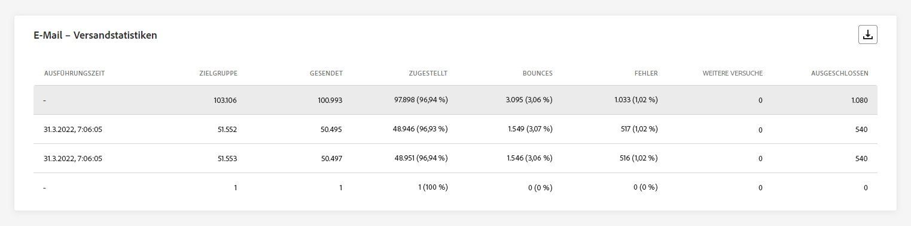

Die **[!UICONTROL Statistiken zum E-Mail-Versand]** bietet eine umfassende Zusammenfassung der wichtigsten Daten zu Ihren E-Mail-Kampagnen. Sie enthält wichtige Metriken wie die Größe der Zielgruppe und die Anzahl der erfolgreich zugestellten E-Mails und bietet wertvolle Einblicke in die Effektivität und Reichweite Ihrer E-Mails.

+++ Weitere Informationen zu Metriken für E-Mail-Versandstatistiken

* **[!UICONTROL Targeting]**: Gesamtzahl der während des Versandvorgangs verarbeiteten E-Mails.

* **[!UICONTROL Gesendet]**: Gesamtzahl der Sendevorgänge für Ihre E-Mail.

* **[!UICONTROL Zugestellt]**: Anzahl der erfolgreich gesendeten E-Mails in Bezug auf die Gesamtzahl der gesendeten Nachrichten.

* **[!UICONTROL Versandrate]**: Prozentsatz der erfolgreich gesendeten E-Mails.

* **[!UICONTROL Bounces]**: Gesamtzahl der kumulierten Fehler beim Versandvorgang und der automatischen Rücksendungen, bezogen auf die Gesamtzahl der gesendeten Nachrichten.

* **[!UICONTROL Bounce-Rate]**: Prozentsatz der E-Mails, die nicht erfolgreich zugestellt wurden, im Vergleich zur Zahl der gesendeten E-Mails.

* **[!UICONTROL Fehler]**: Gesamtzahl der während des Versandvorgangs aufgetretenen Fehler, die den Versand an Profile verhindert haben.

* **[!UICONTROL Fehlerrate]**: Prozentsatz der Fehler, die während des Versandvorgangs auftraten und die Zustellung verhinderten, im Vergleich zur Zahl der gesendeten E-Mails.

* **[!UICONTROL Weitere Zustellversuche]**: Anzahl der E-Mails in der Warteschlange für weitere Zustellversuche.

* **[!UICONTROL Ausgeschlossen]**: Anzahl der Profile, die durch Adobe Journey Optimizer ausgeschlossen wurden.

+++

### E-Mail – Tracking-Statistik {#tracking-statistics-email}

>[!CONTEXTUALHELP]
>id="ajo_campaign_global_email_tracking_statistics"
>title="E-Mail – Tracking-Statistik"
>abstract="Die Tabelle „E-Mail – Tracking-Statistik“ enthält Daten zur Profilaktivität für Ihre E-Mail."

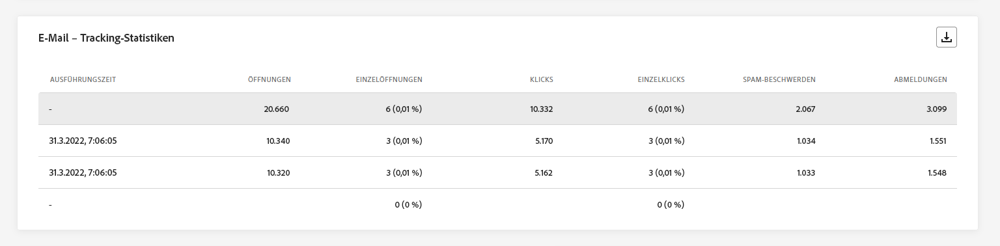

Die **[!UICONTROL E-Mail - Trackingstatistiken]** bietet einen detaillierten Überblick über die Profilaktivität im Zusammenhang mit Ihren E-Mail-Kampagnen. Dazu gehören Metriken zu Öffnungen, Klicks und andere relevante Interaktionsindikatoren, die einen umfassenden Überblick darüber bieten, wie Profile mit Ihrem E-Mail-Inhalt interagieren.

+++ Weitere Informationen zu E-Mail - Metriken zur Trackingstatistik

* **[!UICONTROL Öffnungen]**: Anzahl der Öffnungen der E-Mail.

* **[!UICONTROL Eindeutige Öffnungen]**: Prozentsatz der geöffneten E-Mails.

* **[!UICONTROL Öffnungsrate]**: Gesamtzahl der geöffneten E-Mails im Vergleich zu den versendeten E-Mails.

* **[!UICONTROL Klicks]**: Anzahl der Klicks auf einen Inhalt in Ihren E-Mails.

* **[!UICONTROL Einzelklicks]**: Anzahl der Profile, die auf einen Inhalt in einer E-Mail geklickt haben.

* **[!UICONTROL Eindeutige Klickrate]**: Prozentsatz der Benutzer, die mit Ihren E-Mails interagiert haben.

* **[!UICONTROL Abmeldungen]**: Zahl der Klicks auf den Abmelde-Link.

* **[!UICONTROL Beschwerden wegen Spam]**: Gibt an, wie oft eine Nachricht als Spam oder Junk gekennzeichnet wurde.

+++

### E-Mail - Versandleistung {#sending-performance-email}

>[!CONTEXTUALHELP]
>id="ajo_campaign_global_email_sending_performance"
>title="E-Mail – Versand-Performance"
>abstract="Das Leistungsdiagramm E-Mail - Versand enthält umfassende Daten zu gesendeten E-Mails und bietet Einblicke in wichtige Metriken wie zugestellt und Bounces, sodass eine detaillierte Analyse des E-Mail-Versandprozesses möglich ist."

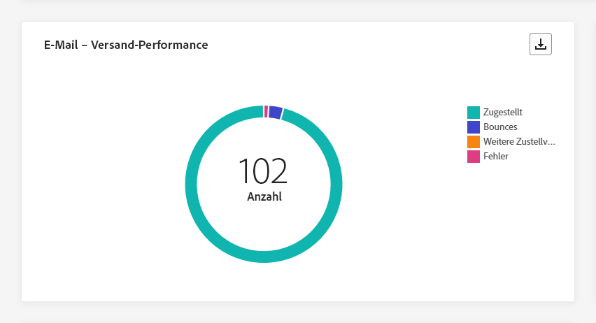

Die **[!UICONTROL E-Mail - Versandleistung]** -Diagramm bietet einen umfassenden Überblick über Daten zu gesendeten E-Mails und bietet Einblicke in wichtige Metriken wie zugestellt und Bounces. Dies ermöglicht eine detaillierte Analyse des E-Mail-Versandprozesses und liefert wertvolle Informationen über die Effizienz und Leistung Ihrer E-Mail-Kampagnen.

+++ Erfahren Sie mehr über E-Mail - Leistungsmetriken senden

* **[!UICONTROL Zugestellt]**: Anzahl der erfolgreich gesendeten E-Mails in Bezug auf die Gesamtzahl der gesendeten E-Mails.

* **[!UICONTROL Bounces]**: Gesamtzahl der Fehler, die während des Versandvorgangs kumuliert wurden, und der automatischen Bounce-Verarbeitung in Bezug auf die Gesamtzahl der gesendeten E-Mails.

* **[!UICONTROL Weitere Zustellversuche]**: Anzahl der E-Mails in der Warteschlange für weitere Zustellversuche.

* **[!UICONTROL Fehler]**: Gesamtzahl der während des Versandvorgangs aufgetretenen Fehler, die den Versand an Profile verhindert haben.

+++

### E-Mail - Bounce-Gründe und -Kategorien {#bounces-email}

>[!CONTEXTUALHELP]
>id="ajo_campaign_global_email_bounce_categories"
>title="E-Mail – Bounce-Kategorien"
>abstract="Die Graphen und die Tabelle „E-Mail – Bounce-Kategorien“ bieten Daten zu temporären und permanenten Fehlern."

>[!CONTEXTUALHELP]
>id="ajo_campaign_global_email_bounce_reasons"
>title="E-Mail – Bounce-Gründe"
>abstract="Die Graphen und die Tabelle „E-Mail – Ausschlussgründe“ enthalten die für Bounce-Nachrichten verfügbare Daten."

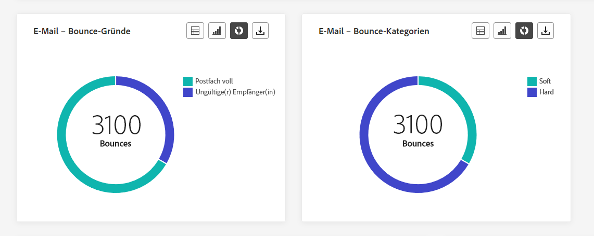

Die **[!UICONTROL E-Mail - Bounce-Gründe]** und **[!UICONTROL E-Mail - Bounce-Kategorien]** Widgets kompilieren die verfügbaren Daten zu Bounce Messages und bieten detaillierte Einblicke in die spezifischen Gründe und Kategorien hinter E-Mail-Bounces.

Weitere Informationen zu Bounces finden Sie auf der Seite [ Unterdrückungslisten](../reports/suppression-list.md).

+++ Weitere Informationen zu E-Mail - Metriken zu Bounce-Kategorien

* **[!UICONTROL Hardbounce]**: die Gesamtzahl der permanenten Fehler, wie eine falsche E-Mail-Adresse. Dazu gehören Fehlermeldungen, die explizit eine ungültige Adresse anzeigen, wie etwa „Benutzer unbekannt“.

* **[!UICONTROL Softbounce]**: die Gesamtzahl der temporären Fehler, wie ein voller Posteingang.

* **[!UICONTROL Ignoriert]**: Die Gesamtzahl der temporären Ereignisse, beispielsweise Abwesenheit, oder technischer Fehler, zum Beispiel wenn der Absendertyp Postmaster ist.

+++

### E-Mail – Fehlerursachen {#errors-email}

>[!CONTEXTUALHELP]
>id="ajo_campaign_global_email_error_reasons"
>title="E-Mail – Fehlerursachen"
>abstract="Anhand der Graphen und der Tabelle „E-Mail – Fehlerursachen“ können Sie die spezifischen Fehler identifizieren, die während des Versandvorgangs aufgetreten sind."

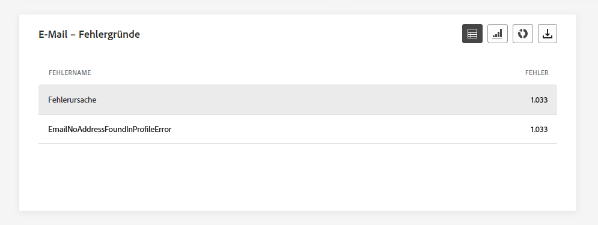

Die **[!UICONTROL Fehlerursachen]** Grafiken und Tabellen bieten einen Überblick über die spezifischen Fehler, die während des Versandvorgangs aufgetreten sind. Sie enthalten wertvolle Informationen über Art und Auftreten von Fehlern.

Sie können zwischen Tabellen, Balkendiagrammen oder Ringdiagrammen wechseln.

### E-Mail – Ausgeschlossene Gründe {#excluded-email}

>[!CONTEXTUALHELP]
>id="ajo_campaign_global_email_excluded_reasons"
>title="E-Mail – Ausgeschlossene Gründe"
>abstract="Die Graphen und die Tabelle „Ausgeschlossene Gründe“ veranschaulichen die verschiedenen Faktoren, die dazu führten, dass Benutzerprofile aus der Zielgruppe ausgeschlossen wurden und die Nachricht nicht erhielten."

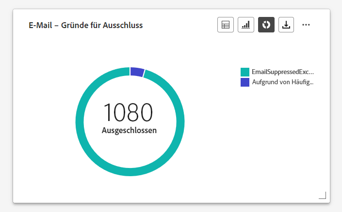

Die **[!UICONTROL Ausgeschlossene Gründe]** Grafiken und Tabellen bieten eine umfassende Übersicht über die verschiedenen Faktoren, die dazu geführt haben, dass Benutzerprofile aus der Zielgruppe ausgeschlossen wurden, sodass die Nachricht nicht empfangen wurde.

Siehe Abschnitt [diese Seite](exclusion-list.md) für die umfassende Liste der Ausschlussgründe.

### Von Domains gesendet und bereitgestellt {#sent-domains}

>[!CONTEXTUALHELP]
>id="ajo_campaign_global_email_sent_domains"
>title="Von Domains gesendet und bereitgestellt"
>abstract="Die Tabelle Gesendet und zugestellt nach Domains liefert eine Aufschlüsselung der E-Mails, die nach Domains kategorisiert sind, und bietet umfassende Einblicke in die Gesamtleistung Ihrer E-Mail-Kommunikation."

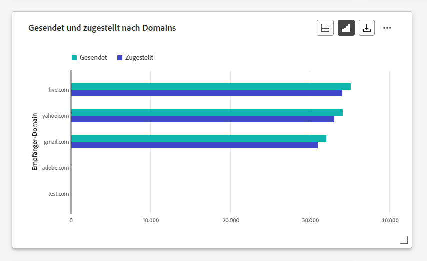

Die **[!UICONTROL Gesendet und von Domänen bereitgestellt]** Tabellen und Diagramme enthalten eine detaillierte Aufschlüsselung der E-Mails auf Domänenebene und bieten umfassende Einblicke in die Leistung Ihrer E-Mails.

+++ Weitere Informationen zu den Metriken Gesendet und Von Domänen bereitgestellt

* **[!UICONTROL Gesendet]**: Gesamtzahl der Sendevorgänge für Ihre E-Mail.

* **[!UICONTROL Zugestellt]**: Anzahl der erfolgreich gesendeten E-Mails in Bezug auf die Gesamtzahl der gesendeten E-Mails.

+++

### Bounces und Fehler nach Domains {#bounces-domains}

>[!CONTEXTUALHELP]
>id="ajo_campaign_global_email_bounces_domains"
>title="Bounces und Fehler nach Domains"
>abstract="Das Diagramm und die Tabelle &quot;Bounces &amp; Fehler nach Domänen&quot;bieten eine granulare Aufschlüsselung auf Domänenebene und bieten Einblicke in spezifische Fehler, die beim E-Mail-Versand aufgetreten sind."

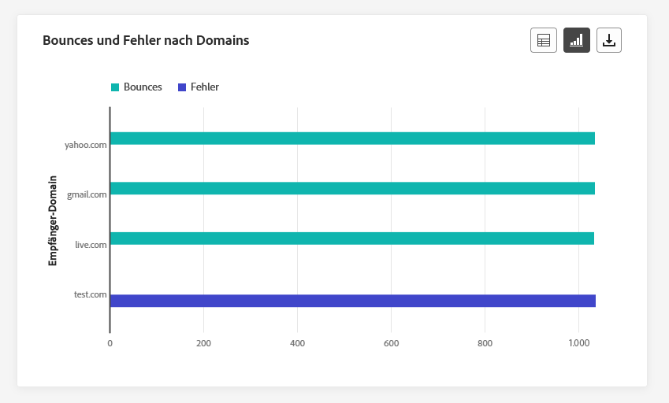

Die **[!UICONTROL Bounces und Fehler nach Domänen]** Diagramm und Tabelle bieten eine Aufschlüsselung der spezifischen Fehler, die während des Versandvorgangs auf Domänenebene aufgetreten sind, und enthalten eine detaillierte Analyse der aufgetretenen Probleme.

+++ Weitere Informationen zu den Metriken &quot;Absprünge und Fehler nach Domänen&quot;

* **[!UICONTROL Bounces]**: Gesamtzahl der Fehler, die während des Versandvorgangs kumuliert wurden, und der automatischen Bounce-Verarbeitung in Bezug auf die Gesamtzahl der gesendeten E-Mails.

* **[!UICONTROL Fehler]**: Gesamtzahl der Fehler, die während des Versandvorgangs aufgetreten sind und die Versendung Ihrer E-Mail an Profile verhindert haben.

+++

### Aufrufe und Klicks nach Domains {#opens-domains}

>[!CONTEXTUALHELP]
>id="ajo_campaign_global_email_open_domains"
>title="Aufrufe und Klicks nach Domains"
>abstract="Das Diagramm &quot;Öffnungen und Klicks nach Domänen&quot;und die Tabelle bieten eine detaillierte Aufschlüsselung auf Domänenebene, die einen umfassenden Überblick darüber bietet, wie Ihre Zielgruppe mit Ihren E-Mails interagiert."

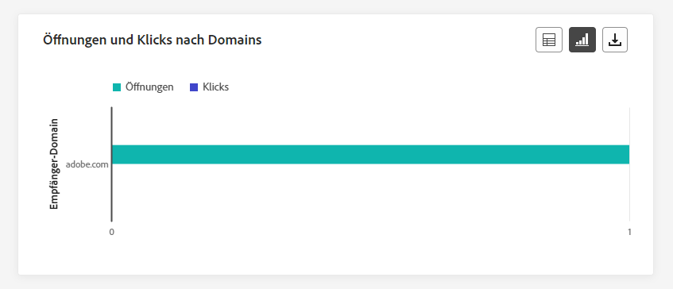

Die **[!UICONTROL Öffnungen und Klicks nach Domänen]** Diagramm und Tabelle zeigen eine Aufschlüsselung der Interaktion Ihrer Profile mit Ihrer E-Mail auf Domänenebene, die wertvolle Einblicke in die Interaktion verschiedener Domänen mit Ihrem Inhalt bietet.

+++ Weitere Informationen zu den Metriken &quot;Öffnungen und Klicks nach Domänen&quot;

* **[!UICONTROL Öffnungen]**: Anzahl der Öffnungen der E-Mail.

* **[!UICONTROL Klicks]**: Anzahl der Klicks auf einen Inhalt in einer E-Mail.

+++

### Bounce-Gründe nach Domain {#bounce-reasons-domains}

>[!CONTEXTUALHELP]
>id="ajo_campaign_global_email_bounces_reasons_domains"
>title="Bounce-Gründe nach Domain"
>abstract="Die Absprunggründe nach Domänendiagramm und Tabelle bieten eine Aufschlüsselung auf Domänenebene, die umfassende Einblicke in temporäre und permanente Fehler bietet. Diese detaillierte Analyse liefert Ihnen wertvolle Informationen über die spezifischen Gründe für nicht zugestellte Nachrichten."

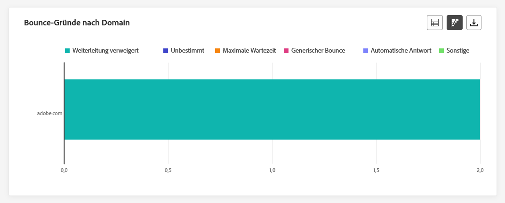

Die **[!UICONTROL Bounce-Gründe nach Domain]** Diagramme und Tabellen bieten eine Aufschlüsselung der Daten auf Domänenebene bezüglich temporärer und permanenter Fehler und bieten detaillierte Einblicke in die Ursachen für abgespeckte Nachrichten.

+++ Weitere Informationen zu Bounce-Gründen nach Domain-Metriken

* **[!UICONTROL Öffnungen]**: Anzahl der Öffnungen der E-Mail.

* **[!UICONTROL Klicks]**: Anzahl der Klicks auf einen Inhalt in einer E-Mail.

+++

### E-Mail – Beste URL {#top-url-email}

>[!CONTEXTUALHELP]
>id="ajo_campaign_global_email_top_url"
>title="E-Mail – Beste URL"
>abstract="Der Graph und die Tabelle „E-Mail – Beste URL“ bieten einen umfassenden Überblick über die URLs in Ihrer E-Mail, die den höchsten Besucher-Traffic erhalten, sodass Sie die beliebtesten Links identifizieren können."

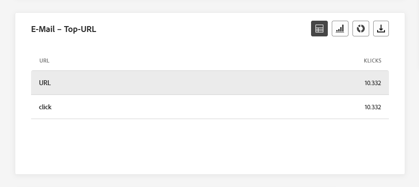

Die **[!UICONTROL Email - Top-URL]** Diagramm und Tabelle bieten einen umfassenden Überblick über die URLs in Ihrer E-Mail, die den höchsten Besucher-Traffic anziehen. Auf diese Weise können Sie die beliebtesten Links identifizieren und priorisieren und so Ihr Verständnis der Profilinteraktion mit bestimmten Inhalten in Ihren E-Mails verbessern.

### E-Mail – Beste Empfänger-Domain {#top-recipient-email}

>[!CONTEXTUALHELP]
>id="ajo_campaign_global_email_best_recipient"
>title="E-Mail – Beste Empfänger-Domain"
>abstract="Der Graph und die Tabelle „E-Mail – Beste Empfänger-Domain“ enthalten eine detaillierte Aufschlüsselung der Domains, die die Empfängerinnen und Empfänger am häufigsten zum Öffnen der E-Mail verwenden, und bieten wertvolle Einblicke in das Empfängerverhalten."

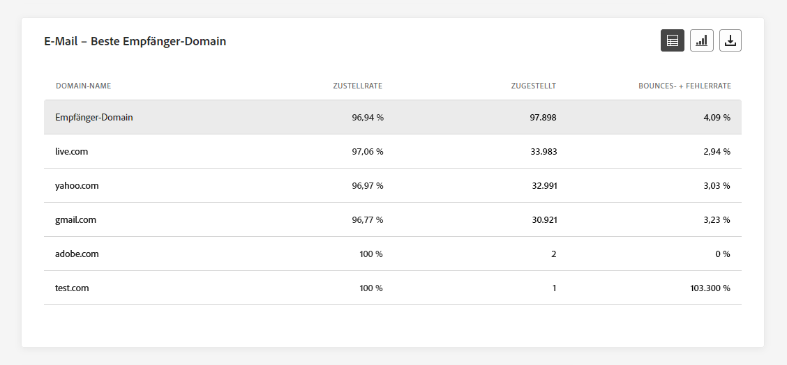

>[!CAUTION]
>
> Die **[!UICONTROL E-Mail - Beste Empfänger-Domain]** -Widget hat eine Genauigkeit von 99,95 %.

Die **[!UICONTROL E-Mail - Beste Empfänger-Domain]** Diagramm und Tabelle bieten eine detaillierte Aufschlüsselung der Domänen, die Profile am häufigsten zum Öffnen von E-Mails verwenden. Dies bietet wertvolle Einblicke in das Profilverhalten und hilft Ihnen, die bevorzugten Plattformen zu verstehen.

+++ Weitere Informationen zu E-Mail - Metriken zur besten Empfängerdomäne

* **[!UICONTROL Zugestellt]**: Anzahl der erfolgreich gesendeten E-Mails in Bezug auf die Gesamtzahl der gesendeten E-Mails.

* **[!UICONTROL Versandrate]**: Prozentsatz der erfolgreich gesendeten E-Mails.

* **[!UICONTROL Bounces + Fehlerrate]**: Prozentsatz der Bounce-E-Mails in Bezug auf die gesendeten E-Mails.

+++

### E-Mail - Optimierung {#optimized-email}

>[!NOTE]
>
>Die **[!UICONTROL Optimiert vs. nicht optimiert]** und **[!UICONTROL Versandzeitoptimierung]** Widgets sind nur verfügbar, wenn die Option Sendezeitoptimierung für Ihre E-Mail aktiviert ist. Weitere Informationen zur Sendezeitoptimierung finden Sie auf [dieser Seite](../building-journeys/journeys-message.md#send-time-optimization).

Die **[!UICONTROL Optimiert vs. nicht optimiert]** und **[!UICONTROL Versandzeitoptimierung]** Widgets zeigen die wichtigsten Informationen bezüglich Ihrer Nachricht an, ob sie optimiert wurden oder nicht.

+++ Weitere Informationen zu Versandzeitoptimierungsmetriken

* **[!UICONTROL Gesendet]**: Gesamtzahl der Sendevorgänge.

* **[!UICONTROL Öffnungen]**: Anzahl der Öffnungen der Nachricht.

* **[!UICONTROL Klicks]**: Anzahl der Klicks auf Inhalt einer E-Mail.

* **[!UICONTROL Zugestellt]**: Zahl der erfolgreich gesendeten Nachrichten im Vergleich zur Gesamtzahl der gesendeten Nachrichten.

* **[!UICONTROL Bounces]**: Gesamtzahl der kumulierten Fehler beim Versandvorgang und der automatischen Rücksendungen, bezogen auf die Gesamtzahl der gesendeten Nachrichten.

+++

### E-Mail - Angebote {#email-offers}

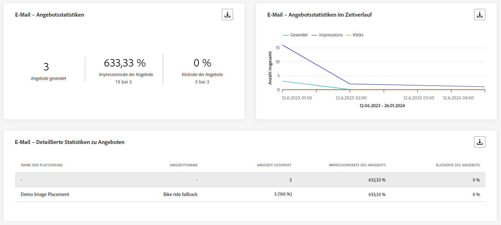

Die **[!UICONTROL Angebotsstatistiken]**, **[!UICONTROL Angebotsstatistiken im Zeitverlauf]** und **[!UICONTROL Detaillierte Statistiken]** -Widgets messen den Erfolg und die Wirkung Ihres Angebots auf Ihre Zielgruppe.

+++ Weitere Informationen zu E-Mail - Angebotsmetriken

* **[!UICONTROL Gesendete Angebote]**: Gibt an, wie oft das Angebot gesendet wurde.

* **[!UICONTROL Angebotseindruck]**: Gibt an, wie oft das Angebot in Ihren E-Mails geöffnet wurde.

* **[!UICONTROL Angebotsklicks]**: Anzahl der Klicks auf ein Angebot in Ihren E-Mails.

* **[!UICONTROL Platzierungsname]**: Name der Platzierung, die zur Anzeige Ihres Angebots verwendet wird. Weiterführende Informationen zu Platzierungen finden Sie auf dieser [Seite](../offers/offer-library/creating-placements.md).

* **[!UICONTROL Angebotsname]**: Name des im Versand hinzugefügten Angebots. Weiterführende Informationen zu Platzierungen finden Sie auf dieser [Seite](../offers/offer-library/creating-personalized-offers.md).

* **[!UICONTROL Angebot versendet]**: Gibt an, wie oft das Angebot insgesamt versendet wurde.

* **[!UICONTROL Impressionsrate des Angebots]**: Prozentsatz der geöffneten Angebote im Verhältnis zur Anzahl der gesendeten Angebote.

+++

## Registerkarte „In-App“ {#inapp-global}

In Ihrer Kampagne **[!UICONTROL Globaler Bericht]**, die **[!UICONTROL In-App]** im Tab werden die wichtigsten Informationen zu den in Ihrer Kampagne gesendeten In-App-Nachrichten aufgeführt.

### In-App-Performance {#in-app-performance}

>[!CONTEXTUALHELP]
>id="ajo_campaign_global_inapp_performance"
>title="In-App-Performance"
>abstract="Die KPIs zur In-App-Performance bieten wichtige Einblicke in die Interaktion Ihrer Besuchenden mit In-App-Nachrichten."

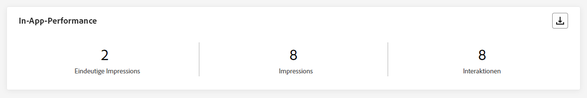

Die **[!UICONTROL In-App-Leistung]** KPIs bieten wichtige Einblicke in die Interaktion Ihrer Besucher mit In-App-Nachrichten und liefern wichtige Metriken, mit denen Sie die Effektivität und Wirkung Ihrer In-App-Kampagnen bewerten können.

+++ Erfahren Sie mehr über In-App-Leistungsmetriken

* **[!UICONTROL Eindeutige Impressions]**: Anzahl der eindeutigen Nutzer, an die die In-App-Nachricht gesendet wurde.

* **[!UICONTROL Impressions]**: Gesamtzahl der an alle Benutzer gesendeten In-App-Nachrichten.

* **[!UICONTROL Interaktionen]**: Gesamtzahl der Interaktionen mit Ihrer In-App-Nachricht. Dazu gehören alle von den Benutzenden durchgeführten Aktionen, wie z. B. Klicks, Abbrechen oder andere Interaktionen.

+++

### Interaktionen nach Typ {#interactions-type}

>[!CONTEXTUALHELP]
>id="ajo_campaign_global_inapp_interactions"
>title="Interaktionen nach Typ"
>abstract="Der Graph und die Tabelle „Interaktionen nach Typ“ beschreiben, wie Benutzende mit Ihrer In-App-Nachricht interagiert haben, indem Klicks, Abbrechen oder Interaktionen verfolgt werden."

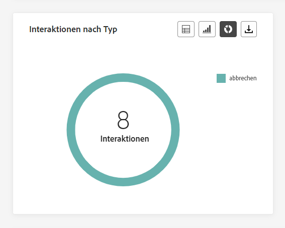

Die **[!UICONTROL Interaktionen nach Typ]** Grafiken und Tabellen enthalten eine detaillierte Darstellung der Interaktion von Profilen mit Ihrer In-App-Nachricht, der Verfolgung von Aktionen wie Klicks, Abweisungen oder anderen Formen der Interaktion.

### In-App-Zusammenfassung {#in-app-summary}

>[!CONTEXTUALHELP]
>id="ajo_campaign_global_inapp_summary"
>title="In-App-Zusammenfassung"
>abstract="Der Graph „In-App – Zusammenfassung“ zeigt die Entwicklung Ihrer In-App-Impressions und -Interaktionen für den jeweiligen Zeitraum an."

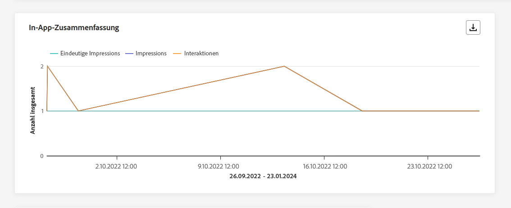

Die **[!UICONTROL In-App-Zusammenfassung]** Das Diagramm zeigt den Verlauf Ihrer In-App-Impressionen und -Interaktionen über den angegebenen Zeitraum und bietet einen umfassenden Überblick über die Leistung Ihrer In-App-Nachrichten.

+++ Erfahren Sie mehr über Metriken zur In-App-Zusammenfassung

* **[!UICONTROL Eindeutige Impressions]**: Anzahl der eindeutigen Nutzer, an die die In-App-Nachricht gesendet wurde.

* **[!UICONTROL Impressions]**: Gesamtzahl der an alle Benutzer gesendeten In-App-Nachrichten.

* **[!UICONTROL Interaktionen]**: Gesamtzahl der Interaktionen mit Ihrer In-App-Nachricht. Dazu gehören alle von den Benutzenden durchgeführten Aktionen, wie z. B. Klicks, Abbrechen oder andere Interaktionen.

+++

## Registerkarte „Push-Benachrichtigung“ {#push-global}

In Ihrer Kampagne **[!UICONTROL Globaler Bericht]**, die **[!UICONTROL Push-Benachrichtigung]** im Tab werden die wichtigsten Informationen zu den in Ihrer Kampagne gesendeten Push-Benachrichtigungen aufgeführt.

### Push-Benachrichtigung – Sendestatistik {#push-sending-statistics}

>[!CONTEXTUALHELP]
>id="ajo_campaign_global_push_sending_statistics"
>title="Push-Benachrichtigung – Sendestatistik"
>abstract="Die Tabelle „Push-Benachrichtigung – Sendestatistik“ fasst wesentliche Daten über Ihre Push-Benachrichtigungen zusammen, z. B. „Angesprochen“ oder „Zugestellte Nachrichten“."

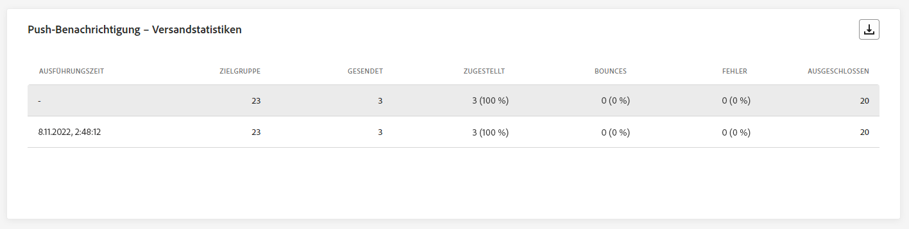

Die **[!UICONTROL Push-Benachrichtigung - Versandstatistiken]** bietet eine kurze Zusammenfassung wichtiger Daten zu Ihren Push-Benachrichtigungen, einschließlich Schlüsselmetriken wie der Anzahl der Zielkontakte und der Anzahl der erfolgreich zugestellten Nachrichten.

+++ Weitere Informationen zu Push-Benachrichtigungen - Metriken für Versandstatistiken

* **[!UICONTROL Ausführungszeit]**: Startzeit jeder Ausführung Ihrer wiederkehrenden Push-Benachrichtigung. Um nur eine oder mehrere wiederkehrende Push-Benachrichtigungen als Ziel auszuwählen, wählen Sie diese aus der Dropdown-Liste **[!UICONTROL Ausführungszeit]**.

* **[!UICONTROL Targeting]**: Gesamtzahl der während der Analyse verarbeiteten Push-Benachrichtigungen.

* **[!UICONTROL Gesendet]**: Gesamtzahl der Sendevorgänge für die Push-Benachrichtigung.

* **[!UICONTROL Zugestellt]**: Anzahl der erfolgreich gesendeten Push-Benachrichtigungen in Bezug auf die Gesamtzahl der gesendeten Push-Benachrichtigungen

* **[!UICONTROL Versandrate]**: Prozentsatz der erfolgreich gesendeten Push-Benachrichtigungen.

* **[!UICONTROL Bounces]**: Gesamtzahl der während des Versandvorgangs kumulierten Fehler und der automatischen Bounce-Verarbeitung in Bezug auf die Gesamtzahl der Push-Benachrichtigungen.

* **[!UICONTROL Bounce-Rate]**: Prozentsatz der Push-Benachrichtigungen, die unzustellbar waren, im Vergleich zu den gesendeten Push-Benachrichtigungen.

* **[!UICONTROL Fehler]**: Gesamtzahl der aufgetretenen Fehler, die die Zustellung an Profile verhindert haben.

* **[!UICONTROL Fehlerrate]**: Prozentualer Anteil der während des Versandvorgangs aufgetretenen Fehler, die den Versand verhindert haben, im Vergleich zu den gesendeten Push-Benachrichtigungen.

* **[!UICONTROL Ausgeschlossen]**: Anzahl der Profile, die durch Adobe Journey Optimizer ausgeschlossen wurden.

+++

### Push-Benachrichtigung – Tracking-Statistik {#push-tracking-statistics}

>[!CONTEXTUALHELP]
>id="ajo_campaign_global_push_tracking_statistics"
>title="Push-Benachrichtigung – Tracking-Statistik"
>abstract="Die Tracking-Statistik für Push-Benachrichtigungen bietet Daten zur Profilaktivität für Ihre Push-Benachrichtigung."

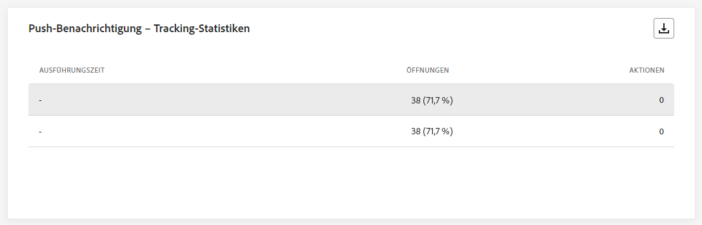

Die **[!UICONTROL Push-Benachrichtigung - Trackingstatistiken]** Widget bietet eine detaillierte Momentaufnahme der Profilaktivität, die mit Ihren Push-Benachrichtigungen verknüpft ist, und bietet wichtige Einblicke in die Interaktion und die Effektivität von Push-Benachrichtigungen.

+++ Weitere Informationen zu Push-Benachrichtigungen - Metriken zur Trackingstatistik

* **[!UICONTROL Ausführungszeit]**: Startzeit jeder Ausführung Ihrer wiederkehrenden Push-Benachrichtigung. Um nur eine oder mehrere wiederkehrende Push-Benachrichtigungen als Ziel auszuwählen, wählen Sie diese aus der Dropdown-Liste **[!UICONTROL Ausführungszeit]**.

* **[!UICONTROL Öffnungen]**: Gibt an, wie oft Ihre Push-Benachrichtigung geöffnet wurde.

* **[!UICONTROL Aktionen]**: Gesamtzahl der Aktionen, die bei der gesendeten Push-Benachrichtigung durchgeführt wurden, d. h. Klick auf Schaltfläche oder Abbruch.

+++

### Push-Benachrichtigung – Sendezusammenfassung {#push-summary}

>[!CONTEXTUALHELP]
>id="ajo_campaign_global_push_sending_summary"
>title="Push-Benachrichtigung – Sendezusammenfassung"
>abstract="Der Graph „Push-Benachrichtigung – Sendezusammenfassung“ zeigt die Daten an, die für gesendete Push-Benachrichtigungen verfügbar sind."

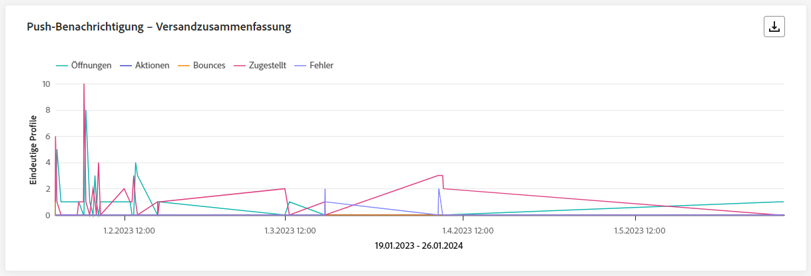

Die **[!UICONTROL Push-Benachrichtigung - Versandzusammenfassung]** -Diagramm bietet eine dynamische Darstellung mit einer Analyse Ihrer Push-Benachrichtigungs-Aktivität. Diese grafische Darstellung bietet eine umfassende Aufschlüsselung gesendeter Push-Benachrichtigungen.

+++ Erfahren Sie mehr über Push-Benachrichtigungen - Metriken zur Versandzusammenfassung

* **[!UICONTROL Öffnungen]**: Gibt an, wie oft Ihre Push-Benachrichtigung geöffnet wurde.

* **[!UICONTROL Aktionen]**: Gesamtzahl der Aktionen, die bei der gesendeten Push-Benachrichtigung durchgeführt wurden, d. h. Klick auf Schaltfläche oder Abbruch.

* **[!UICONTROL Bounces]**: Gesamtzahl der kumulierten Fehler und der automatischen Bounce-Verarbeitung in Bezug auf die Gesamtzahl der gesendeten Push-Benachrichtigungen

* **[!UICONTROL Zugestellt]**: Anzahl der erfolgreich gesendeten Push-Benachrichtigungen in Bezug auf die Gesamtzahl der gesendeten Push-Benachrichtigungen

* **[!UICONTROL Fehler]**: Gesamtzahl der aufgetretenen Fehler, die die Zustellung an Profile verhindert haben.

+++

### Push-Benachrichtigung - Optimierung {#push-optimized}

>[!NOTE]
>
>Die **[!UICONTROL Optimiert vs. nicht optimiert]** und **[!UICONTROL Versandzeitoptimierung]** -Widgets sind nur verfügbar, wenn die Option Sendezeitoptimierung für Ihre Push-Benachrichtigung aktiviert ist. Weitere Informationen zur Sendezeitoptimierung finden Sie auf [dieser Seite](../building-journeys/journeys-message.md#send-time-optimization).

Die **[!UICONTROL Optimiert vs. nicht optimiert]** und **[!UICONTROL Versandzeitoptimierung]** Widgets zeigen die wichtigsten Informationen bezüglich Ihrer Nachricht an, ob sie optimiert wurden oder nicht.

+++ Weitere Informationen zu Metriken zur Sendezeitoptimierung für Push-Benachrichtigungen

* **[!UICONTROL Zugestellt]**: Anzahl der erfolgreich gesendeten Push-Benachrichtigungen in Bezug auf die Gesamtzahl der gesendeten Push-Benachrichtigungen

* **[!UICONTROL Öffnungen]**: Gibt an, wie oft Ihre Push-Benachrichtigung geöffnet wurde.

* **[!UICONTROL Aktionen]**: Gesamtzahl der Aktionen, die bei der gesendeten Push-Benachrichtigung durchgeführt wurden, d. h. Klick auf Schaltfläche oder Abbruch.

* **[!UICONTROL Bounces]**: Gesamtzahl der während des Versandvorgangs kumulierten Fehler und der automatischen Bounce-Verarbeitung in Bezug auf die Gesamtzahl der gesendeten Push-Benachrichtigungen.

+++

### Push-Benachrichtigung – Fehlerursachen {#error-reasons-push}

>[!CONTEXTUALHELP]
>id="ajo_campaign_global_push_error_reasons"
>title="Push-Benachrichtigung – Fehlerursachen"
>abstract="Anhand der Graphen und der Tabelle „Fehlerursachen“ können Sie die spezifischen Fehler identifizieren, die während des Versandvorgangs aufgetreten sind."

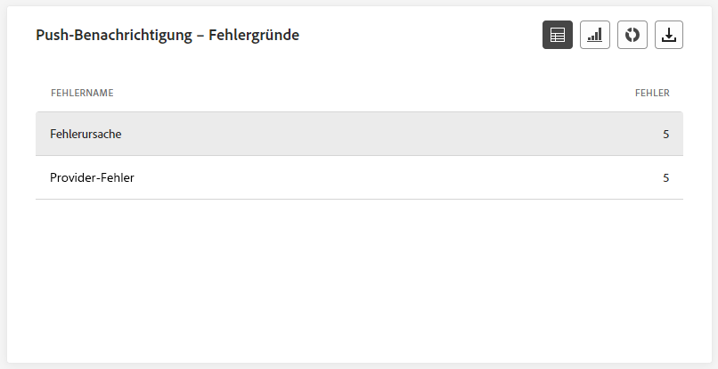

Die **[!UICONTROL Fehlerursachen]** Tabellen und Diagramme bieten Ihnen die Möglichkeit, spezifische Fehler zu identifizieren, die während des Versandvorgangs Ihrer Push-Benachrichtigungen aufgetreten sind. So erhalten Sie detaillierte Einblicke in Probleme, die während des Versandvorgangs aufgetreten sind.

### Push-Benachrichtigung – Ausschlussursachen {#excluded-push}

>[!CONTEXTUALHELP]
>id="ajo_campaign_global_push_excluded_reasons"
>title="Push-Benachrichtigung – Ausschlussursachen"
>abstract="Die Graphen und die Tabelle „Ausgeschlossene Gründe“ veranschaulichen die verschiedenen Faktoren, die dazu führten, dass Benutzerprofile aus der Zielgruppe ausgeschlossen wurden und die Nachricht nicht erhielten."

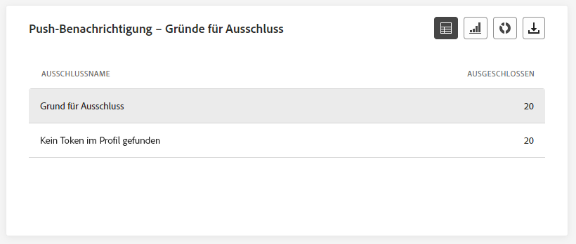

Die **[!UICONTROL Ausgeschlossene Gründe]** Grafiken und Tabellen zeigen die unterschiedlichen Gründe an, die verhindern, dass aus den Zielgruppenprofilen ausgeschlossene Benutzerprofile Ihre Push-Benachrichtigungen empfangen.

Siehe Abschnitt [diese Seite](exclusion-list.md) für die umfassende Liste der Ausschlussgründe.

### Push-Benachrichtigung – Aufschlüsselung nach Plattform {#breakdown-platform-push}

>[!CONTEXTUALHELP]
>id="ajo_campaign_global_push_breakdown_platform"
>title="Push-Benachrichtigung – Aufschlüsselung nach Plattform"
>abstract="Die Tabelle Push-Benachrichtigung - Aufschlüsselung nach Platform-Diagrammen und -Tabellen enthält eine Aufschlüsselung des Erfolgs Ihrer Push-Benachrichtigungen nach dem Betriebssystem des Profils."

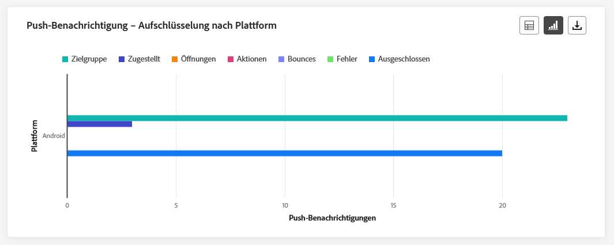

Die **[!UICONTROL Push-Benachrichtigung - Verteilung nach Plattform]** Diagramme und Tabellen enthalten eine detaillierte Analyse des Erfolgs Ihrer Push-Benachrichtigungen und bieten Einblicke auf der Basis des Betriebssystems Ihres Profils. Diese Aufschlüsselung verbessert Ihr Verständnis der Leistung Ihrer Push-Benachrichtigungen auf verschiedenen Plattformen.

+++ Weitere Informationen zu Push-Benachrichtigungen - Aufschlüsselung nach Plattformmetriken

* **[!UICONTROL Targeting]**: Gesamtzahl der während der Analyse verarbeiteten Push-Benachrichtigungen.

* **[!UICONTROL Zugestellt]**: Anzahl der erfolgreich gesendeten Push-Benachrichtigungen in Bezug auf die Gesamtzahl der gesendeten Push-Benachrichtigungen

* **[!UICONTROL Öffnungen]**: Gibt an, wie oft Ihre Push-Benachrichtigung geöffnet wurde.

* **[!UICONTROL Aktionen]**: Gesamtzahl der Aktionen, die bei der gesendeten Push-Benachrichtigung durchgeführt wurden, d. h. Klick auf Schaltfläche oder Abbruch.

* **[!UICONTROL Bounces]**: Gesamtzahl der kumulierten Fehler und der automatischen Bounce-Verarbeitung in Bezug auf die Gesamtzahl der gesendeten Push-Benachrichtigungen

* **[!UICONTROL Fehler]**: Gesamtzahl der aufgetretenen Fehler, die die Zustellung an Profile verhindert haben.

* **[!UICONTROL Ausgeschlossen]**: Anzahl der Profile, die durch Adobe Journey Optimizer ausgeschlossen wurden.

+++

## Registerkarte „SMS“ {#sms-global}

In Ihrer Kampagne **[!UICONTROL Globaler Bericht]**, die **[!UICONTROL SMS]** im Tab werden die wichtigsten Informationen zu den in Ihrer Kampagne gesendeten SMS-Nachrichten aufgeführt.

### SMS – Sendestatistik {#sms-sending-statistics}

>[!CONTEXTUALHELP]
>id="ajo_campaign_global_sms_sending_statistics"
>title="SMS – Sendestatistik"
>abstract="Die Tabelle SMS - Versandstatistiken enthält eine Zusammenfassung der wichtigsten Daten zu Ihren SMS-Nachrichten, z. B. Zielgerichtete oder zugestellte Nachrichten."

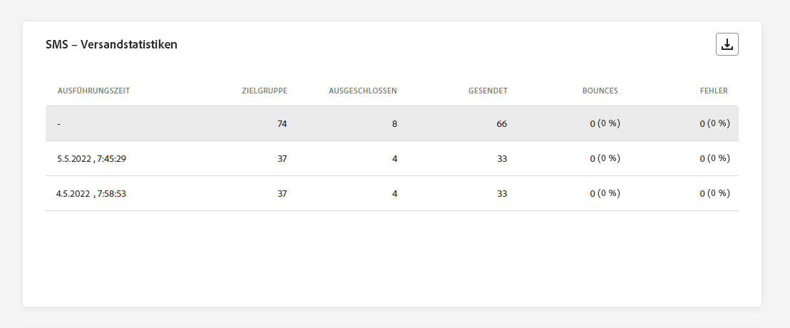

Die **[!UICONTROL SMS - Versandstatistiken]** bietet eine kurze Zusammenfassung wichtiger Daten zu Ihren SMS-Nachrichten, die wichtige Metriken wie die Anzahl der Zielkontakte und die Anzahl der erfolgreich zugestellten Nachrichten umfassen.

+++ Weitere Informationen zu SMS - Metriken für Versandstatistiken

* **[!UICONTROL Ausführungszeit]**: Startzeit jeder Ausführung Ihrer wiederkehrenden SMS-Nachricht. Um nur eine oder mehrere wiederkehrende SMS-Nachrichten auszuwählen, wählen Sie die gewünschte Option in der Dropdown-Liste **[!UICONTROL Ausführungszeit]** aus.

* **[!UICONTROL Angesprochen]**: Anzahl der Benutzerprofile, die sich als Zielgruppenprofile für diesen Versand eignen.

* **[!UICONTROL Ausgeschlossen]**: Anzahl der Benutzerprofile, die von den Zielgruppenprofilen ausgeschlossen waren und die die Nachricht nicht erhalten haben.

* **[!UICONTROL Gesendet]**: Gesamtzahl der Sendevorgänge für Ihre SMS-Nachrichten.

* **[!UICONTROL Bounces]**: Gesamtzahl der im Versand- und automatischen Bounce-Prozesse kumulierten Fehler in Bezug auf die Gesamtzahl der gesendeten SMS-Nachrichten.

* **[!UICONTROL Fehler]**: Gesamtzahl der aufgetretenen Fehler, die die Zustellung an Profile verhindert haben.

+++

### SMS - Trackingstatistiken {#sms-tracking-statistics}

>[!CONTEXTUALHELP]
>id="ajo_campaign_sms_tracking_statistics"
>title="SMS - Trackingstatistiken"
>abstract="Das Widget SMS - Trackingstatistiken bietet einen umfassenden Überblick über die wichtigsten Informationen zur Interaktion Ihrer Besucher mit Ihrer URL."

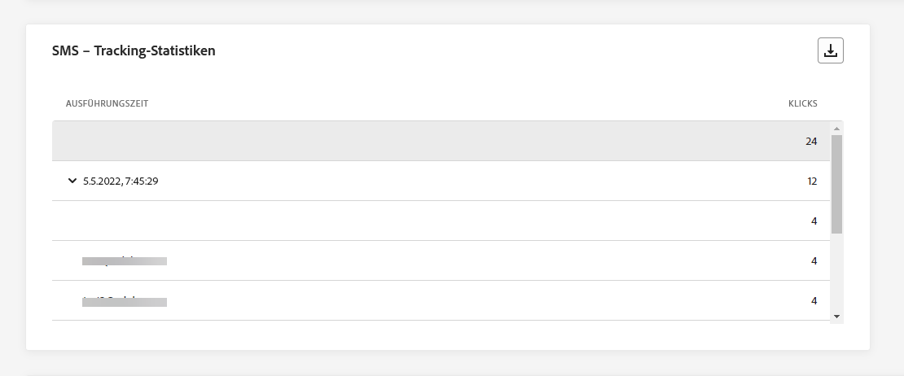

Die **[!UICONTROL SMS - Trackingstatistiken]** Widget bietet einen detaillierten Überblick über wichtige Informationen zur Interaktion Ihrer Besucher mit Ihren URLs und bietet Einblicke in die Effektivität Ihrer SMS-Nachrichten.

+++ Erfahren Sie mehr über SMS - Trackingstatistiken - Metriken

* **[!UICONTROL Ausführungszeit]**: Startzeit jeder Ausführung Ihrer wiederkehrenden SMS. Um nur eine oder mehrere wiederkehrende SMS als Zielgruppe auszuwählen, wählen Sie diese aus der **[!UICONTROL Ausführungszeit]** angezeigt.

* **[!UICONTROL Klicks]**: Anzahl der Klicks auf einen Inhalt in einer SMS-Nachricht.

+++

### SMS – Performance nach Datum {#sms-perfomance-date}

>[!CONTEXTUALHELP]
>id="ajo_campaign_global_sms_performance"
>title="SMS – Performance nach Datum"
>abstract="Das Widget - SMS-Leistung nach Datum liefert wichtige Informationen über Ihre Nachrichten in einer grafischen Darstellung."

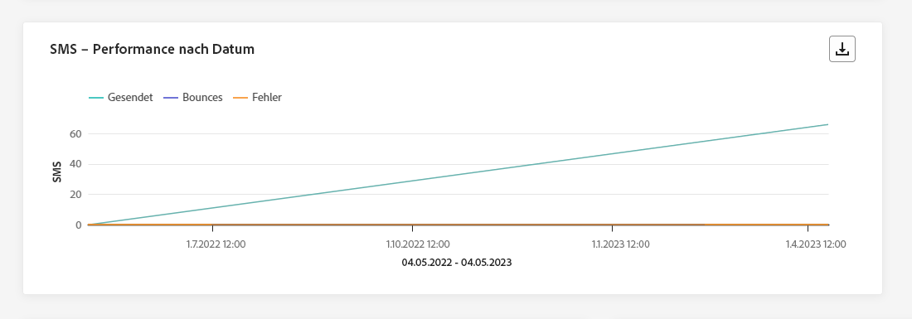

Die **[!UICONTROL SMS-Leistung nach Datum]** -Widget bietet einen detaillierten Überblick über wichtige Informationen zu Ihren Nachrichten, die über ein Diagramm präsentiert werden, und bietet Einblicke in die Leistungstrends über bestimmte Zeiträume.

+++ Erfahren Sie mehr über SMS - Leistung nach Datumsmetriken

* **[!UICONTROL Gesendet]**: Gesamtzahl der Sendevorgänge für Ihre SMS-Nachrichten.

* **[!UICONTROL Bounces]**: Gesamtzahl der im Versand- und automatischen Bounce-Prozesse kumulierten Fehler in Bezug auf die Gesamtzahl der gesendeten SMS-Nachrichten.

* **[!UICONTROL Fehler]**: Gesamtzahl der aufgetretenen Fehler, die die Zustellung an Profile verhindert haben.

+++

### SMS – Fehlerursachen {#sms-error}

>[!CONTEXTUALHELP]
>id="ajo_campaign_global_sms_error_reasons"
>title="SMS – Fehlerursachen"
>abstract="Anhand der Graphen und der Tabelle „SMS – Fehlerursachen“ können Sie die spezifischen Fehler identifizieren, die während des Versandvorgangs aufgetreten sind."

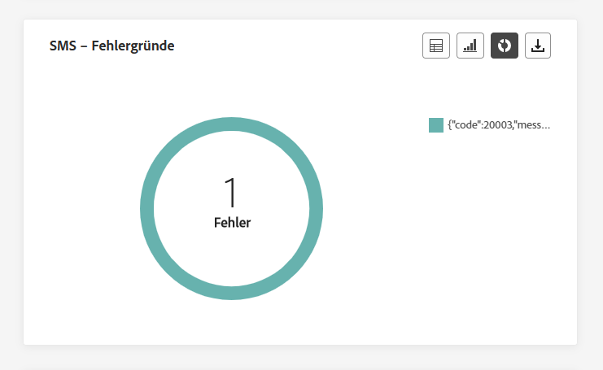

Die **[!UICONTROL Fehlerursachen]** Anhand von Diagrammen und Tabellen können Sie die spezifischen Fehler identifizieren, die während des Versandvorgangs Ihrer SMS aufgetreten sind. Dies ermöglicht eine gründliche Analyse aller aufgetretenen Probleme.

### SMS – Ausschlussursachen {#sms-excluded-reasons}

>[!CONTEXTUALHELP]
>id="ajo_campaign_global_sms_excluded_reasons"
>title="SMS – Ausschlussursachen"
>abstract="Die Graphen und die Tabelle „Ausgeschlossene Gründe“ veranschaulichen die verschiedenen Faktoren, die dazu führten, dass Benutzerprofile aus der Zielgruppe ausgeschlossen wurden und die Nachricht nicht erhielten."

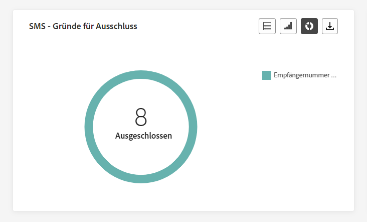

Die **[!UICONTROL Ausschlussgründe]** Grafiken und Tabellen zeigen visuell die verschiedenen Faktoren an, die zum Ausschluss von Benutzerprofilen aus der Zielgruppe geführt haben, sodass diese keine SMS-Nachrichten erhalten können.

Siehe Abschnitt [diese Seite](exclusion-list.md) für die umfassende Liste der Ausschlussgründe.

### SMS – Bounce-Ursachen {#sms-bounces-reasons}

>[!CONTEXTUALHELP]
>id="ajo_campaign_global_sms_bounces_reasons"
>title="SMS – Bounce-Ursachen"
>abstract="Die Graphen und die Tabelle „Bounce-Gründe“ enthalten die verfügbaren Daten zu Bounce-Nachrichten."

Die **[!UICONTROL Bounces-Gründe]** Grafiken und Tabellen bieten einen umfassenden Überblick über Daten zu Bounce-SMS-Nachrichten und liefern wertvolle Einblicke in die spezifischen Ursachen von SMS-Bounces.

### SMS – Klicks nach Links {#sms-clicks-links}

>[!CONTEXTUALHELP]
>id="ajo_campaign_global_sms_clicks_links"
>title="SMS – Klicks nach Links"
>abstract="Das Widget SMS - Klicks nach Links bietet wichtige Einblicke in die Interaktion Ihrer Besucher mit den URLs in Ihren Nachrichten."

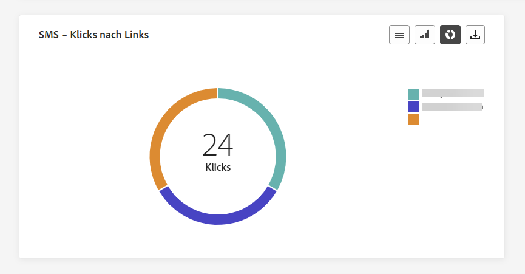

Die **[!UICONTROL SMS - Klicks nach Links]** Widget bietet wichtige Einblicke in die Interaktion Ihrer Besucher mit den in Ihren Nachrichten enthaltenen URLs und liefert wertvolle Informationen darüber, welche Links die meisten Interaktionen hervorrufen.

## Registerkarte „Web“ {#web-tab}

Im **[!UICONTROL globalen Bericht]** Ihrer Kampagne werden in der Registerkarte **[!UICONTROL Web]** die wichtigsten Informationen zu Ihren Web-Seiten aufgeführt.

### Web-Performance {#web-performance}

>[!CONTEXTUALHELP]
>id="ajo_campaign_global_web_performance"
>title="Web-Performance"
>abstract="Die Web-Performance-KPIs bieten umfassende Informationen über die Interaktion Ihrer Besucherinnen und Besucher mit Ihren Web-Erlebnissen."

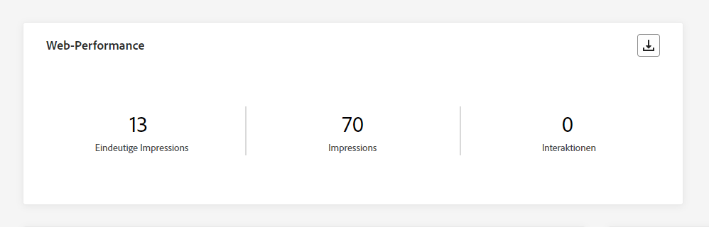

Die **[!UICONTROL Webleistung]** KPIs bieten umfassende Einblicke in die Interaktion Ihrer Besucher mit Ihren Webseiten, einschließlich Schlüsselmetriken wie Impressionen und Interaktionen.

+++ Weitere Informationen zu Webleistungsmetriken

* **[!UICONTROL Eindeutige Impressions]**: Anzahl der eindeutigen Benutzer, denen das Web-Erlebnis bereitgestellt wurde.

* **[!UICONTROL Impressions]**: Gesamtanzahl der für alle Benutzer bereitgestellten Web-Erlebnisse.

* **[!UICONTROL Interaktionsrate]**: Prozentsatz der Interaktionen mit Ihrer Web-Seite. Dazu gehören alle von den Benutzenden durchgeführten Aktionen, wie z. B. Klicks oder andere Interaktionen.

+++

### Web-Zusammenfassung {#web-summary}

>[!CONTEXTUALHELP]
>id="ajo_campaign_global_web_summary"
>title="Web-Zusammenfassung"
>abstract="Das Diagramm „Web – Zusammenfassung“ zeigt die Entwicklung Ihrer Web-Erlebnisse (Impressions, eindeutige Impressions und Interaktionen) für den jeweiligen Zeitraum."

Das Diagramm **[!UICONTROL Web-Zusammenfassung]** zeigt die Entwicklung Ihrer Web-Erlebnisse (Impressions, eindeutige Impressions und Interaktionen) für den jeweiligen Zeitraum.

+++ Weitere Informationen zu Metriken mit Webzusammenfassungen

* **[!UICONTROL Eindeutige Impressions]**: Anzahl der eindeutigen Benutzer, denen das Web-Erlebnis bereitgestellt wurde.

* **[!UICONTROL Impressions]**: Gesamtanzahl der für alle Benutzer bereitgestellten Web-Erlebnisse.

* **[!UICONTROL Interaction]**: Gesamtzahl der Interaktionen mit Ihrer Webseite. Dazu gehören alle von den Benutzenden durchgeführten Aktionen, wie z. B. Klicks oder andere Interaktionen.

+++

### Interaktionen nach Element {#web-interactions}

>[!CONTEXTUALHELP]
>id="ajo_campaign_global_web_interactions"
>title="Interaktionen nach Element"
>abstract="Die Tabelle „Interaktionen nach Element“ enthält wichtige Informationen zur Interaktion Ihrer Besucherinnen und Besucher mit verschiedenen Elementen auf Ihren Web-Seiten."

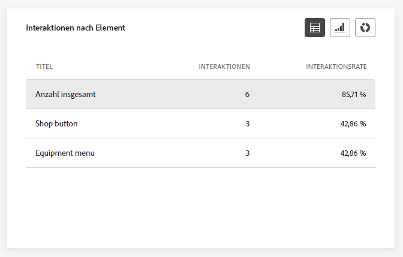

Die **[!UICONTROL Interaktionen nach Element]** -Tabelle enthält umfassende Informationen zur Interaktion Ihrer Besucher mit den verschiedenen Elementen auf Ihren Webseiten und bietet wertvolle Einblicke in Benutzerinteraktionen und -präferenzen.

+++ Weitere Informationen zu Interaktionen nach Elementmetriken

* **[!UICONTROL Interaction]**: Gesamtzahl der Interaktionen mit Ihrer Webseite. Dazu gehören alle von den Benutzenden durchgeführten Aktionen, wie z. B. Klicks oder andere Interaktionen.

* **[!UICONTROL Interaktionsrate]**: Prozentsatz der Interaktionen mit Ihrer Web-Seite. Dazu gehören alle von den Benutzenden durchgeführten Aktionen, wie z. B. Klicks oder andere Interaktionen.

+++

## Registerkarte „Briefpost“ {#direct-mail-global}

In Ihrer Kampagne **[!UICONTROL Globaler Bericht]**, die **[!UICONTROL Briefpost]** im Tab werden die wichtigsten Informationen zu Ihren Briefpost-Nachrichten aufgeführt.

### Briefpost – Versandstatistik {#direct-mail-sending-statistics}

>[!CONTEXTUALHELP]
>id="ajo_campaign_global_direct_sending_statistics"
>title="Briefpost – Versandstatistik"
>abstract="Die Tabelle „Briefpost – Versandstatistiken“ enthält eine Zusammenfassung der wichtigsten Daten zu Ihren Briefpost-Nachrichten, wie z. B. „Angesprochen“ oder „Zugestellte Nachrichten“."

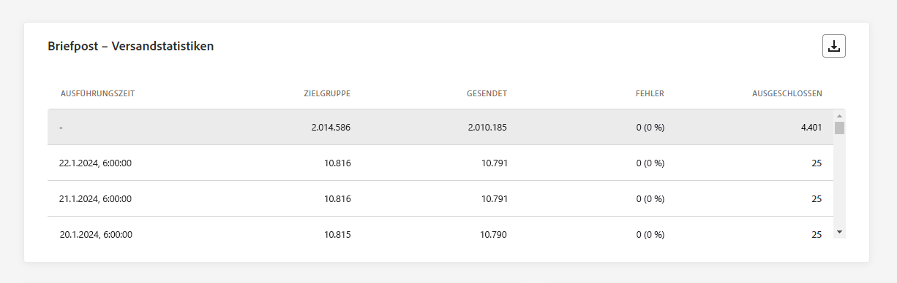

Die **[!UICONTROL Briefpost - Versandstatistiken]** bietet eine kurze Zusammenfassung wichtiger Daten zu Ihren Briefpost-Nachrichten, die wichtige Metriken wie die Anzahl der Zielkontakte und die Anzahl der erfolgreich zugestellten Nachrichten umfassen.

+++ Weitere Informationen zu Briefpost - Metriken zur Versandstatistik

* **[!UICONTROL Ausführungszeit]**: Startzeit jeder Ausführung Ihrer wiederkehrenden Briefpost. Um nur eine oder mehrere wiederkehrende Briefpost festzulegen, wählen Sie die gewünschte Option in der Dropdown-Liste **[!UICONTROL Ausführungszeit]** aus.

* **[!UICONTROL Targeting]**: Anzahl der Benutzerprofile, die als Zielprofile für Ihre Briefpost-Nachrichten gelten.

* **[!UICONTROL Gesendet]**: Gesamtzahl der gesendeten Briefpost-Nachrichten.

* **[!UICONTROL Fehler]**: Gesamtzahl der während des Versandvorgangs aufgetretenen Fehler, die den Versand an Profile verhindert haben.

* **[!UICONTROL Ausgeschlossen]**: Anzahl der Benutzerprofile, die von den Zielgruppenprofilen ausgeschlossen wurden und Ihre Briefpost-Nachrichten nicht erhalten haben.

+++

### Briefpost – Fehlerursachen {#direct-mail-error}

>[!CONTEXTUALHELP]
>id="ajo_campaign_global_direct_error_reasons"
>title="Briefpost – Fehlerursachen"
>abstract="Die Graphen und die Tabelle „Briefpost – Fehlerursachen“ ermöglichen es Ihnen, die spezifischen Fehler zu identifizieren, die während des Versandvorgangs aufgetreten sind."

Die **[!UICONTROL Briefpost - Fehlerursachen]** Grafiken und Tabellen bieten die Möglichkeit, spezifische Fehler zu identifizieren, die während des Versandvorgangs Ihrer Briefpost-Nachrichten aufgetreten sind. So können etwaige aufgetretene Probleme detailliert analysiert werden.

### Briefpost – Ausschlussgründe {#direct-mail-excluded}

>[!CONTEXTUALHELP]
>id="ajo_campaign_global_direct_excluded_reasons"
>title="Briefpost – Ausschlussgründe"
>abstract="Die Graphen und die Tabelle mit Ausschlussgründen für den Direktversand veranschaulichen, warum Benutzerprofile, die von der Zielgruppe ausgeschlossen waren, die Nachricht nicht erhielten."

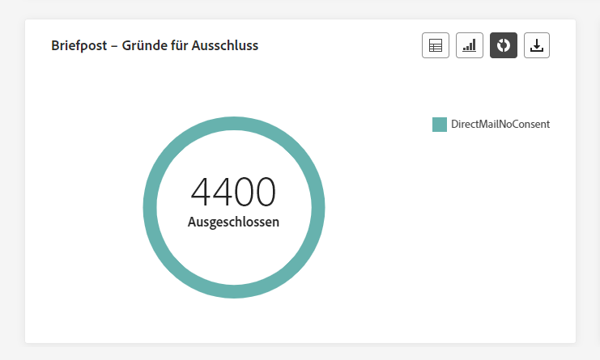

Die **[!UICONTROL Briefpost - Ausgeschlossene Gründe]** Grafiken und Tabellen veranschaulichen visuell die verschiedenen Faktoren, die zum Ausschluss von Benutzerprofilen aus der Zielgruppe führten, sodass diese keine Briefpost-Nachrichten erhalten konnten.

Siehe Abschnitt [diese Seite](exclusion-list.md) für die umfassende Liste der Ausschlussgründe.

## Weitere Ressourcen

* [Erste Schritte mit Kampagnen](../campaigns/get-started-with-campaigns.md)
* [Erstellen einer Kampagne](../campaigns/create-campaign.md)
* [Erstellen von API-ausgelösten Kampagnen](../campaigns/api-triggered-campaigns.md)
* [Ändern oder Stoppen einer Kampagne](../campaigns/modify-stop-campaign.md)
* [Kampagnen-Live-Bericht](campaign-live-report.md)
