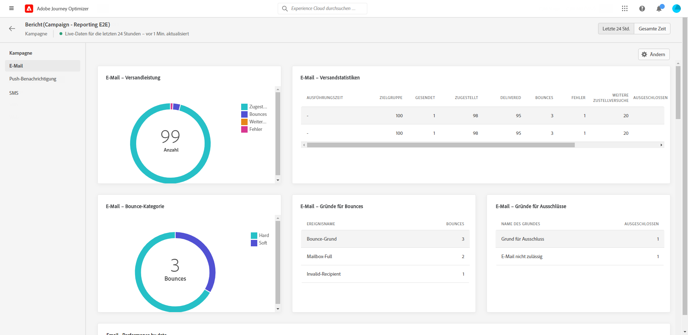
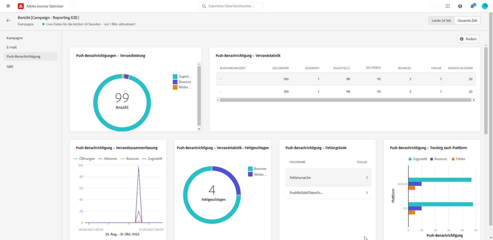
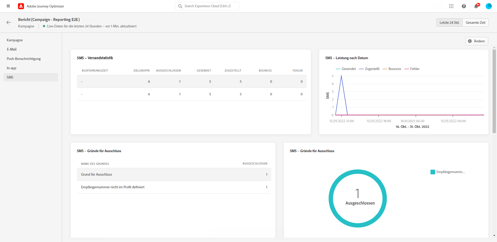

# Kampagnen-Live-Bericht {#campaign-live-report}

>[!CONTEXTUALHELP]
>id="ajo_campaign_live_report"
>title="Kampagnen-Live-Bericht"
>abstract="Mit dem Kampagnen-Live-Bericht kann die Wirkung und Leistung von Kampagnen nur in den letzten 24 Stunden in Echtzeit gemessen und visualisiert werden. Der Bericht ist in verschiedene Widgets unterteilt, die den Erfolg und die Fehler der Kampagne detailliert darstellen. Jedes Reporting-Dashboard kann durch Ändern der Größe oder Entfernen von Widgets verändert werden."

Über die Schaltfläche **[!UICONTROL Live-Ansicht]** können Sie direkt in Ihrer Campaign-Instanz auf den Live-Bericht in Campaign zugreifen.

Die Seite **[!UICONTROL Live-Bericht]** in Campaign wird mit den folgenden Registerkarten angezeigt:

* [Campaign](#campaign-live)
* [E-Mail](#email-live)
* [Push-Benachrichtigung](#push-live)
* [SMS](#sms-live)
* [Web](#web-tab)

Der **[!UICONTROL Live-Bericht]** in Campaign ist in verschiedene Widgets unterteilt, die Erfolge und Fehler bei Ihrer Kampagne detailliert beschreiben. Jedes Widget kann bei Bedarf angepasst und gelöscht werden. Weiterführende Informationen dazu finden Sie in diesem [Abschnitt](../reports/live-report.md#modify-dashboard).

Eine detaillierte Liste aller in Adobe Journey Optimizer verfügbaren Metriken finden Sie auf [dieser Seite](live-report.md#list-of-components-live).

## Registerkarte „Kampagne“ {#campaign-global}

### Versand {#delivery-global}

Das Widget **[!UICONTROL Kampagnenstatistiken]** enthält die wichtigsten Informationen zu Ihrer Kampagne:

* **[!UICONTROL Eingetretene Profile]**: Anzahl der Profile, die mit der Journey begonnen haben.

<!--
### Experimentation tab (#experimentation-live)

From your Campaign **[!UICONTROL Live report]**, the **[!UICONTROL Experimentation]** tab details the main information relative to how each variant is performing and if there is was winner during the test.
-->

## Registerkarte „E-Mail“ {#email-live}

In Ihrem **[!UICONTROL Live-Bericht]** in Campaign finden Sie auf der Registerkarte **[!UICONTROL E-Mail]** die wichtigsten Informationen zu den E-Mail-Nachrichten, die in Ihrer Kampagne gesendet wurden.

+++ Erfahren Sie mehr über die verschiedenen Metriken und Widgets, die für den E-Mail-Bericht verfügbar sind.

Das Widget **[!UICONTROL E-Mail-Versandstatistik]** enthält die wichtigsten Informationen zu Ihrer Nachricht:

* **[!UICONTROL Zugestellt]**: Die Anzahl der erfolgreich gesendeten Nachrichten.

* **[!UICONTROL Bounces]**: Gesamtzahl der kumulierten Fehler beim Versand und der automatischen Bounce-Verarbeitung.

* **[!UICONTROL Fehler]**: Gesamtanzahl der Fehler, die während des Versands aufgetreten sind und die Zustellung an Profile verhinderten.

Die Tabelle **[!UICONTROL Versandmetriken nach E-Mail]** und das Diagramm **[!UICONTROL E-Mail-Zusammenfassung]** zeigen, wie erfolgreich Ihr Versand war:

* **[!UICONTROL Gesendet]**: Gesamtzahl der gesendeten Nachrichten.

* **[!UICONTROL Zugestellt]**: Die Anzahl der erfolgreich gesendeten Nachrichten.

* **[!UICONTROL Bounces]**: Gesamtzahl der kumulierten Fehler beim Versand und der automatischen Bounce-Verarbeitung.

* **[!UICONTROL Fehler]**: Gesamtanzahl der Fehler, die während des Versands aufgetreten sind und die Zustellung an Profile verhinderten.

* **[!UICONTROL Öffnungen]**: Anzahl der Öffnungen einer Nachricht in einem Versand.

* **[!UICONTROL Klicks]**: Anzahl der Klicks auf einen Inhalt in einem Versand.

* **[!UICONTROL Abo beenden]**: Zahl der Klicks auf den Abmelde-Link.

* **[!UICONTROL Beschwerden wegen Spam]**: Gibt an, wie oft eine Nachricht als Spam oder Junk gekennzeichnet wurde.

Die Widgets **[!UICONTROL Bounce-Gründe]**, **[!UICONTROL Bounce-Kategorien]** und **[!UICONTROL Hardbounces und Softbounces – nach E-Mail]** enthalten die verfügbaren Daten im Zusammenhang mit unzustellbaren Nachrichten, wie z. B:

* **[!UICONTROL Hardbounce]**: die Gesamtzahl der permanenten Fehler, wie eine falsche E-Mail-Adresse. Dazu gehören Fehlermeldungen, die explizit eine ungültige Adresse anzeigen, wie etwa „Benutzer unbekannt“.

* **[!UICONTROL Softbounce]**: die Gesamtzahl der temporären Fehler, wie ein voller Posteingang.

* **[!UICONTROL Ignoriert]**: Die Gesamtzahl der temporären Ereignisse, beispielsweise Abwesenheit, oder technischer Fehler, zum Beispiel wenn der Absendertyp Postmaster ist.

In den Diagrammen und Tabellen **[!UICONTROL Fehlerursachen]** und **[!UICONTROL Ausschlussgründe]** sehen Sie, welcher Fehler und welche Ausschlüsse während des Versands aufgetreten sind.

Das Diagramm **[!UICONTROL E-Mail – beste Empfänger-Domain]** und die Tabelle zeigen, welche Domains von Empfängern am häufigsten zum Öffnen der E-Mail verwendet werden.
+++

## Registerkarte „Push-Benachrichtigung“ {#push-live}

In Ihrem **[!UICONTROL Live-Bericht]** in Campaign finden Sie auf der Registerkarte **[!UICONTROL Push-Benachrichtigung]** die wichtigsten Informationen zu den Push-Benachrichtigungen, die in Ihrer Kampagne gesendet wurden.

+++ Erfahren Sie mehr über die verschiedenen Metriken und Widgets, die für den Push-Bericht verfügbar sind.

Die Widgets **[!UICONTROL Performance des Push-Benachrichtigungsversandes]**, **[!UICONTROL Push-Benachrichtigungs-Zusammenfassung]** und **[!UICONTROL Sendemetriken – nach Push-Benachrichtigungen]** zeigen Details zu den wichtigsten Informationen in Bezug auf Ihre Nachricht:

* **[!UICONTROL Gesendet]**: Gesamtzahl der gesendeten Nachrichten.

* **[!UICONTROL Zugestellt]**: Die Anzahl der erfolgreich gesendeten Nachrichten.

* **[!UICONTROL Bounces]**: Gesamtzahl der kumulierten Fehler beim Versand und der automatischen Bounce-Verarbeitung.

* **[!UICONTROL Fehler]**: Gesamtanzahl der Fehler, die während des Versands aufgetreten sind und die Zustellung an Profile verhinderten.

* **[!UICONTROL Öffnungen]**: Anzahl der Öffnungen einer Nachricht in einem Versand.

* **[!UICONTROL Aktionen]**: Gesamtzahl der Aktionen, die bei der gesendeten Push-Benachrichtigung durchgeführt wurden, d. h. Klick auf Schaltfläche oder Abbruch.

* **[!UICONTROL Interaktionen]**: Gesamtzahl der Öffnungen und Aktionen für diese Push-Benachrichtigung, d. h. wenn das Profil die Push-Benachrichtigung geöffnet hat oder wenn auf eine Schaltfläche geklickt wurde.

In den Diagrammen und Tabellen **[!UICONTROL Fehlerursachen]** und **[!UICONTROL Ausschlussgründe]** sehen Sie, welcher Fehler und welche Ausschlüsse während des Versands aufgetreten sind.

Mit dem Widget **[!UICONTROL Sendestatistiken – Fehlgeschlagen]** können Sie sehen, wie viele Fehler und Bounces aufgetreten sind.

Die Diagramme und Tabellen **[!UICONTROL Tracking nach Plattform]**, **[!UICONTROL Senden nach Plattform]** und **[!UICONTROL Aufschlüsselung nach Plattform]** geben einen Überblick über den Erfolg Ihrer Push-Benachrichtigung, aufgeschlüsselt nach Betriebssystem.
+++

## Registerkarte „SMS“ {#sms-live}

In Ihrem **[!UICONTROL Live-Bericht]** in Campaign finden Sie auf der Registerkarte **[!UICONTROL SMS]** die wichtigsten Informationen zu den SMS-Nachrichten, die in Ihrer Kampagne gesendet wurden.

+++ Erfahren Sie mehr über die verschiedenen Metriken und Widgets, die für den SMS-Bericht verfügbar sind.

Die Tabelle **[!UICONTROL SMS – Statistiken]** gibt Auskunft über den Erfolg Ihres Versands:

* **[!UICONTROL Ausgewählt]**: Anzahl der Benutzerprofile, die sich als Zielgruppenprofile für diesen Versand eignen.

* **[!UICONTROL Ausgeschlossen]**: Anzahl der Benutzerprofile, die von den Zielgruppenprofilen ausgeschlossen waren und die die Nachricht nicht erhalten haben.

* **[!UICONTROL Gesendet]**: Gesamtzahl der gesendeten Nachrichten.

* **[!UICONTROL Zugestellt]**: Die Anzahl der erfolgreich gesendeten Nachrichten.

* **[!UICONTROL Bounces]**: Gesamtzahl der kumulierten Fehler beim Versand und der automatischen Bounce-Verarbeitung.

* **[!UICONTROL Fehler]**: Gesamtanzahl der Fehler, die während des Versands aufgetreten sind und die Zustellung an Profile verhinderten.

* **[!UICONTROL Klicks]**: Gesamtzahl der URL-Besuche.

Das Widget **[!UICONTROL SMS-Leistung nach Datum]** enthält die wichtigsten Informationen zu Ihrer Nachricht in Form eines Diagramms:

* **[!UICONTROL Gesendet]**: Gesamtzahl der gesendeten Nachrichten.

* **[!UICONTROL Zugestellt]**: Die Anzahl der erfolgreich gesendeten Nachrichten.

* **[!UICONTROL Bounces]**: Gesamtzahl der kumulierten Fehler beim Versand und der automatischen Bounce-Verarbeitung.

* **[!UICONTROL Fehler]**: Gesamtanzahl der Fehler, die während des Versands aufgetreten sind und die Zustellung an Profile verhinderten.

Mit den Diagrammen und Tabellen **[!UICONTROL Ausschlussursachen]**, **[!UICONTROL Bounce-Ursachen]** und **[!UICONTROL Fehlerursachen]** sehen Sie, welche Fehler und Ausschlüsse bei Ihrem Versand aufgetreten sind.
+++

## Registerkarte „Web“ {#web-tab}

In Ihrer Kampagne **[!UICONTROL Gesamtbericht]**, die **[!UICONTROL Web]** im Tab werden die wichtigsten Informationen zu Ihren Webseiten aufgeführt.

+++ Erfahren Sie mehr über die verschiedenen Metriken und Widgets, die für den Webbericht verfügbar sind.

Die KPIs der **[!UICONTROL Web-Performance]** enthalten die wichtigsten Informationen zur Interaktion Ihrer Besucher mit Ihren Web-Erlebnissen, z. B.:

* **[!UICONTROL Eindeutige Impressions]**: Anzahl der eindeutigen Benutzer, denen das Web-Erlebnis bereitgestellt wurde.

* **[!UICONTROL Impressions]**: Gesamtanzahl der für alle Benutzer bereitgestellten Web-Erlebnisse.

* **[!UICONTROL Klicks]**: Gesamtzahl der URL-Besuche.

Die **[!UICONTROL Webzusammenfassung]** -Diagramm zeigt die Entwicklung Ihrer Web-Erlebnisse (Impressionen, Unique Impressions und Klicks) für den betroffenen Zeitraum an.

Die **[!UICONTROL Klicks nach Element]** -Tabelle enthält die wichtigsten Informationen zur Interaktion Ihrer Besucher mit den verschiedenen Elementen auf Ihren Webseiten.
+++

## Weitere Ressourcen

* [Erste Schritte mit Kampagnen](../campaigns/get-started-with-campaigns.md)
* [Erstellen einer Kampagne](../campaigns/create-campaign.md)
* [Erstellen von API-ausgelösten Kampagnen](../campaigns/api-triggered-campaigns.md)
* [Ändern oder Stoppen einer Kampagne](../campaigns/modify-stop-campaign.md)
* [Globaler Kampagnenbericht](campaign-global-report.md)
