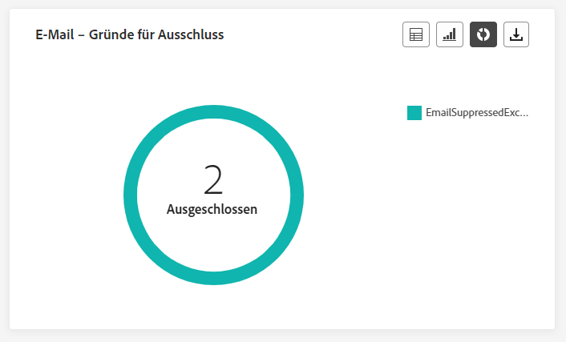
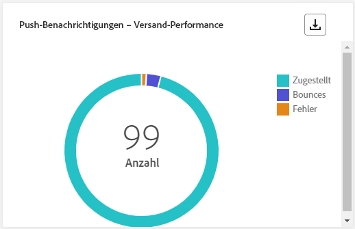

# Kampagnen-Live-Bericht {#campaign-live-report}

>[!CONTEXTUALHELP]
>id="ajo_campaign_live_report"
>title="Kampagnen-Live-Bericht"
>abstract="Mit dem Kampagnen-Live-Bericht kann die Wirkung und Performance von Kampagnen nur in den letzten 24 Stunden in Echtzeit gemessen und visualisiert werden. Der Bericht ist in verschiedene Widgets unterteilt, die den Erfolg und die Fehler der Kampagne detailliert darstellen. Jedes Reporting-Dashboard kann durch Ändern der Größe oder Entfernen von Widgets verändert werden."

Live-Berichte, auf die über die Registerkarte „Letzte 24 Std.“ zugegriffen werden kann, zeigen Ereignisse an, die innerhalb der letzten 24 Stunden stattgefunden haben. Der Zeitraum ab dem Auftreten des Ereignisses beträgt mindestens zwei Minuten. Im Vergleich dazu konzentrieren sich globale Berichte auf Ereignisse, die vor mindestens zwei Stunden aufgetreten sind, und decken Ereignisse über einen ausgewählten Zeitraum ab.

Über die Schaltfläche **[!UICONTROL Live-Ansicht]** können Sie direkt in Ihrer Campaign-Instanz auf den Live-Bericht in Campaign zugreifen.

Die Seite **[!UICONTROL Live-Bericht]** in Campaign wird mit den folgenden Registerkarten angezeigt:

* [Campaign](#campaign-live)
* [E-Mail](#email-live)
* [In-App](#inapp-live)
* [Push-Benachrichtigung](#push-live)
* [SMS](#sms-live)
* [Web](#web-tab)
* [Briefpost](#direct-mail-tab)

Der **[!UICONTROL Live-Bericht]** in Campaign ist in verschiedene Widgets unterteilt, die Erfolge und Fehler bei Ihrer Kampagne detailliert beschreiben. Jedes Widget kann bei Bedarf angepasst und gelöscht werden. Weiterführende Informationen dazu finden Sie in diesem [Abschnitt](../reports/live-report.md#modify-dashboard).

Eine detaillierte Liste aller in Adobe Journey Optimizer verfügbaren Metriken finden Sie auf [dieser Seite](live-report.md#list-of-components-live).

## Registerkarte „Kampagne“ {#campaign-live}

### Versand {#delivery-live}

Die **[!UICONTROL Kampagnenstatistiken]** KPIs dienen als umfassendes Dashboard, das eine detaillierte Aufschlüsselung der Schlüsselmetriken aus den letzten 24 Stunden im Zusammenhang mit Ihrer Kampagne bietet. Dazu gehören wichtige Informationen wie die Anzahl der Profile und die durchgeführten Aktionen, die ein grundlegendes Verständnis der Leistung und Interaktion Ihrer Kampagne ermöglichen.

+++ Weitere Informationen zu den Statistikmetriken von Campaign

* **[!UICONTROL Zielgruppe]**: Anzahl der Zielgruppenprofile.

* **[!UICONTROL Ausgeführte Aktionen]**: Gesamtzahl der einmaligen Bereitstellungen einer Aktion.

* **[!UICONTROL Fehler]**: Gesamtzahl der während des Versandvorgangs aufgetretenen Fehler, die den Versand an Profile verhindert haben.

+++

<!--
### Experimentation tab (#experimentation-live)

From your Campaign **[!UICONTROL Live report]**, the **[!UICONTROL Experimentation]** tab details the main information relative to how each variant is performing and if there is was winner during the test.
-->

## Registerkarte „E-Mail“ {#email-live}

In Ihrem **[!UICONTROL Live-Bericht]** in Campaign finden Sie auf der Registerkarte **[!UICONTROL E-Mail]** die wichtigsten Informationen zu den E-Mails, die in Ihrer Kampagne gesendet wurden.

### E-Mail – Versand-Performance {#email-sending-performance}

>[!CONTEXTUALHELP]
>id="ajo_campaign_live_email_sending_statistics"
>title="E-Mail – Versandstatistiken"
>abstract="Der Graph „E-Mail – Versandstatistik“ fasst wichtige Daten zu Ihren E-Mails, z. B. „Angesprochen“ oder „Zugestellt“, aus den letzten 24 Stunden zusammen."

Die **[!UICONTROL E-Mail - Versandleistung]** bietet einen umfassenden Überblick über die Daten zu E-Mails, die innerhalb der letzten 24 Stunden gesendet wurden. Er bietet Einblicke in wichtige Metriken wie zugestellt und Bounces, sodass eine detaillierte Prüfung des E-Mail-Versandprozesses möglich ist.

+++ Weitere Informationen zu Leistungsmetriken beim E-Mail-Versand

* **[!UICONTROL Zugestellt]**: Anzahl der erfolgreich gesendeten E-Mails.

* **[!UICONTROL Bounces]**: Gesamtzahl der kumulierten Fehler beim Versandvorgang und der automatischen Rücksendungen.

* **[!UICONTROL Weitere Zustellversuche]**: Anzahl der E-Mails in der Warteschlange für weitere Zustellversuche.

* **[!UICONTROL Fehler]**: Gesamtzahl der während des Versandvorgangs aufgetretenen Fehler, die den Versand an Profile verhindert haben.
+++

### E-Mail – Statistiken

>[!CONTEXTUALHELP]
>id="ajo_campaign_live_email_statistics"
>title="E-Mail – Statistiken"
>abstract="Die Tabelle „E-Mail – Statistik“ enthält Daten zur Profilaktivität Ihrer E-Mail aus den letzten 24 Stunden."

Die **[!UICONTROL Senden von Metriken per E-Mail]** -Tabelle bietet eine umfassende Zusammenfassung der Daten aus den letzten 24 Stunden. Er enthält wichtige Metriken, einschließlich der Größe der Zielgruppe und der Anzahl der erfolgreich zugestellten E-Mails. Dies bietet wertvolle Einblicke in die Effektivität und Reichweite Ihrer E-Mail-Kampagnen.

+++ Weitere Informationen zu E-Mail - Statistikmetriken

* **[!UICONTROL Ausführungszeit]**: Startzeit jeder Ausführung Ihrer wiederkehrenden E-Mail. Um nur eine oder mehrere wiederkehrende E-Mails als Ziel auszuwählen, wählen Sie diese aus der Dropdown-Liste **[!UICONTROL Ausführungszeit]**.

* **[!UICONTROL Zielgruppe]**: Gesamtzahl der beim Versandvorgang verarbeiteten Nachrichten.

* **[!UICONTROL Ausgeschlossen]**: Anzahl der Benutzerprofile, die von den Zielgruppenprofilen ausgeschlossen waren und die die Nachricht nicht erhalten haben.

* **[!UICONTROL Gesendet]**: Gesamtzahl der Sendevorgänge.

* **[!UICONTROL Zugestellt]**: Die Anzahl der erfolgreich gesendeten Nachrichten.

* **[!UICONTROL Bounces]**: Gesamtzahl der kumulierten Fehler beim Versandvorgang und der automatischen Rücksendungen.

* **[!UICONTROL Fehler]**: Gesamtzahl der während des Versandvorgangs aufgetretenen Fehler, die den Versand an Profile verhindert haben.

* **[!UICONTROL Öffnungen]**: Gibt an, wie oft eine Nachricht geöffnet wurde.

* **[!UICONTROL Klicks]**: Anzahl der Klicks auf einen Inhalt.

* **[!UICONTROL Abo beenden]**: Zahl der Klicks auf den Abmelde-Link.

* **[!UICONTROL Beschwerden wegen Spam]**: Gibt an, wie oft eine Nachricht als Spam oder Junk gekennzeichnet wurde.

* **[!UICONTROL Weitere Zustellversuche]**: Anzahl der E-Mails in der Warteschlange für weitere Zustellversuche.
+++

### E-Mail - Bounce-Kategorien und -Gründe {#bounce-categories}

>[!CONTEXTUALHELP]
>id="ajo_campaign_live_email_bounce_categories"
>title="E-Mail – Bounce-Kategorien"
>abstract="Die Graphen und die Tabelle „E-Mail – Bounce-Kategorien“ enthalten sowohl temporäre als auch permanente Fehler aus den letzten 24 Stunden."

>[!CONTEXTUALHELP]
>id="ajo_campaign_live_email_bounce_reasons"
>title="E-Mail – Bounce-Gründe"
>abstract="Die Graphen und die Tabelle „E-Mail – Bounce-Gründe“ enthalten die verfügbaren Daten, die für Bounce-Nachrichten aus den letzten 24 Stunden verfügbar waren."

Die **[!UICONTROL Bounce-Gründe]** und **[!UICONTROL Bounce-Kategorien]** Widgets kompilieren die verfügbaren Daten aus den letzten 24 Stunden im Zusammenhang mit Bounce Messages und bieten detaillierte Einblicke in die spezifischen Gründe und Kategorien hinter E-Mail-Bounces.

Weitere Informationen zu Bounces finden Sie auf der Seite [ Unterdrückungslisten](../reports/suppression-list.md).

+++ Weitere Informationen zu E-Mail - Metriken zu Bounce-Kategorien und -Gründen

* **[!UICONTROL Hardbounce]**: die Gesamtzahl der permanenten Fehler, wie eine falsche E-Mail-Adresse. Dazu gehören Fehlermeldungen, die explizit eine ungültige Adresse anzeigen, wie etwa „Benutzer unbekannt“.

* **[!UICONTROL Softbounce]**: die Gesamtzahl der temporären Fehler, wie ein voller Posteingang.

* **[!UICONTROL Ignoriert]**: Die Gesamtzahl der temporären Ereignisse, beispielsweise Abwesenheit, oder technischer Fehler, zum Beispiel wenn der Absendertyp Postmaster ist.

+++

### E-Mail – Performance nach Datum {#email-performance-date}

>[!CONTEXTUALHELP]
>id="ajo_campaign_live_email_performance_bydate"
>title="E-Mail – Performance nach Datum"
>abstract="Das Diagramm E-Mail - Leistung nach Datum enthält umfassende Daten aus den letzten 24 Stunden zu gesendeten E-Mails und bietet Einblicke in wichtige Metriken wie zugestellt und Bounces, sodass eine detaillierte Analyse des E-Mail-Versandprozesses möglich ist."

Die **[!UICONTROL E-Mail - Leistung nach Datum]** -Widget bietet einen detaillierten Überblick über die wichtigsten Informationen zu Ihren Nachrichten, die in einem Diagramm dargestellt werden und Einblicke in die Leistungstrends der letzten 24 Stunden bieten.

+++ Erfahren Sie mehr über E-Mail - Leistung nach Datum und Ursachen - Metriken

* **[!UICONTROL Gesendet]**: Gesamtzahl der Sendevorgänge.

* **[!UICONTROL Zugestellt]**: Die Anzahl der erfolgreich gesendeten Nachrichten.

* **[!UICONTROL Bounces]**: Gesamtzahl der kumulierten Fehler beim Versandvorgang und der automatischen Rücksendungen.

* **[!UICONTROL Fehler]**: Gesamtzahl der während des Versandvorgangs aufgetretenen Fehler, die den Versand an Profile verhindert haben.

* **[!UICONTROL Öffnungen]**: Gibt an, wie oft eine Nachricht geöffnet wurde.

* **[!UICONTROL Klicks]**: Anzahl der Klicks auf einen Inhalt.

* **[!UICONTROL Abmeldungen]**: Zahl der Klicks auf den Abmelde-Link.

* **[!UICONTROL Beschwerden wegen Spam]**: Gibt an, wie oft eine Nachricht als Spam oder Junk gekennzeichnet wurde.

+++

### Fehlerursachen {#email-error-reasons}

>[!CONTEXTUALHELP]
>id="ajo_campaign_live_email_error_reasons"
>title="E-Mail – Fehlerursachen"
>abstract="Anhand der Graphen und der Tabelle „E-Mail – Fehlerursachen“ können Sie die spezifischen Fehler identifizieren, die während des Versandvorgangs in den letzten 24 Stunden aufgetreten sind."

Die **[!UICONTROL Fehlerursachen]** Diagramme und Tabellen bieten einen Einblick in die spezifischen Fehler, die während des Versandvorgangs in den letzten 24 Stunden aufgetreten sind. Diese Informationen sind nützlich, um die Art und Häufigkeit von Fehlern zu verstehen.

### Ausgeschlossene Gründe {#email-exclude-reasons}

>[!CONTEXTUALHELP]
>id="ajo_campaign_live_email_excluded_reasons"
>title="E-Mail – Ausgeschlossene Gründe"
>abstract="Die Graphen und die Tabelle „E-Mail – Ausgeschlossene Gründe“ veranschaulichen die verschiedenen Faktoren, die dazu geführt haben, dass Benutzerprofile, die von der Zielgruppe ausgeschlossen waren, die Nachricht in den letzten 24 Stunden nicht erhalten haben."

Die **[!UICONTROL Ausgeschlossene Gründe]** Grafiken und Tabellen bieten eine umfassende Übersicht über die verschiedenen Faktoren, die in den letzten 24 Stunden zum Ausschluss von Benutzerprofilen aus der Zielgruppe geführt haben.

Siehe Abschnitt [diese Seite](exclusion-list.md) für die umfassende Liste der Ausschlussgründe.

### E-Mail – Beste Empfänger-Domain {#email-best-recipient}

>[!CONTEXTUALHELP]
>id="ajo_campaign_live_email_best_recipient"
>title="E-Mail – Beste Empfänger-Domain"
>abstract="Der Graph und die Tabelle „E-Mail – Beste Empfänger-Domain“ enthalten eine detaillierte Aufschlüsselung der Domains, die Empfängerinnen und Empfänger am häufigsten zum Öffnen der E-Mail verwenden, und bieten wertvolle Einblicke in das Empfängerverhalten aus den letzten 24 Stunden."

Die **[!UICONTROL E-Mail - Beste Empfänger-Domain]** Anhand von Diagrammen und Tabellen können Sie die Domänen aufschlüsseln, die in den letzten 24 Stunden am häufigsten von Profilen zum Öffnen Ihrer E-Mails verwendet wurden. Dies bietet wertvolle Einblicke in das Profilverhalten und hilft Ihnen, die bevorzugten Plattformen zu verstehen.

### E-Mail - Angebote {#email-offers}

>[!NOTE]
>
>Die Angebots-Widgets und -Metriken sind nur verfügbar, wenn eine Entscheidung in eine E-Mail eingefügt wurde. Weiterführende Informationen zum Entscheidungs-Management finden Sie auf dieser [Seite](../offers/get-started/starting-offer-decisioning.md).

Die **[!UICONTROL Angebotsstatistiken]** und **[!UICONTROL Angebotsstatistiken im Zeitverlauf]** -Widgets messen den Erfolg und die Wirkung Ihres Angebots auf Ihre Zielgruppe. Sie enthält die wichtigsten Informationen zu Ihrer Nachricht mit KPIs.

+++ Weitere Informationen zu E-Mail - Angebotsmetriken

* **[!UICONTROL Gesendete Angebote]**: Gibt an, wie oft das Angebot gesendet wurde.

* **[!UICONTROL Angebotseindruck]**: Gibt an, wie oft das Angebot in Ihren E-Mails geöffnet wurde.

* **[!UICONTROL Angebotsklicks]**: Anzahl der Klicks auf ein Angebot in Ihren E-Mails.

+++

## Registerkarte „In-App“ {#inapp-live}

Im **[!UICONTROL Live-Bericht]** Ihrer Kampagne finden Sie auf der Registerkarte **[!UICONTROL In-App]** die wichtigsten Informationen zu den In-App-Nachrichten, die in Ihrer Kampagne versendet wurden.

### In-App-Performance {#inapp-performance}

>[!CONTEXTUALHELP]
>id="ajo_campaign_live_inapp_performance"
>title="In-App-Performance"
>abstract="Die KPIs zur In-App-Performance bieten wichtige Einblicke in die Interaktion Ihrer Besucherinnen und Besucher mit In-App-Nachrichten in den letzten 24 Stunden."

Die **[!UICONTROL In-App-Leistung]** KPIs bieten wichtige Einblicke in die Interaktion Ihrer Profile mit In-App-Nachrichten in den letzten 24 Stunden und liefern wichtige Metriken, mit denen Sie die Effektivität und Wirkung Ihrer In-App-Kampagnen bewerten können.

+++ Erfahren Sie mehr über In-App-Leistungsmetriken

* **[!UICONTROL Impressions]**: Gesamtzahl der an alle Benutzenden gesendeten In-App-Nachrichten.

* **[!UICONTROL Interaktionen]**: Gesamtzahl der Interaktionen mit Ihrer In-App-Nachricht. Dazu gehören alle von den Benutzenden durchgeführten Aktionen, wie z. B. Klicks, Abbrechen oder andere Interaktionen.

+++

### In-App-Zusammenfassung {#inapp-summary}

>[!CONTEXTUALHELP]
>id="ajo_campaign_live_inapp_summary"
>title="In-App-Zusammenfassung"
>abstract="Der In-App-Übersichtsgraph zeigt den Verlauf Ihrer In-App-Impressions und -Interaktionen in den letzten 24 Stunden."

Die **[!UICONTROL In-App-Zusammenfassung]** Das Diagramm zeigt den Verlauf Ihrer In-App-Impressionen und -Interaktionen in den letzten 24 Stunden und bietet einen umfassenden Überblick über die Leistung Ihrer In-App-Nachrichten.

+++ Erfahren Sie mehr über Metriken zur In-App-Zusammenfassung

* **[!UICONTROL Impressions]**: Gesamtzahl der an alle Benutzerinnen und Benutzer gesendeten In-App-Nachrichten.

* **[!UICONTROL Interaktionen]**: Gesamtzahl der Interaktionen mit Ihrer In-App-Nachricht. Dazu gehören alle von den Benutzenden durchgeführten Aktionen, wie z. B. Klicks, Abbrechen oder andere Interaktionen.

+++

### Interaktionen nach Typ {#inapp-interactions}

>[!CONTEXTUALHELP]
>id="ajo_campaign_live_inapp_interactions"
>title="Interaktionen nach Typ"
>abstract="Die Graphen und die Tabelle „Interaktionen nach Typ“ beschreiben, wie Benutzende mit Ihrer In-App-Nachricht interagiert haben, indem Klicks, Abbrechen oder Interaktionen verfolgt werden."

Die **[!UICONTROL Interaktionen nach Typ]** Grafiken und Tabellen enthalten eine detaillierte Darstellung der Interaktion von Profilen mit Ihrer In-App-Nachricht in den letzten 24 Stunden, der Verfolgung von Aktionen wie Klicks, Abweisungen oder anderen Formen der Interaktion.

## Registerkarte „Push-Benachrichtigung“ {#push-live}

In Ihrem **[!UICONTROL Live-Bericht]** in Campaign finden Sie auf der Registerkarte **[!UICONTROL Push-Benachrichtigung]** die wichtigsten Informationen zu den Push-Benachrichtigungen, die in Ihrer Kampagne gesendet wurden.

### Push-Benachrichtigung – Versand-Performance {#push-sending-performance}

>[!CONTEXTUALHELP]
>id="ajo_campaign_live_push_sending_performance"
>title="Push-Benachrichtigung – Versand-Performance"
>abstract="Der Graph „Push-Benachrichtigung – Versand-Performance“ fasst wichtige Daten zu Ihrer Push-Benachrichtigung zusammen, z. B. „Fehler“ oder „Zugestellte Nachrichten“ aus den letzten 24 Stunden."

Die **[!UICONTROL Versandleistung von Push-Benachrichtigungen]** -Diagramm bietet einen umfassenden Überblick über Daten zu Push-Benachrichtigungen, die innerhalb der letzten 24 Stunden gesendet wurden. Er bietet Einblicke in wichtige Metriken wie zugestellt und Bounces, sodass eine detaillierte Prüfung des Versandprozesses für Push-Benachrichtigungen möglich ist.

+++ Weitere Informationen zu Push-Benachrichtigungen - Leistungsmetriken senden

* **[!UICONTROL Zugestellt]**: Die Anzahl der erfolgreich gesendeten Nachrichten.

* **[!UICONTROL Bounces]**: Gesamtzahl der kumulierten Fehler beim Versandvorgang und der automatischen Rücksendungen.

* **[!UICONTROL Fehler]**: Gesamtzahl der während des Versandvorgangs aufgetretenen Fehler, die den Versand an Profile verhindert haben.

+++

### Push-Benachrichtigung – Statistiken {#push-statistics}

>[!CONTEXTUALHELP]
>id="ajo_campaign_live_push_statistics"
>title="Push-Benachrichtigung – Statistiken"
>abstract="Die Tabelle „Push-Benachrichtigung – Statistik“ enthält Daten zur Empfängeraktivität der letzten 24 Stunden für Ihre Push-Benachrichtigung."

Die **[!UICONTROL Push notification - Statistics]** bietet eine kurze Zusammenfassung wichtiger Daten zu Ihren Push-Benachrichtigungen innerhalb der letzten 24 Stunden, einschließlich Schlüsselmetriken wie der Anzahl der Zielkontakte und der Anzahl der erfolgreich zugestellten Nachrichten.

+++ Weitere Informationen zu Push-Benachrichtigungen - Statistikmetriken

* **[!UICONTROL Ausführungszeit]**: Startzeit jeder Ausführung Ihrer wiederkehrenden Push-Benachrichtigung. Um nur eine oder mehrere wiederkehrende Push-Benachrichtigungen als Ziel auszuwählen, wählen Sie diese aus der Dropdown-Liste **[!UICONTROL Ausführungszeit]**.

* **[!UICONTROL Zielgruppe]**: Gesamtzahl der beim Versandvorgang verarbeiteten Nachrichten.

* **[!UICONTROL Ausgeschlossen]**: Anzahl der Benutzerprofile, die von den Zielgruppenprofilen ausgeschlossen waren und die die Nachricht nicht erhalten haben.

* **[!UICONTROL Gesendet]**: Gesamtzahl der Sendevorgänge.

* **[!UICONTROL Zugestellt]**: Die Anzahl der erfolgreich gesendeten Nachrichten.

* **[!UICONTROL Bounces]**: Gesamtzahl der kumulierten Fehler beim Versandvorgang und der automatischen Rücksendungen.

* **[!UICONTROL Fehler]**: Gesamtzahl der während des Versandvorgangs aufgetretenen Fehler, die den Versand an Profile verhindert haben.

* **[!UICONTROL Öffnungen]**: Gibt an, wie oft eine Nachricht geöffnet wurde.

+++

### Push-Benachrichtigung – Sendezusammenfassung {#push-sending-summary}

>[!CONTEXTUALHELP]
>id="ajo_campaign_live_push_sending_summary"
>title="Push-Benachrichtigung – Sendezusammenfassung"
>abstract="Der Graph „Push-Benachrichtigung – Sendezusammenfassung“ zeigt die Daten an, die für gesendete Push-Benachrichtigungen aus den letzten 24 Stunden verfügbar sind."

Die **[!UICONTROL Push notification - Statistics]** -Diagramm bietet eine dynamische Darstellung, die eine Analyse der Aktivität Ihrer Push-Benachrichtigungen in den letzten 24 Stunden anzeigt. Diese grafische Darstellung bietet eine umfassende Aufschlüsselung gesendeter Push-Benachrichtigungen.

+++ Erfahren Sie mehr über Push-Benachrichtigungen - Metriken zur Versandzusammenfassung

* **[!UICONTROL Öffnungen]**: Gibt an, wie oft Ihre Push-Benachrichtigung geöffnet wurde.

* **[!UICONTROL Aktionen]**: Gesamtzahl der Aktionen, die bei der gesendeten Push-Benachrichtigung durchgeführt wurden, d. h. Klick auf Schaltfläche oder Abbruch.

* **[!UICONTROL Bounces]**: Gesamtzahl der Fehler und automatischen Rücksendungen, bezogen auf die Gesamtzahl der gesendeten Nachrichten.

* **[!UICONTROL Zugestellt]**: Zahl der erfolgreich gesendeten Nachrichten im Vergleich zur Gesamtzahl der gesendeten Nachrichten.

* **[!UICONTROL Fehler]**: Gesamtzahl der aufgetretenen Fehler, die die Zustellung an Profile verhindert haben.

+++

### Push-Benachrichtigung – Ausschlussursachen {#push-excluded}

>[!CONTEXTUALHELP]
>id="ajo_campaign_live_push_excluded_reasons"
>title="Push-Benachrichtigung – Ausschlussursachen"
>abstract="Die Graphen und die Tabelle „E-Mail – Ausgeschlossene Gründe“ veranschaulichen die verschiedenen Faktoren, die dazu geführt haben, dass Benutzerprofile, die von der Zielgruppe ausgeschlossen waren, die Nachricht in den letzten 24 Stunden nicht erhalten haben."

Die **[!UICONTROL Ausgeschlossene Gründe]** Grafiken und Tabellen zeigen die unterschiedlichen Gründe an, die in den letzten 24 Stunden verhindert haben, dass aus den Zielgruppenprofilen ausgeschlossene Benutzerprofile Ihre Push-Benachrichtigungen erhalten haben.

Siehe Abschnitt [diese Seite](exclusion-list.md) für die umfassende Liste der Ausschlussgründe.

### Push-Benachrichtigung – Fehlerursachen {#push-error}

>[!CONTEXTUALHELP]
>id="ajo_campaign_live_push_error_reasons"
>title="Push-Benachrichtigung – Fehlerursachen"
>abstract="Anhand der Graphen und der Tabelle „Fehlerursachen“ können Sie die spezifischen Fehler identifizieren, die in den letzten 24 Stunden des Versandvorgangs aufgetreten sind."

Die **[!UICONTROL Fehlerursachen]** Tabellen und Grafiken bieten Ihnen die Möglichkeit, die spezifischen Fehler zu identifizieren, die während des Versandvorgangs Ihrer Push-Benachrichtigungen innerhalb der letzten 24 Stunden aufgetreten sind. So erhalten Sie detaillierte Einblicke in Probleme, die während des Versandvorgangs aufgetreten sind.

### Push-Benachrichtigung – Aufschlüsselung nach Plattform {#push-breakdown-platform}

>[!CONTEXTUALHELP]
>id="ajo_campaign_live_push_breakdown_platform"
>title="Push-Benachrichtigung – Aufschlüsselung nach Plattform"
>abstract="Die Graphen und die Tabelle „Aufschlüsselung nach Plattform“ enthalten eine Aufschlüsselung des Erfolgs Ihrer Push-Benachrichtigungen in den letzten 24 Stunden basierend auf dem Betriebssystem der Empfängerin bzw. des Empfängers."

Die **[!UICONTROL Push-Benachrichtigung - Verteilung nach Plattform]** Diagramme und Tabellen enthalten eine detaillierte Analyse des Erfolgs Ihrer Push-Benachrichtigungen in den letzten 24 Stunden und bieten Einblicke auf der Basis des Betriebssystems Ihres Profils. Diese Aufschlüsselung verbessert Ihr Verständnis der Leistung Ihrer Push-Benachrichtigungen auf verschiedenen Plattformen.

+++ Weitere Informationen zu Push-Benachrichtigungen - Aufschlüsselung nach Plattformmetriken

* **[!UICONTROL Zielgruppe]**: Gesamtzahl der bei der Analyse verarbeiteten Nachrichten.

* **[!UICONTROL Zugestellt]**: Zahl der erfolgreich gesendeten Nachrichten im Vergleich zur Gesamtzahl der gesendeten Nachrichten.

* **[!UICONTROL Öffnungen]**: Gibt an, wie oft Ihre Push-Benachrichtigung geöffnet wurde.

* **[!UICONTROL Aktionen]**: Gesamtzahl der Aktionen, die bei der gesendeten Push-Benachrichtigung durchgeführt wurden, d. h. Klick auf Schaltfläche oder Abbruch.

* **[!UICONTROL Bounces]**: Gesamtzahl der Fehler und automatischen Rücksendungen, bezogen auf die Gesamtzahl der gesendeten Nachrichten.

* **[!UICONTROL Fehler]**: Gesamtzahl der aufgetretenen Fehler, die die Zustellung an Profile verhindert haben.

* **[!UICONTROL Ausgeschlossen]**: Anzahl der Profile, die durch Adobe Journey Optimizer ausgeschlossen wurden.

+++

## Registerkarte „SMS“ {#sms-live}

In Ihrem **[!UICONTROL Live-Bericht]** in Campaign finden Sie auf der Registerkarte **[!UICONTROL SMS]** die wichtigsten Informationen zu den SMS-Nachrichten, die in Ihrer Kampagne gesendet wurden.

### SMS – Statistiken {#sms-statistics}

>[!CONTEXTUALHELP]
>id="ajo_campaign_live_sms_statistics"
>title="SMS – Statistiken"
>abstract="Die Tabelle „SMS – Versandstatistik“ enthält eine Zusammenfassung der wichtigsten Daten zu Ihren SMS-Nachrichten, wie z. B. „Angesprochen“ oder „Zugestellte Nachrichten aus den letzten 24 Stunden“."

Die **[!UICONTROL SMS - Statistiken]** bietet eine kurze Zusammenfassung der wichtigsten Daten zu Ihren SMS-Nachrichten innerhalb der letzten 24 Stunden, die wichtige Metriken wie die Anzahl der Zielkontakte und die Anzahl der erfolgreich zugestellten Nachrichten umfassen.

+++ Weitere Informationen zu SMS - Statistikmetriken

* **[!UICONTROL Ausführungszeit]**: Startzeit jeder Ausführung Ihrer wiederkehrenden SMS-Nachricht. Um nur eine oder mehrere wiederkehrende SMS-Nachrichten auszuwählen, wählen Sie die gewünschte Option in der Dropdown-Liste **[!UICONTROL Ausführungszeit]** aus.

* **[!UICONTROL Angesprochen]**: Anzahl der Benutzerprofile, die sich als Zielgruppenprofile für diesen Versand eignen.

* **[!UICONTROL Ausgeschlossen]**: Anzahl der Benutzerprofile, die von den Zielgruppenprofilen ausgeschlossen waren und die die Nachricht nicht erhalten haben.

* **[!UICONTROL Gesendet]**: Gesamtzahl der Sendevorgänge.

* **[!UICONTROL Bounces]**: Gesamtzahl der kumulierten Fehler beim Versandvorgang und der automatischen Rücksendungen.

* **[!UICONTROL Fehler]**: Gesamtzahl der während des Versandvorgangs aufgetretenen Fehler, die den Versand an Profile verhindert haben.

* **[!UICONTROL Klicks]**: Gesamtzahl der URL-Besuche.

+++

### SMS – Performance nach Datum {#sms-perfomance-date}

>[!CONTEXTUALHELP]
>id="ajo_campaign_live_sms_performance"
>title="SMS – Performance nach Datum"
>abstract="Das Widget „SMS – Performance nach Datum“ liefert wichtige Informationen aus den letzten 24 Stunden über Ihre Nachrichten in einer grafischen Darstellung."

Die **[!UICONTROL SMS-Leistung nach Datum]** -Widget bietet einen detaillierten Überblick über die wichtigsten Informationen zu Ihren Nachrichten, die in einem Diagramm dargestellt werden und Einblicke in die Leistungstrends der letzten 24 Stunden bieten.

+++ Erfahren Sie mehr über SMS - Leistung nach Datumsmetriken

* **[!UICONTROL Gesendet]**: Gesamtzahl der Sendevorgänge.

* **[!UICONTROL Bounces]**: Gesamtzahl der kumulierten Fehler beim Versandvorgang und der automatischen Rücksendungen.

* **[!UICONTROL Fehler]**: Gesamtzahl der während des Versandvorgangs aufgetretenen Fehler, die den Versand an Profile verhindert haben.

+++

### SMS - Fehlerursachen {#sms-error-reasons}

>[!CONTEXTUALHELP]
>id="ajo_campaign_live_sms_error_reasons"
>title="SMS – Fehlerursachen"
>abstract="Die Graphen und die Tabelle „SMS – Fehlerursachen“ ermöglichen es Ihnen, die spezifischen Fehler zu identifizieren, die in den letzten 24 Stunden während des Versandvorgangs aufgetreten sind."

Die **[!UICONTROL Ausgeschlossene Gründe]** Anhand von Diagrammen und Tabellen können Sie die spezifischen Fehler identifizieren, die während des Versandvorgangs Ihrer SMS-Nachrichten innerhalb der letzten 24 Stunden aufgetreten sind. Dies ermöglicht eine gründliche Analyse aller aufgetretenen Probleme.

### SMS - Ausgeschlossene Gründe {#sms-excluded-reasons}

>[!CONTEXTUALHELP]
>id="ajo_campaign_live_sms_excluded_reasons"
>title="SMS – Ausschlussursachen"
>abstract="Die Graphen und die Tabelle „E-Mail – Ausgeschlossene Gründe“ veranschaulichen die verschiedenen Faktoren, die dazu geführt haben, dass Benutzerprofile, die von der Zielgruppe ausgeschlossen waren, die Nachricht in den letzten 24 Stunden nicht erhalten haben."

Die **[!UICONTROL Ausgeschlossene Gründe]** Grafiken und Tabellen zeigen visuell die verschiedenen Faktoren an, die zum Ausschluss von Benutzerprofilen aus der Zielgruppe geführt haben, sodass sie Ihre SMS-Nachrichten in den letzten 24 Stunden nicht erhalten konnten.

Siehe Abschnitt [diese Seite](exclusion-list.md) für die umfassende Liste der Ausschlussgründe.

### SMS – Bounce-Ursachen {#sms-bounces-reasons}

>[!CONTEXTUALHELP]
>id="ajo_campaign_live_sms_bounces_reasons"
>title="SMS – Bounce-Ursachen"
>abstract="Die Graphen und die Tabelle „Bounce-Ursachen“ enthalten die Daten aus den letzten 24 Stunden bezüglich Bounce-Nachrichten."

Die **[!UICONTROL Bounces-Gründe]** Grafiken und Tabellen bieten einen umfassenden Überblick über Daten zu Bounce-SMS-Nachrichten und liefern wertvolle Einblicke in die spezifischen Ursachen von SMS-Bounces in den letzten 24 Stunden.

## Registerkarte „Web“ {#web-tab}

Im **[!UICONTROL Live-Bericht]** Ihrer Kampagne werden auf der Registerkarte **[!UICONTROL Web]** die wichtigsten Informationen zu Ihren Web-Seiten aufgeführt.

### Web-Performance {#web-performance}

>[!CONTEXTUALHELP]
>id="ajo_campaign_live_web_performance"
>title="Web-Performance"
>abstract="Die Web-Performance-KPIs bieten umfassende Informationen über die Interaktion Ihrer Besucherinnen und Besucher mit Ihren Web-Erlebnissen aus den letzten 24 Stunden."

Die **[!UICONTROL Webleistung]** KPIs bieten umfassende Einblicke in die Interaktion Ihrer Besucher mit Ihren Webseiten in den letzten 24 Stunden, einschließlich Schlüsselmetriken wie Impressionen und Interaktionen.

+++ Weitere Informationen zu Webleistungsmetriken

* **[!UICONTROL Impressions]**: Gesamtanzahl der für alle Benutzerinnen und Benutzer bereitgestellten Web-Erlebnisse.

* **[!UICONTROL Interaktionen]**: Gesamtzahl der Interaktionen mit Ihrer Webseite. Dazu gehören alle von den Benutzenden durchgeführten Aktionen, wie z. B. Klicks oder andere Interaktionen.

+++

### Web-Zusammenfassung {#web-summary}

>[!CONTEXTUALHELP]
>id="ajo_campaign_live_web_summary"
>title="Web-Zusammenfassung"
>abstract="Das Diagramm „Web-Zusammenfassung“ zeigt die Entwicklung Ihrer Web-Erlebnisse (Impressions, eindeutige Impressions und Interaktionen) für die letzten 24 Stunden."

Die **[!UICONTROL Webzusammenfassung]** -Diagramm zeigt die Entwicklung Ihrer Web-Erlebnisse (Impressionen, einzigartige Impressionen und Interaktionen) in den letzten 24 Stunden.

+++ Weitere Informationen zu Metriken mit Webzusammenfassungen

* **[!UICONTROL Impressions]**: Gesamtanzahl der für alle Benutzerinnen und Benutzer bereitgestellten Web-Erlebnisse.

* **[!UICONTROL Interaktionen]**: Gesamtzahl der Interaktionen mit Ihrer Webseite. Dazu gehören alle von den Benutzenden durchgeführten Aktionen, wie z. B. Klicks oder andere Interaktionen.

+++

### Interaktionen nach Element {#web-interactions}

>[!CONTEXTUALHELP]
>id="ajo_campaign_live_web_interactions"
>title="Interaktionen nach Element"
>abstract="Die Tabelle „Interaktionen nach Element“ enthält wichtige Informationen zur Interaktion Ihrer Besucherinnen und Besucher mit verschiedenen Elementen auf Ihren Web-Seiten in den letzten 24 Stunden."

Die **[!UICONTROL Interaktionen nach Element]** -Tabelle enthält umfassende Informationen zur Interaktion Ihrer Besucher mit den verschiedenen Elementen auf Ihren Webseiten in den letzten 24 Stunden und bietet wertvolle Einblicke in Benutzerinteraktionen und -präferenzen.

## Registerkarte „Briefpost“ {#direct-mail-tab}

Im **[!UICONTROL Live-Bericht]** in Campaign werden auf der Registerkarte **[!UICONTROL Briefpost]** die wichtigsten Informationen zu Ihrer Briefpost aufgeführt.

### Briefpost – Versandstatistik {#direct-mail-sending}

>[!CONTEXTUALHELP]
>id="ajo_campaign_live_direct_sending_statistics"
>title="Briefpost – Versandstatistik"
>abstract="Die Tabelle „Briefpost – Versandstatistik“ enthält eine Zusammenfassung der wichtigsten Daten aus den letzten 24 Stunden zu Ihren Briefpost-Nachrichten, z. B. „Angesprochen“ oder „Zugestellte Nachrichten“."

Die **[!UICONTROL Briefpost - Versandstatistiken]** bietet eine kurze Zusammenfassung wichtiger Daten zu Ihren Briefpost-Nachrichten, die wichtige Metriken wie die Anzahl der Zielkontakte und die Anzahl der erfolgreich zugestellten Nachrichten innerhalb der letzten 24 Stunden umfasst.

+++ Weitere Informationen zu Briefpost - Metriken zur Versandstatistik

* **[!UICONTROL Angesprochen]**: Anzahl der Benutzerprofile, die sich als Zielgruppenprofile für diesen Versand eignen.

* **[!UICONTROL Gesendet]**: Gesamtzahl der Sendevorgänge.

* **[!UICONTROL Fehler]**: Gesamtzahl der während des Versandvorgangs aufgetretenen Fehler, die den Versand an Profile verhindert haben.

* **[!UICONTROL Ausgeschlossen]**: Anzahl der Benutzerprofile, die von den Zielprofilen ausgeschlossen waren und Ihre Briefpost nicht erhalten haben.

+++

### Briefpost – Fehlerursachen {#direct-mail-error-reasons}

>[!CONTEXTUALHELP]
>id="ajo_campaign_live_direct_error_reasons"
>title="Briefpost – Fehlerursachen"
>abstract="Die Graphen und die Tabelle „Briefpost – Fehlerursachen“ ermöglichen es Ihnen, die spezifischen Fehler zu identifizieren, die in den letzten 24 Stunden aufgetreten sind."

Die **[!UICONTROL Briefpost - Fehlerursachen]** Grafiken und Tabellen bieten die Möglichkeit, spezifische Fehler zu identifizieren, die während des Versandvorgangs Ihrer Briefpost-Nachrichten aufgetreten sind. So können Sie alle in den letzten 24 Stunden aufgetretenen Probleme detailliert analysieren.

### Briefpost – Ausschlussgründe {#direct-mail-excluded-reasons}

>[!CONTEXTUALHELP]
>id="ajo_campaign_live_direct_excluded_reasons"
>title="Briefpost – Ausschlussgründe"
>abstract="Die Graphen und die Tabelle „Briefpost – Ausschlussgründe“ veranschaulichen die verschiedenen Faktoren, die dazu geführt haben, dass Benutzerprofile, die von der Zielgruppe ausgeschlossen waren, die Nachricht in den letzten 24 Stunden nicht erhalten haben."

Die **[!UICONTROL Briefpost - Ausgeschlossene Gründe]** Grafiken und Tabellen veranschaulichen visuell die verschiedenen Faktoren, die dazu geführt haben, dass Benutzerprofile aus der Zielgruppe ausgeschlossen wurden, sodass sie Ihre Briefpost-Nachrichten in den letzten 24 Stunden nicht erhalten konnten.

Siehe Abschnitt [diese Seite](exclusion-list.md) für die umfassende Liste der Ausschlussgründe.

## Weitere Ressourcen

* [Erste Schritte mit Kampagnen](../campaigns/get-started-with-campaigns.md)
* [Erstellen einer Kampagne](../campaigns/create-campaign.md)
* [Erstellen von API-ausgelösten Kampagnen](../campaigns/api-triggered-campaigns.md)
* [Ändern oder Stoppen einer Kampagne](../campaigns/modify-stop-campaign.md)
* [Globaler Bericht zu Kampagnen](campaign-global-report.md)
