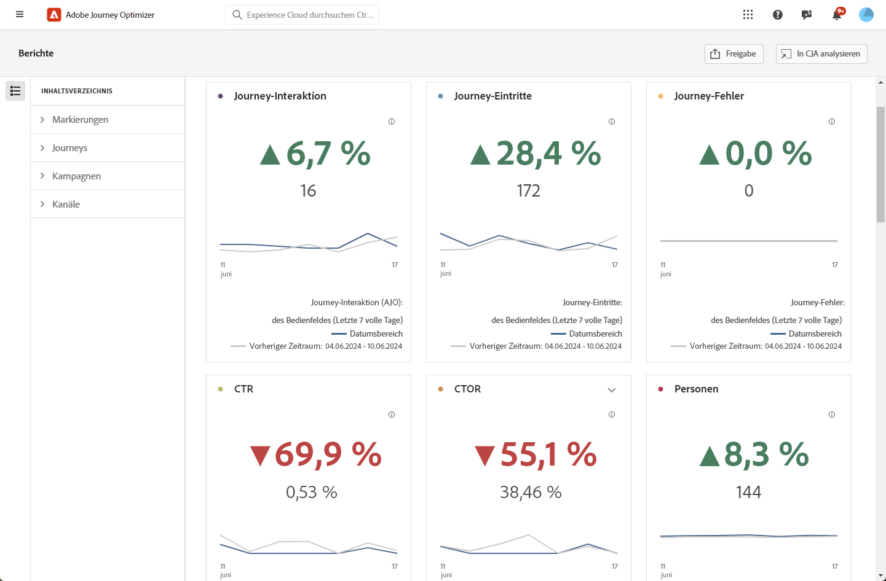
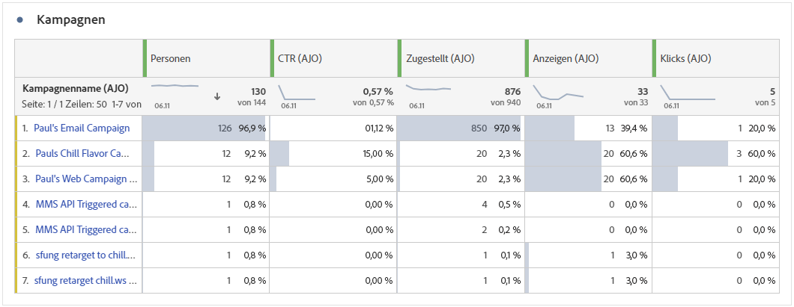
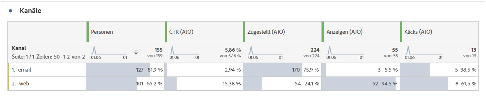
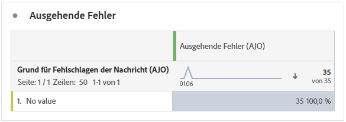
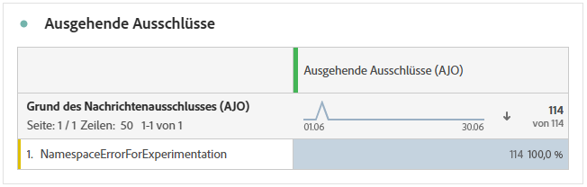

# Übersichtsbericht {#channel-report-cja}

Der Übersichtsbericht bietet Benutzenden eine gründliche Zusammenfassung von Traffic- und Interaktionsmetriken für alle Kampagnen und Journeys in Ihrer Umgebung. Diese Metriken werden kombiniert, um einheitliche Werte für Aktionen aus verschiedenen Kanälen zu liefern, die verschiedene Kampagnen und Journeys umfassen.

Greifen Sie auf den Übersichtsbericht zu, indem Sie im Abschnitt **Journey-Management** zum Menü **Berichte** navigieren. 

Die Berichtseite wird mit den folgenden Registerkarten angezeigt:

* [Journeys](#journey)
* [Kampagnen](#campaign)
* [Kanäle](#channel)
* [Regelsätze](#rule-sets)

Weitere Informationen zu Customer Journey Analytics Workspace und zum Filtern und Analysieren von Daten finden Sie auf [dieser Seite](https://experienceleague.adobe.com/de/docs/analytics-platform/using/cja-workspace/home).

## Highlights {#highlights}

Die KPIs **[!UICONTROL Highlights]** dienen als umfassendes Dashboard, das eine detaillierte Aufschlüsselung der Schlüsselmetriken für alle Kampagnen und Journey in Ihrer Umgebung bietet und es Ihnen ermöglicht, die Performance schnell zu bewerten und Verbesserungsbereiche zu identifizieren.

+++ Weitere Informationen zu den Metriken „Markierungen“

* **[!UICONTROL Journey-Interaktion]**: Gesamtzahl der eindeutigen Kontakte, die über die Journey gesendete Nachrichten empfangen haben und bestimmte Profile repräsentieren, die einen bestimmten Aktionspunkt in der Journey erreicht haben.

* **[!UICONTROL Journey-Eintritte]**: Gesamtzahl der Kontakte, die das Eintrittsereignis der Journey erreicht haben.

* **[!UICONTROL Fehlgeschlagene Journeys]**: Gesamtzahl der einzelnen Journeys, die nicht erfolgreich ausgeführt wurden.

* **[!UICONTROL Klickrate]**: Prozentsatz der Klicks in Ihren Nachrichten.

* **[!UICONTROL Durchklick-Öffnungsrate]**: Anzahl der Öffnungen der Nachricht.

* **[!UICONTROL Personen]**: Anzahl der Benutzerprofile, die sich als Zielgruppenprofile für Ihre Nachrichten eignen.

* **[!UICONTROL Klicks]**: Anzahl der Klicks auf einen Inhalt in Ihren Nachrichten.

* **[!UICONTROL Beschwerden wegen Spam]**: Gibt an, wie oft eine Nachricht als Spam oder Junk gekennzeichnet wurde.

* **[!UICONTROL Abmeldungen]**: Anzahl der Klicks auf den Abmelde-Link.

+++

## Journey {#journey}

Die Tabelle **[!UICONTROL Journey]** dient als umfassendes Dashboard, das eine Analyse der Schlüsselmetriken im Zusammenhang mit Ihrer Journey bietet. Sie umfasst Details wie die Anzahl der eingetretenen Profile und Instanzen von fehlgeschlagenen individuellen Journeys und bietet einen umfassenden Einblick in die Effektivität und Interaktionsgrade Ihrer Journey.

Durch Anklicken des Namens einer in dieser Tabelle aufgeführten Journey können Sie jede Journey problemlos einzeln erkunden und sofort auf ihren umfassenden Bericht auf einer neuen Registerkarte zugreifen.

+++ Weitere Informationen zu den Metriken „Journey“

* **[!UICONTROL Journey-Eintritte]**: Gesamtzahl der Kontakte, die das Eintrittsereignis der Journey erreicht haben.

* **[!UICONTROL Journey-Austritte]**: Gesamtzahl der Kontakte, die die Journey verlassen haben.

* **[!UICONTROL Fehlgeschlagene Journeys]**: Gesamtzahl der einzelnen Journeys, die nicht erfolgreich ausgeführt wurden.

+++

## Kampagnen {#campaign}

Die Tabelle **[!UICONTROL Kampagne]** dient als allumfassendes Dashboard, das eine detaillierte Übersicht der wichtigsten Metriken für Ihre Kampagne bereitstellt. Sie enthält wichtige Daten wie die Anzahl der Profile und Sendungen und bietet Ihnen einen umfassenden Einblick in die Performance und Interaktionsgrade Ihrer Kampagne.

Durch Anklicken des Namens einer in dieser Tabelle aufgeführten Kampagne können Sie jede Kampagne problemlos einzeln erkunden und sofort auf ihren umfassenden Bericht auf einer neuen Registerkarte zugreifen.

+++ Weitere Informationen zu den Metriken „Kampagne“

* **[!UICONTROL Personen]**: Anzahl der Benutzerprofile, die sich als Zielgruppenprofile für Ihre Nachrichten eignen.

* **[!UICONTROL Durchklickrate]**: Prozentsatz der Klicks in Ihren Nachrichten.

* **[!UICONTROL Sendevorgänge]**: Gesamtzahl der Sendevorgänge für jede Kampagne.

* **[!UICONTROL Zugestellt]**: Die Anzahl der erfolgreich gesendeten Nachrichten.

* **[!UICONTROL Anzeigen]**: Anzahl der Öffnungen der Nachricht.

* **[!UICONTROL Klicks]**: Anzahl der Klicks auf einen Inhalt in Ihren Nachrichten.

+++

## Kanäle {#channel}

### Kanäle

Die Tabelle **[!UICONTROL Kanäle]** zeigt eine detaillierte Aufschlüsselung der Interaktion Ihrer Profile mit Ihren Nachrichten auf Kanalebene an. Auf diese Weise erhalten Sie genauere Erkenntnisse zur Performance verschiedener Kanäle.

+++ Weitere Informationen zu den Metriken „Kanäle“

* **[!UICONTROL Personen]**: Anzahl der Benutzerprofile, die sich als Zielgruppenprofile für Ihre Nachrichten eignen.

* **[!UICONTROL Durchklickrate]**: Prozentsatz der Klicks in Ihren Nachrichten.

* **[!UICONTROL Zugestellt]**: Die Anzahl der erfolgreich gesendeten Nachrichten.

* **[!UICONTROL Anzeigen]**: Anzahl der Öffnungen der Nachricht.

* **[!UICONTROL Klicks]**: Anzahl der Klicks auf einen Inhalt in Ihren Nachrichten.

+++

### Ausgehende Fehler

Anhand der Tabelle **[!UICONTROL Ausgehende Fehler]** können Sie die genauen Fehler ermitteln, die während des Sendevorgangs aufgetreten sind, was ein klares Verständnis der aufgetretenen Probleme ermöglicht.

### Ausgehende Ausschlüsse

Die Tabelle **[!UICONTROL Ausgehende Ausschlüsse]** bietet einen umfassenden Überblick über die verschiedenen Faktoren, die zum Ausschluss von Benutzerprofilen aus der Zielgruppe geführt haben, sodass die Nachricht nicht empfangen wurde.

## Journey-Begrenzung und Konflikte {#rule-sets}

Die Tabelle **[!UICONTROL Journey-Begrenzung und -Konflikte]** bietet Einblicke in die Leistung von Journey-Schlichtungsregelsätzen, in denen die Ein- und Ausstiege von Journey basierend auf den Begrenzungsregeln und den auf Ihre Journey angewendeten Prioritätswerten angezeigt werden.

+++ Weitere Informationen zu Regelsatzmetriken

Die Spalte **[!UICONTROL Journey-Einträge nach Regelsatz]** zeigt die Anzahl der Profile an, die die Journey betreten haben. Es gibt drei Arten von Eingängen:

* ****[!UICONTROL Kein Konflikt]****: Das Profil ist ohne Regelsatzkonflikte auf die Journey gelangt. Keine aktiven Regelsätze verhinderten diese Eingabe, und der Journey-Eintrag erfolgte unabhängig von den Schlichtungsregeln.

* **Höhere Priorität**: Das Profil ist auf die Journey gelangt, da es eine höhere Priorität hat als andere konkurrierende Journey. Obwohl ein Konflikt aufgetreten ist (das Profil hat sich für mehrere Journey qualifiziert), wurde diese Journey aufgrund ihres höheren Prioritätswerts ausgewählt.

* **Nicht erzwungen**: Das Profil ist auf die Journey gelangt, aber der Regelsatz war zum Zeitpunkt der Eingabe nicht aktiv oder wurde nicht auf diesen Journey-Eintrag angewendet.

Die Spalte **[!UICONTROL Ausschlüsse]** zeigt die Anzahl der Profile an, die von der Eingabe der Journey ausgeschlossen wurden. Profile können aus zwei Gründen ausgeschlossen werden:

* **Begrenzung erreicht**: Das Profil hat die maximale Anzahl von Journey-Einträgen oder gleichzeitigen Journey erreicht, die von der Begrenzungsregel zulässig ist.

* **Niedrigere Priorität**: Die Obergrenze wurde nicht erreicht, aber andere Journey mit höherer Priorität erfüllen die Anforderungen. Das Profil wurde von dieser Journey ausgeschlossen und stattdessen in eine Journey mit höherer Priorität aufgenommen.

+++

➡️ [Erfahren Sie mehr über Journey-Begrenzung und Schlichtung](../conflict-prioritization/journey-capping.md)