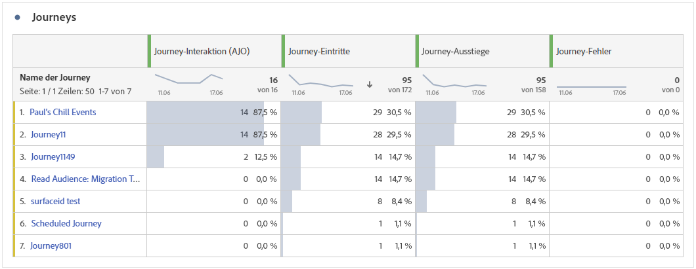
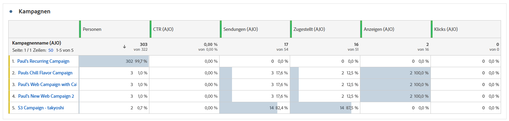
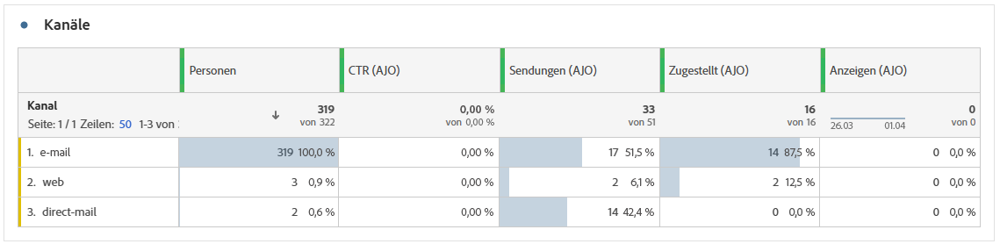

# Übersichtsbericht {#channel-report-cja}

Der Übersichtsbericht bietet Benutzern eine gründliche Zusammenfassung des Traffics und der Interaktionsmetriken für alle Kampagnen und Journey in Ihrer Umgebung. Diese Metriken werden kombiniert, um einheitliche Werte für Aktionen aus verschiedenen Kanälen bereitzustellen, die verschiedene Kampagnen und Journey umfassen.

Sie können auf den Übersichtsbericht zugreifen, indem Sie zur **Berichte** innerhalb des **Journey-Management** Abschnitt.

Die Berichtseite wird mit den folgenden Registerkarten angezeigt:

* [Journeys](#journey)
* [Kampagnen](#campaign)
* [Kanäle](#channel)

Weitere Informationen zum Customer Journey Analytics Workspace und zum Filtern und Analysieren von Daten finden Sie unter [diese Seite](https://experienceleague.adobe.com/en/docs/analytics-platform/using/cja-workspace/home).

## Highlights {#highlights}

Die **[!UICONTROL Highlights]** KPIs dienen als umfassendes Dashboard, das eine detaillierte Aufschlüsselung der Schlüsselmetriken für alle Kampagnen und Journey in Ihrer Umgebung bietet und es Ihnen ermöglicht, die Leistung schnell zu bewerten und Verbesserungsbereiche zu identifizieren.

+++ Weitere Informationen zu den Metriken &quot;Highlights&quot;

* **[!UICONTROL Journey-Interaktion]**: Gesamtzahl der Kontakte, die mit den von der Journey gesendeten Nachrichten interagiert haben.

* **[!UICONTROL Journey Enters]**: Gesamtzahl der Kontakte, die das Eintrittsereignis der Journey erreicht haben.

* **[!UICONTROL Journey-Fehler]**: Gesamtzahl der einzelnen Journey, die nicht erfolgreich ausgeführt wurden.

* **[!UICONTROL Durchklickrate]**: Prozentsatz der Klicks in Ihren Nachrichten.

* **[!UICONTROL Clickthrough-Öffnungsrate (CTOR)]**: Gibt an, wie oft die Nachricht geöffnet wurde.

* **[!UICONTROL Personen]**: Anzahl der Benutzerprofile, die als Zielprofile für Ihre Nachrichten gelten.

* **[!UICONTROL Klicks]**: Anzahl der Klicks auf einen Inhalt in Ihren Nachrichten.

* **[!UICONTROL Beschwerden wegen Spam]**: Gibt an, wie oft eine Nachricht als Spam oder Junk gekennzeichnet wurde.

* **[!UICONTROL Abmeldungen]**: Anzahl der Klicks auf den Abmelde-Link.

+++

## Journey {#journey}

Die **[!UICONTROL Journey]** -Tabelle dient als umfassendes Dashboard, das eine Analyse der Schlüsselmetriken im Zusammenhang mit Ihrer Journey ermöglicht. Sie enthält Details wie die Anzahl der eingegebenen Profile und Instanzen fehlgeschlagener einzelner Journey. So erhalten Sie ein genaues Verständnis Ihrer Journey- und Interaktionsraten.

Durch Anklicken des Namens einer in dieser Tabelle aufgelisteten Journey können Sie jede Journey einfach einzeln untersuchen und sofort auf ihren umfassenden Bericht in einem neuen Tab zugreifen.

+++ Weitere Informationen zu Journey-Metriken

* **[!UICONTROL Journey Enters]**: Gesamtzahl der Kontakte, die das Eintrittsereignis der Journey erreicht haben.

* **[!UICONTROL Journey Exits]**: Gesamtzahl der Kontakte, die die Journey verlassen haben.

* **[!UICONTROL Journey-Fehler]**: Gesamtzahl der einzelnen Journey, die nicht erfolgreich ausgeführt wurden.

+++

## Kampagnen {#campaign}

Die **[!UICONTROL Kampagne]** -Tabelle dient als allumfassendes Dashboard, das eine detaillierte Übersicht der wichtigsten Metriken für Ihre Kampagne bietet. Er enthält wichtige Daten wie die Anzahl der Profile und Sendungen und bietet Ihnen einen umfassenden Einblick in die Leistung und Interaktionsstufen Ihrer Kampagne.

Wenn Sie auf den Namen einer in dieser Tabelle aufgelisteten Kampagne klicken, können Sie jede Kampagne einzeln untersuchen und so in einem neuen Tab sofort auf ihren umfassenden Bericht zugreifen.

+++ Weitere Informationen zu Campaign-Metriken

* **[!UICONTROL Personen]**: Anzahl der Benutzerprofile, die als Zielprofile für Ihre Nachrichten gelten.

* **[!UICONTROL Sendungen]**: Gesamtzahl der gesendeten Nachrichten für jede Kampagne.

* **[!UICONTROL Anzeigen]**: Gibt an, wie oft die Nachricht geöffnet wurde.

* **[!UICONTROL Klicks]**: Anzahl der Klicks auf einen Inhalt in Ihren Nachrichten.

+++

## Kanäle {#channel}

### Kanäle

Die **[!UICONTROL Kanäle]** bietet eine detaillierte Aufschlüsselung der Interaktion Ihrer Profile mit Ihren Nachrichten auf Kanalebene. Auf diese Weise erhalten Sie genauere Einblicke in die Leistung verschiedener Kanäle.

+++ Weitere Informationen zu Kanalmetriken

* **[!UICONTROL Personen]**: Anzahl der Benutzerprofile, die als Zielprofile für Ihre Nachrichten gelten.

* **[!UICONTROL Durchklickrate]**: Prozentsatz der Klicks in Ihren Nachrichten.

* **[!UICONTROL Sendungen]**: Gesamtzahl der gesendeten Nachrichten für jede Kampagne.

* **[!UICONTROL Anzeigen]**: Gibt an, wie oft die Nachricht geöffnet wurde.

* **[!UICONTROL Klicks]**: Anzahl der Klicks auf einen Inhalt in Ihren Nachrichten.

+++

### Ausgehende Fehler

Die **[!UICONTROL Ausgehende Fehler]** -Tabelle ermöglicht es Ihnen, die genauen Fehler zu ermitteln, die während des Versandvorgangs aufgetreten sind. Dies erleichtert ein klares Verständnis der aufgetretenen Probleme.

### Ausgehende Ausschlüsse

Die **[!UICONTROL Ausgehende Ausschlüsse]** -Tabelle zeigt eine umfassende Übersicht der verschiedenen Faktoren, die dazu geführt haben, dass Benutzerprofile aus der Zielgruppe ausgeschlossen wurden, sodass die Nachricht nicht empfangen wurde.
