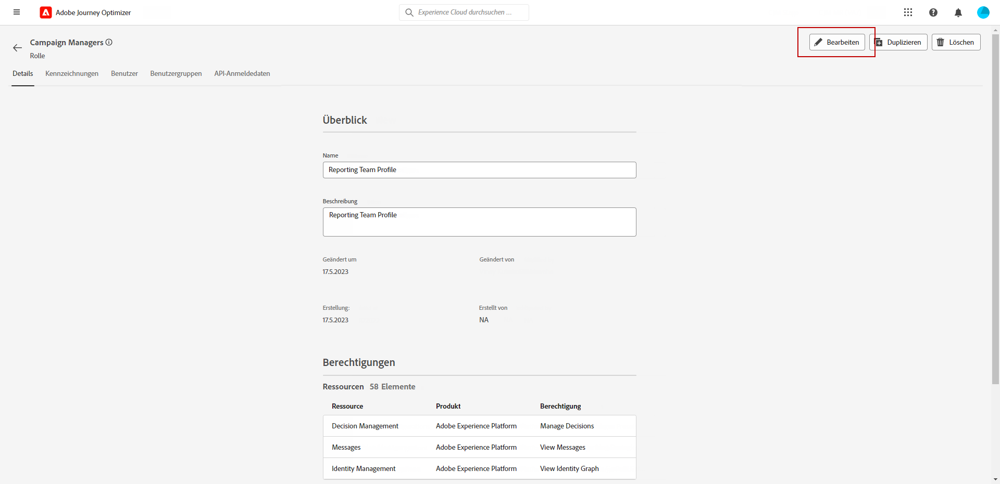
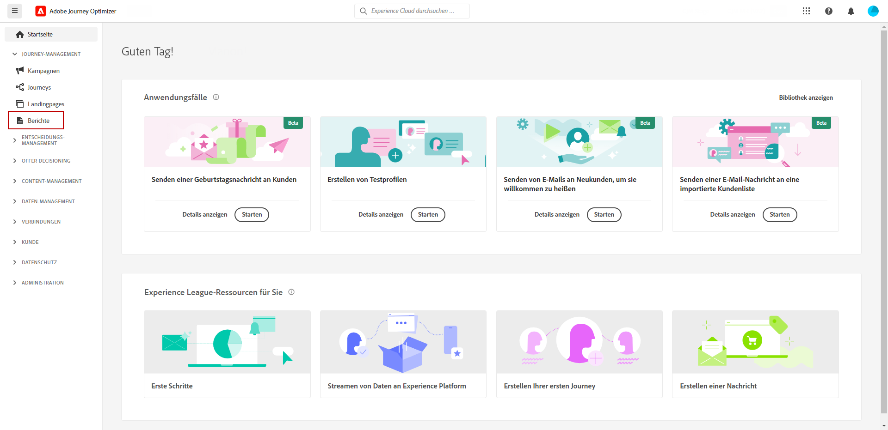
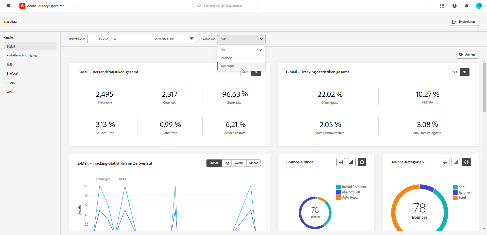
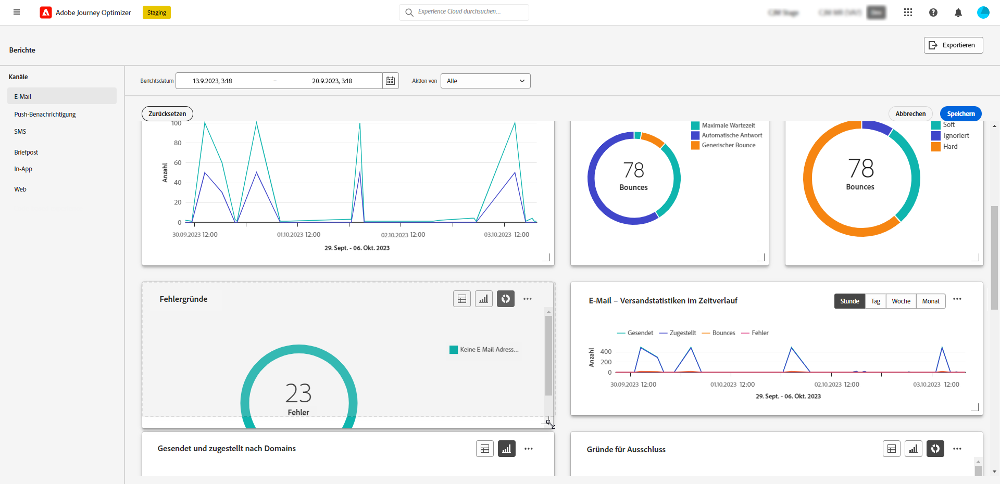
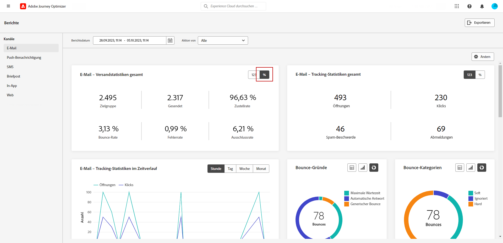

# Erste Schritte mit Kanalberichten {#channel-report-gs}

Die Kanalberichte sind ein leistungsstarkes Tool, das einen umfassenden Überblick über Traffic- und Interaktionsmetriken in einem einheitlichen Bericht für jeden Kanal bietet und alle Aktionen aller Kampagnen und Journey umfasst. Sie ist in verschiedene Widgets unterteilt, von denen jedes einen bestimmten Überblick über Ihre Journey- oder Kampagnenleistung bietet.

Die Kanalberichte sind vollständig anpassbar, sodass Sie Widgets in der Größe ändern oder entfernen können, um ein Dashboard zu erstellen, das Ihren spezifischen Anforderungen entspricht. Sie können die Berichtsdaten auch zur weiteren Analyse in eine PDF- oder CSV-Datei exportieren.

Weitere Informationen zu den verschiedenen Metriken und Widgets, die für die Kanalberichte verfügbar sind, finden Sie in diesem [page](channel-report.md).

## Vor Beginn {#manage-reports-prereq}

Bevor Sie beginnen, überprüfen Sie, ob Sie Zugriff auf die **[!UICONTROL Berichte]** Menü.

Wenn die Variable **[!UICONTROL Berichte]** Menü, müssen Ihre Zugriffsberechtigungen erweitert werden, um die **[!UICONTROL Anzeigen von Kanalberichten]** -Berechtigung. Sie können Ihre eigenen Berechtigungen erweitern, wenn Sie Zugriff auf die Adobe Experience Platform haben [Berechtigungen](https://experienceleague.adobe.com/docs/experience-platform/access-control/home.html){target="_blank"} für Ihre Organisation. Wenden Sie sich andernfalls an Ihren Adobe Journey Optimizer-Administrator.

+++Erfahren Sie, wie Sie Berichtsberechtigungen zuweisen

Beachten Sie, dass diese Berechtigung in der folgenden integrierten **[!UICONTROL Rollen]**: Campaign Manager, Campaign Approver, Campaign Viewer und Campaign Administrator.

So weisen Sie Ihrer **[!UICONTROL Rolle]**:

1. Aus dem [!DNL Permissions] Produkt, navigieren Sie zur **[!UICONTROL Rollen]** und wählen Sie die Rolle aus, die Sie mit der neuen **[!UICONTROL Anzeigen von Kanalberichten]** -Berechtigung.

1. Klicken Sie im Dashboard **[!UICONTROL Rolle]** auf **[!UICONTROL Bearbeiten]**.

   

1. Ziehen Sie die **[!UICONTROL Bericht]** Ressource, um Berechtigungen zuzuweisen.

   Aus dem **[!UICONTROL Bericht]** Ressourcen-Dropdown, wählen Sie die **[!UICONTROL Anzeigen von Kanalberichten]** -Berechtigung.

   

1. Klicken Sie auf **[!UICONTROL Speichern]**.

Hierfür zugewiesene Benutzer **[!UICONTROL Rolle]** kann jetzt auf die **[!UICONTROL Berichte]** Menü.

+++

## Bericht-Dashboard verwalten {#manage-reports}

Gehen Sie wie folgt vor, um auf Ihre Kanalberichte zuzugreifen und sie zu verwalten:

1. Navigieren Sie zum **[!UICONTROL Berichte]** innerhalb des **[!UICONTROL Journey-Management]** Abschnitt.

   

1. Wählen Sie im Dashboard eine **Starten** und **[!UICONTROL Endzeit]** , um bestimmte Daten auszuwählen.

1. Aus dem **[!UICONTROL Aktion von]** in der Dropdown-Liste auswählen, ob Sie Kampagnen, Journey oder beides als Ziel auswählen möchten.

   

1. Klicks **[!UICONTROL Ändern]** um Widgets zu vergrößern oder zu entfernen, um ein Dashboard zu erstellen, das Ihren spezifischen Anforderungen entspricht.

   

1. Wenn Sie mit der Anzeigereihenfolge und der Größe Ihrer Widgets zufrieden sind, klicken Sie auf **[!UICONTROL Speichern]**.

1. Je nach Widget können Sie zwischen Tabellen, Balkendiagrammen oder Ringdiagrammen wechseln.

1. Klicken Sie auf das Prozentsymbol, um Ihre Daten als Raten anzuzeigen.

   

## Exportieren der Berichte {#export-reports}

Sie können Ihre verschiedenen Berichte einfach in PDF- oder CSV-Formate exportieren, um sie freizugeben, zu bearbeiten oder zu drucken. Die detaillierten Schritte zum Exportieren Ihrer Kanalberichte finden Sie auf den folgenden Registerkarten:

>[!BEGINTABS]

>[!TAB Bericht als PDF-Datei exportieren]

1. Klicken Sie in Ihrem Bericht auf **[!UICONTROL Export]** und wählen **[!UICONTROL PDF-Datei]**.

1. Konfigurieren Sie das Dokument wie gewünscht im Drucken-Fenster. Beachten Sie, dass die Optionen je nach Browser variieren können.

1. Wählen Sie, ob Sie Ihren Bericht als PDF drucken oder speichern möchten.

1. Suchen Sie den Ordner, in dem Sie die Datei speichern möchten, benennen Sie diesen gegebenenfalls um und klicken Sie auf Speichern.

Ihr Bericht kann jetzt in einer PDF-Datei angezeigt oder freigegeben werden.

>[!TAB Bericht als CSV-Datei exportieren]

1. Klicken Sie in Ihrem Bericht auf **[!UICONTROL Export]** und wählen **[!UICONTROL CSV-Datei]** , um eine CSV-Datei auf Berichtsebene zu generieren.

1. Sie können auch Daten aus einem bestimmten Widget exportieren. Klicks **[!UICONTROL Exportieren von Widget-Daten in CSV]** neben dem ausgewählten Widget.

1. Ihre Datei wird automatisch heruntergeladen und kann sich in Ihren lokalen Dateien befinden.

   Wenn Sie die Datei auf Berichtsebene generiert haben, enthält sie detaillierte Informationen für jedes Widget, einschließlich Titel und Daten.

   Wenn Sie die Datei auf Widget-Ebene generiert haben, stellt sie speziell Daten für das ausgewählte Widget bereit.

>[!ENDTABS]
