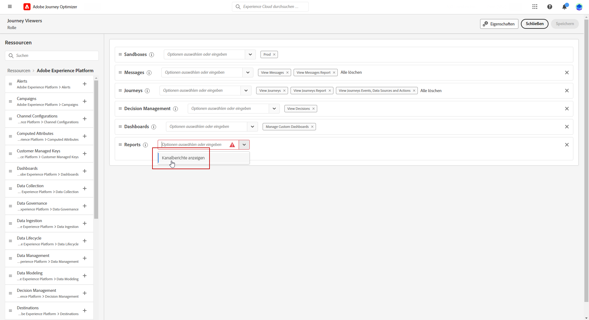

# Erste Schritte mit Kanalberichten {#channel-report-gs}

Die Kanalberichte sind ein leistungsstarkes Tool, das in einem einheitlichen Bericht einen umfassenden Überblick über Traffic- und Interaktionsmetriken für jeden Kanal bietet und alle Aktionen aller Kampagnen und Journeys umfasst. Es ist in verschiedene Widgets unterteilt, von denen jedes einen bestimmten Überblick über die Leistung der Kampagne oder Journey bietet.

Die Kanalberichte sind vollständig anpassbar, sodass Widgets in der Größe geändert oder entfernt werden können, um ein Dashboard zu erstellen, das spezifischen Anforderungen entspricht. Die Berichtsdaten können auch zur weiteren Analyse in eine PDF- oder CSV-Datei exportiert werden.

Weitere Informationen zu den verschiedenen Metriken und Widgets, die für die Kanalberichte verfügbar sind, sind auf dieser [Seite](channel-report.md) zu finden.

## Vor Beginn {#manage-reports-prereq}

Vor Beginn sollten Sie prüfen, ob Zugriff auf das Menü **[!UICONTROL Berichte]** besteht.

Wenn das Menü **[!UICONTROL Berichte]** nicht angezeigt wird, müssen Ihre Zugriffsberechtigungen um die Berechtigung **[!UICONTROL Kanalberichte anzeigen]** erweitert werden. Sie können Ihre eigenen Berechtigungen erweitern, wenn Sie Zugriff zu den [Berechtigungen](https://experienceleague.adobe.com/docs/experience-platform/access-control/home.html?lang=de){target="_blank"} in Adobe Experience Platform für Ihre Organisation haben. Falls nicht, wenden Sie sich an Ihre Adobe Journey Optimizer-Admins.

+++Mehr Informationen zum Zuweisen von Berichtsberechtigungen

Hinweis: Diese Berechtigung ist in den folgenden integrierten **[!UICONTROL Rollen]** enthalten: Campaign Manager, Campaign Approver, Campaign Viewer und Campaign Administrator.

So können entsprechende Berechtigungen für eine **[!UICONTROL Rolle]** zugewiesen werden:

1. Navigieren Sie im Produkt [!DNL Permissions] zum Menü **[!UICONTROL Rollen]** und wählen Sie die Rolle aus, die Sie mit der neuen Berechtigung **[!UICONTROL Kanalberichte anzeigen]** aktualisieren möchten.

1. Klicken Sie im Dashboard **[!UICONTROL Rolle]** auf **[!UICONTROL Bearbeiten]**.

   

1. Ziehen Sie die **[!UICONTROL Berichte]** Ressource, um Berechtigungen zuzuweisen.

   Wählen Sie aus der Ressourcen-Dropdown-Liste **[!UICONTROL Bericht]** die Berechtigung zum **[!UICONTROL Anzeigen von Kanalberichten]** aus.

   

1. Klicken Sie auf **[!UICONTROL Speichern]**.

Für diese **[!UICONTROL Rolle]** zugewiesene Benutzende können jetzt auf das Menü **[!UICONTROL Berichte]** zugreifen.

+++

## Verwalten Ihres Berichts-Dashboards {#manage-reports}

Führen Sie folgende Schritte aus, um auf Kanalberichte zuzugreifen und sie zu verwalten:

1. Navigieren Sie innerhalb des Abschnitts **[!UICONTROL Journey-Management]** zum Menü **[!UICONTROL Berichte]**.

   

1. Wählen Sie im Dashboard eine **Startzeit** und eine **[!UICONTROL Endzeit]** aus, um auf bestimmte Daten zuzugreifen.

1. Wählen Sie in der Dropdown-Liste **[!UICONTROL Aktion von]** aus, ob Sie Kampagnen, Reisen oder beides anvisieren möchten.

   

1. Wählen Sie **[!UICONTROL Ändern]** aus, um Widgets zu vergrößern oder zu entfernen und so ein Dashboard zu erstellen, das Ihren spezifischen Anforderungen entspricht.

   

1. Wenn Sie mit der Anzeigereihenfolge und der Größe Ihrer Widgets zufrieden sind, klicken Sie auf **[!UICONTROL Speichern]**.

1. Je nach Widget können Sie zwischen Tabellen, Balkendiagrammen oder Ringdiagrammen wechseln.

1. Klicken Sie auf das Prozentsymbol, um die Daten als Raten anzuzeigen.

   

## Exportieren Ihrer Berichte {#export-reports}

Sie können die Berichte einfach in PDF- oder CSV-Format exportieren, sodass sie freigeben, geändert oder gedruckt werden können. Die detaillierten Schritte zum Exportieren von Kanalberichten sind auf den folgenden Registerkarten zu finden:

>[!BEGINTABS]

>[!TAB Exportieren Ihres Berichts als PDF-Datei]

1. Klicken Sie in Ihrem Bericht auf **[!UICONTROL Exportieren]** und wählen Sie **[!UICONTROL PDF-Datei]** aus.

1. Konfigurieren Sie das Dokument wie gewünscht im Drucken-Fenster. Beachten Sie, dass die Optionen je nach Browser variieren können.

1. Wählen Sie, ob Sie Ihren Bericht als PDF drucken oder speichern möchten.

1. Suchen Sie den Ordner, in dem Sie die Datei speichern möchten, benennen Sie diesen gegebenenfalls um und klicken Sie auf Speichern.

Ihr Bericht kann jetzt in einer PDF-Datei angezeigt oder freigegeben werden.

>[!TAB Exportieren Ihres Berichts als CSV-Datei]

1. Klicken Sie in Ihrem Bericht auf **[!UICONTROL Exportieren]** und wählen Sie **[!UICONTROL CSV-Datei]** aus, um eine CSV-Datei auf der allgemeinen Berichtsebene zu generieren.

1. Daten können auch aus einem bestimmten Widget heraus exportiert werden. Klicken Sie auf **[!UICONTROL Widget-Daten in CSV exportieren]** neben dem ausgewählten Widget.

1. Die Datei wird automatisch heruntergeladen und ist in Ihren lokalen Dateien zu finden.

   Wenn die Datei auf Berichtsebene generiert wurde, enthält sie detaillierte Informationen für jedes Widget, einschließlich Titel und Daten.

   Wenn die Datei auf Widget-Ebene generiert wurde, stellt sie speziell Daten für das ausgewählte Widget bereit.

>[!ENDTABS]
