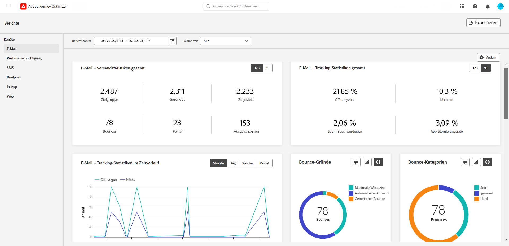
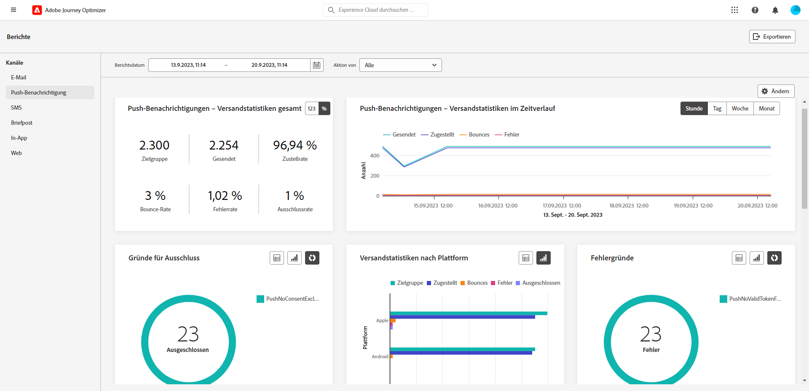
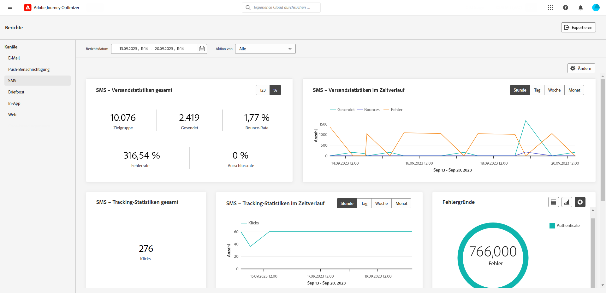
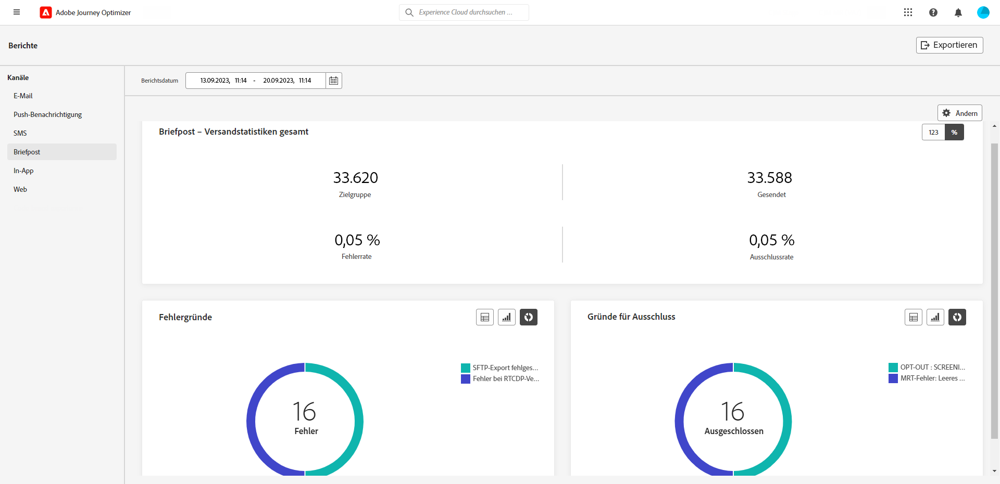
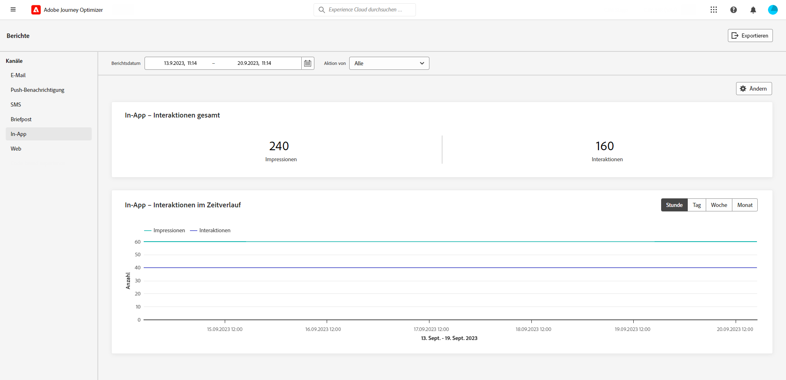
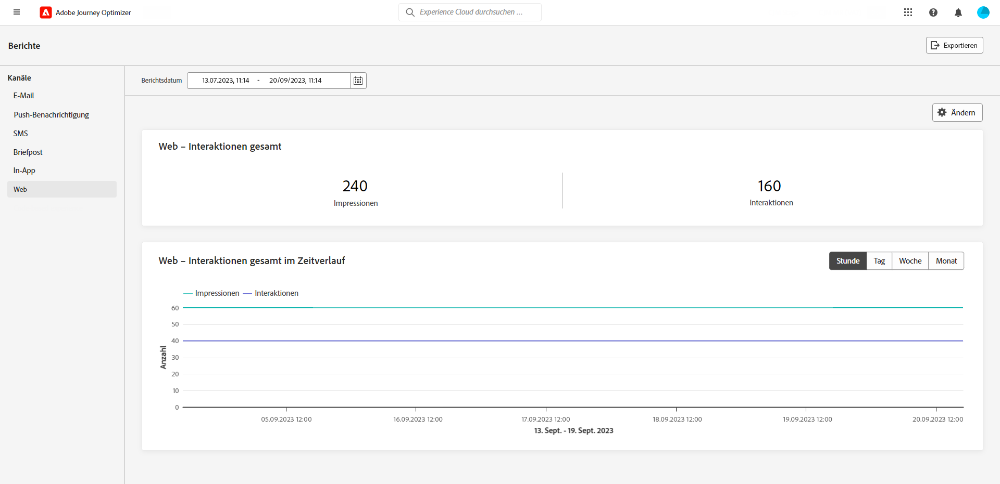

# Kanalberichte {#channel-report}

>[!CONTEXTUALHELP]
>id="ajo_channel_level_report"
>title="Bericht auf Kanalebene"
>abstract="Die Kanalberichte bieten einen umfassenden Überblick über Traffic- und Interaktionsmetriken über alle Kanäle hinweg. Die Berichte sind in verschiedene Widgets unterteilt, die den Erfolg und die Fehler der Kampagne detailliert darstellen. Jedes Reporting-Dashboard kann durch Ändern der Größe oder Entfernen von Widgets verändert werden."

>[!IMPORTANT]
>
> Um auf das Menü **Bericht** zuzugreifen, müssen Sie die Berechtigung **[!UICONTROL Kanalberichte anzeigen]** haben. [Weitere Informationen](channel-report-gs.md#before-starting-manage-reports-prereq)

Die Kanalberichte bieten Benutzenden einen umfassenden Überblick über Traffic- und Interaktionsmetriken auf Kanalebene. Die Metriken werden aggregiert, um konsolidierte Werte für Aktionen aus dem ausgewählten Kanal darzustellen, die sich über verschiedene Kampagnen und Journeys erstrecken.

Greifen Sie auf die Kanalberichte zu, indem Sie im Abschnitt **Journey-Management** zum Menü **Berichte** navigieren. Es ist vollständig anpassbar. Sie können die Daten nach Berichtsdatum oder Aktion filtern. [Weitere Informationen](channel-report-gs.md)

Die Berichtseite wird mit den folgenden Registerkarten angezeigt:

* [E-Mail](#email)
* [Push-Benachrichtigung Benachrichtigungen](#push)
* [SMS](#sms)
* [In-App](#inapp)
* [Web](#web)
* [Briefpost](#direct-mail)

➡️ [Entdecken Sie diese Funktion im Video](#channel-report-video)

## E-Mail {#email}

>[!CONTEXTUALHELP]
>id="ajo_channel_email_sending_statistics"
>title="E-Mail - Versandstatistiken insgesamt"
>abstract="Die KPIs für die Versandstatistiken von E-Mails fassen die wichtigsten Daten zu Ihren Push-Benachrichtigungen, wie z. B. Zielgerichtete oder zugestellte Nachrichten, zusammen."

>[!CONTEXTUALHELP]
>id="ajo_channel_email_tracking_statistics"
>title="E-Mail - Tracking-Statistiken insgesamt"
>abstract="Die KPIs für die Gesamtverfolgungsstatistiken von E-Mails liefern Daten zur Profilaktivität Ihrer E-Mails."

>[!CONTEXTUALHELP]
>id="ajo_channel_email_sending_statistics_overtime"
>title="E-Mail - Versandstatistiken im Zeitverlauf"
>abstract="Das Diagramm E-Mail - Versandstatistiken im Zeitverlauf enthält Daten zu gesendeten E-Mails, aufgeschlüsselt nach Stunden, Tagen, Wochen oder Monaten."

>[!CONTEXTUALHELP]
>id="ajo_channel_email_tracking_statistics_overtime"
>title="E-Mail - Trackingstatistiken im Zeitverlauf"
>abstract="Das Diagramm E-Mail - Trackingstatistiken im Zeitverlauf enthält Daten zur Profilaktivität Ihrer E-Mails, aufgeschlüsselt nach Stunden, Tagen, Wochen oder Monaten."

>[!CONTEXTUALHELP]
>id="ajo_channel_email_bounce_categories"
>title="Bounce-Kategorien"
>abstract="Die Diagramme und Tabellen der Bounce-Kategorien enthalten Daten zu temporären und permanenten Fehlern."

>[!CONTEXTUALHELP]
>id="ajo_channel_email_bounce_reasons"
>title="Bounce-Gründe"
>abstract="Die Diagramme und die Tabelle Bounces-Gründe enthalten die verfügbaren Daten zu Bounces-Nachrichten."

>[!CONTEXTUALHELP]
>id="ajo_channel_email_error_reasons"
>title="Fehlerursachen"
>abstract="Anhand der Diagramme und der Tabelle Fehlerursachen können Sie die spezifischen Fehler identifizieren, die während des Versandvorgangs aufgetreten sind."

>[!CONTEXTUALHELP]
>id="ajo_channel_email_excluded_reasons"
>title="Ausgeschlossene Gründe"
>abstract="Die Diagramme und die Tabelle Ausgeschlossene Gründe veranschaulichen die verschiedenen Faktoren, die zu Benutzerprofilen führten, die von der Zielgruppe ausgeschlossen waren und die Nachricht nicht erhielten."

>[!CONTEXTUALHELP]
>id="ajo_channel_email_sending_delivered_domains"
>title="Gesendet und von Domänen bereitgestellt"
>abstract="Das Diagramm und die Tabelle Gesendet und bereitgestellt von Domänen stellen die Verteilung der wichtigsten E-Mail-Versanddaten auf Domänenebene dar."

>[!CONTEXTUALHELP]
>id="ajo_channel_email_bounces_errors_domains"
>title="Bounces und Fehler nach Domänen"
>abstract="Das Diagramm und die Tabelle &quot;Absprünge und Fehler nach Domains&quot;zeigt die Verteilung der spezifischen Fehler auf Domänenebene, die während des Versandvorgangs aufgetreten sind."

>[!CONTEXTUALHELP]
>id="ajo_channel_email_open_clicks_domains"
>title="Öffnungen und Klicks nach Domänen"
>abstract="Das Diagramm und die Tabelle &quot;Öffnungen und Klicks nach Domänen&quot;zeigt die Verteilung der Interaktionen Ihrer Besucher mit Ihrer E-Mail auf Domänenebene."

>[!CONTEXTUALHELP]
>id="ajo_channel_email_bounce_reasons_domains"
>title="Bounce-Gründe nach Domain"
>abstract="Die Bounce-Gründe nach Domain-Diagramm und -Tabelle stellen die Verteilung der Daten auf Domänenebene für temporäre und permanente Fehler dar."

In den Kanalberichten werden im Menü „E-Mail“ die wichtigsten Informationen zu E-Mails aufgeführt, die in den Kampagnen und Journeys gesendet werden. Die Metriken werden nachfolgend beschrieben.

+++ Erfahren Sie mehr über die verschiedenen Metriken und Widgets, die für den E-Mail-Bericht verfügbar sind.

Der Graph **[!UICONTROL Gesamte E-Mail-Sendestatistik]** gibt Aufschluss über den Erfolg Ihrer E-Mails:

* **[!UICONTROL Angesprochen]**: Gesamtzahl der verarbeiteten E-Mails.

* **[!UICONTROL Gesendet]**: Gesamtzahl der gesendeten Nachrichten.

* **[!UICONTROL Zugestellt]**: Anzahl der erfolgreich gesendeten E-Mails in Bezug auf die Gesamtzahl der gesendeten Nachrichten.

* **[!UICONTROL Versandrate]**: Prozentsatz der erfolgreich gesendeten E-Mails.

* **[!UICONTROL Bounces]**: Gesamtzahl der Fehler und automatischen Rücksendungen, bezogen auf die Gesamtzahl der gesendeten Nachrichten.

* **[!UICONTROL Bounce-Rate]**: Prozentsatz der E-Mails, die nicht erfolgreich zugestellt wurden, im Vergleich zur Zahl der gesendeten E-Mails.

* **[!UICONTROL Fehler]**: Gesamtzahl der aufgetretenen Fehler, die die Zustellung an Profile verhindert haben.

* **[!UICONTROL Fehlerrate]**: Prozentsatz der Fehler, die auftraten und die Zustellung verhinderten, im Vergleich zur Zahl der gesendeten E-Mails.

* **[!UICONTROL Ausgeschlossen]**: Anzahl der Profile, die durch Adobe Journey Optimizer ausgeschlossen wurden.

* **[!UICONTROL Ausschlussrate]**: Prozentsatz der Profile, die durch Adobe Journey Optimizer ausgeschlossen wurden.

Die **[!UICONTROL Trackingstatistiken in E-Mails]** -Widget enthält die verfügbaren Daten für die Profilaktivität für Ihre E-Mails:

* **[!UICONTROL Öffnungen]**: Anzahl der Öffnungen der Nachricht.

* **[!UICONTROL Öffnungsrate]**: Gesamtzahl der geöffneten E-Mails im Vergleich zu den versendeten E-Mails.

* **[!UICONTROL Klicks]**: Anzahl der Klicks auf einen Inhalt in einer Nachricht.

* **[!UICONTROL Klickrate]**: Prozentsatz der Benutzenden, die mit der E-Mail interagiert haben.

* **[!UICONTROL Beschwerden wegen Spam]**: Gibt an, wie oft eine Nachricht als Spam oder Junk gekennzeichnet wurde.

* **[!UICONTROL Spam-Beschwerderate]**: Prozentsatz der als Spam oder Junk deklarierten Nachrichten in Bezug auf die Anzahl der gesendeten E-Mails.

* **[!UICONTROL Abo beenden]**: Zahl der Klicks auf den Abo-Link.

* **[!UICONTROL Abmelderate]**: Prozentsatz der Abmeldungen in Bezug auf die Anzahl der gesendeten E-Mails.

Der Graph **[!UICONTROL Versandstatistiken im Zeitverlauf]** enthält die Daten, die für gesendete E-Mails verfügbar sind, z. B.:

* **[!UICONTROL Gesendet]**: Gesamtzahl der gesendeten Nachrichten.

* **[!UICONTROL Zugestellt]**: Anzahl der erfolgreich gesendeten E-Mails in Bezug auf die Gesamtzahl der gesendeten E-Mails.

* **[!UICONTROL Bounces]**: Gesamtzahl der Fehler und automatischen Rücksendungen, bezogen auf die Gesamtzahl der gesendeten E-Mails.

* **[!UICONTROL Fehler]**: Gesamtzahl der aufgetretenen Fehler, die die Zustellung an Profile verhindert haben.

Der Graph **[!UICONTROL E-Mail-Tracking-Statistiken im Zeitverlauf]** enthält die Daten, die für Öffnungen und Klicks verfügbar sind.

Die Widgets **[!UICONTROL Bounce-Gründe]** und **[!UICONTROL Bounce-Kategorien]** enthalten die verfügbaren Daten zu unzustellbaren Nachrichten wie:

* **[!UICONTROL Hardbounce]**: die Gesamtzahl der permanenten Fehler, wie eine falsche E-Mail-Adresse. Dazu gehören Fehlermeldungen, die explizit eine ungültige Adresse anzeigen, wie etwa „Benutzer unbekannt“.

* **[!UICONTROL Softbounce]**: die Gesamtzahl der temporären Fehler, wie ein voller Posteingang.

* **[!UICONTROL Ignoriert]**: Die Gesamtzahl der temporären Ereignisse, beispielsweise Abwesenheit, oder technischer Fehler, zum Beispiel wenn der Absendertyp Postmaster ist.

Weitere Informationen zu Bounces finden Sie auf der Seite [ Unterdrückungslisten](../reports/suppression-list.md).

Der Graph und die Tabelle **[!UICONTROL Fehlergründe]** zeigen, welcher Fehler während des Versands aufgetreten ist.

Der Graph und die Tabelle **[!UICONTROL Ausschlussgründe]** zeigen die verschiedenen Gründe an, die verhindert haben, dass Nutzerprofile, die von den Zielprofilen ausgeschlossen wurden, die Nachricht erhalten haben.

Die Tabellen und Graphen **[!UICONTROL Bounce-Gründe nach Domain]**, **[!UICONTROL Gesendet und zugestellt nach Domain]**, **[!UICONTROL Öffnungen und Klicks nach Domain]** und **[!UICONTROL Bounces und Fehler nach Domain]** bieten eine Aufschlüsselung aller E-Mail-Versand- und Tracking-Daten auf Domain-Ebene.
+++

## Push-Benachrichtigung {#push}

>[!CONTEXTUALHELP]
>id="ajo_channel_push_sending_statistics"
>title="Push-Benachrichtigungen - Versandstatistiken insgesamt"
>abstract="Die KPIs der Push-Benachrichtigungen - Gesamtstatistiken des Versands fassen wichtige Daten zu Ihren Push-Benachrichtigungen zusammen, z. B. &quot;Zielkontakte&quot;oder &quot;Zugestellt&quot;."

>[!CONTEXTUALHELP]
>id="ajo_channel_push_tracking_statistics"
>title="Push-Benachrichtigung - Tracking-Statistiken insgesamt"
>abstract="Die Statistiken zur Push-Benachrichtigung - Gesamtverfolgung liefern Daten zur Profilaktivität Ihrer Push-Benachrichtigungen."

>[!CONTEXTUALHELP]
>id="ajo_channel_push_sending_statistics_overtime"
>title="Push-Benachrichtigungen - Versandstatistiken im Zeitverlauf"
>abstract="Die Statistik zum Versand von Push-Benachrichtigungen im Zeitverlauf enthält Daten zu gesendeten Push-Benachrichtigungen, aufgeschlüsselt nach Stunden, Tagen, Wochen oder Monaten."

>[!CONTEXTUALHELP]
>id="ajo_channel_push_tracking_statistics_overtime"
>title="Push-Benachrichtigungen - Trackingstatistiken im Zeitverlauf"
>abstract="Das Diagramm Push-Benachrichtigungen - Trackingstatistiken im Zeitverlauf liefert Daten zur Profilaktivität Ihrer Push-Benachrichtigungen, aufgeschlüsselt nach Stunden, Tagen, Wochen oder Monaten."

>[!CONTEXTUALHELP]
>id="ajo_channel_push_excluded_reasons"
>title="Ausgeschlossene Gründe"
>abstract="Die Diagramme und die Tabelle Ausgeschlossene Gründe veranschaulichen die verschiedenen Faktoren, die zu Benutzerprofilen führten, die von der Zielgruppe ausgeschlossen waren und die Nachricht nicht erhielten."

>[!CONTEXTUALHELP]
>id="ajo_channel_push_error_reasons"
>title="Fehlerursachen"
>abstract="Anhand der Diagramme und der Tabelle Fehlerursachen können Sie die spezifischen Fehler identifizieren, die während des Versandvorgangs aufgetreten sind."

>[!CONTEXTUALHELP]
>id="ajo_channel_push_tracking_statistics_platform"
>title="Trackingstatistiken nach Plattform"
>abstract="Die Trackingstatistiken nach Plattformdiagramm und Tabelle enthalten je nach Betriebssystem Ihres Profils Daten zur Profilaktivität für Ihre Push-Benachrichtigungen."

>[!CONTEXTUALHELP]
>id="ajo_channel_push_sending_statistics_platform"
>title="Versandstatistiken nach Plattform"
>abstract="Die Tabelle Versandstatistiken nach Plattformdiagramm und -diagramm enthält Daten zu gesendeten Push-Benachrichtigungen."

In Ihren Kanalberichten werden im Menü „Push-Benachrichtigung“ die wichtigsten Informationen zu Push-Benachrichtigungen aufgeführt, die in Ihren Kampagnen und Journeys gesendet werden. Die Metrik wird nachfolgend beschrieben.

+++  Erfahren Sie mehr über die verschiedenen Metriken und Widgets, die für den Push-Bericht verfügbar sind.

Die Tabelle **[!UICONTROL Push-Benachrichtigung – Gesamte Sendestatistiken]** enthält die wichtigsten Informationen zu Ihren Push-Benachrichtigungen mit Graph und KPIs:

* **[!UICONTROL Angesprochen]**: Gesamtzahl der verarbeiteten Push-Benachrichtigungen.

* **[!UICONTROL Gesendet]**: Gesamtzahl der gesendeten Push-Benachrichtigungen

* **[!UICONTROL Zugestellt]**: Anzahl der erfolgreich gesendeten Push-Benachrichtigungen in Bezug auf die Gesamtzahl der gesendeten Push-Benachrichtigungen

* **[!UICONTROL Versandrate]**: Prozentsatz der erfolgreich gesendeten Push-Benachrichtigungen.

* **[!UICONTROL Bounces]**: Gesamtzahl der Fehler und automatischen Rücksendungen, bezogen auf die Gesamtzahl der gesendeten Nachrichten.

* **[!UICONTROL Bounce-Rate]**: Prozentsatz der Push-Benachrichtigungen, die unzustellbar waren, im Vergleich zu den gesendeten Push-Benachrichtigungen.

* **[!UICONTROL Fehler]**: Gesamtzahl der aufgetretenen Fehler, die die Zustellung an Profile verhindert haben.

* **[!UICONTROL Fehlerrate]**: Prozentualer Anteil der aufgetretenen Fehler, die den Versand verhindert haben, im Vergleich zu den gesendeten Push-Benachrichtigungen.

* **[!UICONTROL Ausgeschlossen]**: Anzahl der Profile, die durch Adobe Journey Optimizer ausgeschlossen wurden.

* **[!UICONTROL Ausschlussrate]**: Prozentsatz der Profile, die durch Adobe Journey Optimizer ausgeschlossen wurden.

Die **[!UICONTROL Push-Benachrichtigung - Tracking-Statistiken insgesamt]** enthält die verfügbaren Daten für die Profilaktivität Ihrer Push-Benachrichtigungen:

* **[!UICONTROL Öffnungen]**: Gibt an, wie oft eine Push-Benachrichtigung geöffnet wurde.

* **[!UICONTROL Öffnungsrate]**: Prozentsatz der geöffneten Push-Benachrichtigungen.

* **[!UICONTROL Aktionen]**: Gesamtzahl der Aktionen, die bei der gesendeten Push-Benachrichtigung durchgeführt wurden, d. h. Klick auf Schaltfläche oder Abbruch.

* **[!UICONTROL Aktionsrate]**: Prozentsatz der Aktionen, die bei zugestellten Push-Benachrichtigungen durchgeführt wurden, im Vergleich zu gesendeten Push-Benachrichtigungen.

* **[!UICONTROL Interaktionsrate]**: Prozentsatz der Öffnungen und Aktionen für diese Push-Benachrichtigung, d. h. wenn das Profil die Push-Benachrichtigung geöffnet hat oder auf eine Schaltfläche geklickt wurde.

Der Graph **[!UICONTROL Push-Benachrichtigungen – Versandstatistiken im Zeitverlauf]** enthält die Daten, die für gesendete Push-Benachrichtigungen verfügbar sind, z. B.:

* **[!UICONTROL Gesendet]**: Gesamtzahl der gesendeten Push-Benachrichtigungen

* **[!UICONTROL Zugestellt]**: Anzahl der erfolgreich gesendeten Push-Benachrichtigungen in Bezug auf die Gesamtzahl der gesendeten Push-Benachrichtigungen

* **[!UICONTROL Bounces]**: Gesamtzahl der Fehler und automatischen Rücksendungen, bezogen auf die Gesamtzahl der gesendeten Nachrichten.

* **[!UICONTROL Fehler]**: Gesamtzahl der aufgetretenen Fehler, die die Zustellung an Profile verhindert haben.

Der Graph und die Tabelle **[!UICONTROL Ausschlussgründe]** zeigen die verschiedenen Gründe an, die verhindert haben, dass Nutzerprofile, die von den Zielprofilen ausgeschlossen wurden, die Nachricht erhalten haben.

Der Graph und die Tabelle **[!UICONTROL Fehlergründe]** zeigen, welcher Fehler aufgetreten ist.

Die **[!UICONTROL Tracking nach Plattform]** und **[!UICONTROL Versand nach Plattform]** Grafiken und Tabellen zeigen den Erfolg Ihrer Push-Benachrichtigung in Abhängigkeit vom Betriebssystem Ihres Profils.
+++

## SMS {#sms}

>[!CONTEXTUALHELP]
>id="ajo_channel_sms_sending_statistics"
>title="SMS - Versandstatistiken insgesamt"
>abstract="Die KPIs für die Versandstatistiken von SMS fassen die wichtigsten Daten zu Ihren SMS-Nachrichten, z. B. &quot;Zielkontakte&quot; oder &quot;Zugestellt&quot;, zusammen."

>[!CONTEXTUALHELP]
>id="ajo_channel_sms_tracking_statistics"
>title="SMS - Trackingstatistiken insgesamt"
>abstract="Die SMS - Tracking-Statistiken insgesamt liefern Daten zur Profilaktivität Ihrer SMS-Nachrichten."

>[!CONTEXTUALHELP]
>id="ajo_channel_sms_sending_statistics_overtime"
>title="SMS - Versandstatistiken im Zeitverlauf"
>abstract="Das Diagramm SMS - Versandstatistiken im Zeitverlauf zeigt Daten zu gesendeten SMS-Nachrichten, aufgeschlüsselt nach Stunden, Tagen, Wochen oder Monaten."

>[!CONTEXTUALHELP]
>id="ajo_channel_sms_tracking_statistics_overtime"
>title="SMS - Trackingstatistiken im Zeitverlauf"
>abstract="Das Diagramm SMS - Trackingstatistiken im Zeitverlauf enthält Daten zur Profilaktivität Ihrer SMS-Nachrichten, aufgeschlüsselt nach Stunden, Tagen, Wochen oder Monaten."

>[!CONTEXTUALHELP]
>id="ajo_channel_sms_excluded_reasons"
>title="Ausgeschlossene Gründe"
>abstract="Die Diagramme und die Tabelle Ausgeschlossene Gründe veranschaulichen die verschiedenen Faktoren, die zu Benutzerprofilen führten, die von der Zielgruppe ausgeschlossen waren und die Nachricht nicht erhielten."

>[!CONTEXTUALHELP]
>id="ajo_channel_sms_bounce_reasons"
>title="Bounce-Gründe"
>abstract="Die Diagramme und die Tabelle Bounces-Gründe enthalten die verfügbaren Daten zu Bounces-Nachrichten."

>[!CONTEXTUALHELP]
>id="ajo_channel_sms_error_reasons"
>title="Fehlerursachen"
>abstract="Anhand der Diagramme und der Tabelle Fehlerursachen können Sie die spezifischen Fehler identifizieren, die während des Versandvorgangs aufgetreten sind."

In den Kanalberichten werden im Menü „SMS“ die wichtigsten Informationen zu SMS-Nachrichten aufgeführt, die in Ihren Kampagnen und Journeys versendet wurden. Die Metriken werden nachfolgend beschrieben.

+++ Erfahren Sie mehr über die verschiedenen Metriken und Widgets, die für den SMS-Bericht verfügbar sind.

Die Tabelle **[!UICONTROL SMS – Gesamte Sendestatistiken]** gibt Auskunft über den Erfolg des SMS-Versands:

* **[!UICONTROL Angesprochen]**: Anzahl der Benutzerprofile, die sich als Zielgruppenprofile für den SMS-Kanal eignen.

* **[!UICONTROL Gesendet]**: Gesamtzahl der gesendeten SMS-Nachrichten.

* **[!UICONTROL Zugestellt]**: Anzahl der erfolgreich gesendeten SMS-Nachrichten in Bezug auf die Gesamtzahl der gesendeten SMS-Nachrichten.

* **[!UICONTROL Versandrate]**: Prozentsatz der erfolgreich gesendeten SMS-Nachrichten.

* **[!UICONTROL Bounces]**: Gesamtzahl der Fehler und automatischen Rücksendeverarbeitungen im Verhältnis zur Gesamtzahl der gesendeten SMS-Nachrichten.

* **[!UICONTROL Bounce-Rate]**: Prozentsatz der SMS-Nachrichten, die nicht erfolgreich zugestellt wurden, im Vergleich zur Anzahl der gesendeten SMS-Nachrichten.

* **[!UICONTROL Fehler]**: Gesamtzahl der aufgetretenen Fehler, die die Zustellung an Profile verhindert haben.

* **[!UICONTROL Fehlerrate]**: Prozentsatz der Fehler, die auftraten und die Zustellung verhinderten, im Vergleich zur Zahl der gesendeten SMS-Nachrichten.

* **[!UICONTROL Ausgeschlossen]**: Anzahl der Benutzerprofile, die von den Zielgruppenprofilen ausgeschlossen waren und die die Nachricht nicht erhalten haben.

* **[!UICONTROL Ausschlussrate]**: Prozentsatz der Profile, die durch Adobe Journey Optimizer ausgeschlossen wurden.

Das Widget **[!UICONTROL SMS – Tracking-Statistiken gesamt]** enthält die wichtigsten Informationen zur Interaktion der Besucherinnen und Besucher mit den URLs.

* **[!UICONTROL Klicks]**: Anzahl der Klicks auf einen Inhalt in einer SMS-Nachricht.

* **[!UICONTROL Klickrate]**: Prozentsatz der Benutzenden, die mit der SMS-Nachricht interagiert haben.

Das Widget **[!UICONTROL SMS – Versandstatistiken im Zeitverlauf]** enthält die wichtigsten Informationen zu den Nachricht in Form eines Graphen:

* **[!UICONTROL Gesendet]**: Gesamtzahl der gesendeten SMS-Nachrichten.

* **[!UICONTROL Zugestellt]**: Anzahl der erfolgreich gesendeten SMS-Nachrichten in Bezug auf die Gesamtzahl der gesendeten SMS-Nachrichten.

* **[!UICONTROL Bounces]**: Gesamtzahl der Fehler und automatischen Rücksendeverarbeitungen im Verhältnis zur Gesamtzahl der gesendeten SMS-Nachrichten.

* **[!UICONTROL Fehler]**: Gesamtzahl der aufgetretenen Fehler, die die Zustellung an Profile verhindert haben.

Die Graphen und Tabellen **[!UICONTROL Ausschlussursachen]**, **[!UICONTROL Bounce-Ursachen]** und **[!UICONTROL Fehlerursachen]** zeigen, welche Fehler und Ausschlüsse aufgetreten sind.

+++

## Briefpost {#direct-mail}

>[!CONTEXTUALHELP]
>id="ajo_channel_direct_sending_statistics"
>title="Briefpost - Versandstatistiken insgesamt"
>abstract="Die KPIs für die Versandstatistiken von Briefpost fassen die wesentlichen Daten zu Ihren Briefpost-Nachrichten wie &quot;Zielkontaktiert&quot;oder &quot;Zugestellt&quot;zusammen."

>[!CONTEXTUALHELP]
>id="ajo_channel_direct_excluded_reasons"
>title="Ausgeschlossene Gründe"
>abstract="Die Diagramme und die Tabelle Ausgeschlossene Gründe veranschaulichen die verschiedenen Faktoren, die zu Benutzerprofilen führten, die von der Zielgruppe ausgeschlossen waren und die Nachricht nicht erhielten."

>[!CONTEXTUALHELP]
>id="ajo_channel_direct_error_reasons"
>title="Fehlerursachen"
>abstract="Anhand der Diagramme und der Tabelle Fehlerursachen können Sie die spezifischen Fehler identifizieren, die während des Versandvorgangs aufgetreten sind."

In den Kanalberichten werden im Menü „Briefpost“ die wichtigsten Informationen zu Briefpost-Nachrichten aufgeführt, die in Ihren Kampagnen und Journeys gesendet werden. Die Metriken werden nachfolgend beschrieben.

+++ Erfahren Sie mehr über die verschiedenen Metriken und Widgets, die für den Briefpost-Bericht verfügbar sind.

Die Tabelle **[!UICONTROL Briefpost – Versandstatistiken gesamt]** gibt Auskunft über den Erfolg Ihrer Nachrichten:

* **[!UICONTROL Angesprochen]**: Anzahl der Benutzerprofile, die sich als Zielgruppenprofile für die Briefpost-Nachrichten eignen.

* **[!UICONTROL Gesendet]**: Gesamtzahl der gesendeten Nachrichten.

* **[!UICONTROL Fehler]**: Gesamtzahl der aufgetretenen Fehler, die den Versand an Profile verhindert haben.

* **[!UICONTROL Fehlerrate]**: Prozentualer Anteil der aufgetretenen Fehler, die den Versand verhindert haben, im Vergleich zu den gesendeten Push-Benachrichtigungen.

* **[!UICONTROL Ausgeschlossen]**: Anzahl der Benutzerprofile, die von den Zielgruppenprofilen ausgeschlossen waren und die die Nachricht nicht erhalten haben.

* **[!UICONTROL Ausschlussrate]**: Prozentsatz der Profile, die durch Adobe Journey Optimizer ausgeschlossen wurden.

In den Graphen und Tabellen **[!UICONTROL Ausschlussursachen]** und **[!UICONTROL Fehlergründen]** wird angezeigt, welche Fehler und Ausschlüsse aufgetreten sind.
+++

## In-App {#in-app}

>[!CONTEXTUALHELP]
>id="ajo_channel_inapp_engagement"
>title="In-App - Interaktion insgesamt"
>abstract="Die KPIs für die Interaktion in der App - Gesamtanzahl enthalten umfassende Informationen über die Interaktion Ihrer Besucher mit Ihren In-App-Nachrichten, einschließlich Metriken wie Impressionen und Interaktionen."

>[!CONTEXTUALHELP]
>id="ajo_channel_inapp_engagement_overtime"
>title="In-App - Interaktionsüberstunden"
>abstract="Das Diagramm In-App - Interaktion über einen Zeitverlauf verfolgt In-App-Impressionen und -Interaktionen und bietet stündliche, tägliche, wöchentliche und monatliche Aufschlüsselungen."

In den Kanalberichten werden im Menü „In-App“ die wichtigsten Informationen zu In-App-Nachrichten aufgeführt, die in den Kampagnen und Journeys gesendet werden. Die Metriken werden nachfolgend beschrieben.

+++  Erfahren Sie mehr über die verschiedenen Metriken und Widgets, die für den In-App-Bericht verfügbar sind.

Die KPIs der **[!UICONTROL In-App-Interaktionen gesamt]** geben die wichtigsten Informationen bezüglich der Interaktion der Besucherinnen und Besucher mit den In-App-Nachrichten an, z. B.:

* **[!UICONTROL Impressions]**: Gesamtzahl der an alle Benutzenden gesendeten In-App-Nachrichten.

* **[!UICONTROL Interaktionen]**: Gesamtzahl der Interaktionen mit der In-App-Nachricht. Dazu gehören alle von den Benutzenden durchgeführten Aktionen, wie z. B. Klicks, Abbrechen oder andere Interaktionen.

* **[!UICONTROL Abweisungen]**: Gesamtzahl der In-App-Nachrichten, die von Profilen verworfen wurden, indem diese entweder die Schließen-Schaltfläche oder die automatische Funktion zum Entfernen der Nachricht verwendet haben.

* **[!UICONTROL Abbruchrate]**: Prozentsatz der In-App-Nachrichten, die von Profilen verworfen wurden

Die Grafik **[!UICONTROL In-App-Interaktionen im Zeitverlauf]** zeigt die Entwicklung der In-App-Impressions und -Interaktionen für den jeweiligen Zeitraum an, indem Impressions, Abbrechen oder Interaktionen verfolgt werden.

+++

## Web {#web}

>[!CONTEXTUALHELP]
>id="ajo_channel_web_engagement"
>title="Web - Interaktion insgesamt"
>abstract="Die Interaktions-KPIs Web - Gesamtanzahl liefern umfassende Informationen über die Interaktion Ihrer Besucher mit Ihren Webseiten, einschließlich Metriken wie Impressionen und Interaktionen."

>[!CONTEXTUALHELP]
>id="ajo_channel_web_engagement_overtime"
>title="Web - Gesamtinteraktionsüberstunden"
>abstract="Das Diagramm Web - Interaktion im Zeitverlauf verfolgt die Impressionen und Interaktionen Ihrer Webseiten und bietet stündliche, tägliche, wöchentliche und monatliche Aufschlüsselungen."

In den Kanalberichten werden im Menü „Web“ die wichtigsten Informationen zu Web-Seiten aufgeführt, die in Ihren Kampagnen und Journeys versendet wurden. Die Metriken werden nachfolgend beschrieben.

+++ Erfahren Sie mehr über die verschiedenen Metriken und Widgets, die für den Web-Bericht verfügbar sind.

Die KPIs der **[!UICONTROL Web-Interaktionen gesamt]** geben die wichtigsten Informationen bezüglich der Interaktion der Besucherinnen und Besucher mit Ihren Web-Erlebnissen an, z. B.:

* **[!UICONTROL Impressions]**: Gesamtanzahl der für alle Benutzenden bereitgestellten Web-Erlebnisse.

* **[!UICONTROL Interaktionen]**: Gesamtzahl der Interaktionen mit Ihrer Web-Seite. Dazu gehören alle von den Benutzenden durchgeführten Aktionen, wie z. B. Klicks oder andere Interaktionen.

* **[!UICONTROL Abweisungen]**: Gesamtzahl der Webseiten, die von Profilen verworfen wurden.

* **[!UICONTROL Abbruchrate]**: Prozentsatz der Webseiten, die Profile verworfen haben.

Die Grafik **[!UICONTROL Web-Interaktion im Zeitverlauf]** enthält die wichtigsten Informationen zur Interaktion der Besuchenden mit den Web-Seiten.

+++

## Kanalbericht (Video) {#channel-report-video}

In diesem Video gibt es weitere Informationen dazu, wie auf Kanalebene auf Berichte zugegriffen, darin navigiert und diese exportiert werden können.

>[!VIDEO](https://video.tv.adobe.com/v/3424537?quality=12)
