# Kanalberichte {#channel-report}

>[!CONTEXTUALHELP]
>id="ajo_channel_level_report"
>title="Bericht auf Kanalebene"
>abstract="Die Kanalberichte bieten einen umfassenden Überblick über Traffic- und Interaktionsmetriken über alle Kanäle hinweg. Die Berichte sind in verschiedene Widgets unterteilt, die den Erfolg und die Fehler der Kampagne detailliert darstellen. Jedes Reporting-Dashboard kann durch Ändern der Größe oder Entfernen von Widgets verändert werden."

>[!IMPORTANT]
>
> Um auf das Menü **Bericht** zuzugreifen, müssen Sie die Berechtigung **[!UICONTROL Kanalberichte anzeigen]** haben. [Weitere Informationen](channel-report-gs.md#before-starting-manage-reports-prereq)

Die Kanalberichte bieten Benutzenden einen umfassenden Überblick über Traffic- und Interaktionsmetriken auf Kanalebene. Die Metriken werden aggregiert, um konsolidierte Werte für Aktionen aus dem ausgewählten Kanal darzustellen, die sich über verschiedene Kampagnen und Journeys erstrecken.

Greifen Sie auf die Kanalberichte zu, indem Sie im Abschnitt **Journey-Management** zum Menü **Berichte** navigieren. Es ist vollständig anpassbar. Sie können die Daten nach Berichtsdatum oder Aktion filtern. [Weitere Informationen](channel-report-gs.md)

Die Berichtseite wird mit den folgenden Registerkarten angezeigt:

* [E-Mail](#email)
* [Push-Benachrichtigungen ](#push)
* [SMS](#sms)
* [In-App](#inapp)
* [Web](#web)
* [Briefpost](#direct-mail)

➡️ [Entdecken Sie diese Funktion im Video](#channel-report-video)

## E-Mail {#email}

In den Kanalberichten werden im Menü „E-Mail“ die wichtigsten Informationen zu E-Mails aufgeführt, die in den Kampagnen und Journeys gesendet werden. Die Metriken werden nachfolgend beschrieben.

### Gesamtstatistik E-Mail – Versand {#email-total-sending}

>[!CONTEXTUALHELP]
>id="ajo_channel_email_sending_statistics"
>title="Gesamtstatistik E-Mail – Versand"
>abstract="Die KPIs für die Versandstatistiken von E-Mails insgesamt fassen wichtige Daten zu Ihren E-Mails zusammen, z. B. Zielgerichtete oder zugestellte Nachrichten."

Die **[!UICONTROL Versandstatistiken für E-Mail]** Widget bietet einen umfassenden Überblick über Ihre E-Mail-Leistung und zeigt wichtige Leistungsindikatoren (KPIs) an, die wichtige Daten zu Ihren E-Mails zusammenfassen.

+++ Erfahren Sie mehr über die Metriken zum Gesamtversand von E-Mail-Statistiken

* **[!UICONTROL Angesprochen]**: Gesamtzahl der verarbeiteten E-Mails.

* **[!UICONTROL Gesendet]**: Gesamtzahl der gesendeten Nachrichten.

* **[!UICONTROL Zugestellt]**: Anzahl der erfolgreich gesendeten E-Mails in Bezug auf die Gesamtzahl der gesendeten Nachrichten.

* **[!UICONTROL Versandrate]**: Prozentsatz der erfolgreich gesendeten E-Mails.

* **[!UICONTROL Bounces]**: Gesamtzahl der Fehler und automatischen Rücksendungen, bezogen auf die Gesamtzahl der gesendeten Nachrichten.

* **[!UICONTROL Bounce-Rate]**: Prozentsatz der E-Mails, die nicht erfolgreich zugestellt wurden, im Vergleich zur Zahl der gesendeten E-Mails.

* **[!UICONTROL Fehler]**: Gesamtzahl der aufgetretenen Fehler, die die Zustellung an Profile verhindert haben.

* **[!UICONTROL Fehlerrate]**: Prozentsatz der Fehler, die auftraten und die Zustellung verhinderten, im Vergleich zur Zahl der gesendeten E-Mails.

* **[!UICONTROL Ausgeschlossen]**: Anzahl der Profile, die durch Adobe Journey Optimizer ausgeschlossen wurden.

* **[!UICONTROL Ausschlussrate]**: Prozentsatz der Profile, die durch Adobe Journey Optimizer ausgeschlossen wurden.

+++

### Gesamtstatistik E-Mail – Tracking {#email-total-tracking}

>[!CONTEXTUALHELP]
>id="ajo_channel_email_tracking_statistics"
>title="Gesamtstatistik E-Mail – Tracking"
>abstract="Die KPIs „Gesamtstatistik E-Mail – Tracking“ liefern Daten zur Profilaktivität für Ihre E-Mails."

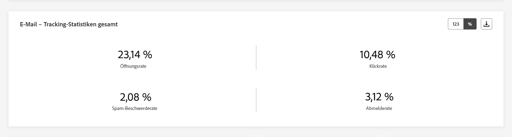

Die **[!UICONTROL Trackingstatistiken in E-Mails]** Widget bietet eine detaillierte Momentaufnahme der Profilaktivität, die mit Ihren E-Mails verknüpft ist, und bietet wichtige Einblicke in Interaktion und E-Mail-Effektivität.

+++ Erfahren Sie mehr über die Metriken zur Gesamtrückverfolgungsstatistik von E-Mails

* **[!UICONTROL Öffnungen]**: Anzahl der Öffnungen der Nachricht.

* **[!UICONTROL Öffnungsrate]**: Gesamtzahl der geöffneten E-Mails im Vergleich zu den versendeten E-Mails.

* **[!UICONTROL Klicks]**: Anzahl der Klicks auf einen Inhalt in einer Nachricht.

* **[!UICONTROL Klickrate]**: Prozentsatz der Benutzenden, die mit der E-Mail interagiert haben.

* **[!UICONTROL Beschwerden wegen Spam]**: Gibt an, wie oft eine Nachricht als Spam oder Junk gekennzeichnet wurde.

* **[!UICONTROL Spam-Beschwerderate]**: Prozentsatz der als Spam oder Junk deklarierten Nachrichten in Bezug auf die Anzahl der gesendeten E-Mails.

* **[!UICONTROL Abo beenden]**: Zahl der Klicks auf den Abo-Link.

* **[!UICONTROL Abmelderate]**: Prozentsatz der Abmeldungen in Bezug auf die Anzahl der gesendeten E-Mails.

+++

### E-Mail – Versandstatistik im Zeitverlauf {#email-sending-statistics-overtime}

>[!CONTEXTUALHELP]
>id="ajo_channel_email_sending_statistics_overtime"
>title="E-Mail – Versandstatistik im Zeitverlauf"
>abstract="Der Graph „E-Mail – Versandstatistik im Zeitverlauf“ enthält Daten zu gesendeten E-Mails, aufgeschlüsselt nach Stunden, Tagen, Wochen oder Monaten."

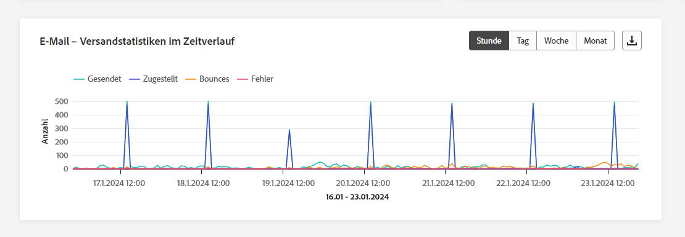

Die **[!UICONTROL E-Mail - Versandstatistiken im Zeitverlauf]** -Diagramm bietet eine dynamische Darstellung mit einer Analyse Ihrer E-Mail-Aktivität. Diese grafische Darstellung bietet eine umfassende Aufschlüsselung gesendeter E-Mails, mit der Sie Trends und Muster auf stündlicher, täglicher, wöchentlicher oder monatlicher Basis beobachten können.

+++ Weitere Informationen zu E-Mail - Versandstatistiken über Zeitmetriken

* **[!UICONTROL Gesendet]**: Gesamtzahl der gesendeten Nachrichten.

* **[!UICONTROL Zugestellt]**: Anzahl der erfolgreich gesendeten E-Mails in Bezug auf die Gesamtzahl der gesendeten E-Mails.

* **[!UICONTROL Bounces]**: Gesamtzahl der Fehler und automatischen Rücksendungen, bezogen auf die Gesamtzahl der gesendeten E-Mails.

* **[!UICONTROL Fehler]**: Gesamtzahl der aufgetretenen Fehler, die die Zustellung an Profile verhindert haben.

+++

### E-Mail – Tracking-Statistik im Zeitverlauf {#email-tracking-statistics-overtime}

>[!CONTEXTUALHELP]
>id="ajo_channel_email_tracking_statistics_overtime"
>title="E-Mail – Tracking-Statistik im Zeitverlauf"
>abstract="Der Graph „E-Mail – Tracking-Statistik im Zeitverlauf“ enthält Daten zur Profilaktivität Ihrer E-Mails, aufgeschlüsselt nach Stunden, Tagen, Wochen oder Monaten."

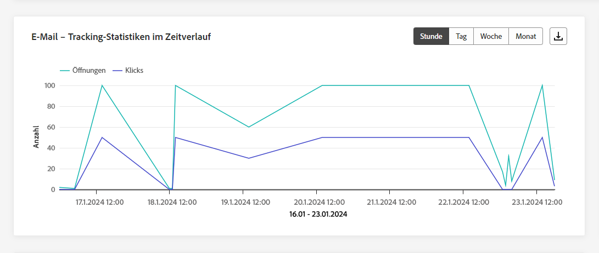

Die **[!UICONTROL E-Mail - Trackingstatistiken im Zeitverlauf]** Das Diagramm bietet einen detaillierten Überblick über die Profilaktivität in Bezug auf Ihre E-Mails. Diese grafische Darstellung unterteilt die Daten auf stündlicher, täglicher, wöchentlicher oder monatlicher Basis und bietet wertvolle Einblicke in die Entwicklung der Interaktion der Empfänger im Laufe verschiedener Zeitintervalle.

+++ Weitere Informationen zu E-Mail - Trackingstatistiken im Zeitverlauf

* **[!UICONTROL Öffnungen]**: Anzahl der Öffnungen der Nachricht.

* **[!UICONTROL Klicks]**: Anzahl der Klicks auf einen Inhalt in einer Nachricht.

+++

### E-Mail - Bounce-Kategorien und -Gründe {#bounce-categories}

>[!CONTEXTUALHELP]
>id="ajo_channel_email_bounce_categories"
>title="Bounce-Kategorien"
>abstract="Die Graphen und die Tabelle „Bounce-Kategorien“ enthalten Daten zu temporären und permanenten Fehlern."

>[!CONTEXTUALHELP]
>id="ajo_channel_email_bounce_reasons"
>title="Bounce-Gründe"
>abstract="Die Graphen und die Tabelle „Bounce-Gründe“ enthalten die verfügbaren Daten zu Bounce-Nachrichten."

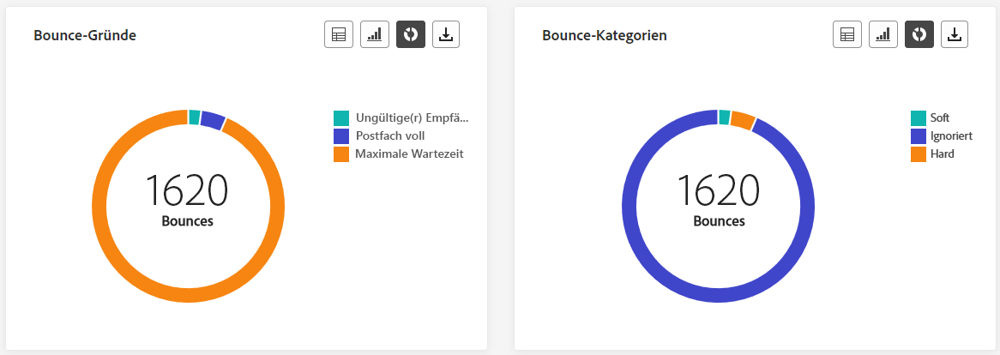

Die **[!UICONTROL Bounce-Kategorien]** und **[!UICONTROL Bounce-Gründe]** Widgets enthalten die mit Bounce Messages verknüpften Daten und bieten einen umfassenden Überblick über die verschiedenen Kategorien und spezifischen Gründe für Bounces.

Weitere Informationen zu Bounces finden Sie auf der Seite [ Unterdrückungslisten](../reports/suppression-list.md).

+++ Weitere Informationen zu Metriken zu Bounce-Kategorien

* **[!UICONTROL Hardbounce]**: die Gesamtzahl der permanenten Fehler, wie eine falsche E-Mail-Adresse. Dazu gehören Fehlermeldungen, die explizit eine ungültige Adresse anzeigen, wie etwa „Benutzer unbekannt“.

* **[!UICONTROL Softbounce]**: die Gesamtzahl der temporären Fehler, wie ein voller Posteingang.

* **[!UICONTROL Ignoriert]**: Die Gesamtzahl der temporären Ereignisse, beispielsweise Abwesenheit, oder technischer Fehler, zum Beispiel wenn der Absendertyp Postmaster ist.

+++

### Fehlerursachen {#error-reasons}

>[!CONTEXTUALHELP]
>id="ajo_channel_email_error_reasons"
>title="Fehlerursachen"
>abstract="Anhand der Graphen und der Tabelle „Fehlerursachen“ können Sie die spezifischen Fehler identifizieren, die während des Versandvorgangs aufgetreten sind."

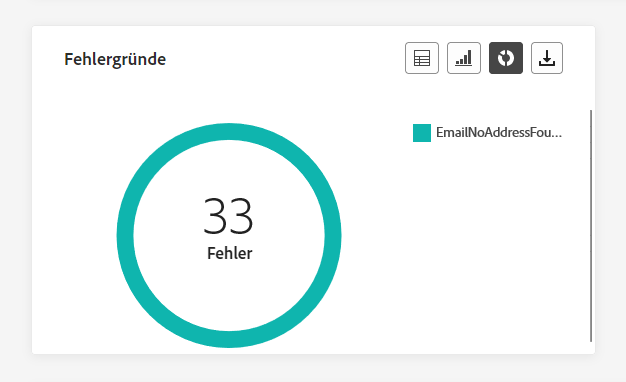

Die **[!UICONTROL Fehlerursachen]** Anhand von Diagrammen und Tabellen können Sie die genauen Fehler identifizieren, die während des Versandvorgangs aufgetreten sind. So erhalten Sie ein klares Verständnis aller aufgetretenen Probleme.

### Ausgeschlossene Gründe {#excluded-reasons}

>[!CONTEXTUALHELP]
>id="ajo_channel_email_excluded_reasons"
>title="Ausgeschlossene Gründe"
>abstract="Die Graphen und die Tabelle „Ausgeschlossene Gründe“ veranschaulichen die verschiedenen Faktoren, die dazu führten, dass Benutzerprofile aus der Zielgruppe ausgeschlossen wurden und die Nachricht nicht erhielten."

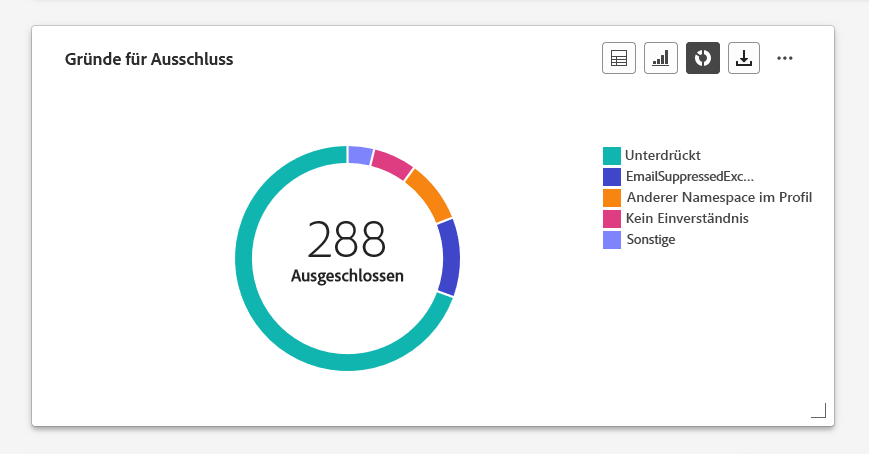

Die **[!UICONTROL Ausgeschlossene Gründe]** Grafiken und Tabellen bieten eine umfassende Übersicht über die verschiedenen Faktoren, die dazu geführt haben, dass Benutzerprofile aus der Zielgruppe ausgeschlossen wurden, sodass die Nachricht nicht empfangen wurde.

Siehe Abschnitt [diese Seite](exclusion-list.md) für die umfassende Liste der Ausschlussgründe.

### Von Domains gesendet und bereitgestellt {#sent-delivered-domains}

>[!CONTEXTUALHELP]
>id="ajo_channel_email_sending_delivered_domains"
>title="Von Domains gesendet und bereitgestellt"
>abstract="Der Graph und die Tabelle „Von Domains gesendet und bereitgestellt“ stellen die Verteilung der wichtigsten E-Mail-Versanddaten auf Domain-Ebene dar."

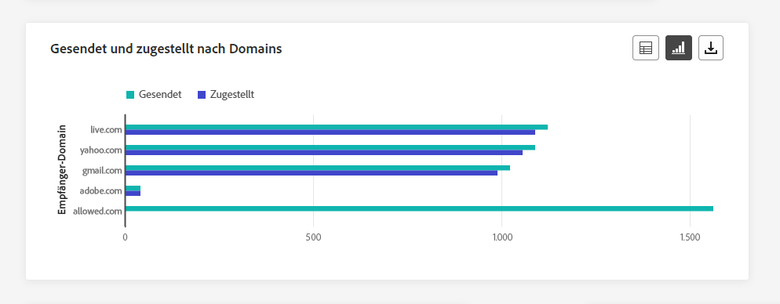

Die  **[!UICONTROL Gesendet und von Domänen bereitgestellt]** Tabellen und Diagramme enthalten eine detaillierte Aufschlüsselung der E-Mail-Sendungen auf Domänenebene und bieten umfassende Einblicke in die Leistung Ihrer E-Mails.

+++ Weitere Informationen zu den Metriken Gesendet und Von Domänen bereitgestellt

* **[!UICONTROL Gesendet]**: Gesamtzahl der Sendevorgänge für Ihre E-Mail.

* **[!UICONTROL Zugestellt]**: Zahl der erfolgreich gesendeten Nachrichten im Vergleich zur Gesamtzahl der gesendeten Nachrichten.

+++

### Bounces und Fehler nach Domains {#bounces-errors-domains}

>[!CONTEXTUALHELP]
>id="ajo_channel_email_bounces_errors_domains"
>title="Bounces und Fehler nach Domains"
>abstract="Der Graph und die Tabelle „Bounces und Fehler nach Domains“ zeigen die Verteilung der während des Versandvorgangs aufgetretenen spezifischen Fehler auf Domain-Ebene."

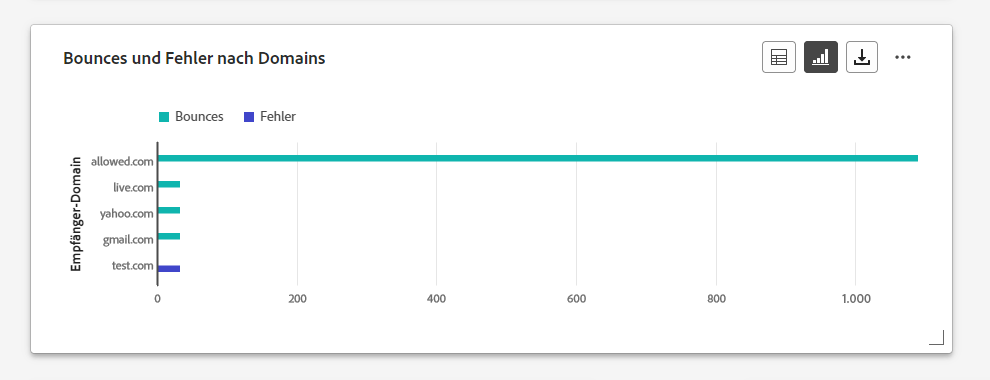

Die  **[!UICONTROL Bounces und Fehler nach Domänen]** Diagramm und Tabelle bieten eine Aufschlüsselung der spezifischen Fehler, die während des Versandvorgangs auf Domänenebene aufgetreten sind, und enthalten eine detaillierte Analyse der aufgetretenen Probleme.

+++ Weitere Informationen zu den Metriken &quot;Absprünge und Fehler nach Domänen&quot;

* **[!UICONTROL Bounces]**: Gesamtzahl der kumulierten Fehler beim Versandvorgang und der automatischen Rücksendungen, bezogen auf die Gesamtzahl der gesendeten Nachrichten.

* **[!UICONTROL Fehler]**: Gesamtzahl der während des Versandvorgangs aufgetretenen Fehler, die den Versand an Profile verhindert haben.

+++

### Aufrufe und Klicks nach Domains {#open-clicks-domains}

>[!CONTEXTUALHELP]
>id="ajo_channel_email_open_clicks_domains"
>title="Aufrufe und Klicks nach Domains"
>abstract="Der Graph und die Tabelle „Aufrufe und Klicks nach Domains“ zeigen eine Aufschlüsselung der Interaktionen Ihrer Besucherinnen und Besucher mit Ihrer E-Mail auf Domain-Ebene."

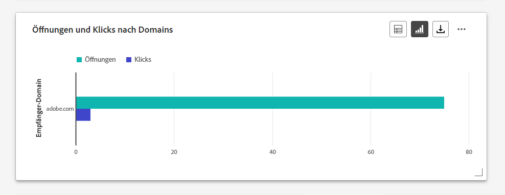

Die  **[!UICONTROL Öffnungen und Klicks nach Domänen]** Diagramm und Tabelle zeigen eine Aufschlüsselung der Interaktion Ihrer Besucher mit Ihrer E-Mail auf Domänenebene, die wertvolle Einblicke in die Interaktion verschiedener Domänen mit Ihrem Inhalt bietet.

+++ Weitere Informationen zu den Metriken &quot;Öffnungen und Klicks nach Domänen&quot;

* **[!UICONTROL Öffnungen]**: Anzahl der Öffnungen der E-Mail.

* **[!UICONTROL Klicks]**: Anzahl der Klicks auf Inhalt einer E-Mail.

+++

### Bounce-Gründe nach Domain {#bounce-reasons-domains}

>[!CONTEXTUALHELP]
>id="ajo_channel_email_bounce_reasons_domains"
>title="Bounce-Gründe nach Domain"
>abstract="Der Graph und die Tabelle „Bounce-Gründe nach Domain“ zeigen eine Aufschlüsselung temporärer sowie permanenter Fehlerdaten auf Domain-Ebene."

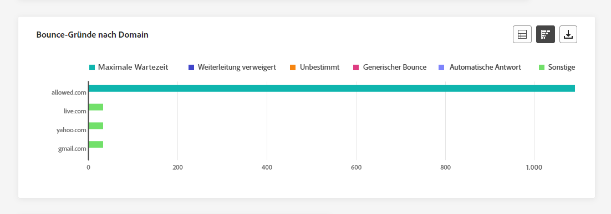

Die  **[!UICONTROL Bounce-Gründe nach Domain]** Diagramme und Tabellen bieten eine Aufschlüsselung der Daten auf Domänenebene bezüglich temporärer und permanenter Fehler und bieten detaillierte Einblicke in die Ursachen für abgespeckte Nachrichten.

Weitere Informationen zu Bounces finden Sie auf der Seite [ Unterdrückungslisten](../reports/suppression-list.md).

## Push-Benachrichtigung {#push}

In Ihren Kanalberichten wird die **Push-Benachrichtigung** enthält die wichtigsten Informationen zu Push-Benachrichtigungen, die in Ihren Kampagnen und Journey gesendet werden. Die Metrik wird nachfolgend beschrieben.

### Gesamtstatistik Push-Benachrichtigungen – Versand {#push-total-sending}

>[!CONTEXTUALHELP]
>id="ajo_channel_push_sending_statistics"
>title="Gesamtstatistik Push-Benachrichtigungen – Versand"
>abstract="Die KPIs „Gesamtstatistik Push-Benachrichtigungen – Versand“ fassen wichtige Daten zu Ihren Push-Benachrichtigungen zusammen, z. B.  „Angesprochen“ oder „Zugestellt“."

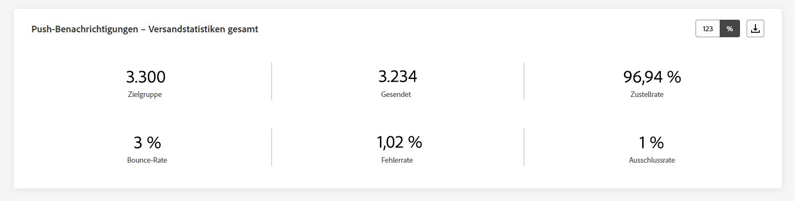

Die **[!UICONTROL Push-Benachrichtigungen - Versandstatistiken insgesamt]** KPIs dienen als umfassende Zusammenfassung und enthalten wichtige Daten zu Ihren Push-Benachrichtigungen. Diese Metriken enthalten detaillierte Einblicke in die Zielgruppe und den tatsächlichen Versandstatus und bieten einen gut umschlossenen Überblick über die Effektivität und Reichweite Ihrer Push-Benachrichtigungen.

+++ Weitere Informationen zu Push-Benachrichtigungen - Metriken zur Versandstatistik insgesamt

* **[!UICONTROL Angesprochen]**: Gesamtzahl der verarbeiteten Push-Benachrichtigungen.

* **[!UICONTROL Gesendet]**: Gesamtzahl der gesendeten Push-Benachrichtigungen

* **[!UICONTROL Zugestellt]**: Anzahl der erfolgreich gesendeten Push-Benachrichtigungen in Bezug auf die Gesamtzahl der gesendeten Push-Benachrichtigungen

* **[!UICONTROL Versandrate]**: Prozentsatz der erfolgreich gesendeten Push-Benachrichtigungen.

* **[!UICONTROL Bounces]**: Gesamtzahl der Fehler und automatischen Rücksendungen, bezogen auf die Gesamtzahl der gesendeten Nachrichten.

* **[!UICONTROL Bounce-Rate]**: Prozentsatz der Push-Benachrichtigungen, die unzustellbar waren, im Vergleich zu den gesendeten Push-Benachrichtigungen.

* **[!UICONTROL Fehler]**: Gesamtzahl der aufgetretenen Fehler, die die Zustellung an Profile verhindert haben.

* **[!UICONTROL Fehlerrate]**: Prozentualer Anteil der aufgetretenen Fehler, die den Versand verhindert haben, im Vergleich zu den gesendeten Push-Benachrichtigungen.

* **[!UICONTROL Ausgeschlossen]**: Anzahl der Profile, die durch Adobe Journey Optimizer ausgeschlossen wurden.

* **[!UICONTROL Ausschlussrate]**: Prozentsatz der Profile, die durch Adobe Journey Optimizer ausgeschlossen wurden.

+++

### Gesamtstatistik Push-Benachrichtigung – Tracking {#push-total-tracking}

>[!CONTEXTUALHELP]
>id="ajo_channel_push_tracking_statistics"
>title="Gesamtstatistik Push-Benachrichtigung – Tracking"
>abstract="Die Gesamtstatistik „Push-Benachrichtigung – Tracking“ liefert Daten zur Profilaktivität für Ihre Push-Benachrichtigungen."

Die **[!UICONTROL Push-Benachrichtigung - Tracking-Statistiken insgesamt]** Widget bietet eine detaillierte Momentaufnahme der Profilaktivität, die mit Ihren Push-Benachrichtigungen verknüpft ist, und bietet wichtige Einblicke in die Interaktion und die Effektivität von Push-Benachrichtigungen.

+++ Erfahren Sie mehr über Push-Benachrichtigungen - Metriken zur Gesamtverfolgungsstatistik

* **[!UICONTROL Öffnungen]**: Gibt an, wie oft eine Push-Benachrichtigung geöffnet wurde.

* **[!UICONTROL Öffnungsrate]**: Prozentsatz der geöffneten Push-Benachrichtigungen.

* **[!UICONTROL Aktionen]**: Gesamtzahl der Aktionen, die bei der gesendeten Push-Benachrichtigung durchgeführt wurden, d. h. Klick auf Schaltfläche oder Abbruch.

* **[!UICONTROL Aktionsrate]**: Prozentsatz der Aktionen, die bei zugestellten Push-Benachrichtigungen durchgeführt wurden, im Vergleich zu gesendeten Push-Benachrichtigungen.

+++

### Push-Benachrichtigungen – Versandstatistik im Zeitverlauf {#push-sending-overtime}

>[!CONTEXTUALHELP]
>id="ajo_channel_push_sending_statistics_overtime"
>title="Push-Benachrichtigungen – Versandstatistik im Zeitverlauf"
>abstract="Das Diagramm „Push-Benachrichtigung – Versandstatistik im Zeitverlauf“ enthält Daten zu gesendeten Push-Benachrichtigungen, aufgeschlüsselt nach Stunden, Tagen, Wochen oder Monaten."

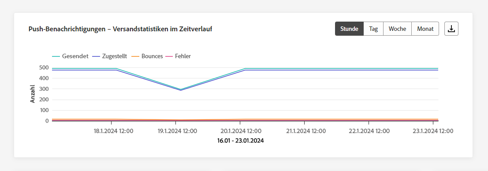

Die **[!UICONTROL Push-Benachrichtigungen - Versandstatistiken im Zeitverlauf]** -Diagramm bietet eine dynamische Darstellung mit einer Analyse Ihrer Push-Benachrichtigungs-Aktivität. Diese grafische Darstellung bietet eine umfassende Aufschlüsselung gesendeter Push-Benachrichtigungen, mit der Sie Trends und Muster auf stündlicher, täglicher, wöchentlicher oder monatlicher Ebene beobachten können.

+++ Weitere Informationen zu Push-Benachrichtigungen - Versandstatistiken über Zeitmetriken

* **[!UICONTROL Gesendet]**: Gesamtzahl der gesendeten Push-Benachrichtigungen

* **[!UICONTROL Zugestellt]**: Anzahl der erfolgreich gesendeten Push-Benachrichtigungen in Bezug auf die Gesamtzahl der gesendeten Push-Benachrichtigungen

* **[!UICONTROL Bounces]**: Gesamtzahl der Fehler und automatischen Rücksendungen, bezogen auf die Gesamtzahl der gesendeten Nachrichten.

* **[!UICONTROL Fehler]**: Gesamtzahl der aufgetretenen Fehler, die die Zustellung an Profile verhindert haben.

+++

### Push-Benachrichtigungen – Tracking-Statistik im Zeitverlauf {#push-tracking-overtime}

>[!CONTEXTUALHELP]
>id="ajo_channel_push_tracking_statistics_overtime"
>title="Push-Benachrichtigungen – Tracking-Statistik im Zeitverlauf"
>abstract="Das Diagramm „Push-Benachrichtigungen – Tracking-Statistik im Zeitverlauf“ liefert Daten zur Profilaktivität Ihrer Push-Benachrichtigungen, aufgeschlüsselt nach Stunden, Tagen, Wochen oder Monaten."

Die **[!UICONTROL Push-Benachrichtigungen - Trackingstatistiken im Zeitverlauf]** Das Diagramm bietet einen detaillierten Überblick über die Profilaktivität in Bezug auf Ihre Push-Benachrichtigungen. Diese grafische Darstellung unterteilt die Daten auf stündlicher, täglicher, wöchentlicher oder monatlicher Basis und bietet wertvolle Einblicke in die Entwicklung der Interaktion der Empfänger im Laufe verschiedener Zeitintervalle.

+++ Weitere Informationen zu Push-Benachrichtigungen - Trackingstatistiken im Zeitverlauf

* **[!UICONTROL Öffnungen]**: Gibt an, wie oft Ihre Push-Benachrichtigung geöffnet wurde.

* **[!UICONTROL Aktionen]**: Gesamtzahl der Aktionen, die bei der gesendeten Push-Benachrichtigung durchgeführt wurden, d. h. Klick auf Schaltfläche oder Abbruch.

+++

### Push-Benachrichtigungen - Ausgeschlossene Gründe {#push-excluded-reasons}

>[!CONTEXTUALHELP]
>id="ajo_channel_push_excluded_reasons"
>title="Ausgeschlossene Gründe"
>abstract="Die Graphen und die Tabelle „Ausgeschlossene Gründe“ veranschaulichen die verschiedenen Faktoren, die dazu führten, dass Benutzerprofile aus der Zielgruppe ausgeschlossen wurden und die Nachricht nicht erhielten."

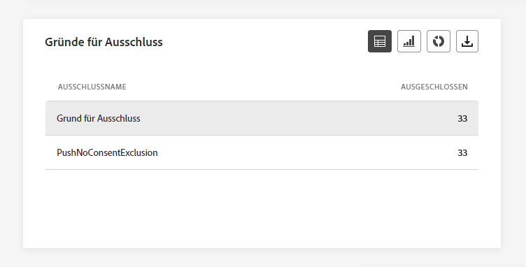

Die **[!UICONTROL Ausgeschlossene Gründe]** In Diagrammen und Tabellen werden die verschiedenen Gründe angezeigt, die verhinderten, dass aus den Zielgruppenprofilen ausgeschlossene Benutzerprofile Ihre Push-Benachrichtigungen erhalten.

Siehe Abschnitt [diese Seite](exclusion-list.md) für die umfassende Liste der Ausschlussgründe.

### Push-Benachrichtigungen - Fehlerursachen {#push-error-reasons}

>[!CONTEXTUALHELP]
>id="ajo_channel_push_error_reasons"
>title="Fehlerursachen"
>abstract="Anhand der Graphen und der Tabelle „Fehlerursachen“ können Sie die spezifischen Fehler identifizieren, die während des Versandvorgangs aufgetreten sind."

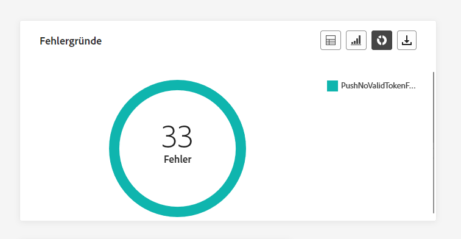

Die **[!UICONTROL Fehlerursachen]** Grafiken und Tabellen bieten Ihnen die Möglichkeit, spezifische Fehler zu identifizieren, die während des Versandvorgangs Ihrer Push-Benachrichtigungen aufgetreten sind. So erhalten Sie detaillierte Einblicke in auf diesem Weg aufgetretene Probleme.

### Push-Benachrichtigungen - Tracking nach Plattform {#push-tracking-platform}

>[!CONTEXTUALHELP]
>id="ajo_channel_push_tracking_statistics_platform"
>title="Tracking-Statistik nach Plattform"
>abstract="Der Graph und die Tabelle „Tracking-Statistik nach Plattform“ enthalten je nach Betriebssystem Ihres Profils Daten zur Profilaktivität Ihrer Push-Benachrichtigungen."

Die **[!UICONTROL Push-Benachrichtigungen - Tracking nach Plattform]** Grafiken und Tabellen zeigen die Empfängeraktivität für Ihre Push-Benachrichtigung in Abhängigkeit vom Betriebssystem Ihres Profils an.

### Push-Benachrichtigungen - Versand nach Plattform {#push-sending-platform}

>[!CONTEXTUALHELP]
>id="ajo_channel_push_sending_statistics_platform"
>title="Tracking-Statistik nach Plattform"
>abstract="Der Graph und die Tabelle „Tracking-Statistik nach Plattform“ enthalten Daten zu gesendeten Push-Benachrichtigungen."

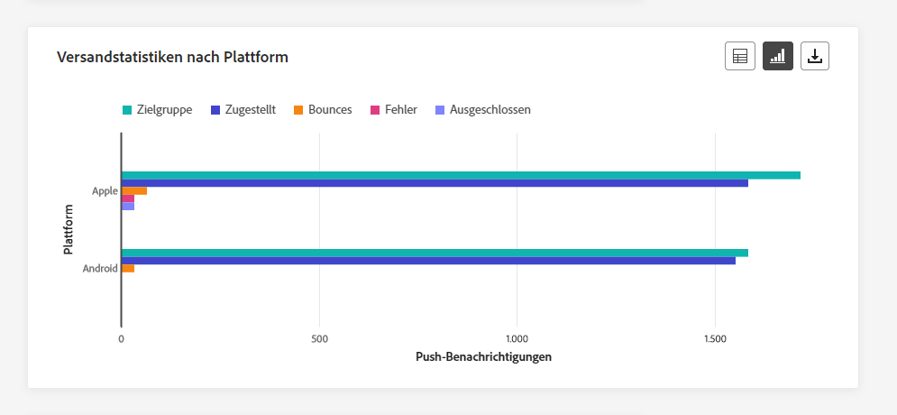

Die **[!UICONTROL Push-Benachrichtigungen - Versand nach Plattform]** Diagramme und Tabellen enthalten eine umfassende Aufschlüsselung, in der der Erfolg Ihrer Push-Benachrichtigungen in Bezug auf die Betriebssysteme Ihrer Profile detailliert beschrieben wird. Diese gründliche Analyse bietet wertvolle Einblicke in die Effektivität Ihrer Push-Benachrichtigungen über verschiedene Plattformen hinweg.

## SMS {#sms}

Von Ihrem **Kanal** Berichte enthält das Menü SMS die wichtigsten Informationen zu SMS-Nachrichten, die in Ihren Kampagnen und Journey gesendet werden. Die Metriken werden nachfolgend beschrieben.

### Gesamtstatistik SMS – Versand {#sms-sending-statistics}

>[!CONTEXTUALHELP]
>id="ajo_channel_sms_sending_statistics"
>title="Gesamtstatistik SMS – Versand"
>abstract="Die KPIs „Gesamtstatistik SMS – Versand“ enthalten wichtige Daten zu Ihren SMS-Nachrichten, wie „Angesprochen“ oder „Zugestellt“."

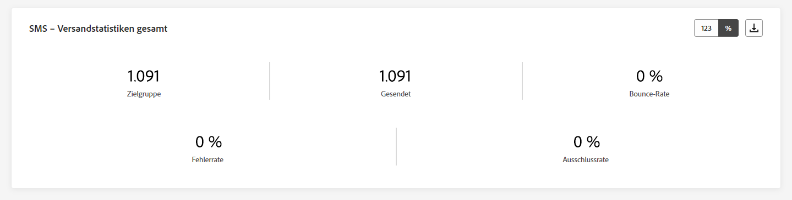

Die **[!UICONTROL SMS - Versandstatistiken insgesamt]** KPIs dienen als umfassende Zusammenfassung und enthalten wichtige Daten zu Ihrer SMS. Diese Metriken enthalten detaillierte Einblicke in die Zielgruppe und den tatsächlichen Versandstatus und bieten einen gut umschlossenen Überblick über die Effektivität und Reichweite Ihrer SMS-Nachrichten.

+++ Weitere Informationen zu Push-Benachrichtigungen - Metriken zur Versandstatistik insgesamt

* **[!UICONTROL Angesprochen]**: Anzahl der Benutzerprofile, die sich als Zielgruppenprofile für den SMS-Kanal eignen.

* **[!UICONTROL Gesendet]**: Gesamtzahl der gesendeten SMS-Nachrichten.

* **[!UICONTROL Zugestellt]**: Anzahl der erfolgreich gesendeten SMS-Nachrichten in Bezug auf die Gesamtzahl der gesendeten SMS-Nachrichten.

* **[!UICONTROL Versandrate]**: Prozentsatz der erfolgreich gesendeten SMS-Nachrichten.

* **[!UICONTROL Bounces]**: Gesamtzahl der Fehler und automatischen Rücksendeverarbeitungen im Verhältnis zur Gesamtzahl der gesendeten SMS-Nachrichten.

* **[!UICONTROL Bounce-Rate]**: Prozentsatz der SMS-Nachrichten, die nicht erfolgreich zugestellt wurden, im Vergleich zur Anzahl der gesendeten SMS-Nachrichten.

* **[!UICONTROL Fehler]**: Gesamtzahl der aufgetretenen Fehler, die die Zustellung an Profile verhindert haben.

* **[!UICONTROL Fehlerrate]**: Prozentsatz der Fehler, die auftraten und die Zustellung verhinderten, im Vergleich zur Zahl der gesendeten SMS-Nachrichten.

* **[!UICONTROL Ausgeschlossen]**: Anzahl der Benutzerprofile, die von den Zielgruppenprofilen ausgeschlossen waren und die die Nachricht nicht erhalten haben.

* **[!UICONTROL Ausschlussrate]**: Prozentsatz der Profile, die durch Adobe Journey Optimizer ausgeschlossen wurden.

+++

### Gesamtstatistik SMS – Nachverfolgung {#sms-tracking-statistics}

>[!CONTEXTUALHELP]
>id="ajo_channel_sms_tracking_statistics"
>title="Gesamtstatistik SMS – Nachverfolgung"
>abstract="Die Gesamtstatistik „SMS – Nachverfolgung“ liefert Daten zur Profilaktivität Ihrer SMS-Nachrichten."

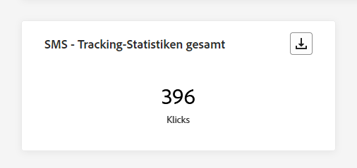

Die **[!UICONTROL SMS - Trackingstatistiken insgesamt]** -Widget bietet einen detaillierten Überblick über wichtige Informationen zur Interaktion Ihrer Besucher mit Ihren URLs und bietet Einblicke in die Effektivität Ihrer SMS-Nachrichten:

* **[!UICONTROL Klicks]**: Anzahl der Klicks auf einen Inhalt in einer SMS-Nachricht.

### SMS – Versandstatistik im Zeitverlauf {#sms-sending-statistics-overtime}

>[!CONTEXTUALHELP]
>id="ajo_channel_sms_sending_statistics_overtime"
>title="SMS – Versandstatistik im Zeitverlauf"
>abstract="Der Graph „SMS – Versandstatistik im Zeitverlauf“ zeigt Daten zu gesendeten SMS-Nachrichten an, aufgeschlüsselt nach Stunden, Tagen, Wochen oder Monaten."

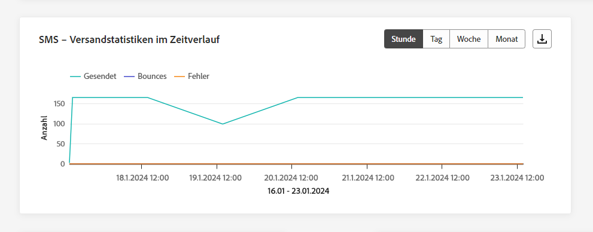

Die **[!UICONTROL SMS - Versandstatistiken im Zeitverlauf]** Das Diagramm bietet eine umfassende Übersicht der gesendeten SMS-Nachrichten und bietet Daten, die auf Stunden-, Tages-, Wochen- oder Monatsebene verteilt sind. Mit dieser grafischen Darstellung können Sie Trends in Ihrer SMS-Nachrichtenaktivität über verschiedene Zeitintervalle hinweg verfolgen und analysieren.

+++ Weitere Informationen zu SMS - Versandstatistiken über Zeitmetriken

* **[!UICONTROL Gesendet]**: Gesamtzahl der gesendeten SMS-Nachrichten.

* **[!UICONTROL Bounces]**: Gesamtzahl der Fehler und automatischen Rücksendeverarbeitungen im Verhältnis zur Gesamtzahl der gesendeten SMS-Nachrichten.

* **[!UICONTROL Fehler]**: Gesamtzahl der aufgetretenen Fehler, die die Zustellung an Profile verhindert haben.

+++

### SMS – Tracking-Statistik im Zeitverlauf {#sms-tracking-statistics-overtime}

>[!CONTEXTUALHELP]
>id="ajo_channel_sms_tracking_statistics_overtime"
>title="SMS – Tracking-Statistik im Zeitverlauf"
>abstract="Der Graph „SMS – Tracking-Statistik im Zeitverlauf“ enthält Daten zur Profilaktivität Ihrer SMS-Nachrichten, aufgeschlüsselt nach Stunden, Tagen, Wochen oder Monaten."

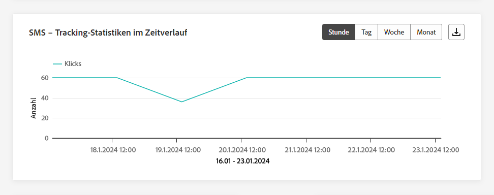

Die **[!UICONTROL SMS - Trackingstatistiken im Zeitverlauf]** Das Diagramm liefert Daten zur Profilaktivität in Bezug auf Ihre SMS-Nachrichten und bietet eine detaillierte Aufschlüsselung auf stündlicher, täglicher, wöchentlicher oder monatlicher Basis. Diese grafische Darstellung ermöglicht es Ihnen, Muster in der Benutzerinteraktion über verschiedene Zeitintervalle hinweg zu analysieren und zu verstehen.

* **[!UICONTROL Klicks]**: Anzahl der Klicks auf einen Inhalt in einer SMS-Nachricht.

### Ausgeschlossene Gründe {#sms-excluded-reasons}

>[!CONTEXTUALHELP]
>id="ajo_channel_sms_excluded_reasons"
>title="Ausgeschlossene Gründe"
>abstract="Die Graphen und die Tabelle „Ausgeschlossene Gründe“ veranschaulichen die verschiedenen Faktoren, die dazu führten, dass Benutzerprofile aus der Zielgruppe ausgeschlossen wurden und die Nachricht nicht erhielten."

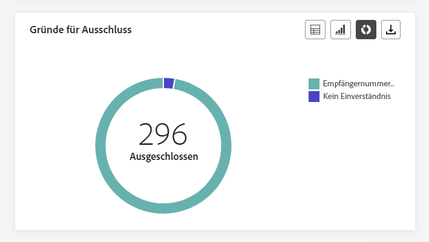

Die **[!UICONTROL Ausschlussgründe]** Grafiken und Tabellen zeigen visuell die verschiedenen Faktoren an, die zum Ausschluss von Benutzerprofilen aus der Zielgruppe geführt haben, sodass diese keine SMS-Nachrichten erhalten können.

Siehe Abschnitt [diese Seite](exclusion-list.md) für die umfassende Liste der Ausschlussgründe.

### Bounce-Gründe {#sms-bounce-reasons}

>[!CONTEXTUALHELP]
>id="ajo_channel_sms_bounce_reasons"
>title="Bounce-Gründe"
>abstract="Die Graphen und die Tabelle „Bounce-Gründe“ enthalten die verfügbaren Daten zu Bounce-Nachrichten."

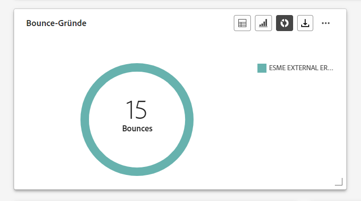

Die **[!UICONTROL Bounces-Gründe]** Grafiken und Tabellen bieten einen umfassenden Überblick über Daten zu Bounce-SMS-Nachrichten und liefern wertvolle Einblicke in die spezifischen Ursachen von SMS-Bounces.

### Fehlerursachen {#sms-error-reasons}

>[!CONTEXTUALHELP]
>id="ajo_channel_sms_error_reasons"
>title="Fehlerursachen"
>abstract="Anhand der Graphen und der Tabelle „Fehlerursachen“ können Sie die spezifischen Fehler identifizieren, die während des Versandvorgangs aufgetreten sind."

Die **[!UICONTROL Fehlerursachen]** Anhand von Diagrammen und Tabellen können Sie die spezifischen Fehler identifizieren, die während des Versandvorgangs Ihrer SMS aufgetreten sind. Dies ermöglicht eine gründliche Analyse aller aufgetretenen Probleme.

## Briefpost {#direct-mail}

Von Ihrem **Kanal** Berichte, die **Briefpost** im Menü werden die wichtigsten Informationen zu den in Ihrer **Kampagnen** und **Journey**. Die Metriken werden nachfolgend beschrieben.

### Briefpost – Gesamtstatistik Versand {#direct-mail-total-sending}

>[!CONTEXTUALHELP]
>id="ajo_channel_direct_sending_statistics"
>title="Briefpost – Gesamtstatistik Versand"
>abstract="Die KPIs „Briefpost – Gesamtstatistik Versand“ enthalten wichtige Daten zu Ihren Nachrichten per Briefpost, wie „Angesprochen“ oder „Zugestellt“."

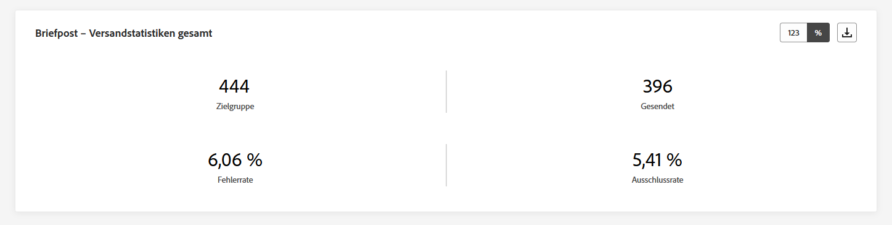

Die **[!UICONTROL Briefpost - Versandstatistiken insgesamt]** Widget bietet einen umfassenden Überblick über die Leistung Ihrer Briefpost-Nachrichten und zeigt wichtige Leistungsindikatoren (KPIs) an, die wichtige Daten zu Ihren Briefpost-Nachrichten zusammenfassen.

+++ Weitere Informationen zu den Metriken für die Versandstatistiken in Briefpost

* **[!UICONTROL Angesprochen]**: Anzahl der Benutzerprofile, die sich als Zielgruppenprofile für die Briefpost-Nachrichten eignen.

* **[!UICONTROL Gesendet]**: Gesamtzahl der gesendeten Nachrichten.

* **[!UICONTROL Fehler]**: Gesamtzahl der aufgetretenen Fehler, die den Versand an Profile verhindert haben.

* **[!UICONTROL Fehlerrate]**: Prozentualer Anteil der aufgetretenen Fehler, die den Versand verhindert haben, im Vergleich zu den gesendeten Push-Benachrichtigungen.

* **[!UICONTROL Ausgeschlossen]**: Anzahl der Benutzerprofile, die von den Zielgruppenprofilen ausgeschlossen waren und die die Nachricht nicht erhalten haben.

* **[!UICONTROL Ausschlussrate]**: Prozentsatz der Profile, die durch Adobe Journey Optimizer ausgeschlossen wurden.

+++

### Ausgeschlossene Gründe {#direct-mail-excluded-reasons}

>[!CONTEXTUALHELP]
>id="ajo_channel_direct_excluded_reasons"
>title="Ausgeschlossene Gründe"
>abstract="Die Graphen und die Tabelle „Ausgeschlossene Gründe“ veranschaulichen die verschiedenen Faktoren, die dazu führten, dass Benutzerprofile aus der Zielgruppe ausgeschlossen wurden und die Nachricht nicht erhielten."

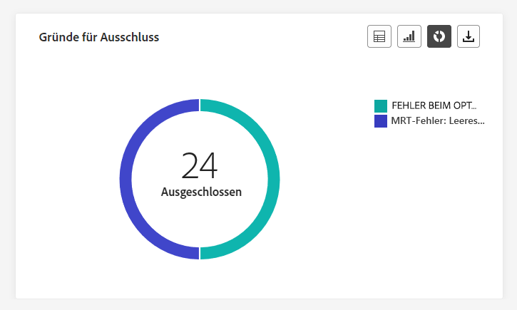

Die **[!UICONTROL Briefpost - Ausgeschlossene Gründe]** Grafiken und Tabellen veranschaulichen visuell die verschiedenen Faktoren, die zum Ausschluss von Benutzerprofilen aus der Zielgruppe führten, sodass diese keine Briefpost-Nachrichten erhalten konnten.

Siehe Abschnitt [diese Seite](exclusion-list.md) für die umfassende Liste der Ausschlussgründe.

### Fehlerursachen {#direct-mail-error-reasons}

>[!CONTEXTUALHELP]
>id="ajo_channel_direct_error_reasons"
>title="Fehlerursachen"
>abstract="Anhand der Graphen und der Tabelle „Fehlerursachen“ können Sie die spezifischen Fehler identifizieren, die während des Versandvorgangs aufgetreten sind."

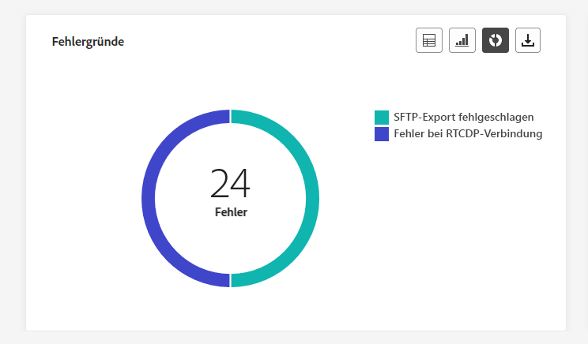

Die **[!UICONTROL Briefpost - Fehlerursachen]** stellen die Mittel bereit, um spezifische Fehler zu identifizieren, die während des Versandvorgangs Ihrer Briefpost-Nachrichten aufgetreten sind, sodass Sie etwaige aufgetretene Probleme detailliert analysieren können.

## In-App {#in-app}

In den Kanalberichten werden im Menü „In-App“ die wichtigsten Informationen zu In-App-Nachrichten aufgeführt, die in den Kampagnen und Journeys gesendet werden. Die Metriken werden nachfolgend beschrieben.

### In-App-Gesamtinteraktion {#inapp-total-engagement}

>[!CONTEXTUALHELP]
>id="ajo_channel_inapp_engagement"
>title="In-App – Interaktionen insgesamt"
>abstract="Die KPIs „In-App – Interaktionen Insgesamt“ liefern umfassende Informationen über die Interaktion Ihrer Besucherinnen und Besucher mit Ihren In-App-Nachrichten, einschließlich Metriken wie „Impressions“ und „Interaktionen“."

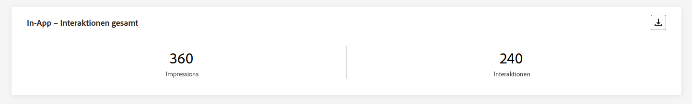

Die **[!UICONTROL In-App-Gesamtinteraktion]** KPIs bieten umfassende Einblicke in die Interaktion Ihrer Besucher mit Ihren In-App-Nachrichten, die wichtige Metriken wie **Impressionen** und **Interaktionen**.

+++ Weitere Informationen zu Interaktionsmetriken in der App insgesamt

* **[!UICONTROL Impressions]**: Gesamtzahl der an alle Benutzenden gesendeten In-App-Nachrichten.

* **[!UICONTROL Interaktionen]**: Gesamtzahl der Interaktionen mit der In-App-Nachricht. Dazu gehören alle von den Benutzenden durchgeführten Aktionen, wie z. B. Klicks, Abbrechen oder andere Interaktionen.

+++

### In-App-Interaktion im Zeitverlauf {#inapp-engagement-overtime}

>[!CONTEXTUALHELP]
>id="ajo_channel_inapp_engagement_overtime"
>title="In-App – Interaktionen im Zeitverlauf"
>abstract="Der Graph „In-App – Interaktionen im Zeitverlauf“ verfolgt In-App-Impressions und Interaktionen, aufgeschlüsselt nach Stunden, Tagen, Wochen und Monaten."

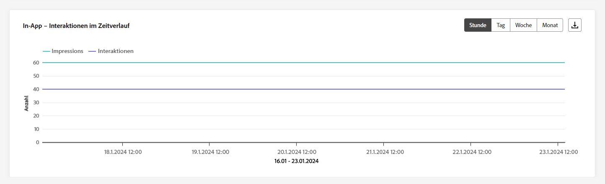

Die Grafik **[!UICONTROL In-App-Interaktionen im Zeitverlauf]** zeigt die Entwicklung der In-App-Impressions und -Interaktionen für den jeweiligen Zeitraum an, indem Impressions, Abbrechen oder Interaktionen verfolgt werden.

+++ Erfahren Sie mehr über In-App-Interaktionsmetriken im Zeitverlauf

* **[!UICONTROL Impressions]**: Gesamtzahl der an alle Benutzenden gesendeten In-App-Nachrichten.

* **[!UICONTROL Interaktionen]**: Gesamtzahl der Interaktionen mit der In-App-Nachricht. Dazu gehören alle von den Benutzenden durchgeführten Aktionen, wie z. B. Klicks, Abbrechen oder andere Interaktionen.

+++

## Web {#web}

Von Ihrem **Kanal** Berichte enthält das Webmenü die wichtigsten Informationen zu den in Ihren **Kampagnen** und **Journey**. Die Metriken werden nachfolgend beschrieben.

### Web – Interaktionen insgesamt {#web-engagement-total}

>[!CONTEXTUALHELP]
>id="ajo_channel_web_engagement"
>title="Web – Interaktionen insgesamt"
>abstract="Die KPIs „Web – Interaktionen insgesamt“ liefern umfassende Informationen über die Interaktion Ihrer Besucherinnen und Besucher mit Ihren Web-Seiten, einschließlich Metriken wie „Impressions“ und „Interaktionen“."

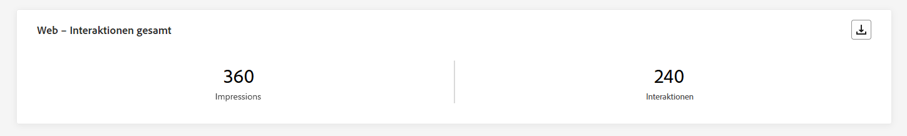

Die **[!UICONTROL Interaktion insgesamt im Web]** KPIs bieten umfassende Einblicke in die Interaktion Ihrer Besucher mit Ihren Webseiten, einschließlich Schlüsselmetriken wie Impressionen und Interaktionen.

+++ Weitere Informationen zu den Interaktionsmetriken im Internet

* **[!UICONTROL Impressions]**: Gesamtanzahl der für alle Benutzenden bereitgestellten Web-Erlebnisse.

* **[!UICONTROL Interaktionen]**: Gesamtzahl der Interaktionen mit Ihrer Web-Seite. Dazu gehören alle von den Benutzenden durchgeführten Aktionen, wie z. B. Klicks oder andere Interaktionen.

+++

### Web – Gesamtinteraktionen im Zeitverlauf {#web-engagement-total-overtime}

>[!CONTEXTUALHELP]
>id="ajo_channel_web_engagement_overtime"
>title="Web – Gesamtinteraktionen im Zeitverlauf"
>abstract="Der Graph „Web – Interaktionen im Zeitverlauf“ verfolgt die Impressions und Interaktionen Ihrer Web-Seiten, aufgeschlüsselt nach Stunden, Tagen, Wochen und Monaten."

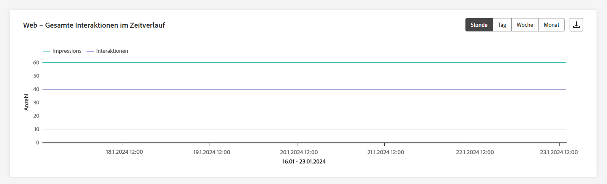

Die **[!UICONTROL Webinteraktion im Zeitverlauf]** das Diagramm überwacht **Impressionen** und **Interaktionen** Ihrer Webseiten mit detaillierten Aufschlüsselungen auf stündlicher, täglicher, wöchentlicher und monatlicher Basis.

+++ Weitere Informationen zu Metriken zur Webinteraktion im Zeitverlauf

* **[!UICONTROL Impressions]**: Gesamtanzahl der für alle Benutzenden bereitgestellten Web-Erlebnisse.

* **[!UICONTROL Interaktionen]**: Gesamtzahl der Interaktionen mit Ihrer Web-Seite. Dazu gehören alle von den Benutzenden durchgeführten Aktionen, wie z. B. Klicks oder andere Interaktionen.

+++

## Kanalbericht (Video) {#channel-report-video}

In diesem Video gibt es weitere Informationen dazu, wie auf Kanalebene auf Berichte zugegriffen, darin navigiert und diese exportiert werden können.

>[!VIDEO](https://video.tv.adobe.com/v/3424537?quality=12)
