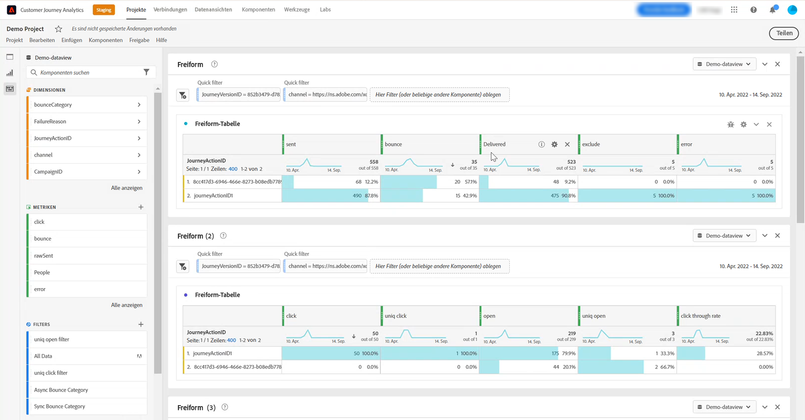

# Arbeiten mit [!DNL Customer Journey Analytics] {#cja-ajo}

[!DNL Journey Optimizer] Die Integration mit [!DNL Customer Journey Analytics] bietet eine ganzheitliche Sicht von all Ihren Journeys mit automatisierter Berichtverteilung und benutzerdefinierten Visualisierungen der Daten.

Nachdem Sie Ihre Journey in [!DNL Journey Optimizer] erstellt haben, können Sie Ihre Kundendaten nach [!DNL Customer Journey Analytics] importieren, um Berichte zu starten und die Auswirkungen jeder Interaktion eines Kunden oder einer Kundin mit Ihren Journeys zu verstehen.

➡️ [Customer Journey Analytics entdecken](https://experienceleague.adobe.com/docs/analytics-platform/using/cja-landing.html?lang=de){target="_blank"}

>[!NOTE]
>
>Zusätzlich zu dieser Integration können Sie auch den Inhalt von Adobe Journey Optimizer-Datensätzen an Cloud-Speicherorte exportieren und diese Informationen zu Berichts- oder Analysezwecken verwenden. [Erfahren Sie, wie Datensätze an Cloud-Speicherorte exportiert werden](../data/export-datasets.md)
>
>Beachten Sie, dass die Funktion zum Exportieren von Datensätzen sich derzeit in der Beta-Phase befindet und für alle Benutzenden von Adobe Journey Optimizer verfügbar ist. Bitte wenden Sie sich an den Adobe-Support, um Zugang zu Zielen zu erhalten, falls Sie noch keinen Zugang haben.

Bevor Sie [!DNL Customer Journey Analytics] für Ihre Journeys verwenden können, müssen Sie zunächst die folgende Integration konfigurieren:

1. [Erstellen Sie eine Verbindung](https://experienceleague.adobe.com/docs/analytics-platform/using/cja-connections/create-connection.html?lang=de) in [!DNL Customer Journey Analytics] mit dem **[!UICONTROL Datensatz]**, den Sie an Adobe Experience Platform senden möchten.

   Die folgenden [!DNL Journey Optimizer] können konfiguriert werden:
   * [Journey-Schritt-Ereignis](../data/datasets-query-examples.md#journey-step-event): Ermöglicht Ihnen zu sehen, wer in Ihre Journeys eintritt und wie weit sie kommen.
   * [Nachrichten-Feedback/Tracking von Datensätzen](../data/datasets-query-examples.md#message-feedback-event-dataset): Ermöglicht Ihnen, Versandinformationen bezüglich Ihrer Nachrichten, die über [!DNL Journey Optimizer] gesendet worden sind, anzuzeigen.
   * [Entitäts- und Journey-Datensätze](../data/datasets-query-examples.md#entity-dataset): Ermöglicht Ihnen, Anzeigenamen zu suchen und diese in Ihrem Reporting zu verwenden.

1. [Erstellen Sie eine Datenansicht](https://experienceleague.adobe.com/docs/analytics-platform/using/cja-dataviews/create-dataview.html?lang=de) für die Konfiguration von Abmessungen und Metriken, die Sie für Ihren Bericht verwenden möchten.

   Sie können Journey Optimizer-spezifische Metriken erstellen, um die Daten Ihrer Journeys besser wiederzugeben. [Weitere Informationen](https://experienceleague.adobe.com/docs/analytics-platform/using/integrations/ajo.html?lang=de#configure-the-data-view-to-accommodate-journey-optimizer-dimensions-and-metrics)

Wenn Sie [!DNL Journey Optimizer] zusammen mit [!DNL Customer Journey Analytics] verwenden, kann das zu Abweichungen in den Reporting-Daten führen, die durch Folgendes verursacht werden:

* **Sowohl [!DNL Journey Optimizer] als auch [!DNL Customer Journey Analytics] synchronisieren Daten aus Azure Data Lake Storage (ADLS) für das Reporting.**

  Die Verarbeitungszeit für eingehende Daten kann von Produkt zu Produkt leicht unterschiedlich sein. Aus diesem Grund kann es vorkommen, dass die Daten nicht übereinstimmen, wenn Berichte von einem bestimmten Datum bis zum aktuellen Tag angezeigt werden. Um Abweichungen zu vermeiden, verwenden Sie Datumsbereiche, die den aktuellen Tag ausschließen.

* **In [!DNL Journey Optimizer]-Berichten schließt die Metrik „Gesendet“ auch die Metrik „Erneut versuchen“ ein.**

  **[!UICONTROL Erneute Zustellversuche]** werden in die Metrik **[!UICONTROL Gesendet]** in [!DNL Customer Journey Analytics] nicht aufgenommen. Dies führt dazu, dass die Metriken **[!UICONTROL Gesendet]** von [!DNL Customer Journey Analytics] niedrigere Werte anzeigen als in [!DNL Journey Optimizer]. Jedoch werden Daten zu erneuten Zustellversuchen in die Metrik **[!UICONTROL Nachrichten erfolgreich gesendet]** oder die **[!UICONTROL Bounces]**-Metrik einbezogen.
Um Abweichungen zu vermeiden, verwenden Sie Datumsbereiche, die vor einer Woche oder sogar noch früher liegen.

* **Berichte werden aus einer unterschiedlichen Datenquelle bereitgestellt.**

  Dies kann zu Datenabweichungen von 1-2 % zwischen den Produkten führen.
