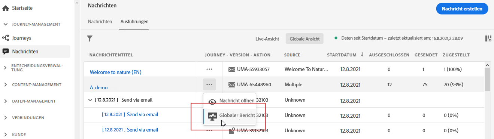
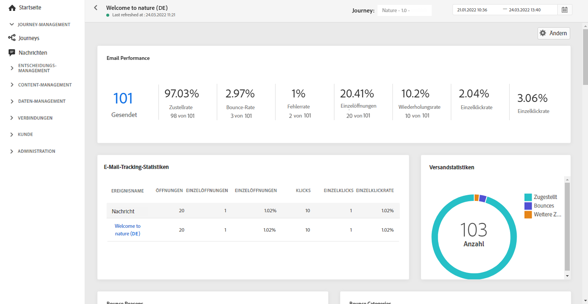
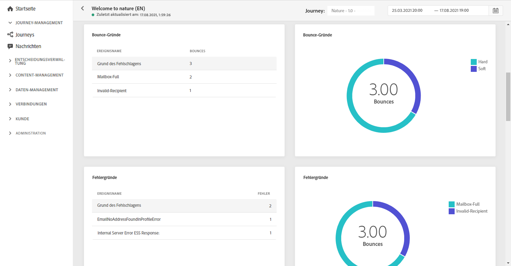
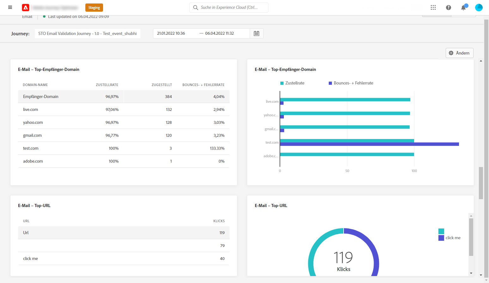
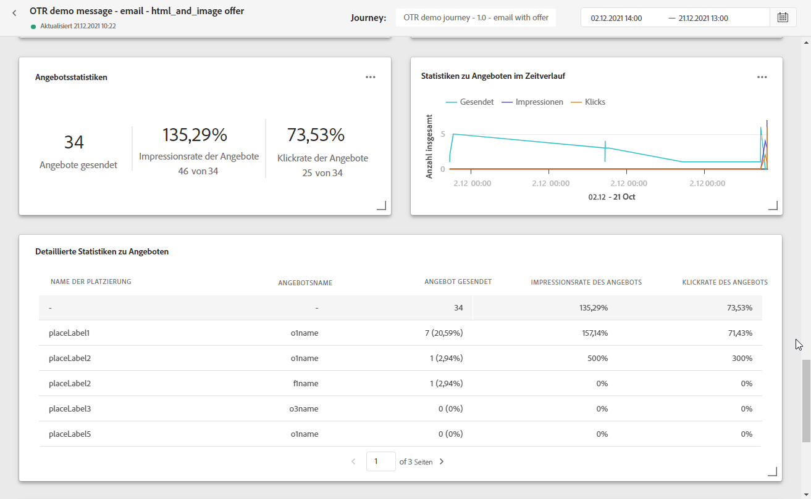

# Globaler Bericht zum E-Mail-Versand {#email-global-report}

Der **[!UICONTROL Globale E-Mail-Bericht]** berücksichtigt immer nur eine Form des E-Mail-Versands.

Wählen Sie auf der Registerkarte **[!UICONTROL Ausführungen]** des Menüs **[!UICONTROL Nachrichten]** die Option **[!UICONTROL Globale Ansicht]** und wählen Sie dann im erweiterten Menü des ausgewählten Versands **[!UICONTROL Globaler Bericht]**.

Der **[!UICONTROL Globale E-Mail-Bericht]** ist in verschiedene Widgets unterteilt, die Erfolg und Fehler beim Versand detailliert beschreiben. Jedes Widget kann bei Bedarf angepasst und gelöscht werden. Weiterführende Informationen dazu finden Sie in diesem [Abschnitt](global-report.md#modify-dashboard).

**[!UICONTROL E-Mail-Effektivität]** zeigt die wichtigsten Informationen zu Ihrer Nachricht mit KPIs:

* **[!UICONTROL Gesendet]**: Gesamtzahl der gesendeten Nachrichten.

* **[!UICONTROL Zustellbarkeitsrate]**: Prozentsatz der erfolgreich gesendeten Nachrichten.

* **[!UICONTROL Bounce-Rate]**: Prozentsatz der E-Mails, die nicht erfolgreich zugestellt wurden, im Vergleich zur Zahl der gesendeten E-Mails.

* **[!UICONTROL Fehlerrate]**: Prozentsatz der Fehler, die während des Versands auftraten und die Zustellung verhinderten, im Vergleich zur Zahl der gesendeten E-Mails.

* **[!UICONTROL Öffnungsrate]**: Prozentsatz der geöffneten Nachrichten.

* **[!UICONTROL Klickrate]**: Prozentsatz der Klicks für einen Versand.

* **[!UICONTROL Spam-Beschwerderate]**: Prozentsatz der E-Mails, die von Empfängern als Spam gekennzeichnet wurden, im Vergleich zu den zugestellten Nachrichten. Weitere Informationen zu Beschwerden finden Sie im [Handbuch über Best Practices bei der Zustellbarkeit](https://experienceleague.adobe.com/docs/deliverability-learn/deliverability-best-practice-guide/metrics-for-deliverability/complaints.html?lang=de#metrics-for-deliverability){target=&quot;_blank&quot;}.

* **[!UICONTROL Abmelderate]**: Prozentsatz der individuellen Abmeldungen in Bezug auf die Anzahl der versendeten Nachrichten. Dieser Indikator basiert nicht auf der Anzahl der Klicks auf den Abmelde-Link, sondern auf der Anzahl der von den Empfängern initiierten Abmeldungen. Weitere Informationen zu Abmeldungen finden Sie auf dieser [Seite](../messages/consent.md).

Die **[!UICONTROL E-Mail-Tracking-Statistiken]** enthalten die verfügbaren Daten für die Aktivität der Empfänger für Ihren Versand:

* **[!UICONTROL Öffnungen]**: Gibt die Zahl der Öffnungen eines Versands an.

* **[!UICONTROL Eindeutige Öffnungen]**: Prozentsatz der geöffneten zugestellten Nachrichten.

* **[!UICONTROL Öffnungsrate]**: Gesamtzahl der geöffneten Nachrichten im Vergleich zu den versendeten E-Mails.

* **[!UICONTROL Klicks]**: Anzahl der Klicks auf Inhalt einer E-Mail.

* **[!UICONTROL Einzelklicks]**: Die Anzahl der Empfänger, die auf Inhalt in einer E-Mail geklickt haben.

* **[!UICONTROL Klickrate]**: Prozentsatz der Benutzer, die mit der Journey interagiert haben.

Das Diagramm **[!UICONTROL Versandstatistik]** stellt den Erfolg Ihres Versands dar:

* **[!UICONTROL Zugestellt]**: Zahl der erfolgreich gesendeten Nachrichten im Vergleich zur Gesamtzahl der gesendeten Nachrichten.

* **[!UICONTROL Bounces]**: Gesamtzahl der kumulierten Fehler bei Versand und automatischer Bounce-Verarbeitung in Relation zur Gesamtzahl der gesendeten Nachrichten.

* **[!UICONTROL Fehler]**: Gesamtanzahl der Fehler, die während des Versands aufgetreten sind und die Zustellung an Profile verhinderten.

Die Widgets **[!UICONTROL Bounce-Gründe]** und **[!UICONTROL Bounce-Kategorien]** enthalten die verfügbaren Daten zu unzustellbaren Nachrichten wie:

* **[!UICONTROL Hardbounce]**: die Gesamtzahl der permanenten Fehler, wie eine falsche E-Mail-Adresse. Dazu gehören Fehlermeldungen, die explizit eine ungültige Adresse anzeigen, wie etwa „Benutzer unbekannt“.

* **[!UICONTROL Softbounce]**: die Gesamtzahl der temporären Fehler, wie ein voller Posteingang.

* **[!UICONTROL Ignoriert]**: Die Gesamtzahl der temporären Ereignisse, beispielsweise Abwesenheit, oder technischer Fehler, zum Beispiel wenn der Absendertyp Postmaster ist.

Weitere Informationen zu Bounces finden Sie auf der Seite [ Unterdrückungslisten](../reports/suppression-list.md).

In den Diagrammen und Tabellen **[!UICONTROL Fehlerursachen]** und **[!UICONTROL Ausschlussgründe]** sehen Sie, welcher Fehler und welche Ausschlüsse während des Versands aufgetreten sind.

Das Diagramm **[!UICONTROL E-Mail – beste Empfänger-Domain]** und die Tabelle zeigen, welche Domains von Empfängern am häufigsten zum Öffnen der E-Mail verwendet werden.

Das Diagramm **[!UICONTROL E-Mail – Top-URL]** und die Tabelle zeigen, welche URLs Ihres Versands am häufigsten besucht werden.

**[!UICONTROL Öffnen vs. Klicken]** zeigt die Interaktion der Empfänger mit dem Versand:

* **[!UICONTROL Einzelklicks]**: Die Anzahl der Empfänger, die auf Inhalt in einer E-Mail geklickt haben.

* **[!UICONTROL Einzelöffnungen]**: Die Anzahl der Empfänger, die den Versand geöffnet haben

<!--

>[!NOTE]
>
>The Offers widgets and metrics are only available if a decision was inserted in an email. For more information on Decision Management, refer to this [page](../offers/get-started/starting-offer-decisioning.md).

The **[!UICONTROL Offers statistic]** and **[!UICONTROL Offers statistics]** over time widgets measure your offer's success and impact on your targeted audience. It detail the main information relative to your message with KPIs:

* **[!UICONTROL Offer sent]**: Total number of sends for the offer.

* **[!UICONTROL Offer impression]**: Number of times the offer was opened in a delivery.

* **[!UICONTROL Offer clicks]**: Number of times an offer was clicked on in a delivery.

The **[!UICONTROL Offers detailed statistic]** table contains the available data for recipient activity with your offer:

* **[!UICONTROL Placement name]**: Name of your placement used to display your offer. For more information on placement, refer to this [page](../offers/offer-library/creating-placements.md).

* **[!UICONTROL Offer name]**: Name of the offer added in the delivery. For more information on placement, refer to this [page](../offers/offer-library/creating-personalized-offers.md).

* **[!UICONTROL Offer sent]**: Total number of sends for the offer.

* **[!UICONTROL Offer impression rate]**: Percentage of opened offers compared to the number of sent offers.

* **[!UICONTROL Offer click rate]**: Percentage of users who interacted with the offer.
-->
>[!NOTE]
>
>Die Profile mit dem Status **[!UICONTROL Unterdrückt]** oder **[!UICONTROL Nicht erlaubt]** werden während des Nachrichtenversands ausgeschlossen. Daher zeigen die **Journey-Berichte** zwar an, dass sich diese Profile durch die Journey bewegt haben (Aktivitäten [Segment lesen](../building-journeys/read-segment.md) und [Nachricht](../building-journeys/journeys-message.md)), sie sind aber nicht in der Metrik **[!UICONTROL Gesendet]** der **E-Mail-Berichte** enthalten, da sie vor dem E-Mail-Versand herausgefiltert werden.
>
>Erfahren Sie mehr über die [Unterdrückungsliste](../reports/suppression-list.md) und die [Zulassungsliste](allow-list.md). Um den Grund für alle Ausschlussfälle zu ermitteln, können Sie den [Abfrage-Service von Adobe Experience Platform](https://experienceleague.adobe.com/docs/experience-platform/query/api/getting-started.html?lang=de){target=&quot;_blank&quot;} verwenden.
