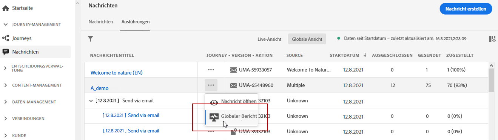
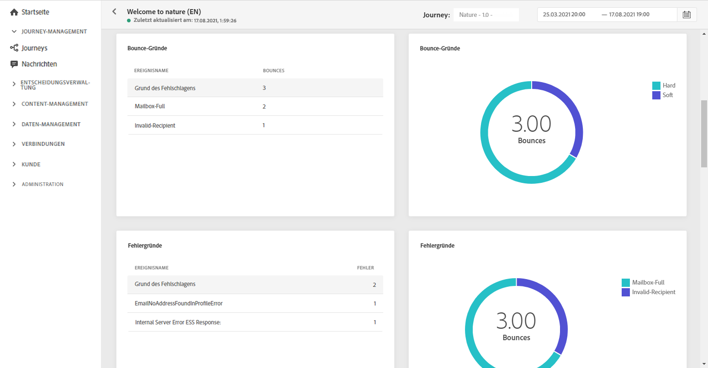

# Globaler E-Mail-Bericht {#email-global-report}

Der **[!UICONTROL Globale E-Mail-Bericht]** berücksichtigt immer nur eine Form des E-Mail-Versands.

Wählen Sie auf der Registerkarte **[!UICONTROL Ausführungen]** des Menüs **[!UICONTROL Nachrichten]** die Option **[!UICONTROL Globale Ansicht]** und wählen Sie dann im erweiterten Menü des ausgewählten Versands **[!UICONTROL Globaler Bericht]**.

Der **[!UICONTROL Globale E-Mail-Bericht]** ist in verschiedene Widgets unterteilt, die Erfolg und Fehler beim Versand detailliert beschreiben. Jedes Widget kann bei Bedarf angepasst und gelöscht werden. Weiterführende Informationen dazu finden Sie in diesem [Abschnitt](global-report.md#modify-dashboard).

**[!UICONTROL E-Mail-Effektivität]** zeigt die wichtigsten Informationen zu Ihrer Nachricht mit KPIs:

* **[!UICONTROL Gesendet]**: Gesamtzahl der gesendeten Nachrichten.

* **[!UICONTROL Zustellbarkeitsrate]**: Prozentsatz der erfolgreich gesendeten Nachrichten.

* **[!UICONTROL Bounce-Rate]**: Prozentsatz der E-Mails, die nicht erfolgreich zugestellt wurden, im Vergleich zur Zahl der gesendeten E-Mails.

* **[!UICONTROL Fehlerrate]**: Prozentsatz der Fehler, die während des Versands auftraten und die Zustellung verhinderten, im Vergleich zur Zahl der gesendeten E-Mails.

* **[!UICONTROL Öffnungsrate]**: Prozentsatz der geöffneten Nachrichten.

* **[!UICONTROL Klickrate]**:  Prozentsatz der Klicks für einen Versand.

* **[!UICONTROL Spam-Beschwerderate]**: Prozentsatz der E-Mails, die von Empfängern als Spam gekennzeichnet wurden, im Vergleich zu den zugestellten Nachrichten. Weiterführende Informationen zu Beschwerden finden Sie auf dieser [Seite](https://experienceleague.adobe.com/docs/deliverability-learn/deliverability-best-practice-guide/metrics-for-deliverability/complaints.html?lang=de#metrics-for-deliverability?lang=de).

* **[!UICONTROL Abmeldungsrate]**: Zahl der eindeutigen Abmeldungen im Vergleich zur Zahl der zugestellten Nachrichten.

Das Diagramm **[!UICONTROL Versandstatistik]** stellt den Erfolg Ihres Versands dar:

* **[!UICONTROL Zugestellt]**: Zahl der erfolgreich gesendeten Nachrichten im Vergleich zur Gesamtzahl der gesendeten Nachrichten.

* **[!UICONTROL Bounces]**: Gesamtzahl der kumulierten Fehler bei Versand und automatischer Bounce-Verarbeitung in Relation zur Gesamtzahl der gesendeten Nachrichten.

* **[!UICONTROL Fehler]**: Gesamtanzahl der Fehler, die während des Versands aufgetreten sind und die Zustellung an Profile verhinderten.

Die Widgets **[!UICONTROL Bounce-Gründe]** und **[!UICONTROL Bounce-Kategorien]** enthalten die verfügbaren Daten zu unzustellbaren Nachrichten wie:

* **[!UICONTROL Hardbounce]**: die Gesamtzahl der permanenten Fehler, wie eine falsche E-Mail-Adresse. Dazu gehören Fehlermeldungen, die explizit eine ungültige Adresse anzeigen, wie etwa „Benutzer unbekannt“.

* **[!UICONTROL Softbounce]**: die Gesamtzahl der temporären Fehler, wie ein voller Posteingang.

* **[!UICONTROL Ignoriert]**: Die Gesamtzahl der temporären Ereignisse, beispielsweise Abwesenheit, oder technischer Fehler, zum Beispiel wenn der Absendertyp Postmaster ist.

Weiterführende Informationen zu Bounces finden Sie auf der Seite [Unterdrückungsliste](../suppression-list.md) .

In der Grafik **[!UICONTROL Fehlergründe]** und der Tabelle unten können Sie sehen, welcher Fehler während des Versands aufgetreten ist.

Das Diagramm **[!UICONTROL E-Mail – beste Empfänger-Domain]** und die Tabelle zeigen, welche Domains von Empfängern am häufigsten zum Öffnen der E-Mail verwendet werden.

Die Tabelle **[!UICONTROL E-Mail – Tracking-Statistik]** enthält die verfügbaren Daten zu den Aktivitäten von Empfängern für Ihren Versand:

* **[!UICONTROL Öffnungen]**: Gibt die Zahl der Öffnungen eines Versands an.

* **[!UICONTROL Einzelöffnungen]**: Die Anzahl der Empfänger, die den Versand geöffnet haben

* **[!UICONTROL Öffnungsrate]**: Prozentsatz der geöffneten Nachrichten.

* **[!UICONTROL Klicks]**: Anzahl der Klicks auf Inhalt einer E-Mail.

* **[!UICONTROL Einzelklicks]**: Die Anzahl der Empfänger, die auf Inhalt in einer E-Mail geklickt haben.

* **[!UICONTROL Clickthrough-Rate]**: Prozentsatz der Klicks für einen Versand.

**[!UICONTROL Öffnen vs. Klicken]** zeigt die Interaktion der Empfänger mit dem Versand:

* **[!UICONTROL Einzelklicks]**: Die Anzahl der Empfänger, die auf Inhalt in einer E-Mail geklickt haben.

* **[!UICONTROL Einzelöffnungen]**: Die Anzahl der Empfänger, die den Versand geöffnet haben

Das Diagramm **[!UICONTROL E-Mail – Top-URL]** und die Tabelle zeigen, welche URLs Ihres Versands am häufigsten besucht werden.
