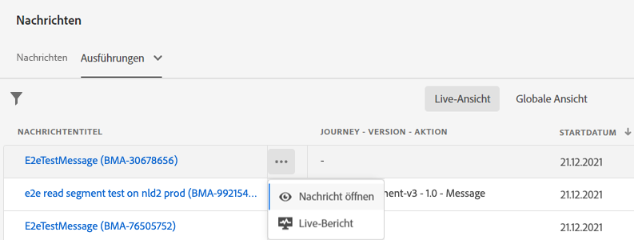

# E-Mail-Live-Bericht {#email-live-report}

Der **[!UICONTROL E-Mail-Live-Bericht]** bezieht sich nur auf einen bestimmten E-Mail-Versand.

Wählen Sie auf der Registerkarte **[!UICONTROL Ausführungen]** des Menüs **[!UICONTROL Nachrichten]** die Option **[!UICONTROL Live-Ansicht]** und wählen Sie dann im erweiterten Menü des ausgewählten Versands **[!UICONTROL Live-Bericht]**.

Der **[!UICONTROL E-Mail-Live-Bericht]** ist in verschiedene Widgets unterteilt, die den Erfolg und die Fehler Ihres Versands detailliert beschreiben. Jedes Widget kann bei Bedarf angepasst und gelöscht werden. Weiterführende Informationen dazu finden Sie in diesem [Abschnitt](live-report.md#modify-dashboard).

Die Widgets **[!UICONTROL E-Mail-Performance]** und **[!UICONTROL E-Mail-Zusammenfassung]** geben mit einem Diagramm und KPIs die wichtigsten Informationen in Bezug auf Ihre Nachricht:

* **[!UICONTROL Gesendet]**: Gesamtzahl der gesendeten Nachrichten.

* **[!UICONTROL Zugestellt]**: Zahl der erfolgreich gesendeten Nachrichten im Vergleich zur Gesamtzahl der gesendeten Nachrichten.

* **[!UICONTROL Bounces]**: Gesamtzahl der kumulierten Fehler bei Versand und automatischer Bounce-Verarbeitung in Relation zur Gesamtzahl der gesendeten Nachrichten.

* **[!UICONTROL Fehler]**: Gesamtanzahl der Fehler, die während des Versands aufgetreten sind und die Zustellung an Profile verhinderten.

* **[!UICONTROL Öffnungen]**: Anzahl der Öffnungen einer Nachricht in einem Versand.

* **[!UICONTROL Klicks]**: Anzahl der Klicks auf einen Inhalt in einem Versand.

Das Diagramm **[!UICONTROL Versandstatistik]** stellt den Erfolg Ihres Versands dar:

* **[!UICONTROL Zugestellt]**: Zahl der erfolgreich gesendeten Nachrichten im Vergleich zur Gesamtzahl der gesendeten Nachrichten.

* **[!UICONTROL Bounces]**: Gesamtzahl der kumulierten Fehler bei Versand und automatischer Bounce-Verarbeitung in Relation zur Gesamtzahl der gesendeten Nachrichten.

* **[!UICONTROL Fehler]**: Gesamtanzahl der Fehler, die während des Versands aufgetreten sind und die Zustellung an Profile verhinderten.

In der Grafik **[!UICONTROL Fehlergründe]** und der Tabelle unten können Sie sehen, welcher Fehler während des Versands aufgetreten ist.

Die Widgets **[!UICONTROL Bounce-Gründe]** und **[!UICONTROL Bounce-Kategorien]** enthalten die verfügbaren Daten zu unzustellbaren Nachrichten wie:

* **[!UICONTROL Hardbounce]**: die Gesamtzahl der permanenten Fehler, wie eine falsche E-Mail-Adresse. Dazu gehören Fehlermeldungen, die explizit eine ungültige Adresse anzeigen, wie etwa „Benutzer unbekannt“.

* **[!UICONTROL Softbounce]**: die Gesamtzahl der temporären Fehler, wie ein voller Posteingang.

* **[!UICONTROL Ignoriert]**: Die Gesamtzahl der temporären Ereignisse, beispielsweise Abwesenheit, oder technischer Fehler, zum Beispiel wenn der Absendertyp Postmaster ist.
