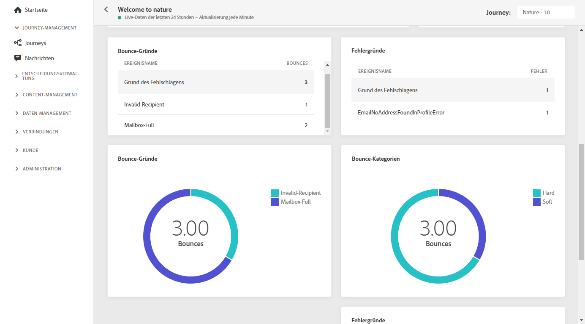
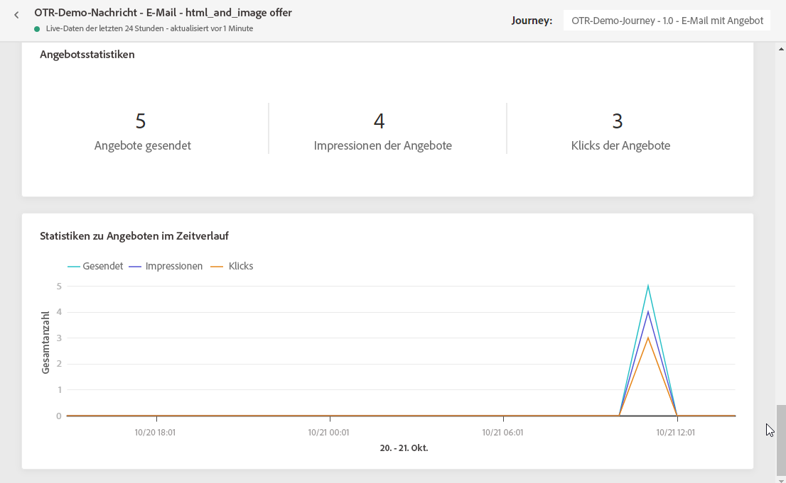

# Live-Bericht zum E-Mail-Versand {#email-live-report}

Der **[!UICONTROL E-Mail-Live-Bericht]** bezieht sich nur auf einen bestimmten E-Mail-Versand.

Wählen Sie auf der Registerkarte **[!UICONTROL Ausführungen]** des Menüs **[!UICONTROL Nachrichten]** die Option **[!UICONTROL Live-Ansicht]** und wählen Sie dann im erweiterten Menü des ausgewählten Versands **[!UICONTROL Live-Bericht]**.

Der **[!UICONTROL E-Mail-Live-Bericht]** ist in verschiedene Widgets unterteilt, die den Erfolg und die Fehler Ihres Versands detailliert beschreiben. Jedes Widget kann bei Bedarf angepasst und gelöscht werden. Weiterführende Informationen dazu finden Sie in diesem [Abschnitt](live-report.md#modify-dashboard).

Die Widgets **[!UICONTROL E-Mail-Performance]** und **[!UICONTROL E-Mail-Zusammenfassung]** geben mit einem Diagramm und KPIs die wichtigsten Informationen in Bezug auf Ihre Nachricht:

* **[!UICONTROL Ausgewählt]**: Anzahl der Benutzerprofile, die sich als Zielgruppenprofile für diesen Versand eignen.

* **[!UICONTROL Gesendet]**: Gesamtzahl der gesendeten Nachrichten.

* **[!UICONTROL Zugestellt]**: Zahl der erfolgreich gesendeten Nachrichten im Vergleich zur Gesamtzahl der gesendeten Nachrichten.

* **[!UICONTROL Öffnungen]**: Anzahl der Öffnungen einer Nachricht in einem Versand.

* **[!UICONTROL Klicks]**: Anzahl der Klicks auf einen Inhalt in einem Versand.

* **[!UICONTROL Bounces]**: Gesamtzahl der kumulierten Fehler bei Versand und automatischer Bounce-Verarbeitung in Relation zur Gesamtzahl der gesendeten Nachrichten.

* **[!UICONTROL Fehler]**: Gesamtanzahl der Fehler, die während des Versands aufgetreten sind und die Zustellung an Profile verhinderten.

* **[!UICONTROL Beschwerden wegen Spam]**: Anzahl der als Spam klassifizierten Nachrichten.

* **[!UICONTROL Kündigungen von Abos]**: Zahl der Klicks auf den Abmelde-Link.

* **[!UICONTROL Ausgeschlossen]**: Anzahl der Benutzerprofile, die von den Zielgruppenprofilen ausgeschlossen waren und die die Nachricht nicht erhalten haben.

Das Widget **[!UICONTROL Versandstatistik]** stellt den Erfolg Ihres Versands dar:

* **[!UICONTROL Zugestellt]**: Zahl der erfolgreich gesendeten Nachrichten im Vergleich zur Gesamtzahl der gesendeten Nachrichten.

* **[!UICONTROL Bounces]**: Gesamtzahl der kumulierten Fehler bei Versand und automatischer Bounce-Verarbeitung in Relation zur Gesamtzahl der gesendeten Nachrichten.

* **[!UICONTROL Fehler]**: Gesamtanzahl der Fehler, die während des Versands aufgetreten sind und die Zustellung an Profile verhinderten.

In der Grafik **[!UICONTROL Fehlergründe]** und der Tabelle unten können Sie sehen, welcher Fehler während des Versands aufgetreten ist.

Die Widgets **[!UICONTROL Bounce-Gründe]** und **[!UICONTROL Bounce-Kategorien]** enthalten die verfügbaren Daten zu unzustellbaren Nachrichten wie:

* **[!UICONTROL Hardbounce]**: die Gesamtzahl der permanenten Fehler, wie eine falsche E-Mail-Adresse. Dazu gehören Fehlermeldungen, die explizit eine ungültige Adresse anzeigen, wie etwa „Benutzer unbekannt“.

* **[!UICONTROL Softbounce]**: die Gesamtzahl der temporären Fehler, wie ein voller Posteingang.

* **[!UICONTROL Ignoriert]**: Die Gesamtzahl der temporären Ereignisse, beispielsweise Abwesenheit, oder technischer Fehler, zum Beispiel wenn der Absendertyp Postmaster ist.

>[!NOTE]
>
>Die Widgets Angebote und Metriken sind nur verfügbar, wenn eine Entscheidung in eine E-Mail eingefügt wurde. Weiterführende Informationen zur Entscheidungsverwaltung finden Sie in diesem [page](../offers/get-started/starting-offer-decisioning.md).

Die **[!UICONTROL Angebotsstatistiken]** und **[!UICONTROL Angebotsstatistiken]** über Widgets vom Typ Zeit hinweg messen Sie den Erfolg und die Wirkung Ihres Angebots auf Ihre Zielgruppe. Sie enthalten die wichtigsten Informationen zu Ihrer Nachricht mit KPIs:

* **[!UICONTROL gesendetes Angebot]**: Gesamtzahl der gesendeten Nachrichten für das Angebot.

* **[!UICONTROL Angebotseindruck]**: Anzahl der Öffnungen des Angebots in einem Versand.

* **[!UICONTROL Angebotsklicks]**: Anzahl der Klicks auf ein Angebot in einem Versand.

>[!NOTE]
>
>Die Profile mit dem Status **[!UICONTROL Unterdrückt]** oder **[!UICONTROL Nicht erlaubt]** werden während des Nachrichtenversands ausgeschlossen. Daher zeigen die **Journey-Berichte** zwar an, dass sich diese Profile durch die Journey bewegt haben (Aktivitäten [Segment lesen](../building-journeys/read-segment.md) und [Nachricht](../building-journeys/journeys-message.md)), sie sind aber nicht in der Metrik **[!UICONTROL Gesendet]** der **E-Mail-Berichte** enthalten, da sie vor dem E-Mail-Versand herausgefiltert werden.
>
>Erfahren Sie mehr über die [Unterdrückungsliste](../suppression-list.md) und die [Zulassungsliste](../allow-list.md). Um den Grund für alle Ausschlussfälle zu ermitteln, können Sie den [Abfrage-Service von Adobe Experience Platform](https://experienceleague.adobe.com/docs/experience-platform/query/api/getting-started.html?lang=de){target=&quot;_blank&quot;} verwenden.
