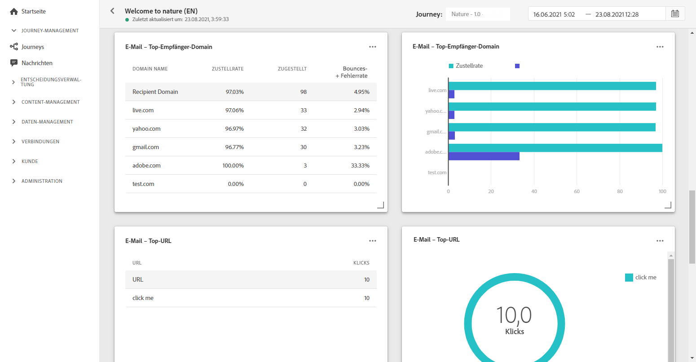
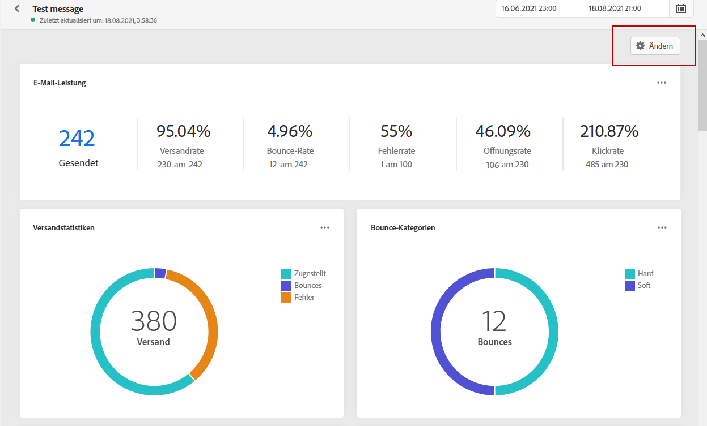
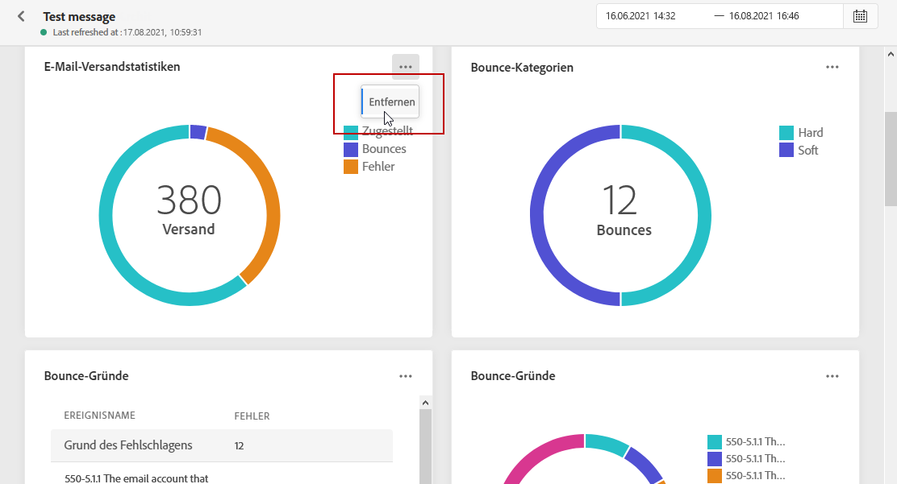

# Globaler Bericht {#global-report}

>[!NOTE]
>
> Wenn benutzerdefinierte Abfragen über APIs unter Verwendung des Abfrage-Service durchgeführt werden, treten bei Ihren Berichten möglicherweise Verzögerungen auf.

Mit dem **[!UICONTROL globalen Bericht]** können Sie die Effektivität Ihrer Journeys und Ihrer Sendungen über einen bestimmten Zeitraum messen.

* Wenn Sie eine Journey oder Sendungen in einer Journey auswählen möchten, greifen Sie im Menü **[!UICONTROL Journeys]** auf Ihre Journey zu und klicken Sie auf das Symbol **[!UICONTROL Globaler Bericht]**. Anschließend können Sie den **[!UICONTROL globalen Bericht]** zu Journeys, E-Mail-Nachrichten und Push-Benachrichtigungen finden.

* Wenn Sie einen bestimmten Versand auswählen möchten, wählen Sie in der Ansicht **[!UICONTROL Global]** auf der Registerkarte **[!UICONTROL Ausführungen]** Ihrer Nachrichten die Option **[!UICONTROL Globaler Bericht]** aus dem erweiterten Menü des ausgewählten Versands.

## Dashboard anpassen {#modify-dashboard}

Jedes Reporting-Dashboard kann durch Ändern der Größe oder Entfernung von Widgets oder durch Ändern des Zielzeitrahmens geändert werden. Das Ändern der Widgets wirkt sich nur auf das Dashboard des aktuellen Benutzers aus. Andere Benutzer sehen ihre eigenen Dashboards oder die standardmäßig festgelegten.

1. Klicken Sie im Dashboard **[!UICONTROL Globaler Bericht]** auf die Schaltfläche „Planung“.

1. Wählen Sie das Start- und Enddatum aus. Sie können Ihre Berichte noch weiter präzisieren, indem Sie **[!UICONTROL Startzeit]** und **[!UICONTROL Endzeit]** auswählen.

   

1. Klicken Sie auf **[!UICONTROL Ändern]**.

   

1. Passen Sie die Größe der Widgets an, indem Sie die untere rechte Ecke ziehen.

   

1. Klicken Sie auf **[!UICONTROL Entfernen]**, um andere Widgets zu entfernen, die Sie nicht für das Tracking von Bounces benötigen.

   

1. Wenn Sie mit der Anzeigereihenfolge und der Größe Ihrer Widgets zufrieden sind, klicken Sie auf **[!UICONTROL Speichern]**.

Ihr Dashboard ist jetzt gespeichert. Ihre verschiedenen Änderungen werden bei einer späteren Verwendung Ihrer globalen Berichte erneut angewendet. Verwenden Sie bei Bedarf die Option **[!UICONTROL Zurücksetzen]**, um die Standard-Widgets und ihre Standardreihenfolge wiederherzustellen.
