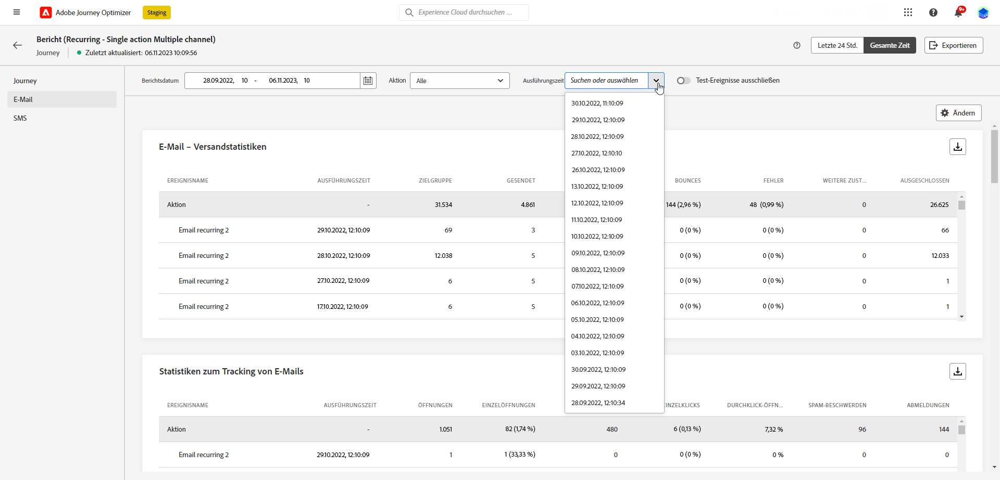
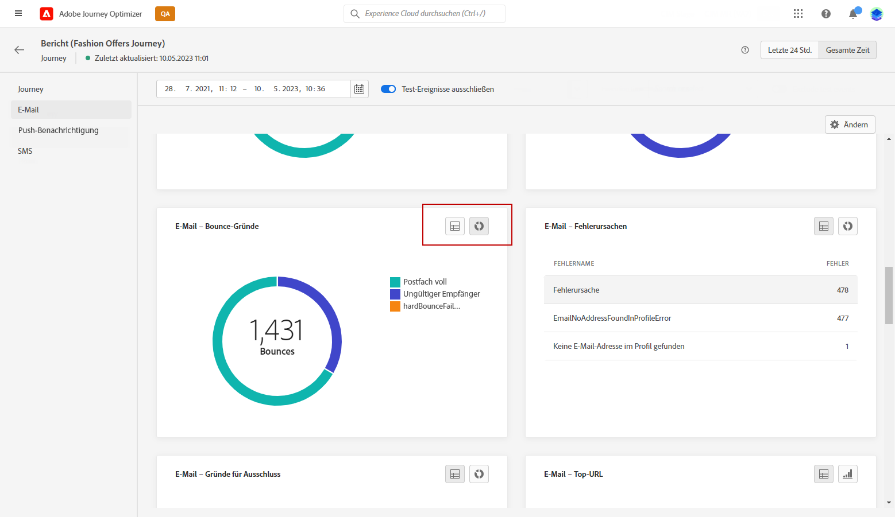
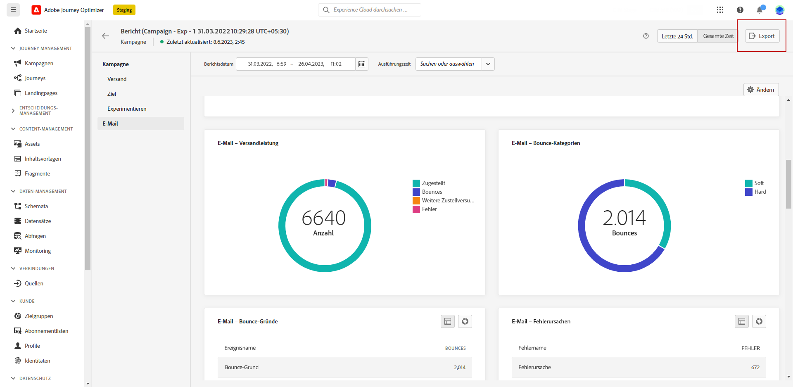
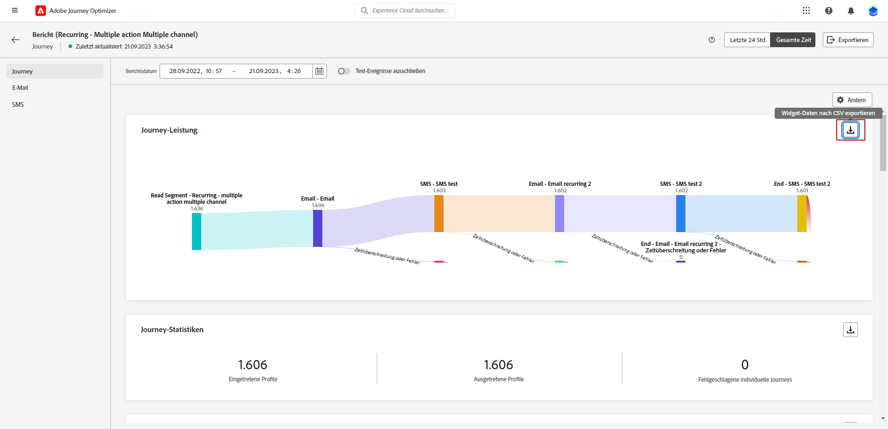

# Erste Schritte mit dem globalen Bericht {#global-report}

>[!AVAILABILITY]
>
>Das aktuelle Reporting-Erlebnis wird im Januar 2025 eingestellt. Nach diesem Datum wird das neue Reporting-Erlebnis zum Standard. Wir empfehlen, sich mit den neuen Funktionen und Funktionalitäten vertraut zu machen, um einen reibungslosen Übergang zu gewährleisten. [Erste Schritte mit der neuen Reporting-Oberfläche von Journey Optimizer](report-gs-cja.md)

>[!NOTE]
>
> Wenn benutzerdefinierte Abfragen über APIs unter Verwendung des Abfrage-Service durchgeführt werden, treten bei Ihren Berichten möglicherweise Verzögerungen auf.

Mit dem **[!UICONTROL globalen Bericht]** können Sie die Effektivität Ihrer Journeys und Ihrer Sendungen über einen bestimmten Zeitraum messen.

* Wenn Sie eine Journey oder Sendungen innerhalb einer Journey auswählen möchten, greifen Sie im Menü **[!UICONTROL Journeys]** auf Ihre Journey zu und klicken Sie auf das Symbol **[!UICONTROL Bericht anzeigen]**. Dort finden Sie die globalen Berichte zu Journeys, E-Mail-Nachrichten, SMS und Push-Benachrichtigungen.

  

* Wenn Sie eine Kampagne als Ziel wählen möchten, rufen Sie im Menü **[!UICONTROL Kampagnen]** Ihre Kampagne auf und klicken auf die Schaltfläche **[!UICONTROL Berichte]**.

  

* Wenn Sie für Ihren Versand vom **[!UICONTROL Live-Bericht]** zum **[!UICONTROL globalen Bericht]** wechseln möchten, klicken Sie im Registerkartenumschalter auf **[!UICONTROL Gesamte Zeit]**.

  

Eine detaillierte Liste aller in Adobe Journey Optimizer verfügbaren Metriken finden Sie auf [dieser Seite](#list-of-components-global)

## Dashboard anpassen {#modify-dashboard}

Jedes Berichts-Dashboard kann durch das Ändern des Zeitraums und das Ändern der Größe von Widgets oder das Entfernen von Widgets geändert werden. Das Ändern der Widgets wirkt sich nur auf das Dashboard des aktuellen Benutzers aus. Andere Benutzer sehen ihre eigenen Dashboards oder die standardmäßig festgelegten.

1. Wählen Sie aus Ihrem globalen Bericht eine Start- und Endzeit aus, um auf bestimmte Daten zuzugreifen.

   

1. Wählen Sie für Ihre Journey-Berichte, die mehrere konfigurierte **[!UICONTROL Aktionen]** umfassen, eine bestimmte **[!UICONTROL Aktion]** aus dem Dropdown-Menü.

1. Wenn Sie nur eine oder mehrere wiederkehrende Nachrichten als Ziel auswählen möchten, wählen Sie diese aus der Dropdown-Liste **[!UICONTROL Ausführungszeit]**.

   

1. Sie können mit der Umschaltleiste auswählen, ob Sie Testereignisse aus Ihren Berichten ausschließen möchten. Weitere Informationen zu Testereignissen finden Sie auf [dieser Seite](../building-journeys/testing-the-journey.md).

   Beachten Sie, dass die Option **[!UICONTROL Test-Ereignisse ausschließen]** nur für Journey-Berichte verfügbar ist.

   

1. Klicken Sie auf **[!UICONTROL Ändern]**, um mit der Anpassung Ihres Dashboards zu beginnen.

   

1. Sie können die Größe der Widgets durch Ziehen an der rechten unteren Ecke anpassen.

   

1. Klicken Sie auf **[!UICONTROL Entfernen]**, um alle Widgets zu entfernen, die Sie nicht benötigen.

   

1. Wenn Sie mit der Anzeigereihenfolge und der Größe Ihrer Widgets zufrieden sind, klicken Sie auf **[!UICONTROL Speichern]**.

1. Um die Darstellung Ihrer Daten anzupassen, können Sie zwischen verschiedenen Visualisierungsoptionen, wie Graphen, Tabellen und Ringdiagrammen, wechseln.

   

Ihr Dashboard ist jetzt gespeichert. Ihre verschiedenen Änderungen werden bei einer späteren Verwendung Ihrer Live-Berichte erneut angewendet. Verwenden Sie bei Bedarf die Option **[!UICONTROL Zurücksetzen]**, um die Standard-Widgets und ihre Standardreihenfolge wiederherzustellen.

## Exportieren Ihrer Berichte {#export-reports}

Sie können Ihre Berichte einfach in PDF- oder CSV-Format exportieren, sodass Sie sie freigeben oder drucken können. Die Schritte zum Exportieren von Berichten werden in den folgenden Registerkarten beschrieben.

➡️ [Entdecken Sie diese Funktion im Video](#video-csv)

>[!BEGINTABS]

>[!TAB Exportieren Ihres Berichts als CSV-Datei]

1. Klicken Sie in Ihrem Bericht auf **[!UICONTROL Exportieren]** und wählen Sie **[!UICONTROL CSV-Datei]** aus, um eine CSV-Datei auf der allgemeinen Berichtsebene zu generieren.

   

1. Daten können auch aus einem bestimmten Widget heraus exportiert werden. Klicken Sie auf **[!UICONTROL Widget-Daten in CSV exportieren]** neben dem ausgewählten Widget.

   

1. Die Datei wird automatisch heruntergeladen und ist in Ihren lokalen Dateien zu finden.

   Wenn die Datei auf Berichtsebene generiert wurde, enthält sie detaillierte Informationen für jedes Widget, einschließlich Titel und Daten.

   Wenn die Datei auf Widget-Ebene generiert wurde, stellt sie speziell Daten für das ausgewählte Widget bereit.

>[!TAB Exportieren Ihres Berichts als PDF-Datei]

1. Klicken Sie in Ihrem Bericht auf **[!UICONTROL Exportieren]** und wählen Sie **[!UICONTROL PDF-Datei]** aus.

   

1. Konfigurieren Sie das Dokument wie gewünscht im Drucken-Fenster. Beachten Sie, dass die Optionen je nach Browser variieren können.

1. Wählen Sie, ob Sie Ihren Bericht als PDF drucken oder speichern möchten.

1. Suchen Sie den Ordner, in dem Sie die Datei speichern möchten, benennen Sie diesen gegebenenfalls um und klicken Sie auf Speichern.

Ihr Bericht kann jetzt in einer PDF-Datei angezeigt oder freigegeben werden.

>[!ENDTABS]

### Berichte exportieren (Video) {#video-csv}

Im folgenden Anleitungsvideo wird erklärt, wie ein CSV-Bericht für einen Bericht und für ein einzelnes Widget heruntergeladen werden kann.

>[!VIDEO](https://video.tv.adobe.com/v/3424603?quality=12)

>[!CONTEXTUALHELP]
>id="ajo_report_campaign_ctr"
>title="CTR"
>abstract="CTR-Widget"

>[!CONTEXTUALHELP]
>id="ajo_report_campaign_clicks"
>title="Klicks"
>abstract="Widget „Klicks“"

>[!CONTEXTUALHELP]
>id="ajo_report_campaign_delivered"
>title="Zugestellt"
>abstract="Widget „Zugestellt“"

>[!CONTEXTUALHELP]
>id="ajo_report_campaign_overview"
>title="Kampagnen-Überblick"
>abstract="Widget „Kampagnen-Überblick“"

>[!CONTEXTUALHELP]
>id="ajo_report_campaign_funnel"
>title="Trichter-Ergebnisse für Kampagnen"
>abstract="Widget „Trichter-Ergebnisse für Kampagnen“"

>[!CONTEXTUALHELP]
>id="ajo_report_campaign_tracking_link"
>title="Labels getrackter Links"
>abstract="Widget „Labels getrackter Links“"

>[!CONTEXTUALHELP]
>id="ajo_report_campaign_displays"
>title="Anzeigen"
>abstract="Widget „Anzeigen“"

<!--campaign email-->

>[!CONTEXTUALHELP]
>id="ajo_report_campaign_email_delivered_click"
>title="Versand- und Klick-Trend"
>abstract="Widget „Versand- und Klick-Trend“"

>[!CONTEXTUALHELP]
>id="ajo_report_campaign_email_delivery_status"
>title="Versandstatus"
>abstract="Widget „Versandstatus“"

>[!CONTEXTUALHELP]
>id="ajo_report_campaign_email_sending_statistics"
>title="Versandstatistik"
>abstract="Widget „Versandstatistik“"

>[!CONTEXTUALHELP]
>id="ajo_report_campaign_email_tracking_statistics"
>title="Tracking-Statistiken"
>abstract="Widget „Tracking-Statistiken“"

>[!CONTEXTUALHELP]
>id="ajo_report_campaign_email_domains"
>title="E-Mail-Domains"
>abstract="Widget „E-Mail-Domains“"

>[!CONTEXTUALHELP]
>id="ajo_report_campaign_email_tracked_link"
>title="Labels getrackter Links"
>abstract="Widget „Labels getrackter Links“"

>[!CONTEXTUALHELP]
>id="ajo_report_campaign_email_tracked_link_urls"
>title="Getrackte Link-URLs"
>abstract="Widget „Getrackte Link-URLs“"

>[!CONTEXTUALHELP]
>id="ajo_report_campaign_email_subjects"
>title="E-Mail-Betreffe"
>abstract="Widget „E-Mail-Betreffe“"

>[!CONTEXTUALHELP]
>id="ajo_report_campaign_email_bounce_reasons"
>title="Bounce-Gründe"
>abstract="Widget „Bounce-Gründe“"

>[!CONTEXTUALHELP]
>id="ajo_report_campaign_email_exclude"
>title="Ausschlussgründe"
>abstract="Widget „Ausschlussgründe“"

>[!CONTEXTUALHELP]
>id="ajo_report_campaign_email_error"
>title="Fehlergründe"
>abstract="Widget „Fehlergründe“"

<!--campaign push-->

>[!CONTEXTUALHELP]
>id="ajo_report_campaign_push_sending_statistics"
>title="Versandstatistik"
>abstract="Widget „Versandstatistik“"

>[!CONTEXTUALHELP]
>id="ajo_report_campaign_push_tracking_statistics"
>title="Tracking-Statistiken"
>abstract="Widget „Tracking-Statistiken“"

>[!CONTEXTUALHELP]
>id="ajo_report_campaign_push_tracked_link"
>title="Labels getrackter Links"
>abstract="Widget „Labels getrackter Links“"

>[!CONTEXTUALHELP]
>id="ajo_report_campaign_push_tracked_link_urls"
>title="Getrackte Link-URLs"
>abstract="Widget „Getrackte Link-URLs“"

>[!CONTEXTUALHELP]
>id="ajo_report_campaign_push_bounce_reasons"
>title="Bounce-Gründe"
>abstract="Widget „Bounce-Gründe“"

>[!CONTEXTUALHELP]
>id="ajo_report_campaign_push_exclude"
>title="Ausschlussgründe"
>abstract="Widget „Ausschlussgründe“"

>[!CONTEXTUALHELP]
>id="ajo_report_campaign_push_email_error"
>title="Fehlergründe"
>abstract="Widget „Fehlergründe“"

<!--campaign inapp-->

>[!CONTEXTUALHELP]
>id="ajo_report_campaign_inapp_impression"
>title="Impression- und Klick-Trend"
>abstract="Widget „Impression- und Klick-Trend“"

>[!CONTEXTUALHELP]
>id="ajo_report_campaign_inapp_clicks"
>title="Klicks"
>abstract="Widget „Klicks“"

>[!CONTEXTUALHELP]
>id="ajo_report_campaign_inapp_displays"
>title="Anzeigen"
>abstract="Widget „Anzeigen“"

>[!CONTEXTUALHELP]
>id="ajo_report_campaign_inapp_tracking_data"
>title="Tracking-Daten"
>abstract="Widget „Tracking-Daten“"

>[!CONTEXTUALHELP]
>id="ajo_report_campaign_inapp_tracked_link"
>title="Labels getrackter Links"
>abstract="Widget „Labels getrackter Links“"

>[!CONTEXTUALHELP]
>id="ajo_report_campaign_inapp_tracked_link_urls"
>title="Getrackte Link-URLs"
>abstract="Widget „Getrackte Link-URLs“"

<!--campaign sms-->

>[!CONTEXTUALHELP]
>id="ajo_report_campaign_sms_delivered_click"
>title="Versand- und Klick-Trend"
>abstract="Widget „Versand- und Klick-Trend“"

>[!CONTEXTUALHELP]
>id="ajo_report_campaign_sms_delivery_status"
>title="Versandstatus"
>abstract="Widget „Versandstatus“"

>[!CONTEXTUALHELP]
>id="ajo_report_campaign_sms_tracked_link"
>title="Labels getrackter Links"
>abstract="Widget „Labels getrackter Links“"

>[!CONTEXTUALHELP]
>id="ajo_report_campaign_sms_tracked_link_urls"
>title="Getrackte Link-URLs"
>abstract="Widget „Getrackte Link-URLs“"

>[!CONTEXTUALHELP]
>id="ajo_report_campaign_sms_inbound"
>title="Eingehende SMS-Nachricht"
>abstract="Widget „Eingehende SMS-Nachricht“"

>[!CONTEXTUALHELP]
>id="ajo_report_campaign_sms_message_type"
>title="SMS-Nachrichtentyp"
>abstract="Widget „SMS-Nachrichtentyp“"

>[!CONTEXTUALHELP]
>id="ajo_report_campaign_sms_providers"
>title="SMS-Anbieter"
>abstract="Widget „SMS-Anbieter“"

>[!CONTEXTUALHELP]
>id="ajo_report_campaign_sms_bounce"
>title="Bounce-Gründe"
>abstract="Widget „Bounce-Gründe“"

>[!CONTEXTUALHELP]
>id="ajo_report_campaign_sms_exclude"
>title="Ausschlussgründe"
>abstract="Widget „Ausschlussgründe“"

>[!CONTEXTUALHELP]
>id="ajo_report_campaign_sms_error"
>title="Fehlergründe"
>abstract="Widget „Fehlergründe“"
