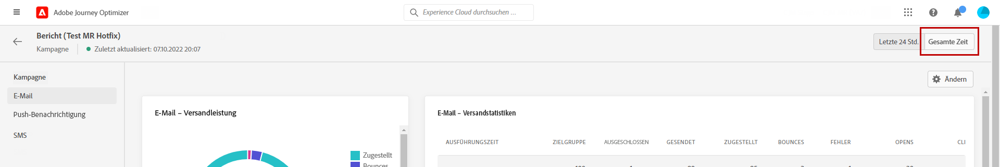
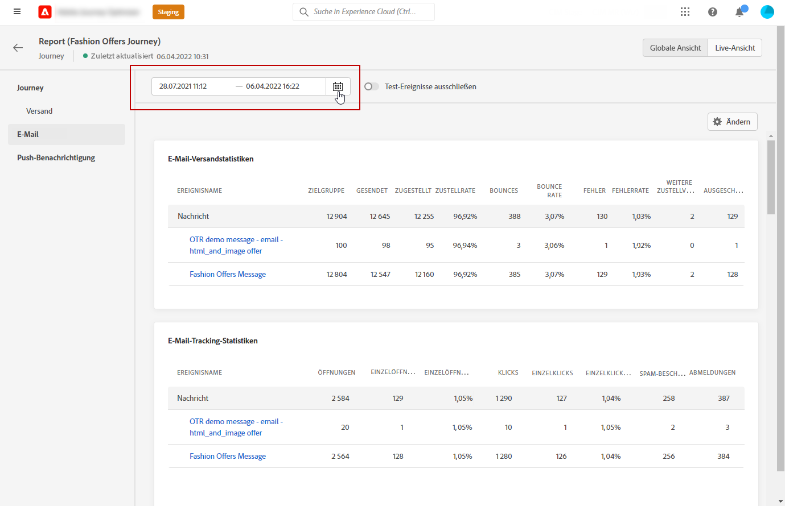
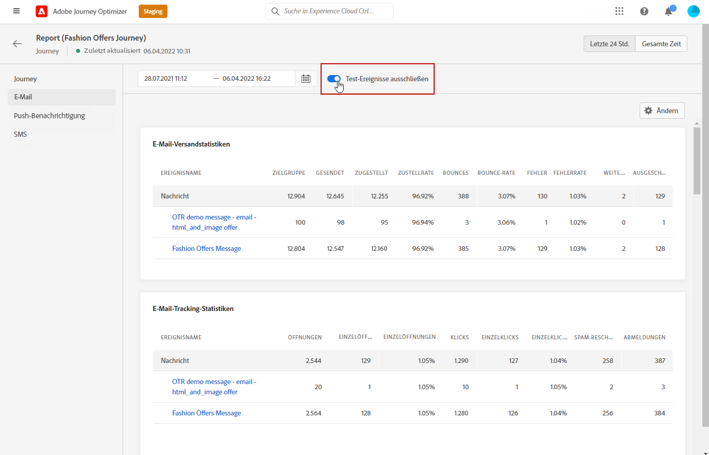
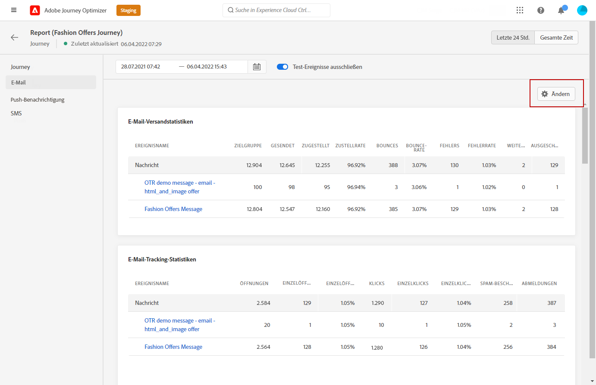
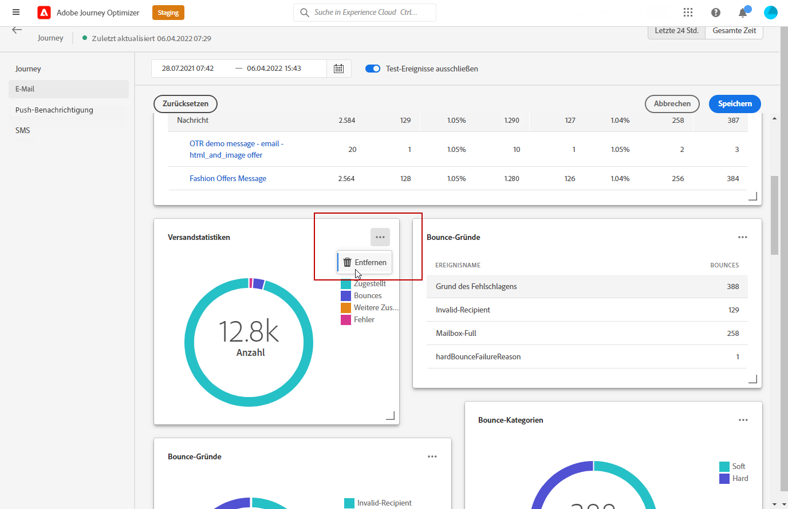

# Erste Schritte mit dem globalen Bericht {#global-report}

>[!NOTE]
>
> Wenn benutzerdefinierte Abfragen über APIs unter Verwendung des Abfrage-Service durchgeführt werden, treten bei Ihren Berichten möglicherweise Verzögerungen auf.

Mit dem **[!UICONTROL globalen Bericht]** können Sie die Effektivität Ihrer Journeys und Ihrer Sendungen über einen bestimmten Zeitraum messen.

* Wenn Sie eine Journey oder Sendungen innerhalb einer Journey auswählen möchten, greifen Sie im Menü **[!UICONTROL Journeys]** auf Ihre Journey zu und klicken Sie auf das Symbol **[!UICONTROL Bericht anzeigen]**. Dort finden Sie die globalen Berichte zu Journeys, E-Mail-Nachrichten, SMS und Push-Benachrichtigungen.

   

* Wenn Sie eine Kampagne als Ziel wählen möchten, rufen Sie im Menü **[!UICONTROL Kampagnen]** Ihre Kampagne auf und klicken auf die Schaltfläche **[!UICONTROL Berichte]**.

   

* Wenn Sie für Ihren Versand vom **[!UICONTROL Live-Bericht]** zum **[!UICONTROL globalen Bericht]** wechseln möchten, klicken Sie im Registerkartenumschalter auf **[!UICONTROL Gesamte Zeit]**.

   

Eine detaillierte Liste aller in Adobe Journey Optimizer verfügbaren Metriken finden Sie auf [dieser Seite](#list-of-components-global)

## Anpassen des Dashboards {#modify-dashboard}

Jedes Berichts-Dashboard kann durch das Ändern des Zeitraums und das Ändern der Größe von Widgets oder das Entfernen von Widgets geändert werden. Das Ändern der Widgets wirkt sich nur auf das Dashboard des aktuellen Benutzers aus. Andere Benutzer sehen ihre eigenen Dashboards oder die standardmäßig festgelegten.

1. Wählen Sie aus Ihrem globalen Bericht eine Start- und Endzeit aus, um auf bestimmte Daten zuzugreifen.

   

1. Sie können mit der Umschaltleiste auswählen, ob Sie Testereignisse aus Ihren Berichten ausschließen möchten. Weitere Informationen zu Testereignissen finden Sie auf [dieser Seite](../building-journeys/testing-the-journey.md).

   Beachten Sie, dass die Option **[!UICONTROL Test-Ereignisse ausschließen]** nur für Journey-Berichte verfügbar ist.

   

1. Klicken Sie auf **[!UICONTROL Ändern]**, um mit der Anpassung Ihres Dashboards zu beginnen.

   

1. Sie können die Größe der Widgets durch Ziehen an der rechten unteren Ecke anpassen.

   

1. Klicken Sie auf **[!UICONTROL Entfernen]**, um alle Widgets zu entfernen, die Sie nicht benötigen.

   

1. Wenn Sie mit der Anzeigereihenfolge und der Größe Ihrer Widgets zufrieden sind, klicken Sie auf **[!UICONTROL Speichern]**.

Ihr Dashboard ist jetzt gespeichert. Ihre verschiedenen Änderungen werden bei einer späteren Verwendung Ihrer Live-Berichte erneut angewendet. Verwenden Sie bei Bedarf die Option **[!UICONTROL Zurücksetzen]**, um die Standard-Widgets und ihre Standardreihenfolge wiederherzustellen.

## Liste von Komponenten {#list-of-components-global}

In den Tabellen unten finden Sie nach Versandtyp geordnet die Liste der Metriken, die in Berichten verwendet werden, sowie ihre Definitionen.

### Journey-Metriken {#journey-metrics}

<table> 
 <thead> 
  <tr> 
   <th> Metrik  </th> 
   <th> Definition  </th> 
</tr>
 </thead> 
 <tbody> 
  <tr> 
   <td>Erfolgreich ausgeführte Aktionen  </td> 
   <td> Gesamtzahl der erfolgreich ausgeführten Aktionen für eine Journey . </td> 
</tr> 
  <tr> 
   <td> Eingetretene Profile  </td> 
   <td> Gesamtzahl der Einzelanwendenden, die das Eintrittsereignis der Journey erreicht haben.  </td> 
</tr>
  <tr> 
   <td> Fehler bei Aktion  </td> 
   <td>Gesamtzahl der Fehler, die bei Aktionen aufgetreten sind.  </td> 
</tr> 
  <tr> 
   <td> Ausgestiegene Profile  </td> 
   <td> Gesamtzahl der Einzelanwendenden, die die Journey verlassen haben  </td> 
</tr> 
  <tr> 
   <td> Fehlgeschlagene einzelne Journey  </td> 
   <td> Gesamtzahl der einzelnen Journeys, die nicht erfolgreich ausgeführt wurden.  </td> 
</tr> 
 </tbody> 
</table>

### Dimensionen und Metriken für E-Mail und SMS {#email-and-sms-metrics}

<table> 
 <thead> 
  <tr> 
   <th> Metrik  </th> 
   <th> Definition  </th> 
</tr>
 </thead> 
 <tbody>
  <tr> 
   <td> Bounces  </td> 
   <td> Gesamtzahl der kumulierten Fehler bei Versand und automatischer Bounce-Verarbeitung im Verhältnis zur Gesamtzahl der gesendeten Nachrichten.  </td> 
</tr> 
  <tr> 
   <td> Bounce-Rate  </td> 
   <td> Prozentsatz der Bounce-E-Mails im Vergleich zu den gesendeten E-Mails  </td> 
</tr>
  <tr> 
   <td> Klicks  </td> 
   <td> Anzahl der Klicks auf einen Inhalt in einer E-Mail.  </td> 
</tr> 
  <tr> 
   <td> Zugestellt   </td> 
   <td> Zahl der erfolgreich gesendeten Nachrichten im Verhältnis zur Gesamtzahl der gesendeten Nachrichten. </td> 
</tr> 
  <tr> 
   <td> Zustellungsrate  </td> 
   <td> Prozentsatz der erfolgreich gesendeten Nachrichten  </td> 
</tr>
  <tr> 
   <td> Fehler  </td> 
   <td> Gesamtanzahl der Fehler, die während des Versands aufgetreten sind und die Zustellung an Profile verhinderten.  </td> 
</tr> 
  <tr> 
   <td> Fehlerrate  </td> 
   <td> Prozentsatz der Fehler, die während des Versands auftraten und die Zustellung verhinderten, im Vergleich zur Zahl der gesendeten E-Mails.  </td> 
</tr>
  <tr> 
   <td> Ausgeschlossen  </td> 
   <td> Anzahl der Profile, die durch Adobe Journey Optimizer ausgeschlossen wurden.  </td> 
</tr>
  <tr> 
   <td> Hardbounce  </td> 
   <td> Gesamtzahl der permanenten Fehler, wie beispielsweise eine falsche E-Mail-Adresse. Dazu gehören Fehlermeldungen, die explizit eine ungültige Adresse anzeigen, wie etwa „Benutzer unbekannt“.  </td>
</tr>
  <tr> 
   <td> Ignoriert  </td> 
   <td> Die Gesamtzahl der temporären Fehler, wie beispielsweise Abwesenheit oder technische Fehler, etwa wenn der Absendertyp Postmaster ist.  </td> 
</tr>
   <tr> 
   <td>Klickrate des Angebots  </td> 
   <td>Prozentsatz der Benutzenden, die mit dem Angebot interagiert haben.  </td> 
</tr>
   <tr> 
   <td>Impressionsrate des Angebots  </td> 
   <td>Prozentsatz der geöffneten Angebote im Verhältnis zur Anzahl der gesendeten Angebote.  </td> 
</tr>
   <tr> 
   <td>Name des Angebots  </td> 
   <td> Name des im Versand hinzugefügten Angebots. Weiterführende Informationen zu Platzierungen finden Sie auf dieser <a href="../offers/offer-library/creating-personalized-offers.md">Seite</a>.  </td> 
</tr>
   <tr> 
   <td>Gesendetes Angebot  </td> 
   <td>Gesamtzahl der Sendevorgänge für das Angebot.  </td> 
</tr> 
  <tr>
   <td>Öffnungen  </td> 
   <td> Die Anzahl, wie oft die Nachricht geöffnet wurde.  </td> 
</tr> 
  <tr> 
   <td> Öffnungsrate  </td> 
   <td> Gesamtzahl der geöffneten E-Mails im Vergleich zur Anzahl der zugestellten E-Mails.  </td> 
</tr>
  <tr> 
   <td>Name der Platzierung  </td> 
   <td> Name der Platzierung, die zur Anzeige Ihres Angebots verwendet wird. Weiterführende Informationen zu Platzierungen finden Sie auf dieser <a href="../offers/offer-library/creating-placements.md">Seite</a>. </td> 
</tr> 
  <tr> 
   <td> Weitere Zustellversuche  </td> 
   <td> Anzahl der E-Mails in der Warteschlange für weitere Zustellversuche.  </td> 
</tr> 
  <tr> 
   <td> Gesendet  </td> 
   <td> Gesamtzahl der gesendeten Nachrichten  </td> 
</tr>
  <tr> 
   <td> Softbounce  </td> 
   <td> Gesamtzahl der temporären Fehler, beispielsweise einer vollen Inbox  </td> 
</tr>
  <tr> 
   <td> Spam-Beschwerden  </td> 
   <td> Anzahl der Fälle, in denen eine Nachricht als Spam oder Junk deklariert wurde.  </td> 
</tr>
  <tr> 
   <td> Zielgruppe  </td> 
   <td> Gesamtzahl der bei der Versandanalyse verarbeiteten Nachrichten.  </td> 
</tr> 
  <tr> 
   <td> Einzelklicks  </td> 
   <td> Die Anzahl der Empfänger, die auf einen Inhalt in einer E-Mail geklickt haben.  </td> 
</tr> 
  <tr> 
   <td>Einzelklickrate  </td> 
   <td> Prozentualer Anteil der Benutzenden, die mit dem Versand interagiert haben.  </td> 
</tr>
  <tr> 
   <td> Einzelöffungen  </td> 
   <td>Anzahl der Empfänger, die den Versand geöffnet haben  </td> 
</tr> 
  <tr> 
   <td> Abmeldungen  </td> 
   <td> Gesamtanzahl der Klicks auf den Abmelde-Link.  </td> 
</tr> 
 </tbody> 
</table>

<!--
### Experimentation metrics {#experimentation-metrics}
<table> 
 <thead> 
  <tr> 
   <th> Metric  </th> 
   <th> Definition  </th> 
</tr>
 </thead> 
 <tbody>
  <tr> 
   <td>App installs  </td> 
   <td>  </td> 
</tr>
  <tr> 
   <td>App launches  </td> 
   <td>  </td> 
</tr>
 <tr> 
   <td>Average lift  </td> 
   <td> Percentage improvement in conversion rate of a given treatment over the baseline.<a href="../campaigns/experiment-calculations.md#understand-lift">Learn more</a>.  </td> 
  </tr>
  <tr> 
   <td>Confidence  </td> 
   <td>Evidence that a given treatment is the same as the baseline treatment. <a href="../campaigns/experiment-calculations.md#understand-confidence">Learn more</a>.  </td> 
</tr>
  <tr> 
   <td>Confidence interval  </td> 
   <td>Percentage difference in performance between the baseline and the best performing treatment. <a href="../campaigns/experiment-calculations.md#understand-intervals">Learn more</a>.  </td> 
</tr> 
  <tr> 
   <td>Count per profile  </td> 
   <td>Total value of the Experiment objective metric divided by the number of profiles.  </td> 
</tr>
  <tr> 
   <td>Email Opens  </td> 
   <td>.  </td> 
</tr>
  <tr> 
   <td>Email Unsubscribes  </td> 
   <td>  </td> 
</tr>
  <tr> 
   <td>First app launches  </td> 
   <td>  </td> 
</tr>
  <tr> 
   <td>Outbound Clicks  </td> 
   <td>  </td> 
</tr>
  <tr> 
   <td>Profiles  </td> 
   <td>Number of profiles targeted for this treatment.  </td> 
</tr>
  <tr> 
   <td>Unique email opens  </td> 
   <td>  </td>
<tr>
  <tr> 
   <td>Unique email unsubscribes  </td> 
   <td>  </td>
</tr>
  <tr> 
   <td>Unique installs  </td> 
   <td>  </td> 
</tr>
  <tr> 
   <td>Unique launches  </td> 
   <td>  </td> 
</tr> 
  <tr> 
   <td>Unique outbound clicks  </td> 
   <td>  </td> 
</tr>
  <tr> 
   <td>Unique upgrades  </td> 
   <td>  </td> 
</tr>
   <td>Upgrades  </td> 
   <td>  </td> 
</tr> 
</tbody> 
</table>
-->

### In-App-Metriken {#inapp-metrics}

<table> 
 <thead> 
  <tr> 
   <th> Metrik  </th> 
   <th> Definition  </th> 
</tr>
 </thead> 
 <tbody>
 <tr> 
   <td>Klicks  </td> 
   <td>Gesamtzahl der Empfänger, die mit den in der In-App-Nachricht enthaltenen Schaltflächen interagiert haben.  </td> 
</tr>
  <tr> 
   <td>Klickrate  </td> 
   <td>Prozentsatz der Benutzer, die mit den in der In-App-Nachricht enthaltenen Schaltflächen interagiert haben, in Bezug auf die Benutzer, die die Nachricht gesehen haben.  </td> 
</tr> 
  <tr> 
   <td>Abbruchrate  </td> 
   <td> Prozentsatz der In-App-Nachrichten, die von Empfängern verworfen wurden.  </td> 
</tr> 
  <tr> 
   <td>Impressions  </td> 
   <td> Gesamtzahl der an alle Benutzer gesendeten In-App-Nachrichten.  </td>
</tr>
  <tr> 
   <td>Einzelimpressionen  </td> 
   <td>Anzahl der Unique Users, an die die In-App-Nachricht gesendet wurde.  </td>
</tr>
 </tbody> 
</table>

### Metriken zu Push-Benachrichtigungen            

<table> 
 <thead> 
  <tr> 
   <th> Metrik  </th> 
   <th> Definition  </th> 
</tr>
 </thead> 
 <tbody>
 <tr> 
   <td>Aktionen  </td> 
   <td> Gesamtzahl der Aktionen, die bei der gesendeten Push-Benachrichtigung durchgeführt wurden, beispielsweise Klicken auf eine Schaltfläche oder Abbrechen.  </td> 
</tr>
  <tr> 
   <td>Bounces  </td> 
   <td> Gesamtzahl der kumulierten Fehler bei Versand und automatischer Bounce-Verarbeitung im Verhältnis zur Gesamtzahl der gesendeten Nachrichten.  </td> 
</tr> 
  <tr> 
   <td> Bounce-Rate  </td> 
   <td> Prozentsatz der Bounce-Push-Benachrichtigungen in Bezug auf die gesendeten Push-Benachrichtigungen.  </td>
</tr>
  <tr> 
   <td> Zugestellt  </td> 
   <td> Zahl der erfolgreich gesendeten Nachrichten im Verhältnis zur Gesamtzahl der gesendeten Nachrichten.  </td> 
</tr> 
  <tr> 
   <td> Zustellungsrate  </td> 
   <td> Anzahl der erfolgreich gesendeten Push-Benachrichtigungen.  </td> 
</tr>
  <tr> 
   <td>Interaktionen  </td> 
   <td> Gesamtzahl der Öffnungen und Aktionen für diese Push-Benachrichtigung, also ob das Profil die Push-Benachrichtigung geöffnet hat oder ob eine Schaltfläche angeklickt wurde.  </td> 
</tr> 
  <tr> 
   <td> Interaktionsrate  </td> 
   <td> Prozentualer Anteil der Öffnungen und Aktionen für diese Push-Benachrichtigung, also ob das Profil die Push-Nachricht geöffnet hat oder ob eine Schaltfläche angeklickt wurde.  </td> 
</tr>
  <tr> 
   <td> Fehler  </td> 
   <td> Gesamtanzahl der Fehler, die während des Versands aufgetreten sind und die Zustellung an Profile verhinderten.  </td> 
</tr>
  <tr> 
   <td> Fehlerrate  </td> 
   <td> Prozentualer Anteil der Fehler, die während eines Versands aufgetreten sind und den Versand verhindert haben, im Vergleich zu den gesendeten Push-Benachrichtigungen.  </td> 
</tr> 
  <tr> 
   <td> Ausgeschlossen  </td> 
   <td> Anzahl der Profile, die durch Adobe Journey Optimizer ausgeschlossen wurden.  </td> 
</tr>
  <tr> 
   <td> Öffnungen  </td> 
   <td> Gesamtzahl der Push-Benachrichtigungen, die an das Gerät gesendet und vom Benutzer angeklickt wurden, sodass die App geöffnet wurde. Dies ist ähnlich der Klick-Kategorie mit dem Unterschied, dass keine Push-Öffnung ausgelöst wird, wenn die Benachrichtigung verworfen wird.  </td> 
</tr> 
  <tr> 
   <td> Öffnungsrate  </td> 
   <td> Prozentsatz der geöffneten Push-Benachrichtigungen.  </td> 
</tr> 
  <tr> 
   <td> Gesendet  </td> 
   <td> Gesamtzahl der gesendeten Nachrichten  </td> 
</tr> 
  <tr> 
   <td> Zielgruppe  </td> 
   <td> Gesamtzahl der Push-Nachrichten, die während der Versandanalyse verarbeitet wurden.  </td> 
</tr>  
 </tbody> 
</table>

### Landingpage-Metriken {#landing-page-metrics}

<table> 
 <thead> 
  <tr> 
   <th> Metrik  </th> 
   <th> Definition  </th> 
</tr>
 </thead> 
 <tbody>
 <tr> 
  <td>Bounces  </td> 
   <td>Anzahl der Personen, die nicht mit der Landingpage interagiert und die Aktion zum Abonnieren nicht abgeschlossen haben.  </td> 
</tr>
 <tr> 
   <td>Bounce-Rate  </td> 
   <td>Anzahl der Personen, die nicht mit der Landingpage interagiert haben und die Aktion zum Abonnieren nicht abgeschlossen haben, im Verhältnis zur Gesamtzahl der Besuche.  </td> 
</tr>
 <tr>
  <tr> 
   <td>Klicks  </td> 
   <td>Anzahl der Klicks auf einen Inhalt der Landingpage.  </td> 
</tr>
 <tr> 
   <td>Klickrate  </td> 
   <td>Prozentsatz der Klicks auf der Landingpage.  </td>
</tr>
<tr>
<td>Konversion  </td> 
   <td>Anzahl der Personen, die mit der Landingpage interagiert haben, beispielsweise ein Formular ausgefüllt haben.  </td> 
</tr>
<tr>
   <td>Konversionsrate  </td> 
   <td>Anzahl der Personen, die mit der Landingpage interagiert haben, beispielsweise ein Formular abonniert haben, im Verhältnis zur Gesamtzahl der Besuche.  </td> 
</tr>
 <tr> 
   <td>Journey(s)  </td> 
   <td>Anzahl der Besuche auf einer Landingpage von einer Journey.  </td> 
</tr>
 <tr> 
   <td>Andere Quellen  </td> 
   <td>Anzahl der Besuche auf Ihrer Landingpage, die von einer externen Quelle anstelle einer Journey stammen.  </td> 
</tr>
 <tr> 
   <td>Besuche insgesamt  </td> 
   <td> Gesamtzahl der Besuche auf Ihrer Landingpage, die von Journeys und externen Quellen stammen, einschließlich mehrerer Besuche eines Empfängers.  </td> 
</tr>
 <tr> 
   <td>Unique Visitors  </td> 
   <td>Anzahl der Personen, die Ihre Landingpage besucht haben, wobei mehrfache Besuche eines Empfängers nicht berücksichtigt werden.  </td> 
</tr>
 <tr> 
   <td>Besuche  </td> 
   <td>Anzahl der Besuche auf einer Landingpage, einschließlich mehrfacher Besuche eines Empfängers.  </td> 
</tr>
 </tbody> 
</table>

