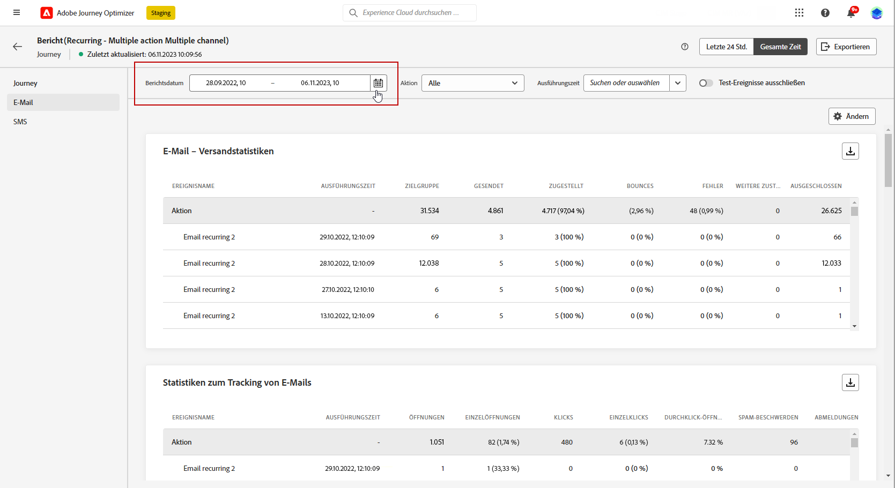

# Erste Schritte mit dem globalen Bericht {#global-report}

>[!NOTE]
>
> Wenn benutzerdefinierte Abfragen über APIs unter Verwendung des Abfrage-Service durchgeführt werden, treten bei Ihren Berichten möglicherweise Verzögerungen auf.

Mit dem **[!UICONTROL globalen Bericht]** können Sie die Effektivität Ihrer Journeys und Ihrer Sendungen über einen bestimmten Zeitraum messen.

* Wenn Sie eine Journey oder Sendungen innerhalb einer Journey auswählen möchten, greifen Sie im Menü **[!UICONTROL Journeys]** auf Ihre Journey zu und klicken Sie auf das Symbol **[!UICONTROL Bericht anzeigen]**. Dort finden Sie die globalen Berichte zu Journeys, E-Mail-Nachrichten, SMS und Push-Benachrichtigungen.

  

* Wenn Sie eine Kampagne als Ziel wählen möchten, rufen Sie im Menü **[!UICONTROL Kampagnen]** Ihre Kampagne auf und klicken auf die Schaltfläche **[!UICONTROL Berichte]**.

  

* Wenn Sie für Ihren Versand vom **[!UICONTROL Live-Bericht]** zum **[!UICONTROL globalen Bericht]** wechseln möchten, klicken Sie im Registerkartenumschalter auf **[!UICONTROL Gesamte Zeit]**.

  

Eine detaillierte Liste aller in Adobe Journey Optimizer verfügbaren Metriken finden Sie auf [dieser Seite](#list-of-components-global)

## Dashboard anpassen {#modify-dashboard}

Jedes Berichts-Dashboard kann durch das Ändern des Zeitraums und das Ändern der Größe von Widgets oder das Entfernen von Widgets geändert werden. Das Ändern der Widgets wirkt sich nur auf das Dashboard des aktuellen Benutzers aus. Andere Benutzer sehen ihre eigenen Dashboards oder die standardmäßig festgelegten.

1. Wählen Sie aus Ihrem globalen Bericht eine Start- und Endzeit aus, um auf bestimmte Daten zuzugreifen.

   

1. Sie können mit der Umschaltleiste auswählen, ob Sie Testereignisse aus Ihren Berichten ausschließen möchten. Weitere Informationen zu Testereignissen finden Sie auf [dieser Seite](../building-journeys/testing-the-journey.md).

   Beachten Sie, dass die Option **[!UICONTROL Test-Ereignisse ausschließen]** nur für Journey-Berichte verfügbar ist.

   

1. Klicken Sie auf **[!UICONTROL Ändern]**, um mit der Anpassung Ihres Dashboards zu beginnen.

   

1. Sie können die Größe der Widgets durch Ziehen an der rechten unteren Ecke anpassen.

   

1. Klicken Sie auf **[!UICONTROL Entfernen]**, um alle Widgets zu entfernen, die Sie nicht benötigen.

   

1. Wenn Sie mit der Anzeigereihenfolge und der Größe Ihrer Widgets zufrieden sind, klicken Sie auf **[!UICONTROL Speichern]**.

1. Um die Darstellung Ihrer Daten anzupassen, können Sie zwischen verschiedenen Visualisierungsoptionen, wie Graphen, Tabellen und Ringdiagrammen, wechseln.

   

Ihr Dashboard ist jetzt gespeichert. Ihre verschiedenen Änderungen werden bei einer späteren Verwendung Ihrer Live-Berichte erneut angewendet. Verwenden Sie bei Bedarf die Option **[!UICONTROL Zurücksetzen]**, um die Standard-Widgets und ihre Standardreihenfolge wiederherzustellen.

## Exportieren der Berichte {#export-reports}

Sie können Ihre Berichte einfach in PDF-Format exportieren, sodass Sie sie freigeben oder drucken können.

1. Klicken Sie in Ihrem Bericht auf **[!UICONTROL Exportieren]**.

   

1. Konfigurieren Sie das Dokument wie gewünscht im Drucken-Fenster. Beachten Sie, dass die Optionen je nach Browser variieren können.

1. Wählen Sie, ob Sie Ihren Bericht als PDF drucken oder speichern möchten.

1. Suchen Sie den Ordner, in dem Sie die Datei speichern möchten, benennen Sie diesen gegebenenfalls um und klicken Sie auf Speichern.

Ihr Bericht kann jetzt in einer PDF-Datei angezeigt oder freigegeben werden.

