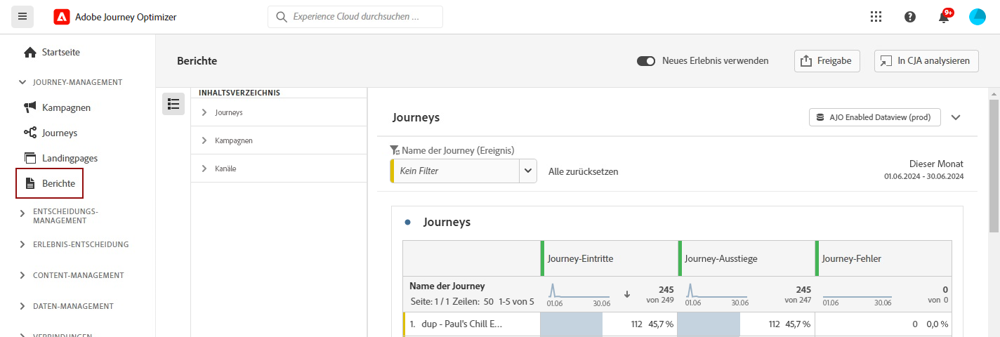

# Erste Schritte mit den Reporting-Funktionen {#get-started-report}

Adobe Journey Optimizer bietet durch seine zuverlässigen Reporting-Funktionen verwertbare Erkenntnisse. Berichte sind für Kampagnen, Journeys, Landingpages, Abonnement-Listen und mehr verfügbar. Die verfügbaren Berichte sind unten aufgeführt:

Um die Zustellbarkeit der [!DNL Journey Optimizer]-Erlebnisse zu optimieren, wird die Verwendung der in [diesem Abschnitt aufgeführten](deliverability.md) Best Practices empfohlen.

## Berichtstypen {#reporting-types}

* **Live-Berichte der letzten 24 Stunden** – Verwenden Sie den **[!UICONTROL Live-Bericht]**, um Auswirkung und Leistung der Journeys und Nachrichten in Echtzeit in einem integrierten Dashboard zu messen und zu visualisieren. Die Daten sind im **[!UICONTROL Live-Bericht]** verfügbar, sobald der Versand erfolgt ist oder die Journey auf der Registerkarte **[!UICONTROL Letzte 24 Std.]** ausgeführt wurde. Weitere Informationen zu Live-Berichten sind in [diesem Abschnitt](live-report.md) verfügbar.

  

* **Berichte für die gesamte Zeit mit Customer Journey Analytics** – Journey Optimizer-Reporting ist vollständig mit Customer Journey Analytics-Funktionen integriert, wodurch das Reporting plattformübergreifend standardisiert und die Datenkonsistenz und -zuverlässigkeit verbessert wird. Diese nahtlose Integration zwischen Journey Optimizer und Customer Journey Analytics bietet einen klareren Überblick über Leistungsmetriken und ermöglicht es Benutzenden, fundiertere Entscheidungen zu treffen. Weitere Informationen zu Berichten für die gesamte Zeit sind in [diesem Abschnitt](report-gs-cja.md) verfügbar.

  

  Wenn Sie über eine Adobe Customer Journey Analytics-Lizenz verfügen, können Sie Ihre Journey Optimizer-Berichte in Customer Journey Analytics analysieren. Diese leistungsstarke Option leitet Sie nahtlos zur Customer Journey Analytics-Umgebung weiter, sodass Sie Berichte umfassend personalisieren können. Sie können Widgets mit spezialisierten Customer Journey Analytics-Metriken anreichen, die Ihre Erkenntnisse auf eine völlig neue Ebene bringen. [Weitere Informationen](report-cja-manage.md)

## Tauchen wir tiefer in die Materie ein

Da Sie nun über Kenntnisse zu den Berichtstypen in **[!DNL Journey Optimizer]** verfügen, können Sie sich umfassender mit diesen Dokumentationsabschnitten befassen, um weitere Information über Reporting-Funktionen und den Zugriff auf sie zu erhalten.

<table style="table-layout:fixed"><tr style="border: 0;">
<td>

<strong>JOURNEY-BERICHTE</strong>

<a href="journey-live-report.md"><strong>Live-Bericht</strong></a>

<a href="journey-global-report-cja.md"><strong>Bericht für die gesamte Zeit</strong></a>

<a href="sharing-overview.md"><strong>Erstellen von Journey-Berichten</strong></a>

</td>
<td>

<strong>KAMPAGNENBERICHTE</strong>

<a href="campaign-live-report.md"><strong>Live-Bericht</strong></a>

<a href="campaign-global-report-cja.md"><strong>Bericht für die gesamte Zeit</strong></a>

</td>
<td>

<strong>LANDINGPAGE-BERICHTE</strong>

<a href="lp-report-live.md"><strong>Live-Bericht</strong></a>

<a href="lp-report-global-cja.md"><strong>Bericht für die gesamte Zeit</strong></a>

</td>
<td>

<strong>ABONNEMENT-LISTEN-BERICHTE</strong>

<a href="subscription-report-live.md"><strong>Live-Bericht</strong></a>

<a href="subscription-report-global-cja.md"><strong>Bericht für die gesamte Zeit</strong></a>

</td>
</tr></table>

Alle Berichte für die gesamte Zeit stehen für alle Ihre Kanäle zur Verfügung. Wählen Sie den Bericht für den Kanal aus, für den Sie weitere Details benötigen.

### Berichte für Outbound-Kanäle

Wählen Sie einen Outbound-Kanal aus, um zugeordnete **globale Berichte für die gesamte Zeit** zu finden.

<table style="table-layout:fixed"><tr style="border: 0;">
<td>

<strong>E-Mail-Kanal</strong>

<a href="campaign-global-report-cja-email.md"><strong>Kampagnenbericht</strong></a>

<a href="journey-global-report-cja-email.md"><strong>Journey-Bericht</strong></a>

</td>
<td>

<strong>SMS-Kanal</strong>

<a href="campaign-global-report-cja-sms.md"><strong>Kampagnenbericht</strong></a>

<a href="journey-global-report-cja-sms.md"><strong>Journey-Bericht</strong></a>

</td>
<td>

<strong>Push-Kanal</strong>

<a href="campaign-global-report-cja-push.md"><strong>Kampagnenbericht</strong></a>

<a href="journey-global-report-cja-push.md"><strong>Journey-Bericht</strong></a>

</td>
<td>

<strong>Direkt-Mail-Kanal</strong>

<a href="campaign-global-report-cja-direct.md"><strong>Kampagnenbericht</strong></a>

<a href="journey-global-report-cja-direct.md"><strong>Journey-Bericht</strong></a>

</td>
</tr></table>

### Berichte für eingehende Erlebnisse

Wählen Sie ein eingehendes Erlebnis aus, um zugeordnete **globale Berichte für die gesamte Zeit** zu finden.

<table style="table-layout:fixed"><tr style="border: 0;">
<td>

<strong>In-App-Kanal</strong>

<a href="campaign-global-report-cja-inapp.md"><strong>Kampagnenbericht</strong></a>

<a href="journey-global-report-cja-inapp.md"><strong>Journey-Bericht</strong></a>

</td>
<td>

<strong>Web-Kanal</strong>

<a href="campaign-global-report-cja-web.md"><strong>Kampagnenbericht</strong></a>

<a href="journey-global-report-cja-web.md"><strong>Journey-Bericht</strong></a>

</td>
<td>

<strong>Code-basierte Erlebnisse</strong>

<a href="campaign-global-report-cja-code.md"><strong>Kampagnenbericht</strong></a>

<a href="campaign-global-report-cja-code.md"><strong>Journey-Bericht</strong></a>

</td>
<td>

<strong>Inhaltskarten</strong>

<a href="campaign-global-report-cja-content.md"><strong>Kampagnenbericht</strong></a>

<a href="journey-global-report-cja-content.md"><strong>Journey-Bericht</strong></a>

</td>
</tr></table>

### Anleitungsvideo {#video}

Erfahren Sie, wie Sie den Bericht für die gesamte Zeit in Adobe Journey Optimizer effektiv verwenden.

+++Video ansehen

>[!VIDEO](https://video.tv.adobe.com/v/3422692?captions=ger&learn=on)

+++

Weitere Video-Tutorials zu Reporting und Analysen finden Sie unter [Reporting-Tutorials](https://experienceleague.adobe.com/de/docs/journey-optimizer-learn/tutorials/report-and-monitor/report-and-monitor){target="_blank"}
