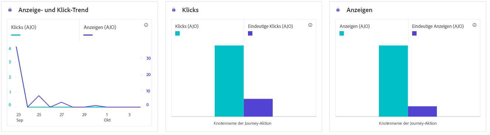
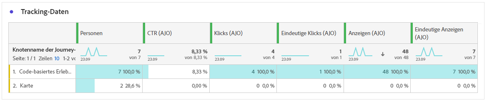

# Code-basierter Journey-Bericht {#journey-global-report}

>[!INFO]
>
> Ihr Journey-Bericht kann Informationen von mehreren Journeys gleichzeitig anzeigen, da Benutzende an mehr als einer Journey gleichzeitig beteiligt sein können. Daher können eingehende Nachrichten (In-App-, Web- und Code-basiert) in mehreren Journeys angezeigt werden, wenn sie für eine Benutzerin oder einen Benutzer ausgelöst wurden, die bzw. der an simultan aktiven Journeys teilnimmt, was zu einer Datenüberlappung führen kann.

>[!BEGINSHADEBOX]

Sie können Ihren Code-basierten Journey-Bericht aufrufen, indem Sie in der Journey auf die Schaltfläche **[!UICONTROL Bericht anzeigen]** klicken. [Weitere Informationen](report-gs-cja.md)

>[!ENDSHADEBOX]

>[!NOTE]
>
>Code-basierte Erlebnisse fungieren als eingehende Interaktionen, bei denen sich Benutzer per Zugriff auf Ihre Site oder Ihr Programm anmelden. Daher **die Metriken** Targeting **oder Audience**, mit denen für den ausgehenden Nachrichtenversand ausgewählte Profile verfolgt werden, für Code-basierte Kampagnen nicht inkrementiert.

## Anzeigen und Klicken {#impressions-code}

Die Diagramme **[!UICONTROL Anzeigen und Klicken]** bieten eine detaillierte Analyse der Interaktion Ihrer Profile mit Ihren Code-basierten Erlebnissen und liefern wertvolle Einblicke in die Interaktion von Profilen mit Ihren Inhalten.

+++ Weitere Informationen zu den Metriken „Impression und Klicks“

* **[!UICONTROL Einzelklicks]**: Die Anzahl der Profile, die auf einen Inhalt in Ihren Erlebnissen geklickt haben.

* **[!UICONTROL Klicks]**: Anzahl der Klicks auf einen Inhalt in Ihren Erlebnissen.

* **[!UICONTROL Anzeigen]**: Anzahl der Öffnungen des Erlebnisses.

* **[!UICONTROL Einzelanzeigen]**: Anzahl der Öffnungen des Erlebnisses, wobei mehrfache Interaktionen eines Profils nicht gezählt werden.

+++

## Tracking-Daten {#track-data-code}

Die Tabelle **[!UICONTROL Tracking-Daten]** bietet einen detaillierten Überblick über die Profilaktivitäten, die mit Ihren Code-basierten Erlebnissen verbunden sind, und liefert wichtige Erkenntnisse über die Interaktion und die Wirksamkeit der Erlebnisse.

+++ Weitere Informationen zu den Metriken „Tracking-Daten“

* **[!UICONTROL Personen]**: Anzahl der Benutzerprofile, die als Zielprofile für Ihre Erlebnisse infrage kommen.

* **[!UICONTROL Klickrate (CTR)]**: Prozentsatz der Benutzenden, die mit Ihren Erlebnissen interagiert haben.

* **[!UICONTROL Klicks]**: Anzahl der Klicks auf einen Inhalt in Ihren Erlebnissen.

* **[!UICONTROL Einzelklicks]**: Die Anzahl der Profile, die auf einen Inhalt in Ihren Erlebnissen geklickt haben.

* **[!UICONTROL Anzeigen]**: Anzahl der Öffnungen Ihres Erlebnisses.

* **[!UICONTROL Einzelanzeigen]**: Anzahl der Öffnungen Ihres Erlebnisses, wobei mehrfache Interaktionen eines Profils nicht gezählt werden.

+++

## Labels getrackter Links {#track-link-code}

Die Tabelle **[!UICONTROL Labels getrackter Links]** bietet einen umfassenden Überblick über die Linklabels innerhalb Ihrer Code-basierten Erlebnisse und hebt diejenigen hervor, die den höchsten Besucher-Traffic erzeugen. Mit dieser Funktion können Sie die beliebtesten Links identifizieren und priorisieren.

+++ Weitere Informationen zu den Metriken „Labels für verfolgten Link“

* **[!UICONTROL Einzelklicks]**: Die Anzahl der Profile, die auf einen Inhalt in Ihren Code-basierten Erlebnissen geklickt haben.

* **[!UICONTROL Klicks]**: Anzahl der Klicks auf einen Inhalt in Ihren Code-basierten Erlebnissen.

* **[!UICONTROL Anzeigen]**: Anzahl der Öffnungen des Erlebnisses.

* **[!UICONTROL Einzelanzeigen]**: Anzahl der Öffnungen des Erlebnisses, wobei mehrfache Interaktionen eines Profils nicht gezählt werden.

+++
