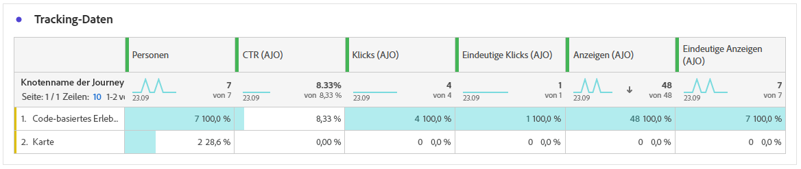

# Journey-Bericht zu Inhaltskarten {#journey-global-report}

## Anzeigen und Klicken {#displays-content-card}

Die Diagramme **[!UICONTROL Anzeigen und Klicken]** bieten eine detaillierte Analyse der Interaktion Ihrer Profile mit Ihren Inhaltskarten und liefern wertvolle Einblicke in die Interaktion von Profilen mit Ihren Inhalten.

+++ Weitere Informationen zu Anzeige- und Klick-Metriken

* **[!UICONTROL Einzelklicks]**: Anzahl der Profile, die auf einen Inhalt in Ihren Inhaltskarten geklickt haben.

* **[!UICONTROL Klicks]**: Anzahl der Klicks auf einen Inhalt in Ihrer Inhaltskarte.

* **[!UICONTROL Anzeigen]**: Anzahl der Öffnungen Ihrer Inhaltskarte.

* **[!UICONTROL Einzelanzeigen]**: Anzahl der Öffnungen der Inhaltskarte, wobei mehrfache Interaktionen eines Profils nicht berücksichtigt werden.

+++

## Tracking-Daten {#track-data-content}

Die Tabelle **[!UICONTROL Tracking-Daten]** bietet einen detaillierten Überblick über die Profilaktivität im Zusammenhang mit Ihren Inhaltskarten und liefert wichtige Erkenntnisse über die Interaktion und die Effektivität von Erlebnissen.

+++ Weitere Informationen zu Metriken für Tracking-Daten

* **[!UICONTROL Personen]**: Anzahl der Benutzerprofile, die sich als Zielgruppenprofile für Ihre Inhaltskarten eignen.

* **[!UICONTROL Klickrate (CTR)]**: Prozentsatz der Benutzenden, die mit Ihren Inhaltskarten interagiert haben.

* **[!UICONTROL Klicks]**: Anzahl der Klicks auf einen Inhalt in Ihrer Inhaltskarte.

* **[!UICONTROL Einzelklicks]**: Anzahl der Profile, die auf einen Inhalt in Ihren Inhaltskarten geklickt haben.

* **[!UICONTROL Anzeigen]**: Anzahl der Öffnungen Ihrer Inhaltskarte.

* **[!UICONTROL Einzelanzeigen]**: Anzahl der Öffnungen Ihrer Inhaltskarte, wobei mehrfache Interaktionen eines Profils nicht berücksichtigt werden.

+++

## Labels getrackter Links {#track-link-content}

Die Tabelle **[!UICONTROL Getrackte Labels]** bietet einen umfassenden Überblick über die Linklabels in Ihren Inhaltskarten und hebt diejenigen hervor, die den höchsten Besucher-Traffic generieren. Mit dieser Funktion können Sie die beliebtesten Links identifizieren und priorisieren.

+++ Weitere Informationen zu den Metriken der Bezeichnungen für verfolgte Links

* **[!UICONTROL Einzelklicks]**: Anzahl der Profile, die auf einen Inhalt in Ihren Inhaltskarten geklickt haben.

* **[!UICONTROL Klicks]**: Anzahl der Klicks auf einen Inhalt in Ihrer Inhaltskarte.

* **[!UICONTROL Anzeigen]**: Anzahl der Öffnungen der Inhaltskarte.

* **[!UICONTROL Einzelanzeigen]**: Anzahl der Öffnungen der Inhaltskarte, wobei mehrfache Interaktionen eines Profils nicht berücksichtigt werden.

+++
