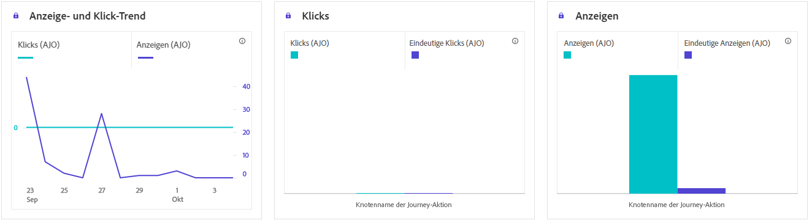

# Journey-Bericht zur Inhaltskarte {#journey-global-report}

## Anzeigen und Klicken {#displays-content-card}

Die Diagramme **[!UICONTROL Anzeigen und Klicken]** enthalten eine detaillierte Analyse der Interaktion Ihrer Profile mit Ihren Inhaltskarten und bieten wertvolle Einblicke in die Interaktion der Profile mit Ihrem Inhalt.

+++ Weitere Informationen zu Anzeigen- und Klickmetriken

* **[!UICONTROL Einzelklicks]**: Anzahl der Profile, die auf einen Inhalt in Ihren Inhaltskarten geklickt haben.

* **[!UICONTROL Klicks]**: Gibt an, wie oft auf einen Inhalt in Ihren Inhaltskarten geklickt wurde.

* **[!UICONTROL Anzeigen]**: Gibt an, wie oft Ihre Inhaltskarte geöffnet wurde.

* **[!UICONTROL Einzelanzeigen]**: Gibt an, wie oft die Inhaltskarte geöffnet wurde, wobei mehrere Interaktionen eines Profils nicht berücksichtigt werden.

+++

## Tracking-Daten {#track-data-content}

Die Tabelle **[!UICONTROL Tracking-Daten]** bietet eine detaillierte Momentaufnahme der Profilaktivität, die mit Ihren Inhaltskarten verknüpft ist und wichtige Einblicke in die Interaktion und Erlebniseffektivität bietet.

+++ Weitere Informationen zu Metriken für Tracking-Daten

* **[!UICONTROL Personen]**: Anzahl der Benutzerprofile, die als Zielprofile für Ihre Inhaltskarten gelten.

* **[!UICONTROL Durchklickrate (CTR)]**: Prozentsatz der Benutzer, die mit Ihren Inhaltskarten interagiert haben.

* **[!UICONTROL Klicks]**: Gibt an, wie oft auf einen Inhalt in Ihren Inhaltskarten geklickt wurde.

* **[!UICONTROL Einzelklicks]**: Anzahl der Profile, die auf einen Inhalt in Ihren Inhaltskarten geklickt haben.

* **[!UICONTROL Anzeigen]**: Gibt an, wie oft Ihre Inhaltskarte geöffnet wurde.

* **[!UICONTROL Einzelanzeigen]**: Gibt an, wie oft Ihre Inhaltskarte geöffnet wurde. Mehrere Interaktionen eines Profils werden nicht berücksichtigt.

+++

## Bezeichnungen für verfolgten Link {#track-link-content}

Die Tabelle **[!UICONTROL Getrackte Link-Beschriftungen]** bietet einen umfassenden Überblick über die Linkbeschriftungen in Ihren Inhaltskarten und zeigt diejenigen, die den höchsten Besucher-Traffic generieren. Mit dieser Funktion können Sie die beliebtesten Links identifizieren und priorisieren.

+++ Weitere Informationen zu den Metriken der Bezeichnungen für verfolgte Links

* **[!UICONTROL Einzelklicks]**: Anzahl der Profile, die auf einen Inhalt in Ihren Inhaltskarten geklickt haben.

* **[!UICONTROL Klicks]**: Gibt an, wie oft auf einen Inhalt in Ihren Inhaltskarten geklickt wurde.

* **[!UICONTROL Anzeigen]**: Gibt an, wie oft die Inhaltskarte geöffnet wurde.

* **[!UICONTROL Einzelanzeigen]**: Gibt an, wie oft die Inhaltskarte geöffnet wurde, wobei mehrere Interaktionen eines Profils nicht berücksichtigt werden.

+++
