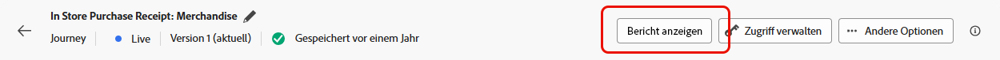
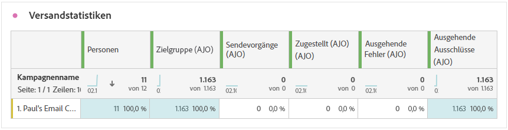
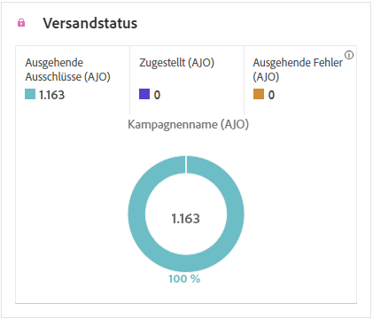

# Direkt-Mail-Journey-Bericht {#journey-global-report}

>[!BEGINSHADEBOX]

Sie können Ihren Direkt-Mail-Journey-Bericht aufrufen, indem Sie in der Journey auf die Schaltfläche **[!UICONTROL Bericht anzeigen]** klicken. [Weitere Informationen](report-gs-cja.md)

>[!ENDSHADEBOX]

## Versandstatistiken {#sending-statistics-directmail}

Die Tabelle **[!UICONTROL Versandstatistiken]** bietet Ihnen Erkenntnisse zur Performance Ihrer Direkt-Mail-Journey. Sehen Sie sich die Schlüsselmetriken wie die Anzahl der Zielgruppenempfängerinnen und -empfänger und erfolgreich zugestellten Teile an, damit Sie die Reichweite und Effektivität Ihrer Mailings messen können.

+++ Weitere Informationen zu den Metriken „Versandstatistiken“

* **[!UICONTROL Personen]**: Anzahl der Benutzerprofile, die sich als Zielgruppenprofile für Ihre Nachrichten eignen.

* **[!UICONTROL Zielgruppe]**: Anzahl der Profile, die sich für die Zielgruppe qualifiziert haben, bevor Ausschlüsse, Unterdrückungen oder Einverständnisentnahmen angewendet wurden. In Journey mit aktiviertem erneuten Eintritt kann ein Profil mehrmals angesprochen werden.

* **[!UICONTROL Sendevorgänge]**: Gesamtzahl der Sendevorgänge für Ihre Direkt-Mail-Nachrichten.

* **[!UICONTROL Zugestellt]**: Anzahl der erfolgreich gesendeten Direkt-Mail-Nachrichten im Verhältnis zur Gesamtzahl der gesendeten Nachrichten.

* **[!UICONTROL Ausgehende Fehler]**: Gesamtzahl der während des Sendevorgangs aufgetretenen Fehler, die das Senden an Profile verhindert haben.

* **[!UICONTROL Ausgehende Ausschlüsse]**: Anzahl der Profile, die durch Adobe Journey Optimizer ausgeschlossen wurden.

+++

## Versandstatus {#delivery-status-directmail}

Der Graph **[!UICONTROL Versandstatus]** bietet einen umfassenden Überblick über Daten zu gesendeten Direkt-Mail-Nachrichten in Ihrer Journey und liefert Erkenntnisse zu Schlüsselmetriken wie zugestellte Nachrichten und Fehler. Dies ermöglicht eine detaillierte Analyse des Sendevorgangs von Direkt-Mail-Nachrichten und liefert wertvolle Informationen über die Effizienz und Performance Ihrer Journeys.

+++ Weitere Informationen zu den Metriken „Versandstatus“

* **[!UICONTROL Zugestellt]**: Anzahl der erfolgreich gesendeten Direkt-Mail-Nachrichten im Verhältnis zur Gesamtzahl der gesendeten Direkt-Mail-Nachrichten.

* **[!UICONTROL Ausgehende Fehler]**: Gesamtzahl der während des Sendevorgangs aufgetretenen Fehler, die das Senden Ihrer Direkt-Mail-Nachrichten an Profile verhindert haben.

* **[!UICONTROL Ausgehende Ausschlüsse]**: Anzahl der Profile, die durch Adobe Journey Optimizer ausgeschlossen wurden.

+++

## Fehlergründe {#error-reasons-directmail}

Anhand der Tabelle **[!UICONTROL Fehlergründe]** können Sie die spezifischen Fehler identifizieren, die während des Sendevorgangs Ihrer Direkt-Mail-Nachrichten aufgetreten sind. Dies ermöglicht eine gründliche Analyse aller aufgetretenen Probleme.

## Gründe für Ausschluss {#exclude-reasons-directmail}

Die Tabelle **[!UICONTROL Gründe für Ausschluss]** zeigt visuell die verschiedenen Faktoren auf, die zum Ausschluss von Benutzerprofilen aus der Zielgruppe geführt haben, sodass diese keine Direkt-Mail-Nachrichten von Ihnen erhalten konnten.

Auf [dieser Seite](exclusion-list.md) finden Sie eine umfassende Liste der Ausschlussgründe.
